# AI Assistant

BTFViewer's AI Assistant helps you investigate RTOS traces.

It organizes measured evidence, tests possible explanations, and guides you back to the relevant timeline region.

> **Scope:** AI works with BTFViewer Findings, Statistics, timeline queries, and Trace Compare results. It does not read firmware source or ELF files. `what_if` results are heuristic estimates. They are not RTOS scheduler simulations or measured trace data.

## Where to start

| Your goal | Read |
| --- | --- |
| Learn the product and open the AI panel | [README.md → AI Assistant](README.md#ai-assistant) |
| Follow a repeatable diagnosis procedure | [WORKFLOWS.md](WORKFLOWS.md) |
| Understand a metric or Statistics page | [STATISTICS.md](STATISTICS.md) |
| Configure, evaluate, or implement the AI system | This document |

For a first investigation, use this sequence:

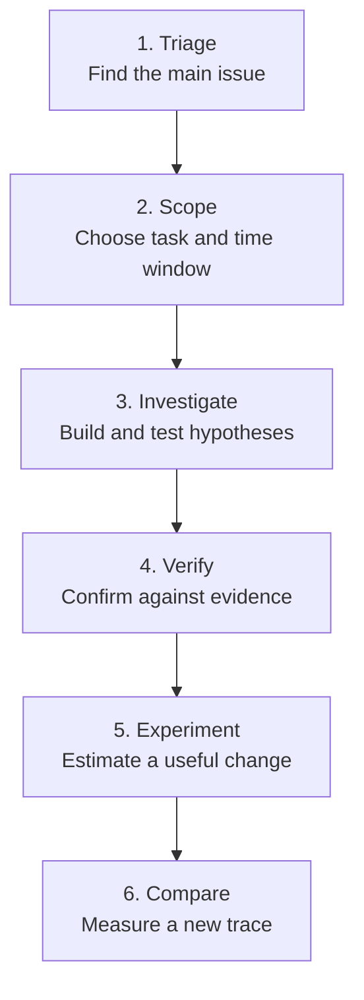

The key rule is simple: **do not jump from a finding directly to a mitigation**. Scope the incident, investigate the cause, verify the evidence, then experiment and compare.

## Contents

### User guide

1. [Overview](#overview)
2. [Getting started](#getting-started)
3. [Investigation workflows](#investigation-workflows)
4. [Common use cases](#common-use-cases)
5. [Understanding AI results](#understanding-ai-results)
6. [Configuration, models, and privacy](#configuration-models-and-privacy)
7. [AI tools reference](#ai-tools-reference)
8. [Desktop and web behavior](#desktop-and-web-behavior)
9. [Troubleshooting](#troubleshooting)
10. [Opening the web app from `file://`](#opening-the-web-app-from-file)

### Engineering reference

11. [CLI regression gate](#cli-regression-gate)
12. [Benchmark and evaluation suite](#benchmark-suite) — [Context mode benchmarking](#context-mode-benchmarking)
13. [Investigation Case](#investigation-case)
14. [Investigation planner](#investigation-planner)
15. [Causal and temporal engines](#causal-engines)
16. [Implementation notes](#implementation-notes)
17. [Diagrams](#diagrams)

---

<a id="overview" name="overview">&#x200B;</a>

## Overview

This section explains what the AI Assistant does, what evidence it uses, and where its responsibility ends.

### Data flow and responsibility

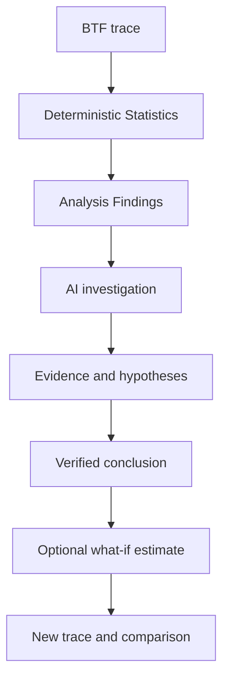

The AI receives structured Findings and summary metrics. It does not receive the complete raw event stream.

When more detail is needed, it requests scoped evidence through the [GUI tools](#ai-tools-reference). This evidence can include:

- per-task metrics;
- timeline search results;
- correlations;
- critical paths;
- Trace Compare tables.

The AI still does not read the raw `.btf` file directly.

AI can explain evidence, find correlations, rank possible causes, challenge assumptions, and make estimates.

**Deterministic Statistics and the timeline remain the source of truth.**

### What the panel does

- **Start Investigation** runs **Auto investigate** when the log is empty.
- The stepper tracks **Triage → Scope → Investigate → Verify → Experiment → Compare**. Select a completed stage to return to its output.
- **Investigate**, **Root cause**, **Verify finding**, **Auto investigate**, **What-if**, **Optimize**, and **Diagnostic report** display an Investigation plan.
- **Clear** removes the conversation, resets usage, and clears the current investigation.
- The usage bar shows **Context: Compact · 4.6k tok · 3 tools · 12s** (mode, tokens, tools, and model time). **Settings → AI → Context** chooses Compact, Balanced (default), or Full evidence.
- A non-empty `investigation_session` restores after restart only when the log still has a user or assistant turn. An empty or cleared log does not restore a Current Issue card.
- Read-only tools and `export_report` / `export_investigation` run immediately. GUI-changing actions wait for **Apply** unless **Auto-apply GUI actions** is enabled. Desktop exports open a save dialog; the web app downloads the file.

Toolbar **Compare** becomes available when at least two traces are open. **Query with AI…** sends the Trace Compare tables rather than the current Findings. **Save as baseline** and **Score vs baseline** use the same stored profile as `baseline_score`. **Ctrl+K** provides quick access to Analysis, AI, Compare, workspace presets, and Inspect task.

### Scoping an event or region

| Entry point | Scope |
| --- | --- |
| Timeline segment → **Ask AI about this event** | The selected task, core, and segment around `jump:TIME` |
| Timeline → **Explain this region with AI** | Available with at least two cursors; uses C1–Cn |
| AI panel → **Explain region** | Uses C1–Cn when available; otherwise uses full-trace Findings |

Enable **Limit to C1–Cn** when diagnosing a phase-specific issue. The prompt then includes `Cursor region window: jump:lo … jump:hi`, and every cited `jump:TIME` should remain inside that interval.

AI context also carries the same **Filter** and **Selection** representation shown in the status bar and Legend (Task Filter, Core Filter, Migration Filter, and current Selection). Highlight remains visual-only and is not treated as a Filter. Cross-surface Evidence Navigation and Ask-AI-from-Findings expansion remain later workflows; use toolbar **Analysis → Investigate** for the non-AI Statistics jump.

<a id="getting-started" name="getting-started">&#x200B;</a>

## Getting started

Start here if you are using the AI Assistant for the first time.

This section explains how the AI supports common investigations. For symptom-to-metric playbooks and exact ask order, use [WORKFLOWS.md](WORKFLOWS.md).

### First investigation

Do not start by choosing individual tools.

Start with the main user actions. Let **Investigate** select deeper evidence tools when they are needed.

| Step | Action | Expected result | Check before continuing |
| --- | --- | --- | --- |
| **1. Triage** | **Triage findings** or toolbar **Analysis** | Ranked Critical, Warning, and Info issues | The named Statistics page shows the same issue |
| **2. Scope** | Select a finding and place or apply C1–Cn | One task, incident, or time window | Enable **Limit to C1–Cn** for phase-specific questions |
| **3. Investigate** | **Investigate**; use **Root cause** when a suspect is known | Hypotheses, correlations, dependencies, and critical paths | Open the cited `jump:TIME`, `range:LO/HI`, and Statistics pages |
| **4. Verify** | **Verify with AI…** or continue the plan | Supported, rejected, or insufficient verdict | Confirm scope, task names, times, contradictions, and alternatives |
| **5. Experiment** | **What-if**, **Optimize**, or an experiment plan | Ranked estimated changes | Treat results as estimates; change the system and capture a new trace |
| **6. Compare** | Open before/after traces → **Compare** | Measured deltas and experiment verdict | Use equivalent workloads and comparable cursor scopes |

For normal use, remember only these actions: **Triage findings**, **Investigate**, **Verify with AI…**, **Explain region**, **What-if / Optimize**, and **Trace Compare**. Function names such as `correlate_events` and `rank_root_causes` are advanced and implementation references.

### End-to-end flow

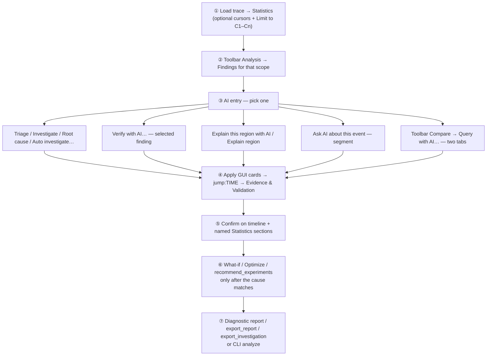


Do not ask for a fix before the timeline supports the finding.

Empty Statistics or the wrong scope can produce an answer that sounds confident but has weak evidence.

Prefer built-in templates. They already use the expected metrics and units.

<a id="investigation-workflows" name="investigation-workflows">&#x200B;</a>

## Investigation workflows

Use these workflows after you have selected the task, finding, or time window to investigate.

### Investigation workflow


| Step | Template or tool                                                        | Why                                                                                                                      |
| ---- | ----------------------------------------------------------------------- | ------------------------------------------------------------------------------------------------------------------------ |
| 1    | **Triage findings** / `detect_anomalies`                                | Rank Critical / Warning / Info; open Timeline Anomalies / Worst Events / Task Health                                     |
| 2    | **Investigate** / `investigate` — or Findings **Auto investigate…**     | Root-cause chain, hypotheses, alternatives, suggested tools                                                              |
| 3    | **Verify finding** / Findings **Verify with AI…**                       | Confirmed / Rejected / Inconclusive with jump:TIME evidence                                                              |
| 4    | `correlate_events` + `query_raw_metric`                                 | Merge blocking / execution / migrations / sync / PI for one task                                                         |
| 5    | `find_critical_path` / `detect_priority_inversion`                      | Preempt/block path; L/M/H inversion suspects                                                                             |
| 6    | `build_task_dependency_graph` / `analyze_temporal_causality`            | BTF wait/preempt/migrate chain                                                                                           |
| 7    | `rank_root_causes` / `challenge_conclusion`                             | Rank then alternatives before `what_if`                                                                                  |
| 8    | `find_related_findings` / `compare_tasks`                               | Adjacent findings; side-by-side task deltas                                                                              |
| 9    | `set_cursors` / `zoom_to_range` / `highlight_task` / `bookmark_finding` | Narrow the timeline (Apply cursors unless auto-apply is on); click `range:LO/HI` / `btfrange:` on critical-path evidence |
| 10   | Evidence & Validation panel                                             | Status, direct-evidence table, checks, missing evidence, next action; details hold quality/cost/trees                    |
| 11   | `investigation_replay` / `generate_report` / `export_investigation`     | Structured close-out; optional `export_report`                                                                           |


**Root cause** walks deadline/WCET → preemption → blocking → mutex → inheritance → migration for the top finding. Use it when triage already named a suspect task.

**Auto investigate** chains verify-style steps for one finding (investigate → correlate → critical path / graph / temporal → rank → challenge → what-if) and advances the Investigation plan checklist. Use **Verify** when you already have a finding id and want a short verdict.

### Explain region and Ask event


| Entry                                          | When it appears                                  | Scope                                                        |
| ---------------------------------------------- | ------------------------------------------------ | ------------------------------------------------------------ |
| Timeline → **Explain this region with AI**     | Only with **≥2 cursors**; grayed when AI is off  | C1–Cn; prompt gets `Cursor region window: jump:lo … jump:hi` |
| AI panel → **Explain region**                  | Always                                           | Same window when ≥2 cursors; **full-trace Findings** if none |
| Timeline segment → **Ask AI about this event** | Segment under the pointer; grayed when AI is off | One task / core / segment around `jump:TIME`                 |


Stay inside the stated window: every `jump:TIME` in the reply should fall between C1 and Cn (or the model should say the window has no matching evidence). Enable **Limit to C1–Cn** so Statistics / Findings / `query_raw_metric` match that window. Clicking a `jump:TIME` outside the cursors usually means the model invented or reused a full-trace time — discard it and re-ask with cursors + scoped Findings.

<a id="what-if-and-optimize-workflow" name="what-if-and-optimize-workflow">&#x200B;</a>

### What-if and optimize workflow

`what_if` and `optimize_experiment` are **heuristic slice-replay** tools: they reallocate measured execution slices, scale migrations / blocking, and adjust core-util balance. They do **not** simulate an RTOS kernel or a deterministic scheduler. Every result carries a disclaimer. After a promising estimate, `recommend_experiments` suggests validation steps (simulation / firmware / measurement).


| Goal                          | What to run                                                                           | Typical change phrases                                                                 |
| ----------------------------- | ------------------------------------------------------------------------------------- | -------------------------------------------------------------------------------------- |
| One concrete idea             | **What-if** → `what_if`                                                               | `pin CS[28] to Core_0`, `raise priority of Low[266]`, `reduce mutex contention 50%`    |
| Rank several ideas            | **Optimize** → `optimize_experiment` (then optional `optimize` for qualitative notes) | Host picks pin-to-dominant / quiet core, contention −50%, priority up, migrations −50% |
| Soft advice only              | `optimize`                                                                            | Finding-text mitigations without scored experiments                                    |
| What to try next on the bench | `recommend_experiments`                                                               | Validation experiments from findings heuristics                                        |


**How to read the result:**

Compare `baseline` with `simulated`. Check:

- `migrations`;
- `blocking_ns`;
- `load_balance_score`;
- the `deltas.cost` ranking.

A lower cost is better in the Experiment List.

**Medium confidence** means the change is worth testing on real hardware. **Low confidence** usually means the change description was vague or there were too few slices.

<a id="use-cases" name="use-cases">&#x200B;</a>

<a id="common-use-cases" name="common-use-cases">&#x200B;</a>

## Common use cases

These examples show how to apply the workflow to common RTOS trace problems.

### Use cases


| Situation                     | Before you ask                                 | Template / tools                                                                                            | Then verify                                                                                            |
| ----------------------------- | ---------------------------------------------- | ----------------------------------------------------------------------------------------------------------- | ------------------------------------------------------------------------------------------------------ |
| Unknown — first look          | Full-trace or cursor-scoped Findings           | **Triage findings** → **Investigate**                                                                       | Timeline Anomalies / Worst Events / Task Health; `jump:TIME`                                           |
| Hottest / noisiest task       | Findings name a suspect                        | **Task profile**                                                                                            | Period / Jitter; Task Health; Task × Core; Execution / Blocking p95/p99                                |
| Tick jitter / missed ticks    | Trace Health in scope                          | **Tick health**                                                                                             | Tick Distribution (not Period / Jitter — that page is task inter-arrival)                              |
| Confirm one finding           | Select it in Analysis Findings                 | **Verify with AI…** / **Verify finding**                                                                    | Evidence panel; timeline                                                                               |
| Explain a time window         | ≥2 cursors; **Limit to C1–Cn** on              | Context menu or **Explain region**                                                                          | Only `jump:TIME` inside C1–Cn                                                                          |
| One segment / ISR slice       | Right-click the segment                        | **Ask AI about this event**                                                                                 | That task’s row; nearby STI                                                                            |
| Auto walk a finding           | Select finding → **Auto investigate…**         | `auto_investigate`                                                                                          | Investigation plan + Evidence                                                                          |
| Migration thrash / ping-pong  | Scope thrash window; Findings mention the task | **Migration thrash** → `correlate_events` → **What-if** pin / **Optimize**                                  | Task × Core; Timeline Anomalies migration bursts; Migrations Rate/Ping; Heatmap / Chord; Core Affinity |
| Priority inversion / PI boost | Inheritance finding or PI episodes in scope    | **Priority inversion** / `detect_priority_inversion` → `find_critical_path`                                 | Priority Inheritance; Mutex hold; Waiter × Owner (heuristic handoff)                                   |
| High blocking / mutex wait    | Scope the stall; suspect task known            | **Highest latency** → `query_raw_metric` blocking/sync → **What-if** contention / priority                  | Worst Events; Waiter × Owner; Blocking p95/p99; Mutex hold; Priority Inheritance                       |
| WCET / deadline pressure      | Thresholds set in Display → Analysis           | **WCET / hot CPU** or **Deadline / budget** → `check_budget`                                                | Timeline Anomalies / Worst Events; Period / Jitter; Task Health; Execution Max / p95 / p99; Deadlines  |
| Compare two tasks             | Both names known                               | `compare_tasks`                                                                                             | Execution / Blocking / Migrations side-by-side                                                         |
| Related findings              | One finding selected                           | `find_related_findings`                                                                                     | Shared task / metric / nearby times                                                                    |
| Load imbalance across cores   | Multi-core util in Findings                    | **Core balance** → `analyze_traces` (multi-tab) or **What-if** pin to quiet core                            | Task × Core; Load Balance Score; Concurrent Active; Core Time Breakdown                                |
| A vs B build regression       | Two tabs open                                  | **Trace Compare** (toolbar **Compare** → **Query with AI…**) / `compare_performance` / `regression_explain` | Compare summary strip; Trace Compare pages; same scope on both builds                                  |
| Drift vs saved baseline       | Baseline profile stored (rc / localStorage)    | `baseline_score`                                                                                            | Flags `|z|>2`; re-capture if needed                                                                    |
| Rank all open traces          | ≥2 loaded tabs                                 | `analyze_traces`                                                                                            | Best tab vs Migrations / LB / missed ticks                                                             |
| Write-up for a review         | Cause already confirmed                        | **Diagnostic report** → `generate_report` → `export_report` / `export_investigation`                        | Saved HTML/CSV/JSON; evidence times bookmarked                                                         |
| CI gate vs baseline           | Desktop CLI                                    | [`analyze`](#cli-regression-gate) with `--fail-on-regression` (optional `--ai`)                             | Exit code + Markdown narrative                                                                         |


### Worked examples

#### Migration thrash → pin affinity

1. Place cursors on the thrash window; enable **Limit to C1–Cn**; re-open Analysis.
2. Run **Migration thrash** or **Investigate** until the hot task (e.g. `CS[22]`) and cores match the heatmap.
3. Ask **What-if**: *pin CS[22] to its dominant core* (or run **Optimize** for ranked candidates).
4. Read Δmigrations / Δload_balance_score. If migrations drop but LB worsens sharply, try pin-to-quietest via `optimize_experiment` and compare ranks.
5. On firmware: set affinity / reduce bounce; re-capture a `.btf` and toolbar **Compare** the before/after tabs.

#### Mutex contention → shorter critical section

1. **Highest latency** / `correlate_events` for the waiter; confirm hold episodes in Mutex / Priority Inheritance.
2. **What-if**: *reduce mutex contention 50% for TASK* (or another %).
3. Expect lower `blocking_ns` in the simulated payload — still an estimate. Confirm by shortening the hold in code and re-tracing.

#### Two builds → regression narrative

1. Open baseline and candidate as tabs; match cursor scope if needed.
2. Toolbar **Compare**, then **Query with AI…** (**Trace Compare** template), or `compare_performance` then `regression_explain`.
3. Act only on High/Medium confidence deltas that Statistics on both tabs reproduce.
4. Optional: `optimize_experiment` on the candidate’s hottest task to sketch mitigations (still heuristic).

#### Cursor window → Explain region

1. Place **C1** / **C2** on the phase of interest (e.g. 1.060 s … 1.120 s); enable **Limit to C1–Cn**; re-open Analysis.
2. Right-click the timeline → **Explain this region with AI** (or AI panel → **Explain region**).
3. Confirm the user turn lists `Cursor region window: jump:lo … jump:hi`. Reject any `jump:TIME` outside that window.
4. Follow up with `correlate_events` / `query_raw_metric` on tasks named in-window; bookmark evidence times.

#### Priority inversion finding → Verify

1. Open Analysis Findings; select a Priority Inheritance / inversion row.
2. **Verify with AI…** (or **Auto investigate…** for a longer chain).
3. Expect `detect_priority_inversion` / `query_raw_metric` (priority_inheritance) / `find_critical_path`; read the Evidence score and investigation tree.
4. Click in-scope `jump:TIME` links; confirm L/M/H on the timeline and in Priority Inheritance statistics.

### Simulator limits


| Does                                                                         | Does not                                           |
| ---------------------------------------------------------------------------- | -------------------------------------------------- |
| Replay measured slices / migrations / blocking gaps for the Statistics scope | Run RTOS scheduling, ISRs, or cache models         |
| Score pin / priority / contention / migration experiments                    | Guarantee WCET or deadline after a firmware change |
| Label every result as estimate / not measured                                | Replace timeline verification or a new capture     |


Phrase changes as **pin / affinity / priority / mutex / migration** so the simulator engages; vague text falls back to a qualitative estimate (`simulator: none`).

---


<a id="understanding-ai-results" name="understanding-ai-results">&#x200B;</a>

## Understanding AI results

AI output is an interpretation of measured evidence. Use this section to understand evidence, validation, and confidence before accepting a conclusion.

### Evidence and validation

Important conclusions should include:

- evidence links such as `jump:TIME`, `range:LO/HI`, and named metrics;
- confidence: **High**, **Medium**, or **Low**;
- evidence quality: **Directly observed**, **Strong correlation**, **Possible explanation**, or **Insufficient evidence**;
- alternative explanations and what would disprove the conclusion.

The Evidence & Validation panel shows:

- conclusion **Status** (Confirmed / Correlated / Suspected / Not observed / Insufficient data);
- **Finding**, a clickable **Direct evidence** table, and **Interpretation**;
- **Checks**, alternative explanations, **Missing evidence**, and one **Next action**;
- **Investigation details** for quality band, cost, tool reasons, and trees.

The Evidence Quality band (under Investigation details) is a diagnostic heuristic. It is **not a probability**.

After the final reply, the host validator checks task names and timestamps. It flags unknown task names and timestamps outside the cursor window.

Prefer built-in templates. They already select the relevant metrics and Statistics pages. Use natural-language questions such as “find STI wait around TaskA” when needed; the host routes them through `search_timeline`. **Analysis Findings** can triage overall findings. **Explain finding** explains the selected Analysis Finding. Other chips: **Explain region**, **Investigate**, **Verify finding**, **Root cause**, **Trace Compare**, **Triage findings**, **Task profile**, **Diagnostic report**, **What-if**, **Optimize**, **Highest latency**, **WCET / hot CPU**, **Migration thrash**, **Core balance**, **Tick health**, **Priority inversion**, **Deadline / budget**, **Auto investigate**. Findings also offer **Save recipe…** and **Story…**.

Named Statistics pages the templates cite: Timeline Anomalies, Worst Events, Period / Jitter, Unified Jitter, Recurring Patterns, Task Health, Task × Core, Waiter × Owner, Response Time, Critical Path, Preemption Matrix, Mutex Blocking, Core Utilization Over Time.

---

<a id="workflows-and-use-cases" name="workflows-and-use-cases">&#x200B;</a>

<a id="configuration-models-and-privacy" name="configuration-models-and-privacy">&#x200B;</a>

## Configuration, models, and privacy

### Connect an endpoint

You can use any OpenAI-compatible endpoint, including Ollama (`http://localhost:11434/v1`).

Chat requests time out after 120 seconds. **Stop** can cancel a request earlier.

Use a context window of at least **8k** when possible. This gives enough room for a full Findings card and one tool round.

If a local model has a smaller context window, use **Settings → AI → Context → Compact**. Compact reduces Findings, tool schemas, tool rows, and chat history.

The shipped Ollama default is `qwen3.5:9b`:

```bash
ollama pull qwen3.5:9b
```

Larger local models (`qwen3.5:27b`, `qwen3.8:27b`, and `gemma4:26b`) require more memory and usually run more slowly. More parameters do not guarantee a better BTFViewer investigation result. In the recorded suite, `qwen3.8:27b` reached the same best Overall score as `qwen3.5:9b`, but its mean latency was about 20 times higher. Older 7B/14B ids such as `qwen2.5:7b` stay optional. Avoid 3B-class models for investigations: they often skip native tools, return tool JSON as text, or fail multi-step cases.

Configuration examples are available in [examples/ai](examples/ai/README.md): [ollama.json](examples/ai/ollama.json), [gemini.json](examples/ai/gemini.json), [openai.json](examples/ai/openai.json), [deepseek.json](examples/ai/deepseek.json), [grok.json](examples/ai/grok.json), and [presets.json](examples/ai/presets.json).

Importing a preset fills **Settings → AI**, including any checkbox flags defined by the file. Review the values before saving. Each preset keeps its own base URL, model, API key, authentication mode, and TLS setting. Unknown preset names are added to the model list.

| Field | Meaning |
| --- | --- |
| Authentication | none / API key / Sign in, per preset |
| Model picker | Refresh the served id list, then pick a model |
| Self-signed TLS | Desktop **Allow self-signed TLS** skips certificate checks for that preset |

API keys use the same precedence on Desktop and Web: Settings → AI first, then `OPENAI_API_KEY`, then `GEMINI_API_KEY`, then `OLLAMA_API_KEY`.

1. Key entered in **Settings → AI**
2. `OPENAI_API_KEY`
3. `GEMINI_API_KEY`
4. `OLLAMA_API_KEY`

A local Ollama endpoint normally needs no key. For a custom endpoint, enter its key in the corresponding preset. Live `ai-test` XML may use `<api-key env="VAR">`. See [README → API keys](README.md#ai-api-keys) for complete examples.

### Choose a model


| Capability                                                    | Small local | Local 9B+ | Cloud |
| ------------------------------------------------------------- | ----------- | --------- | ----- |
| Basic Q&A                                                     | ✓           | ✓         | ✓     |
| Tool calling                                                  | △           | ✓         | ✓     |
| Investigation (`investigate` / root-cause chain / hypotheses) | △           | ✓         | ✓     |
| Complex reasoning (multi-step correlation, alternatives)      | △           | ✓         | ✓     |
| Large traces (big Findings card / long chat history)          | △           | △         | ✓     |
| What-if / optimize (`what_if`, `optimize_experiment`)         | ✓           | ✓         | ✓     |


✓ reliable · △ inconsistent — works sometimes but often skips native tool calls, hallucinates numbers, or truncates on long context; always verify against the timeline before trusting a result.

The recommendations below are based on the 17-case run recorded on 2026-08-19. Scores and latency can change with the endpoint, hardware, model build, and dataset.

| If you… | Use |
| --- | --- |
| Want the practical local default without an API key | `qwen3.5:9b` with **Balanced**. It passed 15/17 cases at 14.5s/case. **Full evidence** produced its highest Overall score, 88, but passed 14/17 cases at 16.2s/case. |
| Want a fast cloud response | `gemini-3.5-flash-lite` with **Full evidence**. It scored 83, passed 13/17 cases, and averaged 2.6s/case. |
| Want the best result from the shipped Gemini models | `gemini-3.7-flash` with **Full evidence**. It scored 85 and passed 14/17 cases at 25.0s/case. |
| Want a second local comparison and can accept high latency | `qwen3.8:27b` with **Balanced**. It scored 88 and passed 13/17 cases, but averaged 325.2s/case. It did not provide a consistent quality advantage over `qwen3.5:9b`. |
| Can use an optional cloud model outside the shipped suite | `gpt-5.6-sol` with **Compact** produced the highest recorded result: Overall 90, 16/17 PASS, and 10.4s/case. It is not included in the shipped benchmark configuration. |
| Handle confidential traces | Use local Ollama. The raw trace and extracted evidence remain on the local machine. |


Small local models may skip native tool calls and emit a fenced `btftool` block instead. The viewer renders the same GUI cards either way, but investigation-heavy templates need a tool-capable model such as `qwen3.5:9b` to chain calls reliably.

### Credential storage


|                   | Desktop                                                                                         | Web                                                       |
| ----------------- | ----------------------------------------------------------------------------------------------- | --------------------------------------------------------- |
| Where keys live   | `[ai] *_api_key` in `btf_viewer.rc` next to the viewer                                          | Browser `localStorage` (`btf-viewer-settings-v1`)         |
| At rest           | Encrypted as `enc1:…` (machine-bound; not portable to another host)                             | **Plaintext** in localStorage — treat as convenience only |
| Sent to the model | Never as a chat field; only as the HTTP `Authorization` / API header to the configured endpoint | Same                                                      |
| Clear             | Settings → AI → clear key, or delete `btf_viewer.rc` AI keys                                    | Settings → Reset / clear site data                        |


### What leaves the machine

| Sent to the configured AI endpoint | Not sent |
| --- | --- |
| Analysis Findings: titles, severities, task names, and heuristic text | Raw `.btf` or `.btf.gz` bytes |
| Metrics and tool results requested by the model | The complete unrequested event stream |
| Scoped timeline search and correlation results | API keys in the prompt body |
| Trace Compare tables when requested | — |
| User question and short conversation history | — |


|                                      | Local Ollama  | Cloud endpoint       |
| ------------------------------------ | ------------- | -------------------- |
| Trace file stays local               | ✓             | ✓                    |
| Findings / metrics leave the machine | No (loopback) | Yes — to that vendor |
| Raw BTF uploaded                     | No            | No                   |
| API key required                     | Usually no    | Usually yes          |


Prefer local Ollama for confidential traces. Redact sensitive task names in annotations before using a cloud preset.

<a id="context-mode-token-usage" name="context-mode-token-usage">&#x200B;</a>

### Context mode (token usage)

**Settings → AI → Context** controls how much evidence is sent with each request. Compact is the token-efficient packing mode. It reduces input tokens; Compact also caps the reply at about 300–500 tokens.

| | Compact | Balanced (default) | Full evidence |
| --- | --- | --- | --- |
| Findings | Top 5 by severity | Top 12 | All in scope |
| Tool schemas | Current stage + search / raw metric | Stage plus neighbours | Complete catalog |
| Tool results | 10 rows; rest summarised | 20 rows | 40 rows |
| Chat history | Investigation summary + last 2 turns | Last 6 turns | Last 20 turns |
| Diagrams | Only if requested | When useful | When useful |
| What-if | Top 3 candidates | Top 5 | Complete |

Compact still keeps the cursor region window, real task names, `jump:TIME` / `range:LO/HI`, measurements with units, confidence / evidence quality, what-if disclaimers, and at least one alternative or falsification. If Compact omits a relevant finding, ask for a specific finding id or select a larger mode.

More context did not consistently improve the benchmark result. `qwen3.5:9b` had its best pass count in Balanced, while `gpt-5.6-sol` had its best score in Compact. `qwen3.8:27b` and `claude-sonnet-5` also scored lower in Full evidence than in Balanced. Treat Balanced as the general starting point, then use **`--compare-context`** on the intended model and workload. Select Full evidence when the investigation actually needs the additional findings, tool catalog, or history; do not assume it is always more accurate or faster.

Live `ai-test` defaults to Full evidence. Use **`--compare-context`** to measure all three modes, or **`--context-mode compact`** (or `balanced`) for a single mode. Settings → Context does not apply to the CLI scorer.

---


<a id="ai-tools-reference" name="ai-tools-reference">&#x200B;</a>

## AI tools reference

Read-only evidence tools and export tools (`export_report`, `export_investigation`) run immediately; GUI-changing tools wait for **Apply** unless **Auto-apply GUI actions** is on. Names and parameters are in [Complete GUI tool reference](#complete-gui-tool-reference) below.

It is easier to understand the AI tools by **purpose** than by function name.

Most users should start with the built-in templates and the Investigation plan.

The individual tool schema is mainly for advanced use, debugging, and implementation reference.

### Tool mental model

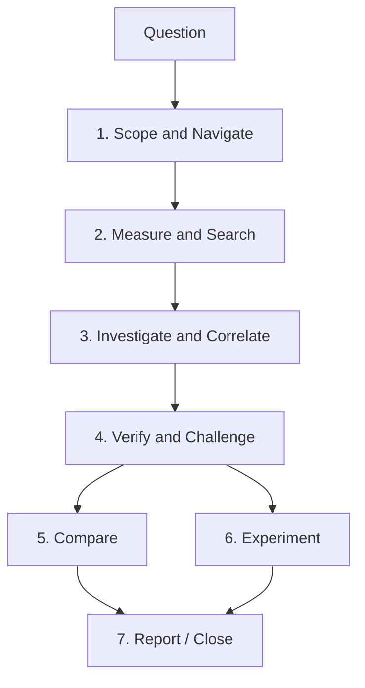


### Apply, Skip, and Undo

Tools fall into two behavioral classes:


| Class                        | Behavior                                                                                | Examples                                                                                                       |
| ---------------------------- | --------------------------------------------------------------------------------------- | -------------------------------------------------------------------------------------------------------------- |
| **Read-only evidence tools** | Run immediately; they do not change the viewer                                          | `query_raw_metric`, `search_timeline`, `investigate`, `correlate_events`, `find_critical_path`, `verify_claim` |
| **GUI-changing tools**       | With **Auto-apply GUI actions** off (default), the batch waits for **Apply** / **Skip** | `set_cursors`, `zoom_to_range`, `highlight_task`, `set_view_mode`, `add_annotation`, `bookmark_finding`        |


Several tool calls may arrive in one model turn and are applied as one batch. **Undo last actions** restores zoom / view / highlight / inspector / marks; `Ctrl/Cmd+Z` also reverts cursors and marks. Export tools still open a save dialog.

### 1. Scope & navigate — “Where should I look?”

Use these tools to turn an answer into a visible timeline location.


| Goal                         | Main tools                           | Result                                                  |
| ---------------------------- | ------------------------------------ | ------------------------------------------------------- |
| Scope a suspected phase      | `set_cursors`, `zoom_to_range`       | Places C1–Cn and focuses the relevant interval          |
| Focus a task                 | `highlight_task`                     | Lock-highlights the task on the timeline                |
| Change perspective           | `set_view_mode`                      | Task/Core and horizontal/vertical view                  |
| Inspect a migration corridor | `open_corridor_inspector`            | Opens the Migration & Corridor Inspector                |
| Preserve evidence            | `bookmark_finding`, `add_annotation` | Adds semantic or free-text timeline marks               |
| Clean up                     | `clear_marks`, `reset_view`          | Clears investigation clutter or restores full-span view |


**Beginner usage:** normally accept these as GUI cards produced by **Investigate**, **Verify**, or **Explain region** rather than calling them directly.

### 2. Measure & search — “What happened?”

These tools fetch deterministic evidence. They do not change the trace.


| Question                              | Main tools             | Evidence returned                                                 |
| ------------------------------------- | ---------------------- | ----------------------------------------------------------------- |
| Where did an event occur?             | `search_timeline`      | Matching task/STI/tag/interval/pointer/migration timestamps       |
| What are this task’s measured values? | `query_raw_metric`     | Scoped execution, blocking, migration, sync, PI, or findings rows |
| Is the distribution unusual?          | `analyze_distribution` | p50–p99.9, standard deviation, CV, outlier rate                   |
| Is timing periodic or jittery?        | `analyze_periodicity`  | Expected vs observed period/jitter statistics                     |
| Does the task exceed a budget?        | `check_budget`         | WCET/response/deadline budget comparison                          |


These tools are the evidence layer. They should be preferred over asking the model to guess a number.

### 3. Investigate & correlate — “What is related?”

Use this group after Triage identifies a concrete issue.


| Depth           | Main tools                                                  | Purpose                                                                 |
| --------------- | ----------------------------------------------------------- | ----------------------------------------------------------------------- |
| **Triage**      | `detect_anomalies`, `cluster_findings`, `cluster_incidents` | Rank and group Findings                                                 |
| **Investigate** | `investigate`, `plan_investigation`, `suggest_scope`        | Build hypotheses and choose the cheapest next checks                    |
| **Correlate**   | `correlate_events`, `find_related_findings`                 | Merge nearby execution/blocking/migration/sync/priority evidence        |
| **Path**        | `find_critical_path`                                        | Walk preemption, blocking, and mutex activity around an incident        |
| **Dependency**  | `build_task_dependency_graph`                               | Show wait/preempt/migrate/PI relationships                              |
| **Temporal**    | `analyze_temporal_causality`                                | Build a happens-before chain from observed evidence times               |
| **Root cause**  | `build_causal_chain`, `rank_root_causes`                    | Rank hypotheses while labeling causal/correlated/temporal relationships |


`Investigate` / `Root cause` / `Auto investigate` orchestrate these deeper tools. Most users should not need to choose the sequence manually.

### 4. Verify & challenge — “Is this really the cause?”

This group prevents a plausible story from being treated as a confirmed diagnosis.

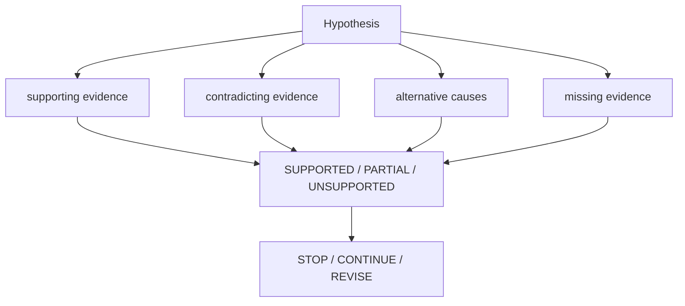


| Purpose                                          | Main tools                    |
| ------------------------------------------------ | ----------------------------- |
| Check one claim                                  | `verify_claim`                |
| Find evidence against a hypothesis               | `detect_contradictions` |
| Decide whether enough evidence has been gathered | `assess_evidence_sufficiency` |
| Force alternative explanations                   | `challenge_conclusion`        |
| Track hypothesis state                           | `manage_hypotheses`           |
| Inspect priority-inversion evidence              | `detect_priority_inversion`   |
| Evaluate investigation quality                   | `score_investigation` |


The Evidence & Validation panel complements these tools with status, a direct-evidence table, checks, missing evidence, next action, and investigation details (quality, cost, trees).

### 5. Compare — “What changed?”

Use these tools when two or more traces are open.


| Goal                           | Main tools            | Result                                      |
| ------------------------------ | --------------------- | ------------------------------------------- |
| Open / obtain Trace Compare    | `trigger_compare`     | Same comparison data as toolbar **Compare** |
| Compare two builds             | `compare_performance` | Structured metric deltas + confidence       |
| Explain the primary regression | `regression_explain`  | Narrative tied to A/B deltas                |
| Localize the regression        | `regression_localize` | Suspect task / region / mechanism           |
| Compare two tasks              | `compare_tasks`       | Side-by-side task metrics                   |
| Compare against history        | `baseline_score`      | Drift against a stored baseline             |
| Rank several open traces       | `analyze_traces`      | Relative scheduling behavior                |


A comparison is only meaningful when the two traces represent equivalent workload phases.

### 6. Experiment — “What should I try?”

These tools operate **after** a cause has enough evidence.

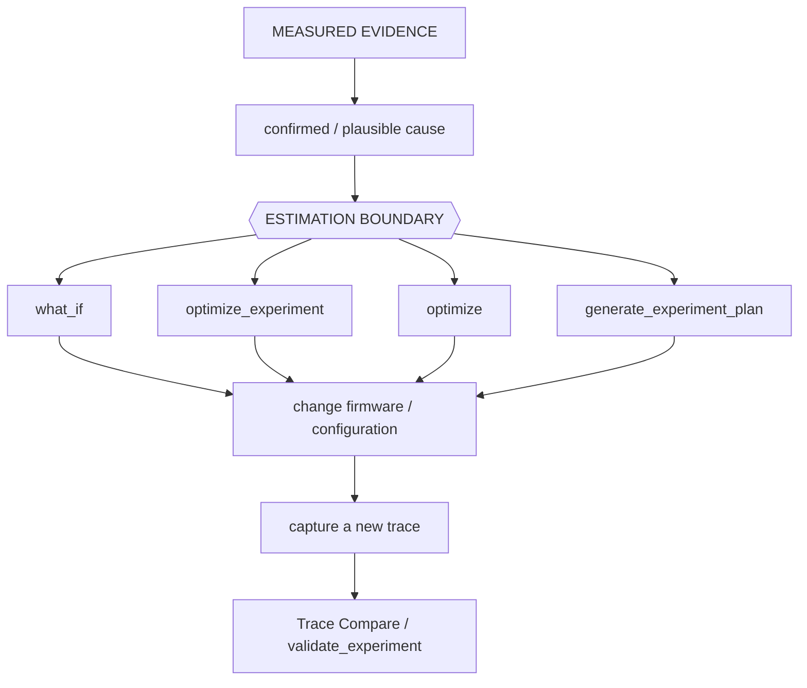


| Goal                                     | Main tools                                          |
| ---------------------------------------- | --------------------------------------------------- |
| Test one concrete idea                   | `what_if`                                           |
| Rank candidate changes                   | `optimize_experiment`                               |
| Get qualitative mitigation ideas         | `optimize`                                          |
| Generate bench/firmware validation steps | `recommend_experiments`, `generate_experiment_plan` |
| Compare prediction with measured result  | `validate_experiment`                               |
| Store the outcome                        | `record_experiment_outcome`                         |


**Important:** `what_if` and optimization results are estimates, not measured scheduler behavior.

### 7. Report & close — “What did we learn?”


| Goal                                 | Main tools                                                |
| ------------------------------------ | --------------------------------------------------------- |
| Generate structured engineering text | `generate_report`                                         |
| Save a diagnostic report             | `export_report` (HTML summary first; transcript in appendix) |
| Save a complete Investigation Case   | `export_investigation`                                    |
| Replay/summarize the investigation   | `investigation_replay`, `summarize_investigation_context` |
| Remember similar cases               | `investigation_memory`, `find_similar_investigations`     |
| Finish the Case                      | `close_investigation`                                     |

HTML `export_report` builds a **diagnostic report**: executive summary (status + completeness), coverage, ranked findings, observation vs interpretation, in-scope evidence table, and next action. Conversation, GUI state, out-of-window evidence, and metadata sit in an expandable **Appendix**. Export runs immediately (query/export batches need no Apply); if a turn is still in flight the HTML marks **Analysis incomplete**. Optional `mode`: `summary` (default), `technical`, or `full` (appendix conversation open).


<a id="complete-gui-tool-reference" name="complete-gui-tool-reference">&#x200B;</a>

### Complete GUI tool reference

The table below is the exhaustive schema reference. Use it when implementing, debugging, or explicitly steering tool calls.


| Tool                              | Parameters / targets                                                                                                               | Effect                                                                                                                                                                                                                                                                                                                               |
| --------------------------------- | ---------------------------------------------------------------------------------------------------------------------------------- | ------------------------------------------------------------------------------------------------------------------------------------------------------------------------------------------------------------------------------------------------------------------------------------------------------------------------------------ |
| `set_cursors` | `timestamps` (1–8 trace times)                                                                                                     | Place cursors (enables **Limit to C1–Cn** when two or more)                                                                                                                                                                                                                                                                          |
| `zoom_to_range` | `start_time`, `end_time`                                                                                                           | Focus the timeline between two times                                                                                                                                                                                                                                                                                                 |
| `highlight_task` | `task_name_or_id` (display name, numeric id, or merge key)                                                                         | Lock-highlight a task row. Unknown names are ignored so the timeline is not dimmed. Empty string clears.                                                                                                                                                                                                                             |
| `set_view_mode` | `mode` (`task` / `core`); optional `orientation`                                                                                   | Switch Task or Core view; horizontal or vertical                                                                                                                                                                                                                                                                                     |
| `open_corridor_inspector` | optional `core_from` / `core_to` (`Core_0`, `0`, `c0`, `Core 0`)                                                                   | Open Migration Inspector; aliases resolve the same way                                                                                                                                                                                                                                                                               |
| `add_annotation` | `time`, `note` (≤240 chars)                                                                                                        | Pin an orange timeline note at a timestamp (stays on the current right-panel tab)                                                                                                                                                                                                                                                    |
| `query_raw_metric` | `task`, `metric` (`priority_inheritance`, `execution`, `migrations`, `blocking`, `sync`, `findings`)                               | Read-only: return the per-task series for the current Statistics scope (up to 40 rows)                                                                                                                                                                                                                                               |
| `export_report` | optional `format` (`html` / `csv` / `json`), optional `mode` (`summary` / `technical` / `full`) | HTML diagnostic report: executive summary, coverage, ranked findings, in-scope evidence, next action; conversation/GUI/rejected evidence in `<details>` appendix. Runs immediately (no Apply). Mid-flight exports still download and mark **Analysis incomplete** in the HTML. Strips `export_report` tool cards from the transcript. `json` saves a full investigation package (see `export_investigation`). |
| `clear_marks` | optional `what` (`annotations` / `cursors` / `bookmarks` / `all` / `everything`)                                                   | Clear AI clutter. `all` (default) drops annotations + cursors; `everything` also clears bookmarks                                                                                                                                                                                                                                    |
| `reset_view` | (none)                                                                                                                             | Fit the timeline to the full span and clear the task highlight (marks stay)                                                                                                                                                                                                                                                          |
| `search_timeline` | `query`; optional `mode` (`contains` / `exact` / `regex` / `sti` / `tags` / `intervals` / `lifecycle` / `pointers` / `migrations`) | Find-panel search; returns matching timestamps (up to 40)                                                                                                                                                                                                                                                                            |
| `trigger_compare` | optional `tab_a` / `tab_b` (0-based tab index or filename)                                                                         | Read-only Trace Compare CSV + open the same dialog as toolbar **Compare** (needs two loaded tabs)                                                                                                                                                                                                                                    |
| `investigate` | optional `finding_id`, `depth` (1–5)                                                                                               | Read-only: investigation graph with root-cause chain, hypotheses, ranked anomalies, suggested tools                                                                                                                                                                                                                                  |
| `detect_anomalies` | optional `limit` (1–40)                                                                                                            | Read-only: rank Analysis Findings as Critical / Warning / Info                                                                                                                                                                                                                                                                       |
| `correlate_events` | `task`; optional `around_time`, `window`                                                                                           | Read-only: merge blocking / execution / migration / sync / priority / Find hits into one timeline                                                                                                                                                                                                                                    |
| `find_critical_path` | `task`; optional `timestamp`, `window` (default 2000)                                                                              | Read-only: preempt/block/mutex critical path around a timestamp; also returns a `mermaid` graph (`graph LR`), `graph_nodes` (id/label/kind/time), and split `blocking_steps` / `preemption_steps` arrays. Path steps carry `start`/`stop`; Evidence bullets use clickable `range:LO/HI` to zoom and place C1–C2 on the episode       |
| `compare_performance` | optional `tab_a` / `tab_b`                                                                                                         | Read-only: structured A vs B metric deltas + confidence (two tabs); `data.regression_type` classifies the primary delta as `execution` / `scheduling` / `synchronization` / `migration` / `load_balance` / `unknown` (legacy `classification` values like `thrashing` / `load_imbalance` / `tick_health` are preserved alongside it) |
| `generate_report` | optional `report_type`, `finding_id`                                                                                               | Read-only: typed engineering markdown (`executive` / `performance` / `root_cause` / `regression` / `optimization` / `bug` / `ci`); call `export_report` to save                                                                                                                                                                      |
| `check_budget` | optional `budgets`, `tasks`                                                                                                        | Read-only: compare per-task WCET/response/deadline metrics against budgets (host builds rows from findings when `tasks` omitted)                                                                                                                                                                                                     |
| `optimize` | optional `limit` (default 5)                                                                                                       | Read-only: evidence-backed mitigation ideas (estimate disclaimer)                                                                                                                                                                                                                                                                    |
| `regression_explain` | optional `tab_a` / `tab_b`                                                                                                         | Read-only: compare two tabs then narrate the primary regression; includes the same `regression_type` classification                                                                                                                                                                                                                  |
| `bookmark_finding` | `time`, `kind` (`root_cause` / `evidence` / `correlated` / `reference`); optional `note`                                           | GUI: pin a semantic investigation annotation (Apply required)                                                                                                                                                                                                                                                                        |
| `investigation_replay` | optional `finding_id`, `conclusion`, `tools_run`, `evidence_times`                                                                 | Read-only: structured investigation replay card                                                                                                                                                                                                                                                                                      |
| `what_if` | `change`; optional `task`                                                                                                          | Read-only: heuristic slice-replay what-if (migrations / blocking / load balance; not an RTOS kernel)                                                                                                                                                                                                                                 |
| `optimize_experiment` | optional `task`, `limit` (1–12, default 5)                                                                                         | Read-only: run ranked automatic pin/priority/contention/migration experiments                                                                                                                                                                                                                                                        |
| `analyze_traces` | (none)                                                                                                                             | Read-only: rank all loaded tabs by scheduling behavior                                                                                                                                                                                                                                                                               |
| `baseline_score` | optional `task`, `baseline`, `snapshot`                                                                                            | Read-only: score current per-task metrics (WCET/blocking/migrations/response) against the stored historical baseline; flags `|z|>2`                                                                                                                                                                                                  |
| `recommend_experiments` | optional `finding_id`, `task`, `limit` (1–20, default 5)                                                                           | Read-only: suggest simulation / firmware / measurement validation experiments from findings heuristics                                                                                                                                                                                                                               |
| `export_investigation` | optional `finding_id`, `conclusion`, `tools_run`, `evidence_times`                                                                 | Download the completed investigation (finding, tools run, queries, evidence, conclusion, confidence, alternatives) as a JSON package                                                                                                                                                                                                 |
| `detect_priority_inversion` | optional `task`, `window`                                                                                                          | Read-only: scan priority-inheritance boost episodes for L/M/H inversion suspects (high/medium/low task, mutex, time, duration)                                                                                                                                                                                                       |
| `find_related_findings` | optional `finding_id`, `task`, `metric`, `window`, `limit` (1–40, default 10)                                                      | Read-only: relate Analysis Findings by shared task, metric keyword, evidence-time proximity, or severity adjacency                                                                                                                                                                                                                   |
| `compare_tasks` | `task_a`, `task_b`; optional `metrics`                                                                                             | Read-only: side-by-side execution/blocking/migrations/priority-inheritance delta table between two tasks                                                                                                                                                                                                                             |
| `explain_finding` | optional `finding_id`, `level` (`quick` / `technical` / `deep`)                                                                    | Read-only: explain one Analysis Finding at the chosen depth (host-side; uses finding text plus hypotheses)                                                                                                                                                                                                                           |
| `interpret_query` | `question`                                                                                                                         | Read-only: turn a free-form question into an explicit investigation mode/scope before other tools run                                                                                                                                                                                                                                |
| `validate_experiment` | optional `expected`, `actual` (metric → signed percent)                                                                            | Read-only: compare expected experiment deltas with actual A vs B / what-if results (`VALIDATED` / `PARTIALLY VALIDATED` / `DISPROVED`)                                                                                                                                                                                               |
| `manage_hypotheses` | `hypothesis_id`, `status` (`supported` / `possible` / `rejected` / `need_evidence`); optional `reason`, `finding_id`               | Read-only: mark one investigation hypothesis status                                                                                                                                                                                                                                                                                  |
| `plan_investigation` | optional `question`, `finding_id`                                                                                                  | Read-only: rank hypotheses and the cheapest tool sequence                                                                                                                                                                                                                                                                            |
| `suggest_scope` | optional `question`                                                                                                                | Read-only: recommend task / related tasks / time window                                                                                                                                                                                                                                                                              |
| `detect_contradictions` | optional `hypothesis`, `metrics`                                                                                                   | Read-only: verdict SUPPORTED / CONTRADICTED / INSUFFICIENT                                                                                                                                                                                                                                                                           |
| `assess_evidence_sufficiency` | optional `tools_run`                                                                                                               | Read-only: STOP INVESTIGATION / CONTINUE / REVISE HYPOTHESIS                                                                                                                                                                                                                                                                         |
| `cluster_findings` | (none)                                                                                                                             | Read-only: group related findings into incidents                                                                                                                                                                                                                                                                                     |
| `generate_fingerprint` | (none)                                                                                                                             | Read-only: HIGH/MEDIUM/LOW scheduling, sync, and timing bands                                                                                                                                                                                                                                                                        |
| `find_similar_investigations` | optional `limit`                                                                                                                   | Read-only: match fingerprint against recorded experiment outcomes                                                                                                                                                                                                                                                                    |
| `regression_localize` | optional `label_a`, `label_b`                                                                                                      | Read-only: localize A vs B inflation to a task and region                                                                                                                                                                                                                                                                            |
| `build_causal_chain` | (none)                                                                                                                             | Read-only: causal / correlated / temporal edges (never silent causation)                                                                                                                                                                                                                                                             |
| `generate_experiment_plan` | optional `task`, `limit`                                                                                                           | Read-only: ranked firmware / what-if experiments                                                                                                                                                                                                                                                                                     |
| `record_experiment_outcome` | optional `change`, `predicted`, `actual`, `quality`                                                                                | Read-only: store outcome for later similar-case matching                                                                                                                                                                                                                                                                             |
| `score_investigation` | optional `tools_run`, `conclusion`, `confidence`, `elapsed_s`                                                                      | Read-only: evidence efficiency, cost, false-confidence, falsification, scope, stop                                                                                                                                                                                                                                                   |
| `analyze_temporal_causality` | optional `task`                                                                                                                    | Read-only: happens-before chain from Findings times                                                                                                                                                                                                                                                                                  |
| `build_task_dependency_graph` | optional `task`                                                                                                                    | Read-only: BTF wait/preempt/migrate/PI graph; 2-hop neighborhood + upstream tasks                                                                                                                                                                                                                                                    |
| `decompose_response_time` | optional `task`                                                                                                                    | Read-only: relative delay-component shares                                                                                                                                                                                                                                                                                           |
| `rank_root_causes` | (none)                                                                                                                             | Read-only: rank causes from findings/hypotheses                                                                                                                                                                                                                                                                                      |
| `verify_claim` | `claim`; optional `claim_type`, `subject`, `object`, `evidence`                                                                    | Read-only: SUPPORTED / PARTIAL / UNSUPPORTED                                                                                                                                                                                                                                                                                         |
| `challenge_conclusion` | optional `conclusion`                                                                                                              | Read-only: alternatives and missing evidence                                                                                                                                                                                                                                                                                         |
| `investigation_memory` | optional `action` (`recall` / `store`), `record`, `limit`                                                                          | Read-only: persist/recall similar cases                                                                                                                                                                                                                                                                                              |
| `cluster_incidents` | optional `window_ns`                                                                                                               | Read-only: time-proximity incident clusters                                                                                                                                                                                                                                                                                          |
| `close_investigation` | optional `conclusion`, `confidence`                                                                                                | Read-only: close the case envelope                                                                                                                                                                                                                                                                                                   |
| `analyze_distribution` | optional `values`, `metric` (`auto` / `execution` / `blocking` / `priority_inheritance` / `tick`), `task`                          | Read-only: p50/p90/p95/p99/p99.9, stddev, CV, 3-sigma outlier rate. Statistics **Query with AI…** on a distribution chart harvests the open plot’s samples.                                                                                                                                                                          |
| `analyze_periodicity` | optional `times`, `expected`, `source` (`auto` / `tick` / `sti` / `isr` / `timer` / `release`), `task`, `durations`                | Read-only: expected vs p50/p99/max, RMS and peak-to-peak jitter, kind                                                                                                                                                                                                                                                                |
| `summarize_investigation_context` | optional `conclusion`, `tools_run`                                                                                                 | Read-only: compact investigation snapshot                                                                                                                                                                                                                                                                                            |


Models without native tool calling can emit a fenced `btftool` JSON block; the viewer renders the same GUI cards. Prefer a tool-capable model for investigation-heavy workflows.

<a id="desktop-vs-web" name="desktop-vs-web">&#x200B;</a>

## Desktop and web behavior

BTFViewer Desktop and Web are intended to provide the **same AI investigation workflow, tool behavior, evidence model, and validation rules**. For normal use, there is no separate “Desktop workflow” or “Web workflow” to learn.

Use whichever frontend fits your environment:

- **Desktop** — convenient for local files, native save dialogs, and local/private AI endpoints.
- **Web** — convenient when you want a browser-only viewer or a hosted/development deployment.

The differences are mostly platform integration details rather than AI capabilities.


| Platform detail                                         | Desktop                                         | Web                                                                                  |
| ------------------------------------------------------- | ----------------------------------------------- | ------------------------------------------------------------------------------------ |
| AI tools, Investigation Case, Evidence panel, validator | Same behavior                                   | Same behavior                                                                        |
| Task/event/region AI actions                            | Same behavior                                   | Same behavior                                                                        |
| Model picker and endpoint configuration                 | Supported                                       | Supported                                                                            |
| Reports / investigation export                          | Native save dialog                              | Browser download                                                                     |
| In-chat diagrams                                        | Rendered in the desktop UI                      | Rendered as inline browser content                                                   |
| Self-signed HTTPS endpoint                              | Can optionally allow self-signed TLS per preset | Browser/OS certificate policy still applies                                          |
| Local `file://` launch                                  | Not applicable                                  | Cross-origin requests may be blocked; use the development/preview server when needed |


> **User takeaway:** AI analysis should produce the same investigation and evidence on Desktop and Web. Platform-specific differences matter mainly when configuring endpoints, certificates, downloads, or browser networking.

Detailed platform-specific setup problems are documented in **Troubleshooting** below rather than treated as separate AI features.

---


## Troubleshooting


| Symptom                                               | Cause                                                                | Try                                                                                                                                                                                                                                                                                                              |
| ----------------------------------------------------- | -------------------------------------------------------------------- | ---------------------------------------------------------------------------------------------------------------------------------------------------------------------------------------------------------------------------------------------------------------------------------------------------------------- |
| Web: Failed to fetch / CORS                           | Browser blocked a cross-origin call (`file://` sends `Origin: null`) | Prefer `npm run dev` / `make preview` (both proxy Ollama), or see [Opening the web app from](#opening-the-web-app-from-file) `file://`                                                                                                                                                                           |
| 401 / 403                                             | Missing or rejected key / origin                                     | Settings → AI → Sign in or API key (`OPENAI_API_KEY` / `GEMINI_API_KEY` / `OLLAMA_API_KEY`; local Ollama needs none)                                                                                                                                                                                             |
| `CERTIFICATE_VERIFY_FAILED` / self-signed TLS         | Private CA or self-signed HTTPS gateway                              | Desktop: Settings → AI → **Allow self-signed TLS**. Web: trust the cert in the OS/browser, use `http://` on a private LAN, or use the Desktop app                                                                                                                                                                |
| Chat probe timed out / `The read operation timed out` | `GET /models` lists ids only; inference is slow or hung              | **Test connection** POSTs `/chat/completions` (non-streaming, 120s). Warm the model (`ollama run MODEL`) and retry. Debug with the curl probe below; if curl hangs too, the gateway's chat upstream is stuck. Try `"stream": true` if non-stream never returns. Lower context length on a VRAM-tight local host. |
| Model not found                                       | Typed id is not served                                               | Refresh the Model list (or Test connection) and pick a served id from the dropdown, or `ollama pull` it                                                                                                                                                                                                          |
| Gemini HTTP 400 `thought_signature`                   | Gemini 3 requires a thought blob on tool follow-ups                  | Retry the question — the viewer echoes Gemini thought signatures                                                                                                                                                                                                                                                 |
| Gemini HTTP 400 `function_response.name`              | OpenAI-compat follow-up with empty `tool_calls[].id`                 | The viewer fills ids and `role=tool` names before the next turn. Retry the case.                                                                                                                                                                                                                                  |
| Raw `btftool` JSON instead of native tool calls       | Model lacks or skips function calling                               | The viewer renders the same cards. Select **Apply** or enable **Auto-apply GUI actions**. For reliable native calls, use a tool-capable model such as `qwen3.5:9b` or a supported cloud model.                                                                                                                |
| Ask times out (over 120s) or stays on Waiting…        | Cold start, CPU offload, or VRAM spill                               | **Stop** (composer icon), warm with `ollama run MODEL`, retry. Use **Clear** between long threads. Smaller model or shorter Statistics scope if the Findings card is huge                                                                                                                                        |
| Later turns ignore earlier facts                      | Chat history exceeded the context window                             | **Clear** on the AI bar, or **Analysis → Query with AI…** / toolbar **Compare → Query with AI…** for a fresh scoped prompt                                                                                                                                                                                       |
| Need raw AI request/response dumps (Desktop)          | Debugging tool rounds / provider quirks                              | Settings → AI → **Log MCP messages to file** (off by default). Appends to `./ai_mcp_messages.log`; delete when finished                                                                                                                                                                                          |


### Test connection curl

Same body the viewer sends for **Test connection** (replace `BASE`, `MODEL`, and `KEY`):

```bash
curl -vk --max-time 180 \
  -H "Authorization: Bearer KEY" \
  -H "Content-Type: application/json" \
  -d '{"model":"MODEL","stream":false,"messages":[{"role":"user","content":"Reply with JSON only: {\"ok\":true}"}],"max_tokens":24}' \
  BASE/chat/completions
```

---


## Opening the web app from `file://`

A page opened straight from disk sends `Origin: null`, which Ollama rejects with
`403` — the browser then reports only `Failed to fetch`. Serving the app over
http avoids this entirely (`npm run dev` / `make preview` proxy Ollama for you),
and the Desktop app is not affected at all.

To keep using `file://`, allow every origin on the Ollama side:

```bash
# Server started from a terminal
OLLAMA_ORIGINS="*" ollama serve

# macOS menu-bar app (Ollama.app) — a shell variable does not reach it
launchctl setenv OLLAMA_ORIGINS "*"   # then quit Ollama and reopen it
```

Verify the change took effect; expect `200` and an `Access-Control-Allow-Origin`
header:

```bash
curl -s -D - -o /dev/null -H "Origin: null" http://localhost:11434/v1/models \
  | grep -iE "^HTTP|access-control-allow-origin"
```

If a `file://` page is still refused, list the null origin explicitly with
`OLLAMA_ORIGINS="*,null"`. Note that `*` lets **any** page you visit reach your
local models; undo it with `launchctl unsetenv OLLAMA_ORIGINS` when done.

---


## CLI regression gate

Desktop headless CI can compare a candidate trace to a baseline and optionally ask the configured AI for a short narrative:

Headless `analyze` with `--fail-on-regression`:

```bash
python builds/btf_viewer.py analyze candidate.btf --baseline baseline.btf --fail-on-regression
python builds/btf_viewer.py analyze candidate.btf --save-baseline /tmp/base.json
python builds/btf_viewer.py analyze candidate.btf --baseline /tmp/base.json --fail-on-regression --ai
python builds/btf_viewer.py ai-test --dataset tests/ai --fail-under 70
python builds/btf_viewer.py ai-test --config examples/ai/benchmark.xml -o AI_BENCHMARK.md
python builds/btf_viewer.py ai-test --config examples/ai/benchmark.xml --compare-context -o AI_BENCHMARK.md
python builds/btf_viewer.py ai-test --config examples/ai/benchmark.xml --insecure
```

Or `make -C BTFViewer ai-test` (`AI_DATASET`, `AI_FAIL_UNDER`), `make -C BTFViewer ai-test-live` (`AI_CONFIG`, optional `AI_MODELS`, writes [AI_BENCHMARK.md](AI_BENCHMARK.md)), and `make -C BTFViewer ai-test-context` (same as live + `--compare-context`). Dataset, scoring rules, and context-mode flags: [Benchmark / evaluation suite](#benchmark-suite).

See also [Export → Headless CLI](README.md#headless-cli-desktop-only) in the user guide.

---

<a id="benchmark-suite" name="benchmark-suite">&#x200B;</a>

## Benchmark and evaluation suite

Offline `ai-test` / `runOfflineBenchmark` already ships. Live runs read **model id, base URL, TLS, and API key** from a suite XML (`--config examples/ai/benchmark.xml`) and write [AI_BENCHMARK.md](AI_BENCHMARK.md) — a rerun **merges** into an existing file (untouched models/context-modes/cases are preserved byte-for-byte; `--replace-report` overwrites fully). Commands: [CLI regression gate](#cli-regression-gate). Default live scoring uses **Full evidence** (`--context-mode full`). **`--compare-context`** runs Compact, Balanced, and Full on the same cases and reports score, token totals, and latency side by side. Each live model call **retries up to 10 times, pausing 10s between attempts** on transient errors (HTTP 429/503 high demand, timeouts, empty replies); auth and not-found errors are not retried.

The capability matrix above is qualitative (small local vs 9B+ vs cloud). The suite turns those expectations into repeatable measurements: **which model is most reliable for BTF Viewer trace investigation**, not which model is largest or “smartest.”

<a id="context-mode-benchmarking" name="context-mode-benchmarking">&#x200B;</a>

### Context mode benchmarking

Live `ai-test` uses the same Compact / Balanced / Full evidence packing as **Settings → AI → Context** (Findings trim, stage-filtered tool schemas, Compact reply cap). Settings in the GUI do not affect the CLI scorer.

| Flag | Purpose |
| --- | --- |
| *(default)* | **Full evidence** — complete Findings and tool catalog |
| `--context-mode compact` | Single run in Compact (or `balanced`, `full`; comma-separated for a subset) |
| `--compare-context` | Run **all three** modes per model on the same cases |

Each live case records **overall score**, **pass/fail**, **prompt / completion / total tokens** (summed across tool follow-ups), and **elapsed time**. With `--compare-context`, [AI_BENCHMARK.md](AI_BENCHMARK.md) adds a **Context mode comparison** table per model (score vs tokens vs mean latency).

```bash
python builds/btf_viewer.py ai-test -c examples/ai/benchmark.xml --compare-context -o AI_BENCHMARK.md
make -C BTFViewer ai-test-context   # AI_CONFIG, optional AI_MODELS
```

Use this when choosing a default Context setting. Compact used fewer tokens for every measured model, but it did not always reduce latency or preserve the score. Compare all three modes on the intended endpoint and workload. Details: [Context mode (token usage)](#context-mode-token-usage).

### Scope

Keep the live set focused on:

- **Gemini cloud models**
- **Local Ollama models that are practical on a typical developer workstation**

Do **not** pick local models only because they are newest or largest. Measure models that can run alongside BTF Viewer, Ollama, and the AI context/tooling workload.

### Recommended models

**Local — developer workstation:**

- **Qwen3.5 9B** (`qwen3.5:9b`) — shipped in-app default and the practical local choice. Balanced passed 15/17 cases; Full evidence produced Overall 88.
- **Qwen3.8 27B** (`qwen3.8:27b`) — high-latency local comparison. Balanced reached Overall 88, but averaged 325.2s/case and did not consistently outperform the 9B model.

**Gemini** (configurable; newer ids can be added without changing the runner):

- **Gemini 3.7 Flash** (`gemini-3.7-flash`) — higher-scoring shipped Gemini reference. Full evidence reached Overall 85 with 14/17 PASS.
- **Gemini 3.5 Flash-Lite** (`gemini-3.5-flash-lite`) — latency-focused cloud reference. Full evidence reached Overall 83 at 2.6s/case.

```text
Shipped live suite
│
├── Local
│   ├── Qwen3.5 9B
│   └── Qwen3.8 27B
│
└── Gemini
    ├── Gemini 3.7 Flash
    └── Gemini 3.5 Flash-Lite
```

The recorded results show why model size alone is not a useful selection rule. The 27B local model matched the highest local Overall score only in Balanced mode, while taking about 325 seconds per case. The 9B model reached Overall 88 in Full evidence at 16.2 seconds per case. Measure both **diagnostic quality** and **practical system performance**.

Do not hard-code the model list into the runner. Copy [examples/ai/benchmark.xml](examples/ai/benchmark.xml). For a self-signed or private-CA gateway, keep `<tls-verify>false</tls-verify>` (the suite default); public HTTPS models can override to `true`:

```xml
<ai-benchmark version="1">
  <dataset>tests/ai</dataset>
  <fail-under>0</fail-under>
  <output>AI_BENCHMARK.md</output>
  <endpoint>
    <base-url>http://localhost:11434/v1</base-url>
    <tls-verify>false</tls-verify>
    <timeout-s>360</timeout-s>
  </endpoint>
  <models>
    <model id="qwen3.5:9b"/>
    <model id="qwen3.8:27b"/>
    <model id="gemini-3.7-flash" preset="gemini">
      <base-url>https://generativelanguage.googleapis.com/v1beta/openai</base-url>
      <tls-verify>true</tls-verify>
      <api-key env="GEMINI_API_KEY"/>
    </model>
    <model id="gemini-3.5-flash-lite" preset="gemini">
      <base-url>https://generativelanguage.googleapis.com/v1beta/openai</base-url>
      <tls-verify>true</tls-verify>
      <api-key env="GEMINI_API_KEY"/>
    </model>
  </models>
</ai-benchmark>
```

```xml
<!-- Self-signed / private CA gateway -->
<endpoint>
  <base-url>https://llm.internal.example:8443/v1</base-url>
  <tls-verify>false</tls-verify>
  <api-key env="GATEWAY_API_KEY"/>
</endpoint>
```

`<api-key env="VAR">` reads the environment first, then any text inside the element. Omit the text (and do not commit secrets). `tls-verify` false, or `ai-test --insecure`, skips certificate checks on Desktop. `--models id1,id2` (or `make ai-test-context AI_MODELS=id1,id2`) selects a subset of `<model>` entries. A custom suite may mark models `optional="true"` so they are skipped when their API key is missing unless you name them in `--models` / `AI_MODELS`. For Ollama, list the ids you actually have pulled. Record the exact model identifier and runtime configuration.

`--only-cases id1,id2` (or `make ai-test-context AI_CASES=id1,id2`) restricts scoring to specific `tests/ai` dataset case ids — handy for re-testing a few cases that returned `ERROR` (transient HTTP 429/503) without rerunning the whole suite.

When `-o`/`--output` already exists, `ai-test` **merges** this run into it instead of overwriting: any model/context-mode block or offline case that was actually rerun is replaced, and every other block/case already in the file is left byte-for-byte untouched (the Comparison, Context mode comparison, and Metric breakdown tables are recomputed from the merged set). This makes narrow reruns safe, e.g. re-scoring just one model in one context mode:

```bash
python builds/btf_viewer.py ai-test -c examples/ai/benchmark.xml \
  --models gemini-3.7-flash --context-mode full -o AI_BENCHMARK.md
make -C BTFViewer ai-test-live AI_MODELS=gemini-3.7-flash AI_CONTEXT=full
```

Pass `--replace-report` (or `AI_REPLACE=1`) to overwrite the file fully instead of merging — useful for a fresh, full-suite run you want to replace stale results wholesale.

In-app picker (not shipped): **Settings → AI → Benchmark** with checkboxes for Gemini and local Ollama models, then **Run Benchmark**.

### Dataset

`tests/ai/` holds known traces for the major diagnostic scenarios. Each case has **expected facts**, not an exact natural-language answer:

```text
tests/ai/
├── migration_thrash.btf
├── mutex_contention.btf
├── priority_inversion.btf
├── deadline_miss.btf
├── load_imbalance.btf
├── trace_regression.btf
├── explain_region.btf
├── adversarial_mutex_vs_starvation.btf
├── adversarial_exec_vs_preemption.btf
├── adversarial_correlation_not_cause.btf
├── adversarial_out_of_scope_time.btf
├── period_jitter.btf
├── waiter_owner_handoff.btf
├── stats_page_next_check.btf
├── response_vs_blocking.btf
├── preempt_matrix_vs_chain.btf
└── mutex_block_vs_wait_queue.btf
```

**Adversarial cases** (kind `adversarial`) use a decoy finding or timestamp. The obvious answer is wrong:


| Case                                | Decoy                                | Actual                                           |
| ----------------------------------- | ------------------------------------ | ------------------------------------------------ |
| `adversarial_mutex_vs_starvation`   | mutex contention                     | CPU starvation / preemption                      |
| `adversarial_exec_vs_preemption`    | long execution / WCET                | preemption                                       |
| `adversarial_correlation_not_cause` | ISR caused Comm latency              | correlation, no causal link                      |
| `adversarial_out_of_scope_time`     | diagnose `jump:9000`                 | timestamp outside the cursor window              |
| `period_jitter`                     | tick health / tickless               | task inter-arrival; open **Period / Jitter**     |
| `waiter_owner_handoff`              | kernel wait-queue                    | heuristic mutex handoff; open **Waiter × Owner** |
| `stats_page_next_check`             | invent `detect_timeline_anomalies`   | open **Timeline Anomalies** / **Worst Events**   |
| `response_vs_blocking`              | Blocking Time is end-to-end response | open **Response Time**                           |
| `preempt_matrix_vs_chain`           | invent `detect_preemption_matrix`    | open **Preemption Matrix**                       |
| `mutex_block_vs_wait_queue`         | reconstruct the kernel wait queue    | open **Mutex Blocking**                          |


```yaml
id: migration_thrash
trace: migration_thrash.btf
expected:
  finding_types: [migration, load_balance]
  tasks: [CS[22]]
  evidence:
    required_metrics: [migrations]
  allowed_tools: [detect_anomalies, correlate_events, query_raw_metric]
  forbidden:
    invented_task_names: true
    out_of_scope_timestamps: true
```

That keeps scoring robust against harmless wording differences.

### Evaluation metrics


| Metric                     | What it measures                                                                                                                                                                                                  |
| -------------------------- | ----------------------------------------------------------------------------------------------------------------------------------------------------------------------------------------------------------------- |
| Finding identification     | Did the model identify the expected problem?                                                                                                                                                                      |
| Evidence accuracy          | Are cited metrics/events actually present? `required_metrics` also accepts Statistics page titles (Period / Jitter, Waiter × Owner, Timeline Anomalies, …) and common aliases (`Period/Jitter`, `Waiter x Owner`) |
| Timestamp validity         | Are `jump:TIME` values real and in scope?                                                                                                                                                                         |
| Task-name validity         | Did the model use only known task names?                                                                                                                                                                          |
| Tool selection             | Did it call appropriate investigation tools?                                                                                                                                                                      |
| Tool-chain quality         | Did it gather enough evidence before concluding?                                                                                                                                                                  |
| Root-cause accuracy        | Does the conclusion match the expected diagnosis?                                                                                                                                                                 |
| Alternative handling       | Did it consider plausible alternatives?                                                                                                                                                                           |
| Confidence calibration     | Is confidence consistent with the available evidence?                                                                                                                                                             |
| Response completeness      | Did it answer the investigation question completely?                                                                                                                                                              |
| Latency                    | How long did the investigation take?                                                                                                                                                                              |
| Tool-call count            | How many tool rounds were required?                                                                                                                                                                               |
| Peak memory                | How much RAM was consumed during inference?                                                                                                                                                                       |
| Time to first token (TTFT) | How quickly did the model begin responding?                                                                                                                                                                       |
| Generation throughput      | Sustained tokens/sec during the investigation                                                                                                                                                                     |
| Investigation success rate | Percentage of cases completed correctly within the configured time/resource limit                                                                                                                                 |
| False-causal rate          | Claimed a causal link the case marks as coincidence / non-causal (0–100, higher is worse)                                                                                                                         |
| False-confirmation rate    | Confirmed the decoy finding (`trap_phrases`) instead of the real cause                                                                                                                                            |
| Unsupported-claim rate     | Share of validator claims that fail task/time/scope checks                                                                                                                                                        |
| Premature-conclusion rate  | High confidence or a conclusion before required tools ran                                                                                                                                                         |


For local runs, memory and latency are first-class. A slightly more accurate model that is unusable under memory pressure should not automatically rank higher.

**Level 1 — tool / evidence correctness:** valid tool, parameters, task, timestamp, and scope. Isolates tool-use bugs from reasoning quality.

**Level 2 — diagnostic correctness:** expected vs actual diagnosis, evidence, and alternatives. A convincing explanation is not enough.

**Headline score:** weighted engineering score (Finding / Evidence / Tool use / Root cause / Calibration / Safety), not a probability of correctness. Keep the component scores visible. PASS is overall ≥ 70.

**Safeguards the suite must test:** no invented task names, metric values, or `jump:TIME`; no timestamps outside the cursor region; no unsupported conclusions presented as confirmed; evidence must match tool results; heuristic what-if stays labeled as estimates; the model must not claim a simulation is a measured result.

### Model matrix

Same suite against the shipped Gemini and local Ollama models. Recorded 2026-08-19 (17-case dataset); full case tables and Compact/Balanced numbers: [AI_BENCHMARK.md](AI_BENCHMARK.md). Scores below are the **Full evidence** context mode (the live-scoring default).

| Model                    | Category              | Finding | Evidence | Root cause | Calibration | Notes                                                      |
| ------------------------ | --------------------- | ------- | -------- | ---------- | ----------- | ---------------------------------------------------------- |
| `qwen3.5:9b`             | Local / practical     | 85      | **93**   | **82**     | 80          | overall **88**, 16.2s/case, 14/17 PASS                     |
| `qwen3.8:27b`            | Local / high-latency  | **88**  | **94**   | 65         | 80          | overall **86**, 332s/case, 13/17 PASS                      |
| `gemini-3.5-flash-lite`  | Cloud / fast          | 82      | 90       | 71         | 80          | overall **83**, 2.6s/case, 13/17 PASS                      |
| `gemini-3.7-flash`       | Cloud                 | 82      | **94**   | 59         | 80          | overall **85**, 25.0s/case, 14/17 PASS                     |

[AI_BENCHMARK.md](AI_BENCHMARK.md) also carries two cloud models run outside the shipped suite (`--models` against a private config), for reference only — they are not in `examples/ai/benchmark.xml` and are not part of the "Recommended models" guidance below:

| Model               | Category                      | Finding | Evidence | Root cause | Calibration | Notes                                    |
| ------------------- | ----------------------------- | ------- | -------- | ---------- | ----------- | ---------------------------------------- |
| `claude-sonnet-5`   | Cloud (optional, not shipped) | 85      | **94**   | 59         | 80          | overall **82**, 15.9s/case, 12/17 PASS   |
| `gpt-5.6-sol`       | Cloud (optional, not shipped) | **91**  | 90       | **76**     | 80          | overall **88**, 9.6s/case, 15/17 PASS    |


Live `--config` runs a tool-result follow-up when the first turn is tools-only (or planning text without a Confidence line). Single-turn scores are not comparable.

The results support these practical conclusions:

- **Best practical local setup:** `qwen3.5:9b` with Balanced for the highest pass count, or Full evidence for the highest Overall score.
- **Fastest measured cloud setup:** `gemini-3.5-flash-lite` with Compact at 2.3s/case; Full evidence improved its score to 83 at 2.6s/case.
- **Best shipped Gemini result:** `gemini-3.7-flash` with Full evidence, Overall 85 and 14/17 PASS.
- **Highest result in the complete report:** optional `gpt-5.6-sol` with Compact, Overall 90 and 16/17 PASS.
- **More context is not automatically better:** the best mode depends on the model. Compare all three modes before choosing a deployment default.

**Context mode comparison** (`--compare-context`): runs the same live suite three times per model (Compact → Balanced → Full evidence) and writes a **Context mode comparison** table with overall score, pass rate, prompt/completion/total tokens, and mean latency. Use this to see whether a smaller context budget saves tokens/time without hurting investigation scores on your hardware.

**Context-size** (Findings + tools + history). Do not judge a local model only by tokens/sec — check tool use and grounding as context grows:


| Context | Purpose                                   |
| ------- | ----------------------------------------- |
| 8K      | Minimum investigation workload            |
| 16K     | Typical investigation                     |
| 32K     | Large Findings / multi-tool investigation |
| 64K     | Stress test, if supported                 |


Practical comparison on a developer workstation:

```text
Gemini 3.7 Flash / Gemini 3.5 Flash-Lite
      vs
Qwen3.5 9B        (shipped default)
Qwen3.8 27B
```

Does extra local capacity improve investigation quality enough to justify memory and latency?

### Reproducibility and architecture

Each run should save timestamp, app version, dataset version, model ids, endpoint config, cases, prompts, tool calls/results, final responses, scores, and timing. A run ID (`AI Benchmark #2026-08-13-001`) keeps results comparable when model behavior drifts without a viewer code change.

`--fail-under N` can fail CI when a model drops below a threshold (live often wants `0` so HTTP errors still write the report).

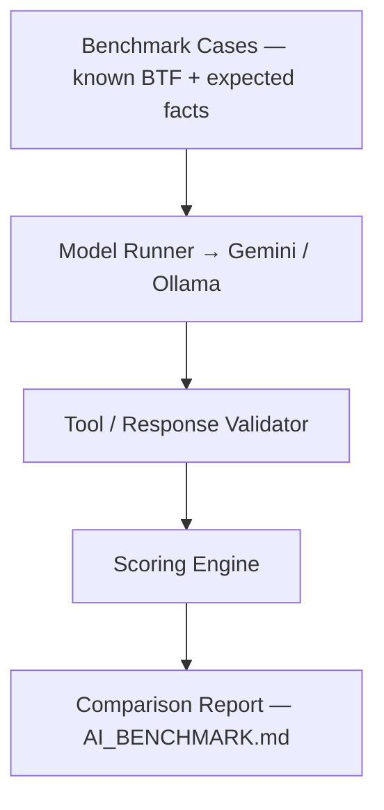


---

## Investigation Case

Desktop and Web share one **Investigation Case** model (`btf-investigation-case`): question, scope (trace / C1–Cn / tasks / cores), hypotheses with status (**supported** / **possible** / **need evidence** / **rejected**), evidence graph, coverage, falsification checks, conclusion, and validation. Lockstep notes: [Implementation notes](#implementation-notes).

After each final assistant reply a host-side **validator** extracts `jump:TIME` and `Task[id]` claims and flags invented names or timestamps outside the cursor window. **Test connection** appends a **model capability** card (live chat / structured output / tool calling overlay on a 3B vs 7B+ heuristic). Headless eval:

```bash
make -C BTFViewer ai-test
# or: python builds/btf_viewer.py ai-test --dataset tests/ai --fail-under 70
```

Modes (Quick / Diagnose / Compare / Optimize / Report) map onto existing templates; they do not add new tools. Always confirm on the timeline.

---


<a id="investigation-planner" name="investigation-planner">&#x200B;</a>

## Investigation planner

Host-side planner. **Cheapest evidence first.** User-facing loop: [README → Investigation planner](README.md#investigation-planner).

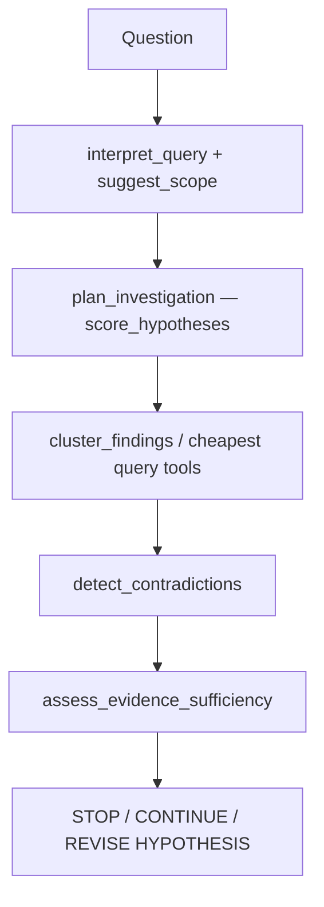


| Tool / helper                 | Host behaviour                                                                                                                                                                                                  |
| ----------------------------- | --------------------------------------------------------------------------------------------------------------------------------------------------------------------------------------------------------------- |
| `plan_investigation`          | Rank hypotheses and a cheap tool sequence from findings + question                                                                                                                                              |
| `suggest_scope`               | Task, related tasks, evidence times (or current cursors)                                                                                                                                                        |
| `detect_contradictions`       | `SUPPORTED` / `CONTRADICTED` / `INSUFFICIENT` (e.g. execution ≫ blocking vs mutex hypothesis)                                                                                                                   |
| `assess_evidence_sufficiency` | Coverage heuristic → stop / continue / revise                                                                                                                                                                   |
| `score_hypotheses`            | Evidence-weighted scores (not a GUI tool)                                                                                                                                                                       |
| `cluster_findings`            | Group by shared task or pattern                                                                                                                                                                                 |
| `generate_fingerprint`        | HIGH / MEDIUM / LOW scheduling, sync, timing bands                                                                                                                                                              |
| `find_similar_investigations` | Jaccard-style match vs recorded experiment outcomes                                                                                                                                                             |
| `regression_localize`         | A vs B deltas → task / region / likely mechanism                                                                                                                                                                |
| `build_causal_chain`          | Edges tagged causal / correlated / temporal; disclaimer required                                                                                                                                                |
| `generate_experiment_plan`    | Ranked pin / contention / priority experiments                                                                                                                                                                  |
| `record_experiment_outcome`   | Persist outcome (Desktop `[ai] experiment_outcomes`, Web `localStorage`)                                                                                                                                        |
| `score_investigation`         | Phase 3 extras: `evidence_efficiency`, `investigation_cost`, `false_confidence`, `falsification_quality`, `scope_accuracy`, `stop_efficiency` (also spread into `score_benchmark_case`, with adversarial rates) |


Do **not** add chat templates after `auto_investigate`.

---

<a id="causal-engines" name="causal-engines">&#x200B;</a>

## Causal and temporal engines

Host-side heuristics over Analysis Findings — not an RTOS scheduler replay. User-facing loop stays on [Investigation planner](#investigation-planner). Diagnose / Investigate / Auto investigate walk explanation tools before experiments: graph → temporal → `rank_root_causes` → `challenge_conclusion`, then `what_if`.

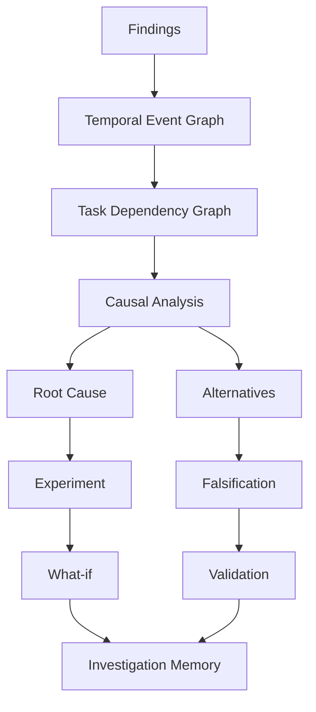


| Tool / helper                     | Host behaviour                                                                                               |
| --------------------------------- | ------------------------------------------------------------------------------------------------------------ |
| `analyze_temporal_causality`      | Happens-before chain from finding times (`jump:TIME`)                                                        |
| `build_task_dependency_graph`     | BTF sync/preempt/migrate/PI graph (finding-wording fallback); optional `task` neighborhood                   |
| `decompose_response_time`         | Relative delay shares (mutex, preemption, migration, execution, scheduler)                                   |
| `rank_root_causes`                | Rank hypotheses or finding buckets                                                                           |
| `verify_claim`                    | `SUPPORTED` / `PARTIAL` / `UNSUPPORTED` vs findings and cursors                                              |
| `challenge_conclusion`            | Alternatives and missing evidence                                                                            |
| `investigation_memory`            | Store/recall (Desktop `[ai] investigation_memory`, Web `localStorage`)                                       |
| `cluster_incidents`               | Group findings by time proximity                                                                             |
| `close_investigation`             | Record conclusion and close the case                                                                         |
| `analyze_distribution`            | p50 / p90 / p95 / p99 / p99.9, stddev, CV, 3-sigma outlier rate; BTF execution/blocking/PI/tick harvest      |
| `analyze_periodicity`             | Period/jitter from tick, STI, ISR, timer, or task-release times; kind = drift vs jitter vs WCET vs scheduler |
| `summarize_investigation_context` | Compact findings, hypotheses, and tools run                                                                  |


<a id="engine-limits" name="engine-limits">&#x200B;</a>

### Engine limits


| Engine                        | What it is                                                         | What it is not                                  |
| ----------------------------- | ------------------------------------------------------------------ | ----------------------------------------------- |
| `analyze_temporal_causality`  | Happens-before from finding `jump:TIME`                            | Kernel event replay                             |
| `build_task_dependency_graph` | BTF sync / preempt / migrate / PI edges; 2-hop `task` neighborhood | Full ISR / object graph                         |
| `decompose_response_time`     | Relative shares from finding magnitudes                            | Cycle-accurate milliseconds                     |
| `rank_root_causes`            | Hypothesis or finding-bucket rank                                  | A probability                                   |
| `investigation_memory`        | Local store / recall notepad                                       | Team knowledge base                             |
| `cluster_incidents`           | Time-proximity groups                                              | Shared-mutex / causal clustering                |
| `close_investigation`         | Case status `closed` plus conclusion                               | Full firmware A/B lifecycle                     |
| `analyze_distribution`        | BTF execution / blocking / PI / tick samples (cap 8000)            | A response-time series the parser does not have |
| `analyze_periodicity`         | Inter-arrival jitter and kind                                      | A kernel period timer                           |
| `simulate_schedule`           | LEVEL 1 helper inside `what_if`                                    | A GUI tool or RTOS kernel                       |


Out of scope (do **not** add chat templates for these): trace-to-code (ELF / DWARF), real scheduler or hardware-aware simulation, model routing, automatic benchmark-case generation, natural-language → metric compiler, anomaly discovery without Analysis Findings, shared team investigation database.

Do **not** add chat templates after `auto_investigate`. Next gains come from deeper engines, not more buttons.

---

<a id="implementation-notes" name="implementation-notes">&#x200B;</a>

## Implementation notes

Technical notes for keeping Desktop and Web in lockstep. For user-facing Case and Evidence behavior, see [README → Investigation Case](README.md#investigation-case). For live-suite XML, see [Benchmark and evaluation suite](#benchmark-suite). Recorded scores are in [AI_BENCHMARK.md](AI_BENCHMARK.md).

<a id="analysis-vs-ai-tools" name="analysis-vs-ai-tools">&#x200B;</a>

### Analysis vs AI tools

Facts come from BTF Statistics pages first. AI ranks, explains, and navigates those facts. **Do not add AI tools** for work those pages already do (no `detect_timeline_anomalies`, extra jitter tools, or histogram tools). **Do not** invent kernel response time, inspect ELF/source, or simulate the scheduler.

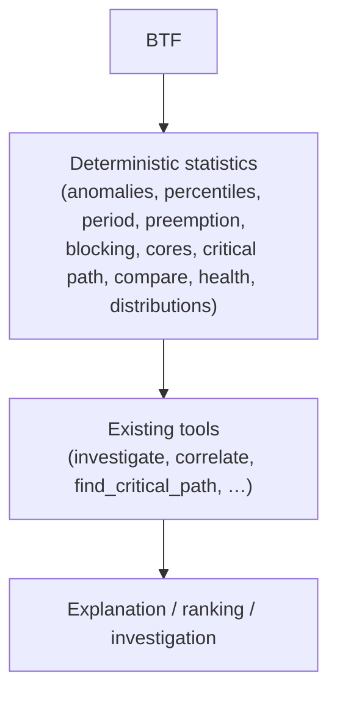


The shipped loop stays **Triage → Investigate → Verify → Correlate → Critical Path → Dependency Graph → Temporal Causality → Rank → Challenge → What-if → Report**. Improve access to Statistics evidence; do not grow the tool list. User-facing page map: [README → BTF analysis pages](README.md#btf-analysis-pages).

### Shared Case / Evidence engines

Desktop and Web share one Case, Evidence, planner, causal, tool, and mermaid implementation. After AI UI changes: `make -C BTFViewer bundle` and `make -C BTFViewer web`.

**UI lockstep:** mode chips wrap. Primary templates are two rows: **Analysis Findings** / **Explain region** / **Investigate**, then **Auto investigate** + **More templates…**. Chip min-height 28px, disabled chips/menu items `#8a96a8`. Findings **Investigate…** uses the same outline style as the other Analysis footer buttons (not accent/primary). **More** templates use the same groups in a 2-column overlay. Findings **Save recipe…** and **Story…** stay on that dialog. Trace Compare opens from toolbar **Compare**, not the Statistics footer.

The Desktop `ai-test` CLI and the Web offline benchmark share `tests/ai` fixtures (tracked `.btf` stubs + `dataset.json`). Live runs accept `--context-mode` and `--compare-context` (see [Context mode benchmarking](#context-mode-benchmarking)).

### Validator

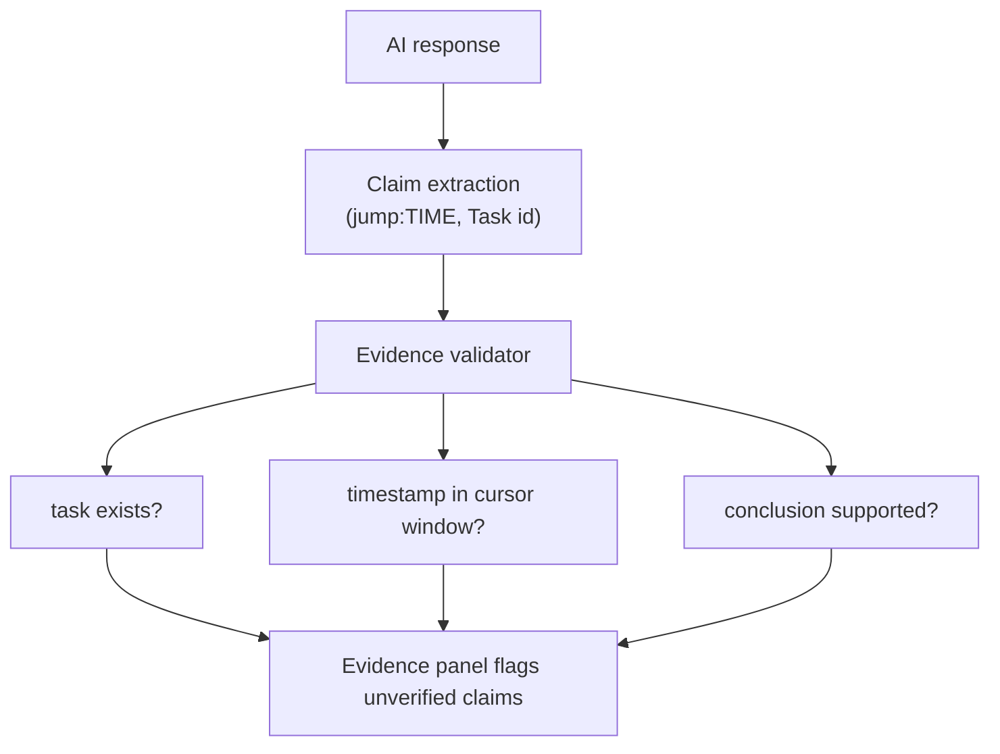


The host validator runs after the final reply. Prompting still forbids inventing numbers, task names, and `jump:TIME`; the validator is the guard, not the prompt.

### Experiment close-out

`validate_experiment` compares expected vs actual signed percents (`VALIDATED` / `PARTIALLY VALIDATED` / `DISPROVED`), updates open hypotheses, and offers **Save to knowledge** (`btfexp:save`). Empty `actual` is filled from the last Trace Compare refresh (including **Scope to cursors**) or `compare_performance` via `experiment_percents_from_compare`. Toolbar **Compare → Validate experiment…** closes the dialog and asks the model to call the tool with actuals omitted. Firmware-change capture remains a user step (new trace + toolbar **Compare**).

### Capability, cost, privacy, knowledge


| Feature          | Host behaviour                                                                                                                                                                                                                                              |
| ---------------- | ----------------------------------------------------------------------------------------------------------------------------------------------------------------------------------------------------------------------------------------------------------- |
| Capability probe | **Test connection** lists models, chats with a JSON structured-output probe, then tool-calling (`btf_ping` then `btf_pong`). Live results overlay chat / structured output / tool calling / multi-tool chaining; long context and reasoning stay heuristic. |
| Cost             | A dedicated usage bar shows `Context: Compact · 4.6k tok · 3 tools · 12s` (mode, tokens, tools, model time). Evidence uses the full `format_cost_meter` line. **Clear** resets replies, the meter, and current investigation issues.                        |
| Privacy          | Chip 🟢 Local / 🟡 Cloud / 🔴 Sensitive. Cloud send is blocked when sensitive; otherwise annotations are sanitized and optional task-name aliases apply (`apply_cloud_privacy`).                                                                            |
| Knowledge        | `investigate` matches user-saved entries (More → **Save current finding…**), then baseline, then the builtin catalog. Typical vs current rates show when both exist.                                                                                        |
| Interpret        | Free-form Ask host-interprets (`interpret_query`), shows the scope card, then **auto-runs** (same as **Run investigation**). Templates / modes / prior assistant replies / short follow-ups skip the host interpret step. Scope toggles still allow re-run. |
| Tool Why?        | Evidence **Investigation** lists each tool with a host-side reason (`btftool:why/name`).                                                                                                                                                                    |


---

## Diagrams

Replies may include Mermaid sequence diagrams for mutex, blocking, and priority events, or flowcharts for core migrations. **Compact** context mode emits diagrams only when the user asks. Pipe **Markdown tables** and sanitized HTML tables from Findings render as tables in the reply pane. In-chat Markdown / HTML tables follow the current theme. The Evidence panel also generates an Investigation tree when `investigate` returns a root-cause chain. Diagrams follow the current light or dark theme; **Save As…** HTML exports use the light palette.

- Click a **task** node to lock-highlight that timeline row (`Low[266] (Core 0)` resolves to `Low[266]`).
- Click a **core** node (`Core_0`, `C0`, `C1`) to switch to Core View and scroll to that core.
- Mutex hex and other unresolved labels do nothing (the timeline stays undimmed).
- Click empty figure area to open a larger zoom window (scroll to zoom 0.5–6×; **Esc** or **Close**). Trackpad pinch is treated as scroll.
- The link row under the figure lists only `jump:TIME` and resolvable task/core names — not finding titles, hypotheses, or graph node ids (`F`, `C0`, …).
- **Save As…** HTML keeps inline SVG with clickable nodes (chat zoom wrappers are omitted).

---


## Documentation navigation


| Document                       | Question answered                        |
| ------------------------------ | ---------------------------------------- |
| [README.md](README.md)         | How do I use BTFViewer?                  |
| [WORKFLOWS.md](WORKFLOWS.md)   | How do I diagnose a problem?             |
| [STATISTICS.md](STATISTICS.md) | What does this measurement mean?         |
| [AI.md](AI.md)                 | How does AI-assisted investigation work? |
