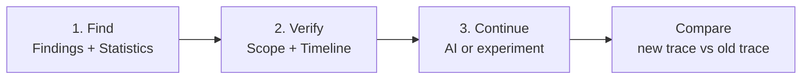
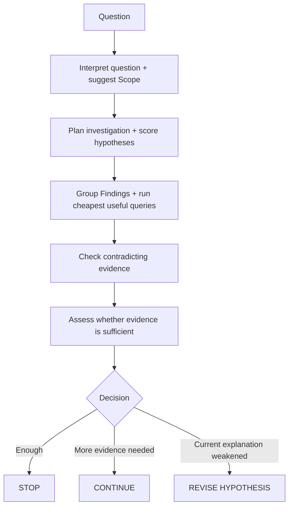
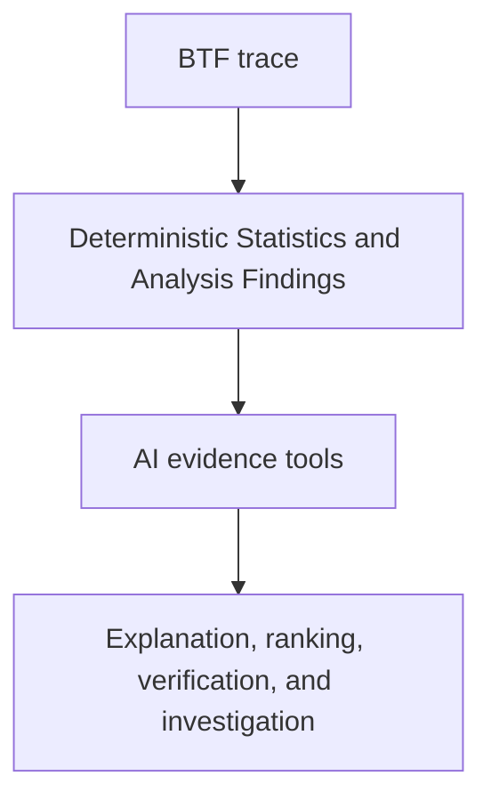

# AI Assistant

BTFViewer's **AI Assistant** helps you investigate BTF trace data that
BTFViewer has already measured. It does not replace Statistics or the
timeline. Use it to organize evidence, test an explanation, find missing
checks, and plan the next step.

> **Important:** measured values come from BTFViewer. AI explanations
> are interpretations of that evidence. **What-if** and **Optimize** are
> estimates, not measured RTOS behavior.

## Where to start

For most investigations, use this simple flow:



1.  **Find the problem.** Start with **Analysis Findings** and the
    related Statistics section.
2.  **Verify the evidence.** Use C1--Cn and the timeline to confirm that
    the event really happened in the expected region.
3.  **Continue the investigation.** Ask AI to explain or challenge the
    evidence, or make one controlled change and capture another trace.
4.  **Compare the result.** Use **Trace Compare** to measure whether the
    change helped.

AI is optional. You can complete an investigation with Statistics, the
timeline, Investigation Notebook, and Trace Compare. The Notebook is the
user-facing record; AI suggestions remain opt-in and do not edit it automatically.

## Contents

### User guide

1. [What the AI Assistant does](#what-the-ai-assistant-does)
2. [Using the AI panel](#using-the-ai-panel)
3. [Built-in actions](#built-in-actions)
4. [Choosing the right entry point](#choosing-the-right-entry-point)
5. [Investigation workflows](#investigation-workflows)
6. [Common use cases](#common-use-cases)
7. [Worked example](#workflows-and-use-cases)
8. [Continue the investigation](#continue-the-investigation)
9. [Understanding the result](#understanding-the-result)
10. [AI tools](#ai-tools)
11. [Configuration and privacy](#configuration-and-privacy)
12. [Viewer behavior](#viewer-behavior)
13. [Troubleshooting](#troubleshooting)

### Engineering reference

14. [Investigation Case](#investigation-case)
15. [Investigation planner](#investigation-planner)
16. [Saved results and reports](#saved-results-and-reports)
17. [Engine limits](#engine-limits)
18. [Complete tool reference](#complete-tool-reference)
19. [CLI and regression checks](#cli-and-regression-checks)
20. [Benchmark results](#benchmark-results)
21. [Implementation notes](#implementation-notes)

22. [Documentation navigation](#documentation-navigation)

------------------------------------------------------------------------


<a id="what-the-ai-assistant-does" name="what-the-ai-assistant-does"></a>

## What the AI Assistant does

The AI Assistant receives structured information from BTFViewer. It does
**not** read the full raw `.btf` file as free-form text.

It can use:

-   **Analysis Findings** --- deterministic clues generated by
    BTFViewer.
-   **Statistics** --- measured or derived metrics for the current
    scope.
-   **Timeline evidence** --- events and timestamps returned by
    BTFViewer tools.
-   **Scope and Filters** --- the active C1--Cn range and
    task/core/migration restrictions.
-   **Trace Compare** --- measured differences between two traces.
-   **Investigation state** --- the current finding, hypothesis,
    evidence, and checks.

It does not read firmware source code or ELF files.

### What AI is good for

Use AI when you want to:

-   explain why a measured result may matter;
-   connect several pieces of evidence;
-   check whether an explanation is supported;
-   look for an alternative explanation;
-   identify missing evidence;
-   plan the next measurement;
-   summarize an investigation;
-   compare two traces in plain language.

### What AI should not decide by itself

Do not treat these as measured facts unless BTFViewer provides
supporting evidence:

-   a root cause;
-   a task dependency that is not visible in the trace;
-   scheduler behavior that was not recorded;
-   the effect of a proposed firmware change;
-   a performance improvement predicted by What-if or Optimize.

Return to Statistics and the timeline whenever a conclusion matters.

------------------------------------------------------------------------

<a id="using-the-ai-panel" name="using-the-ai-panel"></a>

## Using the AI panel

The AI panel is designed around the current trace and investigation
state.

### Main controls

**Question box**

Type a normal question about the current trace. The assistant receives
the current BTFViewer context.

**Start Investigation**

Use this when you want BTFViewer to guide a full investigation. It is
the best default for a new user.

The flow is:

```text
Triage → Scope → Investigate → Verify → Experiment → Compare
```

The assistant should reuse evidence already collected instead of
repeating the same checks.

**Context**

The collapsed Context line summarizes the current stage, scope, focus,
context mode, and privacy state. Expand it when you need to check
exactly what will be sent.

Important items are:

-   active trace;
-   full trace or C1--Cn scope;
-   task/core/migration filters;
-   selected task or finding;
-   context mode;
-   endpoint and privacy state.

**Clear**

Clears the AI conversation and current AI investigation state. It does
not replace normal trace controls.

**Language...**

Sets the requested reply language.

**Settings...**

Opens AI connection, model, context, privacy, and related options.

### Context modes

BTFViewer provides three context sizes:

-   **Compact** --- lowest token use; best for focused questions.
-   **Balanced** --- default; enough context for most investigations.
-   **Full Evidence** --- sends more evidence; use when the smaller
    modes omit information needed for a difficult case.

A larger context does not automatically mean higher confidence.
Confidence should come from evidence.

------------------------------------------------------------------------

<a id="built-in-actions" name="built-in-actions"></a>

## Built-in actions

The AI panel provides shortcuts for common tasks. The visible shortcuts are
context-sensitive, and additional templates are available from **More templates…**.
Treat them as different questions that reuse the same investigation context, not
as separate analysis systems.

### Start Investigation

**Use when:** you do not know which AI action to choose.

**What it does:** guides the investigation from the current evidence and
chooses the next useful checks.

**Expected result:** a leading explanation, evidence,
confidence/quality, and a next check.

### Analysis Findings

**Use when:** you want a short summary of the most important current
Findings.

**What it does:** summarizes up to a few actionable Findings and points
to the relevant Statistics or timeline check.

**Does not:** prove root cause.

### Triage findings

**Use when:** there are many Findings.

**What it does:** ranks the Findings that deserve attention first.

**Does not:** perform a full root-cause analysis.

### Explain region

**Use when:** C1--Cn surrounds an incident.

**What it does:** explains events inside the cursor range and keeps
cited timestamps inside that range.

### Investigate

**Use when:** you already have a concrete performance problem.

**What it does:** gathers missing evidence, correlates related events,
tests the leading explanation, and identifies an alternative.

### Verify finding

**Use when:** you want to check whether a selected Finding is actually
supported.

**What it does:** checks the claim against available evidence and
returns **Confirmed**, **Rejected**, or **Inconclusive**.

### Explain finding

**Use when:** a Finding is technically correct but difficult to
understand.

**What it does:** explains the Finding and points to supporting
evidence.

### What-if

**Use when:** evidence is strong enough to consider one possible change.

**What it does:** estimates the likely direction of change.

**Important:** the result is an estimate, not a scheduler simulation or
measured result.

### Optimize

**Use when:** you want candidate improvement ideas after the problem has
been verified.

**What it does:** ranks possible directions to test.

**Important:** validate every useful idea with a new trace.

### Trace Compare

**Use when:** two traces are open.

**What it does:** explains measured A/B differences from Trace Compare.

------------------------------------------------------------------------

<a id="choosing-the-right-entry-point" name="choosing-the-right-entry-point"></a>

## Choosing the right entry point

You can ask AI from several places. Each entry point should carry the
evidence that is already visible there.

-   **Analysis Findings → Ask AI:** use the selected Finding and its
    evidence.
-   **Timeline event → Ask AI about this event:** use the selected task,
    core, and event time.
-   **Timeline region → Explain this region with AI:** use C1--Cn.
-   **Statistics → Query with AI...:** use the selected metric, task,
    and displayed samples.
-   **Migration & Corridor Inspector → Investigate with AI:** use the
    selected migration path and current Inspector scope.
-   **Trace Compare → Query with AI...:** use the comparison tables for
    the selected traces.
-   **AI panel:** use the current trace, Scope, Filters, selection, and
    investigation state.

### Scope matters

Use **Limit to C1--Cn** when the problem belongs to one phase of the
trace. AI evidence should then stay inside that interval unless it
clearly states why information outside the range is needed.

A visual highlight is not a Filter. Task, core, and migration Filters
affect the analysis context.

------------------------------------------------------------------------

<a id="investigation-workflows" name="investigation-workflows"></a>

## Investigation workflows

Use these workflows after selecting the task, Finding, or time window to investigate.

### Investigation workflow

| Step | Template or tool | Purpose |
| ---: | --- | --- |
| 1 | **Triage findings** / `detect_anomalies` | Rank the important Findings and open the related Statistics evidence |
| 2 | **Investigate** / `investigate` | Build hypotheses, alternatives, and an evidence plan |
| 3 | **Verify finding** | Decide whether the selected Finding is supported, rejected, or still inconclusive |
| 4 | `correlate_events` + `query_raw_metric` | Combine execution, blocking, migration, synchronization, and PI evidence for the selected task |
| 5 | `find_critical_path` / `detect_priority_inversion` | Inspect preemption, blocking, and priority-inversion paths when relevant |
| 6 | `build_task_dependency_graph` / `analyze_temporal_causality` | Organize dependency and happens-before relationships recorded by BTF |
| 7 | `rank_root_causes` / `challenge_conclusion` | Rank explanations and test credible alternatives |
| 8 | `find_related_findings` / `compare_tasks` | Check related Findings or compare suspect tasks |
| 9 | `set_cursors` / `zoom_to_range` / `highlight_task` | Bring the strongest evidence back to the timeline |
| 10 | **Evidence & Validation** | Review evidence, missing checks, contradictions, and the next useful check |
| 11 | `generate_report` / `close_investigation` / `export_investigation` | Record the result when the investigation is ready to close |

The sequence is not a requirement to run every tool. The Investigation planner should reuse existing evidence and skip steps that do not apply.


The shortcuts are easier to understand when they are placed in a
complete workflow.

### First investigation

Use this sequence when opening an unfamiliar trace:

1.  Open **Analysis Findings** and choose one relevant warning or error.
2.  Open the supporting Statistics section and confirm the measured
    symptom.
3.  Select the affected task and inspect its timeline.
4.  Put C1 and C2 around one representative incident. Add more cursors
    only when they help define a larger sequence.
5.  Enable **Limit to C1--Cn** when the problem is specific to that
    interval.
6.  Open the AI panel and use **Start Investigation**.
7.  Follow the cited evidence instead of reading only the explanation.
8.  Use **Verify finding** when the explanation appears plausible.
9.  If evidence is incomplete, follow **Next check** or ask for the
    missing measurement.
10. Only after verification, use **What-if**, **Optimize**, or define
    your own controlled change.
11. Capture a new trace under comparable conditions.
12. Use **Trace Compare** to measure the result.

A useful investigation result is not a long AI answer. It is a
short chain that can be checked:

```text
Measured symptom
    ↓
Scoped incident
    ↓
Supporting event or metric
    ↓
Leading explanation
    ↓
Verification / contradiction
    ↓
Measured experiment result
```

### Explain one event

Use this when you already see a suspicious timeline segment.

1.  Select the segment.
2.  Choose **Ask AI about this event**.
3.  Check the task, core, and timestamp included in the request.
4.  Follow any `jump:TIME` reference back to the timeline.
5.  If the event is part of a longer sequence, place C1--Cn around the
    sequence and continue with **Explain region**.

This path is intended for a local question. It should not automatically
become a full-trace root-cause analysis.

### Explain one region

Use this when the important behavior is contained between cursors.

1.  Place at least two cursors.
2.  Confirm the intended interval.
3.  Enable **Limit to C1--Cn** if Statistics and AI should use only that
    range.
4.  Use **Explain this region with AI** or **Explain region**.
5.  Check that cited timestamps belong to the intended interval.
6.  Expand the range only when evidence shows that an earlier cause or
    later effect must be inspected.

### Verify a Finding

A Finding is a clue produced by deterministic rules or statistics. It is
not automatically a cause.

A useful verification should answer:

-   What exactly is the claim?
-   Which measured values support it?
-   Which timeline events support it?
-   Is the evidence inside the current Scope?
-   Is there contradictory evidence?
-   Is another explanation still plausible?
-   What evidence is still missing?

The final status should be understandable without reading internal tool
logs.


<a id="what-if-and-optimize-workflow" name="what-if-and-optimize-workflow"></a>

### What-if and Optimize workflow

`what_if` and `optimize_experiment` are **heuristic slice-replay** tools. They reuse measured execution slices and estimate the effect of changes such as task placement, migration reduction, blocking reduction, or priority adjustment.

They do **not** simulate an RTOS kernel or a deterministic scheduler. Their output is an estimate used to choose an experiment, not proof that the change will work.

| Goal | Use | Example |
| --- | --- | --- |
| Test one concrete idea | **What-if** → `what_if` | Pin a task to one core, raise a priority, reduce contention |
| Rank several ideas | **Optimize** → `optimize_experiment` | Compare placement, contention, priority, or migration changes |
| Get qualitative advice | `optimize` | Explain likely mitigations without a scored simulation |
| Decide what to measure next | `recommend_experiments` | Turn the estimate into a real validation experiment |

Read the result by comparing the measured **baseline** with the **simulated** estimate. Depending on the case, useful fields include migrations, blocking time, load-balance score, and experiment cost.

**Medium confidence** means the idea may be worth testing on the real system. **Low confidence** usually means the requested change is vague or the trace contains too little evidence.

Always finish the workflow with a real measurement:

```text
Verified evidence
    ↓
What-if / Optimize estimate
    ↓
One controlled system change
    ↓
Capture a new trace
    ↓
Trace Compare
```

The new trace, not the estimate, determines whether the change worked.

<a id="common-use-cases" name="common-use-cases"></a>

## Common use cases

### Long response-time tail

Start with the response-time distribution and p95/p99/Max. Scope one
slow instance, then inspect execution, dispatch, blocking, and nearby
preemption. AI can help organize these components, but the cited values
should remain traceable to Statistics.

### Blocking or synchronization problem

Start from blocking or mutex-related Statistics. Scope one incident and
inspect the owner/waiter sequence that is actually visible in the trace.
Treat inferred handoff or waiter relationships as heuristic when the
trace format does not contain the kernel's real wait queue.

### Core migration or ping-pong

Use Migration & Corridor Inspector first. Check migration count, dwell,
ping-pong behavior, load balance, and the selected path. AI can
correlate the path with nearby scheduling or synchronization evidence. A
migration by itself is not proof of a performance problem.

### Suspected priority inversion

Use the relevant priority, blocking, mutex, and scheduling evidence. AI
may use `detect_priority_inversion`, but the conclusion still depends on
what the trace recorded. Missing kernel state must not be invented.

### Regression after a change

Open comparable baseline and candidate traces. Use Trace Compare before
asking AI. AI should explain the measured differences, localize the
likely task/region, and identify the next check. The comparison result
is stronger evidence than an estimated improvement.

### Periodic task jitter

Start with period, dispatch, execution, and response distributions. Use
C1--Cn around a representative outlier. Check whether the disturbance
repeats and whether it aligns with blocking, preemption, migration, or
another workload phase.

------------------------------------------------------------------------

<a id="workflows-and-use-cases" name="workflows-and-use-cases"></a>

## Worked example

Suppose Analysis Findings reports unusually high response-time p99 for
`Worker`.

A useful investigation is:

1.  Open the response-time Statistics section and confirm that p99 is
    actually high.
2.  Open the distribution and inspect one representative slow sample.
3.  Use **Show on timeline** or the related timestamp to reach that
    event.
4.  Put C1 and C2 around the incident.
5.  Enable **Limit to C1--Cn**.
6.  Ask AI to investigate the selected Finding.
7.  Check whether the response delay is associated with execution,
    dispatch, blocking, preemption, migration, or another measured
    component.
8.  Use **Verify finding** to test the leading explanation and look for
    contradicting evidence.
9.  If the result remains inconclusive, follow the missing-evidence
    check rather than forcing a root-cause statement.
10. If a concrete change is justified, capture another trace and compare
    the same metric.

A good final note is concise:

```text
Observation:
Worker response-time p99 is elevated in the selected phase.

Evidence:
The slow sample is inside C1–C2 and coincides with the measured scheduling/blocking evidence cited by BTFViewer.

Conclusion:
Leading explanation supported / rejected / still inconclusive.

Next action:
One measurable change or one additional evidence check.
```

------------------------------------------------------------------------

<a id="continue-the-investigation" name="continue-the-investigation"></a>

## Continue the investigation

The AI conversation should continue from the current investigation instead of restarting after every reply.

Use **Next check** when the Evidence panel already identifies the most
useful missing check. Use a normal follow-up question when you want to
change the question, challenge the explanation, or ask for
clarification.

When BTFViewer exposes a runnable next step, the action should continue
with the current investigation context. Completed evidence should be
reused. Repeating the same read-only queries is useful only when Scope,
Filters, trace selection, or required evidence has changed.

A sensible stopping condition is reached when:

-   the main claim has enough evidence for the intended engineering
    decision;
-   a credible alternative has been checked;
-   remaining missing evidence is unlikely to change the decision; or
-   the trace does not contain enough information and a new capture is
    required.

"Inconclusive" is a valid result.

------------------------------------------------------------------------

<a id="understanding-the-result" name="understanding-the-result"></a>

## Understanding the result

### Evidence & Validation

This panel is the quickest place to decide whether the AI answer is
useful.

Read it in this order:

1.  **Verdict** --- current result of the investigation.
2.  **Leading explanation** --- the best explanation supported so far.
3.  **Direct / Timeline evidence** --- measured evidence that can be
    checked in BTFViewer.
4.  **Checks** --- claims that were tested.
5.  **Alternatives** --- other explanations considered.
6.  **Missing evidence** --- information still needed.
7.  **Next check** --- the most useful next action.
8.  **Investigation details** --- deeper diagnostic information such as
    tools used and confidence evolution.

Do not start with the deepest details. For normal use, the first seven
items are enough.

### Evidence strength

BTFViewer may distinguish evidence as measured, derived, heuristic,
configured, or simulated/estimated. These are not equally strong.

Prefer this order when making a decision:

```text
measured event/value
    ↓
derived statistic
    ↓
heuristic interpretation
    ↓
estimate / simulation
```

### Confidence

Confidence describes how well the available evidence supports the
explanation. It is not the probability that the AI is correct.

A high-confidence causal statement should have trace evidence and
verification, not only a plausible narrative.

### Apply, Skip, and Undo

Read-only evidence queries can run immediately.

Actions that change the viewer may appear as action cards:

-   **Navigation** --- move or zoom the timeline.
-   **Scope** --- change the active analysis range.
-   **Filter** --- change task/core/migration restrictions.
-   **Annotation** --- add marks or notes.
-   **Export** --- save a report or investigation package.
-   **Calculation** --- run an evidence or estimate operation.

Use **Apply** to accept a pending viewer change and **Skip** to leave
the viewer unchanged. **Undo** restores supported viewer state such as
zoom, cursors, highlight, Scope, and Filters.

------------------------------------------------------------------------

<a id="ai-tools" name="ai-tools"></a>

## AI tools

Most users do not need to call tools by name. The AI Assistant chooses
them when needed. This section explains what each group is for.

### 1. Navigate and show evidence

These tools change what you see in the viewer.

-   `set_cursors` --- place C1--Cn at evidence timestamps.
-   `zoom_to_range` --- zoom to a time interval.
-   `highlight_task` --- highlight one task.
-   `set_view_mode` --- switch Task/Core or orientation.
-   `open_corridor_inspector` --- open Migration & Corridor Inspector.
-   `open_statistics_section` --- open a Statistics section without
    changing Scope.
-   `add_annotation` --- add a note at a timestamp.
-   `bookmark_finding` --- preserve a Finding as a bookmark.
-   `clear_marks` --- clear selected marks/cursors/bookmarks.
-   `reset_view` --- return to the full trace view.

### 2. Measure and search

These are read-only evidence tools.

-   `query_raw_metric` --- read scoped task metrics such as execution,
    blocking, migration, synchronization, priority inheritance,
    activation, and ready gaps.
-   `search_timeline` --- find matching timeline events and timestamps.
-   `analyze_distribution` --- calculate percentiles, spread, CV, and
    outlier information.
-   `analyze_periodicity` --- inspect expected period and timing jitter.
-   `check_budget` --- compare timing against a configured budget or
    deadline.
-   `decompose_response_time` --- show relative response-delay
    components.

### 3. Find and connect related problems

-   `detect_anomalies` --- rank current Analysis Findings.
-   `cluster_findings` --- group related Findings.
-   `cluster_incidents` --- group events that occur close together.
-   `investigate` --- build an investigation graph for a Finding.
-   `plan_investigation` --- choose useful next checks.
-   `suggest_scope` --- suggest a focused time range.
-   `correlate_events` --- combine execution, blocking, migration,
    synchronization, priority, and search hits around an event.
-   `find_related_findings` --- locate Findings related to the current
    issue.
-   `find_critical_path` --- inspect blocking, preemption, and mutex
    activity around an incident.
-   `build_task_dependency_graph` --- show observed
    wait/preempt/migrate/priority-inheritance relationships.
-   `analyze_temporal_causality` --- build an observed happens-before
    sequence.
-   `build_causal_chain` --- organize causal, correlated, and temporal
    links without silently treating correlation as causation.
-   `rank_root_causes` --- rank supported explanations.

### 4. Verify and challenge an explanation

-   `verify_claim` --- classify a claim as supported, partial, or
    unsupported.
-   `detect_contradictions` --- search for evidence against the current
    explanation.
-   `challenge_conclusion` --- propose credible alternatives and missing
    evidence.
-   `assess_evidence_sufficiency` --- decide whether to stop, continue,
    or revise the hypothesis.
-   `manage_hypotheses` --- track hypothesis state.
-   `detect_priority_inversion` --- inspect evidence consistent with
    priority inversion.
-   `explain_finding` --- explain a selected Finding.

### 5. Compare traces and tasks

-   `trigger_compare` --- obtain/open Trace Compare for two traces.
-   `compare_performance` --- return structured A/B metric differences.
-   `regression_explain` --- explain the primary measured regression.
-   `regression_localize` --- locate a likely task and region associated
    with the regression.
-   `compare_tasks` --- compare two tasks.
-   `baseline_score` --- compare current behavior with a stored
    baseline.
-   `analyze_traces` --- compare scheduling behavior across several open
    traces.
-   `generate_fingerprint` --- summarize scheduling, synchronization,
    and timing bands.

### 6. Plan and validate an experiment

These tools come after evidence gathering.

-   `what_if` --- estimate one proposed change.
-   `optimize` --- suggest qualitative improvement directions.
-   `optimize_experiment` --- rank candidate changes to test.
-   `recommend_experiments` --- suggest validation experiments.
-   `generate_experiment_plan` --- create a concrete firmware/bench test
    plan.
-   `validate_experiment` --- compare a prediction with the measured
    result.
-   `record_experiment_outcome` --- save the measured outcome for later
    matching.
-   `find_similar_investigations` --- find recorded cases with a similar
    fingerprint.

### 7. Report and preserve the investigation

-   `generate_report` --- generate structured engineering text.
-   `export_report` --- save a diagnostic report.
-   `export_investigation` --- save the full investigation package.
-   `summarize_investigation_context` --- create a compact investigation
    summary.
-   `investigation_memory` --- store or recall similar investigation
    records.
-   `close_investigation` --- close the current investigation with its
    conclusion and confidence.

### Supporting host tool

-   `interpret_query` --- interprets a free-form question and prepares
    the appropriate investigation request before the main run.

------------------------------------------------------------------------

<a id="configuration-and-privacy" name="configuration-and-privacy"></a>

## Configuration and privacy

### Connect an endpoint

Open **Settings → AI** and configure the provider, endpoint, model, and
authentication required by that provider. Use **Test connection** before
starting an investigation.

BTFViewer can test model listing, chat, structured output, and tool
calling when supported by the endpoint.

### Import provider settings

**Settings → AI → Import…** loads preset, base URL, model, API key, and
authentication mode from a JSON file (see `examples/ai/*.json`). A
preset name that isn't already in the list — for example `openrouter`
or `deepseek` — is added as a new preset instead of being folded into
Custom. Each imported preset keeps its own Base URL, Model, API key,
authentication mode, and TLS setting, independent from the built-in
presets and from every other imported preset.

Import updates the Settings dialog immediately, but nothing is written
to disk (`btf_viewer.rc`) or browser storage until you click **OK**.
**Cancel** discards the import.

Importing the same preset again — after normalizing case and
punctuation, so `OpenRouter` and `open-router` match the same entry —
updates that preset's saved values instead of creating a duplicate. A
file that lists multiple presets adds all of them, without removing
presets you imported earlier.

### Choose a model

For BTFViewer, tool reliability matters more than fluent prose. Prefer a
model that can:

-   follow structured instructions;
-   call tools reliably;
-   preserve tool-call state across follow-up turns;
-   handle the selected context size;
-   distinguish evidence from inference.

Use the project's benchmark results when choosing between supported
models. Model recommendations change over time and should not be
inferred from this document alone.

### Privacy

The AI panel indicates whether the configured endpoint is local or
cloud-based. Review the current privacy state before sending
trace-derived information to a remote service.

Cloud privacy handling may sanitize annotations and optionally alias
task names. Sensitive configurations can block cloud sending.

### Credentials

Use the credential method provided by the current BTFViewer
implementation and provider. Do not place API keys in trace files,
reports, screenshots, or shared investigation packages.

### Reset to Defaults

**Settings → Reset to Defaults** restores every tab in the dialog to
its built-in default, including layout, Statistics presentation, and
AI settings. For AI specifically, this means:

-   every preset added by Import… is removed;
-   the preset list returns to the four built-ins (Custom, Ollama,
    OpenAI, Gemini);
-   the current AI investigation/conversation is cleared;
-   saved API keys and tokens are cleared, for the built-in presets and
    any imported ones.

Like Import, Reset to Defaults only changes the dialog until you click
**OK**. Reopening Settings and clicking **Cancel** afterward leaves
your previous configuration — presets, credentials, and conversation —
untouched.

------------------------------------------------------------------------

<a id="viewer-behavior" name="viewer-behavior"></a>

## Viewer behavior

A few rules are important when interpreting AI actions:

-   Read-only evidence queries do not change the timeline.
-   Navigation may move the viewport, cursors, or highlight.
-   Scope and Filter changes affect later Statistics and AI evidence.
-   A highlight is visual only; it is not a Filter.
-   `open_statistics_section` opens the requested Statistics section
    without changing Scope.
-   Trace Compare requires at least two loaded traces.
-   What-if and Optimize results must remain labeled as estimates.
-   Saved reports should preserve the evidence hierarchy while avoiding
    unnecessary internal tool chatter.

------------------------------------------------------------------------

<a id="troubleshooting" name="troubleshooting"></a>

## Troubleshooting

### AI is unavailable

Check **Settings → AI**, the configured endpoint, model, authentication,
and **Test connection**.

### The answer is too broad

Narrow the problem first:

1.  select the relevant task;
2.  place C1--Cn around the incident;
3.  enable **Limit to C1--Cn** if appropriate;
4.  ask one specific question.

### The answer cites the wrong region

Confirm the current Scope and Filters. If C1--Cn is active, verify that
cited `jump:TIME` evidence lies inside the range.

### The answer sounds plausible but has weak evidence

Use **Verify finding** or ask the assistant to challenge the conclusion.
Then check the cited Statistics and timeline events yourself.

### The model repeats tool calls

Use a more focused Scope, clear an excessively long conversation, or use
a model with more reliable tool calling. A verification action should
reuse existing evidence whenever possible.

### A local model's reply or proposal is cut off

If **Gather evidence with AI** (or another Notebook collaboration) returns
an incomplete answer -- a `btf-viewer-nb-proposal` JSON block that stops
mid-way -- the model hit its output limit or stopped early while
generating. The Notebook shows a hint in place of the truncated text.

BTFViewer already asks for a proposal-sized reply budget (4096 tokens) on
every Notebook collaboration, so the remaining causes are the model and
the server:

1.  Use a larger or instruction-tuned model; small models lose track of a
    long structured reply and emit an end-of-text token early.
2.  Reduce the request size: narrow the Scope, trim the investigation to
    the essential evidence before collaborating, and clear a long chat.
3.  Give a local server a large input window and restart it. For Ollama,
    `OLLAMA_CONTEXT_LENGTH=8192 ollama serve` (or larger), or add
    `PARAMETER num_ctx 8192` to a `Modelfile` and `ollama create`. A value
    set only for an interactive `ollama run` session does not apply to API
    calls.

`num_ctx` (input window) is separate from the reply budget. **Compact**
context mode is fine for Notebook collaboration -- the 4096-token proposal
budget overrides its usual 500-token reply cap.

### Connection errors

For browser CORS, authentication, TLS, model-not-found, timeout, or
provider-specific errors, first use **Test connection**. If the endpoint
itself does not respond correctly, fix the endpoint before debugging the
investigation workflow.

------------------------------------------------------------------------

<a id="investigation-case" name="investigation-case"></a>

## Investigation Case

BTFViewer keeps one shared **Investigation Case** (`btf-investigation-case`) so that several AI actions can continue the same investigation instead of rebuilding context from the conversation each time.

The case can contain:

- the current question;
- Scope: trace, C1–Cn, tasks, and cores;
- observations;
- hypotheses and their state:
  - `supported`
  - `possible`
  - `need evidence`
  - `rejected`
- supporting and contradicting evidence;
- Evidence Graph;
- Coverage;
- falsification checks;
- missing evidence;
- conclusion;
- validation;
- experiment prediction and measured outcome.

The Investigation Case is a continuity mechanism. It does **not** make an AI conclusion true. The important part is still the evidence that can be checked in BTFViewer.

### Validation

After a final assistant reply, the host-side validator checks claims that can be verified mechanically. It extracts references such as:

- `jump:TIME`
- `Task[id]`

and can flag:

- invented task names;
- timestamps that do not exist;
- timestamps outside the active cursor range.

This protects the investigation from claims that sound plausible but cannot be mapped back to the trace.

### Model capability check

**Test connection** can append a model-capability result covering supported features such as:

- live chat;
- structured output;
- tool calling.

These checks describe endpoint capability. They are separate from the benchmark suite, which measures investigation quality on known cases.

### Headless evaluation

The same investigation behavior can be checked without the GUI:

```bash
make -C BTFViewer ai-test

# or
python builds/btf_viewer.py ai-test \
  --dataset tests/ai \
  --fail-under 70
```

### Investigation modes

Host-side modes such as:

```text
quick
diagnose
compare
optimize
report
```

still map to existing investigation templates internally. They are not intended to become a permanent row of additional UI buttons. The same workflows should remain available through the dynamic shortcuts or **More templates…**.

Regardless of the mode, important conclusions should still be verified against Statistics and the timeline.

---

<a id="investigation-planner" name="investigation-planner"></a>

## Investigation planner

The Investigation planner is host-side logic that decides **what evidence should be checked next**.

Its main rule is:

> **Cheapest useful evidence first.**

The planner should prefer low-cost checks that can change the conclusion before requesting broader or more expensive evidence. It should also avoid repeating work that the current Investigation Case already contains.



### Planner flow

The planner normally proceeds in this order:

1. Interpret the question.
2. Suggest or reuse an appropriate Scope.
3. Build or rank hypotheses.
4. Group related Findings when useful.
5. Run the least expensive evidence checks first.
6. Search for contradictory evidence.
7. Judge whether the collected evidence is sufficient.
8. Stop, continue, or revise the current hypothesis.

This is intended to prevent a full investigation from becoming a fixed sequence of every available tool.

### Planner tools and helpers

| Tool / helper | Purpose | Result |
| --- | --- | --- |
| `plan_investigation` | Rank hypotheses and choose a low-cost evidence sequence from the question and Findings | Ordered investigation plan |
| `suggest_scope` | Suggest task, related tasks, evidence timestamps, or reuse current cursors | Candidate analysis Scope |
| `detect_contradictions` | Test whether available evidence weakens the current explanation | `SUPPORTED`, `CONTRADICTED`, or `INSUFFICIENT` |
| `assess_evidence_sufficiency` | Judge whether current evidence is enough | Stop, continue, or revise |
| `score_hypotheses` | Compute evidence-weighted hypothesis scores; host helper, not a GUI tool | Ranked hypotheses |
| `cluster_findings` | Group Findings by shared task or pattern | Related Finding groups |
| `generate_fingerprint` | Summarize scheduling, synchronization, and timing bands | HIGH / MEDIUM / LOW feature bands |
| `find_similar_investigations` | Compare the current fingerprint with recorded experiment outcomes | Similar recorded cases |
| `regression_localize` | Use A/B differences to locate the likely task, region, and mechanism | Regression focus |
| `build_causal_chain` | Organize causal, correlated, and temporal edges | Evidence relationship chain |
| `generate_experiment_plan` | Rank pinning, contention, priority, or related experiments | Candidate experiments |
| `record_experiment_outcome` | Save the measured experiment result | Reusable investigation record |
| `score_investigation_metrics` | Host-side close-out scoring; not model-facing | Investigation quality metrics |

`build_causal_chain` must keep causal, correlated, and temporal edges distinct. A disclaimer is required when the evidence does not support a true causal claim.

### Investigation quality metrics

When an investigation is closed, host-side scoring can include:

- `evidence_efficiency`
- `investigation_cost`
- `false_confidence`
- `falsification_quality`
- `scope_accuracy`
- `stop_efficiency`

These metrics can also contribute to benchmark-case scoring, including adversarial-case rates.

### Stop conditions

The planner should stop when:

- the current explanation has enough evidence for the intended decision;
- a credible alternative has been checked;
- additional evidence is unlikely to change the result; or
- the current trace does not contain the information needed to continue.

If the evidence weakens the current explanation, the planner should **revise the hypothesis**, not simply collect more supporting evidence.

### UI rule

Do **not** solve planner limitations by adding more chat templates or more primary buttons. The planner is intended to improve the depth and efficiency of the existing investigation workflow.

---

<a id="saved-results-and-reports" name="saved-results-and-reports"></a>

## Saved results and reports

The AI conversation can be useful during exploration, but the
engineering result should be preserved separately.

A useful saved investigation contains:

-   trace identity;
-   Scope and Filters;
-   observation;
-   supporting evidence references;
-   contradicting or missing evidence;
-   current conclusion;
-   confidence/evidence quality;
-   experiment or next action.

Use the Investigation Notebook for concise investigation records. Use
exported AI reports when a shareable narrative is needed. Avoid making
raw tool logs the main report.

------------------------------------------------------------------------

<a id="engine-limits" name="engine-limits"></a>

## Engine limits

Some tools summarize or infer relationships from BTF evidence. Their names should not be interpreted as capabilities beyond the recorded trace.

| Engine | What it provides | Important limit |
| --- | --- | --- |
| `analyze_temporal_causality` | Happens-before relationships from recorded evidence and `jump:TIME` | Not kernel event replay |
| `build_task_dependency_graph` | BTF synchronization, preemption, migration, and PI edges around tasks | Not a complete ISR or kernel-object graph |
| `decompose_response_time` | Relative contribution derived from available Finding magnitudes | Not cycle-accurate response-time reconstruction |
| `rank_root_causes` | Ranking of hypotheses or Finding groups | The rank is not a probability |
| `investigation_memory` | Local investigation storage and recall | Not a shared team knowledge base |
| `cluster_incidents` | Groups incidents by time proximity | Does not prove a shared cause |
| `analyze_distribution` | Distribution analysis from available BTF samples | Cannot create a series the trace/parser does not provide |
| `analyze_periodicity` | Inter-arrival period and jitter analysis | Not a kernel timer model |
| `simulate_schedule` | Internal helper used by What-if estimation | Not an RTOS scheduler simulator or user-facing tool |

BTFViewer does not reconstruct unrecorded kernel state, inspect ELF/source code, or perform hardware-aware scheduler simulation. If the trace does not contain enough evidence, the correct result is **insufficient evidence**.

<a id="complete-tool-reference" name="complete-tool-reference"></a>

## Complete tool reference

This section is intended for implementation and debugging. Normal users
can stop at [AI tools](#ai-tools).

  ---------------------------------------------------------------------------------------------------
  Tool                            Tool                            Tool
  ------------------------------- ------------------------------- -----------------------------------
  `add_annotation`                `analyze_distribution`          `analyze_periodicity`

  `analyze_temporal_causality`    `analyze_traces`                `assess_evidence_sufficiency`

  `baseline_score`                `bookmark_finding`              `build_causal_chain`

  `build_task_dependency_graph`   `challenge_conclusion`          `check_budget`

  `clear_marks`                   `close_investigation`           `cluster_findings`

  `cluster_incidents`             `compare_performance`           `compare_tasks`

  `correlate_events`              `decompose_response_time`       `detect_anomalies`

  `detect_contradictions`         `detect_priority_inversion`     `explain_finding`

  `export_investigation`          `export_report`                 `find_critical_path`

  `find_related_findings`         `find_similar_investigations`   `generate_experiment_plan`

  `generate_fingerprint`          `generate_report`               `highlight_task`

  `interpret_query`               `investigate`                   `investigation_memory`

  `manage_hypotheses`             `open_corridor_inspector`       `open_statistics_section`

  `optimize`                      `optimize_experiment`           `plan_investigation`

  `query_raw_metric`              `rank_root_causes`              `recommend_experiments`

  `record_experiment_outcome`     `regression_explain`            `regression_localize`

  `reset_view`                    `search_timeline`               `set_cursors`

  `set_view_mode`                 `suggest_scope`                 `summarize_investigation_context`

  `trigger_compare`               `validate_experiment`           `verify_claim`

  `what_if`                       `zoom_to_range`                 
  ---------------------------------------------------------------------------------------------------

Models without native tool calling may use BTFViewer's fallback
tool-call format. For investigation-heavy work, a model with reliable
native tool calling is preferred.

<a id="cli-and-regression-checks" name="cli-and-regression-checks"></a>

## CLI and regression checks

The Desktop CLI includes `ai-test` for AI evidence and validator regression
testing. Offline fixtures are used by default; `--models` runs configured live
endpoints. CLI behavior is Desktop-only and does not need a matching Web command.

Use CLI regression checks to answer questions such as:

-   does a known trace still produce the expected Findings?
-   does a comparison still classify the same regression?
-   does a model/tool change break the investigation workflow?
-   does a saved investigation remain reproducible?

Do not treat `btf_viewer.html` alone as proof that every CLI command is
available.

------------------------------------------------------------------------

<a id="benchmark-results" name="benchmark-results"></a>

<a id="benchmark-suite" name="benchmark-suite"></a>
<a id="benchmark-results" name="benchmark-results"></a>

## Benchmark results

BTFViewer's benchmark suite checks whether an AI model can investigate known BTF trace problems reliably. It is designed for **BTFViewer use**, not as a general-purpose LLM ranking.

The recorded results below are from **2026-09-04** using **17 test cases**. Unless noted otherwise, the model table uses **Full evidence**.

### What the score means

The benchmark evaluates the parts of an investigation that matter most in BTFViewer:

| Area | What is checked |
| --- | --- |
| Finding | Does the model identify the expected problem? |
| Evidence | Are cited tasks, metrics, events, and timestamps supported by the trace? |
| Root cause | Does the explanation match the expected diagnosis rather than a misleading clue? |
| Calibration | Does confidence match the available evidence? |
| Safety | Does the model avoid invented or out-of-scope claims? |

The **Overall** value is a weighted engineering score. It is **not a probability** that the answer is correct. In the recorded suite, Overall ≥ 70 is treated as PASS.

The suite also includes adversarial cases. These contain plausible but misleading clues, such as mutex activity near a CPU-starvation problem or correlation that does not establish causation. They test whether the model follows evidence instead of simply accepting the most obvious explanation.

### Recorded model results

| Model | Use | Overall | Passed | Mean time / case | Main observation |
| --- | --- | ---: | ---: | ---: | --- |
| `qwen3.5:9b` | Local / practical | **88** | 14/17 | 16.2 s | Best practical local reference; strong Evidence and Root-cause scores |
| `qwen3.8:27b` | Local / high latency | 86 | 13/17 | 332 s | Similar score, but much slower in the recorded run |
| `gemini-3.5-flash-lite` | Cloud / fast | 86 | 14/17 | **3.0 s** | Fastest recorded shipped cloud reference |
| `gemini-3.7-flash` | Cloud | 86 | **15/17** | 6.1 s | Highest pass count among the shipped Gemini references |
| `gemini-3.8-flash` | Cloud | 85 | 14/17 | 9.1 s | Good with Balanced/Full evidence; weaker recorded Compact result |

More detailed component scores:

| Model | Finding | Evidence | Root cause | Calibration |
| --- | ---: | ---: | ---: | ---: |
| `qwen3.5:9b` | 85 | 93 | **82** | 80 |
| `qwen3.8:27b` | 88 | **94** | 65 | 80 |
| `gemini-3.5-flash-lite` | 82 | **94** | 65 | 80 |
| `gemini-3.7-flash` | **91** | 91 | 59 | 80 |
| `gemini-3.8-flash` | 88 | 91 | 59 | 80 |

Two additional cloud models were recorded from private configurations. They are useful as references but are **not part of the shipped benchmark model set**:

| Model | Overall | Passed | Mean time / case |
| --- | ---: | ---: | ---: |
| `gpt-5.6-sol` | **88** | 15/17 | 9.6 s |
| `claude-sonnet-5` | 82 | 12/17 | 15.9 s |

### How to read the results

The results show that a higher model size or a larger context does not automatically produce a better BTFViewer investigation.

**For local use**, `qwen3.5:9b` is the practical reference in this test set. It reached Overall 88 with much lower recorded latency than `qwen3.8:27b`. The larger local model therefore did not provide enough measured benefit to offset its much higher runtime in this benchmark.

**For cloud use**, the Gemini models are close in overall score, but their behavior differs. `gemini-3.5-flash-lite` is the fastest recorded option, while `gemini-3.7-flash` completed the most cases successfully. This makes latency and investigation success more useful selection criteria than Overall alone.

**Root-cause score deserves special attention.** Several models identify the right Finding and cite valid evidence but score lower when deciding what actually caused the problem. BTFViewer therefore keeps verification and contradiction checks separate from the first explanation.

<a id="context-mode-benchmarking" name="context-mode-benchmarking"></a>
### Context mode results

BTFViewer can provide three levels of AI context:

| Mode | What the model receives | Best fit |
| --- | --- | --- |
| **Compact** | Smallest useful context | Quick questions and lower token use |
| **Balanced** | More supporting context without sending everything | Normal investigation |
| **Full evidence** | Largest evidence package | Difficult or ambiguous cases |

The recorded benchmark shows:

- Compact used fewer tokens for every tested model.
- Fewer tokens did **not** always mean lower latency.
- More context did **not** always improve the result.
- `qwen3.5:9b` recorded its highest local pass count in Balanced mode.
- `gemini-3.8-flash` performed noticeably worse in Compact than in Balanced or Full evidence.

The practical conclusion is to use **Balanced** for normal investigation and move to **Full evidence** when the case needs broader evidence. Compact is useful when token use matters and the question is narrow.

### What the test cases cover

The 17-case suite includes normal and deliberately misleading trace problems. Major areas include:

- migration and load imbalance;
- mutex contention and priority inversion;
- deadline and response-time problems;
- period and jitter analysis;
- preemption;
- trace regression;
- explaining a selected region;
- waiter/owner handoff interpretation;
- choosing the correct Statistics page;
- distinguishing correlation from causation;
- rejecting timestamps outside the active Scope.

A benchmark case defines expected facts and evidence rather than requiring one exact wording. This allows different models to explain the same correct diagnosis in different ways.

### Why evidence validation matters

BTFViewer checks more than whether the answer sounds reasonable. The benchmark can reject behaviors such as:

- inventing task names or metric values;
- citing a `jump:TIME` that is not present or is outside C1–Cn;
- treating an estimated What-if result as a measured result;
- claiming causation when the trace only supports correlation;
- confirming a misleading clue before gathering the required evidence.

This is why a model with a strong general answer can still receive a lower BTFViewer benchmark score.

### Using the results

Use the benchmark as a **model-selection guide**, not as a permanent ranking.

For a new model or endpoint, compare:

1. investigation pass rate;
2. Evidence and Root-cause scores;
3. latency;
4. token use;
5. for local models, memory use.

The benchmark can be rerun with the BTFViewer `ai-test` workflow and the detailed report is written to [AI_BENCHMARK.md](AI_BENCHMARK.md). The implementation details of the benchmark runner are intentionally kept out of this guide.

<a id="implementation-notes" name="implementation-notes"></a>

## Implementation notes


<a id="analysis-vs-ai-tools" name="analysis-vs-ai-tools"></a>

### Analysis vs AI tools

Measured facts should come from BTFViewer's deterministic Statistics and Analysis Findings first. AI is responsible for **organizing, explaining, ranking, correlating, and challenging** those facts.

Do not add an AI tool when a Statistics page already provides the measurement. For example, AI does not need a second timeline-anomaly detector, another histogram engine, or a separate jitter calculator just to reproduce existing Statistics.



The responsibility boundary is:

- **Statistics / Analysis Findings:** measure and identify evidence.
- **AI tools:** connect evidence, test explanations, and guide the next check.
- **Timeline:** verify the actual event.
- **What-if / Optimize:** estimate experiments only.
- **Trace Compare:** measure the result after a real change.

AI must not invent kernel response time, inspect source/ELF data that BTFViewer did not provide, or claim to simulate the real scheduler.


### Keep measured evidence separate from AI interpretation

BTFViewer Statistics, Findings, timeline events, and Trace Compare are
the evidence layer. AI organizes and tests that evidence.

### Reuse evidence

A later verification step should reuse evidence already collected in the
same investigation. It should query again only when information is
missing, stale, or outside the required Scope.

### Do not hide state changes

Navigation, Scope, Filter, and annotation changes should remain visible
to the user and reversible where supported.

### Avoid premature root-cause language

Use **Leading explanation** until the evidence chain has been verified.
Use **Root cause** only when the available trace evidence supports that
stronger statement.

### Keep the interface usable without AI

Statistics, timeline verification, Investigation Notebook, and Trace
Compare must remain sufficient for a complete manual investigation.

------------------------------------------------------------------------

<a id="documentation-navigation" name="documentation-navigation"></a>

## Documentation navigation

-   [README.md](README.md) --- basic BTFViewer operation.
-   [WORKFLOWS.md](WORKFLOWS.md) --- step-by-step investigation
    workflow.
-   [STATISTICS.md](STATISTICS.md) --- meaning of each measurement.
-   [AI.md](AI.md) --- AI-assisted investigation and tool behavior.
