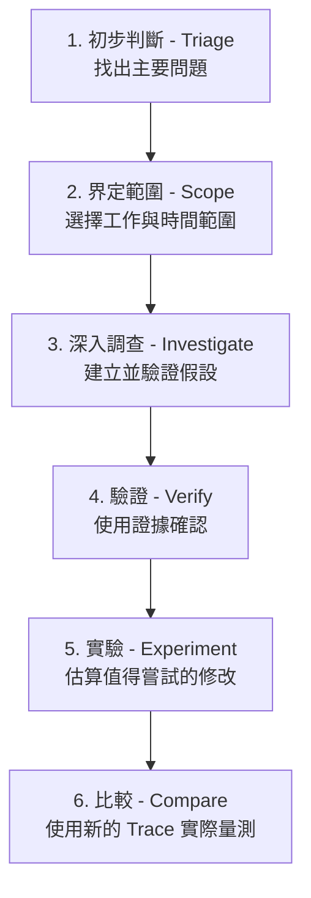
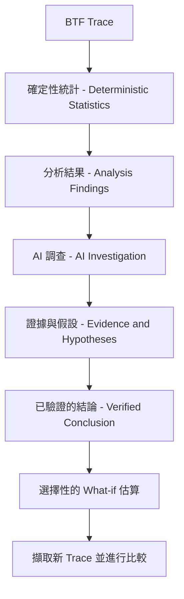
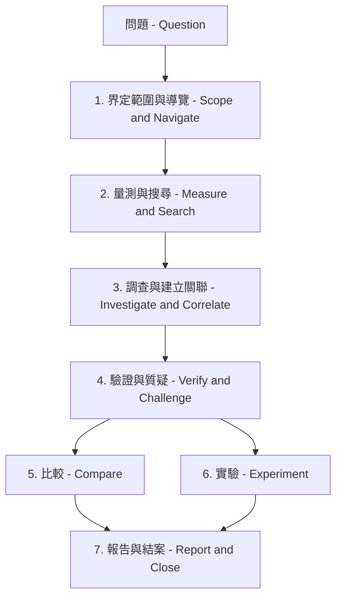
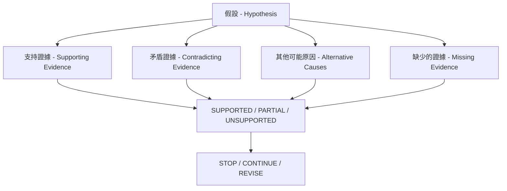
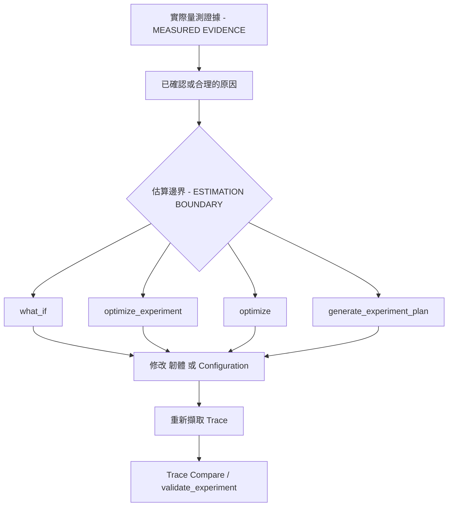
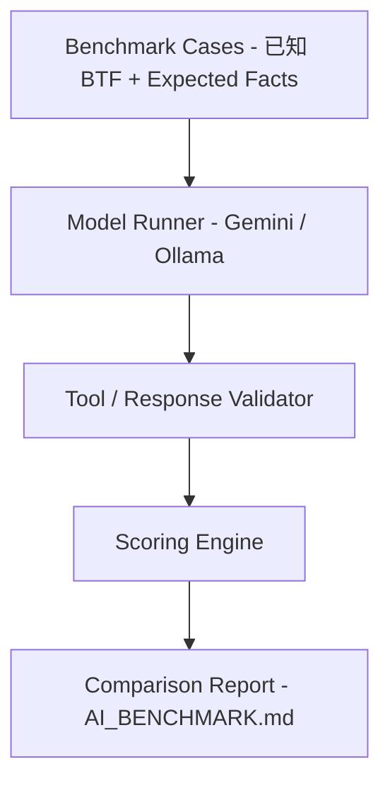
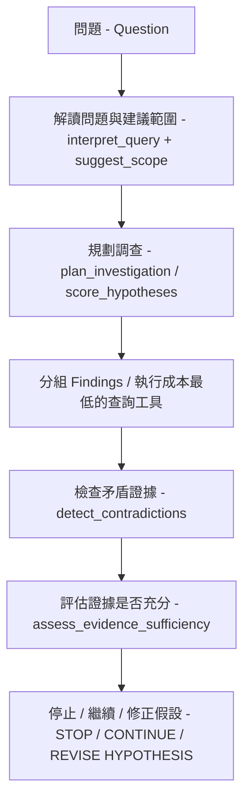
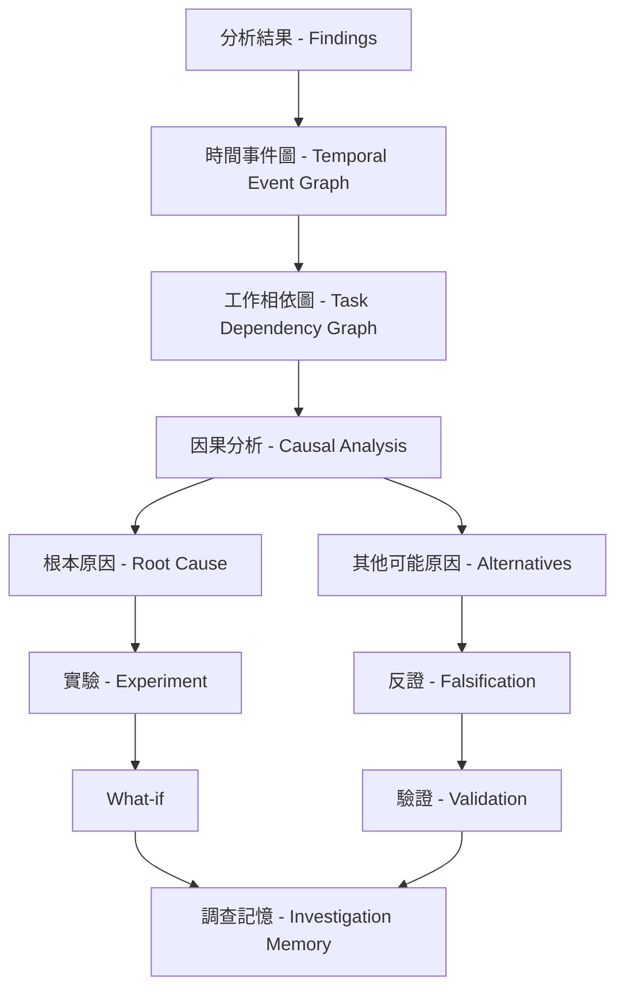
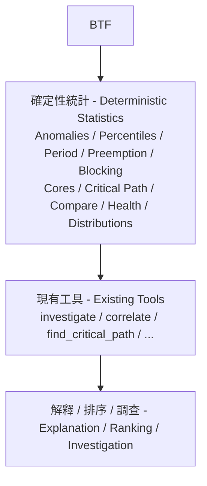

# AI Assistant

BTFViewer 的 **AI Assistant** 可協助分析 RTOS 追蹤資料。它會整理 BTFViewer 已量測的資料與分析結果，檢查可能原因，並引導你回到 **Timeline** 的相關事件進一步確認。

> **適用範圍：** AI 使用 BTFViewer 的 **Findings、Statistics、Timeline Query** 與 **Trace Compare** 結果進行分析。它不會讀取韌體原始碼或 ELF 檔案。`what_if` 的結果屬於啟發式估算（heuristic estimate），不是 RTOS 排程器模擬，也不是實際量測到的追蹤資料。

## 從哪裡開始

| 你的目的 | 建議閱讀 |
| --- | --- |
| 了解產品並開啟 AI 面板 | [README_zh-TW.md → AI Assistant](README_zh-TW.md#ai-assistant) |
| 依照可重複的流程進行問題診斷 | [WORKFLOWS_zh-TW.md](WORKFLOWS_zh-TW.md) |
| 了解某項指標或 **Statistics** 頁面 | [STATISTICS_zh-TW.md](STATISTICS_zh-TW.md) |
| 設定、評估或實作 AI 系統 | 本文件 |

第一次進行分析時，建議依照以下順序：



最重要的原則是：**不要看到 Finding 就直接採取改善方案。** 先界定問題範圍、調查原因並核對證據，再測試修改方向，最後用新的追蹤資料比較結果。

### 初學者必讀

AI Assistant 不會取代追蹤分析，而是協助你依照一致的流程完成調查。閱讀本文件與使用面板前，先了解以下名詞：

| 名詞 | 說明 |
| --- | --- |
| **分析結果** | 由固定規則或統計值找出的可疑現象，代表「值得檢查」，不等於已確認根本原因。 |
| **分析範圍** | Statistics、分析結果與 AI 證據使用的追蹤區段，可以是完整追蹤資料，也可以是 C1–Cn 游標範圍。 |
| **篩選條件** | 在目前分析範圍內限制工作、核心或遷移資料。單純反白不算篩選條件。 |
| **證據** | 可在 BTFViewer 中核對的量測值、追蹤事件、時間點、比較資料列或工具結果。 |
| **假設** | 對問題原因的可能解釋。確認支持證據並排除合理的其他解釋前，都不能視為結論。 |
| **工具動作** | AI 用來查詢證據或操作檢視器的請求。唯讀查詢與導覽動作會立即執行；其他會改變介面的動作預設需按 **Apply**。 |
| **基準／候選追蹤資料** | 修改前後在相同條件下擷取的兩份追蹤資料，可使用 Trace Compare 量測差異。 |
| **What-if / Optimize** | 用來選擇實驗方向的啟發式估算，不是實際量測結果。 |

第一次分析時，先開啟 **Analysis**，選擇優先程度最高且與問題相關的分析結果，再到指定的 Statistics 區段確認。若能鎖定事件，請以 C1–Cn 設定範圍。接著開啟 **AI Assistant**，選擇 **Start Investigation** 或 **Investigate**，逐一檢查證據連結，再使用 **Verify finding**。只有完成驗證後才使用 **What-if** 或 **Optimize**。修改系統後，重新擷取追蹤資料並使用 **Compare** 量測結果。

## 目錄

### 使用指南

1. [概觀（Overview）](#overview)
2. [開始使用（Getting started）](#getting-started)
3. [分析流程（Investigation workflows）](#investigation-workflows)
4. [常見使用案例（Common use cases）](#common-use-cases)
5. [如何解讀 AI 結果（Understanding AI results）](#understanding-ai-results) — [繼續調查（Continue the investigation）](#continue-the-investigation)
6. [設定、模型與隱私（Configuration, models, and privacy）](#configuration-models-and-privacy)
7. [AI 工具參考（AI tools reference）](#ai-tools-reference)
8. [檢視器行為](#viewer-behavior)
9. [疑難排解](#troubleshooting)
10. [從 `file://` 開啟網頁版](#opening-the-web-app-from-file)

### 工程參考

11. [CLI Regression Gate](#cli-regression-gate)
12. [Benchmark 與 Evaluation Suite](#benchmark-suite) — [Context Mode Benchmarking](#context-mode-benchmarking)
13. [Investigation Case](#investigation-case)
14. [Investigation Planner](#investigation-planner)
15. [Causal and Temporal Engines](#causal-engines)
16. [Implementation Notes](#implementation-notes)
17. [圖表s](#diagrams)

程式產生內容相關說明連結時，中英文可共用相同片段：主要主題使用 `#ai-topic-<topic-id>`，使用者操作使用 `#ai-action-<action-id>`。舊版錨點仍會保留，以免既有連結失效。

---

<a id="how-the-ai-assistant-works" name="how-the-ai-assistant-works">&#x200B;</a>
<a id="ai-topic-overview" name="ai-topic-overview">&#x200B;</a>
<a id="overview" name="overview">&#x200B;</a>

## 概觀

本節說明 AI 助理的用途、使用的證據，以及它的責任範圍。

### 資料流程與責任範圍



AI 接收的是結構化的 **Findings** 與摘要指標，而不是完整的原始事件資料流。需要更多細節時，AI 會透過 [GUI 工具](#ai-tools-reference)取得限定範圍的證據，例如個別工作的指標、時間軸搜尋結果、事件關聯、關鍵路徑或 **Trace Compare** 表格。AI 仍然不會直接讀取原始 `.btf` 檔案。

AI 可整理與解釋證據、比對事件關聯、排序可能原因並檢查假設；需要時也能提供估算。

但判斷事實時，仍應以**確定性統計與 Timeline** 為準。

### AI 面板功能

- 可從面板分頁或 **Ctrl+K** 開啟 **AI Assistant**。若面板未顯示，請到 **Settings → Panels** 啟用 **AI Assistant panel**。
- 面板沒有對話內容時，會顯示目前的 **Trace、Scope、Filters**、問題輸入框與依用途分組的操作。**Start Investigation** 會顯示調查流程列、簡短說明與目前 Finding／Scope 摘要，並從現有分析結果開始引導式調查。
- 流程指示器會追蹤 **Triage → Scope → Investigate → Verify → Experiment → Compare**。選擇已完成的階段，可回到該階段的輸出結果。
- **Start Investigation** 與模板列分開。最多五個動態捷徑依「最近可用 → 最常用 → 工作流程預設順序」排列。系統可依目前 Finding、游標、選取的工作與引導階段以外框標示建議模板。Compare／SMP 未滿足的先決條件會以行內提示顯示在晶片下方。**More templates…** 永遠列出全部模板（Analysis Findings、Explain region、Auto investigate、Compare、Report、What-if、Optimize 與專項檢查等）。最近／使用次數僅本機保存（Web `localStorage`、Desktop `.rc`），不跨端同步；**Clear** 不會清除這些歷程。
- 輸入區上方有可收合的 **Context** 一列摘要（`Stage · Scope · Focus · Mode · Privacy`）。展開後可看到 Trace、Scope、Filters、Finding 數量、語言、端點與使用量。Web 版每則助理回覆可開啟 **View request context**。
- 面板標頭提供 **Clear、Language…** 與 **Settings…**。**Clear** 會清除對話、使用量摘要與目前的調查狀態。**Language…** 會把回覆語言寫入系統提示，並在每次使用者回合與工具後續催促中再次強調（對本機小型模型特別重要）。模型若未寫出正文，主程式填入的摘要也會在地化常見 Evidence 標題（例如關鍵路徑）。
- 在對話中選取文字後按右鍵 **Ask AI (預覽…)**，會把該片段當成下一個問題送出（不會寫入範本紀錄）。僅在選取兩個以上詞時才可使用 Ask AI。同一選單也提供 **Copy、Copy conversation** 與 **Save As…**。
- 回覆之後，可用 Evidence **[Run]**（主程式下一步）或對話中 `nextstep:{action}` 列的 **[Run]** 繼續調查。回覆裡的英文 **Next check:** 正文不是按鈕。
- 使用量列會顯示例如 **Context: Compact · 4.6k tok · 3 tools · 12s**，依序代表內容模式、Token 數量、工具數量與模型執行時間。可在 **Settings → AI → Context** 選擇 **Compact、Balanced（預設）或 Full Evidence**。信心程度來自證據，不是來自模式。
- 檢視器可還原未清除的調查內容；清除對話時，也會清除已儲存的調查狀態。
- **Evidence & Validation** 一律顯示第一層摘要（Verdict、Leading explanation、Missing evidence、Next check）。巢狀區塊包含 Direct/Timeline evidence、Checks、Alternatives、Investigation details，以及其內 Confidence evolution、Tools used 等。標題右側 **⊞**／**⊟** 可一次全部展開／全部摺疊（Desktop 將該控制固定在日誌視窗右側，避免「全部展開」後寬表格把圖示推離可視範圍）。標籤字級分層：面板標題 12px、Checks／Investigation details 等第一層摺疊 12px（帶邊框盒）、Investigation details 內的 Confidence evolution／Tools used 等第二層 11px 並略為縮排（較淡邊框盒）。**另存為 HTML**（以及 Markdown／Text）同樣保留 Evidence 字級分層，並省略工具使用卡片（Calculation／Evidence queries／Apply）；儲存的 HTML 仍可「全部展開」。
- 已完成的唯讀證據查詢工具批次會摺疊為 **Evidence queries · N completed**；待 **Apply**、失敗與會變更檢視器的卡片維持展開。其他會改變檢視器的動作會顯示為工具卡片，並標示 **Navigation／Scope／Filter／Annotation／Export／Calculation**；除非啟用 **Auto-apply GUI actions**，否則等待 **Apply** 或 **Skip**。工具卡片在書面回覆下方（琥珀色 Calculation 卡片），不會當成助理氣泡的最後一行。**Undo** 會還原游標、視窗、反白、註解、**Scope（Limit to C1–Cn）** 與 **Filters**。
- What-if／Optimize 結果會顯示：`Simulation / estimate — not measured RTOS behavior.`

至少開啟兩份追蹤資料後，工具列上的 **Compare** 才會啟用。**Query with AI…** 傳送的是 **Trace Compare** 表格，而不是目前的 Findings。**Save baseline** 與 **Score vs baseline** 使用與 `baseline_score` 相同的已儲存設定檔。按下 **Ctrl+K** 可快速存取 Analysis、AI、Compare、Workspace Preset 與 Inspect task。

<a id="ai-topic-scope" name="ai-topic-scope">&#x200B;</a>

### 界定事件或區段

| 進入方式 | 分析範圍 |
| --- | --- |
| **Analysis Findings → Investigate / Explain / Verify / Auto investigate** | 所選分析結果及其已記錄的證據 |
| 時間軸執行區段 → **Ask AI about this event** | 所選工作、核心，以及 `jump:TIME` 附近的執行區段 |
| 時間軸 → **Explain this region with AI** | 至少有兩個游標時可使用；範圍為 C1–Cn |
| AI 面板 → **Explain region** | 有 C1–Cn 時使用該範圍；否則使用完整追蹤資料的 Findings |
| Statistics 分布圖 → **Query with AI…** | 圖表目前顯示的工作、指標與樣本 |
| Migration & Corridor Inspector → **Investigate with AI** | 分析範圍、所選路徑、ping-pong／停留時間、handoff 啟發式、負載平衡與 Inspector 篩選 |
| Trace Compare → **Query with AI…** | 兩份所選追蹤資料的比較表格 |

診斷特定階段的問題時，請啟用 **Limit to C1–Cn**。提示內容會包含 `Cursor region window: jump:lo … jump:hi`，回覆中引用的每個 `jump:TIME` 都應位於這個區間內。

AI 內容也會帶入與狀態列及圖例相同的 **Filter** 與 **Selection**（Task Filter、Core Filter、Migration Filter，以及目前選取項目）。反白僅用於視覺強調，不會被當成篩選條件。若只想開啟支持該結果的 Statistics 區段，不需要詢問 AI，請使用 **Analysis → Investigate**。

<a id="ai-topic-workflow" name="ai-topic-workflow">&#x200B;</a>
<a id="getting-started" name="getting-started">&#x200B;</a>

## 開始使用

第一次使用 AI 助理時，建議從本節開始。

本節說明 AI 如何協助處理常見的分析工作。若需要從症狀對應到指標的分析步驟，以及精確的提問順序，請參閱 [WORKFLOWS_zh-TW.md](WORKFLOWS_zh-TW.md)。

### 第一次分析

一開始不需要自行選擇個別工具。

先使用主要操作功能。需要更多證據時，再讓 **Investigate** 自動選擇適合的工具。

| 步驟 | 操作 | 預期結果 | 繼續前應確認 |
| --- | --- | --- | --- |
| **1. Triage** | **Triage findings** 或工具列 **Analysis** | 依 Critical、Warning、Info 排序問題 | 指定的 **Statistics** 頁面也顯示相同問題 |
| **2. Scope** | 選擇 Finding，並設定或套用 C1–Cn | 鎖定一個工作、事件或時間範圍 | 分析特定階段時啟用 **Limit to C1–Cn** |
| **3. Investigate** | **Investigate**；已知可疑工作時使用 **Root cause** | 取得假設、關聯、相依性與關鍵路徑 | 開啟引用的 `jump:TIME`、`range:LO/HI` 與 **Statistics** 頁面確認。接著用 Evidence **[Run]** 或對話中的 `nextstep:{action}` **[Run]** 繼續 |
| **4. Verify** | **Verify with AI…** 或繼續 Investigation plan | Supported、Rejected 或 Insufficient 的判定 | 確認 Scope、工作名稱、時間、矛盾證據與替代解釋 |
| **5. Experiment** | **What-if**、**Optimize** 或 Experiment plan | 依優先順序排列的預估修改 | 將結果視為估算；實際修改系統後重新擷取 Trace |
| **6. Compare** | 開啟修改前／後的追蹤資料 → **Compare** | 實際量測的差異與實驗結論 | 使用相同工作負載與可比較的游標範圍 |

一般使用時，只需要記住這幾個主要操作：**Triage findings、Investigate、Verify with AI…、Explain region、What-if / Optimize** 與 **Trace Compare**。`correlate_events`、`rank_root_causes` 等函式名稱屬於進階操作與實作參考。

### 完整分析流程


在時間軸與分析結果相互吻合之前，不要直接要求改善方案。

如果 **Statistics** 沒有資料，或分析範圍設定錯誤，AI 可能產生看似有信心、但缺乏證據支持的答案。

建議優先使用內建範本（Template）。範本已指定適合的指標與單位。

<a id="ai-topic-actions" name="ai-topic-actions">&#x200B;</a>

### 內建操作

請依照想回答的問題選擇操作。第一欄使用固定錨點，可供程式產生內容相關說明連結。

| 操作 | 適用情況 | 可獲得的資訊 |
| --- | --- | --- |
| <a id="ai-action-findings" name="ai-action-findings"></a>**Analysis Findings** | 需要以量測結果作為分析起點 | 目前由固定規則產生的分析結果，以及支持各項結果的 Statistics 區段 |
| <a id="ai-action-triage" name="ai-action-triage"></a>**Triage findings** | 同時有多個問題，不確定先看哪一項 | 問題優先順序與第一個應檢查的證據 |
| <a id="ai-action-investigate" name="ai-action-investigate"></a>**Investigate** | 已選定分析結果或症狀 | 可能原因、相關證據、尚缺的檢查與下一步 |
| <a id="ai-action-explain_region" name="ai-action-explain_region"></a>**Explain region** | C1–Cn 已包住問題事件 | 僅針對該區段的工作、事件與統計結果進行說明 |
| <a id="ai-action-verify" name="ai-action-verify"></a>**Verify finding** | 需要檢驗某個可能原因 | 支持與矛盾證據、替代解釋及驗證結論 |
| <a id="ai-action-root_cause" name="ai-action-root_cause"></a>**Root cause** | 已有可疑原因或受影響工作 | 依證據建立因果、相關或時間先後鏈，不會超出證據強度 |
| <a id="ai-action-explain_finding" name="ai-action-explain_finding"></a>**Explain evidence** | 不清楚某項分析結果的文字或重要性 | 與該結果相連的快速、技術或深入說明 |
| <a id="ai-action-auto_investigate" name="ai-action-auto_investigate"></a>**Auto investigate** | 希望由引導流程選擇下一項檢查 | 分階段收集證據的調查；資料不足時會指出需要補充的內容 |
| <a id="ai-action-task_profile" name="ai-action-task_profile"></a>**Task profile** | 分析焦點是一項工作 | CPU、執行時間尾端、阻塞、週期、核心遷移、同步與優先權資訊 |
| <a id="ai-action-latency" name="ai-action-latency"></a>**Highest latency** | 關注回應、阻塞、派送或執行時間過長 | 最長的相關事件與其證據連結 |
| <a id="ai-action-wcet" name="ai-action-wcet"></a>**WCET / hot CPU** | 懷疑最大觀測執行時間或 CPU 使用量過高 | 觀測到的最大值與 CPU 集中情形；不能證明理論上的 WCET |
| <a id="ai-action-migrations" name="ai-action-migrations"></a>**Migration thrash** | 工作反覆在核心之間移動 | 遷移次數、頻率、停留時間、往返遷移、handoff 啟發式（不是快取行搬移）、配置與親和性證據 |
| <a id="ai-action-balance" name="ai-action-balance"></a>**Core balance** | 核心負載看起來不平均 | 各核心使用率、Task × Core 配置與負載隨時間變化 |
| <a id="ai-action-tick" name="ai-action-tick"></a>**Tick health** | TICK 時序或大間隔看起來異常 | 規律性、無週期滴答行為、間隔證據與遺漏 TICK 估計 |
| <a id="ai-action-priority" name="ai-action-priority"></a>**Priority inversion** | 阻塞可能與優先權行為互相影響 | 優先權提升、L/M/H 型態、互斥鎖證據與搶占檢查 |
| <a id="ai-action-deadlines" name="ai-action-deadlines"></a>**Deadline / budget** | 工作有時限或 CPU 預算 | 量測值與設定或提供門檻的比較結果 |
| <a id="ai-action-compare" name="ai-action-compare"></a>**Trace Compare** | 已開啟兩份可比較的追蹤資料 | 實際量測的 A/B 差異與主要退步類型 |
| <a id="ai-action-what_if" name="ai-action-what_if"></a>**What-if** | 想先估算一項具體修改 | 啟發式的修改前後估算，仍需用新追蹤資料驗證 |
| <a id="ai-action-optimize" name="ai-action-optimize"></a>**Optimize** | 已有可能原因，且有多個實驗方向 | 依證據、預期影響與風險排列的改善實驗 |
| <a id="ai-action-diagnostic_report" name="ai-action-diagnostic_report"></a>**Diagnostic report** | 調查結果已可分享 | 包含範圍、分析結果、證據、結論、替代解釋與下一步的結構化摘要 |

其他進入方式也提供固定連結：

- <a id="ai-action-ask_event" name="ai-action-ask_event"></a>**Ask AI about this event** 使用所選的單一時間軸執行區段。
- <a id="ai-action-query_distribution" name="ai-action-query_distribution"></a>從分布圖執行 **Query with AI…** 時，使用圖表目前顯示的樣本。
- <a id="ai-action-query_compare" name="ai-action-query_compare"></a>從 Trace Compare 執行 **Query with AI…** 時，使用所選的比較表格。
- <a id="ai-action-query_corridor" name="ai-action-query_corridor"></a>從 Migration & Corridor Inspector 執行 **Investigate with AI** 時，使用 `migrations` 範本，並帶入路徑、ping-pong、停留時間與 handoff 結構化內容。除非你另外選擇檢視器動作，否則不會篩選時間軸或移動游標。

<a id="investigation-workflows" name="investigation-workflows">&#x200B;</a>

## 分析流程

選定要分析的工作、Finding 或時間範圍後，可依照本節流程進一步調查。

### 調查流程

| 步驟 | 範本或工具 | 用途 |
| --- | --- | --- |
| 1 | **Triage findings** / `detect_anomalies` | 依 Critical / Warning / Info 排序；開啟 Timeline Anomalies / Worst Events / Task Health |
| 2 | **Investigate** / `investigate`，或 Findings → **Auto investigate…** | 建立 Root-cause chain、假設、替代解釋與建議工具 |
| 3 | **Verify finding** / Findings → **Verify with AI…** | 使用 `jump:TIME` 證據判定 Confirmed / Rejected / Inconclusive |
| 4 | `correlate_events` + `query_raw_metric` | 整合單一工作的 Blocking / Execution / Migrations / Sync / PI |
| 5 | `find_critical_path` / `detect_priority_inversion` | 分析 Preemption / Blocking path 與 L/M/H Priority Inversion 嫌疑 |
| 6 | `build_task_dependency_graph` / `analyze_temporal_causality` | 建立 BTF wait / preempt / migrate chain |
| 7 | `rank_root_causes` / `challenge_conclusion` | 在執行 `what_if` 前先排序原因並檢查替代解釋 |
| 8 | `find_related_findings` / `compare_tasks` | 尋找相關 Finding，或並排比較工作差異 |
| 9 | `set_cursors` / `zoom_to_range` / `highlight_task` / `bookmark_finding` | 縮小 Timeline 範圍；未啟用 Auto-apply 時需 Apply Cursor。可點選 Critical Path 證據中的 `range:LO/HI` / `btfrange:` |
| 10 | Evidence & Validation panel | Verdict · Coverage · Evidence · Confidence、直接證據表、Checks、Missing；▶ Next check 的 **[Run]** 送出主程式產生的下一步提示。對話 **[Run]** 需要 `nextstep:{action}` |
| 11 | `generate_report` / `close_investigation` / `export_investigation` | 結構化完成分析；可選擇使用 `export_report` |

**Root cause** 會針對排名最高的 Finding，依序檢查 **Deadline/WCET → Preemption → Blocking → Mutex → Inheritance → Migration**。如果 Triage 已經指出可疑工作，適合直接使用這個功能。

**Auto investigate** 會針對單一 Finding 串接一系列 Verify-style 步驟：Investigate → Correlate → Critical Path / Graph / Temporal → Rank → Challenge → What-if，同時更新 Investigation plan checklist。如果已經有 Finding ID，只需要快速判斷結果，使用 **Verify** 即可。

### Explain region 與 Ask event

| 入口 | 出現條件 | Scope |
| --- | --- | --- |
| 時間軸 → **Explain this region with AI** | 僅在有 **≥2 個游標**時可使用；AI 關閉時呈灰色 | C1–Cn；提示內容會加入 `Cursor region window: jump:lo … jump:hi` |
| AI 面板 → **Explain region** | 一律顯示 | 有 ≥2 個游標時使用相同範圍；否則使用**完整追蹤資料的 Findings** |
| 時間軸執行區段 → **Ask AI about this event** | 指標下方存在執行區段時；AI 關閉時呈灰色 | `jump:TIME` 附近的一個工作／核心／執行區段 |

分析必須維持在指定的時間範圍內：回覆中的每個 `jump:TIME` 都應位於 C1 與 Cn 之間；如果該範圍沒有符合的證據，模型應明確說明。

請啟用 **Limit to C1–Cn**，讓 **Statistics**、Findings 與 `query_raw_metric` 都使用相同的時間範圍。若點選某個 `jump:TIME` 後發現它位於游標範圍之外，通常表示模型虛構了時間，或誤用了完整追蹤資料的時間。這種結果應捨棄，並使用游標與限定範圍的 Findings 重新提問。

<a id="what-if-and-optimize-workflow" name="what-if-and-optimize-workflow">&#x200B;</a>

### What-if 與 Optimize 流程

`what_if` 與 `optimize_experiment` 是**啟發式執行區段重播（heuristic slice replay）**工具：它們會重新分配實際量測的執行區段、縮放遷移／阻塞數值，並調整核心使用率平衡。

它們**不會模擬 RTOS 核心，也不是確定性排程器（deterministic scheduler）**。每個結果都會附帶免責說明。若估算結果值得進一步測試，`recommend_experiments` 會建議後續的模擬、韌體修改與實機量測步驟。

| 目的 | 執行方式 | 常見修改描述 |
| --- | --- | --- |
| 測試一個具體想法 | **What-if** → `what_if` | `pin CS[28] to Core_0`、`raise priority of Low[266]`、`reduce mutex contention 50%` |
| 排序多個改善方案 | **Optimize** → `optimize_experiment`，必要時再以 `optimize` 取得定性建議 | 主程式 會選擇 pin-to-dominant / quiet core、contention −50%、priority up、migrations −50% |
| 只需要定性建議 | `optimize` | 根據 Finding 文字提出改善方式，不對實驗評分 |
| 決定下一個實機測試 | `recommend_experiments` | 根據 Findings 的啟發式分析建議驗證實驗 |

**如何閱讀結果（payload）：** 比較 `baseline` 與 `simulated` 中的 migrations、blocking_ns、load_balance_score，以及 `deltas.cost` 排名。在實驗清單中，成本越低越好。

**Medium confidence** 可解讀為「值得在實機上測試」；**Low confidence** 通常表示修改描述太模糊，或可供分析的執行區段太少。

<a id="use-cases" name="use-cases">&#x200B;</a>

<a id="common-use-cases" name="common-use-cases">&#x200B;</a>

## 常見使用案例

以下範例說明如何將分析流程套用到常見的 RTOS 追蹤問題。

### 使用案例

| 情況 | 提問前 | 範本／工具 | 接著確認 |
| --- | --- | --- | --- |
| 不知道問題在哪，第一次檢查 | 完整追蹤資料或游標範圍內的 Findings | **Triage findings** → **Investigate** | Timeline Anomalies / Worst Events / Task Health；`jump:TIME` |
| 找出最耗 CPU／最不穩定的工作 | Findings 已指出可疑工作 | **Task profile** | Period / Jitter；Task Health；Task × Core；Execution / Blocking p95/p99 |
| Tick Jitter／Missed Tick | Scope 中有 Trace Health | **Tick health** | Tick Distribution；不是 Period / Jitter，後者是工作 Inter-arrival |
| 確認單一 Finding | 在 Analysis Findings 中選取 | **Verify with AI…** / **Verify finding** | Evidence panel；Timeline |
| 解釋一段時間範圍 | ≥2 個游標；啟用 **Limit to C1–Cn** | 內容選單或 **Explain region** | 僅接受 C1–Cn 內的 `jump:TIME` |
| 單一執行區段／ISR 區段 | 在執行區段上按右鍵 | **Ask AI about this event** | 該工作所在列；附近 STI |
| 自動分析一個 Finding | 選擇 Finding → **Auto investigate…** | `auto_investigate` | Investigation plan + Evidence |
| Migration Thrash／Ping-pong | Scope 鎖定 Thrash Window；Findings 指出工作 | **Migration thrash** → `correlate_events` → **What-if** Pin / **Optimize** | Task × Core；Timeline Anomalies migration bursts；Migrations Rate/Ping；Heatmap / Chord；Core Affinity |
| Priority Inversion／PI Boost | Scope 中有 Inheritance Finding 或 PI episode | **Priority inversion** / `detect_priority_inversion` → `find_critical_path` | Priority Inheritance；Mutex Hold；Waiter × Owner（heuristic handoff） |
| 高 Blocking／Mutex Wait | Scope 鎖定 Stall；已知可疑工作 | **Highest latency** → `query_raw_metric` blocking/sync → **What-if** contention / priority | Worst Events；Waiter × Owner；Blocking p95/p99；Mutex Hold；Priority Inheritance |
| WCET／Deadline 壓力 | Display → Analysis 已設定 Threshold | **WCET / hot CPU** 或 **Deadline / budget** → `check_budget` | Timeline Anomalies / Worst Events；Period / Jitter；Task Health；Execution Max / p95 / p99；Deadlines |
| 比較兩個工作 | 已知兩個工作名稱 | `compare_tasks` | 並排比較 Execution / Blocking / Migrations |
| 尋找相關 Findings | 已選擇一個 Finding | `find_related_findings` | 共用工作／指標／相近時間 |
| 核心間負載不平衡 | Findings 中有 Multi-core Util | **Core balance** → `analyze_traces`（multi-tab）或 **What-if** Pin 到較空閒核心 | Task × Core；Load Balance Score；Concurrent Active；Core Time Breakdown |
| A/B 版本退步 | 已開啟兩個分頁 | **Trace Compare**（工具列 **Compare → Query with AI…**）/ `compare_performance` / `regression_explain` | Compare Summary 分頁；Trace Compare Pages；兩個 Build 使用相同 Scope |
| 與已儲存 Baseline 的偏移 | 已儲存 Baseline Profile（rc / localStorage） | `baseline_score` | 標示 `|z|>2`；必要時重新擷取 |
| 排序所有已開啟 Trace | ≥2 個分頁 | `analyze_traces` | Best tab 與 Migrations / LB / Missed Ticks |
| 撰寫 檢查報告 | 原因已確認 | **Diagnostic report** → `generate_report` → `export_report` / `export_investigation` | 已儲存 HTML/CSV/JSON；Evidence Time 已 Bookmark |
| CI 與 Baseline 比較 | 無介面 CLI | [`analyze`](#cli-regression-gate) + `--fail-on-regression`，可選 `--ai` | 結束代碼與 Markdown 說明 |

### 實際範例

#### 核心頻繁遷移 → 固定核心親和性（Migration Thrash → Core Affinity）

1. 在 Thrash Window 放置至少兩個 Cursor。若要限定 Statistics／Findings，請啟用 **Limit to C1–Cn**。若要限定 Inspector，**Follow zoom** 會依 Fit 或目前可見範圍切換；可鎖定 **Viewport**，或將 **Analysis Scope** 設為 **Cursor C1–Cn**。
2. 開啟 **Migration & Corridor Inspector**，在熱圖上點選與高 Migration 工作（例如 `CS[22]`）相符的路徑，再執行 **Investigate with AI** 或 **Migration thrash**。
3. 使用 **What-if**：*pin CS[22] to its dominant core*；也可以執行 **Optimize**，取得依優先順序排列的候選方案。
4. 查看 Δmigrations / Δload_balance_score。若 Migration 降低，但 Load Balance 明顯惡化，可透過 `optimize_experiment` 嘗試 Pin 到最空閒的 Core，再比較排名。
5. 在韌體中設定核心親和性，重新擷取 `.btf`，再使用工具列 **Compare** 比較修改前後的追蹤資料。

#### Mutex 競爭 → 縮短臨界區段（Critical Section）

1. 對 Waiter 執行 **Highest latency** / `correlate_events`，並在 Mutex / Priority Inheritance 中確認 Hold Episode。
2. 使用 **What-if**：*reduce mutex contention 50% for TASK*，或指定其他百分比。
3. `simulated` payload 中的 `blocking_ns` 應降低，但這仍然只是估算。實際縮短程式中的持鎖時間後，必須重新擷取追蹤資料驗證。

#### 比較兩個建置版本 → 說明效能退步（Regression）

1. 將基準版本（Baseline）與候選版本（Candidate）分別開啟為兩個分頁；必要時設定相同的游標範圍。
2. 使用工具列 **Compare → Query with AI…**（**Trace Compare** 範本），或依序執行 `compare_performance` 與 `regression_explain`。
3. 只有當兩個分頁的 **Statistics** 都能重現差異時，才採用 High / Medium Confidence 的差值作為判斷依據。
4. 可選擇對 Candidate 中最耗 CPU 的工作執行 `optimize_experiment`，初步評估改善方式；結果仍屬 heuristic estimate。

#### 游標範圍 → Explain region

1. 在目標階段放置 **C1 / C2**，例如 1.060 s … 1.120 s，啟用 **Limit to C1–Cn**，再重新開啟 Analysis。
2. 在時間軸上按右鍵 → **Explain this region with AI**；或使用 AI 面板 → **Explain region**。
3. 確認 User Turn 中包含 `Cursor region window: jump:lo … jump:hi`。任何位於此範圍之外的 `jump:TIME` 都應捨棄。
4. 對 Window 內提到的工作執行 `correlate_events` / `query_raw_metric`，並將重要 Evidence Time 加入 Bookmark。

#### 優先權反轉結果 → Verify

1. 開啟 Analysis Findings，選擇 Priority Inheritance / Inversion 項目。
2. 執行 **Verify with AI…**；若需要較完整的分析鏈，使用 **Auto investigate…**。
3. 預期會使用 `detect_priority_inversion`、`query_raw_metric`（priority_inheritance）與 `find_critical_path`。查看 Evidence Score 與 Investigation Tree。
4. 點選 Scope 內的 `jump:TIME`，在 Timeline 與 Priority Inheritance Statistics 中確認 L/M/H 關係。

### 模擬器限制

| 可以做 | 不能做 |
| --- | --- |
| 針對目前 Statistics Scope，重播實際量測的 Slice / Migration / Blocking Gap | 模擬 RTOS Scheduling、ISR 或 Cache Model |
| 對 Pin / Priority / Contention / Migration Experiment 評分 | 保證 韌體 修改後的 WCET 或 Deadline |
| 明確將每個結果標示為 Estimate / Not measured | 取代 Timeline 驗證或重新擷取 Trace |

若要讓 Simulator 正確辨識修改內容，請使用 **pin / affinity / priority / mutex / migration** 等明確描述。過於模糊的文字會退回定性估算（`simulator: none`）。
<a id="ai-topic-results" name="ai-topic-results">&#x200B;</a>
<a id="understanding-ai-results" name="understanding-ai-results">&#x200B;</a>

## 如何解讀 AI 結果

AI 的輸出是對量測證據的解讀。接受結論前，應先確認證據、驗證結果與信心程度是否合理。

### 證據與驗證（Evidence and validation）

重要結論應包含：

- `jump:TIME`、`range:LO/HI` 等證據連結，以及明確的指標名稱。
- 後續檢查以獨立一行 `nextstep:{action}` 標記（`nextstep:` 維持英文，與 `jump:TIME` 相同；大括號內的 action 使用目前回覆語言）。
- 信心程度（Confidence）：**High、Medium 或 Low**。
- 證據品質（Evidence Quality）：**Directly observed、Strong correlation、Possible explanation 或 Insufficient evidence**。
- 其他可能的解釋，以及哪些證據可以推翻目前的結論。

結構化調查回覆優先使用這些頂層標題：**Summary**、**Evidence**、**Confidence**、**Next check**（若 Finding 對應到 Statistics 區段，可附可點的 **Open Statistics → …**，使用 `btfstats:section/…`）。

可操作的 Evidence 連結重用一般導航模型：

* `btfjump:` — 跳到時間戳
* `btfrange:`／Zoom C1–Cn — 放置游標並縮放範圍
* `btfhighlight:` — 醒目提示工作
* `btfstats:` — 開啟指定 Statistics 區段
* `btfnext:text/N` — 立刻送出對話中 `nextstep:{action}` 標記的那一句
* `btfnext:run/N` — 立刻送出 Evidence 面板中主程式產生的下一步調查提示（不是範本）

請求進行中時可用 **Stop** 取消；時間軸保持可回應，對話仍可見。失敗時會還原提示文字以便編輯後再次 **Send**。隱私晶片顯示 **Local**／**Cloud**；雲端傳送前可套用工作名稱遮罩與敏感追蹤封鎖。

**Evidence & Validation** 面板開頭會顯示精簡的 **Verdict · Coverage · Evidence · Confidence** 列，接著是可點擊的 **Direct evidence** 表、**Interpretation**、**Checks**、替代解釋，以及僅在有內容時出現的 **Supporting／Contradicting／Missing evidence**，並以 **▶ Next check** 標示建議下一步。點 **[Run]** 會立刻送出主程式產生的下一步提示，並沿用目前的 Investigation Case、Context 與 Scope；額外步驟收在 **More next steps…**。若模型有呼叫工具但沒有寫正文，下一輪改為純文字；若仍空白，主程式會用目前案件內容填入助理氣泡。`find_critical_path` 這類證據工具若是最後一次套用、而模型沒有最終回覆（或已達工具輪次上限），也會用同一段主程式收尾，且不會把空白回覆當成硬錯誤。`find_critical_path` 會在 Evidence & Validation 放入路徑表與 **Evidence graph** 圖。Auto investigate 結束後，尚未涵蓋的 warning／error Remaining findings 也會成為 Evidence 下一步（即使主要判決已驗證）。對話與 Evidence 的 **[Run]** 差異見下節 **繼續調查**。調查應結束時改顯示 **Investigation complete** 與停止原因，而不會留下空白的 Next Steps 區塊。確認強度足夠時，標題會使用 **Root cause**；否則使用 **Leading explanation**。證據列可加上 `[measured]`／`[derived]`／`[heuristic]`／`[simulated]` 標籤。品質等級、成本、工具理由與調查樹則放在 **Investigation details**。Evidence Quality 是用於診斷的啟發式指標，**不是機率值**。先前工具（`investigate`、`correlate_events`、`find_critical_path`）收集到的 `jump:TIME` 列，在後續規劃工具（`rank_root_causes`、`challenge_conclusion` 等）只回傳判決時仍會保留——否則 **Start Investigation** 會在中段高分之後顯示 Evidence Score **0%**。AI 完成最後回覆後，主程式驗證器會標示不存在的工作名稱，以及落在游標範圍之外的時間戳記。

<a id="continue-the-investigation" name="continue-the-investigation">&#x200B;</a>

### 繼續調查

使用 **[Run]** 可在目前的 Investigation Case、Context 與 Scope 中繼續調查。這些提示不是 AI 範本，也不會寫入範本使用紀錄。

| 位置 | **[Run]** 送出的內容 | 檢視器如何辨識 |
| --- | --- | --- |
| **Evidence & Validation** ▶ Next check（以及 **More next steps…**） | 主程式產生的下一步提示（`btfnext:run/N`） | 存在 Evidence 面板（最多三項） |
| 對話 | 標記的後續檢查句子（`btfnext:text/N`） | 獨立一行 `nextstep:{action}`（`nextstep:` 維持英文，與 `jump:TIME` 相同；大括號內的 action 使用目前回覆語言） |

1. 先開啟引用的 `jump:TIME`／`range:LO/HI` 與指定 Statistics 頁面。
2. 若要執行主程式後續檢查（覆蓋率、Remaining findings、缺失證據），點 Evidence **[Run]**。
3. 對話 **[Run]** 只出現在 `nextstep:{action}` 列（也接受沒有大括號的 `nextstep: …`）。檢視器會顯示該 action 與 **[Run]**；若能對應 Statistics 區段則加上 **Open Statistics**。
4. 回覆裡的英文 **Next check:** 正文不會變成對話 **[Run]**。`下一步檢查` 這類本地化標題也不會被解析，除非模型同時輸出 `nextstep:{…}`。
5. 把後續回覆當成完成前，先在時間軸與 Statistics 確認。

建議優先使用內建範本。這些範本已選好相關指標與 **Statistics** 頁面。必要時也可以使用自然語言，例如「find STI wait around TaskA」；主程式會將這類問題導向 `search_timeline`。

---

<a id="workflows-and-use-cases" name="workflows-and-use-cases">&#x200B;</a>

<a id="ai-topic-configuration" name="ai-topic-configuration">&#x200B;</a>
<a id="configuration-models-and-privacy" name="configuration-models-and-privacy">&#x200B;</a>

## 設定、模型與隱私

### 連接 AI 端點（Connect an endpoint）

可以使用任何與 OpenAI API 相容的端點，包括 Ollama（`http://localhost:11434/v1`）。

聊天請求的逾時時間為 120 秒。按下 **Stop** 可提前取消請求。

建議服務端點至少提供 **8k 內容長度（Context Window）**。這通常足以容納完整的 Findings 卡片與一輪工具呼叫。

如果較小的內容長度或本機模型成為限制，可使用 **Settings → AI → Context → Compact**。Compact 會減少 Findings、工具結構、工具結果列與對話記錄的內容。

內建的 Ollama 預設模型為 `qwen3.5:9b`：

```bash
ollama pull qwen3.5:9b
```

較大的本機模型，例如 `qwen3.5:27b`、`qwen3.8:27b` 與 `gemma4:26b`，需要更多記憶體，通常也會執行得更慢。模型參數較多，不代表 BTFViewer 的調查結果一定更好。

在目前記錄的基準測試中，`qwen3.8:27b` 的最佳總分與 `qwen3.5:9b` 相同，但平均延遲約高 20 倍。

舊版 7B／14B 模型，例如 `qwen2.5:7b`，仍可選用。不建議使用 3B 等級模型進行調查。這類模型常會略過原生工具呼叫、將工具 JSON 當成一般文字輸出，或無法完成多步驟案例。

設定範例位於 [examples/ai](examples/ai/README.md)：

- [ollama.json](examples/ai/ollama.json)
- [gemini.json](examples/ai/gemini.json)
- [openai.json](examples/ai/openai.json)
- [deepseek.json](examples/ai/deepseek.json)
- [grok.json](examples/ai/grok.json)
- [presets.json](examples/ai/presets.json)

匯入預設集（Preset）會填入 **Settings → AI**，包括檔案中定義的核取方塊設定。儲存前請先確認各項設定值。

每個預設集都會保存自己的 Base URL、模型、API 金鑰、認證模式與 TLS 設定。預設集中尚未出現過的模型名稱會加入模型清單。

| 欄位 | 說明 |
| --- | --- |
| Authentication | 依預設集使用 none / API key / Sign in |
| Model picker | 重新整理服務端點提供的模型 ID，再選擇模型 |
| Self-signed TLS | **Allow self-signed TLS** 僅適合受信任的私人端點；一般情況應保留憑證驗證 |

若開啟檢視器的環境有提供環境變數，API 金鑰的讀取順序如下：

1. 在 **Settings → AI** 輸入的金鑰
2. `OPENAI_API_KEY`
3. `GEMINI_API_KEY`
4. `OLLAMA_API_KEY`

本機 Ollama 通常不需要 API 金鑰。自訂服務端點則應在對應的預設集中輸入金鑰。

Live `ai-test` XML 可以使用 `<api-key env="VAR">`。完整範例請參閱 [README → API keys](README_zh-TW.md#ai-api-keys)。

<a id="ai-topic-models" name="ai-topic-models">&#x200B;</a>

### 選擇模型

| 能力 | 小型本機模型 | 本機 9B+ 模型 | 雲端模型 |
| --- | --- | --- | --- |
| 基本問答（Basic Q&A） | ✓ | ✓ | ✓ |
| 工具呼叫 | △ | ✓ | ✓ |
| 調查（`investigate`／根本原因鏈／假設） | △ | ✓ | ✓ |
| 複雜推理（多步驟關聯與替代解釋） | △ | ✓ | ✓ |
| 大型追蹤資料（大量 Findings／長對話紀錄） | △ | △ | ✓ |
| What-if / Optimize（`what_if`、`optimize_experiment`） | ✓ | ✓ | ✓ |

✓ = 穩定可靠。△ = 表現不一致，代表有時可以正常運作，但也可能略過原生工具呼叫、虛構數值，或在內容過長時截斷輸出。**採用結果前，一律應回到時間軸驗證。**

以下建議根據 **2026-08-19 的 17 個案例基準測試**。分數與延遲會受到服務端點、硬體、模型版本與資料集影響。

| 如果你…… | 建議 |
| --- | --- |
| 希望使用不需要 API 金鑰的實用本機預設模型 | `qwen3.5:9b` + **Balanced**。15/17 PASS，平均 14.5 秒／案例。**Full evidence** 的總分最高，為 88；14/17 PASS，平均 16.2 秒／案例。 |
| 希望雲端回應速度快 | `gemini-3.5-flash-lite` + **Full evidence**。總分 83，13/17 PASS，平均 2.6 秒／案例。 |
| 希望使用內建 Gemini 模型中結果最好的組合 | `gemini-3.7-flash` + **Full evidence**。總分 85，14/17 PASS，平均 25.0 秒／案例。 |
| 希望加入第二個本機模型比較，且可接受很高的延遲 | `qwen3.8:27b` + **Balanced**。總分 88，13/17 PASS，但平均 325.2 秒／案例。它沒有穩定優於 `qwen3.5:9b`。 |
| 可以使用內建測試套件以外的選用雲端模型 | `gpt-5.6-sol` + **Compact** 取得目前記錄中最高結果：總分 90、16/17 PASS、10.4 秒／案例。此模型不包含在內建基準測試設定中。 |
| 處理機密追蹤資料 | 使用本機 Ollama。原始追蹤資料與擷取出的證據都留在本機。 |

較小的本機模型可能略過原生工具呼叫，改為輸出 fenced `btftool` 區塊。BTFViewer 仍會將兩種形式顯示為相同的 GUI 卡片。

需要進行大量調查的範本，建議使用 `qwen3.5:9b` 這類具備穩定工具呼叫能力的模型，才能可靠串接多個工具呼叫。

<a id="ai-topic-privacy" name="ai-topic-privacy">&#x200B;</a>

### 認證資訊儲存（Credential storage）

HTML 檢視器會將 AI 設定保存在瀏覽器的本機儲存空間，方便下次使用。請把已儲存的 API 金鑰視為一般本機應用程式資料，不要當成密碼保管庫。共用或不受信任的電腦不應保存長期金鑰；服務供應商若支援，應使用短期且權限最小的金鑰。本機 Ollama 通常不需要金鑰。

API 金鑰不會放入聊天提示內容，只會透過認證標頭送到設定的服務端點。需要清除時，可在 **Settings → AI** 移除金鑰，或使用 **Settings → Reset**／清除檢視器的網站資料。

<a id="what-leaves-the-machine" name="what-leaves-the-machine">&#x200B;</a>
### 哪些資料會離開本機（What leaves the machine）

| 會傳送到設定的 AI 服務端點 | 不會傳送 |
| --- | --- |
| Analysis Findings：標題、嚴重程度、工作名稱與啟發式說明 | 原始 `.btf` 或 `.btf.gz` 檔案內容 |
| 模型要求的指標與工具結果 | 未被要求的完整事件資料流 |
| 限定範圍的時間軸搜尋與關聯結果 | 提示內容中不會包含 API 金鑰 |
| 使用者要求時的 Trace Compare 表格 | — |
| 使用者問題與簡短的對話記錄 | — |

| | 本機 Ollama | 雲端服務端點 |
| --- | --- | --- |
| 追蹤檔留在本機 | ✓ | ✓ |
| Findings／指標是否離開本機 | 否；僅使用本機迴路 | 是；會傳送給該雲端服務供應商 |
| 是否上傳原始 BTF | 否 | 否 |
| 是否需要 API 金鑰 | 通常不需要 | 通常需要 |

處理機密追蹤資料時，建議使用**本機 Ollama**。若要使用雲端預設集，請先將註解中可能包含敏感資訊的工作名稱匿名化或移除。

<a id="ai-topic-context" name="ai-topic-context">&#x200B;</a>
<a id="context-mode-token-usage" name="context-mode-token-usage">&#x200B;</a>

### 內容模式（Context Mode）與 Token 使用量

**Settings → AI → Context** 控制每次請求傳送多少證據。這項設定主要用來降低輸入 Token；其中 **Compact** 也會將回覆限制在約 300–500 Tokens。

| | Compact | Balanced（預設） | Full Evidence |
| --- | --- | --- | --- |
| Findings | 嚴重程度最高的前 5 項 | 前 12 項 | 範圍內全部 |
| 工具結構 | 目前階段 + 搜尋／原始指標 | 目前階段加相鄰階段 | 完整目錄 |
| 工具結果 | 10 列，其餘提供摘要 | 20 列 | 40 列 |
| 對話記錄 | 調查摘要 + 最近 2 輪 | 最近 6 輪 | 最近 20 輪 |
| 圖表 | 僅在要求時提供 | 適合時提供 | 適合時提供 |
| What-if | 前 3 個候選方案 | 前 5 個 | 完整 |

即使使用 **Compact**，仍會保留：

- 游標區域範圍。
- 實際工作名稱。
- `jump:TIME` / `range:LO/HI`。
- 包含單位的量測值。
- Confidence / Evidence Quality。
- What-if Disclaimer。
- 至少一個替代解釋或反證方式。

遇到複雜案例時可切換至 **Full Evidence**。如果 Compact 省略了某個 Finding，也可以直接要求模型分析特定 Finding ID。

Live `ai-test` 預設使用 **Full Evidence**。使用 **`--compare-context`** 可量測三種 Context Mode；若只測單一模式，可使用 **`--context-mode compact`** 或 `balanced`。

**Settings → Context 不會套用到 CLI Scorer。**

---

<a id="ai-topic-tools" name="ai-topic-tools">&#x200B;</a>
<a id="ai-tools-reference" name="ai-tools-reference">&#x200B;</a>

## AI 工具參考（AI tools reference）

目前實作提供 59 個工具。證據查詢、調查狀態與匯出工具會立即執行。十個會改變檢視器的工具，除非已啟用 **Auto-apply GUI actions**，否則會等待使用者按下 **Apply**：`set_cursors`、`zoom_to_range`、`highlight_task`、`set_view_mode`、`open_corridor_inspector`、`open_statistics_section`、`add_annotation`、`bookmark_finding`、`clear_marks`、`reset_view`。

完整工具名稱與參數請參閱下方的[完整工具參考](#complete-gui-tool-reference)。

理解 AI 工具組時，按照**用途**分類會比直接記函式名稱更容易。一般使用者應從內建範本與調查計畫開始；個別工具結構主要提供給進階使用與除錯。

### 工具的整體概念（Tool mental model）



### Apply、Skip 與 Undo

待處理的檢視器動作會顯示在 Apply 卡片上。每一行會加上類別前綴：**Navigation**、**Scope**、**Filter**、**Annotation**、**Export** 或 **Calculation**。

| 類別 | 行為 | 範例 |
| --- | --- | --- |
| **證據查詢／Calculation** | 立即執行並傳回量測或推導證據，不會改變時間軸檢視狀態 | `query_raw_metric`、`search_timeline`、`investigate`、`correlate_events`、`find_critical_path`、`verify_claim` |
| **調查狀態與匯出** | 立即執行；可能更新假設、記憶或實驗紀錄，或儲存檔案 | `manage_hypotheses`、`record_experiment_outcome`、`investigation_memory`、`close_investigation`、`export_report`、`export_investigation` |
| **Navigation** | 當整批僅含導覽動作時自動套用 | `set_cursors`、`zoom_to_range`、`highlight_task` |
| **其他會改變檢視器的工具** | **Auto-apply GUI actions** 關閉時（預設），等待 **Apply** 或 **Skip** | `set_view_mode`、`open_corridor_inspector`、`open_statistics_section`、`add_annotation`、`bookmark_finding`、`clear_marks`、`reset_view` |

模型可能在同一輪中產生多個會改變檢視器的工具呼叫，這些操作會以一個批次套用。**Undo last actions** 會還原縮放、檢視模式、反白、檢查器狀態、游標、標記、**Scope（Limit to C1–Cn）** 與 **工作／核心 Filters**。匯出工具使用一般檔案儲存方式，不需要按 **Apply**。

### 1. 界定範圍與導覽（Scope & Navigate）—「應該從哪裡看？」

這組工具用來將 AI 的回答轉換成 Timeline 上可直接查看的位置。

| 目的 | 主要工具 | 結果 |
| --- | --- | --- |
| 界定可疑階段 | `set_cursors`、`zoom_to_range` | 放置 C1–Cn，並聚焦相關時間區間 |
| 聚焦特定工作 | `highlight_task` | 在 Timeline 上持續反白該工作 |
| 改變檢視方式 | `set_view_mode` | 切換 Task/Core 與 Horizontal/Vertical View |
| 檢查 Migration Corridor | `open_corridor_inspector` | 開啟 Migration & Corridor Inspector |
| 呈現支撐論點的數據 | `open_statistics_section` | 開啟 Statistics 並捲動到指定區段（不改變 Scope 或游標） |
| 保存證據 | `bookmark_finding`、`add_annotation` | 加入 Semantic 或 Free-text Timeline Mark |
| 清理畫面 | `clear_marks`、`reset_view` | 清除 Investigation 過程中的標記，或恢復 Full-span View |

**初學者建議：** 一般不需要直接呼叫這些工具。讓 **Investigate、Verify 或 Explain region** 產生對應的 GUI Card，再決定是否 Apply 即可。

### 2. 量測與搜尋（Measure & Search）—「實際發生了什麼？」

這組工具取得 Deterministic Evidence，不會修改 Trace。

| 問題 | 主要工具 | 回傳證據 |
| --- | --- | --- |
| Event 發生在哪裡？ | `search_timeline` | 符合條件的 Task / STI / Tag / Interval / Pointer / Migration Timestamp |
| 這個工作的實際量測值是多少？ | `query_raw_metric` | Scope 內的 Execution、Blocking、Migration、Sync、PI 或 Findings Row |
| Distribution 是否異常？ | `analyze_distribution` | p50–p99.9、Standard Deviation、CV、Outlier Rate |
| Timing 是否具有週期性或 Jitter？ | `analyze_periodicity` | Expected vs Observed Period / Jitter Statistics |
| 工作是否超出 Budget？ | `check_budget` | WCET / Response / Deadline Budget Comparison |

這些工具構成 **Evidence Layer**。需要數值時，應優先取得實際證據，而不是讓模型猜測。

### 3. 調查與建立關聯（Investigate & Correlate）—「哪些事件彼此相關？」

在 Triage 找到具體問題後，再使用這組工具。

| 深度 | 主要工具 | 用途 |
| --- | --- | --- |
| **Triage** | `detect_anomalies`、`cluster_findings`、`cluster_incidents` | 排序與分組 Findings |
| **Investigate** | `investigate`、`plan_investigation`、`suggest_scope` | 建立 Hypothesis，並選擇成本最低的下一個檢查步驟 |
| **Correlate** | `correlate_events`、`find_related_findings` | 整合相近時間的 Execution / Blocking / Migration / Sync / Priority Evidence |
| **Path** | `find_critical_path` | 沿著 Incident 周圍的 Preemption、Blocking 與 Mutex Activity 追蹤 |
| **Dependency** | `build_task_dependency_graph` | 顯示 Wait / Preempt / Migrate / PI 關係 |
| **Temporal** | `analyze_temporal_causality` | 根據實際觀察到的 Evidence Time 建立 Happens-before Chain |
| **Root cause** | `build_causal_chain`、`rank_root_causes` | 排序 Hypothesis，同時標示 Causal / Correlated / Temporal Relationship |

**Investigate / Root cause / Auto investigate** 會自動協調這些較深入的工具。大多數使用者不需要自行決定 Tool 執行順序。

### 4. 驗證與質疑（Verify & Challenge）—「這真的是原因嗎？」

這組工具的目的，是避免將「看起來合理的說法」直接當成已確認的診斷結果。



| 目的 | 主要工具 |
| --- | --- |
| 檢查單一 Claim | `verify_claim` |
| 尋找與 Hypothesis 相反的證據 | `detect_contradictions` |
| 判斷目前證據是否足夠 | `assess_evidence_sufficiency` |
| 強制檢查其他可能解釋 | `challenge_conclusion` |
| 追蹤 Hypothesis 狀態 | `manage_hypotheses` |
| 檢查 Priority Inversion 證據 | `detect_priority_inversion` |

Evidence & Validation 面板會補充顯示 **Verdict · Coverage · Evidence · Confidence**、直接證據表、Checks、Supporting／Contradicting／Missing evidence、▶ Next check，以及 Investigation details（quality、成本、調查樹）。

### 5. 比較（Compare）—「改變了什麼？」

開啟兩份以上 Trace 時使用這組工具。

| 目的 | 主要工具 | 結果 |
| --- | --- | --- |
| 開啟／取得 Trace Compare | `trigger_compare` | 與工具列 **Compare** 相同的比較資料 |
| 比較兩個 Build | `compare_performance` | 結構化 Metric Delta + Confidence |
| 解釋主要 Regression | `regression_explain` | 與 A/B Delta 對應的說明 |
| 定位 Regression | `regression_localize` | 可疑 Task / Region / Mechanism |
| 比較兩個工作 | `compare_tasks` | 並排顯示 Task Metrics |
| 與歷史資料比較 | `baseline_score` | 與已儲存 Baseline 的 Drift |
| 排序多份已開啟 Trace | `analyze_traces` | 比較相對 Scheduling Behavior |

只有當兩份 Trace 代表**相同或等效的 Workload Phase** 時，比較結果才具有意義。

### 6. 實驗（Experiment）—「接下來應該嘗試什麼？」

只有在原因已經有足夠證據支持後，才應使用這組工具。



| 目的 | 主要工具 |
| --- | --- |
| 測試一個具體想法 | `what_if` |
| 排序候選修改方案 | `optimize_experiment` |
| 取得定性的改善建議 | `optimize` |
| 產生 Bench / 韌體 驗證步驟 | `recommend_experiments`、`generate_experiment_plan` |
| 比較預測與實際量測結果 | `validate_experiment` |
| 儲存實驗結果 | `record_experiment_outcome` |

**重要：** `what_if` 與 Optimization 的結果都是**估算值**，不是實際量測到的 Scheduler Behavior。

### 7. 報告與結案（Report & Close）—「這次分析得到什麼？」

| 目的 | 主要工具 |
| --- | --- |
| 產生結構化 Engineering Text | `generate_report` |
| 儲存診斷報告 | `export_report`（HTML 以摘要為主；對話在附錄） |
| 儲存完整 Investigation Case | `export_investigation` |
| 摘要 Investigation | `summarize_investigation_context` |
| 記住類似案例 | `investigation_memory`、`find_similar_investigations` |
| 結束 Case | `close_investigation` |

HTML `export_report` 會產生**診斷報告**：Executive summary（狀態與完成度）、Coverage、Ranked findings、Observation vs Interpretation、範圍內 Evidence 表、Next action。Conversation、GUI state、超出 Cursor 的證據與 metadata 放在可展開的 **Appendix**。Query／export 批次會立即執行（不必按 Apply）；若回合仍在進行，HTML 會標示 **Analysis incomplete**。可選 `mode`：`summary`（預設）、`technical`、`full`。

<a id="complete-gui-tool-reference" name="complete-gui-tool-reference">&#x200B;</a>
### 完整工具參考（Complete tool reference）

下表列出完整的工具結構。進行實作、除錯，或需要明確控制工具呼叫時，可使用這份參考。

| Tool | 參數／目標 | 功能 |
| --- | --- | --- |
| `set_cursors` | `timestamps`（1–8 個 Trace Time） | 放置 Cursor；有兩個以上時可啟用 **Limit to C1–Cn** |
| `zoom_to_range` | `start_time`, `end_time` | 將 Timeline 聚焦在兩個時間點之間 |
| `highlight_task` | `task_name_or_id`（Display Name、Numeric ID 或 Merge Key） | 持續反白 Task Row。未知名稱會被忽略，避免整個 Timeline 被淡化；空字串會清除 Highlight |
| `set_view_mode` | `mode`（`task` / `core`）；可選 `orientation` | 切換 Task / Core View，以及 Horizontal / Vertical |
| `open_corridor_inspector` | 可選 `core_from` / `core_to`（`Core_0`、`0`、`c0`、`Core 0`） | 開啟 Migration Inspector；不同 Alias 使用相同解析方式 |
| `open_statistics_section` | `section`（id，如 `sync`、`block`、`activation`，或頁面標題如 `Mutex Blocking`） | GUI：開啟 Statistics 面板並捲動到指定區段；不改變 Scope 或游標（需要 Apply） |
| `add_annotation` | `time`, `note`（≤240 字元） | 在指定時間點加入橘色 Timeline Note；目前右側 Panel Tab 不會切換 |
| `query_raw_metric` | `task`, `metric`（`priority_inheritance`, `execution`, `migrations`, `blocking`, `sync`, `findings`, `activation`, `ready_gap`, `switch_reason`） | Read-only：回傳目前 Statistics Scope 中指定工作的 Series（`activation` / `ready_gap` / `switch_reason` 為彙總值），最多 40 Rows |
| `export_report` | 可選 `format`（`html` / `csv` / `json`）、可選 `mode`（`summary` / `technical` / `full`） | HTML 診斷報告：Executive summary、Coverage、Ranked findings、範圍內 Evidence、Next action；Conversation／GUI／Rejected evidence 放在 `<details>` 附錄。立即執行（不必 Apply）。進行中仍會下載，並在 HTML 標示 **Analysis incomplete**。會剔除所有工具使用卡片（Calculation／Evidence queries／Apply）。`json` 儲存完整 Investigation Package，參閱 `export_investigation` |
| `clear_marks` | 可選 `what`（`annotations` / `cursors` / `bookmarks` / `all` / `everything`） | 清除 AI 產生的標記。`all`（預設）清除 Annotation + Cursor；`everything` 也會清除 Bookmark |
| `reset_view` | 無 | 將 Timeline Fit 回完整範圍並清除 Task Highlight；Mark 保留 |
| `search_timeline` | `query`；可選 `mode`（`contains` / `exact` / `regex` / `sti` / `tags` / `intervals` / `lifecycle` / `pointers` / `migrations`） | Find Panel Search；回傳最多 40 個符合條件的 Timestamp |
| `trigger_compare` | 可選 `tab_a` / `tab_b`（從 0 開始的 Tab Index 或 Filename） | Read-only：取得 Trace Compare CSV，並開啟與工具列 **Compare** 相同的 Dialog；需要載入兩個 Tab |
| `investigate` | 可選 `finding_id`, `depth`（1–5） | Read-only：建立包含 根本原因鏈、Hypotheses、Ranked Anomalies 與 Suggested Tools 的 Investigation Graph |
| `detect_anomalies` | 可選 `limit`（1–40） | Read-only：將 Analysis Findings 排序為 Critical / Warning / Info |
| `correlate_events` | `task`；可選 `around_time`, `window` | Read-only：將 Blocking / Execution / Migration / Sync / Priority / Find Hit 整合到同一 Timeline |
| `find_critical_path` | `task`；可選 `timestamp`, `window`（預設 2000） | Read-only：分析指定時間附近的 Preempt / Block / Mutex Critical Path；同時回傳 `mermaid` Graph（`graph LR`）、`graph_nodes`（id/label/kind/time），以及分開的 `blocking_steps` / `preemption_steps`。Path Step 包含 `start`/`stop`；Evidence Bullet 使用可點選的 `range:LO/HI`，可 Zoom 並將 C1–C2 放到該 Episode |
| `compare_performance` | 可選 `tab_a` / `tab_b` | Read-only：兩個 Tab 的 A vs B 結構化 Metric Delta + Confidence。`data.regression_type` 將主要差異分類為 `execution` / `scheduling` / `synchronization` / `migration` / `load_balance` / `unknown`；舊版 `classification` 的 `thrashing` / `load_imbalance` / `tick_health` 等值仍會保留 |
| `generate_report` | 可選 `report_type`, `finding_id` | Read-only：產生指定類型的 Engineering Markdown：`executive` / `performance` / `root_cause` / `regression` / `optimization` / `bug` / `ci`；使用 `export_report` 儲存 |
| `check_budget` | 可選 `budgets`, `tasks` | Read-only：比較每個工作的 WCET / Response / Deadline Metric 與 Budget；未提供 `tasks` 時，主程式 會根據 Findings 建立 Row |
| `optimize` | 可選 `limit`（預設 5） | Read-only：根據 Evidence 提供 Mitigation Idea，並附上 Estimate Disclaimer |
| `regression_explain` | 可選 `tab_a` / `tab_b` | Read-only：比較兩個 Tab，再說明主要 Regression；包含相同的 `regression_type` 分類 |
| `bookmark_finding` | `time`, `kind`（`root_cause` / `evidence` / `correlated` / `reference`）；可選 `note` | GUI：加入 Semantic Investigation Annotation；需要 Apply |
| `what_if` | `change`；可選 `task` | Read-only：Heuristic Slice-replay What-if，估算 Migration / Blocking / Load Balance；不是 FreeRTOS Kernel |
| `optimize_experiment` | 可選 `task`, `limit`（1–12，預設 5） | Read-only：自動執行並排序 Pin / Priority / Contention / Migration Experiment |
| `analyze_traces` | 無 | Read-only：依 Scheduling Behavior 排序所有已載入的 Tab |
| `baseline_score` | 可選 `task`, `baseline`, `snapshot` | Read-only：將目前每個工作的 WCET / Blocking / Migrations / Response 與已儲存 Historical Baseline 比較；標示 `|z|>2` |
| `recommend_experiments` | 可選 `finding_id`, `task`, `limit`（1–20，預設 5） | Read-only：根據 Findings Heuristic 建議 Simulation / 韌體 / Measurement Validation Experiment |
| `export_investigation` | 可選 `finding_id`, `conclusion`, `tools_run`, `evidence_times` | 將完成的 Investigation 下載為 JSON Package，包括 Finding、執行過的 Tools、Queries、Evidence、Conclusion、Confidence 與 Alternatives |
| `detect_priority_inversion` | 可選 `task`, `window` | Read-only：掃描 Priority-inheritance Boost Episode，尋找 L/M/H Inversion 嫌疑，包括 High/Medium/Low Task、Mutex、Time 與 Duration |
| `find_related_findings` | 可選 `finding_id`, `task`, `metric`, `window`, `limit`（1–40，預設 10） | Read-only：依共用 Task、Metric Keyword、Evidence-time Proximity 或 Severity Adjacency 關聯 Analysis Findings |
| `compare_tasks` | `task_a`, `task_b`；可選 `metrics` | Read-only：並排比較兩個工作的 Execution / Blocking / Migrations / Priority-inheritance Delta |
| `explain_finding` | 可選 `finding_id`, `level`（`quick` / `technical` / `deep`） | Read-only：以指定深度解釋單一 Analysis Finding；由 主程式 端根據 Finding Text 與 Hypotheses 產生 |
| `interpret_query` | `question` | Read-only：在其他 Tool 執行前，將 Free-form Question 轉換成明確的 Investigation Mode / Scope |
| `validate_experiment` | 可選 `expected`, `actual`（Metric → Signed Percent） | Read-only：比較 Experiment 預期 Delta 與實際 A vs B / What-if 結果，判定 `VALIDATED` / `PARTIALLY VALIDATED` / `DISPROVED` |
| `manage_hypotheses` | `hypothesis_id`, `status`（`supported` / `possible` / `rejected` / `need_evidence`）；可選 `reason`, `finding_id` | 立即執行：更新目前調查案例中的一項假設狀態 |
| `plan_investigation` | 可選 `question`, `finding_id` | Read-only：排序 Hypotheses 與成本最低的 Tool Sequence |
| `suggest_scope` | 可選 `question` | Read-only：建議 Task / Related Tasks / Time Window |
| `detect_contradictions` | 可選 `hypothesis`, `metrics` | Read-only：判定 `SUPPORTED` / `CONTRADICTED` / `INSUFFICIENT` |
| `assess_evidence_sufficiency` | 可選 `tools_run` | Read-only：判定 `STOP INVESTIGATION` / `CONTINUE` / `REVISE HYPOTHESIS` |
| `cluster_findings` | 無 | Read-only：將相關 Findings 分組為 Incident |
| `generate_fingerprint` | 無 | Read-only：產生 HIGH / MEDIUM / LOW Scheduling、Sync 與 Timing Band |
| `find_similar_investigations` | 可選 `limit` | Read-only：將 Fingerprint 與已記錄的 Experiment Outcome 比對 |
| `regression_localize` | 可選 `label_a`, `label_b` | Read-only：將 A vs B Inflation 定位至特定 Task 與 Region |
| `build_causal_chain` | 無 | Read-only：建立 Causal / Correlated / Temporal Edge；不會在沒有證據時直接宣稱因果 |
| `generate_experiment_plan` | 可選 `task`, `limit` | Read-only：排序 韌體 / What-if Experiment |
| `record_experiment_outcome` | 可選 `change`, `predicted`, `actual`, `quality` | 立即執行：儲存實驗結果，供之後比對相似案例 |
| `analyze_temporal_causality` | 可選 `task` | Read-only：根據 Findings Time 建立 Happens-before Chain |
| `build_task_dependency_graph` | 可選 `task` | Read-only：建立 BTF Wait / Preempt / Migrate / PI Graph，包括 2-hop Neighborhood 與 Upstream Tasks |
| `decompose_response_time` | 可選 `task` | Read-only：計算各 Delay Component 的相對占比 |
| `rank_root_causes` | 無 | Read-only：根據 Findings / Hypotheses 排序可能原因 |
| `verify_claim` | `claim`；可選 `claim_type`, `subject`, `object`, `evidence` | Read-only：判定 `SUPPORTED` / `PARTIAL` / `UNSUPPORTED` |
| `challenge_conclusion` | 可選 `conclusion` | Read-only：提出 Alternatives 與 Missing Evidence |
| `investigation_memory` | 可選 `action`（`recall` / `store`）, `record`, `limit` | 立即執行：儲存或取回相似的調查案例 |
| `cluster_incidents` | 可選 `window_ns` | Read-only：依時間接近程度建立 Incident Cluster |
| `close_investigation` | 可選 `conclusion`, `confidence` | 立即執行：以目前結論與信心程度結束調查案例 |
| `analyze_distribution` | 可選 `values`, `metric`（`auto` / `execution` / `blocking` / `priority_inheritance` / `tick`）, `task` | Read-only：計算 p50/p90/p95/p99/p99.9、Stddev、CV、3-sigma Outlier Rate。Statistics Distribution Chart 的 **Query with AI…** 會取得目前開啟 Plot 的 Samples |
| `analyze_periodicity` | 可選 `times`, `expected`, `source`（`auto` / `tick` / `sti` / `isr` / `timer` / `release`）, `task`, `durations` | Read-only：比較 Expected 與 p50/p99/max，並計算 RMS / Peak-to-peak Jitter 與 Kind |
| `summarize_investigation_context` | 可選 `conclusion`, `tools_run` | Read-only：產生精簡的 Investigation Snapshot |

不支援原生工具呼叫的模型，可以輸出 fenced `btftool` JSON 區塊；BTFViewer 仍會顯示相同的 GUI 卡片。需要執行大量調查流程時，建議使用具備穩定工具呼叫能力的模型。

<a id="desktop-vs-web" name="desktop-vs-web">&#x200B;</a>

<a id="desktop-and-web-behavior" name="desktop-and-web-behavior">&#x200B;</a>

<a id="viewer-behavior" name="viewer-behavior">&#x200B;</a>

<a id="ai-topic-viewer" name="ai-topic-viewer">&#x200B;</a>

## 檢視器行為

BTFViewer 使用同一套 AI 分析流程與控制方式，使用者看到的行為如下：

- 使用相同的六個分析階段、操作範本、工具、證據與驗證畫面，以及驗證規則。
- 服務端點、模型、認證、內容模式、隱私與自動套用設定都位於 **Settings → AI**。
- 報告與完整調查資料會透過目前環境的一般下載或儲存方式保存。
- 圖表直接顯示在對話內容中。
- 網路連線與憑證規則由開啟檢視器的環境執行。

若從本機 `file://` 開啟時無法連接 AI 端點，請改用下節說明的開發或預覽伺服器。這是連線限制，不是另一套 AI 操作流程。

---

<a id="troubleshooting" name="troubleshooting">&#x200B;</a>

<a id="ai-topic-troubleshooting" name="ai-topic-troubleshooting">&#x200B;</a>

## 疑難排解（Troubleshooting）

| 症狀 | 原因 | 建議處理方式 |
| --- | --- | --- |
| 網頁版：Failed to fetch / CORS | 瀏覽器阻擋跨來源呼叫；`file://` 會送出 `Origin: null` | 優先使用 `npm run dev` / `make preview`，兩者都會代理 Ollama；或參閱 [`file://` 開啟方式](#opening-the-web-app-from-file) |
| 401 / 403 | 金鑰遺漏、遭拒絕，或不允許該來源 | **Settings → AI → Sign in or API key**；可使用 `OPENAI_API_KEY` / `GEMINI_API_KEY` / `OLLAMA_API_KEY`，本機 Ollama 不需要金鑰 |
| `CERTIFICATE_VERIFY_FAILED` / Self-signed TLS | 私人 CA 或自簽章 HTTPS 閘道 | 在作業系統或瀏覽器中信任憑證。只有受信任的私人端點，才在環境支援時使用 **Settings → AI → Allow self-signed TLS**，或在受保護的私人網路使用 `http://`。 |
| Chat Probe Timeout / `The read operation timed out` | `GET /models` 只列出 ID；推論本身過慢或卡住 | **Test connection** 會以非串流 POST 呼叫 `/chat/completions`，逾時時間為 120 秒。先執行 `ollama run MODEL` 預熱，再重試。可使用下方 curl 測試除錯；若 curl 也卡住，代表閘道上游的聊天服務卡住。非串流沒有回應時可嘗試 `"stream": true`。本機顯示記憶體不足時，請降低內容長度 |
| Model not found | 輸入的模型 ID 並非目前服務端點所提供 | 重新整理模型清單或執行 **Test connection**，再從下拉選單選擇可用 ID；Ollama 可先執行 `ollama pull` |
| Gemini HTTP 400 `thought_signature` | Gemini 3 的後續工具呼叫需要 Thought Blob | 重新送出問題；BTFViewer 會回傳 Gemini Thought Signature |
| 空白回覆（`functioncallfilter` / `malformedfunctioncall`） | Gemini（尤其 Flash-Lite）產生了被 API 拒絕的工具呼叫 | 檢視器會改以無工具再打一輪。若仍失敗，改用較完整的模型（例如 `gemini-2.5-flash`）或縮小 Statistics 範圍 |
| 顯示原始 `btftool` JSON，而不是原生工具呼叫 | 模型不支援或略過函式呼叫 | BTFViewer 仍會顯示相同卡片。選擇 **Apply**，或啟用 **Auto-apply GUI actions**。需要穩定的原生呼叫時，使用 `qwen3.5:9b` 或支援工具呼叫的雲端模型 |
| Ask 超過 120 秒逾時，或一直停在 Waiting… | 冷啟動、CPU 卸載或顯示記憶體溢出 | 按 **Stop**，使用 `ollama run MODEL` 預熱後重試。長對話之間可使用 **Clear**。Findings 卡片太大時，改用較小模型或縮小 **Statistics** 範圍 |
| 後續對話忽略前面已知資訊 | 對話記錄超出內容長度 | 在 AI 列按 **Clear**；或使用 **Analysis → Query with AI…** / **Compare → Query with AI…** 建立新的限定範圍提示 |
| 對話出現 **Next check:** 卻沒有 **[Run]** | 檢視器只會把 `nextstep:{action}`（或沒有大括號的 `nextstep: …`）變成連結 | 改點 Evidence **[Run]**，或再問一次，讓回覆包含獨立的 `nextstep:{…}` 列 |
| 需要原始 AI 請求／回覆記錄 | 除錯工具回合或服務供應商相容性問題 | 若環境提供 **Settings → AI → Log MCP messages to file**，只在除錯期間啟用，完成後刪除 `./ai_mcp_messages.log`。 |

### 使用 curl 測試連線（Test connection）

以下請求內容與 BTFViewer 的 **Test connection** 相同。請替換 `BASE`、`MODEL` 與 `KEY`：

```bash
curl -vk --max-time 180 \
  -H "Authorization: Bearer KEY" \
  -H "Content-Type: application/json" \
  -d '{"model":"MODEL","stream":false,"messages":[{"role":"user","content":"Reply with JSON only: {\"ok\":true}"}],"max_tokens":24}' \
  BASE/chat/completions
```

---

<a id="opening-the-web-app-from-file" name="opening-the-web-app-from-file">&#x200B;</a>

## 從 `file://` 開啟網頁版

直接從磁碟開啟的頁面會送出 `Origin: null`，Ollama 會回傳 `403`；瀏覽器通常只會顯示 `Failed to fetch`。

改用 HTTP 提供網頁內容，即可避開這個問題：

- `npm run dev`
- `make preview`

兩者都會自動代理 Ollama。這項限制只影響直接從本機檔案系統開啟的瀏覽器頁面。

若仍要使用 `file://`，需要在 Ollama 端允許所有 Origin：

```bash
# 從 Terminal 啟動 Server
OLLAMA_ORIGINS="*" ollama serve

# macOS Menu Bar App（Ollama.app）
# Shell Variable 不會自動傳給 App
launchctl setenv OLLAMA_ORIGINS "*"   # 接著退出 Ollama 並重新開啟
```

確認設定已生效；預期應看到 `200` 與 `Access-Control-Allow-Origin` Header：

```bash
curl -s -D - -o /dev/null -H "Origin: null" http://localhost:11434/v1/models \
  | grep -iE "^HTTP|access-control-allow-origin"
```

如果 `file://` 頁面仍被拒絕，可明確加入 Null Origin：

```bash
OLLAMA_ORIGINS="*,null"
```

請注意，`*` 代表**任何你瀏覽的網頁都可以連線到本機模型**。使用完畢後建議取消：

```bash
launchctl unsetenv OLLAMA_ORIGINS
```

---

<a id="cli-regression-gate" name="cli-regression-gate">&#x200B;</a>
## CLI 退步檢查

無介面 CI 模式可以將候選追蹤資料與基準資料比較，並選擇是否要求已設定的 AI 產生簡短說明。

Headless `analyze` 搭配 `--fail-on-regression`：

```bash
python builds/btf_viewer.py analyze candidate.btf --baseline baseline.btf --fail-on-regression
python builds/btf_viewer.py analyze candidate.btf --save-baseline /tmp/base.json
python builds/btf_viewer.py analyze candidate.btf --baseline /tmp/base.json --fail-on-regression --ai
python builds/btf_viewer.py ai-test --dataset tests/ai --fail-under 70
python builds/btf_viewer.py ai-test --config examples/ai/benchmark.xml -o AI_BENCHMARK.md
python builds/btf_viewer.py ai-test --config examples/ai/benchmark.xml --compare-context -o AI_BENCHMARK.md
python builds/btf_viewer.py ai-test --config examples/ai/benchmark-selfsigned.xml --insecure
```

也可以使用：

- `make -C BTFViewer ai-test` — `AI_DATASET`、`AI_FAIL_UNDER`
- `make -C BTFViewer ai-test-live` — `AI_CONFIG`，可選 `AI_MODELS`，輸出 [AI_BENCHMARK.md](AI_BENCHMARK.md)
- `make -C BTFViewer ai-test-context` — 與 Live 相同，另外加入 `--compare-context`

Dataset、Scoring Rule 與 Context-mode Flag 請參閱 [Benchmark / Evaluation Suite](#benchmark-suite)。

使用者指南另可參閱 [Export → Headless CLI](README_zh-TW.md#headless-cli-desktop-only)。

---

<a id="benchmark-suite" name="benchmark-suite">&#x200B;</a>

## 基準測試與評估套件（Benchmark and Evaluation Suite）

已內建離線 `ai-test` / `runOfflineBenchmark`。

線上測試會從套件 XML（`--config examples/ai/benchmark.xml`）讀取**模型 ID、Base URL、TLS 與 API 金鑰**，並輸出 [AI_BENCHMARK.md](AI_BENCHMARK.md)。

如果輸出檔已存在，重新執行會**合併（merge）**結果。沒有重新執行的模型、內容模式與案例會保持不變。使用 `--replace-report` 才會完整覆寫報告。

Command 請參閱 [CLI Regression Gate](#cli-regression-gate)。

預設 Live Scoring 使用 **Full evidence**（`--context-mode full`）。使用 **`--compare-context`** 時，會讓 Compact、Balanced 與 Full 在相同 Case 上執行，並比較 Score、Token Total 與 Latency。

每個 Live Model Call 遇到暫時性錯誤時，最多會重試 **10 次**，每次間隔 **10 秒**。例如 HTTP 429 / 503、Timeout 或 Empty Reply。Authentication Error 與 Model Not Found 不會重試。

前面的能力矩陣是定性比較；評估套件則將這些預期轉成可重複量測的結果。

> **目標不是找出最大或「最聰明」的模型，而是找出能最可靠完成 BTFViewer 追蹤分析的模型。**

<a id="context-mode-benchmarking" name="context-mode-benchmarking">&#x200B;</a>

### 內容模式基準測試（Context Mode Benchmarking）

Live `ai-test` 使用與 **Settings → AI → Context** 相同的 Compact / Balanced / Full Evidence Packing，包括 Findings Trim、依 Stage 篩選 Tool Schema，以及 Compact Reply Cap。

GUI 中的 Settings 不會影響 CLI Scorer。

| Flag | 用途 |
| --- | --- |
| *預設* | **Full evidence** — 完整 Findings 與 Tool Catalog |
| `--context-mode compact` | 只執行 Compact；也可指定 `balanced`、`full`，或以逗號分隔選擇部分模式 |
| `--compare-context` | 每個 Model 都使用**三種模式**執行相同 Case |

每個 Live Case 都會記錄：

- Overall Score。
- Pass / Fail。
- Prompt / Completion / Total Tokens；包含 Tool Follow-up。
- Elapsed Time。

使用 `--compare-context` 時，[AI_BENCHMARK.md](AI_BENCHMARK.md) 會為每個模型增加 **Context mode comparison** 表格，比較 Score、Tokens 與 Mean Latency。

```bash
python builds/btf_viewer.py ai-test -c examples/ai/benchmark.xml --compare-context -o AI_BENCHMARK.md
make -C BTFViewer ai-test-context   # AI_CONFIG, optional AI_MODELS
```

這項測試適合用來選擇預設內容模式。

目前量測中，Compact 對所有模型都使用較少 Token，但不一定能降低延遲，也不一定能維持相同分數。應在實際使用的服務端點與工作負載上比較三種模式。

詳細設定請參閱 [Context Mode（Token 使用量）](#context-mode-token-usage)。

### 測試範圍（Scope）

Live Set 聚焦在：

- **Gemini 雲端模型**
- **一般開發工作站可實際執行的本機 Ollama 模型**

本機模型不應只因為「最新」或「最大」就納入測試。應選擇能與 BTFViewer、Ollama，以及 AI 內容／工具工作負載同時執行的模型。

### 建議測試模型（Recommended models）

**Local — Developer Workstation：**

- **Qwen3.5 9B**（`qwen3.5:9b`）— 應用程式內建預設值，也是目前最實用的本機選擇。Balanced 為 15/17 PASS；Full evidence 的總分為 88。
- **Qwen3.8 27B**（`qwen3.8:27b`）— 高延遲的本機比較模型。Balanced 的總分為 88，但平均需要 325.2 秒／案例，且沒有穩定優於 9B 模型。

**Gemini** — 可由設定檔調整；新增較新的 Model ID 不需要修改 Runner：

- **Gemini 3.7 Flash**（`gemini-3.7-flash`）— 內建 Gemini 中分數較高的參考模型。Full evidence 的總分為 85，14/17 PASS。
- **Gemini 3.5 Flash-Lite**（`gemini-3.5-flash-lite`）— 以低延遲為主的雲端參考模型。Full evidence 的總分為 83，平均 2.6 秒／案例。

```text
Shipped Live Suite
│
├── Local
│   ├── Qwen3.5 9B
│   └── Qwen3.8 27B
│
└── Gemini
    ├── Gemini 3.7 Flash
    └── Gemini 3.5 Flash-Lite
```

目前結果顯示，模型大小本身不是適合的選擇標準。

27B 本機模型只有在 Balanced 模式達到本機模型最高總分 88，但平均每個案例約需 325 秒。9B 模型在 Full evidence 也達到總分 88，但平均只需 16.2 秒。

因此應同時量測：

- **診斷品質**
- **實際系統效能**

不要將 Model List Hard-code 在 Runner 中。可複製 [examples/ai/benchmark.xml](examples/ai/benchmark.xml)。

Self-signed 或 Private CA Gateway 可保留 `<tls-verify>false</tls-verify>`。這也是 Suite Default。Public HTTPS Model 可改為 `true`：

```xml
<ai-benchmark version="1">
  <dataset>tests/ai</dataset>
  <fail-under>0</fail-under>
  <output>AI_BENCHMARK.md</output>
  <endpoint>
    <base-url>http://localhost:11434/v1</base-url>
    <tls-verify>false</tls-verify>
    <timeout-s>360</timeout-s>
  </endpoint>
  <models>
    <model id="qwen3.5:9b"/>
    <model id="qwen3.8:27b"/>
    <model id="gemini-3.7-flash" preset="gemini">
      <base-url>https://generativelanguage.googleapis.com/v1beta/openai</base-url>
      <tls-verify>true</tls-verify>
      <api-key env="GEMINI_API_KEY"/>
    </model>
    <model id="gemini-3.5-flash-lite" preset="gemini">
      <base-url>https://generativelanguage.googleapis.com/v1beta/openai</base-url>
      <tls-verify>true</tls-verify>
      <api-key env="GEMINI_API_KEY"/>
    </model>
  </models>
</ai-benchmark>
```

```xml
<!-- Self-signed / private CA gateway -->
<endpoint>
  <base-url>https://llm.internal.example:8443/v1</base-url>
  <tls-verify>false</tls-verify>
  <api-key env="GATEWAY_API_KEY"/>
</endpoint>
```

`<api-key env="VAR">` 會先讀取環境變數，再讀取元素中的文字。建議省略元素文字，**不要將 API 金鑰等機密資訊提交到程式碼儲存庫**。

`tls-verify=false` 或 `ai-test --insecure` 會讓無介面測試用戶端略過憑證檢查。

`--models id1,id2`（或 `make ai-test-context AI_MODELS=id1,id2`）可選擇部分 `<model>`。Custom Suite 也可以將 Model 設為 `optional="true"`。如果缺少 API Key，這些 Model 會被略過；除非透過 `--models` / `AI_MODELS` 明確指定。

Ollama 應只列出實際已下載的模型 ID。基準測試結果應記錄完整的模型識別資訊與執行環境設定。

`--only-cases id1,id2`（或 `make ai-test-context AI_CASES=id1,id2`）可只重新測試指定的 Dataset Case。這適合重測因 HTTP 429 / 503 等暫時性錯誤而回傳 `ERROR` 的 Case，不需要重新執行完整 Suite。

當 `-o` / `--output` 已存在時，`ai-test` 會將本次結果**合併**到原有報告。只有實際重新執行的 Model / Context Mode Block 或 Offline Case 會被取代。其他內容會保持不變。Comparison、Context Mode Comparison 與 Metric Breakdown 表格 會依合併後的資料重新計算。

例如，只重新測試一個 Model 的 Full Context：

```bash
python builds/btf_viewer.py ai-test -c examples/ai/benchmark.xml \
  --models gemini-3.7-flash --context-mode full -o AI_BENCHMARK.md
make -C BTFViewer ai-test-live AI_MODELS=gemini-3.7-flash AI_CONTEXT=full
```

使用 `--replace-report`（或 `AI_REPLACE=1`）可完整覆寫報告。這適合重新執行完整 Suite，並移除舊結果。

App 內目前尚未提供 Benchmark Picker：

**Settings → AI → Benchmark**

規劃使用 Checkbox 選擇 Gemini 與 Local Ollama Model，再按下 **Run Benchmark**。

### 資料集（Dataset）

`tests/ai/` 保存主要診斷情境的已知 Trace。每個 Case 定義的是**預期事實（Expected Facts）**，而不是要求模型產生完全相同的自然語言答案：

```text
tests/ai/
├── migration_thrash.btf
├── mutex_contention.btf
├── priority_inversion.btf
├── deadline_miss.btf
├── load_imbalance.btf
├── trace_regression.btf
├── explain_region.btf
├── adversarial_mutex_vs_starvation.btf
├── adversarial_exec_vs_preemption.btf
├── adversarial_correlation_not_cause.btf
├── adversarial_out_of_scope_time.btf
├── period_jitter.btf
├── waiter_owner_handoff.btf
├── stats_page_next_check.btf
├── response_vs_blocking.btf
├── preempt_matrix_vs_chain.btf
└── mutex_block_vs_wait_queue.btf
```

**對抗案例（Adversarial Cases）**的 `kind` 為 `adversarial`，會刻意放入誤導性的 Finding 或 Timestamp。最直覺的答案反而是錯的：

| Case | 誤導項目（Decoy） | 實際情況（Actual） |
| --- | --- | --- |
| `adversarial_mutex_vs_starvation` | Mutex Contention | CPU Starvation / Preemption |
| `adversarial_exec_vs_preemption` | Long Execution / WCET | Preemption |
| `adversarial_correlation_not_cause` | ISR 導致 Comm Latency | 只有 Correlation，沒有 Causal Link |
| `adversarial_out_of_scope_time` | 診斷 `jump:9000` | Timestamp 位於 Cursor Window 之外 |
| `period_jitter` | Tick Health / Tickless | Task Inter-arrival；應開啟 **Period / Jitter** |
| `waiter_owner_handoff` | Kernel Wait Queue | Heuristic Mutex Handoff；應開啟 **Waiter × Owner** |
| `stats_page_next_check` | 虛構 `detect_timeline_anomalies` | 應開啟 **Timeline Anomalies** / **Worst Events** |
| `response_vs_blocking` | 將 Blocking Time 視為 End-to-end Response | 應開啟 **Response Time** |
| `preempt_matrix_vs_chain` | 虛構 `detect_preemption_matrix` | 應開啟 **Preemption Matrix** |
| `mutex_block_vs_wait_queue` | 重建 Kernel Wait Queue | 應開啟 **Mutex Blocking** |

```yaml
id: migration_thrash
trace: migration_thrash.btf
expected:
  finding_types: [migration, load_balance]
  tasks: [CS[22]]
  evidence:
    required_metrics: [migrations]
  allowed_tools: [detect_anomalies, correlate_events, query_raw_metric]
  forbidden:
    invented_task_names: true
    out_of_scope_timestamps: true
```

這種設計可避免無關緊要的文字差異影響評分，讓評分結果更穩定。

### 評估指標（Evaluation metrics）

| 指標                       | 評估內容                                                                                                                                                                                   |
|----------------------------|--------------------------------------------------------------------------------------------------------------------------------------------------------------------------------------------|
| Finding identification     | 模型是否找出預期的問題？                                                                                                                                                                    |
| Evidence accuracy          | 引用的 Metric / Event 是否真的存在？`required_metrics` 也接受 Statistics Page Title，例如 Period / Jitter、Waiter × Owner、Timeline Anomalies，以及常見 Alias（`Period/Jitter`、`Waiter x Owner`） |
| Timestamp validity         | `jump:TIME` 是否真實存在，而且位於 Scope 內？                                                                                                                                                |
| Task-name validity         | 是否只使用已知的 Task Name？                                                                                                                                                                |
| Tool selection             | 是否呼叫適合的 Investigation Tool？                                                                                                                                                         |
| Tool-chain quality         | 在得出結論前，是否取得足夠 Evidence？                                                                                                                                                        |
| Root-cause accuracy        | 結論是否符合預期診斷？                                                                                                                                                                      |
| Alternative handling       | 是否考慮合理的其他可能原因？                                                                                                                                                                |
| Confidence calibration     | Confidence 是否符合現有 Evidence？                                                                                                                                                          |
| Response completeness      | 是否完整回答 Investigation Question？                                                                                                                                                       |
| Latency                    | 完成 Investigation 花費多久？                                                                                                                                                               |
| Tool-call count            | 需要多少輪 Tool Call？                                                                                                                                                                      |
| Peak memory                | Inference 過程使用多少 RAM？                                                                                                                                                                |
| Time to first token（TTFT）  | 模型多快開始產生回覆？                                                                                                                                                                      |
| Generation throughput      | Investigation 過程的持續 Tokens/sec                                                                                                                                                        |
| Investigation success rate | 在設定的時間／資源限制內正確完成 Case 的比例                                                                                                                                                |
| False-causal rate          | 對 Case 標示為 Coincidence / Non-causal 的關係錯誤宣稱因果；0–100，越高越差                                                                                                                  |
| False-confirmation rate    | 錯誤確認 `trap_phrases` 中的 Decoy Finding，而不是實際原因                                                                                                                                  |
| Unsupported-claim rate     | Validator Claim 中未通過 Task / Time / Scope 檢查的比例                                                                                                                                    |
| Premature-conclusion rate  | Required Tools 尚未執行，就先給出 High Confidence 或結論                                                                                                                                    |

Local Run 應將 **Memory 與 Latency 視為第一級指標（First-class Metrics）**。稍微準確一些、但在記憶體壓力下無法實際使用的模型，不應因此自動取得更高排名。

**Level 1 — Tool / Evidence Correctness：** Tool、Parameters、Task、Timestamp 與 Scope 是否正確。這一層用來將 Tool-use Bug 與 推理能力 Quality 分開。

**Level 2 — Diagnostic Correctness：** 比較 Expected 與 Actual Diagnosis、Evidence 與 Alternatives。只產生一段看似合理的說明並不足夠。

**Headline Score：** 加權 Engineering Score，包含 Finding / Evidence / Tool Use / Root Cause / Calibration / Safety；**不是正確率的機率值**。各 Component Score 應保持可見。Overall ≥ 70 視為 PASS。

**Evaluation Suite 必須測試的防護條件（Safeguards）：**

- 不得虛構 Task Name、Metric Value 或 `jump:TIME`。
- Timestamp 不得超出 Cursor Region。
- 沒有足夠 Evidence 的 Conclusion 不得表示為已確認。
- Evidence 必須符合 Tool Result。
- Heuristic What-if 必須持續標示為 Estimate。
- 模型不得將 Simulation Result 說成 Measured Result。

### 模型比較矩陣（Model matrix）

使用相同 Suite 測試內建的 Gemini 與 Local Ollama Model。以下結果記錄於 **2026-08-19**，使用 **17-case Dataset**。完整 Case 表格 與 Compact / Balanced 結果請參閱 [AI_BENCHMARK.md](AI_BENCHMARK.md)。

下表為 **Full evidence** Context Mode，也是 Live Scoring 的預設模式。

| Model                   | 類別                 | Finding | Evidence | Root cause | Calibration | Notes                                |
|-------------------------|----------------------|--------:|---------:|-----------:|------------:|--------------------------------------|
| `qwen3.5:9b`            | Local / practical    |      85 |   **93** |     **82** |          80 | Overall **88**，16.2s/case，14/17 PASS |
| `qwen3.8:27b`           | Local / high-latency |  **88** |   **94** |         65 |          80 | Overall **86**，332s/case，13/17 PASS  |
| `gemini-3.5-flash-lite` | Cloud / fast         |      82 |       90 |         71 |          80 | Overall **83**，2.6s/case，13/17 PASS  |
| `gemini-3.7-flash`      | Cloud                |      82 |   **94** |         59 |          80 | Overall **85**，25.0s/case，14/17 PASS |

[AI_BENCHMARK.md](AI_BENCHMARK.md) 另外包含兩個不在內建 Suite 中的 Cloud Model。這些結果來自 Private Config，只供參考。它們不在 `examples/ai/benchmark.xml` 中，也不屬於前述 Recommended Models。

| Model             | 類別                         | Finding | Evidence | Root cause | Calibration | Notes                                |
|-------------------|------------------------------|--------:|---------:|-----------:|------------:|--------------------------------------|
| `claude-sonnet-5` | Cloud（optional, not shipped） |      85 |   **94** |         59 |          80 | Overall **82**，15.9s/case，12/17 PASS |
| `gpt-5.6-sol`     | Cloud（optional, not shipped） |  **91** |       90 |     **76** |          80 | Overall **88**，9.6s/case，15/17 PASS  |

Live `--config` Run 如果第一個 Turn 只有 Tool Result，或只有 Planning Text 而沒有 Confidence Line，會再執行一次 Tool-result Follow-up。Single-turn Score 不能直接互相比較。

目前結果可得到以下實用結論：

- **最實用的 Local Setup：** `qwen3.5:9b` + Balanced 可得到最高 Pass Count；Full evidence 則得到最高 Overall Score。
- **目前量測最快的 Cloud Setup：** `gemini-3.5-flash-lite` + Compact，平均 2.3s/case；Full evidence 的 Score 提升到 83，平均 2.6s/case。
- **內建 Gemini Model 中最佳結果：** `gemini-3.7-flash` + Full evidence，Overall 85，14/17 PASS。
- **完整報告中的最高結果：** 選用的 `gpt-5.6-sol` + Compact，Overall 90，16/17 PASS。
- **Context 越多不一定越好：** 最佳模式會依模型而不同。部署前應比較 Compact、Balanced 與 Full evidence。

**Context Mode Comparison（`--compare-context`）：** 每個模型使用相同 Live Suite 執行三次：Compact → Balanced → Full evidence。報告會列出 Overall Score、Pass Rate、Prompt / Completion / Total Tokens 與 Mean Latency。可用來確認較小的 Context Budget 是否能節省 Token / Time，同時維持 Investigation Score。

**Context Size** 指 Findings + Tools + History。評估 Local Model 時，不應只看 Tokens/sec。Context 變大時，也要檢查 Tool Use 與 Grounding。

| Context | 用途                                     |
|---------|------------------------------------------|
| 8K      | Investigation 的最低需求                 |
| 16K     | 一般 Investigation                       |
| 32K     | 大型 Findings / Multi-tool Investigation |
| 64K     | 支援時用於 Stress Test                   |

開發工作站上的實際比較：

```text
Gemini 3.7 Flash / Gemini 3.5 Flash-Lite
      vs
Qwen3.5 9B        （內建預設）
Qwen3.8 27B
```

真正需要回答的問題是：

> **增加 Local Model 容量所帶來的 Investigation Quality 改善，是否足以抵銷額外的 Memory 與 Latency？**

### 可重現性與架構（Reproducibility and architecture）

每次執行應保存 Timestamp、App Version、Dataset Version、Model ID、Endpoint Config、Cases、Prompts、Tool Calls / Results、Final Responses、Scores 與 Timing。

可使用 Run ID，例如 `AI Benchmark #2026-08-13-001`，讓 Model Behavior 改變但 Viewer Code 沒有修改時，仍能比較不同 Run。

`--fail-under N` 可在 Model Score 低於 Threshold 時讓 CI 失敗。Live Run 常使用 `0`，讓 HTTP Error 發生時仍能輸出 Report。



---

<a id="investigation-case" name="investigation-case">&#x200B;</a>
## 調查案例（Investigation Case）

BTFViewer 使用同一個 **Investigation Case** 模型（`btf-investigation-case`），內容包括：

- Question
- Scope：Trace / C1–Cn / Tasks / Cores
- Hypotheses 與狀態：**supported / possible / need evidence / rejected**
- Evidence Graph
- Coverage
- Falsification Checks
- Conclusion
- Validation

相關技術注意事項請參閱 [Implementation Notes](#implementation-notes)。

每次 AI 最終回覆後，主程式端 **Validator** 會擷取 `jump:TIME` 與 `Task[id]` Claim，並標示虛構的名稱或 Cursor Window 之外的 Timestamp。

**Test connection** 會附加 **Model Capability** Card，包含 Live Chat / Structured Output / 工具呼叫，以及基於 3B vs 7B+ Heuristic 的 Overlay。

Headless Evaluation：

```bash
make -C BTFViewer ai-test
# 或：
python builds/btf_viewer.py ai-test --dataset tests/ai --fail-under 70
```

主程式 調查模式（quick / diagnose / compare / optimize / report）仍對應到現有 Template，但不再是固定晶片列；請由動態捷徑或 **More templates…** 進入。所有結果仍應回到 Timeline 確認。

---

<a id="investigation-planner" name="investigation-planner">&#x200B;</a>

## 調查規劃器（Investigation Planner）

這是 主程式端 Planner，核心原則是：

> **先取得成本最低的證據（Cheapest Evidence First）。**

使用者操作流程請參閱 [README → Investigation planner](README_zh-TW.md#investigation-planner)。



| Tool / Helper                 | 主程式行為                                                                                                                                                                                         |
|-------------------------------|---------------------------------------------------------------------------------------------------------------------------------------------------------------------------------------------------|
| `plan_investigation`          | 根據 Findings + Question 排序 Hypotheses 與低成本 Tool Sequence                                                                                                                                   |
| `suggest_scope`               | 建議 Task、Related Tasks、Evidence Times，或使用目前 Cursor                                                                                                                                          |
| `detect_contradictions`       | `SUPPORTED` / `CONTRADICTED` / `INSUFFICIENT`；例如 Execution ≫ Blocking 時，會與 Mutex Hypothesis 矛盾                                                                                             |
| `assess_evidence_sufficiency` | 使用 Coverage Heuristic 判斷 Stop / Continue / Revise                                                                                                                                             |
| `score_hypotheses`            | 依 Evidence 加權評分；不是 GUI Tool                                                                                                                                                                |
| `cluster_findings`            | 依共用 Task 或 Pattern 分組                                                                                                                                                                       |
| `generate_fingerprint`        | 產生 HIGH / MEDIUM / LOW Scheduling、Sync、Timing Band                                                                                                                                              |
| `find_similar_investigations` | 使用類似 Jaccard 的方式，與已記錄 Experiment Outcome 比對                                                                                                                                          |
| `regression_localize`         | 將 A vs B Delta 定位至 Task / Region / Likely Mechanism                                                                                                                                           |
| `build_causal_chain`          | Edge 標示為 Causal / Correlated / Temporal；必須附 Disclaimer                                                                                                                                      |
| `generate_experiment_plan`    | 排序 Pin / Contention / Priority Experiment                                                                                                                                                       |
| `record_experiment_outcome`   | 將實驗結果保存到檢視器的調查資料儲存區                                                                                                                                                               |
| `score_investigation_metrics` | 結案時由 主程式 端計算（已不再是模型可呼叫的工具）：Phase 3 額外指標 `evidence_efficiency`、`investigation_cost`、`false_confidence`、`falsification_quality`、`scope_accuracy`、`stop_efficiency`；同時整合到 `score_benchmark_case`，包括 Adversarial Rate |

**不要在 `auto_investigate` 之後再增加 Chat Template。**

---

<a id="causal-engines" name="causal-engines">&#x200B;</a>

## 因果與時間引擎（Causal and temporal engines）

這些功能是在 Analysis Findings 上執行的 **主程式端 Heuristic**，不是 FreeRTOS Scheduler Replay。

使用者操作流程仍以 [Investigation Planner](#investigation-planner) 為主。Diagnose / Investigate / Auto investigate 會先依序使用 Explanation Tool，再進入 Experiment：

**Graph → Temporal → `rank_root_causes` → `challenge_conclusion` → `what_if`**



| Tool / Helper                     | 主程式行為                                                                                                     |
|-----------------------------------|---------------------------------------------------------------------------------------------------------------|
| `analyze_temporal_causality`      | 根據 Finding Time（`jump:TIME`）建立 Happens-before Chain                                                       |
| `build_task_dependency_graph`     | 建立 BTF Sync / Preempt / Migrate / PI Graph；Finding Wording 作為 Fallback，可指定 `task` Neighborhood         |
| `decompose_response_time`         | 計算 Mutex / Preemption / Migration / Execution / Scheduler 的相對 Delay Share                                |
| `rank_root_causes`                | 排序 Hypothesis 或 Finding Bucket                                                                             |
| `verify_claim`                    | 依 Findings 與 Cursor 判定 `SUPPORTED` / `PARTIAL` / `UNSUPPORTED`                                            |
| `challenge_conclusion`            | 提出 Alternatives 與 Missing Evidence                                                                         |
| `investigation_memory`            | 從檢視器的調查資料儲存區保存或取回案例                                                         |
| `cluster_incidents`               | 依時間接近程度將 Findings 分組                                                                                |
| `close_investigation`             | 記錄 Conclusion 並關閉 Case                                                                                   |
| `analyze_distribution`            | p50 / p90 / p95 / p99 / p99.9、Stddev、CV、3-sigma Outlier Rate；取得 BTF Execution / Blocking / PI / Tick Sample |
| `analyze_periodicity`             | 根據 Tick、STI、ISR、Timer 或 Task-release Time 分析 Period / Jitter；Kind = Drift / Jitter / WCET / Scheduler    |
| `summarize_investigation_context` | 精簡整理 Findings、Hypotheses 與已執行 Tools                                                                   |

<a id="engine-limits" name="engine-limits">&#x200B;</a>

### 引擎限制（Engine limits）

| Engine                        | 它是什麼                                                         | 它不是什麼                             |
|-------------------------------|------------------------------------------------------------------|----------------------------------------|
| `analyze_temporal_causality`  | 根據 Finding `jump:TIME` 建立 Happens-before                     | Kernel Event Replay                    |
| `build_task_dependency_graph` | BTF Sync / Preempt / Migrate / PI Edge；2-hop `task` Neighborhood | 完整 ISR / Object Graph                |
| `decompose_response_time`     | 根據 Finding Magnitude 計算相對占比                              | Cycle-accurate Milliseconds            |
| `rank_root_causes`            | Hypothesis 或 Finding-bucket Ranking                             | 機率                                   |
| `investigation_memory`        | Local Store / Recall Notepad                                     | Team Knowledge Base                    |
| `cluster_incidents`           | 依時間接近程度分組                                               | Shared-mutex / Causal Clustering       |
| `close_investigation`         | Case Status `closed` + Conclusion                                | 完整 韌體 A/B Lifecycle            |
| `analyze_distribution`        | BTF Execution / Blocking / PI / Tick Sample，最多 8000 筆         | Parser 本身沒有的 Response-time Series |
| `analyze_periodicity`         | Inter-arrival Jitter 與 Kind                                     | Kernel Period Timer                    |
| `simulate_schedule`           | `what_if` 內部使用的 LEVEL 1 Helper                              | GUI Tool 或 FreeRTOS Kernel            |

以下內容不在 Scope 內，**不要為這些功能新增 Chat Template**：

- Trace-to-code（ELF / DWARF）
- 真正的 Scheduler 或 Hardware-aware Simulation
- Model Routing
- 自動產生 Benchmark Case
- Natural-language → Metric Compiler
- 沒有 Analysis Findings 的 Anomaly Discovery
- Shared Team Investigation Database

**不要在 `auto_investigate` 之後再新增 Chat Template。** 下一階段的改善應來自更深入的 Engine，而不是增加更多 Button。

---

<a id="implementation-notes" name="implementation-notes">&#x200B;</a>

## 實作注意事項（Implementation notes）

本節記錄共用檢視器 AI 實作的技術注意事項。

使用者可見的 Case / Evidence 行為請參閱 [README → Investigation Case](README_zh-TW.md#investigation-case)。Live-suite XML 請參閱 [Benchmark and Evaluation Suite](#benchmark-suite)。已記錄的 Score 位於 [AI_BENCHMARK.md](AI_BENCHMARK.md)。

<a id="analysis-vs-ai-tools" name="analysis-vs-ai-tools">&#x200B;</a>

### Analysis 與 AI 工具的分工（Analysis vs AI tools）

事實應優先來自 BTF Statistics Page。AI 的工作是對這些事實進行**排序、解釋與導覽**。

**不要為 Statistics Page 已經完成的工作新增 AI Tool**，例如：

- 不要新增 `detect_timeline_anomalies`
- 不要新增額外的 Jitter Tool
- 不要新增 Histogram Tool

同樣地：

- 不要虛構 Kernel Response Time。
- 不要檢查 ELF / Source。
- 不要模擬 Scheduler。



目前已提供的完整流程維持：

**Triage → Investigate → Verify → Correlate → Critical Path → Dependency Graph → Temporal Causality → Rank → Challenge → What-if → Report**

應優先改善取得 Statistics Evidence 的方式（`open_statistics_section` 即為此而設），並以精簡工具清單為優先，而非持續增加；`score_investigation` 與 `investigation_replay` 已改為結案時由 主程式 端計算。

使用者可見的 Page Map 請參閱 [README → BTF analysis pages](README_zh-TW.md#btf-analysis-pages)。

### 共用案例／證據引擎（Shared Case / Evidence engines）

BTFViewer 使用同一套案例、證據、規劃器、因果分析、工具與 Mermaid 實作。

AI UI 修改後執行：

```bash
make -C BTFViewer bundle
make -C BTFViewer web
```

**UI Lockstep：**

- **Start Investigation** 與模板列分開。
- 模板列最多五個依序排列的捷徑，加上 **More templates…**（可換行，最多兩列）。
- 建議的主要操作以外框標示；Compare／SMP 先決條件以行內提示顯示。
- Chip 最小高度為 28px。
- Disabled Chip / Menu Item 使用 `#8a96a8`。
- Findings 的 **Investigate…** 使用與其他 Analysis Footer Button 相同的 Outline Style，不使用 Accent / Primary Style。
- **More** Template 在 2-column Overlay 中使用相同 Group。
- Trace Compare 從工具列 **Compare** 開啟，而不是 Statistics Footer。
- Composer 上方有可收合的 **Context** 列；Apply 卡片標示 Navigation／Scope／Filter／Annotation／Export／Calculation；**Undo** 還原 Scope 與 Filters。

`ai-test` CLI 與離線基準測試共用 `tests/ai` 測試資料，包括納入版本控制的 `.btf` stub 與 `dataset.json`。

Live Run 支援 `--context-mode` 與 `--compare-context`，請參閱 [Context mode benchmarking](#context-mode-benchmarking)。

### 驗證器（Validator）


主程式 Validator 會在最終回覆後執行。Prompt 本身仍會禁止虛構 Number、Task Name 與 `jump:TIME`；**Validator 才是最後的防護機制，而不是 Prompt。**

### 實驗結案（Experiment close-out）

`validate_experiment` 會比較 Expected 與 Actual Signed Percent，並回傳：

- `VALIDATED`
- `PARTIALLY VALIDATED`
- `DISPROVED`

接著更新尚未關閉的 Hypothesis，並提供 **Save to knowledge**（`btfexp:save`）。

如果 `actual` 為空，會從最近一次 Trace Compare Refresh 自動取得，包括各分頁已啟用 **Limit to C1–Cn** 時的範圍；也可以從 `compare_performance` 透過 `experiment_percents_from_compare` 取得。

工具列 **Compare → Validate experiment…** 會關閉 Dialog，並要求模型呼叫 Tool，此時省略 Actual。

韌體 修改與重新擷取仍然由使用者完成：

**修改 韌體 → 擷取新 Trace → 工具列 Compare**

### 能力、成本、隱私與知識（Capability, cost, privacy, knowledge）

| Feature | 主程式行為 |
| --- | --- |
| Capability probe | **Test connection** 先列出 Model，再使用 JSON Structured-output Probe 進行 Chat，接著測試 工具呼叫（`btf_ping` → `btf_pong`）。即時結果 會 Overlay Chat / Structured Output / 工具呼叫 / 多工具串接；長內容 與 推理能力 仍屬 Heuristic |
| Cost | 獨立 Usage Bar 顯示 `Context: Compact · 4.6k tok · 3 tools · 12s`，依序代表 Mode、Tokens、Tools、模型執行時間。Evidence 使用完整 `format_cost_meter` Line。**Clear** 會重設 回覆、使用量統計 與 目前的調查狀態 |
| Privacy | Chip：🟢 Local / 🟡 Cloud / 🔴 Sensitive。Sensitive 時會阻擋 傳送至雲端；其他情況會清理 Annotation，並可選擇套用 工作名稱別名（`apply_cloud_privacy`） |
| Knowledge | `investigate` 先比對使用者保存的 Entry（More → **Save current finding…**），再比對 Baseline，最後使用 內建目錄。有 典型值 與 目前速率 時會同時顯示 |
| Interpret | 自由提問 會先由 主程式 執行 `interpret_query`、顯示範圍卡，然後**自動執行**（等同 **Run investigation**）。Template / Mode / 既有助理回覆 / 簡短追問會跳過 主程式 解讀步驟；仍可用範圍開關後再跑一次 |
| Tools used | Evidence **Investigation details** 會直接列出每個 Tool 與 主程式端原因（不再另設 Why? 連結） |

---

<a id="diagrams" name="diagrams">&#x200B;</a>

## 圖表

回覆可以包含：

- Mutex、Blocking 與 Priority Event 的 Mermaid 循序圖。
- Core Migration 的 流程圖。

使用 **Compact** Context Mode 時，只有使用者要求才會產生 圖表。

Findings 中的 Markdown 表格 與 Sanitized HTML 表格，都會在 回覆區 中顯示為 表格。`investigate` 回傳 根本原因鏈 時，Evidence 面板 也會建立 Investigation Tree。

圖表 會配合目前的 Light / Dark Theme；**Save As…** 匯出的 HTML 則使用 Light Palette。

互動方式：

- 點選 **Task Node**：持續反白對應的 Timeline Row。`Low[266] (Core 0)` 會解析為 `Low[266]`。
- 點選 **Core Node**（`Core_0`、`C0`、`C1`）：切換到 Core View，並捲動至該 Core。
- Mutex Hex 與其他無法解析的 Label：不執行任何動作，Timeline 不會被淡化。
- 點選 Figure 空白區域：開啟較大的 Zoom Window。Scroll 可縮放 0.5–6×；按 **Esc** 或 **Close** 關閉。Trackpad Pinch 會視為 Scroll。
- Figure 下方的 Link Row 只列出 `jump:TIME` 與可解析的 Task／Core 名稱，不會列出 Finding 標題、Hypothesis 或圖節點 id（`F`、`C0`…）。
- **Save As…** HTML 會保留可點選 Node 的 Inline SVG，但不包含 Chat Zoom Wrapper。

---

## 文件導覽（Documentation navigation）

| 文件                           | 回答的問題            |
|--------------------------------|-----------------------|
| [README_zh-TW.md](README_zh-TW.md)         | 如何使用 BTFViewer？  |
| [WORKFLOWS_zh-TW.md](WORKFLOWS_zh-TW.md)   | 如何診斷問題？        |
| [STATISTICS_zh-TW.md](STATISTICS_zh-TW.md) | 這項量測代表什麼？    |
| [AI_zh-TW.md](AI_zh-TW.md)                 | AI 輔助調查如何運作？ |
