# AI 助理（AI Assistant）

BTFViewer 的 **AI 助理（AI Assistant）**可協助分析 RTOS Trace。它會整理實際量測到的證據、驗證可能的解釋，並引導你回到 Timeline 中相關的時間區段進行確認。

> **適用範圍（Scope）：** AI 使用 BTFViewer 的 **Findings、Statistics、Timeline Query** 與 **Trace Compare** 結果進行分析。它不會讀取韌體原始碼（firmware source）或 ELF 檔案。`what_if` 的結果屬於啟發式估算（heuristic estimate），不是 FreeRTOS 排程器模擬，也不是實際量測到的 Trace 資料。

## 從哪裡開始（Where to start）

| 你的目的 | 建議閱讀 |
| --- | --- |
| 了解產品並開啟 AI 面板 | [README.md → AI Assistant](README.md#ai-assistant) |
| 依照可重複的流程進行問題診斷 | [WORKFLOWS.md](WORKFLOWS.md) |
| 了解某項指標或 Statistics 頁面 | [STATISTICS.md](STATISTICS.md) |
| 設定、評估或實作 AI 系統 | 本文件 |

第一次進行分析時，建議依照以下順序：

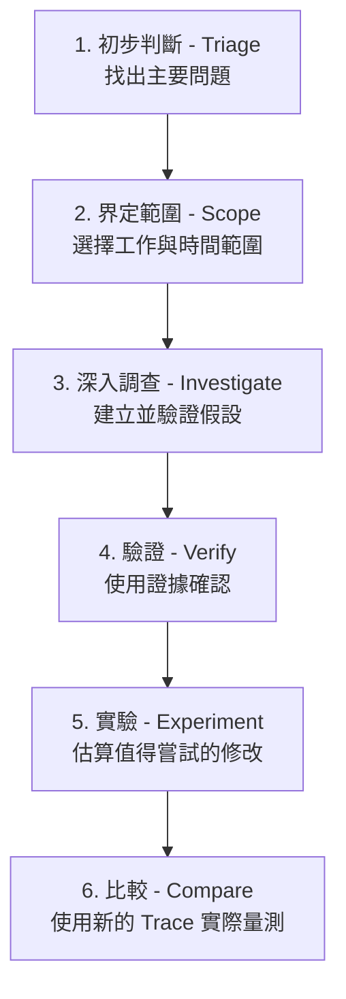

最重要的原則很簡單：**不要看到 Finding 就直接跳到改善方案。** 應先界定問題範圍、調查原因、以證據驗證，再進行實驗並比較結果。

## 目錄（Contents）

### 使用指南（User guide）

1. [AI 助理的運作方式](#how-the-ai-assistant-works)
2. [分析流程與使用案例](#workflows-and-use-cases)
3. [端點、模型與隱私](#endpoints-and-models)
4. [GUI 工具](#gui-tools)
5. [Desktop 與 Web 行為](#desktop-and-web-behavior)
6. [疑難排解](#troubleshooting)
7. [從 `file://` 開啟 Web App](#opening-the-web-app-from-file)

### 工程參考（Engineering reference）

8. [CLI Regression Gate](#cli-regression-gate)
9. [Benchmark 與 Evaluation Suite](#benchmark-suite) — [Context Mode Benchmarking](#context-mode-benchmarking)
10. [Investigation Case](#investigation-case)
11. [Investigation Planner](#investigation-planner)
12. [Causal and Temporal Engines](#causal-engines)
13. [Implementation Notes](#implementation-notes)
14. [Diagrams](#diagrams)

---

<a id="how-the-ai-assistant-works" name="how-the-ai-assistant-works">&#x200B;</a>
## AI 助理的運作方式（How the AI Assistant works）

### 資料流程與責任範圍（Data flow and responsibility）

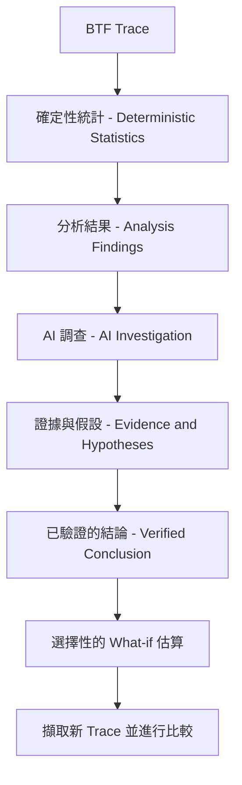

AI 接收的是結構化的 **Findings** 與摘要指標，而不是完整的原始事件資料流。需要更多細節時，AI 會透過 [GUI 工具](#gui-tools)取得限定範圍的證據，例如個別工作的指標、Timeline 搜尋結果、事件關聯、Critical Path 或 Trace Compare 表格。AI 仍然不會直接讀取原始 `.btf` 檔案。

AI 可以解釋、建立關聯、排序、質疑假設與進行估算；但 **Deterministic Statistics 與 Timeline 才是判斷事實的依據（source of truth）**。

### AI 面板的功能（What the panel does）

- 當紀錄為空時，**Start Investigation** 會執行 **Auto investigate**。
- Stepper 會追蹤 **Triage → Scope → Investigate → Verify → Experiment → Compare**。選擇已完成的階段，可回到該階段的輸出結果。
- **Investigate**、**Root cause**、**Verify finding**、**Auto investigate**、**What-if**、**Optimize** 與 **Diagnostic report** 都會顯示 Investigation plan。
- **Clear** 會清除對話、重設使用量資訊，並清除目前的 investigation。
- Usage bar 會顯示例如 **Context: Compact · 4.6k tok · 3 tools · 12s**，依序代表 Context mode、Token 數、工具數量與模型執行時間。可在 **Settings → AI → Context** 選擇 **Compact、Balanced（預設）或 Full evidence**。
- 非空白的 investigation 會在重新啟動後還原。若紀錄為空或已執行 Clear，則不會還原 Current Issue card。
- 唯讀工具（read-only tools）會立即執行。會修改 GUI 的動作則會等待使用者按下 **Apply**；若啟用 **Auto-apply GUI actions**，則會自動套用。Export 一律會開啟儲存對話框。

至少開啟兩份 Trace 後，工具列上的 **Compare** 才會啟用。**Query with AI…** 傳送的是 Trace Compare 表格，而不是目前的 Findings。**Save as baseline** 與 **Score vs baseline** 使用與 `baseline_score` 相同的已儲存 profile。按下 **Ctrl+K** 可快速存取 Analysis、AI、Compare、Workspace Preset 與 Inspect task。

### 界定事件或區段（Scoping an event or region）

| 進入方式 | 分析範圍 |
| --- | --- |
| Timeline segment → **Ask AI about this event** | 所選工作、核心，以及 `jump:TIME` 附近的 segment |
| Timeline → **Explain this region with AI** | 至少有兩個 Cursor 時可使用；範圍為 C1–Cn |
| AI panel → **Explain region** | 有 C1–Cn 時使用該範圍；否則使用完整 Trace 的 Findings |

診斷特定階段的問題時，請啟用 **Limit to C1–Cn**。Prompt 會包含 `Cursor region window: jump:lo … jump:hi`，回覆中引用的每個 `jump:TIME` 都應位於這個區間內。

### 證據與驗證（Evidence and validation）

重要結論應包含：

- `jump:TIME`、`range:LO/HI` 等證據連結，以及明確的指標名稱。
- 信心程度（Confidence）：**High、Medium 或 Low**。
- 證據品質（Evidence Quality）：**Directly observed、Strong correlation、Possible explanation 或 Insufficient evidence**。
- 其他可能的解釋，以及哪些證據可以推翻目前的結論。

**Evidence** 面板會顯示 Investigation Tree、Evidence Graph、Coverage、Hypotheses，以及 Evidence Quality band。這個 band 是用於診斷的啟發式指標，**不是機率值**。AI 完成最後回覆後，Host Validator 會標示不存在的工作名稱，以及落在 Cursor Window 之外的時間戳記。

建議優先使用內建 Template。這些 Template 已選好相關指標與 Statistics 頁面。必要時也可以使用自然語言，例如「find STI wait around TaskA」；Host 會將這類問題導向 `search_timeline`。

---

<a id="workflows-and-use-cases" name="workflows-and-use-cases">&#x200B;</a>

## 分析流程與使用案例（Workflows and use cases）

本節說明 AI 如何協助處理常見的分析工作。若需要從症狀對應到指標的分析步驟，以及精確的提問順序，請參閱 [WORKFLOWS.md](WORKFLOWS.md)。

### 第一次分析（First investigation）

一開始不需要自行選擇個別工具。先從使用者可直接操作的功能開始，讓 **Investigate** 自動選擇需要使用的深層證據工具。

| 步驟 | 操作 | 預期結果 | 繼續前應確認 |
| --- | --- | --- | --- |
| **1. Triage** | **Triage findings** 或工具列 **Analysis** | 依 Critical、Warning、Info 排序問題 | 指定的 Statistics 頁面也顯示相同問題 |
| **2. Scope** | 選擇 Finding，並設定或套用 C1–Cn | 鎖定一個工作、事件或時間範圍 | 分析特定階段時啟用 **Limit to C1–Cn** |
| **3. Investigate** | **Investigate**；已知可疑工作時使用 **Root cause** | 取得假設、關聯、相依性與 Critical Path | 開啟引用的 `jump:TIME`、`range:LO/HI` 與 Statistics 頁面確認 |
| **4. Verify** | **Verify with AI…** 或繼續 Investigation plan | Supported、Rejected 或 Insufficient 的判定 | 確認 Scope、工作名稱、時間、矛盾證據與替代解釋 |
| **5. Experiment** | **What-if**、**Optimize** 或 Experiment plan | 依優先順序排列的預估修改 | 將結果視為估算；實際修改系統後重新擷取 Trace |
| **6. Compare** | 開啟修改前／後 Trace → **Compare** | 實際量測的差異與 Experiment verdict | 使用相同 workload 與可比較的 Cursor scope |

一般使用時，只需要記住這幾個主要操作：**Triage findings、Investigate、Verify with AI…、Explain region、What-if / Optimize，以及 Trace Compare**。`correlate_events`、`rank_root_causes` 等函式名稱屬於進階操作與實作參考。

### 完整分析流程（End-to-end flow）

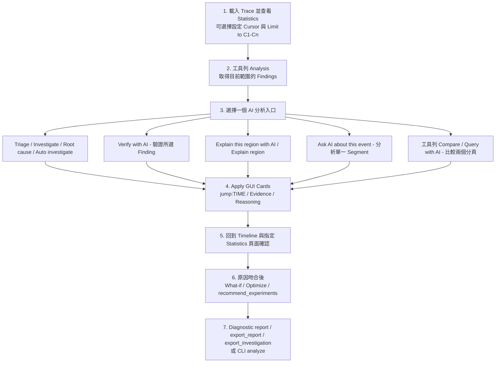

在 Timeline 與 Finding 相互吻合之前，不要直接要求改善方案。空白或 Scope 設定錯誤的 Statistics 很容易產生看似有信心、實際上沒有根據的答案。建議優先使用內建 Template，因為其中已指定正確的指標與單位。

### 調查流程（Investigation workflow）

| 步驟 | Template 或工具 | 用途 |
| --- | --- | --- |
| 1 | **Triage findings** / `detect_anomalies` | 依 Critical / Warning / Info 排序；開啟 Timeline Anomalies / Worst Events / Task Health |
| 2 | **Investigate** / `investigate`，或 Findings → **Auto investigate…** | 建立 Root-cause chain、假設、替代解釋與建議工具 |
| 3 | **Verify finding** / Findings → **Verify with AI…** | 使用 `jump:TIME` 證據判定 Confirmed / Rejected / Inconclusive |
| 4 | `correlate_events` + `query_raw_metric` | 整合單一工作的 Blocking / Execution / Migrations / Sync / PI |
| 5 | `find_critical_path` / `detect_priority_inversion` | 分析 Preemption / Blocking path 與 L/M/H Priority Inversion 嫌疑 |
| 6 | `build_task_dependency_graph` / `analyze_temporal_causality` | 建立 BTF wait / preempt / migrate chain |
| 7 | `rank_root_causes` / `challenge_conclusion` | 在執行 `what_if` 前先排序原因並檢查替代解釋 |
| 8 | `find_related_findings` / `compare_tasks` | 尋找相關 Finding，或並排比較工作差異 |
| 9 | `set_cursors` / `zoom_to_range` / `highlight_task` / `bookmark_finding` | 縮小 Timeline 範圍；未啟用 Auto-apply 時需 Apply Cursor。可點選 Critical Path 證據中的 `range:LO/HI` / `btfrange:` |
| 10 | Evidence panel | 查看 Investigation Tree、**Evidence Quality** 與可推翻結論的條件 |
| 11 | `investigation_replay` / `generate_report` / `export_investigation` | 結構化完成分析；可選擇使用 `export_report` |

**Root cause** 會針對排名最高的 Finding，依序檢查 **Deadline/WCET → Preemption → Blocking → Mutex → Inheritance → Migration**。如果 Triage 已經指出可疑工作，適合直接使用這個功能。

**Auto investigate** 會針對單一 Finding 串接一系列 Verify-style 步驟：Investigate → Correlate → Critical Path / Graph / Temporal → Rank → Challenge → What-if，同時更新 Investigation plan checklist。如果已經有 Finding ID，只需要快速判斷結果，使用 **Verify** 即可。

### Explain region 與 Ask event

| 入口 | 出現條件 | Scope |
| --- | --- | --- |
| Timeline → **Explain this region with AI** | 僅在有 **≥2 個 Cursor** 時可使用；AI 關閉時呈灰色 | C1–Cn；Prompt 會加入 `Cursor region window: jump:lo … jump:hi` |
| AI panel → **Explain region** | 一律顯示 | 有 ≥2 個 Cursor 時使用相同範圍；否則使用**完整 Trace Findings** |
| Timeline segment → **Ask AI about this event** | Pointer 下方存在 Segment 時；AI 關閉時呈灰色 | `jump:TIME` 附近的一個工作／核心／Segment |

分析必須維持在指定的 Window 內：回覆中的每個 `jump:TIME` 都應位於 C1 與 Cn 之間；如果該 Window 沒有符合的證據，模型應明確說明。

請啟用 **Limit to C1–Cn**，讓 Statistics、Findings 與 `query_raw_metric` 都使用相同的 Window。若點選某個 `jump:TIME` 後發現它位於 Cursor 範圍之外，通常表示模型虛構了時間，或誤用了完整 Trace 的時間。這種結果應捨棄，並使用 Cursor + Scoped Findings 重新提問。

<a id="what-if-and-optimize-workflow" name="what-if-and-optimize-workflow">&#x200B;</a>

### What-if 與 Optimize 流程（What-if and optimize workflow）

`what_if` 與 `optimize_experiment` 是**啟發式 Slice Replay（heuristic slice-replay）**工具：它們會重新分配實際量測的 Execution Slice、縮放 Migration / Blocking，並調整 Core Utilisation Balance。

它們**不是 FreeRTOS Kernel，也不是確定性的排程器（deterministic scheduler）**。每個結果都會附帶免責說明。若估算結果值得進一步測試，`recommend_experiments` 會建議後續的 Simulation / Firmware / Measurement 驗證步驟。

| 目的 | 執行方式 | 常見修改描述 |
| --- | --- | --- |
| 測試一個具體想法 | **What-if** → `what_if` | `pin CS[28] to Core_0`、`raise priority of Low[266]`、`reduce mutex contention 50%` |
| 排序多個改善方案 | **Optimize** → `optimize_experiment`，必要時再以 `optimize` 取得定性建議 | Host 會選擇 pin-to-dominant / quiet core、contention −50%、priority up、migrations −50% |
| 只需要定性建議 | `optimize` | 根據 Finding 文字提出改善方式，不對 Experiment 評分 |
| 決定下一個實機測試 | `recommend_experiments` | 根據 Findings heuristic 建議驗證實驗 |

**如何閱讀結果（payload）：** 比較 `baseline` 與 `simulated` 中的 migrations、blocking_ns、load_balance_score，以及 `deltas.cost` 排名。在 Experiment List 中，Cost 越低越好。

**Medium confidence** 可解讀為「值得在實機上測試」；**Low confidence** 通常表示修改描述太模糊，或可供分析的 Slice 太少。

<a id="use-cases" name="use-cases">&#x200B;</a>

### 使用案例（Use cases）

| 情況 | 提問前 | Template / 工具 | 接著確認 |
| --- | --- | --- | --- |
| 不知道問題在哪，第一次檢查 | Full-trace 或 Cursor-scoped Findings | **Triage findings** → **Investigate** | Timeline Anomalies / Worst Events / Task Health；`jump:TIME` |
| 找出最耗 CPU／最不穩定的工作 | Findings 已指出可疑工作 | **Task profile** | Period / Jitter；Task Health；Task × Core；Execution / Blocking p95/p99 |
| Tick Jitter／Missed Tick | Scope 中有 Trace Health | **Tick health** | Tick Distribution；不是 Period / Jitter，後者是工作 Inter-arrival |
| 確認單一 Finding | 在 Analysis Findings 中選取 | **Verify with AI…** / **Verify finding** | Evidence panel；Timeline |
| 解釋一段時間範圍 | ≥2 Cursor；啟用 **Limit to C1–Cn** | Context menu 或 **Explain region** | 僅接受 C1–Cn 內的 `jump:TIME` |
| 單一 Segment／ISR Slice | 在 Segment 上按右鍵 | **Ask AI about this event** | 該工作所在列；附近 STI |
| 自動分析一個 Finding | 選擇 Finding → **Auto investigate…** | `auto_investigate` | Investigation plan + Evidence |
| Migration Thrash／Ping-pong | Scope 鎖定 Thrash Window；Findings 指出工作 | **Migration thrash** → `correlate_events` → **What-if** Pin / **Optimize** | Task × Core；Timeline Anomalies migration bursts；Migrations Rate/Ping；Heatmap / Chord；Core Affinity |
| Priority Inversion／PI Boost | Scope 中有 Inheritance Finding 或 PI episode | **Priority inversion** / `detect_priority_inversion` → `find_critical_path` | Priority Inheritance；Mutex Hold；Waiter × Owner（heuristic handoff） |
| 高 Blocking／Mutex Wait | Scope 鎖定 Stall；已知可疑工作 | **Highest latency** → `query_raw_metric` blocking/sync → **What-if** contention / priority | Worst Events；Waiter × Owner；Blocking p95/p99；Mutex Hold；Priority Inheritance |
| WCET／Deadline 壓力 | Display → Analysis 已設定 Threshold | **WCET / hot CPU** 或 **Deadline / budget** → `check_budget` | Timeline Anomalies / Worst Events；Period / Jitter；Task Health；Execution Max / p95 / p99；Deadlines |
| 比較兩個工作 | 已知兩個工作名稱 | `compare_tasks` | 並排比較 Execution / Blocking / Migrations |
| 尋找相關 Findings | 已選擇一個 Finding | `find_related_findings` | 共用工作／指標／相近時間 |
| 核心間負載不平衡 | Findings 中有 Multi-core Util | **Core balance** → `analyze_traces`（multi-tab）或 **What-if** Pin 到較空閒核心 | Task × Core；Load Balance Score；Concurrent Active；Core Time Breakdown |
| A/B Build Regression | 已開啟兩個分頁 | **Trace Compare**（工具列 **Compare → Query with AI…**）/ `compare_performance` / `regression_explain` | Compare Summary Strip；Trace Compare Pages；兩個 Build 使用相同 Scope |
| 與已儲存 Baseline 的偏移 | 已儲存 Baseline Profile（rc / localStorage） | `baseline_score` | 標示 `|z|>2`；必要時重新擷取 |
| 排序所有已開啟 Trace | ≥2 個分頁 | `analyze_traces` | Best tab 與 Migrations / LB / Missed Ticks |
| 撰寫 Review 報告 | 原因已確認 | **Diagnostic report** → `generate_report` → `export_report` / `export_investigation` | 已儲存 HTML/CSV/JSON；Evidence Time 已 Bookmark |
| CI 與 Baseline 比較 | Desktop CLI | [`analyze`](#cli-regression-gate) + `--fail-on-regression`，可選 `--ai` | Exit Code + Markdown Narrative |

### 實際範例（Worked examples）

#### Migration Thrash → 固定 Core Affinity

1. 將 Cursor 放在 Thrash Window，啟用 **Limit to C1–Cn**，再重新開啟 Analysis。
2. 執行 **Migration thrash** 或 **Investigate**，直到找到的高 Migration 工作（例如 `CS[22]`）與 Core 和 Heatmap 相符。
3. 使用 **What-if**：*pin CS[22] to its dominant core*；也可以執行 **Optimize**，取得依優先順序排列的候選方案。
4. 查看 Δmigrations / Δload_balance_score。若 Migration 降低，但 Load Balance 明顯惡化，可透過 `optimize_experiment` 嘗試 Pin 到最空閒的 Core，再比較排名。
5. 在 Firmware 中設定 Affinity 或降低 Bounce，重新擷取 `.btf`，再使用工具列 **Compare** 比較修改前後的 Trace。

#### Mutex Contention → 縮短 Critical Section

1. 對 Waiter 執行 **Highest latency** / `correlate_events`，並在 Mutex / Priority Inheritance 中確認 Hold Episode。
2. 使用 **What-if**：*reduce mutex contention 50% for TASK*，或指定其他百分比。
3. `simulated` payload 中的 `blocking_ns` 應降低，但這仍然只是估算。實際縮短程式中的 Lock Hold Time 後，必須重新擷取 Trace 驗證。

#### 比較兩個 Build → Regression 說明

1. 將 Baseline 與 Candidate 分別開啟為兩個分頁；必要時設定相同的 Cursor Scope。
2. 使用工具列 **Compare → Query with AI…**（**Trace Compare** Template），或依序執行 `compare_performance` 與 `regression_explain`。
3. 只有當兩個分頁的 Statistics 都能重現差異時，才採用 High / Medium Confidence 的 Delta 作為判斷依據。
4. 可選擇對 Candidate 中最耗 CPU 的工作執行 `optimize_experiment`，初步評估改善方式；結果仍屬 heuristic estimate。

#### Cursor Window → Explain region

1. 在目標階段放置 **C1 / C2**，例如 1.060 s … 1.120 s，啟用 **Limit to C1–Cn**，再重新開啟 Analysis。
2. 在 Timeline 上按右鍵 → **Explain this region with AI**；或使用 AI panel → **Explain region**。
3. 確認 User Turn 中包含 `Cursor region window: jump:lo … jump:hi`。任何位於此範圍之外的 `jump:TIME` 都應捨棄。
4. 對 Window 內提到的工作執行 `correlate_events` / `query_raw_metric`，並將重要 Evidence Time 加入 Bookmark。

#### Priority Inversion Finding → Verify

1. 開啟 Analysis Findings，選擇 Priority Inheritance / Inversion 項目。
2. 執行 **Verify with AI…**；若需要較完整的分析鏈，使用 **Auto investigate…**。
3. 預期會使用 `detect_priority_inversion`、`query_raw_metric`（priority_inheritance）與 `find_critical_path`。查看 Evidence Score 與 Investigation Tree。
4. 點選 Scope 內的 `jump:TIME`，在 Timeline 與 Priority Inheritance Statistics 中確認 L/M/H 關係。

### 模擬器限制（Simulator limits）

| 可以做 | 不能做 |
| --- | --- |
| 針對目前 Statistics Scope，重播實際量測的 Slice / Migration / Blocking Gap | 執行 FreeRTOS Scheduling、ISR 或 Cache Model |
| 對 Pin / Priority / Contention / Migration Experiment 評分 | 保證 Firmware 修改後的 WCET 或 Deadline |
| 明確將每個結果標示為 Estimate / Not measured | 取代 Timeline 驗證或重新擷取 Trace |

若要讓 Simulator 正確辨識修改內容，請使用 **pin / affinity / priority / mutex / migration** 等明確描述。過於模糊的文字會退回定性估算（`simulator: none`）。
## 端點與模型（Endpoints and models）

### 連接 AI 端點（Connect an endpoint）

任何與 OpenAI API 相容的端點都可以使用，包括 Ollama（`http://localhost:11434/v1`）。Chat Request 的逾時時間為 120 秒；**Stop** 仍可提前取消請求。

建議 Endpoint 至少提供 **8k Context Window**，才能容納完整 Findings Card 加上一輪 Tool Call。若較小的 Context Window 或 Local Model 成為限制，可使用 **Settings → AI → Context → Compact**，減少 Findings、Tool Schema、Tool Row 與 History 的內容。

內建的 Ollama 預設模型為 `qwen3.5:9b`：

```bash
ollama pull qwen3.5:9b
```

較大的 Local Model，例如 `qwen3.5:27b`、`qwen3.8:27b` 與 `gemma4:26b`，會以較高的執行時間與記憶體用量換取更高的模型能力。

不建議使用 3B 等級的模型進行 Investigation：這類模型經常略過 Native Tool Call、將 Tool JSON 當成一般文字輸出，或無法完成多步驟分析。

設定範例位於 [examples/ai](examples/ai/README.md)：

- [ollama.json](examples/ai/ollama.json)
- [gemini.json](examples/ai/gemini.json)
- [openai.json](examples/ai/openai.json)
- [deepseek.json](examples/ai/deepseek.json)
- [grok.json](examples/ai/grok.json)
- [presets.json](examples/ai/presets.json)

匯入 Preset 會填入 **Settings → AI**，包括檔案中定義的 核取方塊（Checkbox）設定。儲存前請先確認各項設定值。

每個 Preset 都會保存自己的 Base URL、Model、API Key、Authentication Mode 與 TLS 設定。若 Preset 中出現未知的模型名稱，會自動加入 Model List。

Desktop 與 Web 的 API Key 使用相同的優先順序：

1. 在 **Settings → AI** 輸入的 Key
2. `OPENAI_API_KEY`
3. `GEMINI_API_KEY`
4. `OLLAMA_API_KEY`

Local Ollama 通常不需要 API Key。Custom Endpoint 則應在對應的 Preset 中輸入 Key。

Live `ai-test` XML 可以使用 `<api-key env="VAR">`。完整範例請參閱 [README → API keys](README.md#ai-api-keys)。

### 選擇模型（Choose a model）

| 能力 | Small local | Local 9B+ | Cloud |
| --- | --- | --- | --- |
| 基本問答（Basic Q&A） | ✓ | ✓ | ✓ |
| Tool Calling | △ | ✓ | ✓ |
| Investigation（`investigate` / Root-cause Chain / Hypotheses） | △ | ✓ | ✓ |
| 複雜推理（Multi-step Correlation、Alternatives） | △ | ✓ | ✓ |
| 大型 Trace（大量 Findings / 長對話紀錄） | △ | △ | ✓ |
| What-if / Optimize（`what_if`、`optimize_experiment`） | ✓ | ✓ | ✓ |

✓ = 穩定可靠；△ = 表現不一致。△ 代表有時可以正常運作，但也常出現略過 Native Tool Call、虛構數值，或在 Context 過長時截斷輸出的情況。**採用結果前，一律應回到 Timeline 驗證。**

| 如果你…… | 建議 |
| --- | --- |
| 希望完全在本機進行 Investigation，不使用 API Key | `qwen3.5:9b` — 內建 Ollama 預設模型；Investigation Suite 中最實用的 Local Model（約 52 秒/case，Overall 78） |
| 需要更高的 Local Model 品質 | `qwen3.8:27b`（88，約 190 秒/case）或 `qwen3.5:27b`（81，約 149 秒/case）。`gemma4:26b` 比 9B 慢，分數也略低（73，約 111 秒/case） |
| Scope 很大，例如 Findings 很多、對話很長，或需要較強推理能力 | Cloud（`gpt-4o`、Gemini、DeepSeek、Grok）；同時應考量[隱私](#what-leaves-the-machine) |
| 處理機密 Trace | 不論模型大小都優先使用 Local Ollama，資料不會離開本機 |

較小的 Local Model 可能略過 Native Tool Call，改為輸出 fenced `btftool` block。Viewer 仍會將兩種形式顯示為相同的 GUI Card，但需要大量 Investigation 的 Template，建議使用 `qwen3.5:9b` 這類具備穩定 Tool Calling 能力的模型，才能可靠地串接多個 Tool Call。

### 認證資訊儲存（Credential storage）

| | Desktop | Web |
| --- | --- | --- |
| Key 儲存位置 | Viewer 旁的 `btf_viewer.rc`：`[ai] *_api_key` | Browser `localStorage`：`btf-viewer-settings-v1` |
| 靜態儲存方式（At rest） | 以 `enc1:…` 加密；與本機綁定，無法直接移到其他 Host 使用 | 以**明文（Plaintext）**存於 localStorage；僅適合作為便利性功能 |
| 傳送給模型 | 不會放入 Chat Field；只會作為 HTTP `Authorization` / API Header 傳送至設定的 Endpoint | 相同 |
| 清除方式 | **Settings → AI** 清除 Key，或刪除 `btf_viewer.rc` 中的 AI Key | **Settings → Reset** 或清除網站資料 |

<a id="what-leaves-the-machine" name="what-leaves-the-machine">&#x200B;</a>
### 哪些資料會離開本機（What leaves the machine）

| 會傳送到設定的 AI Endpoint | 不會傳送 |
| --- | --- |
| Analysis Findings：Title、Severity、Task Name 與 Heuristic Text | 原始 `.btf` 或 `.btf.gz` 檔案內容 |
| 模型要求的 Metrics 與 Tool Results | 未被要求的完整 Event Stream |
| 限定 Scope 的 Timeline Search 與 Correlation Results | Prompt Body 中不會包含 API Key |
| 使用者要求時的 Trace Compare Table | — |
| 使用者問題與簡短的 Conversation History | — |

| | Local Ollama | Cloud Endpoint |
| --- | --- | --- |
| Trace File 留在本機 | ✓ | ✓ |
| Findings / Metrics 是否離開本機 | 否；Loopback | 是；會傳送給該 Cloud Vendor |
| 是否上傳 Raw BTF | 否 | 否 |
| 是否需要 API Key | 通常不需要 | 通常需要 |

處理機密 Trace 時，建議使用 **Local Ollama**。若要使用 Cloud Preset，請先將 Annotation 中可能包含敏感資訊的 Task Name 匿名化或移除。

<a id="context-mode-token-usage" name="context-mode-token-usage">&#x200B;</a>

### Context Mode（Token 使用量）

**Settings → AI → Context** 控制每次 Request 傳送多少證據。這項設定主要用來降低 Input Token；其中 **Compact** 也會將回覆限制在約 300–500 Tokens。

| | Compact | Balanced（預設） | Full evidence |
| --- | --- | --- | --- |
| Findings | Severity 最高的前 5 項 | 前 12 項 | Scope 中全部 |
| Tool Schemas | Current Stage + Search / Raw Metric | Current Stage 加相鄰 Stage | 完整 Catalog |
| Tool Results | 10 Rows，其餘摘要 | 20 Rows | 40 Rows |
| Chat History | Investigation Summary + 最近 2 Turns | 最近 6 Turns | 最近 20 Turns |
| Diagrams | 僅在要求時提供 | 適合時提供 | 適合時提供 |
| What-if | 前 3 個 Candidate | 前 5 個 | 完整 |

即使使用 **Compact**，仍會保留：

- Cursor Region Window。
- 實際 Task Name。
- `jump:TIME` / `range:LO/HI`。
- 包含單位的 Measurement。
- Confidence / Evidence Quality。
- What-if Disclaimer。
- 至少一個 Alternative Explanation 或 Falsification。

遇到複雜案例時可切換至 **Full evidence**。如果 Compact 省略了某個 Finding，也可以直接要求模型分析特定 Finding ID。

Live `ai-test` 預設使用 **Full evidence**。使用 **`--compare-context`** 可量測三種 Context Mode；若只測單一模式，可使用 **`--context-mode compact`** 或 `balanced`。

**Settings → Context 不會套用到 CLI Scorer。**

---

## GUI 工具（GUI tools）

Read-only Evidence Tool 會立即執行；會修改 GUI 的工具則會等待使用者按下 **Apply**，除非已啟用 **Auto-apply GUI actions**。

完整工具名稱與參數請參閱下方的 [Complete GUI tool reference](#complete-gui-tool-reference)。

理解 AI Tool Set 時，按照**用途（Purpose）**分類會比直接記函式名稱更容易。一般使用者應從內建 Template 與 Investigation Plan 開始；個別 Tool Schema 主要提供給進階使用與除錯。

### 工具的整體概念（Tool mental model）

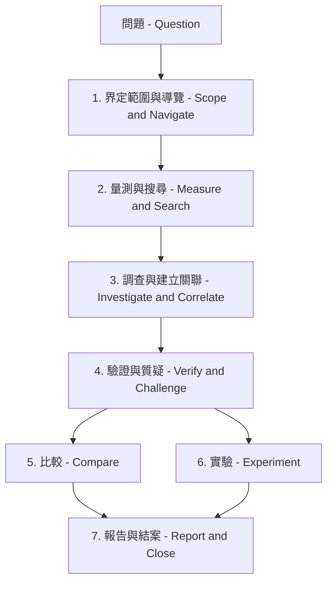

### Apply、Skip 與 Undo

工具依行為分為兩類：

| 類別 | 行為 | 範例 |
| --- | --- | --- |
| **Read-only evidence tools** | 立即執行，不會修改 Viewer | `query_raw_metric`、`search_timeline`、`investigate`、`correlate_events`、`find_critical_path`、`verify_claim` |
| **GUI-changing tools** | **Auto-apply GUI actions** 關閉時（預設），整批動作會等待 **Apply** / **Skip** | `set_cursors`、`zoom_to_range`、`highlight_task`、`set_view_mode`、`add_annotation`、`bookmark_finding` |

模型可能在同一個 Turn 中產生多個 Tool Call，這些操作會以一個 Batch 套用。

**Undo last actions** 可以還原 Zoom / View / Highlight / Inspector / Marks；`Ctrl/Cmd+Z` 也可以還原 Cursor 與 Mark。Export Tool 仍會開啟 Save Dialog。

### 1. Scope & Navigate —「應該從哪裡看？」

這組工具用來將 AI 的回答轉換成 Timeline 上可直接查看的位置。

| 目的 | 主要工具 | 結果 |
| --- | --- | --- |
| 界定可疑階段 | `set_cursors`、`zoom_to_range` | 放置 C1–Cn，並聚焦相關時間區間 |
| 聚焦特定工作 | `highlight_task` | 在 Timeline 上持續反白該工作 |
| 改變檢視方式 | `set_view_mode` | 切換 Task/Core 與 Horizontal/Vertical View |
| 檢查 Migration Corridor | `open_corridor_inspector` | 開啟 Migration & Corridor Inspector |
| 保存證據 | `bookmark_finding`、`add_annotation` | 加入 Semantic 或 Free-text Timeline Mark |
| 清理畫面 | `clear_marks`、`reset_view` | 清除 Investigation 過程中的標記，或恢復 Full-span View |

**初學者建議：** 一般不需要直接呼叫這些工具。讓 **Investigate、Verify 或 Explain region** 產生對應的 GUI Card，再決定是否 Apply 即可。

### 2. Measure & Search —「實際發生了什麼？」

這組工具取得 Deterministic Evidence，不會修改 Trace。

| 問題 | 主要工具 | 回傳證據 |
| --- | --- | --- |
| Event 發生在哪裡？ | `search_timeline` | 符合條件的 Task / STI / Tag / Interval / Pointer / Migration Timestamp |
| 這個工作的實際量測值是多少？ | `query_raw_metric` | Scope 內的 Execution、Blocking、Migration、Sync、PI 或 Findings Row |
| Distribution 是否異常？ | `analyze_distribution` | p50–p99.9、Standard Deviation、CV、Outlier Rate |
| Timing 是否具有週期性或 Jitter？ | `analyze_periodicity` | Expected vs Observed Period / Jitter Statistics |
| 工作是否超出 Budget？ | `check_budget` | WCET / Response / Deadline Budget Comparison |

這些工具構成 **Evidence Layer**。需要數值時，應優先取得實際證據，而不是讓模型猜測。

### 3. Investigate & Correlate —「哪些事件彼此相關？」

在 Triage 找到具體問題後，再使用這組工具。

| 深度 | 主要工具 | 用途 |
| --- | --- | --- |
| **Triage** | `detect_anomalies`、`cluster_findings`、`cluster_incidents` | 排序與分組 Findings |
| **Investigate** | `investigate`、`plan_investigation`、`suggest_scope` | 建立 Hypothesis，並選擇成本最低的下一個檢查步驟 |
| **Correlate** | `correlate_events`、`find_related_findings` | 整合相近時間的 Execution / Blocking / Migration / Sync / Priority Evidence |
| **Path** | `find_critical_path` | 沿著 Incident 周圍的 Preemption、Blocking 與 Mutex Activity 追蹤 |
| **Dependency** | `build_task_dependency_graph` | 顯示 Wait / Preempt / Migrate / PI 關係 |
| **Temporal** | `analyze_temporal_causality` | 根據實際觀察到的 Evidence Time 建立 Happens-before Chain |
| **Root cause** | `build_causal_chain`、`rank_root_causes` | 排序 Hypothesis，同時標示 Causal / Correlated / Temporal Relationship |

**Investigate / Root cause / Auto investigate** 會自動協調這些較深入的工具。大多數使用者不需要自行決定 Tool 執行順序。

### 4. Verify & Challenge —「這真的是原因嗎？」

這組工具的目的，是避免將「看起來合理的說法」直接當成已確認的診斷結果。

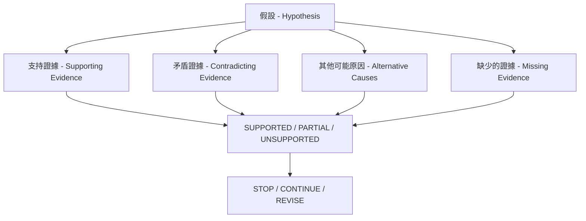

| 目的 | 主要工具 |
| --- | --- |
| 檢查單一 Claim | `verify_claim` |
| 尋找與 Hypothesis 相反的證據 | `detect_contradictions` |
| 判斷目前證據是否足夠 | `assess_evidence_sufficiency` |
| 強制檢查其他可能解釋 | `challenge_conclusion` |
| 追蹤 Hypothesis 狀態 | `manage_hypotheses` |
| 檢查 Priority Inversion 證據 | `detect_priority_inversion` |
| 評估 Investigation 品質 | `score_investigation` |

Evidence Panel 會補充顯示 Evidence Quality、Coverage、可以推翻結論的條件，以及 Investigation Tree。

### 5. Compare —「改變了什麼？」

開啟兩份以上 Trace 時使用這組工具。

| 目的 | 主要工具 | 結果 |
| --- | --- | --- |
| 開啟／取得 Trace Compare | `trigger_compare` | 與工具列 **Compare** 相同的比較資料 |
| 比較兩個 Build | `compare_performance` | 結構化 Metric Delta + Confidence |
| 解釋主要 Regression | `regression_explain` | 與 A/B Delta 對應的說明 |
| 定位 Regression | `regression_localize` | 可疑 Task / Region / Mechanism |
| 比較兩個工作 | `compare_tasks` | 並排顯示 Task Metrics |
| 與歷史資料比較 | `baseline_score` | 與已儲存 Baseline 的 Drift |
| 排序多份已開啟 Trace | `analyze_traces` | 比較相對 Scheduling Behavior |

只有當兩份 Trace 代表**相同或等效的 Workload Phase** 時，比較結果才具有意義。

### 6. Experiment —「接下來應該嘗試什麼？」

只有在原因已經有足夠證據支持後，才應使用這組工具。

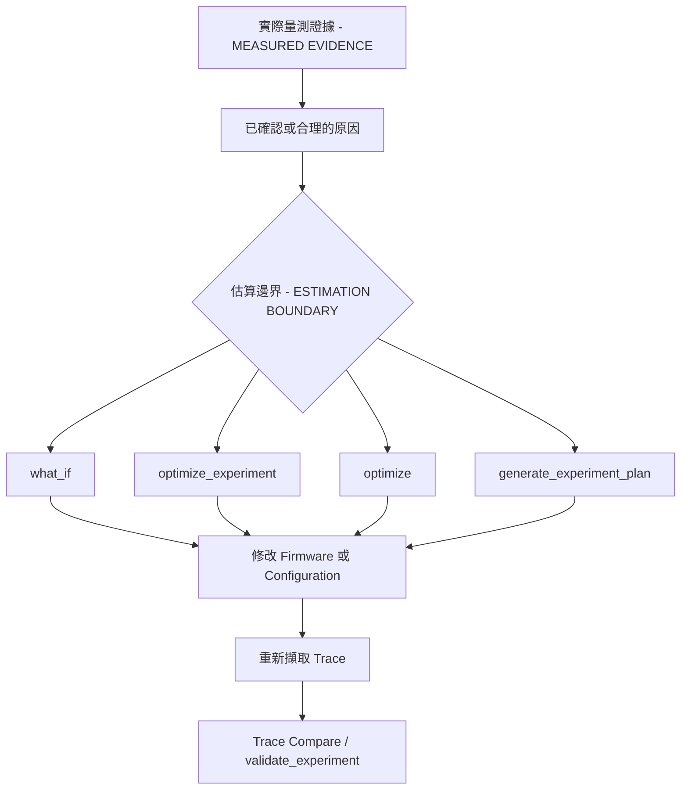

| 目的 | 主要工具 |
| --- | --- |
| 測試一個具體想法 | `what_if` |
| 排序候選修改方案 | `optimize_experiment` |
| 取得定性的改善建議 | `optimize` |
| 產生 Bench / Firmware 驗證步驟 | `recommend_experiments`、`generate_experiment_plan` |
| 比較預測與實際量測結果 | `validate_experiment` |
| 儲存實驗結果 | `record_experiment_outcome` |

**重要：** `what_if` 與 Optimization 的結果都是**估算值**，不是實際量測到的 Scheduler Behavior。

### 7. Report & Close —「這次分析得到什麼？」

| 目的 | 主要工具 |
| --- | --- |
| 產生結構化 Engineering Text | `generate_report` |
| 儲存報告 | `export_report` |
| 儲存完整 Investigation Case | `export_investigation` |
| Replay／摘要 Investigation | `investigation_replay`、`summarize_investigation_context` |
| 記住類似案例 | `investigation_memory`、`find_similar_investigations` |
| 結束 Case | `close_investigation` |

<a id="complete-gui-tool-reference" name="complete-gui-tool-reference">&#x200B;</a>
### 完整 GUI 工具參考（Complete GUI tool reference）

下表列出完整的 Tool Schema。實作、除錯，或需要明確控制 Tool Call 時，可使用這份參考。

| Tool | 參數／目標 | 功能 |
| --- | --- | --- |
| `set_cursors` | `timestamps`（1–8 個 Trace Time） | 放置 Cursor；有兩個以上時可啟用 **Limit to C1–Cn** |
| `zoom_to_range` | `start_time`, `end_time` | 將 Timeline 聚焦在兩個時間點之間 |
| `highlight_task` | `task_name_or_id`（Display Name、Numeric ID 或 Merge Key） | 持續反白 Task Row。未知名稱會被忽略，避免整個 Timeline 被淡化；空字串會清除 Highlight |
| `set_view_mode` | `mode`（`task` / `core`）；可選 `orientation` | 切換 Task / Core View，以及 Horizontal / Vertical |
| `open_corridor_inspector` | 可選 `core_from` / `core_to`（`Core_0`、`0`、`c0`、`Core 0`） | 開啟 Migration Inspector；不同 Alias 使用相同解析方式 |
| `add_annotation` | `time`, `note`（≤240 字元） | 在指定時間點加入橘色 Timeline Note；目前右側 Panel Tab 不會切換 |
| `query_raw_metric` | `task`, `metric`（`priority_inheritance`, `execution`, `migrations`, `blocking`, `sync`, `findings`） | Read-only：回傳目前 Statistics Scope 中指定工作的 Series，最多 40 Rows |
| `export_report` | 可選 `format`（`html` / `csv` / `json`） | 匯出 HTML/CSV/JSON，包含 Analysis Findings、Chat 中的 Mermaid Diagram、Annotations 與 GUI State（Cursor / Highlight / View）。`json` 會儲存完整 Investigation Package，參閱 `export_investigation` |
| `clear_marks` | 可選 `what`（`annotations` / `cursors` / `bookmarks` / `all` / `everything`） | 清除 AI 產生的標記。`all`（預設）清除 Annotation + Cursor；`everything` 也會清除 Bookmark |
| `reset_view` | 無 | 將 Timeline Fit 回完整範圍並清除 Task Highlight；Mark 保留 |
| `search_timeline` | `query`；可選 `mode`（`contains` / `exact` / `regex` / `sti` / `tags` / `intervals` / `lifecycle` / `pointers` / `migrations`） | Find Panel Search；回傳最多 40 個符合條件的 Timestamp |
| `trigger_compare` | 可選 `tab_a` / `tab_b`（從 0 開始的 Tab Index 或 Filename） | Read-only：取得 Trace Compare CSV，並開啟與工具列 **Compare** 相同的 Dialog；需要載入兩個 Tab |
| `investigate` | 可選 `finding_id`, `depth`（1–5） | Read-only：建立包含 Root-cause Chain、Hypotheses、Ranked Anomalies 與 Suggested Tools 的 Investigation Graph |
| `detect_anomalies` | 可選 `limit`（1–40） | Read-only：將 Analysis Findings 排序為 Critical / Warning / Info |
| `correlate_events` | `task`；可選 `around_time`, `window` | Read-only：將 Blocking / Execution / Migration / Sync / Priority / Find Hit 整合到同一 Timeline |
| `find_critical_path` | `task`；可選 `timestamp`, `window`（預設 2000） | Read-only：分析指定時間附近的 Preempt / Block / Mutex Critical Path；同時回傳 `mermaid` Graph（`graph LR`）、`graph_nodes`（id/label/kind/time），以及分開的 `blocking_steps` / `preemption_steps`。Path Step 包含 `start`/`stop`；Evidence Bullet 使用可點選的 `range:LO/HI`，可 Zoom 並將 C1–C2 放到該 Episode |
| `compare_performance` | 可選 `tab_a` / `tab_b` | Read-only：兩個 Tab 的 A vs B 結構化 Metric Delta + Confidence。`data.regression_type` 將主要差異分類為 `execution` / `scheduling` / `synchronization` / `migration` / `load_balance` / `unknown`；舊版 `classification` 的 `thrashing` / `load_imbalance` / `tick_health` 等值仍會保留 |
| `generate_report` | 可選 `report_type`, `finding_id` | Read-only：產生指定類型的 Engineering Markdown：`executive` / `performance` / `root_cause` / `regression` / `optimization` / `bug` / `ci`；使用 `export_report` 儲存 |
| `check_budget` | 可選 `budgets`, `tasks` | Read-only：比較每個工作的 WCET / Response / Deadline Metric 與 Budget；未提供 `tasks` 時，Host 會根據 Findings 建立 Row |
| `optimize` | 可選 `limit`（預設 5） | Read-only：根據 Evidence 提供 Mitigation Idea，並附上 Estimate Disclaimer |
| `regression_explain` | 可選 `tab_a` / `tab_b` | Read-only：比較兩個 Tab，再說明主要 Regression；包含相同的 `regression_type` 分類 |
| `bookmark_finding` | `time`, `kind`（`root_cause` / `evidence` / `correlated` / `reference`）；可選 `note` | GUI：加入 Semantic Investigation Annotation；需要 Apply |
| `investigation_replay` | 可選 `finding_id`, `conclusion`, `tools_run`, `evidence_times` | Read-only：產生結構化 Investigation Replay Card |
| `what_if` | `change`；可選 `task` | Read-only：Heuristic Slice-replay What-if，估算 Migration / Blocking / Load Balance；不是 FreeRTOS Kernel |
| `optimize_experiment` | 可選 `task`, `limit`（1–12，預設 5） | Read-only：自動執行並排序 Pin / Priority / Contention / Migration Experiment |
| `analyze_traces` | 無 | Read-only：依 Scheduling Behavior 排序所有已載入的 Tab |
| `baseline_score` | 可選 `task`, `baseline`, `snapshot` | Read-only：將目前每個工作的 WCET / Blocking / Migrations / Response 與已儲存 Historical Baseline 比較；標示 `|z|>2` |
| `recommend_experiments` | 可選 `finding_id`, `task`, `limit`（1–20，預設 5） | Read-only：根據 Findings Heuristic 建議 Simulation / Firmware / Measurement Validation Experiment |
| `export_investigation` | 可選 `finding_id`, `conclusion`, `tools_run`, `evidence_times` | 將完成的 Investigation 下載為 JSON Package，包括 Finding、執行過的 Tools、Queries、Evidence、Conclusion、Confidence 與 Alternatives |
| `detect_priority_inversion` | 可選 `task`, `window` | Read-only：掃描 Priority-inheritance Boost Episode，尋找 L/M/H Inversion 嫌疑，包括 High/Medium/Low Task、Mutex、Time 與 Duration |
| `find_related_findings` | 可選 `finding_id`, `task`, `metric`, `window`, `limit`（1–40，預設 10） | Read-only：依共用 Task、Metric Keyword、Evidence-time Proximity 或 Severity Adjacency 關聯 Analysis Findings |
| `compare_tasks` | `task_a`, `task_b`；可選 `metrics` | Read-only：並排比較兩個工作的 Execution / Blocking / Migrations / Priority-inheritance Delta |
| `explain_finding` | 可選 `finding_id`, `level`（`quick` / `technical` / `deep`） | Read-only：以指定深度解釋單一 Analysis Finding；由 Host 端根據 Finding Text 與 Hypotheses 產生 |
| `interpret_query` | `question` | Read-only：在其他 Tool 執行前，將 Free-form Question 轉換成明確的 Investigation Mode / Scope |
| `validate_experiment` | 可選 `expected`, `actual`（Metric → Signed Percent） | Read-only：比較 Experiment 預期 Delta 與實際 A vs B / What-if 結果，判定 `VALIDATED` / `PARTIALLY VALIDATED` / `DISPROVED` |
| `manage_hypotheses` | `hypothesis_id`, `status`（`supported` / `possible` / `rejected` / `need_evidence`）；可選 `reason`, `finding_id` | Read-only：標記 Investigation 中某個 Hypothesis 的狀態 |
| `plan_investigation` | 可選 `question`, `finding_id` | Read-only：排序 Hypotheses 與成本最低的 Tool Sequence |
| `suggest_scope` | 可選 `question` | Read-only：建議 Task / Related Tasks / Time Window |
| `detect_contradictions` | 可選 `hypothesis`, `metrics` | Read-only：判定 `SUPPORTED` / `CONTRADICTED` / `INSUFFICIENT` |
| `assess_evidence_sufficiency` | 可選 `tools_run` | Read-only：判定 `STOP INVESTIGATION` / `CONTINUE` / `REVISE HYPOTHESIS` |
| `cluster_findings` | 無 | Read-only：將相關 Findings 分組為 Incident |
| `generate_fingerprint` | 無 | Read-only：產生 HIGH / MEDIUM / LOW Scheduling、Sync 與 Timing Band |
| `find_similar_investigations` | 可選 `limit` | Read-only：將 Fingerprint 與已記錄的 Experiment Outcome 比對 |
| `regression_localize` | 可選 `label_a`, `label_b` | Read-only：將 A vs B Inflation 定位至特定 Task 與 Region |
| `build_causal_chain` | 無 | Read-only：建立 Causal / Correlated / Temporal Edge；不會在沒有證據時直接宣稱因果 |
| `generate_experiment_plan` | 可選 `task`, `limit` | Read-only：排序 Firmware / What-if Experiment |
| `record_experiment_outcome` | 可選 `change`, `predicted`, `actual`, `quality` | Read-only：儲存 Outcome，供之後比對相似案例 |
| `score_investigation` | 可選 `tools_run`, `conclusion`, `confidence`, `elapsed_s` | Read-only：評估 Evidence Efficiency、Cost、False-confidence、Falsification、Scope 與 Stop |
| `analyze_temporal_causality` | 可選 `task` | Read-only：根據 Findings Time 建立 Happens-before Chain |
| `build_task_dependency_graph` | 可選 `task` | Read-only：建立 BTF Wait / Preempt / Migrate / PI Graph，包括 2-hop Neighborhood 與 Upstream Tasks |
| `decompose_response_time` | 可選 `task` | Read-only：計算各 Delay Component 的相對占比 |
| `rank_root_causes` | 無 | Read-only：根據 Findings / Hypotheses 排序可能原因 |
| `verify_claim` | `claim`；可選 `claim_type`, `subject`, `object`, `evidence` | Read-only：判定 `SUPPORTED` / `PARTIAL` / `UNSUPPORTED` |
| `challenge_conclusion` | 可選 `conclusion` | Read-only：提出 Alternatives 與 Missing Evidence |
| `investigation_memory` | 可選 `action`（`recall` / `store`）, `record`, `limit` | Read-only：保存／回想相似案例 |
| `cluster_incidents` | 可選 `window_ns` | Read-only：依時間接近程度建立 Incident Cluster |
| `close_investigation` | 可選 `conclusion`, `confidence` | Read-only：關閉目前 Case Envelope |
| `analyze_distribution` | 可選 `values`, `metric`（`auto` / `execution` / `blocking` / `priority_inheritance` / `tick`）, `task` | Read-only：計算 p50/p90/p95/p99/p99.9、Stddev、CV、3-sigma Outlier Rate。Statistics Distribution Chart 的 **Query with AI…** 會取得目前開啟 Plot 的 Samples |
| `analyze_periodicity` | 可選 `times`, `expected`, `source`（`auto` / `tick` / `sti` / `isr` / `timer` / `release`）, `task`, `durations` | Read-only：比較 Expected 與 p50/p99/max，並計算 RMS / Peak-to-peak Jitter 與 Kind |
| `summarize_investigation_context` | 可選 `conclusion`, `tools_run` | Read-only：產生精簡的 Investigation Snapshot |

不支援 Native Tool Calling 的模型，可以輸出 fenced `btftool` JSON Block；Viewer 仍會顯示相同的 GUI Card。需要大量 Investigation 的 Workflow，建議使用具備穩定 Tool Calling 能力的模型。

<a id="desktop-vs-web" name="desktop-vs-web">&#x200B;</a>

## Desktop 與 Web 行為（Desktop and web behavior）

BTFViewer Desktop 與 Web 的設計目標，是提供**相同的 AI Investigation Workflow、Tool Behavior、Evidence Model 與 Validation Rule**。

一般使用時，不需要另外學習一套「Desktop Workflow」或「Web Workflow」。

請依使用環境選擇適合的 Frontend：

- **Desktop** — 適合 Local File、Native Save Dialog，以及 Local / Private AI Endpoint。
- **Web** — 適合只使用 Browser 的 Viewer，或 Hosted / Development Deployment。

兩者的差異主要來自 Platform Integration，而不是 AI 能力。

| Platform Detail | Desktop | Web |
| --- | --- | --- |
| AI Tools、Investigation Case、Evidence Panel、Validator | 相同行為 | 相同行為 |
| Task / Event / Region AI Actions | 相同行為 | 相同行為 |
| Model Picker 與 Endpoint Configuration | 支援 | 支援 |
| Report / Investigation Export | Native Save Dialog | Browser Download |
| Chat 內的 Diagram | 在 Desktop UI 中 Render | 以 Inline Browser Content Render |
| Self-signed HTTPS Endpoint | 每個 Preset 可選擇允許 Self-signed TLS | 仍受 Browser / OS Certificate Policy 限制 |
| Local `file://` 啟動 | 不適用 | Cross-origin Request 可能被封鎖；需要時使用 Development / Preview Server |

> **使用者應記住的重點：** Desktop 與 Web 的 AI Analysis 應產生相同的 Investigation 與 Evidence。Platform-specific 差異主要只會影響 Endpoint、Certificate、Download 與 Browser Networking 設定。

更詳細的 Platform-specific Setup 問題統一放在下方 **Troubleshooting**，不視為不同的 AI 功能。

---

## 疑難排解（Troubleshooting）

| 症狀 | 原因 | 建議處理方式 |
| --- | --- | --- |
| Web：Failed to fetch / CORS | Browser 阻擋 Cross-origin Call；`file://` 會送出 `Origin: null` | 優先使用 `npm run dev` / `make preview`，兩者都會 Proxy Ollama；或參閱 [`file://` 開啟方式](#opening-the-web-app-from-file) |
| 401 / 403 | Key 遺漏、被拒絕，或 Origin 不允許 | **Settings → AI → Sign in or API key**；可使用 `OPENAI_API_KEY` / `GEMINI_API_KEY` / `OLLAMA_API_KEY`，Local Ollama 不需要 Key |
| `CERTIFICATE_VERIFY_FAILED` / Self-signed TLS | Private CA 或 Self-signed HTTPS Gateway | Desktop：**Settings → AI → Allow self-signed TLS**。Web：在 OS / Browser 信任 Certificate、Private LAN 使用 `http://`，或改用 Desktop |
| Chat Probe Timeout / `The read operation timed out` | `GET /models` 只列出 ID；Inference 本身過慢或卡住 | **Test connection** 會以 Non-streaming POST 呼叫 `/chat/completions`，Timeout 120 秒。先執行 `ollama run MODEL` Warm-up，再重試。可使用下方 curl Probe 除錯；若 curl 也卡住，代表 Gateway Chat Upstream 卡住。Non-streaming 無回應時可嘗試 `"stream": true`。Local Host VRAM 不足時降低 Context Length |
| Model not found | 輸入的 Model ID 沒有被目前 Endpoint 提供 | Refresh Model List 或執行 Test connection，再從 Dropdown 選擇可用 ID；Ollama 可先執行 `ollama pull` |
| Gemini HTTP 400 `thought_signature` | Gemini 3 的 Tool Follow-up 需要 Thought Blob | 重新送出問題；Viewer 會回傳 Gemini Thought Signature |
| 顯示 Raw `btftool` JSON，而不是 Native Tool Call | 模型不支援或略過 Function Calling | Viewer 仍會顯示相同 Card。選擇 **Apply**，或啟用 **Auto-apply GUI actions**。需要穩定 Native Call 時，使用 `qwen3.5:9b` 或支援 Tool Calling 的 Cloud Model |
| Ask 超過 120 秒 Timeout，或一直停在 Waiting… | Cold Start、CPU Offload 或 VRAM Spill | 按 **Stop**，使用 `ollama run MODEL` Warm-up 後重試。長對話之間可使用 **Clear**。Findings Card 太大時，改用較小模型或縮小 Statistics Scope |
| 後續 Turn 忽略前面已知資訊 | Chat History 超出 Context Window | AI Bar 按 **Clear**；或使用 **Analysis → Query with AI…** / **Compare → Query with AI…** 建立新的 Scoped Prompt |
| 需要 Desktop 的 Raw AI Request / Response Dump | 除錯 Tool Round 或 Provider Quirk | **Settings → AI → Log MCP messages to file**；預設關閉。資料會 Append 到 `./ai_mcp_messages.log`，完成除錯後請刪除 |

### 使用 curl 測試連線（Test connection curl）

以下 Request Body 與 Viewer 的 **Test connection** 相同。請替換 `BASE`、`MODEL` 與 `KEY`：

```bash
curl -vk --max-time 180 \
  -H "Authorization: Bearer KEY" \
  -H "Content-Type: application/json" \
  -d '{"model":"MODEL","stream":false,"messages":[{"role":"user","content":"Reply with JSON only: {\"ok\":true}"}],"max_tokens":24}' \
  BASE/chat/completions
```

---

<a id="opening-the-web-app-from-file" name="opening-the-web-app-from-file">&#x200B;</a>

## 從 `file://` 開啟 Web App（Opening the web app from `file://`）

直接從磁碟開啟的頁面會送出 `Origin: null`，Ollama 會回傳 `403`；Browser 通常只會顯示 `Failed to fetch`。

改用 HTTP 提供 App 即可完全避開這個問題：

- `npm run dev`
- `make preview`

兩者都會自動 Proxy Ollama。Desktop App 完全不受這項問題影響。

若仍要使用 `file://`，需要在 Ollama 端允許所有 Origin：

```bash
# 從 Terminal 啟動 Server
OLLAMA_ORIGINS="*" ollama serve

# macOS Menu Bar App（Ollama.app）
# Shell Variable 不會自動傳給 App
launchctl setenv OLLAMA_ORIGINS "*"   # 接著退出 Ollama 並重新開啟
```

確認設定已生效；預期應看到 `200` 與 `Access-Control-Allow-Origin` Header：

```bash
curl -s -D - -o /dev/null -H "Origin: null" http://localhost:11434/v1/models \
  | grep -iE "^HTTP|access-control-allow-origin"
```

如果 `file://` 頁面仍被拒絕，可明確加入 Null Origin：

```bash
OLLAMA_ORIGINS="*,null"
```

請注意，`*` 代表**任何你瀏覽的網頁都可以連線到本機模型**。使用完畢後建議取消：

```bash
launchctl unsetenv OLLAMA_ORIGINS
```

---

## CLI Regression Gate

Desktop Headless CI 可以將 Candidate Trace 與 Baseline 比較，並選擇是否要求已設定的 AI 產生簡短說明。

Headless `analyze` 搭配 `--fail-on-regression`：

```bash
python builds/btf_viewer.py analyze candidate.btf --baseline baseline.btf --fail-on-regression
python builds/btf_viewer.py analyze candidate.btf --save-baseline /tmp/base.json
python builds/btf_viewer.py analyze candidate.btf --baseline /tmp/base.json --fail-on-regression --ai
python builds/btf_viewer.py ai-test --dataset tests/ai --fail-under 70
python builds/btf_viewer.py ai-test --config examples/ai/benchmark.xml -o AI_BENCHMARK.md
python builds/btf_viewer.py ai-test --config examples/ai/benchmark.xml --compare-context -o AI_BENCHMARK.md
python builds/btf_viewer.py ai-test --config examples/ai/benchmark-selfsigned.xml --insecure
```

也可以使用：

- `make -C BTFViewer ai-test` — `AI_DATASET`、`AI_FAIL_UNDER`
- `make -C BTFViewer ai-test-live` — `AI_CONFIG`，可選 `AI_MODELS`，輸出 [AI_BENCHMARK.md](AI_BENCHMARK.md)
- `make -C BTFViewer ai-test-context` — 與 Live 相同，另外加入 `--compare-context`

Dataset、Scoring Rule 與 Context-mode Flag 請參閱 [Benchmark / Evaluation Suite](#benchmark-suite)。

使用者指南另可參閱 [Export → Headless CLI](README.md#headless-cli-desktop-only)。

---

<a id="benchmark-suite" name="benchmark-suite">&#x200B;</a>

## Benchmark 與 Evaluation Suite

Offline `ai-test` / `runOfflineBenchmark` 已內建。Live Run 會從 Suite XML（`--config examples/ai/benchmark.xml`）讀取 **Model ID、Base URL、TLS 與 API Key**，並輸出 [AI_BENCHMARK.md](AI_BENCHMARK.md)。

Command 請參閱 [CLI Regression Gate](#cli-regression-gate)。

預設 Live Scoring 使用 **Full evidence**（`--context-mode full`）。使用 **`--compare-context`** 時，會讓 Compact、Balanced 與 Full 在相同 Case 上執行，並並排顯示 Score、Token Total 與 Latency。

前面的 Capability Matrix 是定性比較（Small Local vs 9B+ vs Cloud）。Evaluation Suite 則將這些預期轉換成可重複的量測：

> **目標不是找出最大或「最聰明」的模型，而是找出哪個模型最可靠地完成 BTFViewer Trace Investigation。**

<a id="context-mode-benchmarking" name="context-mode-benchmarking">&#x200B;</a>

### Context Mode Benchmarking

Live `ai-test` 使用與 **Settings → AI → Context** 相同的 Compact / Balanced / Full Evidence Packing，包括 Findings Trim、依 Stage 篩選 Tool Schema，以及 Compact Reply Cap。

GUI 中的 Settings 不會影響 CLI Scorer。

| Flag | 用途 |
| --- | --- |
| *預設* | **Full evidence** — 完整 Findings 與 Tool Catalog |
| `--context-mode compact` | 只執行 Compact；也可指定 `balanced`、`full`，或以逗號分隔選擇多個模式 |
| `--compare-context` | 每個 Model 都使用**三種模式**執行相同 Case |

每個 Live Case 都會記錄：

- Overall Score。
- Pass / Fail。
- Prompt / Completion / Total Tokens；包含 Tool Follow-up 的總和。
- Elapsed Time。

使用 `--compare-context` 時，[AI_BENCHMARK.md](AI_BENCHMARK.md) 會為每個模型增加 **Context mode comparison** Table，比較 Score、Tokens 與 Mean Latency。

```bash
python builds/btf_viewer.py ai-test -c examples/ai/benchmark.xml --compare-context -o AI_BENCHMARK.md
make -C BTFViewer ai-test-context   # AI_CONFIG, optional AI_MODELS
```

這適合用來替 Local Model 選擇預設 Context Setting：如果 Compact 的 Score 仍高於 Pass Threshold，就可能同時降低 Token 使用量與執行時間。

詳細設定請參閱 [Context mode（token usage）](#context-mode-token-usage)。

### 測試範圍（Scope）

Live Set 應聚焦在：

- **Gemini Cloud Models**
- **一般開發工作站實際能執行的 Local Ollama Models**

Local Model 不應只因為「最新」或「最大」就納入測試。應選擇能與 BTFViewer、Ollama，以及 AI Context / Tooling Workload 同時執行的模型。

### 建議測試模型（Recommended models）

**Gemini** — 可由設定檔調整；新增較新的 Model ID 不需要修改 Runner：

- **Gemini 3.6 Flash** — High-reasoning Cloud Reference
- **Gemini 3.1 Flash-Lite** — Fast / Efficient Cloud Reference

**Local — Developer Workstation：**

- **Qwen3.5 9B**（`qwen3.5:9b`）— App 內建預設值；主要的實用 Local Investigator。
- **Qwen3.5 27B** — 較高品質的 Local Model，同時作為 Memory / Latency Stress Test。
- **Qwen3.8 27B**（`qwen3.8:27b`）— 較新的 Qwen 27B Local Comparison。
- **Gemma 4 26B** — 非 Qwen 的 Local Comparison。

舊版 7B / 14B Model ID 可作為選用項目。不要加入 3B 等級模型；它們容易略過 Native Tool Call，並在 Investigation Suite 中失敗。

```text
本機 AI — 開發工作站
│
├── 實用／預設
│   └── Qwen3.5 9B
│
└── 高品質本機模型
    ├── Qwen3.5 27B
    ├── Qwen3.8 27B
    └── Gemma 4 26B
```

在這個應用情境中，9B 模型可能比 27B 模型更適合：如果較大的模型只帶來少量 Accuracy 改善，卻大幅增加 Latency 與 Memory 使用量，整體實用性反而較低。

因此應同時量測：

- **Diagnostic Quality**
- **Practical System Performance**

不要將 Model List Hard-code 在 Runner 中。可複製 [examples/ai/benchmark.xml](examples/ai/benchmark.xml)；Self-signed TLS 則使用 [benchmark-selfsigned.xml](examples/ai/benchmark-selfsigned.xml)：

```xml
<ai-benchmark version="1">
  <dataset>tests/ai</dataset>
  <fail-under>0</fail-under>
  <output>AI_BENCHMARK.md</output>
  <endpoint>
    <base-url>http://localhost:11434/v1</base-url>
    <tls-verify>true</tls-verify>
    <timeout-s>360</timeout-s>
  </endpoint>
  <models>
    <model id="qwen3.5:9b"/>
    <model id="qwen3.8:27b"/>
    <model id="gemini-3.6-flash" preset="gemini">
      <base-url>https://generativelanguage.googleapis.com/v1beta/openai</base-url>
      <api-key env="GEMINI_API_KEY"/>
    </model>
    <model id="gemini-3.1-flash-lite" preset="gemini">
      <base-url>https://generativelanguage.googleapis.com/v1beta/openai</base-url>
      <api-key env="GEMINI_API_KEY"/>
    </model>
  </models>
</ai-benchmark>
```

Self-signed / Private CA Gateway：

```xml
<endpoint>
  <base-url>https://llm.internal.example:8443/v1</base-url>
  <tls-verify>false</tls-verify>
  <api-key env="GATEWAY_API_KEY"/>
</endpoint>
```

`<api-key env="VAR">` 會先讀取 Environment Variable，再讀取 Element 中的文字。建議省略 Element Text，**不要將 Secret Commit 到 Repository**。

`tls-verify` 設為 `false`，或使用 `ai-test --insecure`，可在 Desktop 跳過 Certificate Check。

`--models id1,id2` 可選擇 `<model>` 中的部分項目。Ollama 應只列出實際已經 Pull 的 Model ID。Benchmark 結果應記錄完整的 Model Identifier 與 Runtime Configuration。

目前 App 內尚未提供的 Picker：

**Settings → AI → Benchmark**

規劃使用 Checkbox 選擇 Gemini 與 Local Ollama Model，再按下 **Run Benchmark**。

### Dataset
`tests/ai/` 保存主要診斷情境的已知 Trace。每個 Case 定義的是**預期事實（Expected Facts）**，而不是要求模型產生完全相同的自然語言答案：

```text
tests/ai/
├── migration_thrash.btf
├── mutex_contention.btf
├── priority_inversion.btf
├── deadline_miss.btf
├── load_imbalance.btf
├── trace_regression.btf
├── explain_region.btf
├── adversarial_mutex_vs_starvation.btf
├── adversarial_exec_vs_preemption.btf
├── adversarial_correlation_not_cause.btf
├── adversarial_out_of_scope_time.btf
├── period_jitter.btf
├── waiter_owner_handoff.btf
├── stats_page_next_check.btf
├── response_vs_blocking.btf
├── preempt_matrix_vs_chain.btf
└── mutex_block_vs_wait_queue.btf
```

**對抗案例（Adversarial Cases）**的 `kind` 為 `adversarial`，會刻意放入誤導性的 Finding 或 Timestamp。最直覺的答案反而是錯的：

| Case | 誤導項目（Decoy） | 實際情況（Actual） |
| --- | --- | --- |
| `adversarial_mutex_vs_starvation` | Mutex Contention | CPU Starvation / Preemption |
| `adversarial_exec_vs_preemption` | Long Execution / WCET | Preemption |
| `adversarial_correlation_not_cause` | ISR 導致 Comm Latency | 只有 Correlation，沒有 Causal Link |
| `adversarial_out_of_scope_time` | 診斷 `jump:9000` | Timestamp 位於 Cursor Window 之外 |
| `period_jitter` | Tick Health / Tickless | Task Inter-arrival；應開啟 **Period / Jitter** |
| `waiter_owner_handoff` | Kernel Wait Queue | Heuristic Mutex Handoff；應開啟 **Waiter × Owner** |
| `stats_page_next_check` | 虛構 `detect_timeline_anomalies` | 應開啟 **Timeline Anomalies** / **Worst Events** |
| `response_vs_blocking` | 將 Blocking Time 視為 End-to-end Response | 應開啟 **Response Time** |
| `preempt_matrix_vs_chain` | 虛構 `detect_preemption_matrix` | 應開啟 **Preemption Matrix** |
| `mutex_block_vs_wait_queue` | 重建 Kernel Wait Queue | 應開啟 **Mutex Blocking** |

```yaml
id: migration_thrash
trace: migration_thrash.btf
expected:
  finding_types: [migration, load_balance]
  tasks: [CS[22]]
  evidence:
    required_metrics: [migrations]
  allowed_tools: [detect_anomalies, correlate_events, query_raw_metric]
  forbidden:
    invented_task_names: true
    out_of_scope_timestamps: true
```

這種設計可避免無關緊要的文字差異影響評分，讓 Scoring 更穩定。

### 評估指標（Evaluation metrics）

| 指標 | 評估內容 |
| --- | --- |
| Finding identification | 模型是否找出預期的問題？ |
| Evidence accuracy | 引用的 Metric / Event 是否真的存在？`required_metrics` 也接受 Statistics Page Title，例如 Period / Jitter、Waiter × Owner、Timeline Anomalies，以及常見 Alias（`Period/Jitter`、`Waiter x Owner`） |
| Timestamp validity | `jump:TIME` 是否真實存在，而且位於 Scope 內？ |
| Task-name validity | 是否只使用已知的 Task Name？ |
| Tool selection | 是否呼叫適合的 Investigation Tool？ |
| Tool-chain quality | 在得出結論前，是否取得足夠 Evidence？ |
| Root-cause accuracy | 結論是否符合預期診斷？ |
| Alternative handling | 是否考慮合理的其他可能原因？ |
| Confidence calibration | Confidence 是否符合現有 Evidence？ |
| Response completeness | 是否完整回答 Investigation Question？ |
| Latency | 完成 Investigation 花費多久？ |
| Tool-call count | 需要多少輪 Tool Call？ |
| Peak memory | Inference 過程使用多少 RAM？ |
| Time to first token（TTFT） | 模型多快開始產生回覆？ |
| Generation throughput | Investigation 過程的持續 Tokens/sec |
| Investigation success rate | 在設定的時間／資源限制內正確完成 Case 的比例 |
| False-causal rate | 對 Case 標示為 Coincidence / Non-causal 的關係錯誤宣稱因果；0–100，越高越差 |
| False-confirmation rate | 錯誤確認 `trap_phrases` 中的 Decoy Finding，而不是實際原因 |
| Unsupported-claim rate | Validator Claim 中未通過 Task / Time / Scope 檢查的比例 |
| Premature-conclusion rate | Required Tools 尚未執行，就先給出 High Confidence 或結論 |

Local Run 應將 **Memory 與 Latency 視為第一級指標（First-class Metrics）**。稍微準確一些、但在記憶體壓力下無法實際使用的模型，不應因此自動取得更高排名。

**Level 1 — Tool / Evidence Correctness：** Tool、Parameters、Task、Timestamp 與 Scope 是否正確。這一層用來將 Tool-use Bug 與 Reasoning Quality 分開。

**Level 2 — Diagnostic Correctness：** 比較 Expected 與 Actual Diagnosis、Evidence 與 Alternatives。只產生一段看似合理的說明並不足夠。

**Headline Score：** 加權 Engineering Score，包含 Finding / Evidence / Tool Use / Root Cause / Calibration / Safety；**不是正確率的機率值**。各 Component Score 應保持可見。Overall ≥ 70 視為 PASS。

**Evaluation Suite 必須測試的防護條件（Safeguards）：**

- 不得虛構 Task Name、Metric Value 或 `jump:TIME`。
- Timestamp 不得超出 Cursor Region。
- 沒有足夠 Evidence 的 Conclusion 不得表示為已確認。
- Evidence 必須符合 Tool Result。
- Heuristic What-if 必須持續標示為 Estimate。
- 模型不得將 Simulation Result 說成 Measured Result。

### 模型比較矩陣（Model matrix）

使用相同 Suite 測試指定的 Gemini 與 Local Ollama Model。以下結果記錄於 **2026-08-14**；完整 Case Table 請參閱 [AI_BENCHMARK.md](AI_BENCHMARK.md)。

| Model | 類別 | Finding | Evidence | Root cause | Calibration | Notes |
| --- | --- | ---: | ---: | ---: | ---: | --- |
| Gemini 3.1 Flash-Lite | Cloud / fast | **79** | 64 | **71** | 80 | Overall **81**，5.5s；Tool Follow-up |
| Gemini 3.6 Flash | Cloud | — | — | — | — | Overall **75**，6/7；Free-tier 429 導致 Part Dump 被拆開 |
| Qwen3.5 9B | Local / practical | **79** | **86** | 57 | 80 | Overall **82**，10.7s |
| Qwen3.5 27B | Local / high-quality | 71 | 71 | 71 | 80 | Overall **80**，64.4s |
| Gemma 4 26B | Local / high-quality | 71 | 57 | **86** | 80 | Overall **80**，72.6s；5/7 PASS |

Live `--config` Run 如果第一個 Turn 只有 Tool Result，或只有 Planning Text 而沒有 Confidence Line，會再執行一次 Tool-result Follow-up。**Single-turn Score 不能直接互相比較。**

**Context Mode Comparison（`--compare-context`）：** 每個模型使用相同 Live Suite 執行三次：Compact → Balanced → Full evidence，並產生 **Context mode comparison** Table，列出 Overall Score、Pass Rate、Prompt / Completion / Total Tokens 與 Mean Latency。可用來判斷在目前 Hardware 上，縮小 Context Budget 是否能節省 Token / Time，又不會降低 Investigation Score。

**Context Size** 指 Findings + Tools + History。評估 Local Model 時，不應只看 Tokens/sec；Context 變大時，還必須檢查 Tool Use 與 Grounding：

| Context | 用途 |
| --- | --- |
| 8K | Investigation 的最低需求 |
| 16K | 一般 Investigation |
| 32K | 大型 Findings / Multi-tool Investigation |
| 64K | 支援時用於 Stress Test |

開發工作站上的實際比較：

```text
Gemini 3.6 Flash / Gemini 3.1 Flash-Lite
      vs
Qwen3.5 9B        （內建預設）
Qwen3.5 27B
Qwen3.8 27B
Gemma 4 26B
```

真正需要回答的問題是：

> **增加 Local Model 容量所帶來的 Investigation Quality 改善，是否足以抵銷額外的 Memory 與 Latency？**

### 可重現性與架構（Reproducibility and architecture）

每次 Run 都應保存：

- Timestamp
- App Version
- Dataset Version
- Model ID
- Endpoint Configuration
- Cases
- Prompts
- Tool Calls / Results
- Final Responses
- Scores
- Timing

使用 Run ID，例如 `AI Benchmark #2026-08-13-001`，可在 Viewer Code 沒有變動、但模型行為發生 Drift 時，仍能進行可比較的追蹤。

`--fail-under N` 可在模型低於 Threshold 時讓 CI 失敗。Live Run 通常可設定為 `0`，讓 HTTP Error 發生時仍能產生 Report。

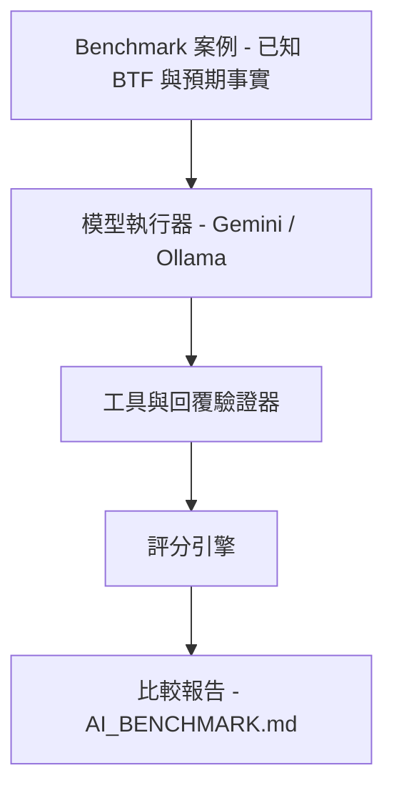

---

## Investigation Case

Desktop 與 Web 共用同一個 **Investigation Case** Model（`btf-investigation-case`），內容包括：

- Question
- Scope：Trace / C1–Cn / Tasks / Cores
- Hypotheses 與狀態：**supported / possible / need evidence / rejected**
- Evidence Graph
- Coverage
- Falsification Checks
- Conclusion
- Validation

Desktop / Web Lockstep 注意事項請參閱 [Implementation Notes](#implementation-notes)。

每次 AI 最終回覆後，Host-side **Validator** 會擷取 `jump:TIME` 與 `Task[id]` Claim，並標示虛構的名稱或 Cursor Window 之外的 Timestamp。

**Test connection** 會附加 **Model Capability** Card，包含 Live Chat / Structured Output / Tool Calling，以及基於 3B vs 7B+ Heuristic 的 Overlay。

Headless Evaluation：

```bash
make -C BTFViewer ai-test
# 或：
python builds/btf_viewer.py ai-test --dataset tests/ai --fail-under 70
```

Quick / Diagnose / Compare / Optimize / Report 等 Mode 只是對應到現有 Template，**不會增加新的 Tool**。所有結果仍應回到 Timeline 確認。

---

<a id="investigation-planner" name="investigation-planner">&#x200B;</a>

## Investigation Planner

這是 Host-side Planner，核心原則是：

> **先取得成本最低的證據（Cheapest Evidence First）。**

使用者操作流程請參閱 [README → Investigation planner](README.md#investigation-planner)。

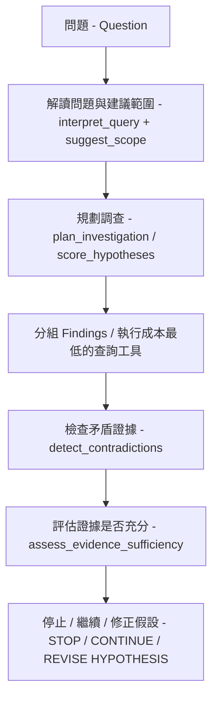

| Tool / Helper | Host 行為 |
| --- | --- |
| `plan_investigation` | 根據 Findings + Question 排序 Hypotheses 與低成本 Tool Sequence |
| `suggest_scope` | 建議 Task、Related Tasks、Evidence Times，或使用目前 Cursor |
| `detect_contradictions` | `SUPPORTED` / `CONTRADICTED` / `INSUFFICIENT`；例如 Execution ≫ Blocking 時，會與 Mutex Hypothesis 矛盾 |
| `assess_evidence_sufficiency` | 使用 Coverage Heuristic 判斷 Stop / Continue / Revise |
| `score_hypotheses` | 依 Evidence 加權評分；不是 GUI Tool |
| `cluster_findings` | 依共用 Task 或 Pattern 分組 |
| `generate_fingerprint` | 產生 HIGH / MEDIUM / LOW Scheduling、Sync、Timing Band |
| `find_similar_investigations` | 使用類似 Jaccard 的方式，與已記錄 Experiment Outcome 比對 |
| `regression_localize` | 將 A vs B Delta 定位至 Task / Region / Likely Mechanism |
| `build_causal_chain` | Edge 標示為 Causal / Correlated / Temporal；必須附 Disclaimer |
| `generate_experiment_plan` | 排序 Pin / Contention / Priority Experiment |
| `record_experiment_outcome` | 保存 Outcome；Desktop 使用 `[ai] experiment_outcomes`，Web 使用 `localStorage` |
| `score_investigation` | Phase 3 額外指標：`evidence_efficiency`、`investigation_cost`、`false_confidence`、`falsification_quality`、`scope_accuracy`、`stop_efficiency`；同時整合到 `score_benchmark_case`，包括 Adversarial Rate |

**不要在 `auto_investigate` 之後再增加 Chat Template。**

---

<a id="causal-engines" name="causal-engines">&#x200B;</a>

## 因果與時間引擎（Causal and temporal engines）

這些功能是在 Analysis Findings 上執行的 **Host-side Heuristic**，不是 FreeRTOS Scheduler Replay。

使用者操作流程仍以 [Investigation Planner](#investigation-planner) 為主。Diagnose / Investigate / Auto investigate 會先依序使用 Explanation Tool，再進入 Experiment：

**Graph → Temporal → `rank_root_causes` → `challenge_conclusion` → `what_if`**

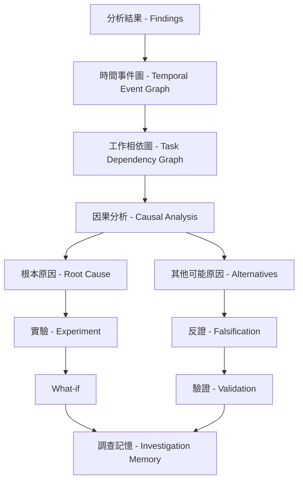

| Tool / Helper | Host 行為 |
| --- | --- |
| `analyze_temporal_causality` | 根據 Finding Time（`jump:TIME`）建立 Happens-before Chain |
| `build_task_dependency_graph` | 建立 BTF Sync / Preempt / Migrate / PI Graph；Finding Wording 作為 Fallback，可指定 `task` Neighborhood |
| `decompose_response_time` | 計算 Mutex / Preemption / Migration / Execution / Scheduler 的相對 Delay Share |
| `rank_root_causes` | 排序 Hypothesis 或 Finding Bucket |
| `verify_claim` | 依 Findings 與 Cursor 判定 `SUPPORTED` / `PARTIAL` / `UNSUPPORTED` |
| `challenge_conclusion` | 提出 Alternatives 與 Missing Evidence |
| `investigation_memory` | 儲存／回想；Desktop 使用 `[ai] investigation_memory`，Web 使用 `localStorage` |
| `cluster_incidents` | 依時間接近程度將 Findings 分組 |
| `close_investigation` | 記錄 Conclusion 並關閉 Case |
| `analyze_distribution` | p50 / p90 / p95 / p99 / p99.9、Stddev、CV、3-sigma Outlier Rate；取得 BTF Execution / Blocking / PI / Tick Sample |
| `analyze_periodicity` | 根據 Tick、STI、ISR、Timer 或 Task-release Time 分析 Period / Jitter；Kind = Drift / Jitter / WCET / Scheduler |
| `summarize_investigation_context` | 精簡整理 Findings、Hypotheses 與已執行 Tools |

<a id="engine-limits" name="engine-limits">&#x200B;</a>

### Engine 限制（Engine limits）

| Engine | 它是什麼 | 它不是什麼 |
| --- | --- | --- |
| `analyze_temporal_causality` | 根據 Finding `jump:TIME` 建立 Happens-before | Kernel Event Replay |
| `build_task_dependency_graph` | BTF Sync / Preempt / Migrate / PI Edge；2-hop `task` Neighborhood | 完整 ISR / Object Graph |
| `decompose_response_time` | 根據 Finding Magnitude 計算相對占比 | Cycle-accurate Milliseconds |
| `rank_root_causes` | Hypothesis 或 Finding-bucket Ranking | 機率 |
| `investigation_memory` | Local Store / Recall Notepad | Team Knowledge Base |
| `cluster_incidents` | 依時間接近程度分組 | Shared-mutex / Causal Clustering |
| `close_investigation` | Case Status `closed` + Conclusion | 完整 Firmware A/B Lifecycle |
| `analyze_distribution` | BTF Execution / Blocking / PI / Tick Sample，最多 8000 筆 | Parser 本身沒有的 Response-time Series |
| `analyze_periodicity` | Inter-arrival Jitter 與 Kind | Kernel Period Timer |
| `simulate_schedule` | `what_if` 內部使用的 LEVEL 1 Helper | GUI Tool 或 FreeRTOS Kernel |

以下內容不在 Scope 內，**不要為這些功能新增 Chat Template**：

- Trace-to-code（ELF / DWARF）
- 真正的 Scheduler 或 Hardware-aware Simulation
- Model Routing
- 自動產生 Benchmark Case
- Natural-language → Metric Compiler
- 沒有 Analysis Findings 的 Anomaly Discovery
- Shared Team Investigation Database

**不要在 `auto_investigate` 之後再新增 Chat Template。** 下一階段的改善應來自更深入的 Engine，而不是增加更多 Button。

---

<a id="implementation-notes" name="implementation-notes">&#x200B;</a>

## 實作注意事項（Implementation notes）

本節記錄 Desktop 與 Web 保持 Lockstep 的技術注意事項。

使用者可見的 Case / Evidence 行為請參閱 [README → Investigation Case](README.md#investigation-case)。Live-suite XML 請參閱 [Benchmark and Evaluation Suite](#benchmark-suite)。已記錄的 Score 位於 [AI_BENCHMARK.md](AI_BENCHMARK.md)。

<a id="analysis-vs-ai-tools" name="analysis-vs-ai-tools">&#x200B;</a>

### Analysis 與 AI Tools 的分工（Analysis vs AI tools）

事實應優先來自 BTF Statistics Page。AI 的工作是對這些事實進行**排序、解釋與導覽**。

**不要為 Statistics Page 已經完成的工作新增 AI Tool**，例如：

- 不要新增 `detect_timeline_anomalies`
- 不要新增額外的 Jitter Tool
- 不要新增 Histogram Tool

同樣地：

- 不要虛構 Kernel Response Time。
- 不要檢查 ELF / Source。
- 不要模擬 Scheduler。

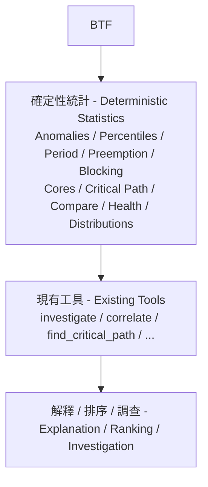

目前已提供的完整流程維持：

**Triage → Investigate → Verify → Correlate → Critical Path → Dependency Graph → Temporal Causality → Rank → Challenge → What-if → Report**

應優先改善取得 Statistics Evidence 的方式，而不是持續增加 Tool List。

使用者可見的 Page Map 請參閱 [README → BTF analysis pages](README.md#btf-analysis-pages)。

### 共用 Case / Evidence Engine（Shared Case / Evidence engines）

Desktop 與 Web 共用同一套 Case、Evidence、Planner、Causal、Tool 與 Mermaid Implementation。

AI UI 修改後執行：

```bash
make -C BTFViewer bundle
make -C BTFViewer web
```

**UI Lockstep：**

- Mode Chip 可以換行。
- Primary Template 使用兩列：
  - 第一列：Analysis Findings / Explain region / Investigate
  - 第二列：**Auto investigate** + **More templates…**
- Chip 最小高度為 28px。
- Disabled Chip / Menu Item 使用 `#8a96a8`。
- Findings 的 **Investigate…** 使用與其他 Analysis Footer Button 相同的 Outline Style，不使用 Accent / Primary Style。
- **More** Template 在 2-column Overlay 中使用相同 Group。
- Trace Compare 從工具列 **Compare** 開啟，而不是 Statistics Footer。

Desktop `ai-test` CLI 與 Web Offline Benchmark 共用 `tests/ai` Fixture，包括被追蹤的 `.btf` Stub + `dataset.json`。

Live Run 支援 `--context-mode` 與 `--compare-context`，請參閱 [Context mode benchmarking](#context-mode-benchmarking)。

### Validator

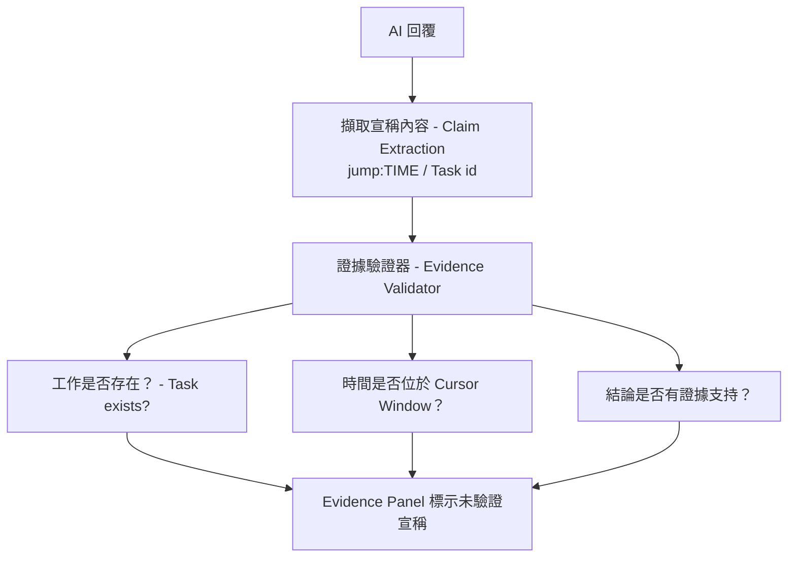

Host Validator 會在最終回覆後執行。Prompt 本身仍會禁止虛構 Number、Task Name 與 `jump:TIME`；**Validator 才是最後的防護機制，而不是 Prompt。**

### Experiment 結案（Experiment close-out）

`validate_experiment` 會比較 Expected 與 Actual Signed Percent，並回傳：

- `VALIDATED`
- `PARTIALLY VALIDATED`
- `DISPROVED`

接著更新尚未關閉的 Hypothesis，並提供 **Save to knowledge**（`btfexp:save`）。

如果 `actual` 為空，會從最近一次 Trace Compare Refresh 自動取得，包括 **Scope to cursors**；也可以從 `compare_performance` 透過 `experiment_percents_from_compare` 取得。

工具列 **Compare → Validate experiment…** 會關閉 Dialog，並要求模型呼叫 Tool，此時省略 Actual。

Firmware 修改與重新擷取仍然由使用者完成：

**修改 Firmware → 擷取新 Trace → 工具列 Compare**

### Capability、成本、隱私與知識（Capability, cost, privacy, knowledge）

| Feature | Host 行為 |
| --- | --- |
| Capability probe | **Test connection** 先列出 Model，再使用 JSON Structured-output Probe 進行 Chat，接著測試 Tool Calling（`btf_ping` → `btf_pong`）。Live Result 會 Overlay Chat / Structured Output / Tool Calling / Multi-tool Chaining；Long Context 與 Reasoning 仍屬 Heuristic |
| Cost | 獨立 Usage Bar 顯示 `Context: Compact · 4.6k tok · 3 tools · 12s`，依序代表 Mode、Tokens、Tools、Model Time。Evidence 使用完整 `format_cost_meter` Line。**Clear** 會重設 Replies、Meter 與 Current Investigation Issues |
| Privacy | Chip：🟢 Local / 🟡 Cloud / 🔴 Sensitive。Sensitive 時會阻擋 Cloud Send；其他情況會清理 Annotation，並可選擇套用 Task-name Alias（`apply_cloud_privacy`） |
| Knowledge | `investigate` 先比對使用者保存的 Entry（More → **Save current finding…**），再比對 Baseline，最後使用 Built-in Catalog。有 Typical 與 Current Rate 時會同時顯示 |
| Interpret | Free-form Ask 會先由 Host 執行 `interpret_query`。Template / Mode / **Run investigation** 不需要 Confirm |
| Tool Why? | Evidence **Investigation** 會列出每個 Tool 及 Host-side Reason（`btftool:why/name`） |

---

## 圖表（Diagrams）

回覆可以包含：

- Mutex、Blocking 與 Priority Event 的 Mermaid Sequence Diagram。
- Core Migration 的 Flowchart。

使用 **Compact** Context Mode 時，只有使用者要求才會產生 Diagram。

Findings 中的 Markdown Table 與 Sanitized HTML Table，都會在 Reply Pane 中顯示為 Table。`investigate` 回傳 Root-cause Chain 時，Evidence Panel 也會建立 Investigation Tree。

Diagram 會配合目前的 Light / Dark Theme；**Save As…** 匯出的 HTML 則使用 Light Palette。

互動方式：

- 點選 **Task Node**：持續反白對應的 Timeline Row。`Low[266] (Core 0)` 會解析為 `Low[266]`。
- 點選 **Core Node**（`Core_0`、`C0`、`C1`）：切換到 Core View，並捲動至該 Core。
- Mutex Hex 與其他無法解析的 Label：不執行任何動作，Timeline 不會被淡化。
- 點選 Figure 空白區域：開啟較大的 Zoom Window。Scroll 可縮放 0.5–6×；按 **Esc** 或 **Close** 關閉。Trackpad Pinch 會視為 Scroll。
- Figure 下方的 Link Row 使用相同 Target。
- **Save As…** HTML 會保留可點選 Node 的 Inline SVG，但不包含 Chat Zoom Wrapper。

---

## 文件導覽（Documentation navigation）

| 文件 | 回答的問題 |
| --- | --- |
| [README.md](README.md) | 如何使用 BTFViewer？ |
| [WORKFLOWS.md](WORKFLOWS.md) | 如何診斷問題？ |
| [STATISTICS.md](STATISTICS.md) | 這項量測代表什麼？ |
| [AI.md](AI.md) | AI 輔助調查如何運作？ |
