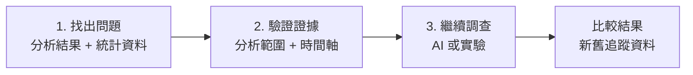
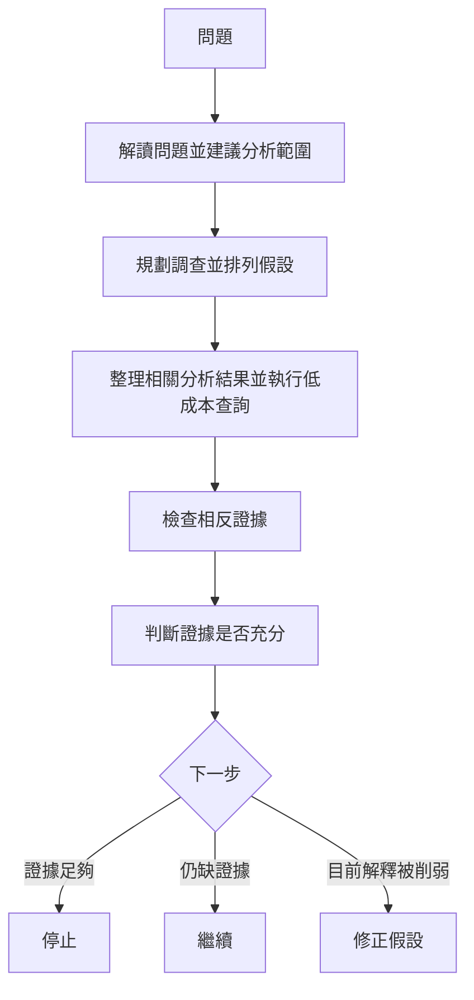
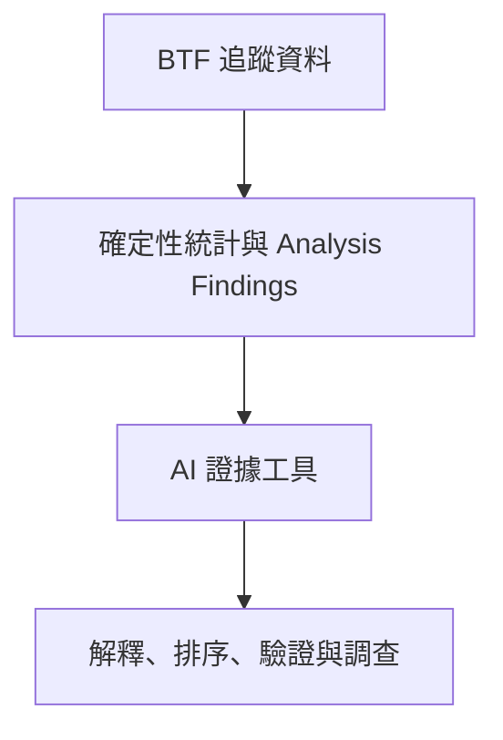

# AI 助理

BTFViewer 的 **AI 助理** 用來協助分析 BTFViewer
已經量測完成的追蹤資料。它不會取代統計資料或時間軸，而是協助整理證據、檢驗可能的解釋、找出缺少的檢查項目，並規劃下一步。

> **重要：** 實際量測值來自 BTFViewer。AI
> 提供的是對證據的解讀。**What-if** 與 **Optimize**
> 屬於估算，不是實際量測到的 RTOS 行為。

## 從哪裡開始

大多數問題都可以依照下面的簡單流程處理：



1.  **找出問題。** 先看 **Analysis Findings**，再開啟相關的統計資料。
2.  **驗證證據。** 使用 C1–Cn
    界定事件範圍，回到時間軸確認事件是否真的發生。
3.  **繼續調查。** 可以請 AI
    解釋或檢驗證據，也可以直接進行一項可控制的修改並重新擷取追蹤資料。
4.  **比較結果。** 使用 **Trace Compare** 比較修改前後的實際量測結果。

AI 是選用功能。即使不使用 AI，也可以透過統計資料、時間軸、Investigation Notebook 與 Trace Compare 完成調查。

## 目錄

### 使用指南

1. [AI 助理可以做什麼](#what-the-ai-assistant-does)
2. [AI 面板操作](#using-the-ai-panel)
3. [內建操作](#built-in-actions)
4. [從哪裡使用 AI](#choosing-the-right-entry-point)
5. [分析流程](#investigation-workflows)
6. [常見使用案例](#common-use-cases)
7. [如何解讀結果](#understanding-the-result)
8. [AI 工具說明](#ai-tools)
9. [設定與隱私](#configuration-and-privacy)
10. [檢視器行為](#viewer-behavior)
11. [疑難排解](#troubleshooting)

### 工程參考

12. [引擎限制](#engine-limits)
13. [完整工具參考](#complete-tool-reference)
14. [調查案例](#investigation-case)
15. [調查規劃器](#investigation-planner)
16. [保存結果與報告](#saved-results-and-reports)
17. [命令列與回歸檢查](#cli-and-regression-checks)
18. [基準測試結果](#benchmark-results)
19. [Analysis 與 AI 工具的分工](#analysis-vs-ai-tools)
20. [實作注意事項](#implementation-notes)

------------------------------------------------------------------------

<a id="what-the-ai-assistant-does" name="what-the-ai-assistant-does"></a>

## AI 助理可以做什麼

AI 助理取得的是 BTFViewer 整理好的結構化資料，不是把整份原始 `.btf`
檔當成文字直接交給模型。

AI 可以使用：

-   **分析結果**：BTFViewer 依規則與統計資料找出的可疑項目。
-   **統計資料**：目前分析範圍內的量測值與衍生數值。
-   **時間軸證據**：BTFViewer 工具找到的事件與時間點。
-   **分析範圍與篩選條件**：目前的 C1–Cn，以及工作、核心與遷移條件。
-   **追蹤資料比較**：兩份追蹤資料之間的實際量測差異。
-   **目前調查內容**：正在檢查的問題、假設、證據與驗證結果。

AI 不會讀取韌體原始碼或 ELF 檔案。

### 適合交給 AI 的工作

AI 適合用來：

-   解釋某個量測結果為什麼值得注意；
-   整理多項彼此相關的證據；
-   檢查目前的解釋是否有足夠證據；
-   尋找其他可能的解釋；
-   找出還缺少哪些證據；
-   規劃下一項量測；
-   整理調查結果；
-   用較容易閱讀的方式說明兩份追蹤資料的差異。

### 不應直接相信 AI 的項目

如果 BTFViewer 沒有提供可驗證的證據，不應把下列內容直接當成事實：

-   根本原因；
-   追蹤資料中看不到的工作相依關係；
-   沒有被記錄下來的排程器行為；
-   修改韌體後一定會產生的效果；
-   What-if 或 Optimize 預測的效能改善。

重要結論仍應回到統計資料與時間軸確認。

------------------------------------------------------------------------

<a id="using-the-ai-panel" name="using-the-ai-panel"></a>

## AI 面板操作

AI 面板會依目前的追蹤資料與調查狀態建立分析內容。

### 主要控制項

**問題輸入框**

直接輸入目前追蹤資料的問題。AI 會取得 BTFViewer 提供的目前分析內容。

**Start Investigation**

第一次使用或不知道該選哪一項操作時，優先使用這個功能。

完整流程為：

```text
初步判斷 → 界定範圍 → 調查 → 驗證 → 實驗 → 比較
```

已經取得的證據應繼續沿用，不應在每個階段重新執行相同檢查。

**Context**

這一列用來顯示目前的分析階段、範圍、焦點、內容模式與隱私狀態。需要確認
AI 會收到哪些資料時再展開。

主要內容包括：

-   目前的追蹤資料；
-   完整追蹤資料或 C1–Cn 範圍；
-   工作、核心與遷移篩選條件；
-   目前選取的工作或分析結果；
-   內容模式；
-   AI 端點與隱私狀態。

**Clear**

清除 AI 對話與目前的 AI 調查狀態，不等同於重設一般追蹤資料操作。

**Language...**

設定 AI 回覆語言。

**Settings...**

開啟 AI 連線、模型、內容模式、隱私等設定。

### 內容模式

BTFViewer 提供三種內容大小：

-   **Compact**：使用最少 Token，適合範圍明確的問題。
-   **Balanced**：預設模式，適合大多數調查。
-   **Full Evidence**：提供更多相關證據；只有在前兩種模式缺少必要資訊時才需要使用。

內容越多不代表可信度越高。可信度仍應由證據決定。

------------------------------------------------------------------------

<a id="built-in-actions" name="built-in-actions"></a>

## 內建操作

AI 面板提供常用操作捷徑。畫面上的捷徑會依目前情境調整，其他範本可從
**More templates…** 開啟。這些功能只是針對同一份調查內容提出不同問題，
不是彼此獨立的分析系統。

### Start Investigation

**適合：** 不知道應該從哪個 AI 功能開始。

**作用：** 依目前證據引導完整調查，並選擇下一項有用的檢查。

**結果：** 目前最可能的解釋、證據、可信程度與下一項檢查。

### Analysis Findings

**適合：** 快速了解目前最重要的分析結果。

**作用：** 整理少量值得優先處理的項目，並指出應查看的統計資料或時間軸位置。

**不代表：** 已經找到根本原因。

### Triage findings

**適合：** 分析結果很多，不知道先看哪一項。

**作用：** 依重要性排列值得優先調查的項目。

**不會：** 直接完成原因分析。

### Explain region

**適合：** 已經用 C1–Cn 圈出一段可疑區域。

**作用：** 說明游標範圍內的事件，引用的時間點應維持在該範圍內。

### Investigate

**適合：** 已經有明確的效能問題。

**作用：** 補齊缺少的證據、整理相關事件、檢查目前最可能的解釋，並提出一個合理的替代解釋。

### Verify finding

**適合：** 要確認某一項分析結果是否真的有證據支持。

**作用：** 檢查目前的說法，結果應為 **Confirmed**、**Rejected** 或
**Inconclusive**。

### Explain finding

**適合：** 分析結果本身不容易理解。

**作用：** 用較容易閱讀的方式解釋該項結果，並指出相關證據。

### What-if

**適合：** 證據已經足夠，準備評估一項可能的修改。

**作用：** 估算修改後可能的變化方向。

**注意：** 這是估算，不是排程器模擬，也不是實際量測結果。

### Optimize

**適合：** 問題已經確認，希望找出可測試的改善方向。

**作用：** 整理值得進一步實驗的候選方向。

**注意：** 有價值的建議仍必須重新擷取追蹤資料驗證。

### Trace Compare

**適合：** 已經開啟兩份追蹤資料。

**作用：** 依 Trace Compare 的實際量測差異說明修改前後的變化。

------------------------------------------------------------------------

<a id="choosing-the-right-entry-point" name="choosing-the-right-entry-point"></a>

## 從哪裡使用 AI

BTFViewer 有多個 AI 入口。這些入口的差別主要是「會帶入哪一份目前證據」。

-   **Analysis Findings → Ask AI**：帶入目前選取的分析結果與相關證據。
-   **時間軸事件 → Ask AI about this
    event**：帶入目前的工作、核心與事件時間。
-   **時間軸區段 → Explain this region with AI**：帶入 C1–Cn。
-   **統計資料 → Query with AI...**：帶入目前的指標、工作與圖表資料。
-   **Migration & Corridor Inspector → Investigate with
    AI**：帶入目前的遷移路徑與檢查範圍。
-   **Trace Compare → Query with AI...**：帶入兩份追蹤資料的比較表。
-   **AI
    面板**：帶入目前追蹤資料、分析範圍、篩選條件、選取項目與調查狀態。

### 分析範圍很重要

如果問題只發生在某一段時間，應使用 **Limit to C1–Cn**。啟用後，AI
引用的證據原則上應位於該範圍內；如果需要使用範圍外的資料，應清楚說明原因。

畫面上的反白只是視覺提示，不等於篩選條件。工作、核心與遷移篩選條件才會影響分析內容。

------------------------------------------------------------------------


<a id="investigation-workflows" name="investigation-workflows"></a>

## 分析流程

選定要分析的工作、分析結果或時間範圍後，可依照以下流程進一步調查。

### 調查流程

| 步驟 | 範本或工具 | 用途 |
| ---: | --- | --- |
| 1 | **Triage findings** / `detect_anomalies` | 排列重要分析結果，開啟相關統計證據 |
| 2 | **Investigate** / `investigate` | 建立假設、替代解釋與證據檢查計畫 |
| 3 | **Verify finding** | 判斷目前分析結果獲得支持、遭到否定，或證據仍不足 |
| 4 | `correlate_events` + `query_raw_metric` | 整合選定工作的執行、阻塞、遷移、同步與優先權繼承證據 |
| 5 | `find_critical_path` / `detect_priority_inversion` | 必要時檢查搶佔、阻塞與優先權反轉路徑 |
| 6 | `build_task_dependency_graph` / `analyze_temporal_causality` | 整理 BTF 中實際記錄的相依與時間先後關係 |
| 7 | `rank_root_causes` / `challenge_conclusion` | 排列可能解釋，並檢查合理的其他原因 |
| 8 | `find_related_findings` / `compare_tasks` | 檢查相關分析結果，或比較可疑工作 |
| 9 | `set_cursors` / `zoom_to_range` / `highlight_task` | 把最重要的證據帶回時間軸 |
| 10 | **Evidence & Validation** | 檢查證據、缺少的檢查、相反證據與下一步 |
| 11 | `generate_report` / `close_investigation` / `export_investigation` | 調查完成後保存結果 |

這個順序不代表每次都必須執行所有工具。調查規劃器應沿用既有證據，並略過與目前問題無關的步驟。


只看各個按鈕名稱仍然不容易理解 AI
的用途。下面把常用功能放回完整分析流程中。

### 第一次進行調查

第一次開啟不熟悉的追蹤資料時，可依照以下順序：

1.  開啟 **Analysis Findings**，選擇一項與問題相關的警告或錯誤。
2.  開啟對應的統計區段，先確認量測到的異常確實存在。
3.  選擇受影響的工作，查看它在時間軸上的執行情形。
4.  用 C1、C2
    圈住一個具代表性的事件；只有需要描述更長的事件序列時才增加游標。
5.  如果問題只發生在這一段，啟用 **Limit to C1–Cn**。
6.  開啟 AI 面板，使用 **Start Investigation**。
7.  優先查看 AI 引用的證據，不要只閱讀文字解釋。
8.  解釋看起來合理時，再使用 **Verify finding**。
9.  如果證據不足，依 **Next check** 補做檢查，不要勉強下結論。
10. 完成驗證後，才使用
    **What-if**、**Optimize**，或自行定義一項可控制的修改。
11. 在可比較的條件下重新擷取追蹤資料。
12. 使用 **Trace Compare** 量測修改前後的差異。

一項有用的調查結果，不是很長的 AI 回答，而是一條可以重新核對的證據鏈：

```text
量測到的異常
    ↓
界定事件範圍
    ↓
相關事件或統計資料
    ↓
目前最可能的解釋
    ↓
驗證或反證
    ↓
實驗後的實際量測結果
```

### 解釋單一事件

已經在時間軸看到可疑事件時：

1.  選取該事件。
2.  使用 **Ask AI about this event**。
3.  確認送出的工作、核心與時間點正確。
4.  使用 `jump:TIME` 回到時間軸核對事件。
5.  如果問題涉及較長的事件序列，再用 C1–Cn 圈出範圍，接著使用 **Explain region**。

這個入口適合回答局部問題，不應自動變成整份追蹤資料的根本原因分析。

### 解釋一段時間範圍

重要行為集中在游標之間時：

1.  至少放置兩個游標。
2.  確認游標範圍正確。
3.  如果統計資料與 AI 都只應分析這一段，啟用 **Limit to C1–Cn**。
4.  使用 **Explain this region with AI** 或 **Explain region**。
5.  確認 AI 引用的時間點位於預期範圍。
6.  只有證據顯示原因發生得更早或影響延續到更晚時，才擴大範圍。

### 驗證一項分析結果

Analysis Finding
是由確定性規則或統計資料產生的線索，不等於已經找到原因。

完整驗證至少應回答：

-   現在要驗證的說法是什麼？
-   哪些實際量測值支持它？
-   哪些時間軸事件支持它？
-   證據是否位於目前分析範圍？
-   是否存在相反證據？
-   是否還有合理的其他解釋？
-   還缺少哪些證據？

最後的驗證結果應該不需要閱讀內部工具紀錄也能理解。


<a id="what-if-and-optimize-workflow" name="what-if-and-optimize-workflow"></a>

### What-if 與 Optimize 流程

`what_if` 與 `optimize_experiment` 是**啟發式執行區段重播** 工具。它們使用實際量測到的執行區段，估算工作配置、減少遷移、降低阻塞或調整優先權等修改可能造成的變化。

它們**不會模擬 RTOS 核心，也不是確定性排程器**。輸出結果只用來選擇值得進一步測試的實驗，不能用來證明修改一定有效。

| 目的 | 使用方式 | 例子 |
| --- | --- | --- |
| 測試一個具體想法 | **What-if** → `what_if` | 將工作固定在特定核心、提高優先權、降低競爭 |
| 排列多個改善方案 | **Optimize** → `optimize_experiment` | 比較工作配置、競爭、優先權或遷移修改 |
| 只需要定性建議 | `optimize` | 說明可能的改善方向，不進行實驗評分 |
| 決定下一項實機測試 | `recommend_experiments` | 把估算結果轉成實際驗證實驗 |

閱讀結果時，應比較實際量測的 **baseline** 與 **simulated** 估算值。依問題不同，可檢查遷移次數、阻塞時間、負載平衡分數與實驗成本。

**Medium confidence** 表示這個想法可能值得在實際系統上測試；**Low confidence** 通常表示修改描述太模糊，或追蹤資料提供的證據太少。

最後一定要回到實際量測：

```text
已驗證的證據
    ↓
What-if / Optimize 估算
    ↓
一項可控制的系統修改
    ↓
重新擷取追蹤資料
    ↓
Trace Compare
```

修改是否有效，應由新的追蹤資料決定，而不是由估算結果決定。

<a id="common-use-cases" name="common-use-cases"></a>

## 常見使用案例

### 回應時間尾端過長

先看回應時間分布與
p95、p99、Max。圈出一個較慢的實例，再檢查執行時間、派送等待、阻塞與附近的搶佔事件。AI 可以協助整理這些因素，但引用的數值仍應能回到統計資料核對。

### 阻塞或同步問題

先看阻塞與互斥鎖相關統計資料。圈出一個事件，再檢查追蹤資料中實際可觀察到的持有者與後續取得者。若追蹤格式沒有記錄核心內部真正的等待佇列，推定的交接或等待關係仍屬啟發式判斷。

### 核心遷移或來回遷移

先使用 **Migration & Corridor Inspector**。檢查遷移次數、停留時間、來回遷移、負載平衡與目前路徑。AI 可以把遷移路徑與附近的排程或同步證據整理在一起，但單純發生遷移不代表一定有效能問題。

### 懷疑優先權反轉

檢查優先權、阻塞、互斥鎖與排程相關證據。AI 可以使用
`detect_priority_inversion`
協助檢查，但結論仍受限於追蹤資料實際記錄的內容。缺少的核心內部狀態不能自行推測成事實。

### 修改後發生效能退步

先開啟可比較的基準追蹤資料與候選追蹤資料，優先使用 **Trace Compare**，再請 AI 解釋。AI
應以實際量測差異為基礎，找出可能相關的工作與時間區段，再提出下一項檢查。實際比較結果比預估的改善幅度更可靠。

### 週期性工作的時間抖動

先查看週期、派送、執行與回應時間分布。用 C1–Cn
圈住一個具代表性的離群事件，確認問題是否重複出現，以及是否與阻塞、搶佔、遷移或特定工作負載階段同時發生。

------------------------------------------------------------------------


<a id="workflows-and-use-cases" name="workflows-and-use-cases"></a>

## 實際範例

假設 Analysis Findings 顯示 `Worker` 的回應時間 p99 明顯偏高。

可以這樣調查：

1.  開啟回應時間統計資料，先確認 p99 的確偏高。
2.  開啟分布資料，找一個具代表性的慢速樣本。
3.  使用 **Show on timeline** 或相關時間點回到事件位置。
4.  用 C1、C2 圈住該事件。
5.  啟用 **Limit to C1–Cn**。
6.  請 AI 調查目前選取的分析結果。
7.  檢查延遲是否與執行、派送等待、阻塞、搶佔、遷移或其他已量測因素有關。
8.  使用 **Verify finding** 檢查目前最可能的解釋，並尋找相反證據。
9.  如果仍無法確認，依缺少的證據繼續檢查，不要強迫產生根本原因。
10. 有明確可測試的修改後，重新擷取追蹤資料並比較相同指標。

最後的調查筆記可以很簡短：

```text
觀察：
Worker 在目前工作階段的回應時間 p99 偏高。

證據：
慢速樣本位於 C1–C2，且同一區段存在 BTFViewer 引用的排程／阻塞量測證據。

結論：
目前解釋獲得支持／遭到否定／證據仍不足。

下一步：
進行一項可量測的修改，或補做一項必要的證據檢查。
```

------------------------------------------------------------------------

## 繼續調查

AI 對話不應在每次回覆後重新從頭開始。

如果 **Evidence & Validation** 已經提供 **Next check**，可直接沿用目前調查內容執行下一項檢查。需要改變問題、質疑目前解釋或要求補充說明時，再使用一般追問。

BTFViewer
提供可執行的下一步時，應沿用目前調查內容。已完成的證據查詢應優先重複使用；只有分析範圍、篩選條件、追蹤資料或需要的證據已經改變時，才有必要重新查詢。

符合以下情況時，可以合理結束調查：

-   主要說法已有足夠證據支援目前的工程決策；
-   至少一個合理的其他解釋已經檢查；
-   剩餘缺少的證據不太可能改變決策；或
-   現有追蹤資料不足，必須重新擷取才能繼續。

「證據不足」本身就是有效的調查結果。

------------------------------------------------------------------------

<a id="understanding-the-result" name="understanding-the-result"></a>

## 如何解讀結果

### Evidence & Validation

這個區域是判斷 AI 回覆是否有用的主要位置。

建議依下列順序閱讀：

1.  **Verdict**：目前的驗證結果。
2.  **Leading explanation**：目前證據最支持的解釋。
3.  **Direct / Timeline evidence**：可以回到 BTFViewer 核對的實際證據。
4.  **Checks**：已經檢查過的說法。
5.  **Alternatives**：曾考慮的其他解釋。
6.  **Missing evidence**：目前仍缺少的資訊。
7.  **Next check**：下一項最值得進行的檢查。
8.  **Investigation details**：工具使用、可信程度變化等進階資訊。

一般使用時先看前七項即可，不需要一開始就展開所有細節。

### 證據強度

BTFViewer
可能把資料區分為實際量測、衍生結果、啟發式判斷、設定值或模擬／估算。這些資料的可信程度不同。

判斷重要問題時，建議優先順序為：

```text
實際量測的事件或數值
    ↓
由量測值計算出的統計結果
    ↓
依規則得到的啟發式判斷
    ↓
模擬或估算
```

### 可信程度

可信程度表示目前證據對某個解釋的支持程度，不代表「AI 正確的機率」。

如果要使用高可信度的因果結論，應有可回到時間軸核對的證據，並完成驗證，而不是只有合理的文字說明。

### Apply、Skip 與 Undo

只讀取證據的工具可以直接執行。

會改變檢視器狀態的操作可能顯示為操作卡：

-   **Navigation**：移動或縮放時間軸。
-   **Scope**：修改分析範圍。
-   **Filter**：修改工作、核心或遷移篩選條件。
-   **Annotation**：加入標記或註解。
-   **Export**：儲存報告或調查資料。
-   **Calculation**：執行證據計算或估算。

按 **Apply** 套用變更，按 **Skip** 保持目前畫面不變。支援的操作可以用
**Undo** 還原縮放、游標、反白、分析範圍與篩選條件等狀態。

------------------------------------------------------------------------

<a id="ai-tools" name="ai-tools"></a>

## AI 工具說明

一般使用者不需要記住工具名稱。AI 助理會依需要自行選擇。這一節的目的是說明每一類工具到底在做什麼。

### 1. 導覽與顯示證據

這些工具主要改變畫面，不負責判斷原因。

-   `set_cursors`：把 C1–Cn 放到指定的證據時間點。
-   `zoom_to_range`：縮放到指定時間區段。
-   `highlight_task`：反白顯示指定工作。
-   `set_view_mode`：切換工作／核心檢視方式與方向。
-   `open_corridor_inspector`：開啟 Migration & Corridor Inspector。
-   `open_statistics_section`：開啟指定的統計區段，不修改分析範圍。
-   `add_annotation`：在指定時間加入文字註解。
-   `bookmark_finding`：把分析結果保留為書籤。
-   `clear_marks`：清除指定的註解、游標或書籤。
-   `reset_view`：回到完整追蹤資料檢視。

### 2. 量測與搜尋

這些工具讀取證據，不會改變追蹤資料。

-   `query_raw_metric`：取得目前分析範圍內的執行時間、阻塞、遷移、同步、優先權繼承、啟動與可執行等待等資料。
-   `search_timeline`：搜尋時間軸事件並回傳時間點。
-   `analyze_distribution`：計算百分位數、離散程度、變異係數與離群值。
-   `analyze_periodicity`：檢查週期與時間抖動。
-   `check_budget`：比較執行時間、回應時間或截止期限與設定門檻。
-   `decompose_response_time`：整理回應時間中各類延遲的相對比例。

### 3. 找出並連結相關問題

-   `detect_anomalies`：排列目前值得注意的分析結果。
-   `cluster_findings`：把彼此相關的分析結果分組。
-   `cluster_incidents`：把時間上接近的事件整理成同一事件群組。
-   `investigate`：針對某項分析結果建立調查關係。
-   `plan_investigation`：選擇下一項值得進行的檢查。
-   `suggest_scope`：建議較適合的時間範圍。
-   `correlate_events`：把同一事件附近的執行、阻塞、遷移、同步與優先權資料整理在一起。
-   `find_related_findings`：找出與目前問題相關的其他分析結果。
-   `find_critical_path`：檢查事件附近的阻塞、搶佔與互斥鎖關係。
-   `build_task_dependency_graph`：整理追蹤資料中可觀察到的等待、搶佔、遷移與優先權繼承關係。
-   `analyze_temporal_causality`：依實際時間順序建立事件先後關係。
-   `build_causal_chain`：整理因果、相關與時間關係，避免把單純相關直接當成因果。
-   `rank_root_causes`：依現有證據排列可能的原因。

### 4. 驗證與反證

-   `verify_claim`：檢查一項說法，回傳支持、部分支持或不支持。
-   `detect_contradictions`：尋找與目前解釋矛盾的證據。
-   `challenge_conclusion`：提出合理的替代解釋與缺少的證據。
-   `assess_evidence_sufficiency`：判斷應停止調查、繼續收集證據，或修改假設。
-   `manage_hypotheses`：管理目前的假設與驗證狀態。
-   `detect_priority_inversion`：檢查是否有符合優先權反轉的證據。
-   `explain_finding`：解釋目前選取的分析結果。

### 5. 比較追蹤資料與工作

-   `trigger_compare`：取得或開啟兩份追蹤資料的 Trace Compare。
-   `compare_performance`：取得結構化的 A/B 指標差異。
-   `regression_explain`：說明主要的實際效能退步。
-   `regression_localize`：找出可能與效能退步相關的工作與時間區段。
-   `compare_tasks`：比較兩個工作的量測資料。
-   `baseline_score`：把目前結果與已儲存的基準比較。
-   `analyze_traces`：比較多份已開啟追蹤資料的排程行為。
-   `generate_fingerprint`：整理排程、同步與時間特徵。

### 6. 規劃與驗證實驗

這一類工具應在證據已經足夠後使用。

-   `what_if`：估算一項具體修改可能造成的變化。
-   `optimize`：提供可考慮的改善方向。
-   `optimize_experiment`：排列值得測試的候選修改。
-   `recommend_experiments`：建議可用來驗證的實驗。
-   `generate_experiment_plan`：產生較具體的韌體或測試步驟。
-   `validate_experiment`：比較先前預測與重新量測的實際結果。
-   `record_experiment_outcome`：記錄實驗結果，供後續相似案例參考。
-   `find_similar_investigations`：尋找特徵相似的既有調查紀錄。

### 7. 報告與保存調查

-   `generate_report`：產生結構化的工程說明。
-   `export_report`：儲存診斷報告。
-   `export_investigation`：儲存完整調查資料。
-   `summarize_investigation_context`：產生精簡的調查摘要。
-   `investigation_memory`：儲存或取回相似調查紀錄。
-   `close_investigation`：以目前結論與可信程度結束調查。

### 輔助工具

-   `interpret_query`：先解讀一般文字問題，再準備適合的調查要求。

------------------------------------------------------------------------


<a id="engine-limits" name="engine-limits"></a>

### 引擎限制

部分工具會根據 BTF 證據整理或推定事件關係。工具名稱不代表它能取得追蹤資料沒有記錄的資訊。

| 引擎 | 可以提供什麼 | 重要限制 |
| --- | --- | --- |
| `analyze_temporal_causality` | 根據已記錄證據與 `jump:TIME` 建立時間先後關係 | 不是核心事件重播 |
| `build_task_dependency_graph` | 整理工作附近的同步、搶佔、遷移與優先權繼承關係 | 不是完整 ISR 或核心物件關係圖 |
| `decompose_response_time` | 依現有分析結果估算各因素的相對占比 | 不是 cycle-accurate 的回應時間重建 |
| `rank_root_causes` | 排列假設或分析結果群組 | 排名不是機率 |
| `investigation_memory` | 在本機保存與取回調查內容 | 不是團隊共用知識庫 |
| `cluster_incidents` | 依時間接近程度整理事件 | 不能證明事件具有共同原因 |
| `analyze_distribution` | 分析 BTF 實際提供的樣本分布 | 無法產生追蹤資料／解析器沒有提供的序列 |
| `analyze_periodicity` | 分析事件到達間隔與時間抖動 | 不是核心計時器模型 |
| `simulate_schedule` | What-if 估算內部使用的輔助功能 | 不是 RTOS 排程器模擬器，也不是使用者工具 |

BTFViewer 不會重建未記錄的核心內部狀態、不會檢查 ELF／原始碼，也不會進行硬體感知的排程器模擬。追蹤資料不足時，正確結果應是**證據不足**。

<a id="complete-tool-reference" name="complete-tool-reference"></a>

## 完整工具名稱

這一節提供給實作與除錯使用。一般使用者讀完上一節即可。

  ---------------------------------------------------------------------------------------------------
  Tool                            Tool                            Tool
  ------------------------------- ------------------------------- -----------------------------------
  `add_annotation`                `analyze_distribution`          `analyze_periodicity`

  `analyze_temporal_causality`    `analyze_traces`                `assess_evidence_sufficiency`

  `baseline_score`                `bookmark_finding`              `build_causal_chain`

  `build_task_dependency_graph`   `challenge_conclusion`          `check_budget`

  `clear_marks`                   `close_investigation`           `cluster_findings`

  `cluster_incidents`             `compare_performance`           `compare_tasks`

  `correlate_events`              `decompose_response_time`       `detect_anomalies`

  `detect_contradictions`         `detect_priority_inversion`     `explain_finding`

  `export_investigation`          `export_report`                 `find_critical_path`

  `find_related_findings`         `find_similar_investigations`   `generate_experiment_plan`

  `generate_fingerprint`          `generate_report`               `highlight_task`

  `interpret_query`               `investigate`                   `investigation_memory`

  `manage_hypotheses`             `open_corridor_inspector`       `open_statistics_section`

  `optimize`                      `optimize_experiment`           `plan_investigation`

  `query_raw_metric`              `rank_root_causes`              `recommend_experiments`

  `record_experiment_outcome`     `regression_explain`            `regression_localize`

  `reset_view`                    `search_timeline`               `set_cursors`

  `set_view_mode`                 `suggest_scope`                 `summarize_investigation_context`

  `trigger_compare`               `validate_experiment`           `verify_claim`

  `what_if`                       `zoom_to_range`                 
  ---------------------------------------------------------------------------------------------------

如果模型不支援原生工具呼叫，BTFViewer
可使用相容的備援格式。需要大量工具操作的調查，仍應優先使用工具呼叫較可靠的模型。

<a id="configuration-and-privacy" name="configuration-and-privacy"></a>

## 設定與隱私

### 連接 AI 服務

開啟 **Settings →
AI**，依服務提供者設定端點、模型與必要的驗證資訊。開始調查前先執行
**Test connection**。

BTFViewer 會依端點支援程度測試模型清單、對話、結構化輸出與工具呼叫。

### 選擇模型

對 BTFViewer
而言，工具操作的可靠度通常比文字是否華麗更重要。建議模型至少能：

-   遵循結構化指示；
-   穩定呼叫工具；
-   在後續回合保留工具操作狀態；
-   處理目前選擇的內容大小；
-   分清楚證據與推論。

模型選擇應參考專案目前的基準測試結果。模型版本會持續變動，不應只依這份文件中的固定名稱判斷。

### 隱私

AI 面板會顯示目前使用本機或雲端服務。把追蹤資料衍生資訊送到遠端服務前，先確認目前的隱私狀態。

雲端隱私處理可以清理部分註解內容，並依設定替換工作名稱。敏感設定可禁止傳送到雲端。

### 認證資訊

使用目前 BTFViewer 與服務提供者支援的認證方式。不要把 API 金鑰放進追蹤資料、報告、螢幕截圖或共享的調查檔案。

------------------------------------------------------------------------

<a id="viewer-behavior" name="viewer-behavior"></a>

## 檢視器行為

解讀 AI 操作時，請注意：

-   只讀取證據的工具不會改變時間軸。
-   導覽操作可能移動畫面、游標或反白項目。
-   分析範圍與篩選條件會影響後續統計資料與 AI 證據。
-   反白只是視覺效果，不等於篩選條件。
-   `open_statistics_section` 只開啟指定的統計區段，不會修改分析範圍。
-   Trace Compare 至少需要兩份已開啟的追蹤資料。
-   What-if 與 Optimize 必須明確標示為估算。
-   儲存報告時應保留證據層級，但不需要把內部工具操作紀錄全部放進主要報告內容。

------------------------------------------------------------------------

<a id="troubleshooting" name="troubleshooting"></a>

## 疑難排解

### AI 無法使用

檢查 **Settings → AI**、端點、模型、認證資訊，並執行 **Test connection**。

### 回答範圍太廣

先縮小問題：

1.  選擇相關工作；
2.  用 C1–Cn 圈出事件；
3.  必要時啟用 **Limit to C1–Cn**；
4.  一次只問一個明確問題。

### AI 引用了錯誤的時間區段

先檢查目前分析範圍與篩選條件。如果已限制在 C1–Cn，確認引用的
`jump:TIME` 是否位於游標範圍內。

### 回答看起來合理，但證據不足

使用 **Verify finding**，或要求 AI
檢查其他可能解釋。之後仍要回到相關統計資料與時間軸核對。

### AI 重複呼叫工具

縮小分析範圍、清除過長的對話，或改用工具呼叫較穩定的模型。驗證階段應優先沿用已經取得的證據，只在資料不足時再次查詢。

### 本地模型的回覆或提案被截斷

若 **Gather evidence with AI**（或其他 Notebook 協同作業）回傳不完整的答案——
`btf-viewer-nb-proposal` 的 JSON 區塊中途截斷——代表模型在產生回覆時碰到輸出
長度上限，或提早結束。Notebook 會以提示訊息取代被截斷的內容。

BTFViewer 已在每次 Notebook 協同作業要求提案大小的回覆額度（4096 tokens），
因此剩下的原因在模型與伺服器：

1.  改用更大或經指令微調的模型；小模型容易在長篇結構化回覆中失去脈絡，
    提早送出結束符號。
2.  縮小請求大小：縮小分析範圍、協同作業前先把調查精簡到必要證據、清除過長的對話。
3.  給本地伺服器較大的輸入視窗並重新啟動。Ollama 可用
    `OLLAMA_CONTEXT_LENGTH=8192 ollama serve`（或更大），或在 `Modelfile` 加上
    `PARAMETER num_ctx 8192` 後執行 `ollama create`。只在互動式 `ollama run`
    工作階段設定的值不會套用到 API 呼叫。

`num_ctx`（輸入視窗）與回覆額度是兩回事。**Compact** 上下文模式也適用於
Notebook 協同作業——4096 token 的提案額度會覆蓋它平時 500 token 的回覆上限。

### 連線錯誤

遇到瀏覽器跨來源限制、認證、TLS、找不到模型、逾時或服務提供者錯誤時，先執行
**Test connection**。如果端點本身無法正常回應，應先修正端點，再檢查調查流程。

------------------------------------------------------------------------

<a id="investigation-case" name="investigation-case"></a>

## 調查案例

BTFViewer 使用一份共用的 **Investigation Case（調查案例）**
（`btf-investigation-case`）保存目前調查狀態，讓不同 AI 操作可以延續同一項調查，
不必每次都只靠對話內容重新建立背景。

調查案例可以包含：

- 目前問題；
- 分析範圍：追蹤資料、C1–Cn、工作與核心；
- 已記錄的觀察；
- 假設與目前狀態：
  - `supported`
  - `possible`
  - `need evidence`
  - `rejected`
- 支持與相反證據；
- 證據關係圖；
- 證據涵蓋度；
- 反證檢查；
- 缺少的證據；
- 目前結論；
- 驗證結果；
- 實驗預測與實際量測結果。

調查案例只用來延續分析狀態，**不會讓 AI 結論自動成為事實**。
真正重要的仍是能回到 BTFViewer 核對的證據。

### 結果驗證

AI 完成最後回覆後，主程式端驗證器會檢查可以機械化核對的內容，例如：

- `jump:TIME`
- `Task[id]`

並可標示：

- 不存在的工作名稱；
- 不存在的時間點；
- 位於目前游標範圍之外的時間點。

這可以避免文字看起來合理，但實際上無法對應到追蹤資料的說法。

### 模型能力檢查

**Test connection** 可以附加模型能力檢查結果，例如：

- 一般對話；
- 結構化輸出；
- 工具呼叫。

這裡檢查的是服務端點是否具備必要能力，與後面的基準測試不同。基準測試是在已知案例上量測實際調查品質。

### 無介面評估

相同的調查流程也可以不用圖形介面執行：

```bash
make -C BTFViewer ai-test

# 或
python builds/btf_viewer.py ai-test \
  --dataset tests/ai \
  --fail-under 70
```

### 調查模式

主程式內部仍可使用下列模式：

```text
quick
diagnose
compare
optimize
report
```

這些模式會對應既有的調查範本，但不應變成一整排新的固定按鈕。使用者仍應從動態捷徑或 **More templates…** 進入相同流程。

不論使用哪一種模式，重要結論最後都應回到統計資料與時間軸確認。

---

<a id="investigation-planner" name="investigation-planner"></a>

## 調查規劃器

調查規劃器是主程式端的邏輯，負責決定**下一步最值得檢查哪一項證據**。

核心原則是：

> **先取得成本最低、而且能影響判斷的證據。**

規劃器應優先使用成本較低的檢查，再視需要取得更廣或成本更高的資料。同一份調查案例已經有的證據，也不應無理由重複查詢。



### 規劃流程

一般流程為：

1. 解讀使用者問題。
2. 建議適合的分析範圍，或沿用目前範圍。
3. 建立並排列可能的假設。
4. 必要時整理彼此相關的分析結果。
5. 先執行成本較低、而且有判斷價值的證據查詢。
6. 主動尋找與目前解釋矛盾的證據。
7. 判斷目前證據是否已經充分。
8. 決定停止、繼續，或修正目前假設。

這樣可以避免每次完整調查都固定把所有工具全部執行一遍。

### 規劃工具與輔助功能

| 工具／輔助功能 | 用途 | 結果 |
| --- | --- | --- |
| `plan_investigation` | 依問題與分析結果排列假設，規劃低成本證據查詢順序 | 調查步驟 |
| `suggest_scope` | 建議工作、相關工作、證據時間點，或沿用目前游標 | 建議分析範圍 |
| `detect_contradictions` | 檢查現有證據是否削弱目前解釋 | `SUPPORTED`、`CONTRADICTED` 或 `INSUFFICIENT` |
| `assess_evidence_sufficiency` | 判斷目前證據是否足夠 | 停止、繼續或修正假設 |
| `score_hypotheses` | 依證據加權排列假設；屬於主程式輔助功能，不是 GUI 工具 | 假設排序 |
| `cluster_findings` | 依共同工作或模式整理相關分析結果 | 分析結果群組 |
| `generate_fingerprint` | 整理排程、同步與時間特徵 | HIGH / MEDIUM / LOW 特徵 |
| `find_similar_investigations` | 比對目前特徵與已記錄的實驗結果 | 相似案例 |
| `regression_localize` | 依 A/B 差異找出可能相關的工作、區段與機制 | 效能退步範圍 |
| `build_causal_chain` | 整理因果、相關與時間先後關係 | 證據關係鏈 |
| `generate_experiment_plan` | 排列綁核、競爭、優先權等可測試實驗 | 候選實驗 |
| `record_experiment_outcome` | 保存實際量測到的實驗結果 | 可再次使用的調查紀錄 |
| `score_investigation_metrics` | 結案時由主程式計算，不提供模型直接呼叫 | 調查品質指標 |

`build_causal_chain` 必須把「因果」、「相關」與「時間先後」分開。證據不足以支持真正因果關係時，必須明確標示限制。

### 調查品質指標

結案時，主程式端可以計算：

- `evidence_efficiency`
- `investigation_cost`
- `false_confidence`
- `falsification_quality`
- `scope_accuracy`
- `stop_efficiency`

這些指標也可納入基準測試案例的評分，包括對抗案例的錯誤率。

### 停止條件

符合以下情況時，規劃器應停止繼續收集證據：

- 目前解釋已有足夠證據支援工程判斷；
- 已經檢查至少一個合理的其他解釋；
- 更多證據不太可能改變目前結果；或
- 現有追蹤資料缺少繼續分析所需資訊。

如果新證據削弱目前解釋，應該**修正假設**，而不是只繼續尋找支持原假設的資料。

### 介面原則

不要用增加更多聊天範本或主要按鈕的方式補足規劃器能力。調查規劃器的目的，是讓既有調查流程更深入、更有效率，而不是增加另一套操作流程。

---

<a id="saved-results-and-reports" name="saved-results-and-reports"></a>

## 保存結果與報告

AI 對話適合探索問題，但最後的工程結果應另外保存。

一份有用的調查紀錄應包含：

-   使用的追蹤資料；
-   分析範圍與篩選條件；
-   觀察到的問題；
-   支持證據；
-   相反或缺少的證據；
-   目前結論；
-   證據品質或可信程度；
-   實驗或下一步。

簡潔的工程紀錄可放在**調查筆記本**；需要分享完整敘述時再匯出 AI 報告。
不要把大量內部工具紀錄當成主要報告內容。

------------------------------------------------------------------------

<a id="cli-and-regression-checks" name="cli-and-regression-checks"></a>

## 命令列與回歸檢查

桌面版 CLI 提供 `ai-test`，用來執行 AI 證據與驗證器的回歸測試。
預設使用離線測試資料；加入 `--models` 時才會測試已設定的實際模型端點。
CLI 是桌面版功能，不需要在網頁版提供相同命令。

回歸檢查主要用來確認：

-   已知追蹤資料是否仍產生預期的分析結果；
-   比較結果是否仍判定出相同的效能退步；
-   模型或工具修改是否破壞調查流程；
-   儲存的調查是否仍可重現。

------------------------------------------------------------------------

<a id="benchmark-results" name="benchmark-results"></a>

## 基準測試結果

BTFViewer 的基準測試用來確認 AI 模型能否可靠分析已知的 BTF 追蹤問題。它的目的是評估**模型是否適合 BTFViewer**，不是一般用途的大型語言模型排行榜。

以下結果記錄於 **2026-09-04**，共使用 **17 個測試案例**。除非另外說明，模型比較採用 **Full evidence**。

### 分數代表什麼

測試主要檢查 BTFViewer 調查中最重要的幾個部分：

| 項目 | 檢查內容 |
| --- | --- |
| 問題辨識 | 模型是否找出案例預期的問題？ |
| 證據 | 引用的工作、指標、事件與時間點是否真的存在？ |
| 原因判斷 | 是否找出符合證據的原因，而不是被誤導線索帶走？ |
| 可信程度 | 回答的可信程度是否符合現有證據？ |
| 安全性 | 是否避免虛構資料或引用分析範圍之外的內容？ |

**Overall** 是多項結果加權後的工程評分，** 不是答案正確率**。目前記錄的測試以 Overall ≥ 70 視為 PASS。

測試資料也包含刻意設計的誤導案例。例如，在 CPU 資源不足附近放入互斥鎖活動，或讓兩個事件同時出現但沒有足夠證據證明因果。這些案例用來確認模型是否真的依證據判斷，而不是直接接受最直覺的解釋。

### 已記錄的模型結果

| 模型 | 用途 | Overall | 通過案例 | 平均時間／案例 | 主要觀察 |
| --- | --- | ---: | ---: | ---: | --- |
| `qwen3.5:9b` | 本機／實用 | **88** | 14/17 | 16.2 秒 | 實用的本機參考；證據與原因判斷表現較完整 |
| `qwen3.8:27b` | 本機／高延遲 | 86 | 13/17 | 332 秒 | 分數接近，但記錄的執行時間大幅增加 |
| `gemini-3.5-flash-lite` | 雲端／低延遲 | 86 | 14/17 | **3.0 秒** | 目前記錄中速度最快的內建雲端參考 |
| `gemini-3.7-flash` | 雲端 | 86 | **15/17** | 6.1 秒 | 內建 Gemini 參考模型中通過案例最多 |
| `gemini-3.8-flash` | 雲端 | 85 | 14/17 | 9.1 秒 | Balanced／Full evidence 表現較穩定；Compact 的記錄結果較弱 |

各項細部分數如下：

| 模型 | 問題辨識 | 證據 | 原因判斷 | 可信程度 |
| --- | ---: | ---: | ---: | ---: |
| `qwen3.5:9b` | 85 | 93 | **82** | 80 |
| `qwen3.8:27b` | 88 | **94** | 65 | 80 |
| `gemini-3.5-flash-lite` | 82 | **94** | 65 | 80 |
| `gemini-3.7-flash` | **91** | 91 | 59 | 80 |
| `gemini-3.8-flash` | 88 | 91 | 59 | 80 |

另外有兩個使用私人設定執行的雲端模型結果。這些資料可供比較，但**不屬於內建測試模型**：

| 模型 | Overall | 通過案例 | 平均時間／案例 |
| --- | ---: | ---: | ---: |
| `gpt-5.6-sol` | **88** | 15/17 | 9.6 秒 |
| `claude-sonnet-5` | 82 | 12/17 | 15.9 秒 |

### 如何解讀結果

測試結果顯示，模型較大或提供更多內容，不代表 BTFViewer 的調查結果一定更好。

**本機使用方面**，`qwen3.5:9b` 是這組測試中較實用的參考模型。它取得 Overall 88，而且記錄的執行時間遠低於 `qwen3.8:27b`。在這次測試中，較大的本機模型沒有帶來足以抵銷高延遲的明顯改善。

**雲端使用方面**，幾個 Gemini 模型的 Overall 很接近，但特性不同。`gemini-3.5-flash-lite` 的記錄速度最快，`gemini-3.7-flash` 則完成最多測試案例。因此選擇模型時，不應只比較 Overall，也應同時看成功案例數與延遲。

**原因判斷尤其值得注意。** 部分模型可以正確找到異常，也能引用有效證據，但在判斷真正原因時分數較低。因此 BTFViewer 會把「提出解釋」與「驗證／尋找相反證據」分成不同步驟，不應把第一次解釋直接當成結論。

### 內容模式比較

BTFViewer 提供三種 AI 內容模式：

| 模式 | 提供給模型的內容 | 適合用途 |
| --- | --- | --- |
| **Compact** | 最少但足以回答問題的內容 | 簡單問題、降低 Token 使用量 |
| **Balanced** | 提供較完整的相關證據，但不送出所有資料 | 一般調查 |
| **Full evidence** | 提供最大範圍的證據 | 困難或證據不明確的案例 |

目前記錄的測試結果顯示：

- Compact 對所有受測模型都使用較少 Token。
- Token 較少不一定代表速度更快。
- 提供更多內容也不一定得到更好的結果。
- `qwen3.5:9b` 在 Balanced 模式記錄到最多的本機通過案例。
- `gemini-3.8-flash` 在 Compact 的記錄結果明顯低於 Balanced 與 Full evidence。

實際使用時，可以把 **Balanced** 當成一般調查的起點；遇到證據較分散或問題較複雜時，再改用 **Full evidence**。Compact 適合問題明確，而且希望降低 Token 使用量的情況。

### 測試案例涵蓋範圍

17 個案例包含一般問題與刻意加入誤導線索的情境，主要涵蓋：

- 核心遷移與負載不平衡；
- 互斥鎖競爭與優先權反轉；
- Deadline 與回應時間問題；
- 週期與時間抖動；
- 搶佔；
- 追蹤資料效能退步；
- 解釋指定時間區段；
- 等待者與持有者交接；
- 選擇正確的統計頁面；
- 區分相關與因果；
- 拒絕分析範圍之外的時間點。

每個案例定義的是應該找到的事實與證據，不要求模型產生完全相同的文字。因此不同模型可以使用不同說法，只要最後判斷與證據正確，仍能進行一致的比較。

### 為什麼要驗證證據

BTFViewer 不只檢查回答是否「看起來合理」，也會檢查回答能否對應回追蹤資料。基準測試可以抓出例如：

- 虛構不存在的工作名稱或指標數值；
- 引用不存在或位於 C1–Cn 之外的 `jump:TIME`；
- 把 What-if 的估算結果說成實際量測；
- 只有相關證據時卻直接宣稱因果；
- 還沒取得必要證據，就接受案例中的誤導線索。

因此，一般回答能力很好的模型，在 BTFViewer 基準測試中仍可能得到較低分數。

### 如何使用這些結果

基準測試應視為**選擇模型的參考**，不是永久的模型排名。

評估新的模型或服務端點時，建議一起比較：

1. 調查案例通過率；
2. 證據與原因判斷分數；
3. 延遲；
4. Token 使用量；
5. 本機模型另外考慮記憶體使用量。

需要重新評估模型時，可以使用 BTFViewer 的 `ai-test` 流程；詳細結果會寫入 [AI_BENCHMARK.md](AI_BENCHMARK.md)。本文件不再展開基準測試程式本身的實作細節。


<a id="implementation-notes" name="implementation-notes"></a>

## 實作注意事項


<a id="analysis-vs-ai-tools" name="analysis-vs-ai-tools"></a>

### Analysis 與 AI 工具的分工

實際量測資料應優先來自 BTFViewer 的確定性統計與 Analysis Findings。AI 的工作是**整理、解釋、排序、連結與檢驗** 這些證據。

如果 Statistics 已經提供某項量測，就不應再新增一個 AI 工具重做相同工作。例如，不需要另外增加時間軸異常偵測器、Histogram 引擎或另一套時間抖動計算工具，只為了重複既有統計功能。



各部分的責任如下：

- **Statistics / Analysis Findings：** 量測資料並指出值得檢查的證據。
- **AI 工具：** 連結證據、檢驗解釋並引導下一項檢查。
- **時間軸：** 確認實際事件。
- **What-if / Optimize：** 只估算可能的實驗結果。
- **Trace Compare：** 在實際修改後量測結果。

AI 不應虛構核心回應時間、不應檢查 BTFViewer 沒有提供的原始碼／ELF 資料，也不能宣稱自己模擬了真正的排程器。


### 量測證據與 AI 解讀必須分開

BTFViewer 的統計資料、分析結果、時間軸事件與 Trace Compare
是證據來源。AI 的工作是整理、解釋與檢驗這些證據。

### 優先沿用既有證據

同一項調查進入驗證階段後，應先沿用已經取得的證據。只有資料缺少、已失效或不在目前分析範圍內時，才需要重新查詢。

### 不要隱藏狀態變更

導覽、分析範圍、篩選條件與註解變更都應讓使用者看得到；支援的操作也應可以還原。

### 不要太早使用「根本原因」

證據尚未完成驗證時，應使用 **Leading
explanation**。只有證據鏈足以支持時，才使用 **Root cause**。

### 不使用 AI 也必須能完成分析

統計資料、時間軸驗證、Investigation Notebook 與 Trace Compare
應足以完成一項人工調查。

------------------------------------------------------------------------

<a id="documentation-navigation" name="documentation-navigation"></a>

## 文件導覽

-   [README_zh-TW.md](README_zh-TW.md)：BTFViewer 基本操作。
-   [WORKFLOWS_zh-TW.md](WORKFLOWS_zh-TW.md)：逐步問題調查流程。
-   [STATISTICS_zh-TW.md](STATISTICS_zh-TW.md)：各項量測資料的意義。
-   [AI_zh-TW.md](AI_zh-TW.md)：AI 輔助調查與工具行為。
