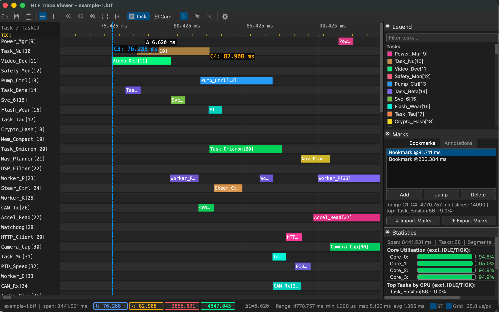

# BTF Trace Viewer

A PyQt5-based interactive visualiser for FreeRTOS context-switch traces in **Best Trace Format** (`.btf`).

## Screenshot



## Features

- **Two view modes** — Task View (one row/column per task) and Core View (one row/column per core, expandable)
- **Expand / Collapse all cores** — single-click toolbar button in Core View
- **Per-core expand / collapse** — click any core label to expand or collapse just that core
- **16-colour core palette** — up to 16 distinct core colours; cycles automatically beyond that
- **Horizontal and Vertical orientation** — switch at any time; active mode is highlighted in the toolbar
- **Smooth zoom & pan** — mouse wheel, two-finger pinch (macOS), and keyboard shortcuts
- **Default zoom 2 timescale units/px** — the **1:1** toolbar button resets to 2 timescale units per pixel (for `ns` timescale, the UI shows `2 ns/px`; configurable in Settings)
- **Viewport culling** — only visible rows/columns and segments are rendered; no slowdown on large traces
- **2–8 measurement cursors** — 4 by default; delta times shown on the timeline and in the status bar; maximum configurable in Settings
- **Task highlight** — hover or click any task label or Legend row to highlight all its segments
- **Dockable Legend panel** — colour swatches for every task, with a search box and the same highlight interaction
- **Dockable Statistics panel** — per-core CPU utilisation and per-task CPU time breakdown
- **STI event markers** — software trace items rendered as coloured diamond markers
- **Dark / Light theme** — switch from **View → Switch to Light/Dark Theme** or **Settings → Appearance**
- **Export to PNG / clipboard** — save the current viewport as a PNG file or copy it to the clipboard
- **Persistent settings** — all preferences stored in `btf_viewer.rc` alongside the script
- **Drag-and-drop** — drop a `.btf` file directly onto the window
- **Optimised for large traces** — tested with up to **128 cores, 1 024 tasks, and 5 M+ events**

## Requirements

- Python 3.8+
- PyQt5 >= 5.15

```bash
pip install PyQt5
```

## Usage

```bash
python btf_viewer.py [trace.btf]
```

A file can also be opened via **File → Open** (`Ctrl+O`) or dragged onto the window.

---

## View Modes

| Mode | Description |
|------|-------------|
| **Task View** | One row (horizontal) or column (vertical) per task across all cores; core tint applied to segment bars |
| **Core View** | One expandable row/column per CPU core; bars coloured by running task |

In **Core View**:

- Click a core label to **expand** or **collapse** that individual core's per-task sub-rows/columns.
- Use the **⊞ Expand All** / **⊟ Collapse All** toolbar button to expand or collapse every core at once.
- Works in both **Horizontal** and **Vertical** orientations.

## Orientation

- **Horizontal** (default) — time runs left to right; task/core labels are on the left
- **Vertical** — time runs top to bottom; task/core labels are at the top

Switch orientation using the **↔ Horizontal** / **↕ Vertical** toolbar buttons or **View → Horizontal layout / Vertical layout**. The active orientation button is highlighted.

In **Vertical** mode:
- The ruler column (left edge) is frozen and always shows time labels as you scroll horizontally.
- The label row (top edge) is frozen and always shows task/core names as you scroll vertically.
- The top-left corner area shows the **TICK** band label when TICK events are present.
- Drag the resize handle (the horizontal border between the label row and the timeline) to resize the label area.

## Task Labels

Regular task labels show the task name and task ID, for example `MyTask[3]`.
IDLE and TICK tasks show their bare name (`IDLE`, `IDLE0`, `IDLE1`, etc.) without an ID suffix.
IDLE tasks always render in grey; each IDLE task on a different core gets a distinct shade.

---

## Task Highlight

Hovering or clicking a task name in the label column or Legend panel highlights all timeline segments for that task.

| Action | Effect |
|--------|--------|
| Hover over a task label or Legend row | Transiently highlights that task's segments |
| Hover leave | Removes the transient highlight and restores any persistent highlight |
| Click a task label or Legend row | Locks the highlight on that task persistently |
| Click the same locked task again | Cancels the persistent highlight |
| Click empty area in the label column | Cancels the persistent highlight |
| Click empty area in the Legend panel | Cancels the persistent highlight |

When a task is persistently highlighted, its row gets a colour tint, its label turns gold and bold,
and its segment bars show a white border. Hovering another task while a lock is active shows both
highlights at the same time.

---

## Cursors

Between 2 and 8 cursors can be placed on the timeline (default: 4; adjustable in **Settings → Layout → Max cursors**). Delta times between consecutive cursors are shown on the timeline and in the status bar.

### Placing and Moving

| Action | Effect |
|--------|--------|
| Left-click on the timeline area | Place a new cursor at that time position |
| Drag a cursor line | Move it to a new time position |
| `C` (keyboard) | Place a cursor at the viewport centre |

### Removing

| Action | Effect |
|--------|--------|
| Right-click on the timeline area | Remove the nearest cursor |
| `Shift+C` | Clear all cursors |
| Drag a status-bar cursor badge out of the status bar | Remove that specific cursor |

### Navigating

| Action | Effect |
|--------|--------|
| Click a `C1` / `C2` / ... badge in the status bar | Scroll the view to that cursor |

---

## Legend Panel

The Legend lists every task with its colour swatch and `Name[id]` label.

- The panel is a dockable window; it can be detached, closed, and re-opened via its **✕** button.
- Toggle visibility from **Settings → Display → Legend panel** (`Ctrl+,`).
- A **Search** box at the top filters the displayed task list.
- Hover and click Legend rows to highlight tasks using the same rules as the label column.

---

## Zoom and Pan

| Action | Effect |
|--------|--------|
| `Ctrl` + Scroll wheel | Zoom in or out centred on the pointer |
| Two-finger pinch (macOS) | Zoom in or out |
| Scroll wheel / trackpad swipe | Pan along the time axis |
| `Ctrl+0` | Fit entire trace to window |
| **1:1** toolbar button | Reset to default zoom (2 timescale units/pixel; for `ns` timescale, UI shows `2 ns/px`; configurable in Settings) |
| Toolbar zoom+ / zoom− buttons | Zoom in or out by 2× |

---

## Export

**File → Save as Image (PNG)** (`Ctrl+S`) saves the current viewport as a PNG file.

**File → Copy Image to Clipboard** (`Ctrl+Shift+C`) copies the current viewport to the system clipboard. On Linux, `xclip`, `xsel`, or `wl-copy` is used when available (Qt clipboard is unreliable for images on X11/Wayland).

---

## Settings

Open **Settings** from the toolbar (**⚙ Settings**) or via **View → ⚙ Settings…** (`Ctrl+,`). Preferences are saved immediately to `btf_viewer.rc` in the viewer directory and restored on the next launch.

### Appearance

| Setting | Description |
|---------|-------------|
| Theme | **Dark** (default) or **Light** |
| Timeline labels | Font size for task/core labels drawn on the timeline (pt) |
| UI / menus | Font size for menus, toolbar, and status bar (pt) |

### Display

| Setting | Description |
|---------|-------------|
| Legend panel | Show or hide the dockable Legend panel |
| Statistics panel | Show or hide the dockable Statistics panel |
| STI events | Show or hide software-trace item marker rows |
| Grid lines | Overlay vertical grid lines on the timeline |
| Highlight on label hover | Dim all other segments when hovering a task label (disable for better performance on large traces) |

### Layout

| Setting | Description |
|---------|-------------|
| Label column | Width of the frozen task/core label column (60–600 px) |
| Row height | Height of each task/core row (12–60 px) |
| Row gap | Vertical gap between rows (0–20 px) |
| 1:1 zoom level | Target zoom of the **1:1** button and the maximum zoom-in limit (0.5–200 timescale units/px; UI unit follows trace timescale, e.g. `ns/px`) |
| Max cursors | Maximum number of simultaneously visible cursors (4–8) |

---

## Statistics Panel

The **Statistics** dock appears at the bottom of the window. Toggle it from **Settings → Display → Statistics panel**.

It shows:

- **Trace span** — total time range covered by the trace
- **Core utilisation** — percentage of active (non-IDLE, non-TICK) CPU time per core
- **Top tasks by CPU** — ranked list of worker tasks by total CPU time consumed

---

## Keyboard Shortcuts

| Key | Action |
|-----|--------|
| `Ctrl+O` | Open `.btf` file |
| `Ctrl+S` | Save viewport as PNG |
| `Ctrl+Shift+C` | Copy viewport to clipboard |
| `Ctrl++` | Zoom in |
| `Ctrl+-` | Zoom out |
| `Ctrl+0` | Fit to window |
| `Ctrl+,` | Open Settings |
| `C` | Place cursor at viewport centre |
| `Shift+C` | Clear all cursors |
| `Ctrl+Q` | Quit |

---

## Other

- Hover over any segment bar or STI marker for a detailed tooltip.
- Toggle STI events, grid lines, and hover highlight from **Settings** (`Ctrl+,`).
- Drag and drop a `.btf` file onto the window to open it.

---

## Generating Synthetic Traces — `gen_trace.py`

`gen_trace.py` generates a synthetic FreeRTOS-style BTF trace file for testing or demo purposes.
Task names are drawn from a realistic embedded-system pool (`CAN_Rx`, `Motor_L`, `PID_Speed`, …).
The scheduler simulation includes task priorities, IDLE time, TICK ISRs, and optional STI events.
A fast inline **xorshift32 PRNG** is used internally for high-throughput event generation
(≈ 0.22 s for 100 000 events on typical hardware).

### Quick start

```bash
# defaults: 8 cores, 100 tasks, 1 M events  →  freertos_8c_100t_1m_events.btf
python3 gen_trace.py

# 4 cores, 50 tasks, 500 K events
python3 gen_trace.py -c 4 -t 50 -e 500000 -o my_trace.btf

# 16 cores, 200 tasks, 2 M events, 500 Hz tick, reproducible seed
python3 gen_trace.py -c 16 -t 200 -e 2000000 --tick-hz 500 --seed 7

# Disable STI events; pin every task to one core
python3 gen_trace.py --no-sti --no-migration
```

### Options

| Option | Default | Description |
|---|---|---|
| `-c` / `--cores` | `8` | Number of CPU cores |
| `-t` / `--tasks` | `100` | Number of worker tasks |
| `-e` / `--events` | `1 000 000` | Target non-comment event lines |
| `-o` / `--output` | auto | Output `.btf` file path |
| `--tick-hz` | `1000` | RTOS tick frequency in Hz (1000 → 1 ms per tick) |
| `--freq-hz` | `200 000 000` | CPU clock frequency in Hz (written to BTF header) |
| `--sti-interval-us` | `30 000` | Approximate µs between STI tag events |
| `--idle-prob` | `0.20` | Probability [0–1] that a core picks its IDLE task |
| `--max-burst-ticks` | `5` | Maximum ticks a task runs before being preempted |
| `--seed` | `42` | Random seed for reproducibility |
| `--no-sti` | off | Suppress all STI software-trace events |
| `--no-migration` | off | Pin each task to one core (disable migration) |

When `--output` is omitted the file is named automatically, e.g. `freertos_8c_100t_1m_events.btf`.

---

## BTF Format

### Line structure

Every non-comment line is a comma-separated record with 7 or 8 fields:

```
timestamp, source, src_inst, event_type, target, tgt_inst, event[, note]
```

| Field | Index | Type | Description |
|-------|-------|------|-------------|
| `timestamp` | 0 | integer | Absolute time in the unit declared by `#timeScale` |
| `source` | 1 | string | Entity that emits the event (core name or task label) |
| `src_inst` | 2 | integer | Source instance — always `0` in this implementation |
| `event_type` | 3 | string | `T`, `STI`, or `C` (see below) |
| `target` | 4 | string | Entity that receives the event (task label or STI channel) |
| `tgt_inst` | 5 | integer | Target instance — always `0` in this implementation |
| `event` | 6 | string | Event verb (`resume`, `preempt`, `trigger`, `set_frequency`, …) |
| `note` | 7 | string | Optional annotation (`task_create`, tick counter, mutex name, …). May be an empty string; a trailing comma is still present in that case. |

---

### Header comments

The file begins with `#`-prefixed metadata lines. The parser extracts key–value pairs of the form `#key value`:

```
#version 2.2.0
#creator synthetic_trace_gen
#creationDate 2024-01-01T00:00:00Z
#timeScale us
```

The value of `#timeScale` (`ns`, `us`, `ms`, …) determines the unit for every timestamp in the file.

---

### Core naming — `Core_N`

Cores are identified by the string `Core_` followed by a zero-based decimal integer:

```
Core_0  Core_1  Core_2  …  Core_N
```

`Core_0` is always the first core. The parser recognises a token as a core entity when it starts with `Core_`.

---

### Task label naming — `[core_id/task_id]task_name`

Regular (worker) tasks carry a structured prefix that encodes the core they were created on and their unique task ID:

```
[core_id/task_id]task_name
```

| Part | Example | Description |
|------|---------|-------------|
| `core_id` | `0` | Zero-based index of the core that created this task |
| `task_id` | `9` | Unique integer task identifier assigned at task creation |
| `task_name` | `CAN_Rx` | Human-readable task name |

> **Note:** In traces generated by `gen_trace.py`, worker task IDs start at 9 and the timer-service task ID equals `num_workers + 9`. Task IDs in real FreeRTOS ports depend on the kernel's internal handle allocation.

**Examples:**

```
[0/9]CAN_Rx          # task CAN_Rx, created on Core_0, task ID 9
[2/17]Motor_L        # task Motor_L, created on Core_2, task ID 17
[0/42]Tmr Svc        # FreeRTOS timer-service task
```

The viewer displays these as `CAN_Rx[9]` and `Motor_L[17]` (task ID in brackets, core prefix hidden).

In **Task View** the viewer merges all instances of the same `task_id`/`task_name` pair across cores into one row, so a task that migrates between cores still appears as a single row.

#### Special tasks — no prefix

IDLE and TICK tasks use a **bare name** with no `[core_id/task_id]` prefix:

| Entity | Name pattern | Example | Notes |
|--------|-------------|---------|-------|
| IDLE task | `IDLE` + core index | `IDLE0`, `IDLE1`, … | One per core, numbered from 0 |
| Generic IDLE | `IDLE` | `IDLE` | Single-core systems |
| Tick ISR | `TICK` | `TICK` | System tick interrupt |

IDLE tasks are always rendered in grey; each one gets a distinct shade.
TICK tasks are rendered without a `[id]` suffix in labels.

---

### event_type field

| `event_type` | Description |
|---|---|
| `T` | Task context-switch event (task is resumed or preempted) |
| `STI` | Software Trace Item — application-level instrumentation marker |
| `C` | Core-level event (e.g. clock frequency change) |

---

### T events — task context switches

Each context switch produces two lines — one `preempt` and one `resume` — at the same timestamp.
The **source** field rules are:

| Switch type | `preempt` source | `resume` source |
|---|---|---|
| Timer-interrupt preemption | `Core_N` (the core that fired the interrupt) | Old task label (the task just preempted) |
| Voluntary yield (e.g. `vTaskDelay`) | Old task label | Old task label |

The **target** is always the task label being directly affected: the task being stopped (`preempt`) or the task being started (`resume`).

| `event` verb | Meaning |
|---|---|
| `resume` | Task begins executing on a core |
| `preempt` | Task stops executing (preempted or blocked) |

**Examples:**

```
# Timer interrupt preempts [0/9]CAN_Rx and resumes [0/12]Motor_L on Core_0
1000500, Core_0, 0, T, [0/9]CAN_Rx,  0, preempt,
1000500, [0/9]CAN_Rx, 0, T, [0/12]Motor_L, 0, resume,

# Task yields voluntarily (e.g. vTaskDelay)
2001000, [0/12]Motor_L, 0, T, [0/12]Motor_L, 0, preempt,
2001000, [0/12]Motor_L, 0, T, IDLE0, 0, resume,

# Task creation notification
  405, Core_0, 0, T, IDLE0, 0, preempt, task_create
  420, Core_0, 0, T, [0/9]CAN_Rx, 0, preempt, task_create

# TICK ISR fires (bare task name)
1000000, TICK, 0, T, TICK, 0, resume, tick_0
1000001, TICK, 0, T, TICK, 0, preempt,
```

---

### STI events — software trace items

Source is the **core** (`Core_N`) that recorded the event. Target is the **STI channel name** (a free-form string that names the instrumentation point). The `event` verb is always `trigger`. The optional `note` field carries additional detail.

```
timestamp, Core_N, 0, STI, channel_name, 0, trigger[, note]
```

**Examples:**

```
3050000, Core_0, 0, STI, Mutex_Lock,    0, trigger, Mutex_Lock
3120000, Core_1, 0, STI, Queue_Send,    0, trigger, Queue_Send
3200000, Core_2, 0, STI, ISR_Enter,     0, trigger, ISR_Enter
3210000, Core_2, 0, STI, ISR_Exit,      0, trigger, ISR_Exit
```

Common STI channel names generated by `gen_trace.py`:

`ISR_Enter`, `ISR_Exit`, `Sem_Post`, `Sem_Wait`, `Mutex_Lock`, `Mutex_Unlock`,
`Queue_Send`, `Queue_Recv`, `Buf_Full`, `Buf_Empty`, `DMA_Done`, `DMA_Error`,
`Overrun`, `Underrun`, `Checkpoint`, `Assert_OK`

The viewer renders each distinct STI channel as a separate coloured row of diamond markers. Well-known notes (`take_mutex`, `give_mutex`, `create_mutex`, `trigger`) have fixed colours; others are assigned automatically from a palette.

---

### C events — core events

Source and target are both the **core name**. Used for core-level notifications such as clock-frequency changes at startup.

```
timestamp, Core_N, 0, C, Core_N, 0, set_frequency, freq_hz
```

**Example:**

```
405, Core_0, 0, C, Core_0, 0, set_frequency, 200000000
410, Core_1, 0, C, Core_1, 0, set_frequency, 200000000
```

---

### Complete annotated example

```
#version 2.2.0
#creator synthetic_trace_gen
#creationDate 2024-01-01T00:00:00Z
#timeScale us

# ── Startup: set clock frequency on every core ──────────────────────────────
405,  Core_0, 0, C,   Core_0,          0, set_frequency, 200000000
410,  Core_1, 0, C,   Core_1,          0, set_frequency, 200000000

# ── Create IDLE tasks ────────────────────────────────────────────────────────
415,  Core_0, 0, T,   IDLE0,           0, preempt, task_create
430,  Core_1, 0, T,   IDLE1,           0, preempt, task_create

# ── IDLE tasks start running ─────────────────────────────────────────────────
480,  IDLE0,  0, T,   IDLE0,           0, resume,
490,  IDLE1,  0, T,   IDLE1,           0, resume,

# ── Create worker tasks (on Core_0) ──────────────────────────────────────────
510,  Core_0, 0, T,   [0/9]CAN_Rx,    0, preempt, task_create
528,  Core_0, 0, T,   [0/10]Motor_L,  0, preempt, task_create

# ── Normal context switches ───────────────────────────────────────────────────
1000000, TICK,            0, T, TICK,            0, resume,  tick_0
1000001, TICK,            0, T, TICK,            0, preempt,
1001500, Core_0,          0, T, IDLE0,           0, preempt,
1001500, [0/9]CAN_Rx,     0, T, [0/9]CAN_Rx,    0, resume,
1003000, [0/9]CAN_Rx,     0, T, [0/9]CAN_Rx,    0, preempt,
1003000, [0/9]CAN_Rx,     0, T, [0/10]Motor_L,  0, resume,

# ── STI software instrumentation ─────────────────────────────────────────────
1050000, Core_0, 0, STI, Mutex_Lock,   0, trigger, Mutex_Lock
1120000, Core_1, 0, STI, Queue_Send,   0, trigger, Queue_Send
```
