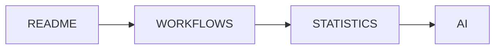
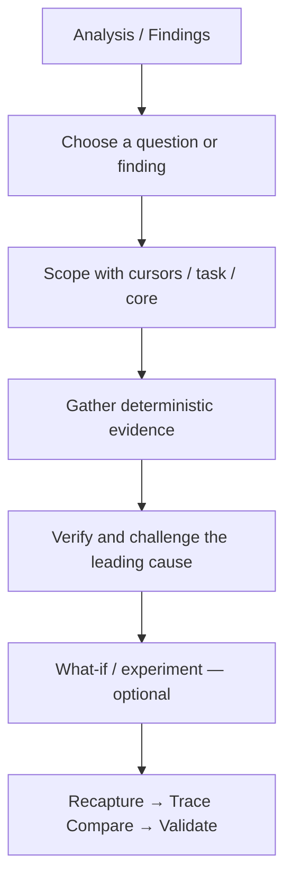

<a id="btf-trace-viewer" name="btf-trace-viewer">&#x200B;</a>
# BTF Trace Viewer 

**Version 1.4.0** — Desktop (Python) and Web


**BTFViewer** is an **AI-assistant tool for RTOS trace analysis**: find evidence in a captured schedule, then explain it. Open FreeRTOS context-switch traces in **Best Trace Format** (`.btf`), inspect the timeline, measure with cursors, review statistics, and ask the **AI** tab to cite findings and walk the cause.


[Try the live demo](https://apps.kuoping.com/btf_viewer.html?demo)

Heading level:  section ·  subsection ·  topic ·  detail


---

<a id="features" name="features">&#x200B;</a>

---

## Features 

- **Timeline visualisation** — task and core views, horizontal or vertical layout, smooth zoom and pan
- **Multi-trace sessions** — open several traces in tabs; compare builds side by side
- **Measurement tools** — cursors, bookmarks, annotations, find & jump
- **Statistics & analysis** — utilisation, latency, migrations, sync/mutex metrics, and severity-tagged Analysis Findings
- **AI Assistant** — find evidence and explain Analysis Findings (import `examples/ai` presets; local or cloud)
- **Export** — annotated snapshots (PNG/SVG), CSV/HTML reports, Perfetto traces
- **Desktop CLI** — headless reports and images for scripts and CI
- **Desktop and Web** — the same analysis workflow in a desktop app or the browser
- **Scripted demo** — 8-core walkthrough with narration ([Demo](#demo))

Metric definitions and formulas are in [Statistics](STATISTICS.md). Step-by-step diagnosis playbooks: **[WORKFLOWS.md](WORKFLOWS.md)**.

---

<a id="contents" name="contents">&#x200B;</a>

---

## Contents 

### Documentation map

| Document | Primary question | Responsibility |
|---|---|---|
| `README.md` | **How do I use BTFViewer?** | Product overview: AI assistant for RTOS traces, installation, timeline, analysis, export |
| `WORKFLOWS.md` | **How do I diagnose a problem?** | Step-by-step analysis and investigation playbooks |
| `STATISTICS.md` | **What does this measurement mean?** | Deterministic BTF metrics, distributions, scope, comparison, interpretation |
| `AI.md` | **How does AI-assisted investigation work?** | AI architecture, models, tools, privacy, CLI, evaluation, implementation |

**Recommended path:**


```mermaid
flowchart LR
  readme[README] --> workflows[WORKFLOWS]
  workflows --> statistics[STATISTICS]
  statistics --> ai[AI]
```

Use **README** for the product (find evidence and explain), **WORKFLOWS** when you have a symptom to investigate, **STATISTICS** when you need metric-level detail, and **AI** when you need AI configuration or implementation details.


| Section | |
|---------|--|
| [Quick start](#quick-start) | Install and open a trace |
| [Demo](#demo) | Scripted tour, voice packs, recording |
| [Using the viewer](#using-the-viewer) | Toolbar, navigate, measure, and mark |
| [Analysis](#analysis) | Findings, BTF analysis pages, Trace Compare |
| [AI Assistant](#ai-assistant) | Investigation, evidence, workflows, privacy |
| [Statistics](STATISTICS.md) | Metric meaning, formulas, charts, how to diagnose |
| [Export](#export) | Snapshots, reports, Perfetto, CLI |
| [Settings](#settings) | Preferences and defaults |
| [Keyboard & mouse](#keyboard--mouse) | Shortcuts reference |
| [Further reading](#further-reading) | Workflows, AI details, developer notes |

---

<a id="quick-start" name="quick-start">&#x200B;</a>

---

## Quick start 

<a id="desktop" name="desktop">&#x200B;</a>
### Desktop 

**Requirements:** Python 3.8+ ([PySide6](https://pypi.org/project/PySide6/) ≥ 6.4). Python 3.9+ is recommended.

```bash
cd BTFViewer
pip install -r requirements.txt
python builds/btf_viewer.py [trace.btf]
```

With no file argument, the previous session is restored. You can also use **File → Open**, drag-and-drop, or **File → Open Recent** (Desktop).

<a id="web" name="web">&#x200B;</a>
### Web 

Open the standalone build in any modern browser (no server required for typical use):

```bash
open BTFViewer/builds/btf_viewer.html   # or double-click the file
```

Or use the [hosted demo](https://apps.kuoping.com/btf_viewer.html). Toolbar **Demo**, opening a demo `.xml`, and **Record** are in [Demo](#demo). To rebuild from source:

```bash
cd BTFViewer && make web    # → builds/btf_viewer.html
```

**AI:** After a trace is open, import [`examples/ai/presets.json`](examples/ai/presets.json) in **Settings → AI** for ready-made Ollama / OpenAI / Gemini / DeepSeek / Grok endpoints. See [AI Assistant](#ai-assistant) (user guide) and **[AI.md](AI.md)** (setup, tools, troubleshooting).

<a id="supported-files" name="supported-files">&#x200B;</a>
### Supported files 

| Format | Notes |
|--------|--------|
| `.btf` | Best Trace Format |
| `.btf.gz` / `.gz`, `.btf.bz2` / `.bz2` | Compressed single traces |
| `.btf.zip` / `.zip` | One or more `.btf` members — each opens in its own tab. Desktop keeps `archive.zip::member.btf` paths (re-read on launch). Web titles multi-member zips `archive.zip::member` so two archives cannot collide. |
| `.xml` **(W)** | Demo pack script — see [Demo](#demo). |
| `.xtf` | Shareable demo tour pack (zip of xml + btf + voice/) — Open or drag to play. |

Sample traces are under `tracedata/` (for example `example-2cores.btf.gz`).

---

<a id="demo" name="demo">&#x200B;</a>

---

## Demo 

Scripted tour of the 8-core sample. Desktop (`make demo`) and Web (toolbar **Demo**, or **Open** the pack) share [`demos/demo_8cores/`](demos/demo_8cores/). [Try the live demo](https://apps.kuoping.com/btf_viewer.html?demo). XML actions and the demo HTTP API: **[demos/README.md](demos/README.md)**.

<a id="desktop-demo" name="desktop-demo">&#x200B;</a>
### Desktop recording 

`make demo` launches `builds/btf_viewer.py` with the frozen pack and drives the UI through the demo API (rebuilds the bundle if `btf_viewer_pkg/` is newer).

```bash
cd BTFViewer
make demo
make demo DEMO_LANG=zh-tw
python3 scripts/demo_runner.py demos/demo_8cores/demo_8cores.xml --launch --interactive
```

Narration defaults to the XML `<languages default>` (**English**). Override with `--lang`, `DEMO_LANG`, or `BTFVIEWER_DEMO_LANG`. Recording session settings go in `builds/btf_viewer.rc`. Move the mouse to a screen corner to abort (PyAutoGUI failsafe); Ctrl-C twice exits the runner.

Engine: [`scripts/demo_runner.py`](scripts/demo_runner.py).

<a id="web-demo-pack" name="web-demo-pack">&#x200B;</a>
### Web pack and recording 

Toolbar **Demo** loads the bundled sample without a file picker. **Open** a demo `.xml`, a shareable `.xtf` pack, or drop the pack folder to run the same script as desktop `make demo`. After picking the XML alone, **Open pack folder** opens a folder dialog (Select/Open is enabled on a directory). The dialog may start in Documents on macOS; navigate to the pack folder. Dropping the pack folder or a `.xtf` onto the viewer skips this step. The viewer then loads the pack’s `.btf.gz`, plays `voice/<lang>/*.mp3`, and drives view mode, Load, Statistics sections, highlights, cursors, and Analysis through in-app APIs. `<move>` / `<sweep>` animate a pointer overlay to the XML `<targets>` (the browser cannot move the OS cursor; hover events still fire so timeline tooltips appear). Opening a `.btf` still loads the trace as usual.

Build a shareable pack (choose voice packs with ``--voice`` / ``DEMO_LANGS``):

```bash
make demo-pack                          # → builds/demo_8cores.xtf (en only)
make demo-pack DEMO_LANGS=en,zh-tw      # English + 中文
make demo-pack DEMO_LANGS=all           # every voice/<lang>/
python3 scripts/demo_pack.py demos/demo_8cores --list-voices
python3 scripts/demo_pack.py demos/demo_8cores --voice en,zh-tw -o builds/demo_8cores.xtf
```

An `.xtf` is a zip of `*.xml` (languages filtered; audio paths → `.aac`), `*.btf*`, and `voice/<lang>/` (MP3 transcoded to AAC 24 kHz mono 32 kb/s via ffmpeg). Open or drag it in Web to play the tour; Desktop Open/drop loads the pack’s BTF; `demo_runner.py path/to/demo.xtf --launch` runs the desktop tour. Use `--keep-mp3` / `make demo-pack` with a custom pack command to skip AAC conversion.

**Record** uses the browser’s display capture; choose this tab and include tab audio. The mouse pointer is included (page overlay for tab capture; native pointer for window/screen). Tab capture does not include the OS pointer, so Record paints one in the page.

The demo bar’s **previous / pause / next** icons skip or hold the current section (pause also holds narration; the icon switches to play to resume). **Space** pauses and resumes. **Esc** twice (within 2.5 s) stops the script.

<a id="demo-voice" name="demo-voice">&#x200B;</a>
### Voice packs 

Every language uses the same layout. XML paths stay `voice/01_title.mp3`; the runner looks in `voice/<lang>/` first, then flat `voice/`, then `voice/<default>/`.

```
text/<lang>/01_title.txt
voice/<lang>/01_title.mp3
voice/<lang>/voice.json
```

Shipped languages for `demo_8cores`: **en** (English, default), **zh-tw** (中文). On Web, a **Voice** menu on the demo bar restarts the current section in that language (remembered in the browser; otherwise the browser locale). Desktop uses the XML default unless you pass a language flag as above.

```bash
python3 scripts/demo_voice.py status demos/demo_8cores
make demo-voice
```

Install, export, render, and `sync-xml`: [`scripts/demo_voice.py`](scripts/demo_voice.py) and **[demos/README.md](demos/README.md)**. Write **Free-RTOS** (with a hyphen) in narration scripts so speech engines pronounce it correctly.

<a id="demo-pack-layout" name="demo-pack-layout">&#x200B;</a>
### Pack layout 

| Path | Purpose |
|------|---------|
| [`demos/demo_8cores/demo_8cores.xml`](demos/demo_8cores/demo_8cores.xml) | Runner script (steps / actions) |
| [`demos/demo_8cores/demo_8cores.btf.gz`](demos/demo_8cores/demo_8cores.btf.gz) | Frozen trace (stable vs `tracedata/`) |
| [`demos/demo_8cores/text/<lang>/`](demos/demo_8cores/text/en/) | Narration scripts (`.txt`) |
| [`demos/demo_8cores/voice/<lang>/`](demos/demo_8cores/voice/en/) | TTS audio + `voice.json` |

---

<a id="using-the-viewer" name="using-the-viewer">&#x200B;</a>

---

## Using the viewer 

Desktop and Web share the same concepts. Where behaviour differs, it is noted below.

<a id="toolbar" name="toolbar">&#x200B;</a>
### Toolbar 

Hover any control for its name. Icons that need a loaded trace (snapshot, SVG, Perfetto, crop, Heatmap, Analysis) stay disabled until a `.btf` is open. **Compare** needs two or more tabs.


Left to right (Desktop; Web is the same cluster except as noted):

| Icon / control | Meaning |
|----------------|---------|
| Folder | **Open** a BTF trace (`Ctrl+O`). Web also opens a demo `.xml` pack. |
| Camera | **Snapshot** editor — annotated PNG of the viewport (`Ctrl+S`) |
| Download | **Save SVG** of the current viewport (`Ctrl+Shift+S`) |
| Window / trace | **Perfetto** — export Chrome Trace JSON (`Ctrl+Shift+E`) |
| Crop square | **Save BTF** — write the cursor window C1–Cn as `.btf` / `.btf.gz` |
| Horizontal bars | **Horizontal** layout — time runs left → right |
| Vertical bars | **Vertical** layout — time runs top → bottom |
| Magnifier + | **Zoom in** (`Ctrl++`) |
| Magnifier − | **Zoom out** (`Ctrl+-`) |
| Magnifier reset | **1:1** — configured zoom density |
| Corners | **Fit** the whole trace (`Ctrl+0`) |
| Range arrows | **Zoom to cursor range** between earliest and latest cursor (`Ctrl+R`; needs 2+ cursors) |
| Magnifier | **Find** (`Ctrl+F`) |
| **Fit** combo | **Zoom preset** — 1% … 75% of the trace, or Fit |
| **Task** | **Task View** — one row per task (merged across cores) |
| **Core** | **Core View** — one expandable row per CPU |
| Expand arrows | **Expand / collapse all cores** (Core View only) |
| **Load** | Show / hide the **CPU load** chart under the timeline |
| Grid | **Heatmap** — Migration & Corridor Inspector (multi-core traces) |
| **Analysis** | **Analysis Findings** — heuristic triage for the current Statistics scope |
| Overlap squares | **Compare** — Trace Compare between two open tabs |
| **Log₂** | STI waveform y-axis linear ↔ log₂ (when an STI row is expanded) |
| Sun / moon | **Theme** — switch light / dark |
| Gear | **Settings** (`Ctrl+,`) — far right |
| Question mark | **Help** — keyboard shortcuts |

Web adds **Demo** (bundled 8-core tour), **Record** (tab capture), and an **About** control; a **More** overflow holds the same actions when the window is narrow. **All tasks** appears on the toolbar only while a heatmap task filter is active.

<a id="view-modes-and-orientation" name="view-modes-and-orientation">&#x200B;</a>
### View modes and orientation 

| Control | Purpose |
|---------|---------|
| **Task View** | One row (or column) per task |
| **Core View** | One expandable row per core; expand a core or use Expand / Collapse All |
| **Horizontal / Vertical** | Time left→right or top→bottom |

Switch from the toolbar (both apps) or the **View** menu (Desktop). The last orientation is remembered. On Web, `1` / `2` switch Task / Core View and `H` / `V` switch orientation.

<a id="zoom-and-pan" name="zoom-and-pan">&#x200B;</a>
### Zoom and pan 

- **Wheel** — pan (add **Ctrl** to zoom; **Shift** swaps axes)
- **Pinch** (macOS) — zoom
- **Middle-drag** — select a time range to zoom
- **Fit** (`Ctrl+0` / `F`) — show the full trace
- **Zoom preset** — toolbar menu: **1%**, **2%**, **5%**, **10%**, **25%**, **50%**, **75%**, **Fit** (same as Desktop; percent of the full trace that is visible)
- **1:1** — reset to the configured zoom density
- **Zoom to cursor range** (`Ctrl+R`) — fit between the earliest and latest placed cursor (2+ cursors)

<a id="labels-legend-and-highlight" name="labels-legend-and-highlight">&#x200B;</a>
### Labels, legend, and highlight 

- Drag the label-column edge to resize; double-click the edge to auto-fit.
- The **Legend** lists tasks with colours and filters (including migrated tasks).
- Click or hover a task label or legend row to highlight that task on the timeline.
- Hover a segment for duration, core, and neighbouring activity.

<a id="cpu-load" name="cpu-load">&#x200B;</a>
### CPU Load 

Toggle **Load** on the toolbar for a utilisation chart under the timeline. Drag the divider to resize. With two or more cursors, the chart can show a cursor-range average.

With a task **lock-highlighted**, Task View shows that task’s utilisation **per core** in the load strip — useful when investigating migrations (see [Highlight a migrating task](#highlight-a-migrating-task-on-the-timeline)).

<a id="cursors" name="cursors">&#x200B;</a>
### Cursors 

Place up to **4–8** cursors (default 4; set in Settings).

| Action | How |
|--------|-----|
| Place | Click the timeline, or press `C` at the viewport centre |
| Move | Drag the cursor line |
| Remove | Click near a cursor, or use the context menu |
| Clear all | `Shift+C` or **Shift+right-click** |
| Snap to boundary | **Shift+click** |

With **two or more** cursors, the status bar shows a short range summary, and Statistics can limit metrics to that window (**Limit to C1–Cn**). Toolbar crop / **File → Save selection as BTF…** exports the cursor window: both apps prefer the original BTF text (desktop re-reads the file / zip member; web uses in-memory `sourceText`), and **reconstruct** a resume/preempt + STI subset if that source is missing (e.g. web after refresh).

<a id="marks-and-find" name="marks-and-find">&#x200B;</a>
### Marks and find 

| Tool | Purpose |
|------|---------|
| **Bookmarks** | Named timestamps (`Ctrl+B`) |
| **Annotations** | Free-text notes at a time (`Ctrl+Shift+B` / `A`) |
| **Find** | Search tasks, migrations, STI events, intervals, and more (`Ctrl+F`; `F3` / `Shift+F3` to step) |

**Find modes** (match count is shown at the top of the panel; each mode has a short description under the dropdown):

| Mode | Matches |
|------|---------|
| **Contains** | Substring on task names and annotation notes |
| **Exact** | Whole-string task merge key / name |
| **Regex** | Case-insensitive regex on tasks and annotations |
| **Migrations** | Migration boundaries by task or core (`Core_0`, `CS[22]`, …) |
| **STI** | STI channel, event, note, and core |
| **Intervals** | Interval start/stop spans and interval STI notes |
| **Lifecycle** | Task create / delete / suspend / resume STI |
| **Pointers** | Mutex / semaphore / queue `0x…` pointers and sync notes |

Right-click the timeline for cursor, bookmark, and annotation actions. Marks and cursors are restored with the session. Clicking a Statistics chart point adds an annotation **without switching right-panel tabs**.

<a id="multi-tab-traces" name="multi-tab-traces">&#x200B;</a>
### Multi-tab traces 

Open several files (or a multi-BTF zip) as tabs. Each tab keeps its own zoom, cursors, marks, and filters. Cycle with `Ctrl+Tab` / `Ctrl+Shift+Tab`; close with `Ctrl+W`. Desktop restores tabs from disk (including zip members). Web restores up to **8** packed traces from IndexedDB by tab name (private mode / quota may skip tabs; clearing site data drops them).

<a id="tag-and-sti-markers" name="tag-and-sti-markers">&#x200B;</a>
### Tag and STI markers 

Software-trace items appear as markers (and optional tag channels). Toggle STI rows with `I` or Settings. Expand tag channels for waveforms where available.

---

<a id="analysis" name="analysis">&#x200B;</a>

---

## Analysis 

Start with toolbar **Analysis** for a severity-tagged triage of the current Statistics scope, then open the named Statistics sections. Those pages are **deterministic BTF analysis** (facts first). The **AI** tab explains and navigates them — it does not replace them. For AI-assisted investigation, see [AI Assistant](#ai-assistant). Playbooks: **[WORKFLOWS.md](WORKFLOWS.md)**.

<a id="btf-analysis-pages" name="btf-analysis-pages">&#x200B;</a>
### BTF analysis pages 

Viewer analysis stays on **BTF → statistics → visualization → comparison**. There is no source/ELF inspection, scheduler simulation, or invented kernel response time (BTF has no release/completion pair). **Apply cursors** on a finding recommends a window; it does not apply until you click.

| Page | What to use it for |
|------|--------------------|
| [Timeline Anomalies](#timeline-anomalies) | Unusual regions (spikes, bursts, idle, deadline misses) without relying only on Findings. **Investigate…** opens the AI template. |
| [Worst Events](#worst-events) | Top-N outliers; click a row to jump. Response p99 sits next to execution Max. |
| [Response Time](#response-time) | Min / mean / median / P90–P99.9 / max / σ / jitter. Click P99 like Execution. |
| [Period / Jitter](#period--jitter) | Activation gaps, sparkline, missed / extra / burst / long-gap counts. |
| [Unified Jitter](#unified-jitter) | Execution, period, dispatch (STI), and wake (block-wait) CVs. |
| [Distribution Explorer](#distribution-explorer) | Histogram for one metric × task. |
| [Task × Core](#task--core) / [Core Utilization Over Time](#core-utilization-over-time) | Hot vs idle cores, load imbalance, saturation windows. |
| [Preemption Matrix](#preemption-matrix) / Chain / Story | Who preempted whom, duration, recurring chains. |
| [Mutex Blocking](#mutex-blocking) / [Waiter × Owner](#waiter--owner) | Wait totals, top blockers, owner handoff. |
| [Critical Path](#critical-path) | Execution / preemption / mutex / migration / Other; click a component. |
| [Task Health](#task-health) | Heuristic 0–100 score (not an AI probability). |
| [Recurring Patterns](#recurring-patterns) | Repeat incidents in one trace; Compare lists patterns shared across traces. |
| [Trace Compare](#trace-compare) | A vs B including Response P99, mutex, deadline misses, and a deterministic **Why?**. |

<a id="analysis-findings" name="analysis-findings">&#x200B;</a>
### Analysis Findings 

Toolbar **Analysis** summarises likely issues for the current scope (load imbalance, WCET/CPU hotspots, blocking, priority inversion, core thrashing, deadline breaches, tick health, sync/mutex bounces, and similar). On traces with **two or more cores** and positive total utilisation, a **Core utilisation balance** finding always includes **Load Balance Score …% (σ=…%, G=…)** — Desktop and Web match, including when cores look **reasonably balanced** (Score ≥ 85% and σ ≤ 30%). Finding ink follows dark/light theme (info is not forced to dark-on-dark). The dialog opens with an **overview**: trace-quality warnings, related findings grouped as incident clusters (`[I1]`, `[I2]`, …), and a suggested phase window. Finding times are drawn as dashed overlays on the timeline. From the dialog, left to right: **Query with AI…** walks the findings card, **Investigate…** runs an evidence-driven drill-down (tools + cursors), **Verify with AI…** checks the selected finding, **Explain…** / **Root cause…** go deeper, **Auto investigate…** runs the full tool chain, **Save recipe…** stores a user investigation template, **Story…** exports the overview plus findings, **Apply cursors** places C1–C2 on a recommended window for the selected finding, or **Save as Text…** for a copy. The same card appears in **Export HTML**. **Ctrl+K** jumps to Analysis, workspace presets (Triage / Latency / SMP / Compare), Inspect task, and other surfaces without extra toolbar buttons. The status bar inspector shows the pinned task and the first trace-quality warning.

**How to act on a finding**

1. Note the severity and the Statistics section it names.
2. Open that section, sort by Max / Rate / Bounce as relevant.
3. Click **Min** / **Max** / **p95** / **p99**, a chart point, or an inspector cell to jump the timeline. Or click **Apply cursors** on the selected finding.
4. Place cursors around the phase of interest and enable **Limit to C1–Cn**.
5. Optionally click **Query with AI…** / **Investigate…** / **Verify with AI…** / **Explain…** / **Root cause…** / **Auto investigate…** (or open the **AI** tab) ([WORKFLOWS.md §7](WORKFLOWS.md#7-ai-assistant-flow)).

<a id="how-to-find-problems-quick-map" name="how-to-find-problems-quick-map">&#x200B;</a>
### How to find problems (quick map) 

| Symptom | Start here | Then check |
|---------|------------|------------|
| Unknown — triage first | Toolbar **Analysis** | Named Statistics sections |
| Tick jitter / tickless | Trace Health (TICK) | Scope a busy window; Execution Max |
| SMP uneven load | Core Utilisation (Score / σ) | Concurrent Core Active; Migrations |
| High scheduler cost | Kernel Switch Overhead | Core Time Breakdown (Gap %) |
| Task too slow on CPU | Execution Time (Max / p95) | Preemption Chain, Mutex |
| Task waits too long | Blocking Time | Preemption Chain, Mutex |
| Ready→run delay | Dispatch Latency | Blocking, Preemption (needs STI resume) |
| Priority inversion | Priority Inheritance | Mutex pairing, Blocking |
| Core thrashing | Core Migrations (Rate, Ping) | Heatmap / Chord; Mutex Bounces |
| Lock / queue issues | Mutex / Semaphore / Queue | Blocking, Migrations |
| Before/after change | Trace Compare | Same cursor phases on both tabs |

<a id="trace-compare" name="trace-compare">&#x200B;</a>
### Trace Compare 

With **two or more** tabs open, toolbar **Compare** (right after **Analysis**) diffs summary, top tasks, utilisation, migrations, execution, blocking, inter-arrival, preemption, sync, **Response P99**, and **mutex blocking**. The **Trends** page lists every open tab (3+) with span, migrations, load-balance, and tick health. The summary strip includes those latency/blocking deltas plus **deadline-miss** counts from **Settings → Display** task deadlines, a deterministic **Why?**, and shared recurring patterns. Optionally limit each side to its own cursor range. **Save as baseline** / **Score vs baseline** store and z-score Trace A metrics (same profile as `baseline_score`). Export CSV/HTML from the dialog, **Validate experiment…** to score expected vs actual deltas in the **AI** tab (`validate_experiment`; actual percents come from this compare, including **Scope to cursors**), or **Query with AI…** to walk the same tables (Trace Compare template). See also [Core migration analysis](#core-migration-analysis) below.

---

<a id="ai-assistant" name="ai-assistant">&#x200B;</a>

---

## AI Assistant 

BTFViewer is an **AI-assistant tool for RTOS trace analysis**. The **AI** tab **finds evidence** in Analysis Findings and Statistics and **explains** it. It does not replace the timeline or invent measurements from the raw `.btf`.

### Recommended workflow


```mermaid
flowchart TD
  findings[Analysis / Findings] --> question[Choose a question or finding]
  question --> scope[Scope with cursors / task / core]
  scope --> evidence[Gather deterministic evidence]
  evidence --> verify[Verify and challenge the leading cause]
  verify --> experiment[What-if / experiment — optional]
  experiment --> validate[Recapture → Trace Compare → Validate]
```

| Goal | Start here | Detailed guide |
|---|---|---|
| Triage a trace | **Analysis → Query with AI…** | [WORKFLOWS.md](WORKFLOWS.md) |
| Explain or verify a finding | Select a finding → **Explain… / Verify with AI…** | [AI.md](AI.md) |
| Investigate a time region | Place ≥2 cursors → **Explain this region with AI** | [WORKFLOWS.md](WORKFLOWS.md) |
| Compare before / after | **Trace Compare** → **Query with AI…** | [WORKFLOWS.md](WORKFLOWS.md) |
| Test a proposed change | **What-if / Optimize** → recapture → compare | [AI.md](AI.md) |
| Configure models / endpoints | **Settings → AI** | [AI.md](AI.md) |

**Important:** do not request mitigations before the timeline and Statistics agree with the finding. AI responses are constrained by available evidence and include validation / confidence information where applicable.

See **[AI.md](AI.md)** for models, endpoints, GUI tools, privacy, CLI, benchmark methodology, planner, causal engines, and implementation details. See **[WORKFLOWS.md](WORKFLOWS.md)** for repeatable analysis and investigation playbooks.

Same panel on **Desktop** and **Web**. Findings can include WCET **Max≫Avg** spikes. Optional experiments use `what_if` / `optimize_experiment` (**Heuristic slice-replay**, **not FreeRTOS kernel**; Ranked `optimize_experiment`).

<a id="ai-in-this-section" name="ai-in-this-section">&#x200B;</a>
<a id="what-can-ai-do" name="what-can-ai-do">&#x200B;</a>
<a id="common-workflows" name="common-workflows">&#x200B;</a>
<a id="investigation-case" name="investigation-case">&#x200B;</a>
<a id="investigation-planner" name="investigation-planner">&#x200B;</a>
<a id="evidence--confidence" name="evidence--confidence">&#x200B;</a>
<a id="ai-capabilities" name="ai-capabilities">&#x200B;</a>
<a id="ai-tools-reference" name="ai-tools-reference">&#x200B;</a>
<a id="ai-model-configuration" name="ai-model-configuration">&#x200B;</a>
<a id="ai-api-keys" name="ai-api-keys">&#x200B;</a>
<a id="ai-privacy" name="ai-privacy">&#x200B;</a>
<a id="ai-troubleshooting" name="ai-troubleshooting">&#x200B;</a>
<a id="ai-developer-cli" name="ai-developer-cli">&#x200B;</a>

Product entry points stay here; the system reference is **[AI.md](AI.md)**. The AI tab shows a Triage → Scope → Investigate → Verify → Experiment → Compare stepper (click a stage to jump in the log). **Start Investigation** (empty log) runs **Auto investigate**. Restart restores an in-progress case only when the log still has a user or assistant turn; otherwise **Start Investigation** stays available and a leftover **Current Issue** card is not restored. **Clear** removes chat replies, resets the usage meter, and clears current investigation issues. What-if stays on **Verify** until verify tools or strong evidence quality; Experiment is labeled as a heuristic estimate (recapture and Compare to measure). **Triage findings**, **Verify finding**, **Auto investigate**, and the **Investigation plan** checklist live in the same tab. **Cheapest evidence first** (planner). Keys: Settings → AI → API key first, then `OPENAI_API_KEY` / `GEMINI_API_KEY` / `OLLAMA_API_KEY` (`OPENAI_API_KEY`, then `GEMINI_API_KEY`, then `OLLAMA_API_KEY`). Local Ollama needs none. Web can inject the same names via `window.__BTF_AI_ENV__`. `CURSOR_API_KEY` is for live `ai-test` XML `<api-key env="VAR">` and is ignored for chat / Test connection. CLI: [AI.md → CLI regression gate](AI.md#cli-regression-gate).

## Statistics 

Statistics are the deterministic measurement layer of BTFViewer. Use them to quantify execution, blocking, jitter, scheduling, synchronization, migration, and comparison behavior.

For the complete metric definitions, formulas, distributions, scope rules, and interpretation guidance, see **[STATISTICS.md](STATISTICS.md)**.

### Quick map

| Symptom | Start here |
|---|---|
| Tick jitter / tickless | Trace Health (TICK) |
| SMP imbalance | Core Utilisation |
| Task too slow | Execution Time |
| Task waits too long | Blocking Time |
| Ready → running delay | Dispatch / Scheduling Latency |
| Priority inversion | Priority Inheritance |
| Core thrashing | Core Migrations |
| Lock / queue problems | Mutex / Semaphore / Queue |
| Before / after change | Trace Compare |

## Export 

| Action | Desktop | Web |
|--------|---------|-----|
| Annotated snapshot | Toolbar snapshot / **File → Snapshot Editor…** | Toolbar snapshot |
| Copy viewport | Clipboard | Clipboard |
| SVG | Toolbar / **File → Save SVG** | Toolbar Save SVG |
| Perfetto JSON | Toolbar / **File → Export Perfetto…** | Toolbar Perfetto |
| Cursor-range `.btf` | Toolbar crop / **File → Save selection as BTF…** (C1–Cn; `.btf` / `.btf.gz`; filter source, else reconstruct) | Toolbar crop (2+ cursors; `.btf` download; same filter / reconstruct) |
| Statistics CSV/HTML | Statistics panel | Statistics panel |
| Compare CSV/HTML | Trace Compare dialog | Trace Compare dialog |

<a id="headless-cli-desktop-only" name="headless-cli-desktop-only">&#x200B;</a>
### Headless CLI (Desktop only) 

Same engine as the GUI, suitable for CI. Use `QT_QPA_PLATFORM=offscreen` when no display is available.

| Command | Purpose |
|---------|---------|
| `info` | Trace summary (`--json` optional) |
| `report` | Full statistics CSV/HTML |
| `compare` | Two-trace diff (two paths or one multi-BTF zip) |
| `analyze` | CI regression gate vs baseline `.btf` or metrics JSON (`--fail-on-regression`; optional `--ai`; `--save-baseline`) — details in [AI.md](AI.md#cli-regression-gate) |
| `ai-test` | AI evidence/validator benchmark (`tests/ai`; `--config examples/ai/benchmark.xml` for live, `-o AI_BENCHMARK.md`) — [AI.md](AI.md#cli-regression-gate) |
| `migrations` | Migrations table as CSV |
| `snapshot` | PNG/SVG of timeline, migration inspector, or a metric plot |
| `perfetto` | Chrome Trace JSON |
| `slice` | Timestamp window as a smaller `.btf` |

```bash
python builds/btf_viewer.py info trace.btf
python builds/btf_viewer.py report trace.btf -o report.html --format html
python builds/btf_viewer.py compare before.btf after.btf -o diff.html
python builds/btf_viewer.py analyze candidate.btf --baseline baseline.btf --fail-on-regression
python builds/btf_viewer.py analyze candidate.btf --save-baseline /tmp/base.json
python builds/btf_viewer.py snapshot trace.btf -o view.png --view timeline
python builds/btf_viewer.py perfetto trace.btf -o trace.json
python builds/btf_viewer.py slice trace.btf -o window.btf --lo 100000 --hi 500000
```

Run `python builds/btf_viewer.py <command> -h` for full options.

---

<a id="settings" name="settings">&#x200B;</a>

---

## Settings 

Open **Settings** from the toolbar or `Ctrl+,`. Toolbar **Help** opens the keyboard shortcut list (Web: also `?`).

| Area | What you configure |
|------|--------------------|
| **Appearance** | Dark/light theme, fonts, colorblind-safe palette. Desktop font sizes are **pt** (HiDPI-scaled); web sizes are **CSS px**. Defaults look similar; the numbers are not interchangeable. |
| **Display** | Show/hide Legend, Statistics, Marks, Find, AI, CPU Load; **Timeline overlays** (STI, grid, hover highlight); **Analysis thresholds** (CPU budget % and per-task deadline ns) |
| **Layout** | Label width, row height, zoom 1:1 density, max cursors, time decimals, CPU/STI sizes |
| **AI** | Enable, **Auto-apply GUI actions**, **Anonymize task names for cloud**, **Treat this trace as sensitive**, **Log MCP messages to file** (Desktop debug; off by default), preset (Ollama / OpenAI / Gemini / Custom), base URL, model, authentication (none / API key / Sign in), **Allow self-signed TLS**, reply language |

| | Desktop | Web |
|--|---------|-----|
| Storage | `btf_viewer.rc` next to the viewer | Browser `localStorage` |
| Apply | Live preview while the dialog is open; **OK** persists; **Cancel** reverts | Same (**OK** persists; **Cancel** reverts) |

Sessions also restore open tabs, viewport, cursors, and marks. Desktop re-opens filesystem paths (including `archive.zip::member.btf`). Web restores tab names plus IndexedDB packed traces (max 8). **Reset to Defaults** restores compiled defaults (theme, layout, AI form, and Statistics pins / order / expand-collapse) immediately in the viewer; **OK** writes them to storage, **Cancel** undoes the preview.

---

<a id="keyboard--mouse" name="keyboard--mouse">&#x200B;</a>

---

## Keyboard & mouse 

Shortcuts marked **(W)** are Web-only. Others work on Desktop and Web. On Web, press `?` for an on-screen cheat sheet.

<a id="file--tabs" name="file--tabs">&#x200B;</a>
### File & tabs 

| Key | Action |
|-----|--------|
| `Ctrl+O` | Open file (new tab) |
| `Ctrl+W` | Close tab |
| `Ctrl+Tab` / `Ctrl+Shift+Tab` | Next / previous tab |
| `Ctrl+Q` | Quit (Desktop) |
| `?` **(W)** | On-screen shortcut cheat sheet |

<a id="view--zoom" name="view--zoom">&#x200B;</a>
### View & zoom 

| Key | Action |
|-----|--------|
| `Ctrl++` / `Ctrl+-` | Zoom in / out |
| `+` / `-` **(W)** | Zoom in / out (no modifier) |
| `Ctrl+0` / `F` | Fit to window |
| `Ctrl+R` | Zoom to cursor range (earliest–latest cursor) |
| `Ctrl+,` | Settings |
| `Ctrl+K` | Command palette (Analysis, Statistics, AI, Compare, workspace presets, Inspect task, …) |
| `G` / `I` / `D` | Grid / STI / theme |
| `1` / `2` **(W)** | Task View / Core View |
| `H` / `V` **(W)** | Horizontal / vertical layout |
| `Ctrl+G` | Jump to time |
| `Ctrl+Home` / `Ctrl+End` | Trace start / end |

<a id="edit--marks" name="edit--marks">&#x200B;</a>
### Edit & marks 

| Key | Action |
|-----|--------|
| `Ctrl+Z` / `Ctrl+Y` | Undo / redo |
| `C` / `Shift+C` | Place / clear cursors |
| `B` / `M` / `Ctrl+B` | Bookmark |
| `Shift+B` | Clear all bookmarks |
| `A` / `Ctrl+Shift+B` | Annotation |
| `Shift+A` | Clear all annotations |
| `Tab` / `Shift+Tab` | Next / previous segment |
| `←` `→` `↑` `↓` | Pan (Shift+arrow: prev/next boundary) |
| `Ctrl+F` / `F3` / `Shift+F3` | Find / next / previous |

<a id="export-1" name="export-1">&#x200B;</a>
### Export 

| Key | Action |
|-----|--------|
| `Ctrl+S` / `S` **(W)** | Snapshot editor |
| `Ctrl+Shift+C` | Copy viewport |
| `Ctrl+Shift+S` | Save SVG |
| `Ctrl+Shift+E` | Export Perfetto |

<a id="mouse" name="mouse">&#x200B;</a>
### Mouse 

| Action | Effect |
|--------|--------|
| Wheel / Ctrl+wheel | Pan / zoom |
| Left-drag background | Pan |
| Middle-drag | Zoom to selection |
| Ctrl+left-drag | Measure time between two points (double-arrow ruler + Δtime; release Ctrl or button to hide) |
| Click timeline | Place cursor |
| Drag cursor or mark | Move |
| Right-click | Context menu |

---

<a id="further-reading" name="further-reading">&#x200B;</a>

---

## Further reading 

| Document | Audience |
|----------|----------|
| **[WORKFLOWS.md](WORKFLOWS.md)** | Analysis playbooks and AI ask order |
| **[AI.md](AI.md)** | AI architecture, tools, models, planner, troubleshooting, CLI |
| **[STATISTICS.md](STATISTICS.md)** | Detailed metric definitions, formulas, charts, and analysis reference |
| **[btf-viewer-slides.md](btf-viewer-slides.md)** | Presentation overview |
| **[demos/README.md](demos/README.md)** | Demo XML actions, HTTP API, voice-pack tooling |

<a id="developer-notes" name="developer-notes">&#x200B;</a>
### Developer notes 

Day-to-day users can ignore this section.

| Task | Command |
|------|---------|
| Rebuild Desktop + Web | `make -C BTFViewer` |
| Desktop package only | `make -C BTFViewer bundle` → `builds/btf_viewer.py` |
| Web only | `make -C BTFViewer web` → `builds/btf_viewer.html` |
| Guided demo | `make -C BTFViewer demo` — see [Demo](#demo) |
| Tests | `make -C BTFViewer test` (desktop) / `test-web` / `test-all` / `ai-test` |
| Docs PDF | `make -C BTFViewer doc` → `builds/{README,AI,WORKFLOWS,btf-viewer-slides}.pdf` |
| Dev run (Desktop) | `python -m btf_viewer_pkg [trace.btf]` from `BTFViewer/` |

Edit sources under `btf_viewer_pkg/` and `web/`; commit regenerated files under `builds/` with your changes. Keep AI tool schemas and mermaid layout in sync (`ai_tools.py` / `ai_mermaid.py` ↔ `web/src/utils/aiTools.js` / `aiMermaid.js`; `mermaid_palette(is_dark)` ↔ `mermaidPalette(dark)`). Parser and Statistics numbers are pinned by shared goldens (`tests/fixtures/*-golden.json`) asserted from both `tests/test_parser_golden.py` / `tests/test_stats_web_parity.py` and `web/tests/`. Synthetic traces: `scripts/gen_trace.py --help`. BTF field reference: [`TRACE_FORMAT.md`](../TRACE_FORMAT.md). Live suite XML: [AI.md → Benchmark / evaluation suite](AI.md#benchmark-suite). Recorded scores: [`AI_BENCHMARK.md`](AI_BENCHMARK.md).

---

<a id="contributors" name="contributors">&#x200B;</a>

---

## Contributors 

Thanks to everyone who has contributed to this project.

| Contributor | Contribution |
|-------------|--------------|
| **[DiogoRoseira](https://github.com/DiogoRoseira)** | CPU Load Graph and metrics distribution charts |
---

## Documentation navigation

| Document | Question answered |
|---|---|
| [README.md](README.md) | How do I use BTFViewer? |
| [WORKFLOWS.md](WORKFLOWS.md) | How do I diagnose a problem? |
| [STATISTICS.md](STATISTICS.md) | What does this measurement mean? |
| [AI.md](AI.md) | How does AI-assisted investigation work? |

