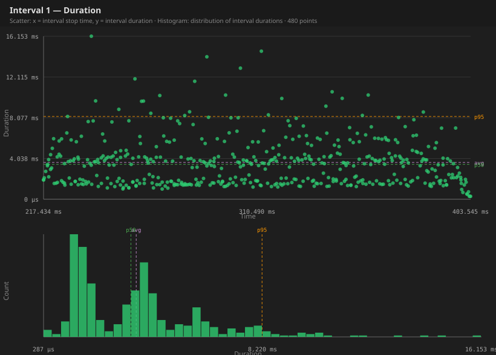
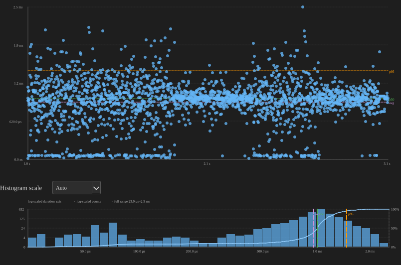
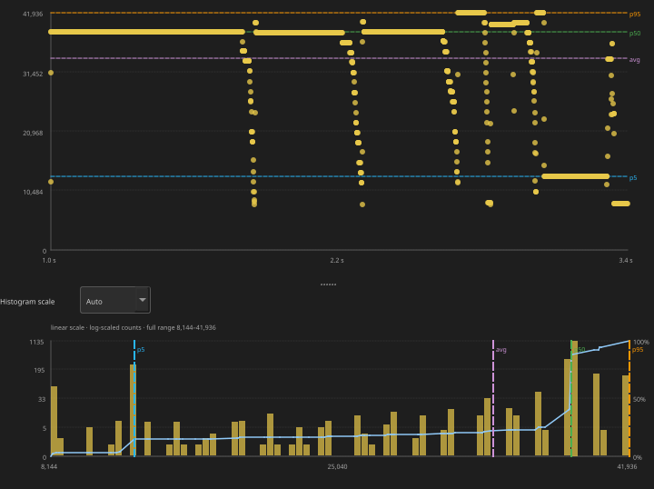
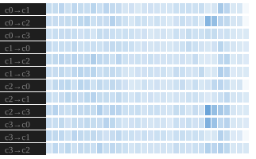
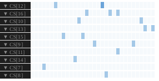

# BTF Trace Viewer

Current version: **1.3.2** (Desktop Python app + Web app)

A PySide6-based interactive visualiser for FreeRTOS context-switch traces in **Best Trace Format** (`.btf`).

## Screenshot


[DEMO](https://apps.kuoping.com/btf_viewer.html?demo)

## Features

- **Two view modes** — Task View (one row/column per task) and Core View (one row/column per core, expandable)
- **Expand / Collapse all cores** — single-click toolbar button in Core View
- **Per-core expand / collapse** — click any core label to expand or collapse just that core
- **16-colour core palette** — up to 16 distinct core colours; cycles automatically beyond that
- **Deterministic colour mapping** — task and STI colours are assigned in a stable, repeatable sequence across runs
- **Horizontal and Vertical orientation** — switch at any time; active mode is highlighted in the toolbar; last used orientation is remembered across launches
- **Smooth zoom & pan** — mouse wheel, two-finger pinch (macOS), and keyboard shortcuts
- **Default zoom 2 timescale units/px** — the **1:1** toolbar button resets to 2 timescale units per pixel (for `ns` timescale, the UI shows `2 ns/px`; configurable in Settings)
- **Zoom to cursor range** — `Ctrl+R` or the **⊡ Range** toolbar button fits the viewport exactly between cursor C1 (left/top edge) and the last cursor (right/bottom edge)
- **Viewport culling** — only visible rows/columns and segments are rendered; no slowdown on large traces
- **Multi-tab traces** — open several `.btf` files at once (Desktop: closable tabs; Web: tab bar under the toolbar). Both restore open tabs, active tab, and per-tab zoom/cursors/marks/filters on launch (Desktop: `btf_viewer.rc`; Web: `localStorage` + IndexedDB trace cache)
- **Measurement cursors** — Desktop and Web support 2–8 cursors (default: 4); configurable in Settings
- **Trace compare** — with 2+ tabs open, **Trace Compare…** in the Statistics panel diffs **Summary**, **Top Tasks**, **Core Migrations**, **Blocking**, **Preemption**, and **Sync** side-by-side (Desktop + Web). Optional **Limit to each tab's cursor range** compares metrics within C1–Cn when 2+ cursors are placed on each trace
- **Core migration analysis** — detect tasks that run on multiple cores; **Core Migrations** stats table (ping-pong, STI correlation, gap-after vs other gaps), **Core-Pair Migration Summary** (per directed pair: count, bounces, avg gap), **Core Time Breakdown** (active/idle/tick/gap per core), **clickable migration heatmap** (pair×time for ≤ 16 cores; core×core matrix → outgoing pairs for larger traces → per-task sub-bins → timeline drill-down), **Migrated tasks only** legend filter, toolbar **All tasks** reset, **bounce-only filter** (Show: Bounce Only toggle restricts the heatmap to lock-bounce migrations), and Find **Migrations** mode (Desktop + Web)
- **Core Affinity** — when traces include `traceTASK_CORE_AFFINITY_SET` events, the **Core Affinity** statistics table shows each task's declared affinity mask, observed execution cores, and flags violations (cores outside the mask) in red (Desktop + Web)
- **Cursor-scoped statistics** — with 2+ cursors, the Statistics panel can limit all metrics (CPU%, execution slices, blocking time, inter-arrival, **preemption chain**, **priority inheritance**, **mutex / semaphore pairing**, **queue pairing**, **deadline violations**, scheduling summary, exports, and charts) to the window from C1 through the last cursor; toggle **Limit to cursor range (C1–Cn)** (Desktop + Web)
- **Cursor range summary** — with 2+ cursors, the status bar shows a quick min/max/avg segment summary (Desktop + Web); full per-task metrics remain in the **Statistics** panel
- **Task highlight** — hover or click any task label or Legend row to highlight all its segments; optional **Highlight segments on label hover** in Settings dims other tasks while hovering (off by default)
- **Dockable Legend panel** — colour swatches for every task, with a search box, **Migrated tasks only** filter, a **heatmap filter banner** (when drilled from the heatmap), and the same highlight interaction
- **Right-side panel** — **Statistics**, **Marks**, and **Find** tabs (Desktop: docked on the right, stacked below Legend; Web: tab bar on the right). Statistics holds metric tables; Marks holds cursors, bookmarks/annotations, and (on Web) Legend; Find searches tasks, annotations, migrations, STI events, interval spans, task lifecycle events, and object pointers
- **Tag View** — inspect tag channels/events (`tag_event`, `tag0_event` … `tag7_event`) alongside task/core activity
- **Metrics tables** — Execution Time Per Slice, **Blocking Time** (same metric as Tracealyzer **Response Time**: off-CPU gap / scheduling latency between activations), **Inter-Arrival**, **Preemption Chain** (which tasks preempted whom), **Priority Inheritance**, **Mutex / Semaphore pairing** (with **Core Bounce** column flagging holds that crossed core boundaries), **Queue pairing** (`send`/`recv` by queue pointer), **Interval Analysis** (paired `interval_start` / `interval_stop` spans; when the BTF note includes `tid:{task_id}`, pairing is per interval id **and** task), **Tag Analysis** (per-channel min/avg/max/p95 for `tag0_event`…`tag7_event` samples), **Task Lifecycle** (per-task create/delete/suspend/resume event summary), **Core-Pair Migration Summary**, **Core Time Breakdown**, **Core Affinity** (affinity mask vs. observed cores), and **Deadlines / CPU budget** (per-slice deadline violations and global CPU budget threshold); click **Min** / **Max** (dotted underline) to jump and add an annotation at the BCET / WCET slice or shortest / longest gap (Desktop + Web)
- **Metrics distribution charts** — click any row in Execution Time, Blocking Time, Inter-Arrival, Preemption Chain, **Priority Inheritance**, **Interval Analysis**, or **Tag Analysis** tables to open a scatter-plot + histogram popup; histograms use **adaptive scaling** (auto linear / p5–p95 / log duration, overflow buckets, optional log-scaled counts, CDF overlay); charts live-update when cursors move or cursor-range scope is toggled (Desktop + Web). On Desktop, each trace tab remembers its own open chart when you switch tabs
- **Segment tooltips** — hover any segment bar for duration, slice index on core, previous/next task on that core, and gap before the slice
- **CPU Load Graph** — bar chart below the timeline showing per-core CPU utilisation; row labels show the **visible-window average** and, with 2+ cursors, a cursor-range average (`· C:xx%`); toggle with the **Load** toolbar button; drag the divider between timeline and CPU load to resize (Desktop + Web)
- **Resizable panels** — drag dividers between timeline and CPU load, the right-side panel (Statistics / Marks / Find) and Legend dock (Desktop), the **label column** (task names), and metric table sections in Statistics (Desktop + Web); splitter, label width, and table heights persist in `btf_viewer.rc` (Desktop) or browser `localStorage` (Web)
- **STI event markers** — software trace items rendered as coloured diamond markers
- **Find & Jump** — search tasks, annotations, or migrations; **Find** tab in the right panel (same as web); toolbar button and `Ctrl+F`; `F3` / `Shift+F3` steps through matches
- **Bookmarks & Annotations** — mark important timestamps and attach free-text notes; persisted per trace file in `btf_viewer.rc`
- **Right-click context menu** — place/remove/clear cursors, add a bookmark, or add an annotation, all from a single right-click anywhere on the timeline
- **Recent files (Desktop)** — **File → Open Recent** lists the 8 most recently opened traces for one-click reopening
- **Dark / Light theme** — switch from **View → Switch to Light/Dark Theme** or **Settings → Appearance**
- **Export to PNG / SVG / clipboard** — capture the viewport in the **Snapshot Editor** (annotate with arrows, shapes, and text, then save or copy); direct clipboard copy also available from the menu
- **Headless image export (Desktop CLI)** — `snapshot` command renders the timeline, Migration Heatmap, or a statistics metric plot straight to PNG/SVG with no GUI, for scripting and CI (see [Headless CLI](#headless-cli-desktop-only))
- **Persistent settings** — all preferences stored in `btf_viewer.rc` alongside the script
- **Drag-and-drop** — drop a `.btf` file directly onto the window
- **Optimised for large traces** — tested with up to **128 cores, 1 024 tasks, and 5 M+ events** (desktop). Web viewer: flat segment storage, parse worker, precomputed CPU-load bins, WASM-accelerated bisect/LOD, and debounced stats worker for 100k+ segment traces

## Table of contents

| Section | Contents |
|---------|----------|
| [Installation](#installation) | Desktop (Python) and web (Node.js) setup |
| [Desktop viewer](#desktop-viewer) | GUI usage, headless CLI, view modes, cursors, export, settings |
| [Web viewer](#web-viewer) | Build, open traces, web-specific UI and performance |
| [Statistics & metrics](#statistics--metrics) | Panel overview, metric tables, migrations, trace compare, charts |
| [Find, marks & menus](#find--jump) | Search, bookmarks, annotations, context menu, recent files |
| [Session persistence](#session-persistence-btf_viewerrc) | `btf_viewer.rc` and browser `localStorage` |
| [Keyboard shortcuts](#keyboard-shortcuts) | Desktop and web key bindings |
| [Reference](#reference) | `scripts/gen_trace.py`, BTF format, implementation map |

---

## Installation

### Desktop viewer (`builds/btf_viewer.py`)

**Requirements:** Python 3.8+ and PySide6 ≥ 6.4.

```bash
# Install the only runtime dependency
pip install -r requirements.txt

# Run directly — no build step needed
python builds/btf_viewer.py [-h] [trace.btf]

# Headless CLI — see [Headless CLI (desktop only)](#headless-cli-desktop-only) in Desktop viewer
```

#### Developing the desktop viewer (source package)

The desktop app is maintained as a multi-module package and merged into the single-file `builds/btf_viewer.py` for release (same model as the web viewer’s committed `builds/btf_viewer.html`).

| Mode | Command |
|------|---------|
| **Release / users** | `python builds/btf_viewer.py [trace.btf]` — no build step |
| **Dev (fast iteration)** | From `BTFViewer/`: `python -m btf_viewer_pkg [trace.btf]` |
| **Regenerate release builds** | `make -C BTFViewer` → `builds/btf_viewer.html` + `builds/btf_viewer.py` |
| **Desktop only** | `make -C BTFViewer bundle` |
| **Web only** | `make -C BTFViewer web` |
| **CI parity check** | `make -C BTFViewer check-bundle` — fails if `builds/btf_viewer.py` drifts from `btf_viewer_pkg/` |

Edit sources under `BTFViewer/btf_viewer_pkg/` (not the generated `builds/btf_viewer.py`), then run `make -C BTFViewer` and commit the package plus both files in `builds/`.

| Makefile target | Action |
|-----------------|--------|
| `make` / `make all` | Web + desktop → `builds/btf_viewer.html` and `builds/btf_viewer.py` |
| `make web` | Web only → `builds/btf_viewer.html` |
| `make bundle` | Desktop only → `builds/btf_viewer.py`, `py_compile`, smoke `info` on `tracedata/example.btf` |
| `make test` | Desktop characterization tests (`unittest`, offscreen Qt) |
| `make check-bundle` | Same as `bundle`, then `git diff --exit-code builds/btf_viewer.py` |

#### HiDPI / DPI scaling (Desktop)

Qt 6 scales the desktop UI per monitor. Platform-specific tuning runs automatically at startup (`btf_viewer_pkg/platform.py` → `_configure_qt_startup()`).

| Platform | Behaviour |
|----------|-----------|
| **Windows (native)** | Uses Qt 6 per-monitor scaling. Stale `QT_FONT_DPI=96` (PyQt5 workaround) is cleared if set. |
| **macOS (Retina)** | Timeline/UI fonts use an ~11 px pixel baseline (`BTF_UI_FONT_PX`, default on macOS) so 8 pt settings match PyQt5 density on HiDPI. |
| **WSLg (Wayland)** | Reads Windows **AppliedDPI** (Control Panel → Display → Scale) via PowerShell and sets a **partial** `QT_WAYLAND_FORCE_DPI` nudge — not the full AppliedDPI, because WSLg already exposes matching `wl_output` scale and applying the full value doubles with native DPR (UI too large). Formula: `96 + (AppliedDPI − 96) / 4` (e.g. **120** at 200 %, **108** at 150 %). |

**Environment overrides** (set before launch):

| Variable | Purpose |
|----------|---------|
| `BTF_WSL_DPI=0` | Disable WSLg auto DPI nudge (use native WSLg / Qt scaling only). |
| `QT_WAYLAND_FORCE_DPI=N` | Force Qt Wayland logical DPI (e.g. `108`, `120`, `144`). Overrides WSL auto-tuning. |
| `BTF_UI_FONT_PX=N` | Pixel baseline for UI and timeline monospace fonts (macOS default **11**). Use on any platform when pt sizing looks wrong. |

Examples:

```bash
# WSLg — UI too small (try a larger nudge)
QT_WAYLAND_FORCE_DPI=144 python3 -m btf_viewer_pkg trace.btf

# WSLg — UI too large (disable auto-tuning or use a smaller nudge)
BTF_WSL_DPI=0 python3 -m btf_viewer_pkg trace.btf
QT_WAYLAND_FORCE_DPI=108 python3 -m btf_viewer_pkg trace.btf

# macOS / any platform — tweak font density without changing layout
BTF_UI_FONT_PX=13 python3 -m btf_viewer_pkg trace.btf
```

On WSLg, if scaling still does not match Windows, see [microsoft/wslg#1335](https://github.com/microsoft/wslg/issues/1335) for optional `.wslgconfig` compositor settings (`WESTON_RDP_HI_DPI_SCALING`, etc.).

---

### Web viewer (`web/`)

A browser-based port of the viewer built with **Vue 3 + Vite**.
It runs entirely in the browser — no server, no Python, and no backend required (use `make preview` or the hosted demo for best performance on large traces).

**Requirements:** [Node.js](https://nodejs.org/) 18+ and npm (build-time only).

#### Standalone single-file build (recommended)

Produces a single self-contained `builds/btf_viewer.html` that can be opened directly in any browser — no server needed:

```bash
cd BTFViewer/web
# Demo trace embedded in the build (required for Demo button and fresh builds):
ln -sf ../../tracedata/example.btf example.btf   # once, or copy the file
make          # installs deps and builds builds/btf_viewer.html
# or manually:
npm install
npm run build
```

Then open the build:

```bash
open BTFViewer/builds/btf_viewer.html   # macOS — double-click also works
```

The release artifact is `BTFViewer/builds/btf_viewer.html` (used by the hosted [demo](https://apps.kuoping.com/btf_viewer.html)).

Do not open `BTFViewer/web/index.html` directly via `file://`; it is the Vite source entry used by the dev server.

#### `file://` vs local HTTP

| Open method | Works? | Notes |
|-------------|--------|--------|
| Double-click `builds/btf_viewer.html` | Yes | Basic use; Chrome may block Web Workers on `file://`, so parsing falls back to the main thread (UI can freeze briefly on very large traces). Use **Open** to pick a `.btf` file. |
| `make preview` | **Recommended** | Serves the build over HTTP — Web Workers, WASM accel, and the stats worker all work as intended. |
| `make dev` | Dev | Hot reload at `http://localhost:5173`. |
| Hosted demo | **Recommended** | [apps.kuoping.com/btf_viewer.html](https://apps.kuoping.com/btf_viewer.html) |

For large traces (e.g. `tracedata/example-16cores.btf` — 16 cores, 100k+ segments), prefer **`make preview`** or the hosted demo rather than `file://`.

#### Development server (with hot reload)

```bash
cd BTFViewer/web
make dev      # or: npm run dev
# → http://localhost:5173
```

#### Makefile targets

| Target | Action |
|--------|--------|
| `make` / `make build` | Install deps + produce `builds/btf_viewer.html` |
| `make dev` | Start Vite dev server with hot reload |
| `make preview` | Serve the production build locally (recommended for large traces) |
| `make wasm` | Rebuild WASM timeline accelerator from `wasm/timeline_accel.wat` |
| `make clean` | Remove `builds/btf_viewer.html` and any stale `dist/` |
| `make dist-clean` | Same as `clean`, plus remove `node_modules/` |
| `make test` | Overlay draw smoke tests (`node --test tests/`) |

#### macOS — install Node.js via Homebrew

```bash
brew install node
```

#### Windows / Linux

Download the LTS installer from <https://nodejs.org/> or use your system package manager (`winget install OpenJS.NodeJS`, `apt install nodejs npm`, etc.).

---

## Desktop viewer

Interactive PySide6 GUI and optional **headless CLI** (same statistics engine as the Statistics panel).

| Topic | Section |
|-------|---------|
| Launch & CLI | [Usage](#usage) · [Headless CLI](#headless-cli-desktop-only) |
| HiDPI / DPI | [HiDPI / DPI scaling (Desktop)](#hidpi--dpi-scaling-desktop) |
| Timeline | [View modes](#view-modes) · [Orientation](#orientation) · [Zoom and pan](#zoom-and-pan) |
| Analysis UI | [Cursors](#cursors) · [Legend](#legend-panel) · [Export](#export) · [Settings](#settings) |

## Usage

```bash
python builds/btf_viewer.py [-h] [trace.btf]
```

Passing a file on the command line opens that trace in a tab immediately. With no argument, the viewer restores the previous session from `btf_viewer.rc`.

### Headless CLI (desktop only)

| Command | Description |
|---------|-------------|
| `info` | Trace summary on stdout (`--json` for machine-readable output) |
| `report` | Full statistics export (same as Statistics → Export CSV/HTML) |
| `compare` | Two-trace diff (same as Trace Compare → Export) |
| `migrations` | Core Migrations table as CSV |
| `snapshot` | Export a PNG/SVG image — timeline, Migration Heatmap, or a statistics metric plot — without opening the GUI |

```bash
python builds/btf_viewer.py info trace.btf [--json] [--lo T] [--hi T]

python builds/btf_viewer.py report trace.btf -o|--output PATH [--format html|csv|both] [--lo T] [--hi T]

python builds/btf_viewer.py compare a.btf b.btf -o|--output PATH [--format html|csv|both] \
  [--name-a LABEL] [--name-b LABEL] \
  [--lo T --hi T | --lo-a T --hi-a T --lo-b T --hi-b T]

python builds/btf_viewer.py migrations trace.btf [-o PATH] [--lo T] [--hi T]   # default: stdout

python builds/btf_viewer.py snapshot trace.btf -o|--output PATH --view timeline|heatmap|plot \
  [--format png|svg] [--task NAME] [--metric tick|exec|block|inter|priority|preempt] \
  [--preemptor NAME] [--lo T --hi T] [--width PX] [--height PX] [--theme dark|light]
```

The `snapshot` `--view`:

- `timeline` — the main task/core view (like **File → Save Image / Save SVG**); `--task` highlights and centers that task's row, `--lo`/`--hi` zoom to a time range first.
- `heatmap` — the Migration Heatmap (core-pair × time-bin grid); `--lo`/`--hi` scope the grid; `--task` is not supported (the heatmap is inherently cross-task).
- `plot` — a statistics metric scatter + histogram popup, selected with `--metric`: `tick` (trace-wide tick-interval distribution, no `--task`), `exec` / `block` / `inter` / `priority` (require `--task`), or `preempt` (requires `--task` **and** `--preemptor`).

`--width`/`--height` only apply to `--view timeline` and `--view plot` (the heatmap image size is derived from its data grid). `--task` accepts the display name (e.g. `Producer[1]`), the bare name without `[id]`, or the raw merge key, matched case-insensitively.

Files can also be opened via **File → Open** (`Ctrl+O`), **File → Close Tab** (`Ctrl+W`), **Ctrl+Tab** / **Ctrl+Shift+Tab** (cycle tabs), or drag-and-drop onto the window.

---

## View Modes

| Mode | Description |
|------|-------------|
| **Task View** | One row (horizontal) or column (vertical) per task across all cores; core tint applied to segment bars |
| **Core View** | One expandable row/column per CPU core; bars coloured by running task |

In **Core View**:

- Click a core label to **expand** or **collapse** that individual core's per-task sub-rows/columns.
- Use the **⊞ Expand All** / **⊟ Collapse All** toolbar button to expand or collapse every core at once.
- Works in both **Horizontal** and **Vertical** orientations.

## Orientation

- **Horizontal** (default) — time runs left to right; task/core labels are on the left
- **Vertical** — time runs top to bottom; task/core labels are at the top

Switch orientation using the **↔ Horizontal** / **↕ Vertical** toolbar buttons or **View → Horizontal layout / Vertical layout**. The active orientation button is highlighted.

In **Horizontal** mode (default), drag the visible splitter on the **right edge** of the task-name label column to resize it (60–600 px). Double-click that edge to auto-fit the widest visible label. Width is saved to `btf_viewer.rc` (`[view] label_width` + per-window profile) on Desktop, or `labelWidth` in `btf-viewer-settings-v1` on Web. In **Vertical** mode, double-click the bottom edge of the label row for the same auto-fit (Desktop + Web).

In **Vertical** mode:
- The ruler column (left edge) is frozen and always shows time labels as you scroll horizontally.
- The label row (top edge) is frozen and always shows task/core names as you scroll vertically.
- The top-left corner area shows the **TICK** band label when TICK events are present.
- Drag the bottom edge of the label row to resize label height (Desktop); persisted under the same `label_width` / `labelWidth` keys as horizontal mode.

## Task Labels

Regular task labels show the task name and task ID, for example `MyTask[3]` or `Worker[0x8]`. Raw BTF task entities may use `[core/id]name`, `name[id]`, or `name(0x…)` / `name(dec)` — see [Task label naming](#task-label-naming--core_idtask_idtask_name).
IDLE and TICK tasks show their bare name (`IDLE`, `IDLE0`, `IDLE1`, etc.) without an ID suffix.
IDLE tasks always render in grey; each IDLE task on a different core gets a distinct shade.

---

## Task Highlight

Hovering or clicking a task name in the label column or Legend panel highlights all timeline segments for that task.

| Action | Effect |
|--------|--------|
| Hover over a task label or Legend row | Transiently highlights that task's segments |
| Hover leave | Removes the transient highlight and restores any persistent highlight |
| Click a task label or Legend row | Locks the highlight on that task persistently |
| Click the same locked task again | Cancels the persistent highlight |
| Click empty area in the label column | Cancels the persistent highlight |
| Click empty area in the Legend panel | Cancels the persistent highlight |

When **Highlight segments on label hover** is enabled in Settings (off by default), hovering a label also **dims** segments of other tasks. Leave it off on very large traces for smoother scrolling.

When a task is persistently highlighted, its row gets a colour tint, its label turns gold and bold,
and its segment bars show a white border. Hovering another task while a lock is active shows both
highlights at the same time.

---

## Cursors

Between 2 and 8 cursors can be placed on the timeline (default: 4; adjustable in **Settings → Layout → Max cursors**). Delta times between consecutive cursors are shown on the timeline and in the status bar.

### Placing and Moving

| Action | Effect |
|--------|--------|
| Left-click on the timeline area | Place a cursor, or **remove** one if the click is near an existing cursor line |
| **Shift+left-click** | Snap the new cursor to the nearest segment boundary within 8 px (Desktop + Web) |
| Drag a cursor line | Move it to a new time position |
| `C` (keyboard) | Place a cursor at the viewport centre |

### Removing

| Action | Effect |
|--------|--------|
| Right-click → **Remove nearest cursor** | Remove the cursor closest to the click position |
| Right-click → **Clear all cursors** | Remove all cursors at once |
| `Shift+C` | Clear all cursors |
| Drag a status-bar cursor badge out of the status bar | Remove that specific cursor |

### Navigating

| Action | Effect |
|--------|--------|
| Click a `C1` / `C2` / ... badge in the status bar | Scroll the view to that cursor |
| `Ctrl+R` / **⊡ Range** toolbar button | Zoom view to fit exactly between C1 and the last cursor |

### Cursor range summary (status bar)

When two or more cursors are placed, the **status bar** shows a quick summary of segment durations for slices that start **and** end within the cursor range: **min**, **max**, and **avg**.

For full per-task/per-core metrics scoped to the cursor window, use the **Statistics** panel — see [Statistics & metrics](#statistics--metrics) and **Limit to cursor range (C1–Cn)**.

---

## Multi-tab traces (Desktop)

| Action | Effect |
|--------|--------|
| **File → Open** (`Ctrl+O`) | Open a trace in a **new tab** (or switch to it if already open) |
| **File → Close Tab** (`Ctrl+W`) | Close the active tab |
| **Ctrl+Tab** / **Ctrl+Shift+Tab** | Next / previous trace tab |
| Click a tab | Switch the timeline, legend, statistics, marks, and CPU load graph to that trace |
| **×** on a tab | Close that tab |

Each tab has its own cursors, zoom level, bookmarks, annotations, find state, and metrics chart session. Shared settings (theme, orientation, row height, etc.) apply to all tabs.

On exit, the viewer saves the list of open tab paths, the active tab index, and per-tab zoom/cursor layout to `btf_viewer.rc`. The next launch reopens the same tabs automatically (unless a file path on the command line overrides session restore).

---

## Legend Panel

The Legend lists every task with its colour swatch and `Name[id]` label.

- The panel is a dockable window; it can be detached, closed, and re-opened via its **✕** button.
- Toggle visibility from **Settings → Display → Legend panel** (`Ctrl+,`).
- A **Search** box at the top filters the displayed task list.
- **Migrated tasks only** (Web: checkbox in Legend on the Marks page; Desktop: same filter in the legend dock) hides tasks that ran on a single core only — useful with [core migration analysis](#core-migration-analysis).
- After a **heatmap drill-down**, a blue **Heatmap: … (N)** banner appears with a **Clear** button; it filters the legend list to match the timeline.
- Hover and click Legend rows to highlight tasks using the same rules as the label column.

---

## Zoom and Pan

Wheel and trackpad gestures depend on **orientation** (see [Orientation](#orientation)). `Shift` swaps the time-axis and row/column-axis mappings.

### Horizontal orientation (time left → right)

| Action | Effect |
|--------|--------|
| `Ctrl` + Scroll wheel | Zoom in or out centred on the pointer |
| Two-finger pinch (macOS) | Zoom in or out |
| Vertical trackpad swipe / vertical scroll wheel | Scroll task/core rows vertically |
| Horizontal trackpad swipe | Pan along the time axis |
| `Shift` + scroll wheel | Swap axes (vertical swipe pans time, horizontal swipe scrolls rows) |
| `Ctrl+0` | Fit entire trace to window |
| **1:1** toolbar button | Reset to default zoom (2 timescale units/pixel; for `ns` timescale, UI shows `2 ns/px`; configurable in Settings) |
| Toolbar zoom+ / zoom− buttons | Zoom in or out by 2× |

### Vertical orientation (time top → bottom)

| Action | Effect |
|--------|--------|
| `Ctrl` + Scroll wheel | Zoom in or out centred on the pointer |
| Two-finger pinch (macOS) | Zoom in or out |
| Vertical trackpad swipe / vertical scroll wheel | Pan along the time axis |
| Horizontal trackpad swipe | Scroll task/core columns horizontally |
| `Shift` + scroll wheel | Swap axes (vertical swipe scrolls columns, horizontal swipe pans time) |
| `Ctrl+0` | Fit entire trace to window |
| **1:1** toolbar button | Reset to default zoom (2 timescale units/pixel; for `ns` timescale, UI shows `2 ns/px`; configurable in Settings) |
| Toolbar zoom+ / zoom− buttons | Zoom in or out by 2× |

---

## Export

### Snapshot Editor (PNG)

**File → Save as Image (PNG)…** (`Ctrl+S`), the toolbar **Save PNG** / **Shot** buttons, and the plot-dialog **Export PNG** action all capture the current viewport and open the **Snapshot Editor** — they do **not** write a file immediately.

In the editor you can draw annotation shapes (arrow, double arrow, line, rectangle, circle, text) and then:

- Check **Dash** to draw dashed strokes (lines, arrows, rectangles, circles).
- Click a shape to select and drag it; **Ctrl+click** duplicates the shape (then drag to position the copy).
- **Double-click** any shape to add or edit its label inline (lines/arrows: centered, aligned to the segment; rectangles/circles: centered).
- Single-click with the **Text** tool adds a standalone text label inline.
- **Save PNG…** — write the annotated image to disk (includes CPU load graph when **Load** is on).
- **Copy to Clipboard** — copy the annotated image.

### Direct clipboard copy

**File → Copy Image to Clipboard** (`Ctrl+Shift+C`) copies the raw viewport (timeline + CPU load when visible) without opening the editor. On Linux, `xclip`, `xsel`, or `wl-copy` is used when available (Qt clipboard is unreliable for images on X11/Wayland).

### SVG

**File → Save as SVG…** (`Ctrl+Shift+S`) or the toolbar **Save SVG** button exports the current viewport as vector SVG (includes CPU load when visible).

---

## Settings

Open **Settings** from the toolbar (**⚙ Settings**) or via **View → ⚙ Settings…** (`Ctrl+,`).

| | Desktop | Web |
|--|---------|-----|
| **Storage** | `btf_viewer.rc` in the viewer directory | Browser `localStorage` key `btf-viewer-settings-v1` |
| **When saved** | Immediately on each change | Immediately on **Save** (or when closing with **Save**); **Cancel** reverts unsaved edits |
| **Live preview** | — | Changes apply to the open trace while the dialog is open; cancel restores the pre-open snapshot |

Preferences are restored on the next launch (desktop) or page reload (web).

### Appearance

| Setting | Description |
|---------|-------------|
| Theme | **Dark** (default) or **Light**; toggle with the `D` shortcut |
| Timeline labels | Font size for task/core labels drawn on the timeline (pt on Desktop, px on Web; default **8**) |
| UI / menus | Font size for menus, toolbar, and status bar (pt on Desktop, px on Web; default **8**) |
| Colorblind-safe palette | Switches the task colour palette to the **Okabe-Ito 8-colour** set, designed to be distinguishable under the most common types of colour-vision deficiency (deuteranopia, protanopia, tritanopia). Off by default. |

On Desktop, macOS Retina uses pixel-based font sizing by default; override with `BTF_UI_FONT_PX` (see [HiDPI / DPI scaling](#hidpi--dpi-scaling-desktop)).

### Display

| Setting | Description |
|---------|-------------|
| Legend panel | Show or hide the dockable Legend panel |
| Statistics panel | Show or hide the dockable Statistics panel |
| STI events | Show or hide software-trace item marker rows |
| Grid lines | Overlay vertical grid lines on the timeline (**on** by default) |
| Highlight on label hover | Dim all other segments when hovering a task label (**off** by default; enable for emphasis, disable for better performance on large traces) |

### Layout

| Setting | Description |
|---------|-------------|
| Label column | Width of the frozen task/core label column (60–600 px). Drag the timeline splitter (Desktop + Web) or set here; persisted in `btf_viewer.rc` / `btf-viewer-settings-v1` |
| Row height | Height of each task/core row (12–60 px; default **22**) |
| Row gap | Vertical gap between rows (0–20 px; default **4**) |
| 1:1 zoom level | Target zoom of the **1:1** button and the maximum zoom-in limit (0.5–200 timescale units/px; UI unit follows trace timescale, e.g. `ns/px`; default **2**) |
| Max cursors | Maximum number of simultaneously visible cursors (4–8; default **4**) |
| CPU load row height | Height of each CPU load graph row (16–120 px; default **30**) |
| STI row height | Collapsed STI channel row height (12–60 px; default **18**) |
| STI waveform height | Expanded tag-event waveform row height (40–300 px; default **80**) |
| STI waveform style | Y-axis scale for expanded tag waveform rows: **Linear** (default) or **Log₂**. Toggle with the **Log₂** toolbar button. |

### Analysis

Available under **Settings → Display → Analysis thresholds** on both Desktop and Web.

| Setting | Description |
|---------|-------------|
| CPU budget % | Global CPU budget threshold (0–100 %, step 0.1 %; **0 = off**). Any task whose CPU% in the current scope exceeds this value appears in the **CPU budget exceeded** violation table in the Statistics panel. |
| Task deadlines | Per-task deadline thresholds in nanoseconds; one entry per line in the form `TaskName=nanoseconds` (e.g. `Worker[0]=500000`). Task names must match the display name shown in the label column. Any execution slice longer than the configured threshold is listed in the **Slice over deadline** violation table. |

Changes take effect immediately when the Settings dialog is accepted. The **Deadlines / CPU budget** section of the Statistics panel shows a prompt to open Settings when no thresholds are configured.

### Default values (Desktop + Web)

These match the compiled defaults in `btf_viewer.py` (`USER CONFIGURATION`) and `web/src/utils/settingsStore.js` (`DEFAULT_SETTINGS`). Desktop stores font sizes in **pt**; the web viewer uses the same numeric values in **px**.

| Setting | Default |
|---------|---------|
| Theme | Dark |
| Timeline label font | 8 |
| UI / menus font | 8 |
| Show Legend / Statistics / Marks / STI / CPU load | On |
| Grid lines | **On** |
| Highlight segments on label hover | **Off** |
| Colorblind-safe palette | Off |
| Label column width | 160 px |
| Row height | 22 px |
| Row gap | 4 px |
| STI row height | 18 px |
| STI waveform height | 80 px |
| STI waveform style | Linear |
| 1:1 zoom level | 2 timescale units/px |
| Max cursors | 4 |
| CPU load row height | 30 px |

Existing saved settings (`btf_viewer.rc` or browser `localStorage`) are not overwritten when defaults change — use **Reset to defaults** in the Settings dialog (or clear `btf-viewer-settings-v1`) to pick up new defaults.

---

## Web viewer

Browser-based viewer (Vue 3 + Vite). Feature parity with the desktop app for timeline, statistics, and trace compare; rendering uses Web Workers, PixiJS, and optional WASM acceleration.

**No CLI** — scripted export uses desktop `btf_viewer.py` (`report`, `compare`, `migrations`, `snapshot`, …).

| Topic | Section |
|-------|---------|
| UI & files | [Opening a file](#opening-a-file) · [View modes](#view-modes-1) · [Multi-tab traces](#multi-tab-traces-web) |
| Layout | [Right panel](#right-panel--layout) · [CPU load](#cpu-load-graph) · [Session restore](#session-restore-web) |
| Performance | [Web performance architecture](#web-performance-architecture) |

### View modes

Same two modes as the desktop viewer:

| Mode | Description |
|------|-------------|
| **Task View** | One row per task, coloured by task identity |
| **Core View** | One row per CPU core; bars coloured by running task. Click the `▶` arrow in the label column to expand a core into per-task sub-rows |

Toggle with the **Task** / **Core** buttons in the toolbar.

### Opening a file

Click **Open** in the toolbar and select any `.btf` file.
Each file opens in a new **tab** in the bar below the toolbar; click a tab to switch traces, or **×** to close one.
Opening the same filename again focuses the existing tab.

**Parsing:** traces are parsed in a **Web Worker** when the page is served over HTTP (`make dev`, `make preview`, or the hosted demo). On `file://` URLs some browsers block workers, so parsing may run on the main thread instead. A progress overlay (`Reading…` / `Parsing…` / `Opening trace…`) is shown until the timeline is ready.

**Large traces:** the web viewer is optimised for high segment counts (flat segment storage, precomputed CPU-load bins, WASM-accelerated bisect/LOD, debounced stats worker). On first paint after load it briefly uses a coarse LOD (like pan/zoom) and upgrades to full quality within a few hundred milliseconds — this keeps the UI responsive on traces such as `tracedata/example-16cores.btf` (16 cores, 100k+ segments).

Sample traces in the repo: `tracedata/example.btf` (small), `tracedata/example-4cores.btf` (4-core SMP, good for statistics demos), and `tracedata/example-16cores.btf` (large SMP).

### Zoom & pan

Wheel and trackpad gestures depend on **orientation** (`↔ Horizontal` / `↕ Vertical` toolbar buttons). `Shift` swaps the time-axis and row/column-axis mappings. See [Zoom and Pan](#zoom-and-pan) for the full table (Desktop and Web use the same rules).

**Horizontal orientation (default):** vertical swipe scrolls rows; horizontal swipe pans time.

**Vertical orientation:** vertical swipe pans time; horizontal swipe scrolls columns.

| Action | Effect |
|--------|--------|
| `Ctrl` + scroll wheel | Zoom in / out centred on mouse pointer |
| Vertical trackpad swipe / vertical scroll wheel | Scroll rows (horizontal layout) or pan time (vertical layout) |
| Horizontal trackpad swipe | Pan time (horizontal layout) or scroll columns (vertical layout) |
| `Shift` + scroll wheel | Swap the two axes above |
| **+** / **−** toolbar buttons | Zoom in / out around viewport centre |
| **Fit** toolbar button | Fit the entire trace into the viewport |

### Cursors

Between **2 and 8** cursors can be placed (default: **4**; adjustable in **Settings → Layout → Max cursors**). Delta times between consecutive cursors are shown in the **Marks** tab (Web) or status bar (Desktop).

| Action | Effect |
|--------|--------|
| Left-click on timeline | Place a cursor |
| Left-click near an existing cursor | Remove it |
| **✕ Cursors** toolbar button | Clear all cursors |

### Task highlight

Hover any task label (left column) or **Legend** swatch to highlight all segments for that task. Click to lock the highlight; click again to release.

By default, hovering does **not** dim other tasks — enable **Settings → Display → Highlight segments on label hover** for that behaviour (better performance on large traces when left off).

### Grid lines & dark/light theme

**Grid lines** are **on** by default (vertical time guides). Toggle with the **grid** toolbar button or **Settings → Display → Grid lines**.

Toggle dark/light theme with the **moon** toolbar button or **Settings → Appearance**. The default theme is **dark**.

### CPU Load Graph

A bar chart below the timeline shows per-core (or total) CPU utilisation over the currently visible time window.

- **Toggle** — click the **Load** toolbar button to show or hide the graph.
- **View modes** — in **Task View** a single *CPU Load* row shows aggregate utilisation; in **Core View** each core gets its own row.
- **Row labels** — each row shows average load over the **currently visible** time window; with 2+ cursors placed, labels also show the average over the cursor range (`· C:xx%`), and the graph shades the C1–Cn window in blue.
- **Expand / Collapse** — in Core View click a core row header to collapse it to a compact bar.
- **Hover** — moving the pointer over the timeline projects a live cursor onto the load graph; each row shows a load % badge at the hover time (no timestamp on the graph).
- **Resize** — drag the horizontal bar between the timeline and CPU load panel to change the CPU load height.
- **Cursors, bookmarks & annotations** appear as vertical lines in the load graph (no text labels on the graph itself).

### Right panel & layout

The right side uses three tabs — **Statistics**, **Marks**, and **Find** — with a tab bar at the bottom of the panel (same on Desktop and Web).

| Tab | Contents |
|-----|----------|
| **Statistics** | Collapsible metric tables, exports, **Trace Compare…** |
| **Marks** | **Web:** Cursors, cursor-range summary, unified bookmarks/annotations list, Legend. **Desktop:** **Curs.** / **Bookm.** / **Anno.** sub-tabs, cursor-range label, Legend in a separate dock above this panel |
| **Find** | Search (Contains / Exact / Regex / Migrations); `Ctrl+F` focuses this tab |

- **Resize** — drag the vertical bar between the timeline and the right panel to change panel width.
- **Legend (Desktop)** — separate dock above the Statistics/Marks/Find panel; toggle via **Settings → Display → Legend panel**.
- **Legend (Web)** — section inside the **Marks** tab when **Legend panel** is enabled in Settings.
- **Migration heatmap** — toolbar **Heatmap** button (multi-core traces only). ≤ 16 cores: pair grid → task grid → timeline zoom/filter. > 16 cores: core×core matrix (row click) → outgoing pairs → tasks. **Export PNG / SVG** of the current drill level from the heatmap dialog. Toolbar **All tasks** appears while filtered. See [Migration heatmap](#migration-heatmap).

### Multi-tab traces (Web)

Same tab bar behaviour as desktop: each `.btf` opens in its own tab with independent cursors, marks, zoom, chart state, Find queries, and undo history. Use **Ctrl+Tab** / **Ctrl+Shift+Tab** to cycle tabs. Switching tabs closes an open **Migration heatmap** dialog. **Trace Compare…** uses any two loaded tabs — useful for before/after or build-to-build diffs.

### Session restore (Web)

The web viewer persists **settings** in browser `localStorage` (key `btf-viewer-settings-v1`: font sizes, label column width, row height, max cursors, theme, etc.) and **session state** in `btf-viewer-session-v1` (view mode, orientation, panel widths, stats table heights, open tab names, active tab, and per-tab viewport/cursors/marks/filters). Parsed trace payloads for recently opened files are cached in **IndexedDB** (`btf-viewer-traces-v1`, up to 8 traces) so tabs can reopen after refresh without re-selecting files. Settings are saved when you accept the Settings dialog or finish a label-column drag; session state is debounced (~400 ms) when you change tabs, cursors, marks, viewport, filters, or panel sizes.

**On page load:**

- Restores global settings from `btf-viewer-settings-v1` (including **label column width** 60–600 px).
- Restores global view options from `btf-viewer-session-v1` (task/core mode, orientation, grid, STI, CPU load, dark mode).
- Restores right-panel width, CPU-load panel height, and stats table section heights.
- Reopens cached trace tabs (when IndexedDB still holds the file data), restores the last active tab, and reapplies each tab's zoom, cursors, marks, and legend filters.

**Not persisted:** trace files you never opened in this browser, or traces evicted from the IndexedDB cache (LRU cap). Re-open those with **Open** or **Demo**.

**Limitations:**

- `localStorage` / IndexedDB may be unavailable in strict private browsing modes.
- SVG timeline export includes cursor Δ badges between time-sorted cursors (same as on-screen ruler).

### Web performance architecture

The web viewer shares the desktop feature set but uses a different rendering pipeline tuned for the browser:

| Stage | Implementation |
|-------|----------------|
| **Parse** | `btfParser.js` in a Web Worker; results packed via `tracePack.js` (flat `SegStore`, index arrays per task/core/LOD tier) |
| **Transfer** | Structured clone to the main thread (no transferable buffer detach issues) |
| **CPU load** | Bins precomputed at parse time (`cpuLoadBins.js`) — the CPU Load panel reads bins, not raw segments |
| **Timeline paint** | Hybrid **PixiJS WebGL** (segment fills, batched by color) + **Canvas 2D** chrome (ruler, STI, outlines, labels); viewport culling, LOD binning, GPU segment budget up to ~120k/frame, optional WASM bisect (`wasmAccel.js`); falls back to Canvas 2D-only if WebGL is unavailable |
| **Parse / LOD (large traces)** | Web Worker parse; WASM accelerates LOD bin de-duplication (`lod_summary_indices`) and bulk start-array gather (`gather_starts`) during pack; worker skips main-thread yield delays |
| **Statistics tables** | Summary metrics on the main thread; expanded execution/blocking/inter-arrival tables in a debounced stats worker (`statsWorker.js`); preemption chain on the main thread |
| **Initial load** | Coarse “load-settle” paint, then full quality; WASM upload deferred to idle time so the first frame is not blocked |

Chrome DevTools may log `[Violation] 'requestAnimationFrame' handler took …ms` on very large traces during the final full-quality repaint — that is a performance hint, not an error.

### Statistics panel — cursor-scoped metrics

When **2 or more cursors** are placed, check **Limit to cursor range (C1–Cn)** at the top of the Statistics panel (enabled by default). All summary counts, CPU tables, execution/blocking/inter-arrival metrics, CSV/HTML export, and distribution charts then use only data inside the cursor window:

| Metric | Scoping rule |
|--------|----------------|
| Span / summary counts | Range width; tasks/segments/STI with any overlap |
| Core & task CPU % | Overlapping active time ÷ range width |
| Execution time per slice | Only slices **fully inside** the range |
| Blocking time | Off-CPU gap between consecutive slices; only pairs where **both** slices are fully inside the range |
| Inter-arrival | Activations whose start time falls inside the range |
| Preemption chain | Preemption overlaps counted only when the victim's blocking gap and the preemptor overlap are inside the range |
| Interval analysis | Paired spans whose start/stop times overlap the range |
| Core migrations | Migration events and per-core active time with overlap in the range |


Uncheck the box to return to full-trace statistics.

Below the scope checkbox, a **scheduling summary** line shows context-switch count and average/max core gap (idle time between consecutive slices on each core). Metric tables are **collapsible** — click a section title to expand or collapse it. Drag the handle below a metric table to resize its height.

| Section | What it shows |
|---------|----------------|
| **Core Utilisation** | Active (non-IDLE, non-TICK) CPU time per core as a percentage; **Load Balance Score** badge shows Gini coefficient and σ (amber when σ > 30 %) |
| **Top Tasks by CPU** | Top 10 worker tasks ranked by total CPU time |
| **Trace Health (TICK)** | STI TICK period regularity, **tick / tickless mode detection**, large gaps, missed-tick estimate, and **Tick Distribution** chart (Desktop + Web: whenever ≥ 2 ticks in scope) |
| **Core Migrations** | Per-task cross-core migration stats (see [Core migration analysis](#core-migration-analysis)) |
| **Execution Time Per Slice** | Per-task slice duration stats (runs, CPU%, min/avg/max/p95) |
| **Blocking Time** | Off-CPU gap between consecutive activations of the same task (Tracealyzer **Response Time** — identical definition) |
| **Inter-Arrival Time** | Gap between successive activation start times |
| **Preemption Chain Analysis** | For each victim task, which preemptors ran during its off-CPU gaps |
| **Priority Inheritance** | When traces include `create pri:N` and priority STI events (`priority_inherit` / `priority_disinherit` / `set_priority`): tasks boosted above base priority |
| **Mutex / Semaphore pairing** | Pairs `take`/`give` STI events by object pointer (`0x........`); flags orphan gives, cross-task gives, unmatched takes, delete-while-held, **core-boundary lock bounces (`CORE_MIGRATION_WHILE_HELD`)**, and multi-mutex hold at trace end |
| **Interval Analysis** | Paired `interval_start` / `interval_stop` spans per interval id (count, min/avg/max/p95 duration); notes with `tid:{task_id}` pair per task |
| **Task Lifecycle** | Per-task `create`/`delete`/`suspend`/`resume` event summary from the `task` STI channel: created/deleted timestamps, suspend/resume counts, alive span (create→delete), and total event count |
| **Core-Pair Migration Summary** | Per directed core-pair migration count, lock-bounce count and percentage, and average off-CPU gap after migration; visible only on multi-core traces with migrations |
| **Core Time Breakdown** | Per-core split of span into **Active** (user tasks), **Idle** (IDLE task), **Tick** (TICK handler), and **Gap** (unaccounted time between segments) |
| **Core Affinity** | Per-task affinity mask (`traceTASK_CORE_AFFINITY_SET`) vs. observed execution cores; **Violations** column flags cores outside the mask in red (shown only when `affinity_set` STI events are present) |
| **Queue** | Per-queue `send`/`recv` pairing by object pointer: hold count, issue count, average hold, and status (shown only when `queue` STI events are present) |
| **Tag Analysis** | Per `tag0_event`…`tag7_event` channel: sample count, min/avg/max/p95 of the tag value; click a row to open a scatter + histogram plot (shown only when tag STI samples are present) |
| **Deadlines / CPU budget** | Per-task slice violations (execution exceeding a configured nanosecond deadline) and CPU budget violations (task CPU% exceeding a global threshold); configure via **Settings → Display → Analysis thresholds** (`Ctrl+,`) |

**Core Migrations** lists tasks that ran on two or more cores, with **Rate** (migrations per second of active time and per tick) and **Dwell** (average on-CPU slice length). For multi-core traces, open the **Migration heatmap** from the toolbar **Heatmap** button — click core-pair cells to drill into per-task sub-bins, then into Task View (see [Migration heatmap](#migration-heatmap)). **Trace Compare…** (footer, next to Export) opens a dialog with **Summary**, **Top Tasks**, and **Core Migrations** tabs to diff two open trace tabs; optional cursor-range scoping compares each tab's C1–Cn window independently.

See [Statistics metric tables](#statistics-metric-tables) for column definitions, distribution-chart usage, [CDF overlay](#cdf-overlay), and example plots from `tracedata/example-4cores.btf`.

### Snapshot Editor

Click the **Shot** toolbar button (or press `S` when focus is not in a text field) to capture the current timeline view and open the **Snapshot Editor**:

- Annotate with arrows, lines, double arrows, rectangles, circles, and text before exporting.
- Check **Dash** to draw dashed strokes (lines, arrows, rectangles, circles).
- Click a shape to select and drag it; **Ctrl+click** (or **Cmd+click** on macOS) duplicates the shape so you can place the copy.
- **Double-click** any shape to add or edit its label inline — text objects edit in place; lines and arrows place centered text aligned to the line; rectangles and circles place centered text.
- Single-click with the **Text** tool places a standalone text label inline.
- **Save PNG** or **Copy to Clipboard** from the editor footer.
- When the **Load** graph is visible, the capture includes the CPU load panel below the timeline.

### Metrics Distribution Charts

In the **Statistics** panel, click any row in **Execution Time**, **Blocking Time**, **Inter-Arrival**, **Preemption Chain**, **Priority Inheritance**, **Interval Analysis**, or **Tag Analysis** to open a floating chart popup. In **Trace Health (TICK)**, use the **Tick Distribution…** button (bar-chart icon beside the mode badge when ≥ 2 ticks are in scope).

- **Scatter plot** — each event plotted in trace time order so you can spot trends, bursts, or outliers.
- **Histogram** — adaptive bar chart of the value distribution:
  - **Auto scale** (default) picks **linear**, **p5–p95**, or **log duration** from the data spread so bars are not squeezed when min/max or outliers span a wide range.
  - **Histogram scale** dropdown (Desktop toolbar above histogram; Web above the chart): **Auto**, **Linear**, **p5–p95**, **Log duration**.
  - **Adaptive bin count** (Freedman–Diaconis, 12–80 bins) instead of a fixed 50-bin linear split.
  - **Overflow buckets** in p5–p95 mode — separate dimmed bars for values below p5 and above p95, with counts in the caption.
  - **Log-scaled counts** when one bin dominates (tall spike vs many small bars).
  - **CDF overlay** — cumulative distribution curve on the histogram (see [CDF overlay](#cdf-overlay) below).
  - Dashed reference lines for **avg**, **p50**, and **p95**; caption shows the active scale and full min–max range.
- **Export PNG / SVG** — buttons in the chart footer save the current scatter + histogram.

The popup can be dragged, resized, and closed independently of the main window.
If the chart is open, it **updates live** when you move cursors or toggle cursor-range scope.
Each browser tab keeps its own chart state when you switch between open traces.

#### CDF overlay

Every metrics histogram includes a **cumulative distribution function (CDF)** drawn as a **blue line** over the bars. It answers a different question than the histogram alone:

| View | Question it answers |
|------|---------------------|
| **Histogram bars** | *How many* samples fall in each duration bucket? |
| **CDF curve** | *What fraction* of samples are **at or below** a given duration? |

The CDF is an **empirical** CDF (ECDF): for each sample in the active scope (full trace or cursor range), sorted by duration from shortest to longest, the curve plots **(duration → cumulative %)**. There is one step per sample; when several samples share the same duration, the curve rises vertically at that x position.

**How to read the chart**

```
 100% ┤                              ╭── CDF (blue)
      │                         ╭────╯
  50% ┤              ╭──────────╯
      │         ╭────╯
   0% ┤─────────╯
      └────────────────────────────────── duration →
        short                              long
```

- **Horizontal axis (bottom)** — duration (same scale as the histogram bars: linear, p5–p95, or log, depending on **Histogram scale**).
- **Left vertical axis** — sample **count** per bin (bar height).
- **Right vertical axis** — cumulative **percent** (0%, 50%, 100% labels on a dashed guide line).
- **Curve direction** — starts at the **bottom-left** (0% of samples below the shortest value) and rises toward the **top-right** (100% of samples included). A **steep** rise means many samples cluster at similar short durations; a **gradual** rise means values are spread out.

**Relating the CDF to table columns and reference lines**

The dashed vertical markers on the histogram are single-number summaries; the CDF shows the **full** cumulative picture:

| Marker / table column | On the CDF |
|-----------------------|------------|
| **p50** (green) | Curve crosses **50%** on the right axis at the median duration. |
| **p95** (orange) | Curve crosses **95%** — 95% of samples are shorter than this duration. |
| **avg** (purple) | Shown as a vertical line; the CDF does **not** pass through a fixed “avg %” because the mean is not a percentile. |

**Example readings** (Execution Time for a task with 100 slices):

- At duration *D* where the CDF is at **30%**, roughly **30 slices** (30%) finished in *D* or less — useful for “how often does this task complete within my deadline?”
- If the curve is already above **90%** while still on the **left half** of the chart, most runs are short and the tail is light.
- If the curve stays below **50%** until far right, the distribution is **wide or skewed** — the histogram bars alone may look crowded; switch **Histogram scale** to **Log duration** or **p5–p95** and use the CDF to see where the bulk of the mass sits.

**Histogram scale and the CDF**

The CDF always reflects the **same samples** as the bars; only the **x mapping** changes with the scale mode:

| **Histogram scale** | Effect on CDF |
|---------------------|---------------|
| **Auto** / **Linear** | Duration mapped linearly from min to max. |
| **p5–p95** | Main curve spans the p5–p95 window; outliers appear in dimmed underflow / overflow buckets at the edges, and the CDF steps into those buckets at the corresponding percentiles. |
| **Log duration** | Short and long durations are spread across the axis; the CDF is easier to read when bars would otherwise pile up on the left. |

The caption above the histogram (e.g. `log-scaled duration axis · full range 17 µs–975 µs`) always shows the **true** min–max range even when the axis is compressed or clipped.

**When to use the CDF**

- **Deadline / budget checks** — estimate what % of activations meet a time limit without reading individual scatter points.
- **Compare spread** — two tasks with similar **p50** can have very different CDF shapes (tight cluster vs long tail).
- **Skewed data** — after switching away from a crowded linear histogram, use the CDF with **p50** / **p95** lines to see how much of the population sits below each marker.
- **Cursor-scoped analysis** — with **Limit to cursor range** enabled, the CDF recalculates for only the slices inside C1–Cn, same as the table and scatter plot.

The CDF is included in **Export PNG / SVG** from the plot dialog. It is not interactive (no click-to-jump); use the **scatter plot** above the histogram to jump to individual events.

**Jump links:** in Execution Time, Blocking Time, and Inter-Arrival tables, click **Min** or **Max** (dotted underline) to jump to the slice at the shortest or longest value and add an **annotation** with a descriptive note. Click any **distribution-chart** point to jump to that event, add an annotation, and switch to the **Marks** tab with the new annotation selected (segment start for task metrics; tick timestamp for **Tick Distribution**; zoom + highlight for **Priority Inheritance** episodes; interval start for **Interval Analysis**). In Preemption Chain, the annotation is placed at the **preemptor segment** start. In **Mutex / Semaphore**, click any **Pairing issues** row to zoom to the running task segment on that core, jump to the issue time, and add an annotation.

Example plots from `tracedata/example-4cores.btf` (4-core SMP trace, 67 tasks) are in [Statistics metric tables](#statistics-metric-tables).

### STI events

Coloured diamond markers are shown on dedicated STI rows. Hover a marker for a tooltip showing the time, channel, event name, and note.

**Interval markers** (`interval_start` / `interval_stop`) are paired into measurable spans and drawn as horizontal bars on **Interval N** rows below the STI section (task view, horizontal orientation). When the BTF **note** includes `tid:{task_id}` (current FreeRTOS trace firmware), start/stop pair by **interval id + task id**; legacy traces without `tid` pair by the note string only. Raw start/stop marker channels are hidden from the STI row list. See [Interval Analysis](#interval-analysis) for pairing rules, statistics vs timeline behaviour, and limitations.

### Status bar

Shows the number of tasks, segments, STI events, and total trace duration once a file is loaded.

---

## Statistics & metrics

Shared by the Desktop **Statistics** tab and the Web **Statistics** panel.

The **Statistics** tab in the right-side panel (Desktop dock + Web tab) shows per-core CPU utilisation, top tasks, scheduling summary, trace health, and collapsible metric tables. Toggle visibility from **Settings → Display → Statistics panel**.

At the top, **Limit to cursor range (C1–Cn)** restricts all statistics to the time window from the first placed cursor through the last (requires 2+ cursors). Section titles show **(cursor range)** when scoped. Clearing all cursors returns to full-trace statistics immediately.

**Layout:** metric tables are **collapsible** (click a section title) and **resizable** (drag the thin handle below each table). On Desktop, drag the splitter between the timeline and CPU load graph to resize that pane; sizes are saved in `btf_viewer.rc`. On Web, right-panel width and stats table heights persist in `localStorage`.

It shows (in panel order):

- **Summary** — span, task/segment/STI counts (scoped when the checkbox is on)
- **Scheduling summary** — context-switch count and average/max core gap between consecutive slices on each core
- **Core utilisation** — percentage of active (non-IDLE, non-TICK) CPU time per core; **Load Balance Score** badge at the top shows Gini coefficient and σ in green (amber when σ > 30 %) (collapsible)
- **Core Time Breakdown** — per-core time budget split into **Active** (non-IDLE, non-TICK tasks), **Idle** (IDLE task), **Tick** (TICK handler), and **Gap** (unaccounted span between segments — scheduler latency / ISR overhead) expressed as percentages (collapsible)
- **Top tasks by CPU** — ranked list of worker tasks by total CPU time consumed (collapsible)
- **Trace health (TICK)** — tick period regularity, **tick / tickless mode detection** (coefficient of variation of tick intervals), large gaps, missed-tick estimate, and **Tick Distribution…** chart button (bar-chart icon beside the mode badge when ≥ 2 ticks in scope) (collapsible)
- **Core Migrations** — per-task migration count, **migration rate** (normalized per second of active time and per scheduler tick), **average core dwell time**, core count, primary core (% time), ping-pong count, STI events near migrations, and average off-CPU gap after migration vs other gaps; click a row to highlight the task (collapsible)
- **Core-Pair Migration Summary** — per directed core-pair (e.g. `Core_0 → Core_1`): total migration count, lock-bounce count and percentage, and average off-CPU gap after migration (collapsible; shown only on multi-core traces with migrations)
- **Execution Time Per Slice** — per-task min/avg/max/p95, run count, and CPU%; click a row for a scatter + histogram popup; click **Min** / **Max** to jump and annotate the BCET / WCET slice
- **Blocking Time** — off-CPU gap between consecutive activations of the same task (**Response Time** in Tracealyzer; same value, different label); min/avg/max/p95; click a row for a distribution chart; click **Min** / **Max** to jump and annotate the shortest / longest off-CPU gap (collapsible)
- **Inter-Arrival Time** — same statistics for gaps between task activations; click **Min** / **Max** to jump and annotate the shortest / longest inter-arrival gap (collapsible)
- **Preemption Chain Analysis** — for each victim/preemptor pair: count, total/average/max preemption overlap; click a row for a distribution chart; click a scatter point to jump and add an annotation at the preemptor segment (collapsible)
- **Priority Inheritance** — per-task base/peak priority, boost episodes, boosted time, and pattern (mutex inherit / L/M/H / boost only); click a row for a duration plot; click a scatter point to zoom, highlight, and annotate the episode (collapsible; shown only when the trace contains priority-inheritance STI events)
- **Mutex / Semaphore pairing** — per-object hold count, issue count, **core bounce count**, average hold, and status; **Pairing issues** sub-table lists orphan gives, cross-task gives, unmatched takes, teardown warnings, and **`CORE_MIGRATION_WHILE_HELD`** warnings (lock that crossed core boundaries while held); click an issue row to zoom, jump, and annotate (collapsible; shown only when the trace contains sync-object STI events)
- **Queue** — per-queue `send`/`recv` pairing by object pointer: hold count, issue count, average hold, and status (collapsible; shown only when the trace contains `queue` STI events)
- **Task Lifecycle** — per-task summary of `create`, `delete`, `suspend`, and `resume` events recorded on the `task` STI channel: created/deleted timestamps, suspend/resume counts, alive span (create→delete), and total lifecycle event count (collapsible; shown only when the trace contains task lifecycle STI events)
- **Core Affinity** — per-task affinity mask recorded by `traceTASK_CORE_AFFINITY_SET` vs. observed execution cores; the **Violations** column lists any cores the task ran on that are outside the declared mask (collapsible; shown only when `affinity_set` STI events are present in the trace)
- **Deadlines / CPU budget** — configurable per-task execution deadline (nanoseconds) and global CPU budget threshold (%); shows **Slice over deadline** violations (task execution slices longer than the per-task limit, sorted by excess) and **CPU budget exceeded** violations (tasks whose CPU% in the current scope exceeds the budget); configure via **Settings → Display → Analysis thresholds** (`Ctrl+,`) — the section is always visible and displays a prompt to open Settings when no thresholds are configured (collapsible)
- **Interval Analysis** — per interval id: count, min/avg/max/p95 duration of paired start→stop spans; pairing uses `tid` in the note when present; click a row for a duration plot; click a scatter point to jump and add an annotation at the interval start (collapsible)
- **Tag Analysis** — per `tag0_event`…`tag7_event` STI channel: sample count, min/avg/max/p95 of the tag value; click a row to open a scatter + histogram plot (collapsible; shown only when the trace contains tag STI samples)

**Export CSV** / **Export HTML** respect the current cursor scope. **Export CSV** includes summary tables for every statistics section and a **Core Affinity Violations** sub-table listing every mutex that crossed core boundaries, plus **Load Balance Score**, σ, and Gini coefficient under Core Utilisation. **Export HTML** adds the same summaries plus detail sub-tables for **Priority Inheritance** (boost episodes), **Mutex / Semaphore** (pairing issues with bounce warnings, and hold episodes with take/give core columns), and **Interval Analysis** (individual instances). **Trace Compare…** compares summary, top tasks, and core migrations between two open tabs; enable **Limit to each tab's cursor range** to scope each side to its own C1–Cn window. Open metrics charts update live when cursors move or scope is toggled; each trace tab remembers its own open chart when you switch tabs.

Full column definitions, chart axis meanings, and example plots: [Statistics metric tables](#statistics-metric-tables).

### Statistics metric tables

The Statistics panel (Desktop **Statistics** tab + Web **Statistics** tab) organises metrics into collapsible sections. Tables are **sortable** — click a column header to sort ascending/descending. **Export CSV** and **Export HTML** at the panel footer honour the current cursor scope and include every section's summary table. **Export HTML** additionally adds detail sub-tables under Priority Inheritance, Mutex / Semaphore, and Interval Analysis (longest instances / hold episodes first, capped at 150–200 rows per sub-table).

**How to use the panel**

1. Open a trace (e.g. `tracedata/example-4cores.btf` for a 4-core SMP workload, or `tracedata/example.btf` for a smaller single-core demo).
2. Expand the sections you care about (or use the **+** / **−** icons at the top to expand/collapse all).
3. Optionally place **2+ cursors** and enable **Limit to cursor range (C1–Cn)** to restrict every metric to a time window.
4. Click a **table row** to open a distribution chart (where supported), click **Min** / **Max** to jump and add an annotation at an extreme slice on the timeline, or click a **Mutex / Semaphore** issue row to zoom, jump, and annotate at that STI event.
5. Use **Trace Compare…** when two traces are open to diff summary and migration stats.

The example plots below were generated from **`tracedata/example-8cores.btf`** (8 cores, 141 tasks, ~29 000 segments, time scale `us`). Regenerate them with:

```bash
make -C BTFViewer update-stats-images
```

This invokes the desktop CLI `snapshot` command (`--view plot` / `--view timeline`) directly — see `make -C BTFViewer help`. Timeline screenshots (e.g. `images/stats/tasks-priority-il266.svg`) use `--view timeline --task ... --lo ... --hi ...` to zoom to the region of interest. Migration heatmap screenshots (`images/heatmap-pairs.svg`, `images/heatmap-tasks.svg`) are exported from the heatmap dialog (**Export SVG** or **Export PNG**) after opening **Heatmap** on a multi-core trace — see [Migration heatmap](#migration-heatmap).

#### Summary, scheduling, and core utilisation

These sections appear at the top of the Statistics panel (not sortable tables).

**Summary** — scope-wide counts: trace span, tasks, segments, STI events. Span is *t*<sub>max</sub> − *t*<sub>min</sub> in the active scope (full trace or cursor range).

**Scheduling summary** — per core, **context switches** count slice boundaries and **core gap** is idle time between consecutive slices on that core:

```math
g_{\text{core}} = t_{\text{start},k+1} - t_{\text{end},k}
```

Large **max core gap** on a core that should be busy suggests starvation, tickless idle, or a single long-running task blocking others.

**Core utilisation** — per core, share of non-IDLE, non-TICK active time in scope:

```math
U_{\text{core}} = \frac{T_{\text{active,core}}}{T_{\text{scope}}} \times 100
```

When two or more cores are present, a **Load Balance Score** badge is shown at the top of the section:

```math
\text{Score} = 100\% \times (1 - G), \quad G = \text{Gini coefficient of } \{U_{\text{core}}\}
```

The badge also shows the population standard deviation σ across cores. The badge turns **amber** when σ > 30 %, indicating significant load imbalance. **Export CSV** includes the score, σ, and G values under the Core Utilisation section.

**What it tells you:** Imbalanced utilisation across cores may indicate poor affinity, lock pinning, or workload placement issues — cross-check with **Core Migrations** and the migration heatmap.

**Top tasks by CPU** — ranks tasks by *T*<sub>exec,i</sub> (same denominator as **CPU%** in Execution Time Per Slice).

#### Execution Time Per Slice

Measures how long each **on-CPU slice** lasts for a task — from switch-in until the task blocks, yields, or is preempted.

**Formula** — for task *i*, each on-CPU slice *k* in scope:

```math
d_k = t_{\text{end},k} - t_{\text{start},k}
```

Table statistics (Min / Avg / Max / p95) are computed over all slice durations *d*<sub>k</sub> in scope. **CPU%** is the task's share of total active CPU time in scope:

```math
\text{CPU}_i = \frac{T_{\text{exec},i}}{\sum_j T_{\text{exec},j}} \times 100
```

**What it tells you:** Short, uniform slices suggest periodic or tick-driven scheduling. A long **Max** or heavy **p95** tail marks worst-case execution time (WCET) slices — often critical sections, lock holds, or interrupt-disabled regions. Compare **Min** (BCET) and **Max** (WCET) to judge jitter; a wide spread on a real-time task may violate deadline assumptions even when **Avg** looks acceptable.

| Column | Meaning |
|--------|---------|
| **Task** | Display name (`Name[id]`) |
| **Runs** | Number of slices in scope |
| **CPU%** | Share of total trace (or cursor-range) active time |
| **Min / Avg / Max / p95** | Slice duration statistics |
| **Min / Max** links | Jump and annotate BCET / WCET slice |

**Distribution chart** — click any row:

- **Scatter:** x = slice start time, y = slice duration.
- **Histogram:** distribution of slice durations (auto log scale when the tail is wide; see [CDF overlay](#cdf-overlay) for reading the blue cumulative curve).

In `example-8cores.btf`, task **CS[11]** has 730 slices with a long tail of longer runs (context-switch stress tasks):

![Execution time distribution for CS[11] in example-8cores.btf](../images/stats/stats-exec-cs11.svg)

The scatter shows periodic bursts of short slices; the histogram uses a **log-scaled duration axis** so short and long slices are both visible. The **CDF** rises steeply on the left (most slices are short) then levels toward 100% as longer runs are included; **p50** and **p95** vertical markers align with the 50% and 95% ticks on the right axis.

#### Blocking Time

Measures the **off-CPU gap** between the end of one slice and the start of the next for the same task — time spent waiting to run again (preempted, blocked on a resource, or delayed by the scheduler).

> **Name alias — Response Time:** Percepio Tracealyzer and similar tools call this metric **Response Time** (time from the end of one task activation to the start of the next). BTFViewer labels it **Blocking Time** only; the statistic, formula, and charts are the same — there is no separate Response Time row in the UI.

**Formula** — for consecutive activations *k* and *k+1* of task *i*:

```math
g_k = t_{\text{start},k+1} - t_{\text{end},k}
```

Only positive gaps are counted. Min / Avg / Max / p95 are taken over all gaps *g*<sub>k</sub> in scope.

**What it tells you:** Blocking time is pure **wait time** — the task is runnable or blocked but not on-CPU. High **Avg** or **Max** gaps often point to lock contention, priority inversion, or a higher-priority task monopolizing the core. Spikes clustered at specific times in the scatter plot usually correlate with a particular preemptor or synchronization object; use **Preemption Chain Analysis** or **Mutex / Semaphore** pairing to find the cause.

| Column | Meaning |
|--------|---------|
| **Task** | Display name |
| **Gaps** | Number of positive off-CPU gaps |
| **Min / Avg / Max / p95** | Gap duration statistics |
| **Min / Max** links | Jump and annotate resume slice at shortest / longest gap |

**Distribution chart** — click any row:

- **Scatter:** x = resume time, y = off-CPU gap.
- **Histogram:** distribution of blocking gaps.

**CS[11]** in `example-8cores.btf` (729 gaps):

![Blocking time distribution for CS[11] in example-8cores.btf](../images/stats/stats-block-cs11.svg)

High blocking gaps clustered at certain times often correlate with lock contention or a higher-priority task dominating the core.

#### Inter-Arrival Time

Measures the gap between **successive activation start times** of the same task (time between slice starts, not off-CPU gap).

**Formula** — for consecutive activations *k* and *k+1*:

```math
\Delta t_k = t_{\text{start},k+1} - t_{\text{start},k}
```

Min / Avg / Max / p95 are taken over all inter-arrival samples Δ*t*<sub>k</sub> in scope.

**What it tells you:** Inter-arrival time reflects how often the task is **scheduled to run**, including time it spent on-CPU. For periodic tasks it should cluster near the expected period; drift or bimodality hints at missed deadlines, timer jitter, or workload-dependent release patterns. Because Δ*t*<sub>k</sub> = *d*<sub>k</sub> + *g*<sub>k</sub> (slice duration plus blocking gap), inter-arrival is always **≥** blocking time for the same activations — compare both tables to see whether jitter comes from short runs or long waits.

| Column | Meaning |
|--------|---------|
| **Task** | Display name |
| **Runs** | Number of inter-arrival samples |
| **Min / Avg / Max / p95** | Gap between activation starts |
| **Min / Max** links | Jump and annotate activation at shortest / longest inter-arrival |

**Distribution chart** — click any row:

- **Scatter:** x = activation time, y = gap since previous activation.
- **Histogram:** distribution of inter-arrival gaps.

**CS[11]** in `example-8cores.btf`:

![Inter-arrival time distribution for CS[11] in example-8cores.btf](../images/stats/stats-inter-cs11.svg)

Compare with Blocking Time (Response Time): inter-arrival includes time the task was **running**, so values are typically larger than off-CPU gaps alone. The histogram auto-selects **log duration** for CS[11] because activation gaps span microseconds to milliseconds.

#### Preemption Chain Analysis

For each **victim** task's off-CPU gap, the analyser finds which **preemptor** tasks ran on the **same core** as the victim during that gap and aggregates overlap duration.

**Formula** — for victim *v* and preemptor *p* on the same core during gap *g*:

```math
\text{overlap}(v,p,g) = \sum_{p \in g} \left[\min(t_{\text{end}}, g_{\text{end}}) - \max(t_{\text{start}}, g_{\text{start}})\right]
```

**Count** is the number of such overlap events; **Total** / **Avg** / **Max** summarise overlap durations for each victim←preemptor pair.

**What it tells you:** Answers *who ran while this task waited*. A single pair with high **Count** and **Total** means one preemptor dominates the victim's blocking; many pairs with moderate counts suggest fair sharing or frequent context switches. Large **Max** overlap points to long stretches where the victim was ready but could not run — a common sign of priority misconfiguration or a CPU hog.

| Column | Meaning |
|--------|---------|
| **Victim** | Task that was off-CPU |
| **Preemptor** | Task that ran during the victim's gap |
| **Count** | Number of preemption overlap events |
| **Total / Avg / Max** | Overlap duration (how long the preemptor held the CPU during victim gaps) |

**Distribution chart** — click any row (victim ← preemptor pair):

- **Scatter:** x = when the preemption overlap started, y = overlap duration.
- **Histogram:** how long that preemptor typically held the CPU during gaps.
- **Click a point** to jump to the **preemptor's segment** and add an annotation with duration/time notes.

**CS[24] ← CS[25]** in `example-8cores.btf` (55 overlap events, 14.936 ms total overlap) — two context-switch stress tasks repeatedly preempting each other:

![Preemption chain distribution CS[24] preempted by CS[25] in example-8cores.btf](../images/stats/stats-preempt-cs24-cs25.svg)

High **Count** with moderate **Avg** overlap suggests frequent short preemptions; a few points with large **y** values are long stretches where CS[25] ran while CS[24] waited. Use this table to answer *who preempted whom* and whether a victim's blocking is dominated by one preemptor or many.

#### Priority Inheritance

Shown when the trace has **`create pri:N`** on task-create `T` rows **and** at least one priority STI on the `task` channel:

| STI note prefix | Hook | Meaning |
|-----------------|------|---------|
| `priority_inherit Name[id] pri:N` | `traceTASK_PRIORITY_INHERIT` | Mutex holder inherited priority *N* |
| `priority_disinherit Name[id] pri:N` | `traceTASK_PRIORITY_DISINHERIT` | Mutex holder returned to base priority *N* |
| `set_priority Name[id] pri:N` | `traceTASK_PRIORITY_SET` | Explicit `vTaskPrioritySet()` |

**Formula** — a **boost episode** is a contiguous interval where the task's effective priority is above its **Base** (from `create pri:N`):

```math
T_{\text{boosted}} = \sum_{\text{episodes}} (t_{\text{end}} - t_{\text{start}})
```

where *t*<sub>start</sub> is the inherit / set-up STI and *t*<sub>end</sub> is the disinherit / set-back STI for each episode.

**Boosts** counts episodes; **Peak** is the highest priority observed while boosted.

**What it tells you:** Priority inheritance prevents priority inversion when a low-priority mutex holder blocks a high-priority waiter. Long **Boosted** time or many **Boosts** on a task that is not the mutex owner under test may indicate lock contention or chained inheritance. **Mutex inherit** confirms the kernel raised priority via `priority_inherit`; **L/M/H pattern** flags the classic three-level inversion geometry (see below); **Boost only** means manual `vTaskPrioritySet()` without mutex hooks.

| Column | Meaning |
|--------|---------|
| **Task** | Mutex holder or subject whose priority was raised |
| **Base** | Priority at task create (`create pri:N`) |
| **Peak** | Highest `set_priority` level observed while boosted |
| **Boosts** | Number of boost episodes (base → above base → back to base) |
| **Boosted** | Total time above base priority in scope |
| **Pattern** | Summary label — see [L/M/H pattern](#lmh-pattern-priority-inversion-geometry) and table below |

| **Pattern** (summary) | When it appears |
|-------------------------|-----------------|
| **Mutex inherit** | At least one boost episode used `priority_inherit` / `priority_disinherit`, and no extra inversion episodes beyond inherits |
| **Mutex inherit + L/M/H** | Mutex inheritance **and** additional boost episodes where medium-priority tasks sit between base and peak |
| **L/M/H pattern** | Boost above base (usually `set_priority`) with medium-priority tasks between **Base** and **Peak**, but no `priority_inherit` on that task |
| **Boost only** | Raised above base with no medium tasks in range and no mutex inherit |

Per-episode detail (distribution chart tooltips, **Export HTML → Boost episodes**) can be more specific, e.g. `Mutex inherit L/M/H (CS[11], CS[12] +126)` — listing up to two medium-task names plus a count of any others.

##### L/M/H pattern (priority inversion geometry)

**L/M/H** names the textbook **priority-inversion** layout on three priority levels:

| Role | Meaning | In `example-8cores.btf` test 8 |
|------|---------|--------------------------------|
| **L** (Low) | Mutex holder at the lowest priority of the three | **IL[266]** — `create pri:2`, holds `0x8001da10` |
| **M** (Medium) | Runnable work at a priority **between** L and H; can preempt L while H waits | **IM[268]** — `create pri:3`, CPU loop after L takes the mutex |
| **H** (High) | Blocked on the mutex L holds; triggers inheritance | **IH[267]** — `create pri:4`, blocks on `0x8001da10` |

Without mutex priority inheritance, **M** would run while **H** waited on **L** — unbounded inversion. FreeRTOS boosts **L** to **H**'s priority (`priority_inherit IL[266] pri:4` at 2172227 µs in the trace) so **L** finishes its critical section before **M** can starve **H**.

```text
  pri 4  ─── H (IH) ───────── blocks on mutex ────┐
  pri 3  ─── M (IM) ─── runs while L held lock ─┤  classic inversion
  pri 2  ─── L (IL) ─── holds mutex, yields ────┘
              │
              └── kernel boosts L → pri 4 (priority_inherit)
```

**How the viewer detects L/M/H:** at the end of each boost episode, it scans every task with a known `create pri:N`. Any task whose **base priority** satisfies **Base** &lt; *p* &lt; **Peak** (strictly between the boosted task's base and peak) is a **medium blocker**. If at least one exists, the episode is an **inversion suspect** and contributes to the **L/M/H** pattern.

- **Episode** level: `inversionSuspect` when the episode was mutex-inherited **or** medium blockers exist; episode **Pattern** may list medium task names.
- **Summary** level (table **Pattern** column): aggregates episodes — `Mutex inherit`, `L/M/H pattern`, `Mutex inherit + L/M/H`, or `Boost only`.

**Important:** medium-blocker detection uses **all** tasks in the trace with recorded create priorities, not only tasks active in that instant. On a busy SMP trace (many workers at `pri:3` from earlier tests), the episode label may show several medium names (e.g. `Mutex inherit L/M/H (CS[11], CS[12] +126)`). For test 8, **IM[268]** is the semantically relevant **M**; cross-check with the timeline around the boost window (~2172–2180 ms) and `Demo/examples/freertos_test/main.c` test 8 (`vInvLow` / `vInvMed` / `vInvHigh`).

**Example — test 8 in `example-8cores.btf` (`IL[266]`):**

| Field | Value |
|-------|--------|
| **Base / Peak** | 2 → 4 |
| **Boosts / Boosted** | 1 episode, ~7.847 ms |
| **Summary Pattern** | **Mutex inherit** |
| **Episode Pattern** | **Mutex inherit L/M/H** (medium tasks include **IM[268]** at pri 3) |
| **STI window** | `priority_inherit` 2172227 µs → `priority_disinherit` 2180074 µs |

Zoom the timeline to that window (or click the **IL[266]** stats row / scatter point) to see the **red** boost stripe on the IL row and **IH** blocked on the mutex.

**Contrast — test 7 (`PS[228]`, manual boost):** the runner calls `vTaskPrioritySet(subject, BOOST_PRIORITY)` — trace shows `set_priority` STI events, not `priority_inherit`. **PS[228]** has the same numeric geometry (base 2, peak 4, medium fillers at pri 3) so the summary **Pattern** is **L/M/H pattern** (not **Mutex inherit**). Boost duration is much shorter (~113 µs) because no mutex hold loop is involved. Use **PS[228]** vs **IL[266]** to separate kernel inheritance from application-driven priority changes.

**Timeline UX** — boosted periods appear as a **bottom stripe** on the task row (horizontal) or a **right-edge stripe** (vertical): **orange** = boost only (`Boost only` / manual `set_priority` without L/M/H geometry); **red** = mutex inherit or any L/M/H-related pattern. Task labels show **`· pri N`** when create priority is known.

**IL[266]** on the timeline in `example-8cores.btf` (zoomed to test 8 ~2172–2180 ms). The **red bottom stripe** on the IL row marks the kernel priority-boost window from `priority_inherit` to `priority_disinherit` STI events (2172.227–2180.074 ms). That window can start slightly before IL's slice begins and end just before its last slice ends, because the stripe follows trace hooks—not the merged execution bar:

![Timeline view: IL[266] with red priority-inheritance stripe (example-8cores.btf)](../images/stats/tasks-priority-il266.svg)

Export a timeline SVG from the viewer (**File → Save SVG** or toolbar) after zooming to the episode, or regenerate it headlessly via `make -C BTFViewer update-stats-images` (desktop CLI `snapshot --view timeline --task ... --lo ... --hi ...`).

**Distribution chart** — click any Priority Inheritance table row:

- **Scatter:** x = boost episode end time, y = boosted duration. Orange points = boost only; red = L/M/H / mutex inherit.
- **Histogram:** distribution of boost durations.
- **Click a point** to zoom to that episode, scroll to the task row, highlight it, and add an annotation (re-click skips duplicate annotations).

**Export HTML** includes a **Boost episodes** detail sub-table (up to 200 rows by start time).

**IL[266]** distribution (test 8: one mutex inherit episode, base pri 2 → peak 4, ~7.847 ms boosted):

![Priority boost distribution chart for IL[266] in example-8cores.btf](../images/stats/stats-priority-il266.svg)

**PS[228]** (test 7: manual `vTaskPrioritySet`, **L/M/H pattern**, ~113 µs boosted) contrasts with **IL[266]** above — same base/peak numbers, different mechanism and duration.

**Note:** `traceTASK_PRIORITY_INHERIT` / `traceTASK_PRIORITY_DISINHERIT` are invoked by the FreeRTOS kernel inside `xTaskPriorityInherit()` / `xTaskPriorityDisinherit()` when `configUSE_MUTEXES` is enabled.

#### Mutex / Semaphore pairing

When queue trace hooks are enabled (`configINCLUDE_QUEUE_EVENTS`), mutex and semaphore STI lines include the **FreeRTOS object pointer** in the note:

```text
703266,Core_0,0,STI,mutex,0,trigger,take 0x80018700
707222,Core_3,0,STI,mutex,0,trigger,give 0x80018700
```

The viewer pairs **`take`/`give`** (and **`create`/`delete`**) **per pointer** — not per STI channel alone — so two mutexes of the same type stay distinct. The kernel **`give`** immediately after **`create`** (mutex / binary sem available) is ignored when it falls within **1 ms** of the create event.

**Semaphores** use two pairing directions automatically:

| Pattern | Example | Pairing |
|---------|---------|---------|
| **Hold** (take → give) | Area slot sem, worker acquires then releases | `take` opens, matching `give` closes (FIFO) |
| **Signal** (give → take) | `*_done` / `*_go` coordination sems | `give` posts, matching `take` consumes (FIFO) |

**Mutexes** always use hold pairing (LIFO — owner must `give`).

**Formula** — for each paired hold span *h* of duration τ<sub>h</sub>:

```math
\overline{\tau}_{\text{hold}} = \frac{1}{N_{\text{holds}}} \sum_h \tau_h
```

**What it tells you:** **Avg hold** shows typical lock or semaphore residency time — very long holds inflate blocking for waiters. **Issues** > 0 (orphan give, cross-task give, unmatched take, delete while held) mean the trace does not form clean take/give pairs and hold statistics may be incomplete. **Deadlock risk** at trace end flags multiple mutexes still held by different tasks — verify whether that is expected teardown or a real stall.

| Column | Meaning |
|--------|---------|
| **Object** | Kind + pointer (`mutex 0x80018700`) |
| **Kind** | `mutex` or `sem` |
| **Holds** | Number of paired take→give spans in scope |
| **Issues** | Pairing problems in scope |
| **Avg hold** | Mean hold duration across paired spans |
| **Status** | **OK**, **Warning**, or **Error** |

| Check | Severity | Meaning |
|-------|----------|---------|
| **Orphan give** | Error | Mutex `give` with no matching open `take` on that pointer |
| **Cross-task give** | Warning | Mutex `give` by a different task than the one that `take` |
| **Unmatched take** | Warning | `take` still open at trace end |
| **Unmatched give** | Warning | Semaphore `give` still unmatched at trace end |
| **Delete while held** | Warning | `delete` while resource `take`s are still open (common during teardown) |
| **`CORE_MIGRATION_WHILE_HELD`** | Warning | Mutex `take` on one core, `give` on a different core — the lock crossed a core boundary while held; indicates a **cache-line bounce** where the hardware cache line containing the lock data is transferred between cores. Shown in the Pairing Issues sub-table with the exact from/to cores (e.g. `Lock bounced from Core_0 to Core_1`) |
| **Deadlock risk** | Warning | ≥2 mutexes still held by ≥2 different tasks at trace end |

The running task for each event is inferred from the **core timeline** at that timestamp (same approach as interval `tid` pairing).

Below the summary table, a **Pairing issues** sub-table lists every problem in scope (time, object, issue kind, detail). **Click any issue row** to zoom to the running task segment on that core (when found), jump to the issue timestamp, highlight the segment, and add an annotation with a descriptive note (Desktop + Web). Re-clicking the same point skips duplicate annotations.

**Export HTML** adds two detail sub-tables under this section: all **Pairing issues** in scope (including `CORE_MIGRATION_WHILE_HELD` warnings), and **Hold episodes** (longest first, up to 150 rows) with **Take core** and **Give core** columns.

**Export CSV** includes a **Core Affinity Violations** sub-section listing each mutex that had at least one bounced hold, with the bounce count and a description.

`example-4cores.btf` (tests 1–3) exercises `0x80018700` (mutex) and `0x80018650` (counting sem) with clean hold pairing. The full trace shows `CORE_MIGRATION_WHILE_HELD` warnings on `0x80018700` (3 bounces) and `0x80018650` (1 bounce) — the Statistics **Mutex / Semaphore** summary table will show **Warning** for these mutexes and non-zero values in the **Bounces** column. Coordination sems pair in **signal** direction. **Test 8** also produces a `delete_while_held` warning at teardown.

#### Interval Analysis

Pairs **`interval_start` / `interval_stop`** STI events into measurable code regions. Each interval **id** gets an **Interval N** row on the timeline (horizontal task view) with colored span bars; the statistics table aggregates duration across all paired spans for that id.

**Formula** — for each paired instance *j* with start *t*<sub>s</sub> and stop *t*<sub>e</sub>:

```math
\tau_j = t_e - t_s
```

**Count** is the number of paired spans in scope; Min / Avg / Max / p95 are over all interval durations τ<sub>j</sub>.

**What it tells you:** Interval metrics measure **how long instrumented code regions take** — loop iterations, critical sections, or end-to-end handlers. Tight clusters in the distribution chart mean stable iteration time; outliers or a high **Max** often mark contention, preemption inside the region, or pairing artefacts (see **Limitations** under Interval Analysis below). Compare interval ids to separate workloads (e.g. mutex stress vs lighter loops in the same trace).

**BTF note field** (last CSV column on each interval line):

| Format | Example | Viewer pairing |
|--------|---------|----------------|
| Current firmware | `1 tid:7` or `0 tid:0x8` | Interval id + task id (decimal or `0x` hex); same numeric id on different tasks does not cross-pair |
| Legacy | `1` | Full note string `1` only |

Recorded by `traceINTERVAL_START(id)` / `traceINTERVAL_STOP(id)` in firmware — task id is captured automatically in `param2` and emitted in the note as `tid:…`. See [Binary → BTF dump mapping](../README.md#binary--btf-dump-mapping) in the repo root README.

| Column | Meaning |
|--------|---------|
| **ID** | Interval id from `traceINTERVAL_START(id)` / `traceINTERVAL_STOP(id)` |
| **Label** | Display name (`Interval N`) |
| **Count** | Number of paired start→stop spans in scope |
| **Min / Avg / Max / p95** | Interval duration statistics |

**Distribution chart** — click any row:

- **Scatter:** x = interval stop time, y = interval duration.
- **Histogram:** distribution of interval durations.
- **Click a point** to jump to the **interval start** and add an annotation with duration/time notes.

**Export HTML** includes an **Interval instances** detail sub-table (longest first, up to 200 rows).

**Interval 1** in `example-8cores.btf` (1728 spans from eighteen `vCtxSwitchWorker` tasks — CS[11]–CS[28] — sharing id `1` — each worker pairs via its own `tid` in the note):



Most spans cluster at short durations (tight yield loops); occasional high **y** points mark iterations that waited longer on the shared mutex or area semaphore. Compare ids **4–6** (shorter per-iteration work) vs **1–3** (heavier stress tests) in the same table.

##### Pairing algorithm

At parse time, the viewer collects all `interval_start` / `interval_stop` STI events, sorts them by time (start before stop at the same timestamp), and pairs them with a **per-key stack** (LIFO).

**Note parsing** (last BTF CSV field):

| Note format | Pairing key | Timeline / stats row id |
|-------------|-------------|-------------------------|
| `{id} tid:{task_id}` (current firmware) | interval `id` + `task_id` | `id` only (`Interval N`) |
| `{id}` or other legacy text | full note string | same as note |

When `tid:` is present, concurrent workers can share the same interval **id** without cross-pairing: task 7's `START(1)` only pairs with task 7's `STOP(1)`, even if task 8 uses id `1` at the same time. Legacy traces without `tid` keep the original behaviour (pair by note / id string only).

1. **`interval_start`** — push the event onto that key's stack.
2. **`interval_stop`** — pop the most recent unmatched start for that key and form one instance `[start_time, stop_time]`.
3. **`interval_stop` with an empty stack** — ignored (orphan stop).
4. **Unmatched starts after the trace ends** — counted internally but not shown in statistics or on the timeline.

An **Interval N** row appears only when at least one **start→stop** pair exists for that id. If firmware emits `interval_start` without matching `interval_stop` events (same id and `tid` when present), that id is omitted entirely.

**Example — interval id with no paired spans:**

| Interval id | `interval_start` | `interval_stop` | Viewer |
|-------------|------------------|-------------------|--------|
| 0 | 50 | 50 | **Interval 0** |
| 1 | 100 | **0** | *(no row — nothing to pair)* |
| 2 | 50 | 50 | **Interval 2** |

If firmware emits `interval_start` for an id but never records matching `interval_stop` events (same id and `tid` when present), that id is omitted from the timeline and statistics. Ensure every `traceINTERVAL_START(id)` has a corresponding `traceINTERVAL_STOP(id)` with the same task id in the note when `tid:` is used.

This is **LIFO (last-in, first-out) nesting** within each pairing key.

```text
# Nested on one task (same pairing key)
START(id=2)           stack: [A]
  START(id=2)         stack: [A, B]
  STOP(id=2)    →     pairs B→B  (inner span)
STOP(id=2)      →     pairs A→A  (outer span)

# Two tasks, same interval id, with tid in note
Task 7: START  note=1 tid:7
Task 8: START  note=1 tid:8
Task 7: STOP   note=1 tid:7   → pairs with task 7 start only
Task 8: STOP   note=1 tid:8   → pairs with task 8 start only
```

Result: **two** instances — one for the inner region, one for the outer region — each with the correct duration. **Min / Avg / Max / p95** in the statistics table are computed over **all** paired instances whose time range overlaps the active scope (full trace or cursor range). Timeline display uses a separate rule (see below).

##### Limitations

**1. Concurrent overlap with the same id (cross-pairing)** — *legacy traces without `tid`*

When the BTF note has **no** `tid:{task_id}` suffix, pairing uses the note string only. The stack algorithm then assumes stops arrive in the **reverse order** of starts. That holds for true call-stack nesting on one thread, but **not** when several tasks use the **same interval id** at the same time.

```text
Task on Core_1: START(2) ─────────────────────── STOP(2)
Task on Core_2:      START(2) ───────── STOP(2)
Event order:       S1          S2         S1      S2
                   └─ stack pairs S2 with S1's STOP (wrong)
```

When starts and stops interleave across cores, the viewer can pair one task's **start** with another task's **stop**. That produces:

- **Count** — still the number of stop events that found a start on the stack (often equals the number of loop iterations).
- **Min / Avg / Max / p95** — can be **wrong**: bogus **very long** spans inflate max and avg; the distribution chart shows outlier points far above the real iteration time.

`example-4cores.btf` is recorded **with** `tid` in each interval note, so ids **1–4** pair correctly across parallel workers. **Legacy** traces that omit `tid` may still cross-pair when several tasks share one id:

| Interval id | Test (see `Demo/examples/freertos_test/main.c`) | Without `tid` — typical symptom |
|-------------|--------------------------------------------------|--------------------------------|
| 1 | Context-switch / mutex stress (`vCtxSwitchWorker`) | Inflated **Max** / outlier scatter points |
| 2 | Mutex workers (`vMutexWorker`) | Same |
| 3 | Area-semaphore workers | Same |
| 4 | Nested interval stress | Same |

For legacy traces, treat **short-duration clusters** in the scatter/histogram as the meaningful iteration times; treat isolated **very large** points and the table **Max** as pairing artefacts unless you have verified LIFO ordering for that id.

**2. SMP task migration — why pairing is not done by core**

The viewer pairs by **interval id** (and **task id** when `tid` is present), not by the **core** field on each STI event. A core-based matcher might seem attractive when several tasks share one id, but on **SMP** it is **not reliable**:

- A single FreeRTOS task can **migrate** between cores while an interval is open (`START` on Core_0, body runs, `STOP` on Core_2 after migration).
- Preemption and scheduling can also make the "running core" at `START`/`STOP` differ from the core where most of the work ran.
- Matching `START` and `STOP` by core would then **fail to pair** valid spans or would **split one logical interval** into orphan events.

```text
Task A (may migrate):
  START(2) on Core_0  … runs on Core_0, then Core_1 …  STOP(2) on Core_1
  Core-based match: no single core owns both ends → broken or missed pair
  Id + tid stack: pairs correctly if no other task uses id 2 concurrently
```

So the viewer does **not** use core as a pairing key. With **`tid` in the note**, several tasks may share the same interval id safely; without `tid`, prefer **one interval id per logical scope** or accept LIFO-only pairing. Core columns on paired instances (`start_core` / `stop_core` in the parsed data) are informational only.

**3. True time nesting vs concurrent overlap**

| Situation | Pairing correct? | Statistics meaningful? |
|-----------|------------------|-------------------------|
| Nested `START`/`STOP` on **one thread** (LIFO order) | Yes | Yes — each nesting level is a separate instance |
| **Concurrent** tasks, **different** ids | Yes | Yes — ids are independent |
| **Concurrent** tasks, **same** id, **with `tid` in note** | Yes | Yes — per-task pairing keys |
| **Concurrent** tasks, **same** id, **no `tid`** (legacy) | Often **no** | **Count** ok; min/avg/max may be skewed |
| Start without matching stop (crash / trace cut-off) | Partial | Unmatched starts excluded from stats |

**4. Timeline bars vs statistics count**

The statistics table and distribution charts use **every** paired instance in scope. The timeline draws **top-level spans only**: if instance B's `[start, stop]` lies entirely inside instance A's range (same id), only A is drawn. This is a **display** rule only; it does not change **Count** or min/avg/max.

| View | What you see |
|------|----------------|
| **Statistics → Count** | All paired spans (including nested and cross-paired) |
| **Distribution chart** | One point per paired span (same set as Count) |
| **Timeline → Interval N row** | Non-nested spans only (fully contained children hidden) |

Typical timeline bar counts for the full `example-4cores.btf` trace:

| Interval id | Statistics **Count** | Timeline bars (top-level) |
|-------------|----------------------|---------------------------|
| 1 | 480 | 5 |
| 2 | 480 | 7 |
| 3 | 240 | 1 |
| 4 | 480 | 1 |

**Interval 2** on the timeline: **7** bars (one long outer span plus six shorter top-level spans), while the table still reports **Count = 480**. Use the distribution chart (click a scatter point) or a narrow cursor range to jump to one specific paired instance.

**5. Instrumentation guidance**

To get reliable per-task interval statistics:

- **Preferred (firmware in this repo):** use `traceINTERVAL_START(id)` / `traceINTERVAL_STOP(id)` — the logger records **`tid:{task_id}`** in the BTF note so parallel workers can share the same numeric `id`.
- **Legacy traces** without `tid`: use a **distinct interval id per task** (or per logical scope), not one shared id across parallel workers.
- For nested regions on a single thread, reuse the same id — LIFO pairing matches `START`/`STOP` nesting within each pairing key.
- Do **not** rely on **core** to disambiguate pairs on SMP: tasks can **migrate** between `START` and `STOP` (see limitation 2 above).
- Orphan stops (stop without start) are dropped; orphan starts at end of trace are not counted in the table.

##### Timeline rendering

Interval bars are drawn as **solid** spans in the interval’s colour. **Start** and **stop** events are marked with vertical tick lines (solid at start, dashed at stop) on the interval row.

#### Trace Health (TICK)

Uses STI **TICK** timestamps to estimate scheduler tick regularity and detect whether the trace was recorded with the standard periodic tick or FreeRTOS **tickless idle** (`configUSE_TICKLESS_IDLE`).

**Formula** — for consecutive TICK events at times *t*<sub>n</sub>:

```math
\Delta_n = t_n - t_{n-1}, \quad \mu = \text{mean}(\Delta_n), \quad \sigma = \text{stdev}(\Delta_n), \quad \text{CV} = \frac{\sigma}{\mu}
```

**Missed ticks (est.)** counts large gaps where Δ<sub>n</sub> ≫ μ (roughly ⌊Δ<sub>n</sub> / μ⌋ − 1).

**What it tells you:** In **TICK** mode (CV ≤ 5 %), intervals cluster at one nominal period — the scheduler clock is steady. **TICKLESS** mode (CV > 5 %) widens the distribution because idle periods suppress the tick interrupt; tall spikes in the scatter plot are multi-tick sleeps, not necessarily overload. Large **Max gap** with **good** status may still be worth inspecting for long critical sections or trace dropouts.

| Field | Meaning |
|-------|---------|
| **Status** | `good` / `warning` / `critical` based on gap threshold |
| **Mode badge** | `TICK` (blue) or `TICKLESS` (amber) — detected automatically from the coefficient of variation (CV = σ/μ) of consecutive tick intervals. CV > 5 % is classified as tickless. Hover the badge to see the exact CV value |
| **Ticks** | TICK event count in scope |
| **Avg period / Max gap** | Observed tick spacing |
| **Missed ticks (est.)** | Rough count of skipped ticks from large gaps |

In **tick mode** the timer interrupt fires at a constant rate and tick intervals form a tight cluster. In **tickless mode** the scheduler suppresses the tick interrupt during idle periods to save power, so consecutive intervals span one or many nominal tick periods — the distribution widens significantly.

When tick intervals can be charted, a **Tick Distribution…** button (bar-chart icon, theme-aware amber/orange styling) appears beside the **TICK** / **TICKLESS** mode badge when **≥ 2 ticks** are in scope (Desktop + Web). Clicking it opens the standard scatter + histogram popup showing:
- **Scatter plot** — each tick interval over trace time; long idle periods appear as tall spikes.
- **Histogram** — interval distribution with the same adaptive scaling and [CDF overlay](#cdf-overlay) as other metric charts (auto may choose p5–p95 or log duration when tickless idle stretches the range); clearly multi-modal in tickless mode (one sharp peak at 1 × period, another at 2×, 3×, etc.). The CDF helps quantify what fraction of tick intervals are a single period vs two or more.

Click any scatter point to jump to that tick time, add an **annotation**, and open the **Marks** tab with the annotation selected (same behaviour as other metric distribution charts).

**Tick Distribution** in `example-8cores.btf` (1966 TICK events, avg period 1.000 ms → nominal 1000 Hz, CV ≈ 24.7 % → **TICKLESS**, max gap 2.340 ms, 4 estimated missed ticks):



The histogram's multiple peaks (1×, 2×, 3× the nominal period) confirm tickless idle: most gaps are a single tick, but idle stretches skip several nominal periods before the next TICK fires.

Large gaps may indicate CPU overload, long critical sections, tickless idle, or tracing gaps — not necessarily a FreeRTOS configuration error.

#### Tag Analysis

Aggregates numeric samples from the 8 general-purpose STI **tag** channels (`tag0_event` … `tag7_event`, plus the unindexed `tag_event`) — free-form values emitted by firmware via `btf_traceTAG(id, value)` for any application-defined metric that doesn't fit an existing STI channel (queue depth, ADC reading, free heap, sensor reading, etc.). One row appears per channel that has at least one sample.

**Formula** — over all sample values *v*<sub>k</sub> on a channel in scope: **Count** is the number of samples; **Min / Avg / Max** are the usual statistics; **p95** is the 95th-percentile value.

**What it tells you:** Unlike the other metric tables, the tag y-axis is the **raw application value**, not a duration — so what it means depends entirely on what firmware puts in the channel. A widening spread or a rising trend in the scatter plot can flag a slow memory leak (free heap), growing backlog (queue depth), or drifting sensor reading; a tight cluster around **Avg** with occasional **p95**/**Max** outliers is normal sampling noise.

| Column | Meaning |
|--------|---------|
| **Channel** | Display name (`Tag 0` … `Tag 7`, or `Tag` for the unindexed `tag_event`) |
| **Count** | Number of samples in scope |
| **Min / Avg / Max / p95** | Sample value statistics (not a time duration) |

**Distribution chart** — click any row:

- **Scatter:** x = sample time, y = tag value.
- **Histogram:** distribution of tag values.

**tag0_event** in `example-8cores.btf` (1966 samples, min 8,496, avg 37,587.5, max 45,504, p95 43,904):



Shown only when the trace contains `tag0_event` … `tag7_event` (or `tag_event`) STI samples.

### Core migration analysis

A **migration** is recorded when consecutive slices of the same task (merge-key) run on different cores. Migrations are detected at parse time from the segment timeline — there are no separate markers drawn on the timeline; use the **Core Migrations** table, **Migration heatmap**, **Trace Compare…**, or Find **Migrations** mode to inspect them.

**Legend panel:** check **Migrated tasks only** to hide tasks that never left their first core.

**Statistics → Core Migrations** (collapsible section) — tasks that ran on two or more cores:

**Migration rate** — normalizes raw migration count against task active time and (when TICK STIs exist) scheduler ticks, so a task that migrates often relative to how much it runs stands out:

```math
R_m = \frac{N_{\text{migrations},i}}{T_{\text{exec},i}}
```

The **Rate** column shows *R*<sub>m</sub> as migrations per second of on-CPU time (e.g. `1.23/s`). When the trace includes TICK events, it also shows migrations per **on-CPU** scheduler tick for that task (e.g. `2.785/tick`) — TICK STIs that fall inside one of the task's slices in scope, not trace-wide tick count.

**What it tells you:** A high rate means the task is **bouncing** between cores (thrashing). For high-priority real-time tasks you ideally want this close to zero.

**Average core dwell time** — mean duration of each on-CPU stay before the task blocks, yields, or migrates:

```math
\bar{T}_d = \frac{1}{N_{\text{slices}}} \sum_k d_k = \frac{T_{\text{exec},i}}{N_{\text{slices},i}}
```

Each slice *d*<sub>k</sub> is one switch-in episode (equivalent to averaging per-core dwell, *T*<sub>on</sub> / *N*<sub>slices</sub>, on each core the task visited).

**What it tells you:** If **Dwell** is extremely short (e.g. less than a few milliseconds or close to your system tick period), the scheduler is spending disproportionate effort moving the task between cores instead of letting it compute.

| Column | Meaning |
|--------|---------|
| **Task** | Display name (`Name[id]`) |
| **Migr** | Migration count in the current scope (full trace, or cursor range when **Limit to cursor range** is on) |
| **Rate** | Migration rate — `/s` of task active time; `/tick` = migrations per on-CPU TICK for this task in scope |
| **Dwell** | Average on-CPU slice duration (core dwell time) in scope |
| **Cores** | Distinct cores with on-CPU time or migrations in the current scope |
| **Primary** | Core with the most active time in scope, with its share (%) |
| **Ping** | Ping-pong migrations — three consecutive migrations A→B→A within 1 µs |
| **STI±** | Migrations with an STI event within ±500 ns |
| **Gap after** | Average off-CPU gap immediately after a migration |
| **Gap other** | Average blocking gap elsewhere for the same task |

Click a row to highlight that task on the timeline. Drag the resize handle below the table to show more or fewer rows.

#### Migration heatmap

Visualise **when** migrations happen between core pairs — complementary to the per-task **Core Migrations** table. Traces with **more than 16 cores** use a **three-level** drill-down (core×core matrix → outgoing pairs × time bins → tasks). Smaller multi-core traces use a **two-level** flow (core-pair rows × time bins → tasks).

**Bounce-only filter** — the **Show: All Migrations / Show: Bounce Only** toggle button in the heatmap dialog restricts the visualisation to migrations that occurred while a mutex was held across two different cores (lock-bounce migrations, tracked via `lock_bounce_migration_ns`). Use this to identify which core pairs and time windows are dominated by cache-line bouncing rather than normal scheduling migrations.

**Example (`example-4cores.btf`)** — screenshots exported with **Export SVG** from the heatmap dialog (full current drill level, no hover highlight):

**Level 1 — core-pair overview** (4 cores · 32 time bins across the trace):



Each row is a directed core pair (`c0→c1`, `c0→c2`, …). Cell colour intensity is the migration count in that bin (darker blue = more events). Horizontal bands show **when** traffic occurred — e.g. repeated activity on `c0→c2` and `c1→c0` during the context-switch stress phases. Click a non-empty cell to drill into tasks for that pair and time window.

**Level 2 — task grid** (after clicking a cell on the pair overview):



Rows are tasks that migrated on the selected core pair within the chosen bin; columns are **32 sub-bins** spanning that bin's time window. Brighter cells mark sub-intervals where that task crossed cores most often. Each row label is prefixed with a directional indicator: **▲** = task primarily migrates in this direction (egress-dominant), **▼** = more migrations on the reverse path (ingress-dominant), **⇄** = roughly symmetric. Click a task cell to zoom the timeline, place **C1** / **C2** at the sub-bin edges, switch to **Task View**, and filter to that task only.

Regenerate from the viewer: open `tracedata/example-4cores.btf`, toolbar **Heatmap** → drill to the desired level → **Export SVG** (or **Export PNG**). Save under `images/` as `heatmap-pairs.svg` / `heatmap-tasks.svg`.

**Typical workflow (≤ 16 cores)**

1. Open **Heatmap** from the toolbar (`tracedata/example-4cores.btf` or `example-16cores.btf` are good demos).
2. **Level 1** — click a hot cell on a core-pair row to open the task grid for that bin.
3. **Level 2** — click a task cell to zoom the timeline, place **C1** / **C2**, switch to **Task View**, and show only that task.
4. **Show all tasks** — when done, clear the task filter and restore the timeline viewport, cursors, and highlights from before the heatmap was opened; the heatmap returns to the core-pair overview.

**Typical workflow (> 16 cores)**

1. **Level 1 — core×core matrix** — rows = source cores, columns = destination cores. Hover a row to highlight it; **click a row** to drill into outgoing migrations from that core.
2. **Level 2 — outgoing pairs** — one row per destination (`c3→c1`, `c3→c2`, …), columns = 32 time bins. Hover highlights the row; click a cell to open the task grid for that pair and bin.
3. **Level 3 — tasks** — same as Level 2 above for smaller traces.
4. **← Back** steps up one level; **Show all tasks** resets the timeline filter and returns to Level 1 (matrix or pair overview).

| | |
|--|--|
| **Open** | Toolbar **Heatmap** (Desktop + Web). Enabled only when the trace has **2 or more cores** (single-core traces such as `example.btf` disable the button). Desktop: non-modal dialog (timeline stays interactive). Web: semi-transparent overlay. |
| **Level 1 (≤ 16 cores)** | One row per directed core pair (`c0→c1`, `c1→c0`, …). Core names are shortened in the labels (e.g. `Core_0` → `c0`). |
| **Level 1 (> 16 cores)** | **Core×core matrix** — row = source core, column = destination core. Hover highlights the row; **click a row** (not a single cell) to open outgoing pairs. |
| **Level 2 (> 16 cores)** | Outgoing pairs from the selected source core (`c3→c1`, `c3→c2`, …) × 32 time bins. Row hover highlight; click a cell for tasks. |
| **Level 1 columns** | **32 equal time bins** across the scoped window. Cell colour intensity is the migration count in that bin (darker = more migrations). Hover for time range, count, and task names. |
| **Level 2 rows** | Task display names that migrated on the selected core pair in the selected bin. |
| **Level 2 columns** | **32 sub-bins** within the Level 1 cell's time window. |
| **← Back** | Step up one level (tasks → outgoing pairs → matrix, or tasks → pair overview on smaller traces). |
| **Click cell** | ≤ 16 cores: Level 1 → tasks. > 16 cores: Level 2 → tasks. Details below. |
| **Click row** | > 16 cores only: matrix Level 1 → outgoing pairs for that source core. |
| **All tasks** (toolbar) | Shown next to **Heatmap** while a heatmap task filter is active. Same reset as **Show all tasks** below. |
| **Show all tasks** | Clears the task filter and **restores the timeline state captured when the heatmap was opened** (viewport, cursors, highlights, view mode). The heatmap returns to **Level 1**; heatmap time scope follows the restored cursors (full trace if fewer than two cursors were saved). Available from: toolbar **All tasks**, heatmap dialog **Show all tasks**, Legend **Clear** (Web: Marks page; Desktop: legend dock), or enabling **Migrated tasks only**. Loading a new trace or switching tabs also clears the filter (Desktop closes the heatmap dialog on tab switch). |
| **Export PNG / SVG** | Footer buttons export the **full current drill level** (all rows/columns, no hover highlight). Filenames: `heatmap-{level}-{timestamp}.png` or `.svg` (e.g. `pairs`, `matrix`, `outgoing`, `tasks`). Desktop: file save dialog + status bar confirmation. Web: direct download. |
| **Scope** | **Full trace** by default. With **2 or more cursors** placed, Level 1 uses the time window from **C1** through the last cursor (subtitle shows the range). Independent of the Statistics panel **Limit to cursor range** toggle. **Show all tasks** restores pre-heatmap cursors, so heatmap scope matches that saved window. |
| **Empty state** | *No migrations in scope.* (Level 1) or *No task migrations in this cell.* (Level 2) when no events fall in the current window. |

##### What happens when you click a cell

Only cells with at least one migration (count > 0) are clickable.

**≤ 16 cores — core-pair overview** (rows = `c0→c1`, … · columns = 32 time bins)

1. **Click a cell** — Opens the task grid for that core pair and time bin.

**> 16 cores — core×core matrix** (rows/columns = cores)

1. **Hover a row** — Highlights the source core row.
2. **Click a row** — Opens outgoing pair rows (`cN→c1`, `cN→c2`, …) × 32 time bins.

**Outgoing pairs / ≤ 16 cores Level 1** (rows = core pairs · columns = 32 time bins)

3. **Click a cell** — Opens the task grid for that pair and time bin.

**Task detail** (rows = task names · columns = 32 sub-bins)

4. **Click a cell** — The timeline zooms to that sub-bin, **C1** and **C2** are placed at the sub-bin edges, the view switches to **Task View**, and only that **task** row is shown.
5. **Another task cell** — Each click **replaces** the previous filter (last task wins).

**Reset — Show all tasks**

6. Clears the task filter, restores the viewport/cursors/highlights saved when the heatmap was opened, returns the heatmap to **Level 1** (matrix or pair overview), and shows every task row again.

Use the heatmap to spot bursts of cross-core traffic, drill into the contributing tasks, then jump to Task View for slice-level inspection. For aggregate per-task migration statistics (ping-pong, STI correlation, gap-after), use **Core Migrations** in the Statistics panel.

#### Trace Compare…

Compare two traces you already have open side-by-side:

1. Open at least **two** `.btf` files (Desktop: **File → Open** adds a tab; Web: **Open** adds a tab in the bar under the toolbar).
2. In the **Statistics** panel footer, click **Trace Compare…** (enabled when two or more tabs are loaded).
3. Choose **Trace A** and **Trace B** from the dropdowns.
4. Optionally check **Limit to each tab's cursor range** to compare metrics within C1–Cn on each trace (requires 2+ cursors per tab).
5. Switch between **Summary**, **Top Tasks**, and **Core Migrations** tabs.

By default, compare views use the **full trace**. With the cursor-range checkbox enabled, each side uses that tab's own cursor window independently.

**Summary** — high-level diff:

| Metric | Notes |
|--------|--------|
| Span | Total trace duration (or cursor-range width when scoped) |
| Tasks / Segments / STI events | Counts |
| Context switches | Total across all cores |
| Core gap avg / max | Idle time between consecutive slices on each core |
| Migrations (total) / Migrated tasks | Core-migration counts |

Each row shows Trace A, Trace B, and **Δ** (signed difference).

**Top Tasks** — top 10 user tasks by CPU% from each trace, unioned by display name (`Name[id]`). Tasks present in only one trace show **—** for the missing side.

**Core Migrations** — same columns as the Statistics panel, compared side-by-side:

| Column | Meaning |
|--------|---------|
| **Task** | Display name (`Name[id]`) |
| **Migr A** / **B** | Migration count in scope for that trace |
| **Δ** | Difference (A − B) |
| **Rate A** / **B** | Migration rate label (`/s` and `/tick`) per trace |
| **Rate Δ** | Signed difference of migrations per second of on-CPU time (A − B) |
| **Dwell A** / **B** | Average on-CPU slice duration per trace |
| **Dwell Δ** | Signed difference of average dwell time (A − B) |
| **Ping A** / **B** | Ping-pong count in each trace |

Use this to compare builds, configurations, or runs of the same workload without merging traces manually.

**Find → Migrations**: lists migration boundary times; `F3` / `Shift+F3` jump between them (Desktop + Web).

---

## Find & Jump

The **Find** tab in the right-side panel (**Statistics** / **Marks** / **Find**) is shared by Desktop and Web. Open it via the toolbar **Find** button, **Navigate → Find** (`Ctrl+F`), or by selecting the **Find** tab.

| Action | Effect |
|--------|--------|
| Type in the search box | Highlight all matching positions on the timeline |
| `Enter` / `F3` / **Navigate → Find Next** | Jump to the next match |
| `Shift+F3` / **Navigate → Find Previous** | Jump to the previous match |
| Clear the search box | Remove search highlights |

The status label shows the total number of matches and the current position (e.g. `12 matches (at 4)`).

### Find modes

Select the search mode from the dropdown next to the search box:

| Mode | Searches |
|------|----------|
| **Contains** | Task names, annotation text, and STI notes that contain the query string |
| **Exact** | Exact full-string match on task names and annotations |
| **Regex** | Regular expression match across task names, annotations, and STI notes |
| **Migrations** | Core-migration boundary timestamps (query ignored; jumps to every migration event) |
| **STI** | STI events whose channel name or note contains the query |
| **Intervals** | `interval_start` / `interval_stop` events matching the query (channel or note) |
| **Lifecycle** | Task `create` / `delete` / `suspend` / `resume` events on the `task` STI channel |
| **Pointers** | Sync object pointer values (`0x…`) in STI notes (mutex / semaphore / queue) |

---

## Bookmarks & Annotations

Both are stored per-trace in `btf_viewer.rc` and restored automatically the next time the same file is opened. **Desktop:** bookmarks and annotations are listed in the **Bookm.** and **Anno.** sub-tabs under **Marks**. **Web:** both appear in a single marks list in the **Marks** tab.

### Bookmarks

A **bookmark** is a simple timestamped marker — a flag pinned to a specific moment in the trace. Use bookmarks when you want to quickly return to a position you already understand.

**Adding a bookmark:**
- Right-click anywhere on the timeline and choose **Add Bookmark here**.
- Or, via **Navigate → Add Bookmark** (`Ctrl+B`) to place one at the viewport centre.

### Annotations

An **annotation** is a timestamped note — you supply a short text description that is stored alongside the timestamp. Use annotations when you want to record *why* a moment is interesting (observations, bug descriptions, review comments, etc.).

**Adding an annotation:**
- Right-click anywhere on the timeline and choose **Add Annotation here**; a prompt asks for the note text.
- Or, via **Navigate → Add Annotation** to annotate the viewport centre.

### Bookmark vs. Annotation — when to use which

| Scenario | Use |
|----------|-----|
| You found the `CAN_Rx` preemption that triggers a deadline miss and want to jump back to it quickly | **Bookmark** — quick marker, no text needed |
| You want to leave a note — *"first occurrence of 3 ms latency spike on Core_2, ticket #492"* — for yourself or a colleague | **Annotation** — the text note travels with the `.rc` file |
| Marking several candidate events to compare before deciding which matters | **Bookmarks** — fast to place, easy to jump between |
| Documenting a code review of a trace, explaining each anomaly | **Annotations** — each one carries the explanation inline |
| Sharing a trace with a colleague and highlighting the two key moments for them to look at | **Annotations** — the notes appear without any external document needed |

### Managing marks

In the **Marks** tab:

- **Desktop:** use **Bookm.** / **Anno.** sub-tabs; **View → Marks** shows the panel dock.
- **Web:** bookmarks and annotations share one list.
- **Double-click** a bookmark or annotation row to jump to its timestamp.
- **Delete** key (or the **Delete** button) removes the selected mark.
- Bookmark labels can be renamed **inline** by double-clicking the label text.
- **Session** / **Import Session** — export or import a portable JSON file with cursors, marks, viewport zoom/pan, view options, Find query, and pinned highlight. The format is shared between Desktop and Web so you can move analysis state between platforms (open the same trace first, then import).

---

## Right-Click Context Menu

Right-clicking anywhere on the timeline opens a context menu:

| Item | Effect |
|------|--------|
| **Place cursor here** | Add a cursor at the clicked timestamp |
| **Remove nearest cursor** | Remove the cursor closest to the click position |
| **Clear all cursors** | Remove all cursors |
| **Add Bookmark here** | Add a bookmark at the clicked timestamp |
| **Add Annotation here** | Prompt for note text, then add an annotation at the clicked timestamp |

The **Add Bookmark** and **Add Annotation** items are only shown when a trace is loaded.

---

## Recent Files

**File → Open Recent** lists the 8 most recently opened `.btf` files. Clicking an entry opens it in a new tab (or switches to the existing tab). The list is stored in `btf_viewer.rc` and persists across launches.

---

## Session persistence (`btf_viewer.rc`)

Settings, window layout, bookmarks, and multi-tab state are stored in `btf_viewer.rc` next to `builds/btf_viewer.py`.

| Section / key | Purpose |
|---------------|---------|
| `[files]` `open_tabs_json` | JSON array of open trace paths (tab order) |
| `[files]` `active_tab_index` | Which tab was focused on exit |
| `[files]` `last_file` | Path of the active tab (legacy; also used as fallback when `open_tabs_json` is empty) |
| `[tab_view]` `trace_<hash>` | Per-trace zoom level, fit mode, and cursor positions |
| `[trace_state]` `trace_<hash>` | Per-trace bookmarks and annotations |
| `[view]` `label_width` | Task/core label column width in px (60–600); also saved per window size in `dock_profile_label_width` |
| `[view]` `cpu_splitter_bottom_h` / `cpu_splitter_user_sized` | Timeline vs CPU load splitter height (Desktop) |
| `[stats]` `table_height_<section>` | Per-section metric table heights in Statistics (Desktop) |
| `[zoom]` / `[cursors]` | Zoom and cursors for the last active tab (legacy compatibility) |

---

## Keyboard Shortcuts

Shortcuts marked **(W)** are Web-only. All others work on both Desktop and Web.

### File & Tabs

| Key | Action |
|-----|--------|
| `Ctrl+O` | Open `.btf` file (new tab) |
| `Ctrl+W` | Close active tab |
| `Ctrl+Tab` | Next trace tab |
| `Ctrl+Shift+Tab` | Previous trace tab |
| `Ctrl+Q` | Quit (Desktop) |

### Edit

| Key | Action |
|-----|--------|
| `Ctrl+Z` | Undo last cursor / mark change |
| `Ctrl+Y` | Redo |

### View / Zoom

| Key | Action |
|-----|--------|
| `Ctrl++` | Zoom in |
| `Ctrl+-` | Zoom out |
| `Ctrl+0` / `F` | Fit entire trace to window |
| `Ctrl+R` | Zoom to cursor range (requires ≥ 2 cursors) |
| `Ctrl+,` | Open Settings |
| `G` | Toggle grid lines on/off |
| `I` | Toggle STI event rows on/off |
| `D` | Toggle dark / light theme |
| `Double-click segment` | Zoom to that segment; double-click again to restore (Desktop) |
| `Double-click label edge` | Auto-fit label column width |
| `Double-click ruler` | Fit timeline to trace **(W)** |

### Navigation

| Key | Action |
|-----|--------|
| `Ctrl+G` | Jump to a specific time (dialog) |
| `Ctrl+Home` | Jump to trace start |
| `Ctrl+End` | Jump to trace end |
| `←` / `→` | Scroll along time axis (horizontal) or row axis |
| `↑` / `↓` | Scroll along row axis or time axis (vertical) |
| `Shift+←` / `Shift+→` | Jump to previous / next segment boundary (horizontal) |
| `Shift+↑` / `Shift+↓` | Jump to previous / next segment boundary (vertical) |
| `Tab` | Next segment / next highlighted-task segment |
| `Shift+Tab` | Previous segment / previous highlighted-task segment |

### Export & Snapshot

| Key | Action |
|-----|--------|
| `Ctrl+S` / `S` **(W)** | Open snapshot editor (capture viewport for annotation) |
| `Ctrl+Shift+C` | Copy viewport to clipboard (no editor) |
| `Ctrl+Shift+S` | Save viewport as SVG |

### Cursors

| Key | Action |
|-----|--------|
| `C` | Place cursor at viewport centre |
| `Shift+C` | Clear all cursors |

### Find

| Key | Action |
|-----|--------|
| `Ctrl+F` | Open Find panel |
| `F3` | Find next match |
| `Shift+F3` | Find previous match |

### Marks

| Key | Action |
|-----|--------|
| `Ctrl+B` / `B` / `M` | Add bookmark at current position |
| `Shift+B` | Clear all bookmarks |
| `Ctrl+Shift+B` / `A` | Add annotation at current position |
| `Shift+A` | Clear all annotations |

### Mouse / Trackpad

| Action | Effect |
|--------|--------|
| **Scroll wheel** | Pan vertically (rows) in horizontal layout; pan time in vertical |
| **Shift+scroll** | Swap axes |
| **Ctrl+scroll** | Zoom in/out around pointer |
| **Two-finger pinch** (macOS) | Zoom in/out |
| **Left-drag** (background) | Pan timeline |
| **Left-drag ruler** | Pan timeline **(W)** |
| **Middle-drag** | Draw a time-range selection band → zoom in on release |
| **Left-click** (timeline) | Place cursor |
| **Shift+left-click** | Snap cursor to nearest segment boundary |
| **Left-click** (near cursor) | Remove that cursor |
| **Shift+right-click** | Clear all cursors |
| **Right-click** (timeline) | Remove nearest cursor / context menu |
| **Double-click** (segment) | Zoom to that segment; double-click again restores previous zoom (Desktop) |
| **Double-click** (ruler) | Fit timeline to trace **(W)** |
| **Double-click** (label edge) | Auto-fit label column width |
| **Left-drag** (label edge) | Resize label column |
| **Left-drag** (cursor line) | Move cursor to new position |
| **Left-drag** (mark flag) | Move bookmark or annotation |

---

## Other

- Hover over any segment bar or STI marker for a detailed tooltip (task, core, start/end/duration, slice index on core, previous/next task on that core, gap before the slice).
- Toggle STI events, grid lines, and hover highlight from **Settings** (`Ctrl+,`) or with the `I`, `G` keyboard shortcuts.
- Drag and drop a `.btf` file onto the window to open it in a new tab.
- Open tabs, active tab, zoom level, and cursor positions are saved per trace in `btf_viewer.rc` and restored on the next launch.
- Press `?` (Web) to open the interactive keyboard shortcut reference panel.

---

## Reference

Synthetic trace generation, BTF file format reference, and source code map.

### Generating synthetic traces — `scripts/gen_trace.py`

`scripts/gen_trace.py` generates a synthetic FreeRTOS-style BTF trace file for testing or demo purposes.
Task names are drawn from a realistic embedded-system pool (`CAN_Rx`, `Motor_L`, `PID_Speed`, …).
The scheduler simulation includes task priorities, IDLE time, TICK ISRs, generic STI tags, and
firmware-style **interval** (`interval_start` / `interval_stop`) and **mutex** (`create` / `take` / `give`) STI scenarios.
A fast inline **xorshift32 PRNG** is used internally for high-throughput event generation
(≈ 0.22 s for 100 000 events on typical hardware).

### Quick start

```bash
cd BTFViewer

# defaults: 4 cores, 100 tasks, 8 K events  →  freertos_4c_100t_8k_events.btf
python3 scripts/gen_trace.py

# 4 cores, 50 tasks, 500 K events
python3 scripts/gen_trace.py -c 4 -t 50 -e 500000 -o my_trace.btf

# 16 cores, 200 tasks, 2 M events, 500 Hz tick
python3 scripts/gen_trace.py -c 16 -t 200 -e 2000000 --tick-hz 500

# Disable all STI; pin every task to one core
python3 scripts/gen_trace.py --no-sti --no-migration

# Generic STI only (no interval / mutex channels)
python3 scripts/gen_trace.py --no-intervals --no-mutex-sti
```

### Options

| Option | Default | Description |
|---|---|---|
| `-c` / `--cores` | `4` | Number of CPU cores |
| `-t` / `--tasks` | `100` | Number of worker tasks |
| `-e` / `--events` | `8 000` | Target non-comment event lines |
| `-o` / `--output` | auto | Output `.btf` file path |
| `--tick-hz` | `1000` | RTOS tick frequency in Hz (1000 → 1 ms per tick) |
| `--freq-hz` | `100 000 000` | CPU clock frequency in Hz (written to BTF header) |
| `--sti-interval-us` | `30 000` | Approximate µs between generic STI tag events |
| `--interval-ids` | `3` | Number of distinct interval IDs (`0` … `N-1`) |
| `--mutex-count` | `2` | Number of mutex objects (`create` / `take` / `give` STI) |
| `--idle-prob` | `0.20` | Probability [0–1] that a core picks its IDLE task |
| `--max-burst-ticks` | `5` | Maximum ticks a task runs before being preempted |
| `--no-sti` | off | Suppress all STI software-trace events |
| `--no-intervals` | off | Suppress `interval_start` / `interval_stop` STI |
| `--no-mutex-sti` | off | Suppress mutex `create` / `take` / `give` STI |
| `--no-migration` | off | Pin each task to one core (disable migration) |

When `--output` is omitted the file is named automatically, e.g. `freertos_8c_100t_1m_events.btf`.

---

### BTF format

### Line structure

Every non-comment line is a comma-separated record with 7 or 8 fields:

```
timestamp, source, src_inst, event_type, target, tgt_inst, event[, note]
```

| Field | Index | Type | Description |
|-------|-------|------|-------------|
| `timestamp` | 0 | integer | Absolute time in the unit declared by `#timeScale` |
| `source` | 1 | string | Entity that emits the event (core name or task label) |
| `src_inst` | 2 | integer | Source instance — always `0` in this implementation |
| `event_type` | 3 | string | `T`, `STI`, or `C` (see below) |
| `target` | 4 | string | Entity that receives the event (task label or STI channel) |
| `tgt_inst` | 5 | integer | Target instance — always `0` in this implementation |
| `event` | 6 | string | Event verb (`resume`, `preempt`, `trigger`, `set_frequency`, …) |
| `note` | 7 | string | Optional annotation (`task_create`, tick counter, mutex name, …). May be an empty string; a trailing comma is still present in that case. |

---

### Header comments

The file begins with `#`-prefixed metadata lines. The parser extracts key–value pairs of the form `#key value`:

```
#version 2.2.0
#creator synthetic_trace_gen
#creationDate 2024-01-01T00:00:00Z
#timeScale us
```

The value of `#timeScale` (`ns`, `us`, `ms`, …) determines the unit for every timestamp in the file.

Both parsers read `#version` and warn if it is present but not a **2.x** release (e.g. `#version 2.2.0` is supported). Meta keys must match `[\w.-]+` on Desktop and Web.

---

### Core naming — `Core_N`

Cores are identified by the string `Core_` followed by a zero-based decimal integer:

```
Core_0  Core_1  Core_2  …  Core_N
```

`Core_0` is always the first core. The parser recognises a token as a core entity when it starts with `Core_`.

---

### Task label naming — `[core_id/task_id]task_name`

Regular (worker) tasks carry a structured prefix that encodes the core they were created on and their unique task ID:

```
[core_id/task_id]task_name
```

| Part | Example | Description |
|------|---------|-------------|
| `core_id` | `0` | Zero-based index of the core that created this task |
| `task_id` | `9` | Unique integer task identifier assigned at task creation |
| `task_name` | `CAN_Rx` | Human-readable task name |

> **Note:** In traces generated by `scripts/gen_trace.py`, worker task IDs start at 9 and the timer-service task ID equals `num_workers + 9`. Task IDs in real FreeRTOS ports depend on the kernel's internal handle allocation.

**Examples:**

The viewer accepts three task-name encodings (task id decimal or `0x` hex):

| Form | Example | Display |
|------|---------|---------|
| `[core/task]name` | `[0/0001]MainCtrl`, `[2/0x9]CAN_Rx` | `MainCtrl[1]`, `CAN_Rx[0x9]` |
| `name[task]` | `MainCtrl[1]`, `Worker[0x8]` | same |
| `name(task)` | `Worker(0x8)`, `MyTask(42)` | `Worker[0x8]`, `MyTask[42]` |

Legacy examples:

```
[0/9]CAN_Rx          # task CAN_Rx, created on Core_0, task ID 9
[2/17]Motor_L        # task Motor_L, created on Core_2, task ID 17
[0/42]Tmr Svc        # FreeRTOS timer-service task
```

The viewer displays these as `CAN_Rx[9]` and `Motor_L[17]` (task ID in brackets, core prefix hidden).

In **Task View** the viewer merges all instances of the same `task_id`/`task_name` pair across cores into one row, so a task that migrates between cores still appears as a single row.

#### Special tasks — no prefix

IDLE and TICK tasks use a **bare name** with no `[core_id/task_id]` prefix:

| Entity | Name pattern | Example | Notes |
|--------|-------------|---------|-------|
| IDLE task | `IDLE` + core index | `IDLE0`, `IDLE1`, … | One per core, numbered from 0 |
| Generic IDLE | `IDLE` | `IDLE` | Single-core systems |
| Tick ISR | `TICK` | `TICK` | System tick interrupt |

IDLE tasks are always rendered in grey; each one gets a distinct shade.
TICK tasks are rendered without a `[id]` suffix in labels.

---

### event_type field

| `event_type` | Description |
|---|---|
| `T` | Task context-switch event (task is resumed or preempted) |
| `STI` | Software Trace Item — application-level instrumentation marker |
| `C` | Core-level event (e.g. clock frequency change) |

---

### T events — task context switches

Each context switch produces two lines — one `preempt` and one `resume` — at the same timestamp.
The **source** field rules are:

| Switch type | `preempt` source | `resume` source |
|---|---|---|
| Timer-interrupt preemption | `Core_N` (the core that fired the interrupt) | Old task label (the task just preempted) |
| Voluntary yield (e.g. `vTaskDelay`) | Old task label | Old task label |

The **target** is always the task label being directly affected: the task being stopped (`preempt`) or the task being started (`resume`).

| `event` verb | Meaning |
|---|---|
| `resume` | Task begins executing on a core |
| `preempt` | Task stops executing (preempted or blocked) |

**Examples:**

```
# Timer interrupt preempts [0/9]CAN_Rx and resumes [0/12]Motor_L on Core_0
1000500, Core_0, 0, T, [0/9]CAN_Rx,  0, preempt,
1000500, [0/9]CAN_Rx, 0, T, [0/12]Motor_L, 0, resume,

# Task yields voluntarily (e.g. vTaskDelay)
2001000, [0/12]Motor_L, 0, T, [0/12]Motor_L, 0, preempt,
2001000, [0/12]Motor_L, 0, T, IDLE0, 0, resume,

# Task creation notification
  405, Core_0, 0, T, IDLE0, 0, preempt, task_create
  420, Core_0, 0, T, [0/9]CAN_Rx, 0, preempt, task_create

# TICK ISR fires (bare task name)
1000000, TICK, 0, T, TICK, 0, resume, tick_0
1000001, TICK, 0, T, TICK, 0, preempt,
```

---

### STI events — software trace items

Source is the **core** (`Core_N`) that recorded the event. Target is the **STI channel name** (a free-form string that names the instrumentation point). The `event` verb is always `trigger`. The optional `note` field carries additional detail.

```
timestamp, Core_N, 0, STI, channel_name, 0, trigger[, note]
```

**Examples:**

```
3050000, Core_0, 0, STI, Mutex_Lock,    0, trigger, Mutex_Lock
3120000, Core_1, 0, STI, Queue_Send,    0, trigger, Queue_Send
3200000, Core_2, 0, STI, ISR_Enter,     0, trigger, ISR_Enter
3210000, Core_2, 0, STI, ISR_Exit,      0, trigger, ISR_Exit
```

Common STI channels generated by `scripts/gen_trace.py`:

**Generic tags:** `ISR_Enter`, `ISR_Exit`, `Sem_Post`, `Sem_Wait`, `Mutex_Lock`, `Mutex_Unlock`,
`Queue_Send`, `Queue_Recv`, `Buf_Full`, `Buf_Empty`, `DMA_Done`, `DMA_Error`,
`Overrun`, `Underrun`, `Checkpoint`, `Assert_OK`

**Interval / mutex (firmware-style):** `interval_start`, `interval_stop` (notes like `1` or `1 tid:9`);
`mutex` with notes `create 0x80010100`, `take 0x80010100`, `give 0x80010100`

The viewer renders each distinct STI channel as a separate coloured row of diamond markers. Well-known notes (`take_mutex`, `give_mutex`, `create_mutex`, `trigger`) have fixed colours; others are assigned deterministically from a palette (same note → same colour every run).

#### FreeRTOS trace firmware (`gentrace` / `Demo`)

Traces from `make run` and `tools/gentrace` use these STI channels (see [Binary → BTF dump mapping](../README.md#binary--btf-dump-mapping) for the full event list):

| STI `target` | BTF `note` (examples) | Purpose |
|--------------|----------------------|---------|
| `interval_start` | `1 tid:7` | Interval region start (`id` + caller task id) |
| `interval_stop` | `1 tid:7` | Interval region end (pair with matching start + `tid`) |
| `tag0_event` … `tag7_event` | numeric payload | User tags (`traceTAG(t, v)`) |
| `TICK` | tick count | Scheduler tick (`traceTASK_INCREMENT_TICK`) |
| `task` | `suspend Name[id]`, `resume Name[id]`, `delete …`, `set_priority Name[id] pri:N`, `priority_inherit …`, `priority_disinherit …`, `resume/isr` | Task lifecycle / priority |
| `queue` / `mutex` / `sem` | `create` / `send` / `recv` / `give` / `take` / `delete` + `0x........` | Queue and synchronisation objects |

**Interval example** (from `tracedata/example-4cores.btf`):

```
214276,Core_0,0,STI,interval_start,0,trigger,0 tid:1
217432,Core_1,0,STI,interval_stop,0,trigger,1 tid:7
```

The viewer pairs lines with the same note key: when `tid` is present, `{id} tid:{task_id}`; otherwise the full note string (legacy).

**Task create** on `T` rows uses note `create pri:N` (priority in `param2`), not `task_create` (synthetic `scripts/gen_trace.py` traces still use `task_create`).

---

### C events — core events

Source and target are both the **core name**. Used for core-level notifications such as clock-frequency changes at startup.

```
timestamp, Core_N, 0, C, Core_N, 0, set_frequency, freq_hz
```

**Example:**

```
405, Core_0, 0, C, Core_0, 0, set_frequency, 200000000
410, Core_1, 0, C, Core_1, 0, set_frequency, 200000000
```

---

### Complete annotated example

```
#version 2.2.0
#creator synthetic_trace_gen
#creationDate 2024-01-01T00:00:00Z
#timeScale us

# ── Startup: set clock frequency on every core ──────────────────────────────
405,  Core_0, 0, C,   Core_0,          0, set_frequency, 200000000
410,  Core_1, 0, C,   Core_1,          0, set_frequency, 200000000

# ── Create IDLE tasks ────────────────────────────────────────────────────────
415,  Core_0, 0, T,   IDLE0,           0, preempt, task_create
430,  Core_1, 0, T,   IDLE1,           0, preempt, task_create

# ── IDLE tasks start running ─────────────────────────────────────────────────
480,  IDLE0,  0, T,   IDLE0,           0, resume,
490,  IDLE1,  0, T,   IDLE1,           0, resume,

# ── Create worker tasks (on Core_0) ──────────────────────────────────────────
510,  Core_0, 0, T,   [0/9]CAN_Rx,    0, preempt, task_create
528,  Core_0, 0, T,   [0/10]Motor_L,  0, preempt, task_create

# ── Normal context switches ───────────────────────────────────────────────────
1000000, TICK,            0, T, TICK,            0, resume,  tick_0
1000001, TICK,            0, T, TICK,            0, preempt,
1001500, Core_0,          0, T, IDLE0,           0, preempt,
1001500, [0/9]CAN_Rx,     0, T, [0/9]CAN_Rx,    0, resume,
1003000, [0/9]CAN_Rx,     0, T, [0/9]CAN_Rx,    0, preempt,
1003000, [0/9]CAN_Rx,     0, T, [0/10]Motor_L,  0, resume,

# ── STI software instrumentation ─────────────────────────────────────────────
1050000, Core_0, 0, STI, Mutex_Lock,   0, trigger, Mutex_Lock
1120000, Core_1, 0, STI, Queue_Send,   0, trigger, Queue_Send
```

---

## Contributors

Thanks to everyone who has contributed to this project!

| Contributor | Contribution |
|---|---|
| **[DiogoRoseira](https://github.com/DiogoRoseira)** | CPU Load Graph and Metrics distribution charts (scatter-plot + histogram popup) |
