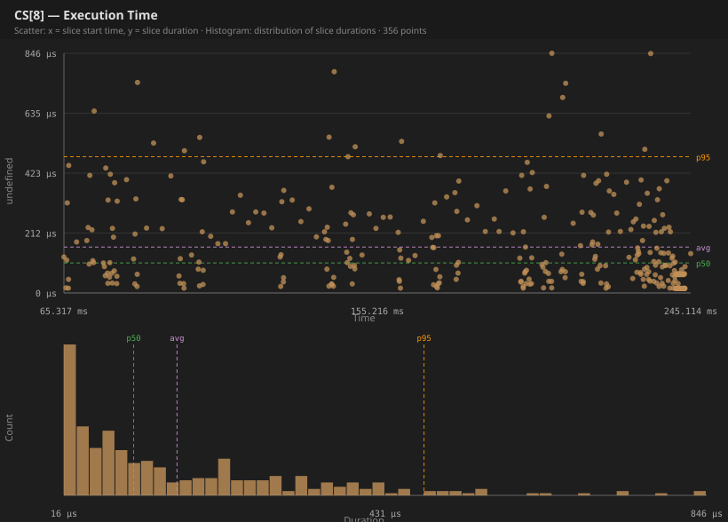
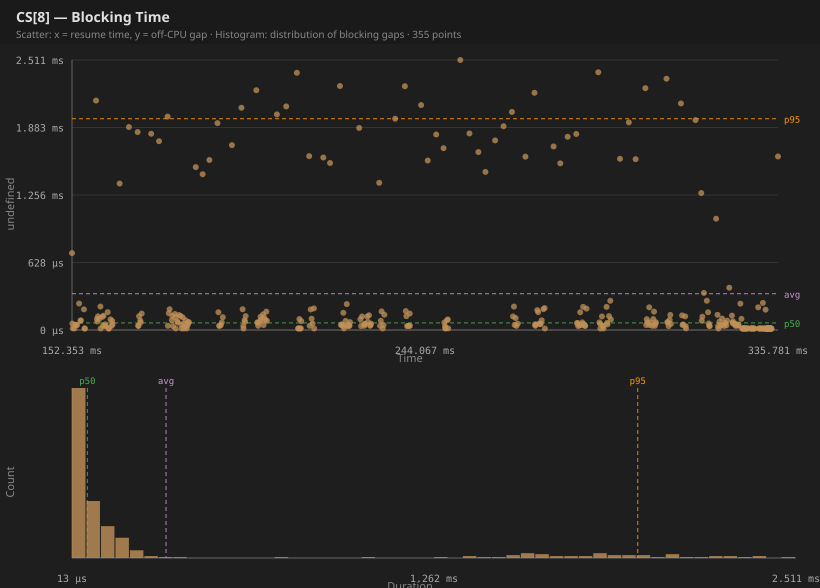
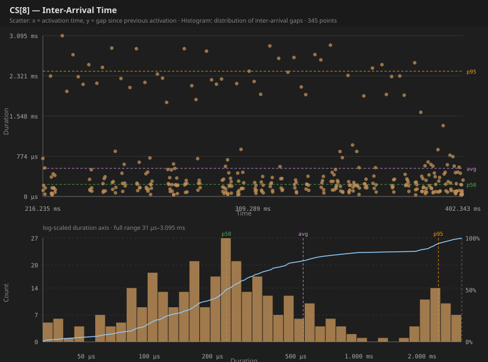
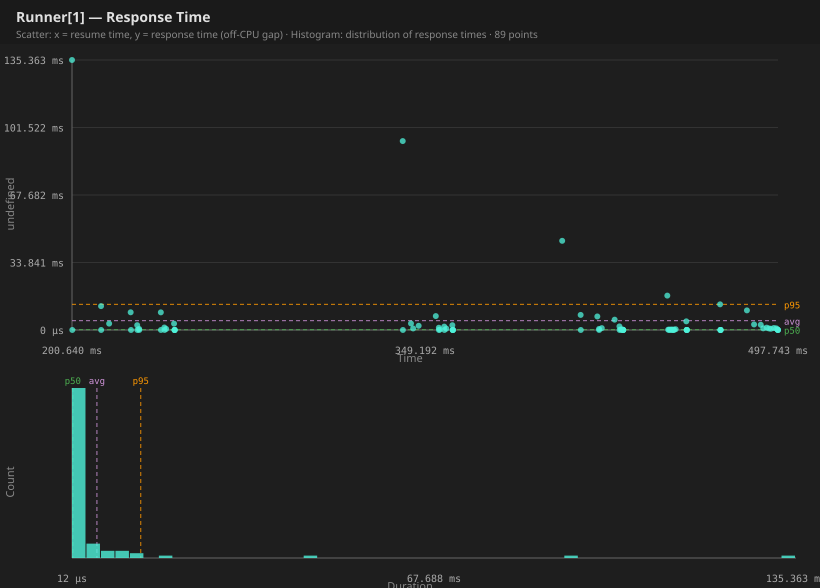
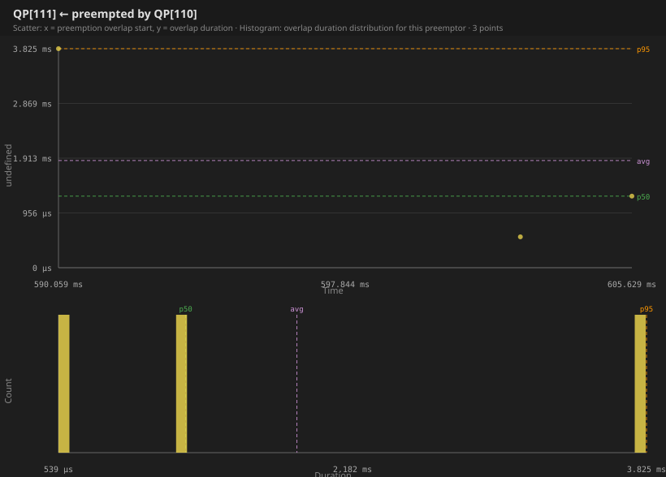

# BTF Trace Viewer

Current version: **1.3.1** (Desktop Python app + Web app)

A PyQt5-based interactive visualiser for FreeRTOS context-switch traces in **Best Trace Format** (`.btf`).

## Screenshot


[DEMO](https://apps.kuoping.com/btf-viewer.html)

## Features

- **Two view modes** — Task View (one row/column per task) and Core View (one row/column per core, expandable)
- **Expand / Collapse all cores** — single-click toolbar button in Core View
- **Per-core expand / collapse** — click any core label to expand or collapse just that core
- **16-colour core palette** — up to 16 distinct core colours; cycles automatically beyond that
- **Deterministic colour mapping** — task and STI colours are assigned in a stable, repeatable sequence across runs
- **Horizontal and Vertical orientation** — switch at any time; active mode is highlighted in the toolbar; last used orientation is remembered across launches
- **Smooth zoom & pan** — mouse wheel, two-finger pinch (macOS), and keyboard shortcuts
- **Default zoom 2 timescale units/px** — the **1:1** toolbar button resets to 2 timescale units per pixel (for `ns` timescale, the UI shows `2 ns/px`; configurable in Settings)
- **Zoom to cursor range** — `Ctrl+R` or the **⊡ Range** toolbar button fits the viewport exactly between cursor C1 (left/top edge) and the last cursor (right/bottom edge)
- **Viewport culling** — only visible rows/columns and segments are rendered; no slowdown on large traces
- **Multi-tab traces** — open several `.btf` files at once (Desktop: closable tabs; Web: tab bar under the toolbar). Desktop restores session tabs, active tab, and per-tab zoom/cursors from `btf_viewer.rc` on launch; Web restores tab names, per-tab cursors, marks, viewport, layout sizes, and view options from browser `localStorage` (re-open each file to load trace data)
- **Measurement cursors** — Desktop and Web support 2–8 cursors (default: 4); configurable in Settings
- **Trace compare** — with 2+ tabs open, **Trace Compare…** in the Statistics panel diffs **Summary**, **Top Tasks**, and **Core Migrations** side-by-side (Desktop + Web). Optional **Limit to each tab's cursor range** compares metrics within C1–Cn when 2+ cursors are placed on each trace
- **Core migration analysis** — detect tasks that run on multiple cores; **Core Migrations** stats table (ping-pong, STI correlation, gap-after vs other gaps), **clickable two-level Migration heatmap** (core-pair overview → per-task sub-bins → timeline drill-down), **Migrated tasks only** legend filter, toolbar **All tasks** reset, and Find **Migrations** mode (Desktop)
- **Cursor-scoped statistics** — with 2+ cursors, the Statistics panel can limit all metrics (CPU%, execution slices, blocking time, inter-arrival, **response time**, **preemption chain**, scheduling summary, exports, and charts) to the window from C1 through the last cursor; toggle **Limit to cursor range (C1–Cn)** (Desktop + Web)
- **Cursor range summary** — with 2+ cursors, Desktop also shows a quick min/max/avg segment summary in the status bar; Web shows range stats in the **Cursors** panel
- **Task highlight** — hover or click any task label or Legend row to highlight all its segments
- **Dockable Legend panel** — colour swatches for every task, with a search box, **Migrated tasks only** filter, a **heatmap filter banner** (when drilled from the heatmap), and the same highlight interaction
- **Dockable Statistics panel** — per-core CPU utilisation, top tasks, scheduling summary (context switches, core-gap avg/max), trace health (TICK), and collapsible metric tables including **Response Time** and **Preemption Chain** analysis
- **Tag View** — inspect tag channels/events (`tag_event`, `tag0_event` … `tag7_event`) alongside task/core activity
- **Metrics tables** — Execution Time Per Slice, **Blocking Time** (off-CPU gap between activations), **Inter-Arrival**, **Response Time** (scheduling latency between slices), and **Preemption Chain** (which tasks preempted whom); click **Min** / **Max** (dotted underline) to jump to the BCET / WCET slice or the shortest / longest gap (Desktop + Web)
- **Metrics distribution charts** — click any row in Execution Time, Blocking Time, Inter-Arrival, Response Time, or Preemption Chain tables to open a scatter-plot + histogram popup; charts live-update when cursors move or cursor-range scope is toggled (Desktop + Web). On Desktop, each trace tab remembers its own open chart when you switch tabs
- **Segment tooltips** — hover any segment bar for duration, slice index on core, previous/next task on that core, and gap before the slice
- **CPU Load Graph** — bar chart below the timeline showing per-core CPU utilisation; row labels show the **visible-window average** and, with 2+ cursors, a cursor-range average (`· C:xx%`); toggle with the **Load** toolbar button; drag the divider between timeline and CPU load to resize (Desktop + Web)
- **Resizable panels** — drag dividers between timeline and CPU load, dock panels (Desktop), the right-side panel (Web), and metric table sections in Statistics (Desktop + Web); splitter and table heights persist in `btf_viewer.rc` on Desktop
- **STI event markers** — software trace items rendered as coloured diamond markers
- **Find & Jump** — search for any task name; `F3` / `Shift+F3` steps through all matching segments
- **Bookmarks & Annotations** — mark important timestamps and attach free-text notes; persisted per trace file in `btf_viewer.rc`
- **Right-click context menu** — place/remove/clear cursors, add a bookmark, or add an annotation, all from a single right-click anywhere on the timeline
- **Recent files** — **File → Open Recent** lists the 8 most recently opened traces for one-click reopening
- **Dark / Light theme** — switch from **View → Switch to Light/Dark Theme** or **Settings → Appearance**
- **Export to PNG / SVG / clipboard** — capture the viewport in the **Snapshot Editor** (annotate with arrows, shapes, and text, then save or copy); direct clipboard copy also available from the menu
- **Persistent settings** — all preferences stored in `btf_viewer.rc` alongside the script
- **Drag-and-drop** — drop a `.btf` file directly onto the window
- **Optimised for large traces** — tested with up to **128 cores, 1 024 tasks, and 5 M+ events** (desktop). Web viewer: flat segment storage, parse worker, precomputed CPU-load bins, WASM-accelerated bisect/LOD, and debounced stats worker for 100k+ segment traces

## Installation

### Desktop viewer (`btf_viewer.py`)

**Requirements:** Python 3.8+ and PyQt5 ≥ 5.15.

```bash
# Install the only runtime dependency
pip install PyQt5

# Run directly — no build step needed
python btf_viewer.py [trace.btf]
```

A file can also be opened via **File → Open** (`Ctrl+O`) or dragged onto the window. Each open file appears in its own **tab**; use **File → Close Tab** (`Ctrl+W`) to close the active tab. Re-opening the same path switches to the existing tab instead of loading it twice.

On launch (with no command-line file), the viewer restores the previous session: all tabs listed in `btf_viewer.rc`, the last active tab, and each tab’s saved zoom level and cursor positions.

---

### Web viewer (`web/`)

A browser-based port of the viewer built with **Vue 3 + Vite**.
It runs entirely in the browser — no server, no Python, and no backend required (use `make preview` or the hosted demo for best performance on large traces).

**Requirements:** [Node.js](https://nodejs.org/) 18+ and npm (build-time only).

#### Standalone single-file build (recommended)

Produces a single self-contained `dist/index.html` that can be opened directly in any browser — no server needed:

```bash
cd BTFViewer/web
# Demo trace embedded in the build (required for Demo button and fresh builds):
ln -sf ../../tracedata/example.btf example.btf   # once, or copy the file
make          # installs deps and builds dist/index.html
# or manually:
npm install
npm run build
```

Then open the build:

```bash
open BTFViewer/web/dist/index.html   # macOS — double-click also works
```

The same file is copied to `BTFViewer/web/pre-build/btf-viewer.html` on each `make build` (used by the hosted [demo](https://apps.kuoping.com/btf-viewer.html)).

Do not open `BTFViewer/web/index.html` directly via `file://`; it is the Vite source entry used by the dev server.

#### `file://` vs local HTTP

| Open method | Works? | Notes |
|-------------|--------|--------|
| Double-click `dist/index.html` | Yes | Basic use; Chrome may block Web Workers on `file://`, so parsing falls back to the main thread (UI can freeze briefly on very large traces). |
| `make preview` | **Recommended** | Serves the build over HTTP — Web Workers, WASM accel, and the stats worker all work as intended. |
| `make dev` | Dev | Hot reload at `http://localhost:5173`. |
| Hosted demo | **Recommended** | [apps.kuoping.com/btf-viewer.html](https://apps.kuoping.com/btf-viewer.html) |

For large traces (e.g. `tracedata/example-16cores.btf` — 16 cores, 100k+ segments), prefer **`make preview`** or the hosted demo rather than `file://`.

#### Development server (with hot reload)

```bash
cd BTFViewer/web
make dev      # or: npm run dev
# → http://localhost:5173
```

#### Makefile targets

| Target | Action |
|--------|--------|
| `make` / `make build` | Install deps + produce `dist/index.html` and copy to `pre-build/btf-viewer.html` |
| `make dev` | Start Vite dev server with hot reload |
| `make preview` | Serve the production build locally (recommended for large traces) |
| `make wasm` | Rebuild WASM timeline accelerator from `wasm/timeline_accel.wat` |
| `make clean` | Remove `dist/` |
| `make dist-clean` | Remove `dist/` and `node_modules/` |

#### macOS — install Node.js via Homebrew

```bash
brew install node
```

#### Windows / Linux

Download the LTS installer from <https://nodejs.org/> or use your system package manager (`winget install OpenJS.NodeJS`, `apt install nodejs npm`, etc.).

---

## Web Viewer — Features & Usage

### View modes

Same two modes as the desktop viewer:

| Mode | Description |
|------|-------------|
| **Task View** | One row per task, coloured by task identity |
| **Core View** | One row per CPU core; bars coloured by running task. Click the `▶` arrow in the label column to expand a core into per-task sub-rows |

Toggle with the **Task** / **Core** buttons in the toolbar.

### Opening a file

Click **Open** in the toolbar and select any `.btf` file.
Each file opens in a new **tab** in the bar below the toolbar; click a tab to switch traces, or **×** to close one.
Opening the same filename again focuses the existing tab.

**Parsing:** traces are parsed in a **Web Worker** when the page is served over HTTP (`make dev`, `make preview`, or the hosted demo). On `file://` URLs some browsers block workers, so parsing may run on the main thread instead. A progress overlay (`Reading…` / `Parsing…` / `Opening trace…`) is shown until the timeline is ready.

**Large traces:** the web viewer is optimised for high segment counts (flat segment storage, precomputed CPU-load bins, WASM-accelerated bisect/LOD, debounced stats worker). On first paint after load it briefly uses a coarse LOD (like pan/zoom) and upgrades to full quality within a few hundred milliseconds — this keeps the UI responsive on traces such as `tracedata/example-16cores.btf` (16 cores, 100k+ segments).

Sample traces in the repo: `tracedata/example.btf` (small), `tracedata/example-4cores.btf` (4-core SMP, good for statistics demos), `tracedata/example-16cores.btf` (large SMP).

### Zoom & pan

| Action | Effect |
|--------|--------|
| `Ctrl` + scroll wheel | Zoom in / out centred on mouse pointer |
| `Shift` + scroll wheel | Pan horizontally |
| Plain scroll wheel | Scroll rows vertically |
| **+** / **−** toolbar buttons | Zoom in / out around viewport centre |
| **Fit** toolbar button | Fit the entire trace into the viewport |

### Cursors

Up to 4 cursors can be placed. Delta times between consecutive cursors are shown in the **Cursors** panel on the right.

| Action | Effect |
|--------|--------|
| Left-click on timeline | Place a cursor |
| Left-click near an existing cursor | Remove it |
| **✕ Cursors** toolbar button | Clear all cursors |

### Task highlight

Hover any task label (left column) or **Legend** swatch to transiently highlight all segments for that task. Click to lock the highlight; click again to release.

### Grid lines & dark/light theme

Toggle with the **grid** and **moon** buttons in the toolbar. The default theme is dark.

### CPU Load Graph

A bar chart below the timeline shows per-core (or total) CPU utilisation over the currently visible time window.

- **Toggle** — click the **Load** toolbar button to show or hide the graph.
- **View modes** — in **Task View** a single *CPU Load* row shows aggregate utilisation; in **Core View** each core gets its own row.
- **Row labels** — each row shows average load over the **currently visible** time window; with 2+ cursors placed, labels also show the average over the cursor range (`· C:xx%`), and the graph shades the C1–Cn window in blue.
- **Expand / Collapse** — in Core View click a core row header to collapse it to a compact bar.
- **Hover** — moving the pointer over the timeline projects a live cursor onto the load graph; a badge shows load % at the hover time.
- **Resize** — drag the horizontal bar between the timeline and CPU load panel to change the CPU load height.
- **Cursors, bookmarks & annotations** are also mirrored in the load graph at their exact time positions.

### Right panel & layout

The right side holds **Cursor / Bookmark** and **Statistics** pages (tab bar at the bottom of the panel).

- **Resize** — drag the vertical bar between the timeline and the right panel to change panel width.
- **Legend** — on the **Marks** page: task colour swatches, search filter, **Migrated tasks only**, and a **heatmap filter banner** with **Clear** when a heatmap drill-down is active.
- **Statistics** — same collapsible sections as the desktop viewer; click **Min** / **Max** in metric tables to jump to the corresponding slice; **Trace Compare…** when 2+ trace tabs are open.
- **Migration heatmap** — toolbar **Heatmap** button (multi-core traces only). Two-level drill-down: core-pair grid → task grid → timeline zoom/filter. Toolbar **All tasks** appears while filtered. See [Migration heatmap](#migration-heatmap).

### Multi-tab traces (Web)

Same tab bar behaviour as desktop: each `.btf` opens in its own tab with independent cursors, marks, zoom, chart state, and Find queries. On page reload, **tab names** and per-tab session state are restored from `localStorage`; use **Open**, **Recent**, or **Demo** to load trace data again. **Trace Compare…** uses any two loaded tabs — useful for before/after or build-to-build diffs.

### Session restore (Web)

The web viewer persists session state in browser `localStorage` (key `btf-viewer-session-v1`). State is saved automatically (debounced ~400 ms) when you change cursors, marks, zoom/pan, view options, Find queries, panel widths, or stats table heights.

**On page load:**

- Restores **tab names** (placeholder tabs) and the last active tab.
- Restores per-tab cursors, marks, viewport, Find state, and open distribution-chart selection when you re-open a file with the same name.
- Restores right-panel width, CPU-load panel height, and stats table section heights.

**Limitations:**

- Browser security prevents auto-loading file contents — you must **Open**, pick from **Recent**, or use **Demo** after refresh.
- Drag-and-drop a `.btf` onto the window works the same as **Open**.
- `localStorage` may be unavailable in strict private browsing modes.

**Saved per trace name** (basename of the opened file, e.g. `example.btf`):

| Per tab | Global |
|---------|--------|
| Cursors | Task / Core view mode |
| Bookmarks & annotations | Horizontal / Vertical orientation |
| Viewport (`timeStart`, `timeEnd`, scroll offsets) | Grid, STI, CPU load, dark mode |
| Pinned task highlight & selected segment | Migrated-only filter |

**How to restore:** re-open the same `.btf` file (same tab name) after a page refresh. Zoom is stored as the visible time window (`timeStart`–`timeEnd`), not a separate scale factor — pan/zoom once more before closing if you want to be sure the latest view is saved.

Tab identity is the **filename only**; two different paths with the same basename share one saved slot. Trace data is never stored — only layout and UI state.

### Web performance architecture

The web viewer shares the desktop feature set but uses a different rendering pipeline tuned for the browser:

| Stage | Implementation |
|-------|----------------|
| **Parse** | `btfParser.js` in a Web Worker; results packed via `tracePack.js` (flat `SegStore`, index arrays per task/core/LOD tier) |
| **Transfer** | Structured clone to the main thread (no transferable buffer detach issues) |
| **CPU load** | Bins precomputed at parse time (`cpuLoadBins.js`) — the CPU Load panel reads bins, not raw segments |
| **Timeline paint** | Canvas 2D with viewport culling, LOD binning, per-frame segment budget, optional WASM bisect (`wasmAccel.js`) |
| **Statistics tables** | Summary metrics on the main thread; expanded execution/blocking/inter-arrival tables in a debounced stats worker (`statsWorker.js`); response time and preemption chain on the main thread |
| **Initial load** | Coarse “load-settle” paint, then full quality; WASM upload deferred to idle time so the first frame is not blocked |

Chrome DevTools may log `[Violation] 'requestAnimationFrame' handler took …ms` on very large traces during the final full-quality repaint — that is a performance hint, not an error.

### Statistics panel — cursor-scoped metrics

When **2 or more cursors** are placed, check **Limit to cursor range (C1–Cn)** at the top of the Statistics panel (enabled by default). All summary counts, CPU tables, execution/blocking/inter-arrival metrics, CSV/HTML export, and distribution charts then use only data inside the cursor window:

| Metric | Scoping rule |
|--------|----------------|
| Span / summary counts | Range width; tasks/segments/STI with any overlap |
| Core & task CPU % | Overlapping active time ÷ range width |
| Execution time per slice | Only slices **fully inside** the range |
| Blocking time | Off-CPU gap between consecutive slices; only pairs where **both** slices are fully inside the range |
| Inter-arrival | Activations whose start time falls inside the range |
| Response time | Same gap as blocking time (end of slice → start of next); only pairs where **both** slices are fully inside the range |
| Preemption chain | Preemption overlaps counted only when the victim's blocking gap and the preemptor overlap are inside the range |
| Core migrations | Migration events and per-core active time with overlap in the range |


Uncheck the box to return to full-trace statistics.

Below the scope checkbox, a **scheduling summary** line shows context-switch count and average/max core gap (idle time between consecutive slices on each core). Metric tables are **collapsible** — click a section title to expand or collapse it. Drag the handle below a metric table to resize its height.

| Section | What it shows |
|---------|----------------|
| **Core Utilisation** | Active (non-IDLE, non-TICK) CPU time per core as a percentage |
| **Top Tasks by CPU** | Top 10 worker tasks ranked by total CPU time |
| **Trace Health (TICK)** | STI TICK period regularity, large gaps, missed-tick estimate |
| **Core Migrations** | Per-task cross-core migration stats (see [Core migration analysis](#core-migration-analysis)) |
| **Execution Time Per Slice** | Per-task slice duration stats (runs, CPU%, min/avg/max/p95) |
| **Blocking Time** | Off-CPU gap between consecutive activations of the same task |
| **Inter-Arrival Time** | Gap between successive activation start times |
| **Response Time Analysis** | Scheduling latency from slice end to next slice start (same gap as blocking, framed as response time) |
| **Preemption Chain Analysis** | For each victim task, which preemptors ran during its off-CPU gaps |

**Core Migrations** lists tasks that ran on two or more cores. For multi-core traces, open the **Migration heatmap** from the toolbar **Heatmap** button — click core-pair cells to drill into per-task sub-bins, then into Task View (see [Migration heatmap](#migration-heatmap)). **Trace Compare…** (footer, next to Export) opens a dialog with **Summary**, **Top Tasks**, and **Core Migrations** tabs to diff two open trace tabs; optional cursor-range scoping compares each tab's C1–Cn window independently.

See [Statistics metric tables](#statistics-metric-tables) for column definitions, distribution-chart usage, and example plots from `tracedata/example-4cores.btf`.

### Snapshot Editor

Click the **Shot** toolbar button (or press `S` when focus is not in a text field) to capture the current timeline view and open the **Snapshot Editor**:

- Annotate with arrows, lines, double arrows, rectangles, circles, and text before exporting.
- Check **Dash** to draw dashed strokes (lines, arrows, rectangles, circles).
- Click a shape to select and drag it; **Ctrl+click** (or **Cmd+click** on macOS) duplicates the shape so you can place the copy.
- **Double-click** any shape to add or edit its label inline — text objects edit in place; lines and arrows place centered text aligned to the line; rectangles and circles place centered text.
- Single-click with the **Text** tool places a standalone text label inline.
- **Save PNG** or **Copy to Clipboard** from the editor footer.
- When the **Load** graph is visible, the capture includes the CPU load panel below the timeline.

### Metrics Distribution Charts

In the **Statistics** panel, click any row in **Execution Time**, **Blocking Time**, **Inter-Arrival**, **Response Time**, or **Preemption Chain** to open a floating chart popup:

- **Scatter plot** — each event plotted in trace time order so you can spot trends, bursts, or outliers.
- **Histogram** — bar chart of the value distribution (50 bins), with dashed reference lines for **avg**, **p50**, and **p95**.
- **Export PNG / SVG** — buttons in the chart footer save the current scatter + histogram.

The popup can be dragged, resized, and closed independently of the main window.
If the chart is open, it **updates live** when you move cursors or toggle cursor-range scope.
Each browser tab keeps its own chart state when you switch between open traces.

**Jump links:** in Execution Time, Blocking Time, Inter-Arrival, and Response Time tables, click **Min** or **Max** (dotted underline) to jump to the slice at the shortest or longest value. In Preemption Chain, click a scatter point to jump to the **preemptor's segment** on the timeline.

Example plots from `tracedata/example-4cores.btf` (4-core SMP trace, 67 tasks) are in [Statistics metric tables](#statistics-metric-tables).

### STI events

Coloured diamond markers are shown on dedicated STI rows. Hover a marker for a tooltip showing the time, channel, event name, and note.

### Status bar

Shows the number of tasks, segments, STI events, and total trace duration once a file is loaded.

---

## Requirements (desktop viewer)

- Python 3.8+
- PyQt5 >= 5.15

```bash
pip install PyQt5
```

## Usage

```bash
python btf_viewer.py [trace.btf]
```

Passing a file on the command line opens that trace in a tab immediately. With no argument, the viewer restores the previous session from `btf_viewer.rc`.

Files can also be opened via **File → Open** (`Ctrl+O`), **File → Close Tab** (`Ctrl+W`), or drag-and-drop onto the window.

---

## View Modes

| Mode | Description |
|------|-------------|
| **Task View** | One row (horizontal) or column (vertical) per task across all cores; core tint applied to segment bars |
| **Core View** | One expandable row/column per CPU core; bars coloured by running task |

In **Core View**:

- Click a core label to **expand** or **collapse** that individual core's per-task sub-rows/columns.
- Use the **⊞ Expand All** / **⊟ Collapse All** toolbar button to expand or collapse every core at once.
- Works in both **Horizontal** and **Vertical** orientations.

## Orientation

- **Horizontal** (default) — time runs left to right; task/core labels are on the left
- **Vertical** — time runs top to bottom; task/core labels are at the top

Switch orientation using the **↔ Horizontal** / **↕ Vertical** toolbar buttons or **View → Horizontal layout / Vertical layout**. The active orientation button is highlighted.

In **Vertical** mode:
- The ruler column (left edge) is frozen and always shows time labels as you scroll horizontally.
- The label row (top edge) is frozen and always shows task/core names as you scroll vertically.
- The top-left corner area shows the **TICK** band label when TICK events are present.
- Drag the resize handle on the **right edge** of the label column (horizontal layout) to resize the label area. Width is saved in Settings / `localStorage`.

## Task Labels

Regular task labels show the task name and task ID, for example `MyTask[3]`.
IDLE and TICK tasks show their bare name (`IDLE`, `IDLE0`, `IDLE1`, etc.) without an ID suffix.
IDLE tasks always render in grey; each IDLE task on a different core gets a distinct shade.

---

## Task Highlight

Hovering or clicking a task name in the label column or Legend panel highlights all timeline segments for that task.

| Action | Effect |
|--------|--------|
| Hover over a task label or Legend row | Transiently highlights that task's segments |
| Hover leave | Removes the transient highlight and restores any persistent highlight |
| Click a task label or Legend row | Locks the highlight on that task persistently |
| Click the same locked task again | Cancels the persistent highlight |
| Click empty area in the label column | Cancels the persistent highlight |
| Click empty area in the Legend panel | Cancels the persistent highlight |

When a task is persistently highlighted, its row gets a colour tint, its label turns gold and bold,
and its segment bars show a white border. Hovering another task while a lock is active shows both
highlights at the same time.

---

## Cursors

Between 2 and 8 cursors can be placed on the timeline (default: 4; adjustable in **Settings → Layout → Max cursors**). Delta times between consecutive cursors are shown on the timeline and in the status bar.

### Placing and Moving

| Action | Effect |
|--------|--------|
| Left-click on the timeline area | Place a new cursor at that time position |
| Drag a cursor line | Move it to a new time position |
| `C` (keyboard) | Place a cursor at the viewport centre |

### Removing

| Action | Effect |
|--------|--------|
| Right-click → **Remove nearest cursor** | Remove the cursor closest to the click position |
| Right-click → **Clear all cursors** | Remove all cursors at once |
| `Shift+C` | Clear all cursors |
| Drag a status-bar cursor badge out of the status bar | Remove that specific cursor |

### Navigating

| Action | Effect |
|--------|--------|
| Click a `C1` / `C2` / ... badge in the status bar | Scroll the view to that cursor |
| `Ctrl+R` / **⊡ Range** toolbar button | Zoom view to fit exactly between C1 and the last cursor |

### Cursor range summary (status bar)

When two or more cursors are placed, the **status bar** shows a quick summary of segment durations for slices that start **and** end within the cursor range: **min**, **max**, and **avg**.

For full per-task/per-core metrics scoped to the cursor window, use the **Statistics** panel — see [Statistics Panel](#statistics-panel) and **Limit to cursor range (C1–Cn)**.

---

## Multi-tab traces (Desktop)

| Action | Effect |
|--------|--------|
| **File → Open** (`Ctrl+O`) | Open a trace in a **new tab** (or switch to it if already open) |
| **File → Close Tab** (`Ctrl+W`) | Close the active tab |
| Click a tab | Switch the timeline, legend, statistics, marks, and CPU load graph to that trace |
| **×** on a tab | Close that tab |

Each tab has its own cursors, zoom level, bookmarks, annotations, find state, and metrics chart session. Shared settings (theme, orientation, row height, etc.) apply to all tabs.

On exit, the viewer saves the list of open tab paths, the active tab index, and per-tab zoom/cursor layout to `btf_viewer.rc`. The next launch reopens the same tabs automatically (unless a file path on the command line overrides session restore).

---

## Legend Panel

The Legend lists every task with its colour swatch and `Name[id]` label.

- The panel is a dockable window; it can be detached, closed, and re-opened via its **✕** button.
- Toggle visibility from **Settings → Display → Legend panel** (`Ctrl+,`).
- A **Search** box at the top filters the displayed task list.
- **Migrated tasks only** (Web: checkbox in Legend on the Marks page; Desktop: same filter in the legend dock) hides tasks that ran on a single core only — useful with [core migration analysis](#core-migration-analysis).
- After a **heatmap drill-down**, a blue **Heatmap: … (N)** banner appears with a **Clear** button; it filters the legend list to match the timeline.
- Hover and click Legend rows to highlight tasks using the same rules as the label column.

---

## Zoom and Pan

| Action | Effect |
|--------|--------|
| `Ctrl` + Scroll wheel | Zoom in or out centred on the pointer |
| Two-finger pinch (macOS) | Zoom in or out |
| Scroll wheel / trackpad swipe | Pan along the time axis |
| `Ctrl+0` | Fit entire trace to window |
| **1:1** toolbar button | Reset to default zoom (2 timescale units/pixel; for `ns` timescale, UI shows `2 ns/px`; configurable in Settings) |
| Toolbar zoom+ / zoom− buttons | Zoom in or out by 2× |

---

## Export

### Snapshot Editor (PNG)

**File → Save as Image (PNG)…** (`Ctrl+S`), the toolbar **Save PNG** / **Shot** buttons, and the plot-dialog **Export PNG** action all capture the current viewport and open the **Snapshot Editor** — they do **not** write a file immediately.

In the editor you can draw annotation shapes (arrow, double arrow, line, rectangle, circle, text) and then:

- Check **Dash** to draw dashed strokes (lines, arrows, rectangles, circles).
- Click a shape to select and drag it; **Ctrl+click** duplicates the shape (then drag to position the copy).
- **Double-click** any shape to add or edit its label inline (lines/arrows: centered, aligned to the segment; rectangles/circles: centered).
- Single-click with the **Text** tool adds a standalone text label inline.
- **Save PNG…** — write the annotated image to disk (includes CPU load graph when **Load** is on).
- **Copy to Clipboard** — copy the annotated image.

### Direct clipboard copy

**File → Copy Image to Clipboard** (`Ctrl+Shift+C`) copies the raw viewport (timeline + CPU load when visible) without opening the editor. On Linux, `xclip`, `xsel`, or `wl-copy` is used when available (Qt clipboard is unreliable for images on X11/Wayland).

### SVG

**File → Save as SVG…** (`Ctrl+Shift+S`) or the toolbar **Save SVG** button exports the current viewport as vector SVG (includes CPU load when visible).

---

## Settings

Open **Settings** from the toolbar (**⚙ Settings**) or via **View → ⚙ Settings…** (`Ctrl+,`).

| | Desktop | Web |
|--|---------|-----|
| **Storage** | `btf_viewer.rc` in the viewer directory | Browser `localStorage` key `btf-viewer-settings-v1` |
| **When saved** | Immediately on each change | Immediately on **Save** (or when closing with **Save**); **Cancel** reverts unsaved edits |
| **Live preview** | — | Changes apply to the open trace while the dialog is open; cancel restores the pre-open snapshot |

Preferences are restored on the next launch (desktop) or page reload (web).

### Appearance

| Setting | Description |
|---------|-------------|
| Theme | **Dark** (default) or **Light** |
| Timeline labels | Font size for task/core labels drawn on the timeline (pt) |
| UI / menus | Font size for menus, toolbar, and status bar (pt) |

### Display

| Setting | Description |
|---------|-------------|
| Legend panel | Show or hide the dockable Legend panel |
| Statistics panel | Show or hide the dockable Statistics panel |
| STI events | Show or hide software-trace item marker rows |
| Grid lines | Overlay vertical grid lines on the timeline |
| Highlight on label hover | Dim all other segments when hovering a task label (disable for better performance on large traces) |
| **Vertical labels: use pixmap rendering** | See [Windows — Vertical-mode label antialiasing](#windows--vertical-mode-label-antialiasing) |

---

> ### Windows — Vertical-mode label antialiasing
>
> **Problem:** On Windows the GDI text renderer cannot antialias glyphs that are drawn at a non-zero rotation angle. Even setting `QFont.PreferAntialias` (which normally forces Qt to bypass GDI and use DirectWrite or FreeType) does not help for rotated `QGraphicsTextItem`s, so task/core labels in **Vertical** orientation look jagged on Windows.
>
> **Workaround — pixmap rendering:**
> Instead of rotating a `QGraphicsTextItem`, the viewer first renders the label text horizontally onto a `QPixmap` (all platforms apply full antialiasing to horizontal text), then rotates the *finished image* by −90°. The result is crisp, antialiased text on every Windows rendering back-end (GDI, Direct2D, OpenGL).
>
> **How to enable / disable:**
>
> | Where | How |
> |-------|-----|
> | Automatic (default) | Enabled automatically on Windows (`sys.platform == "win32"`); disabled on macOS and Linux. |
> | `btf_viewer.rc` | Set `vert_label_pixmap = true` or `false` under the `[view]` section. |
> | Settings dialog | **⚙ Settings → Display → Vertical labels: use pixmap rendering** checkbox. |
> | Source constant | Change `_VERTICAL_LABEL_USE_PIXMAP` near the top of `btf_viewer.py` (USER CONFIGURATION section). |
>
> **Side effects of the pixmap path:**
>
> - Labels are rasterised at the *current screen resolution* and do not scale as crisply as vector text when the OS display scale factor differs from 100 % (e.g. 125 %, 150 % HiDPI on Windows). Text may appear slightly softer at non-100 % scaling.
> - If you switch the setting while a trace is loaded, the scene is rebuilt immediately (brief repaint flash).
> - On macOS and Linux the original `QGraphicsTextItem` path already produces antialiased rotated text; enabling the pixmap option there is harmless but provides no visual benefit.

### Layout

| Setting | Description |
|---------|-------------|
| Label column | Width of the frozen task/core label column (60–600 px) |
| Row height | Height of each task/core row (12–60 px) |
| Row gap | Vertical gap between rows (0–20 px) |
| 1:1 zoom level | Target zoom of the **1:1** button and the maximum zoom-in limit (0.5–200 timescale units/px; UI unit follows trace timescale, e.g. `ns/px`) |
| Max cursors | Maximum number of simultaneously visible cursors (4–8) |

---

## Statistics Panel

The **Statistics** dock appears at the bottom of the window. Toggle it from **Settings → Display → Statistics panel**.

At the top, **Limit to cursor range (C1–Cn)** restricts all statistics to the time window from the first placed cursor through the last (requires 2+ cursors). Section titles show **(cursor range)** when scoped. Clearing all cursors returns to full-trace statistics immediately.

**Layout:** metric tables are **collapsible** (click a section title) and **resizable** (drag the thin handle below each table). On Desktop, drag the splitter between the timeline and CPU load graph to resize that pane; sizes are saved in `btf_viewer.rc`.

It shows:

- **Summary** — span, task/segment/STI counts (scoped when the checkbox is on)
- **Scheduling summary** — context-switch count and average/max core gap between consecutive slices on each core
- **Core utilisation** — percentage of active (non-IDLE, non-TICK) CPU time per core (collapsible)
- **Top tasks by CPU** — ranked list of worker tasks by total CPU time consumed (collapsible)
- **Trace health (TICK)** — tick period regularity, large gaps, missed-tick estimate (collapsible)
- **Core Migrations** — per-task migration count, core count, primary core (% time), ping-pong count, STI events near migrations, and average off-CPU gap after migration vs other gaps; click a row to highlight the task (collapsible)
- **Execution Time Per Slice** — per-task min/avg/max/p95, run count, and CPU%; click a row for a scatter + histogram popup; click **Min** / **Max** to jump to the BCET / WCET slice
- **Blocking Time** — off-CPU gap between consecutive activations of the same task (min/avg/max/p95); click a row for a distribution chart; click **Min** / **Max** to jump to the slice at the shortest / longest off-CPU gap (collapsible)
- **Inter-Arrival Time** — same statistics for gaps between task activations; click **Min** / **Max** to jump to the activation at the shortest / longest inter-arrival gap (collapsible)
- **Response Time Analysis** — scheduling latency from end of one slice to start of the next (min/avg/max/p95); click a row for a distribution chart; click **Min** / **Max** to jump to the best/worst resume segment (collapsible)
- **Preemption Chain Analysis** — for each victim/preemptor pair: count, total/average/max preemption overlap; click a row for a distribution chart; click a scatter point to jump to the preemptor segment (collapsible)

**Export CSV** / **Export HTML** respect the current cursor scope. **Trace Compare…** compares summary, top tasks, and core migrations between two open tabs; enable **Limit to each tab's cursor range** to scope each side to its own C1–Cn window. Open metrics charts update live when cursors move or scope is toggled; each trace tab remembers its own open chart when you switch tabs.

Full column definitions, chart axis meanings, and example plots: [Statistics metric tables](#statistics-metric-tables).

### Statistics metric tables

The Statistics panel (Desktop dock + Web **Statistics** tab) organises metrics into collapsible sections. Tables are **sortable** — click a column header to sort ascending/descending. **Export CSV** and **Export HTML** at the panel footer include all sections and honour the current cursor scope.

**How to use the panel**

1. Open a trace (e.g. `tracedata/example-4cores.btf` for a 4-core SMP workload, or `tracedata/example.btf` for a smaller single-core demo).
2. Expand the sections you care about (or use the **+** / **−** icons at the top to expand/collapse all).
3. Optionally place **2+ cursors** and enable **Limit to cursor range (C1–Cn)** to restrict every metric to a time window.
4. Click a **table row** to open a distribution chart (where supported), or click **Min** / **Max** to jump to an extreme slice on the timeline.
5. Use **Trace Compare…** when two traces are open to diff summary and migration stats.

The example plots below were generated from **`tracedata/example-4cores.btf`** (4 cores, 67 tasks, ~7 100 segments, time scale `us`). Regenerate them with:

```bash
node BTFViewer/web/scripts/export-stats-plots.mjs tracedata/example-4cores.btf images/stats
```

#### Execution Time Per Slice

Measures how long each **on-CPU slice** lasts for a task.

| Column | Meaning |
|--------|---------|
| **Task** | Display name (`Name[id]`) |
| **Runs** | Number of slices in scope |
| **CPU%** | Share of total trace (or cursor-range) active time |
| **Min / Avg / Max / p95** | Slice duration statistics |
| **Min / Max** links | Jump to BCET / WCET slice |

**Distribution chart** — click any row:

- **Scatter:** x = slice start time, y = slice duration.
- **Histogram:** distribution of slice durations.

In `example-4cores.btf`, task **CS[8]** has 356 slices with a long tail of longer runs (context-switch stress tasks):



The scatter shows periodic bursts of short slices; the histogram reveals a dominant short-slice mode plus a secondary bump at longer durations (preemption or blocking before the task resumes).

#### Blocking Time

Measures the **off-CPU gap** between the end of one slice and the start of the next for the same task — time spent waiting to run again (preempted, blocked on a resource, or delayed by the scheduler).

| Column | Meaning |
|--------|---------|
| **Task** | Display name |
| **Gaps** | Number of positive off-CPU gaps |
| **Min / Avg / Max / p95** | Gap duration statistics |
| **Min / Max** links | Jump to resume slice at shortest / longest gap |

**Distribution chart** — click any row:

- **Scatter:** x = resume time, y = off-CPU gap.
- **Histogram:** distribution of blocking gaps.

**CS[8]** in `example-4cores.btf` (355 gaps):



High blocking gaps clustered at certain times often correlate with lock contention or a higher-priority task dominating the core.

#### Inter-Arrival Time

Measures the gap between **successive activation start times** of the same task (time between slice starts, not off-CPU gap).

| Column | Meaning |
|--------|---------|
| **Task** | Display name |
| **Runs** | Number of inter-arrival samples |
| **Min / Avg / Max / p95** | Gap between activation starts |
| **Min / Max** links | Jump to activation at shortest / longest inter-arrival |

**Distribution chart** — click any row:

- **Scatter:** x = activation time, y = gap since previous activation.
- **Histogram:** distribution of inter-arrival gaps.

**CS[8]** in `example-4cores.btf`:



Compare with Blocking Time: inter-arrival includes time the task was **running**, so values are typically larger than off-CPU gaps alone.

#### Response Time Analysis

**Response time** is the scheduling latency from the **end of one slice** to the **start of the next** for the same task. Numerically it equals the off-CPU gap used in Blocking Time, but the table is framed around **how long the task waits to resume** after yielding the CPU.

| Column | Meaning |
|--------|---------|
| **Task** | Display name |
| **Events** | Number of response-time samples (needs ≥ 2 activations) |
| **Min / Avg / Max / p95** | Response time statistics |
| **Min / Max** links | Jump to the resume segment at the best / worst response time |

**Distribution chart** — click any row:

- **Scatter:** x = resume time, y = response time (off-CPU gap).
- **Histogram:** distribution of response times.
- **Min / Max** cells still jump to the best / worst resume segment.

**Runner[1]** in `example-4cores.btf` (89 samples) — the main application task on Core 0:



Use this view when you care about **deadline-style latency** (when did the task get the CPU back?) rather than raw blocking semantics. Spikes in the scatter plot mark moments where the runner waited unusually long to resume.

#### Preemption Chain Analysis

For each **victim** task's off-CPU gap, the analyser finds which **preemptor** tasks ran on **any core** during that gap and aggregates overlap duration.

| Column | Meaning |
|--------|---------|
| **Victim** | Task that was off-CPU |
| **Preemptor** | Task that ran during the victim's gap |
| **Count** | Number of preemption overlap events |
| **Total / Avg / Max** | Overlap duration (how long the preemptor held the CPU during victim gaps) |

**Distribution chart** — click any row (victim ← preemptor pair):

- **Scatter:** x = when the preemption overlap started, y = overlap duration.
- **Histogram:** how long that preemptor typically held the CPU during gaps.
- **Click a point** to jump to the **preemptor's segment** on the timeline.

**CS[10] ← CS[11]** in `example-4cores.btf` (155 overlap events, 14.7 ms total overlap) — two context-switch stress tasks repeatedly preempting each other:



High **Count** with moderate **Avg** overlap suggests frequent short preemptions; a few points with large **y** values are long stretches where CS[11] ran while CS[10] waited. Use this table to answer *who preempted whom* and whether a victim's blocking is dominated by one preemptor or many.

#### Trace Health (TICK)

Uses STI **TICK** timestamps to estimate scheduler tick regularity.

| Field | Meaning |
|-------|---------|
| **Status** | `good` / `warning` / `critical` based on gap threshold |
| **Ticks** | TICK event count in scope |
| **Avg period / Max gap** | Observed tick spacing |
| **Missed ticks (est.)** | Rough count of skipped ticks from large gaps |

Large gaps may indicate CPU overload, long critical sections, or tracing gaps — not necessarily a FreeRTOS configuration error.

### Core migration analysis

A **migration** is recorded when consecutive slices of the same task (merge-key) run on different cores. Migrations are detected at parse time from the segment timeline — there are no separate markers drawn on the timeline; use the **Core Migrations** table, **Migration heatmap**, **Trace Compare…**, or Find **Migrations** mode (Desktop) to inspect them.

| Feature | Desktop | Web |
|---------|---------|-----|
| Core tint legend + **Migrated tasks only** filter | ✓ | ✓ |
| **Core Migrations** stats table | ✓ | ✓ |
| **Migration heatmap** | ✓ | ✓ |
| Cursor-scoped migration stats | ✓ | ✓ |
| Resizable metric table height (drag handle below table) | ✓ | ✓ |
| Resizable timeline / CPU load divider | ✓ | ✓ |
| Resizable right panel / dock width | ✓ (docks) | ✓ |
| **Min** / **Max** slice links (execution / blocking / inter-arrival / response) | ✓ | ✓ |
| **Preemption chain** table + distribution charts | ✓ | ✓ |
| Find bar **Migrations** mode | ✓ | ✓ |
| **Find** panel (Contains / Exact / Regex / Migrations) | ✓ | ✓ |
| **Zoom to cursor range** (`Ctrl+R`, **⊡ Range**) | ✓ | ✓ |
| **1:1** zoom toolbar button | ✓ | ✓ |
| Jump to time / trace start / end | ✓ | ✓ |
| Drag-and-drop `.btf` open | ✓ | ✓ |
| **Open Recent** (8 filenames) | ✓ | ✓ (Chromium: one-click reopen when opened via File System Access) |
| Segment right-click (copy task, zoom, select in legend) | ✓ | ✓ |
| Cursor comparison table (task at each cursor) | ✓ | ✓ |
| Global undo/redo (cursors + marks) | ✓ | ✓ |
| Portable session export/import (JSON) | — | ✓ |
| Drag-resize label column | ✓ | ✓ |
| Direct clipboard copy (`Ctrl+Shift+C`) | ✓ | ✓ |
| Persist panel widths / stats table heights | ✓ | ✓ |
| Restore tab names on page load (re-open files to load) | ✓ | ✓ |
| **Trace Compare…** (2+ open traces) | ✓ | ✓ |
| **Trace Compare…** cursor-scoped mode | ✓ | ✓ |
| Web session restore (`localStorage`) | — | ✓ |
| Core View: dim other tasks when one is locked | ✓ | ✓ |

**Legend panel:** the core-tint key explains Task View colouring by core. Check **Migrated tasks only** to hide tasks that never left their first core.

**Statistics → Core Migrations** (collapsible section):

| Column | Meaning |
|--------|---------|
| **Migr** | Migration count in the current scope (full trace, or cursor range when **Limit to cursor range** is on) |
| **Cores** | Number of distinct cores the task ran on |
| **Primary** | Core with the most active time in scope, with its share (%) |
| **Ping** | Ping-pong migrations — three consecutive migrations A→B→A within 1 µs |
| **STI±** | Migrations with an STI event within ±500 ns |
| **Gap after** | Average off-CPU gap immediately after a migration |
| **Gap other** | Average blocking gap elsewhere for the same task |

Click a row to highlight that task on the timeline. Drag the resize handle below the table to show more or fewer rows.

#### Migration heatmap

Visualise **when** migrations happen between core pairs — complementary to the per-task **Core Migrations** table. The heatmap is a **two-level** drill-down: first pick *where* (core pair + time bin), then pick *which task* (sub-bin), then jump to the timeline.

**Typical workflow**

1. Open **Heatmap** from the toolbar (`tracedata/example-4cores.btf` is a good demo).
2. **Level 1** — click a hot cell on a core-pair row to open the task grid for that bin.
3. **Level 2** — click a task cell to zoom the timeline, place **C1** / **C2**, switch to **Task View**, and show only that task.
4. **Show all tasks** — when done, clear the task filter and restore the timeline viewport, cursors, and highlights from before the heatmap was opened; the heatmap returns to the core-pair overview.

| | |
|--|--|
| **Open** | Toolbar **Heatmap** (Desktop + Web). Enabled only when the trace has **2 or more cores** (single-core traces such as `example.btf` disable the button). Desktop: non-modal dialog (timeline stays interactive). Web: semi-transparent overlay. |
| **Level 1 rows** | One row per directed core pair (`c0→c1`, `c1→c0`, …). Core names are shortened in the labels (e.g. `Core_0` → `c0`). |
| **Level 1 columns** | **32 equal time bins** across the scoped window. Cell colour intensity is the migration count in that bin (darker = more migrations). Hover for time range, count, and task names. |
| **Level 2 rows** | Task display names that migrated on the selected core pair in the selected bin. |
| **Level 2 columns** | **32 sub-bins** within the Level 1 cell's time window. |
| **← Back** | Return from Level 2 to the core-pair overview without closing the dialog. |
| **Click cell** | Level 1 → Level 2; Level 2 → timeline drill-down. Details in [What happens when you click a cell](#what-happens-when-you-click-a-cell) below. |
| **All tasks** (toolbar) | Shown next to **Heatmap** while a heatmap task filter is active. Same reset as **Show all tasks** below. |
| **Show all tasks** | Clears the task filter and **restores the timeline state captured when the heatmap was opened** (viewport, cursors, highlights, view mode). The heatmap returns to **Level 1**; heatmap time scope follows the restored cursors (full trace if fewer than two cursors were saved). Available from: toolbar **All tasks**, heatmap dialog **Show all tasks**, Legend **Clear** (Web: Marks page; Desktop: legend dock), or enabling **Migrated tasks only**. Loading a new trace or switching tabs also clears the filter (Desktop closes the heatmap dialog on tab switch). |
| **Scope** | **Full trace** by default. With **2 or more cursors** placed, Level 1 uses the time window from **C1** through the last cursor (subtitle shows the range). Independent of the Statistics panel **Limit to cursor range** toggle. **Show all tasks** restores pre-heatmap cursors, so heatmap scope matches that saved window. |
| **Empty state** | *No migrations in scope.* (Level 1) or *No task migrations in this cell.* (Level 2) when no events fall in the current window. |

##### What happens when you click a cell

Only cells with at least one migration (count > 0) are clickable.

**Level 1 — core-pair overview** (rows = `c0→c1`, … · columns = 32 time bins)

1. **Click a cell** — Opens **Level 2** for that core pair and time bin. The heatmap stays open; use **← Back** to return without resetting the timeline.

**Level 2 — task detail** (rows = task names · columns = 32 sub-bins)

2. **Click a cell** — The timeline zooms to that sub-bin, **C1** and **C2** are placed at the sub-bin edges, the view switches to **Task View**, and only that **task** row is shown. The task is click-locked and scrolled into view automatically.
3. **Another Level 2 cell** — Each click **replaces** the previous filter (last task wins). The heatmap dialog stays open so you can try other cells.

**Reset — Show all tasks**

4. Clears the task filter, restores the viewport/cursors/highlights saved when the heatmap was opened, returns the heatmap to **Level 1**, and shows every task row again.

Use the heatmap to spot bursts of cross-core traffic, drill into the contributing tasks, then jump to Task View for slice-level inspection. For aggregate per-task migration statistics (ping-pong, STI correlation, gap-after), use **Core Migrations** in the Statistics panel.

#### Trace Compare…

Compare two traces you already have open side-by-side:

1. Open at least **two** `.btf` files (Desktop: **File → Open** adds a tab; Web: **Open** adds a tab in the bar under the toolbar).
2. In the **Statistics** panel footer, click **Trace Compare…** (enabled when two or more tabs are loaded).
3. Choose **Trace A** and **Trace B** from the dropdowns.
4. Optionally check **Limit to each tab's cursor range** to compare metrics within C1–Cn on each trace (requires 2+ cursors per tab).
5. Switch between **Summary**, **Top Tasks**, and **Core Migrations** tabs.

By default, compare views use the **full trace**. With the cursor-range checkbox enabled, each side uses that tab's own cursor window independently.

**Summary** — high-level diff:

| Metric | Notes |
|--------|--------|
| Span | Total trace duration (or cursor-range width when scoped) |
| Tasks / Segments / STI events | Counts |
| Context switches | Total across all cores |
| Core gap avg / max | Idle time between consecutive slices on each core |
| Migrations (total) / Migrated tasks | Core-migration counts |

Each row shows Trace A, Trace B, and **Δ** (signed difference).

**Top Tasks** — top 10 user tasks by CPU% from each trace, unioned by display name (`Name[id]`). Tasks present in only one trace show **—** for the missing side.

**Core Migrations** — same table as before:

| Column | Meaning |
|--------|---------|
| **Task** | Display name (`Name[id]`) |
| **Migrations A** / **B** | Migration count in scope for that trace |
| **Δ** | Difference (A − B) |
| **Ping-pong A** / **B** | Ping-pong count in each trace |

Use this to compare builds, configurations, or runs of the same workload without merging traces manually.

**Find → Migrations** (Desktop only): lists migration boundary times; `F3` / `Shift+F3` jump between them.

---

## Find & Jump

The **Find** bar (at the bottom of the window; also reachable via **Navigate → Find Task…** or `Ctrl+F`) searches for task names within the loaded trace. Set the mode dropdown to **Migrations** to jump between core-migration boundaries instead.

| Action | Effect |
|--------|--------|
| Type in the search box | Highlight all matching task segments in the timeline |
| `F3` / **Navigate → Find Next** | Jump to the next matching segment |
| `Shift+F3` / **Navigate → Find Previous** | Jump to the previous matching segment |
| `Esc` | Close the Find bar and clear the search |

The status label next to the search box shows the total number of matches and the current position (e.g. `12 matches (at 4)`).

---

## Bookmarks & Annotations

Both are stored per-trace in `btf_viewer.rc` and restored automatically the next time the same file is opened. They are listed together in the **Marks** dock (toggle via **View → Marks**).

### Bookmarks

A **bookmark** is a simple timestamped marker — a flag pinned to a specific moment in the trace. Use bookmarks when you want to quickly return to a position you already understand.

**Adding a bookmark:**
- Right-click anywhere on the timeline and choose **Add Bookmark here**.
- Or, via **Navigate → Add Bookmark** (`Ctrl+B`) to place one at the viewport centre.

### Annotations

An **annotation** is a timestamped note — you supply a short text description that is stored alongside the timestamp. Use annotations when you want to record *why* a moment is interesting (observations, bug descriptions, review comments, etc.).

**Adding an annotation:**
- Right-click anywhere on the timeline and choose **Add Annotation here**; a prompt asks for the note text.
- Or, via **Navigate → Add Annotation** to annotate the viewport centre.

### Bookmark vs. Annotation — when to use which

| Scenario | Use |
|----------|-----|
| You found the `CAN_Rx` preemption that triggers a deadline miss and want to jump back to it quickly | **Bookmark** — quick marker, no text needed |
| You want to leave a note — *"first occurrence of 3 ms latency spike on Core_2, ticket #492"* — for yourself or a colleague | **Annotation** — the text note travels with the `.rc` file |
| Marking several candidate events to compare before deciding which matters | **Bookmarks** — fast to place, easy to jump between |
| Documenting a code review of a trace, explaining each anomaly | **Annotations** — each one carries the explanation inline |
| Sharing a trace with a colleague and highlighting the two key moments for them to look at | **Annotations** — the notes appear without any external document needed |

### Managing marks

In the **Marks** dock:

- **Double-click** a bookmark or annotation row to jump to its timestamp.
- **Delete** key (or the **Delete** button) removes the selected mark.
- Bookmark labels can be renamed **inline** by double-clicking the label text.

---

## Right-Click Context Menu

Right-clicking anywhere on the timeline opens a context menu:

| Item | Effect |
|------|--------|
| **Place cursor here** | Add a cursor at the clicked timestamp |
| **Remove nearest cursor** | Remove the cursor closest to the click position |
| **Clear all cursors** | Remove all cursors |
| **Add Bookmark here** | Add a bookmark at the clicked timestamp |
| **Add Annotation here** | Prompt for note text, then add an annotation at the clicked timestamp |

The **Add Bookmark** and **Add Annotation** items are only shown when a trace is loaded.

---

## Recent Files

**File → Open Recent** lists the 8 most recently opened `.btf` files. Clicking an entry opens it in a new tab (or switches to the existing tab). The list is stored in `btf_viewer.rc` and persists across launches.

---

## Session persistence (`btf_viewer.rc`)

Settings, window layout, bookmarks, and multi-tab state are stored in `btf_viewer.rc` next to `btf_viewer.py`.

| Section / key | Purpose |
|---------------|---------|
| `[files]` `open_tabs_json` | JSON array of open trace paths (tab order) |
| `[files]` `active_tab_index` | Which tab was focused on exit |
| `[files]` `last_file` | Path of the active tab (legacy; also used as fallback when `open_tabs_json` is empty) |
| `[tab_view]` `trace_<hash>` | Per-trace zoom level, fit mode, and cursor positions |
| `[trace_state]` `trace_<hash>` | Per-trace bookmarks and annotations |
| `[view]` `cpu_splitter_bottom_h` / `cpu_splitter_user_sized` | Timeline vs CPU load splitter height (Desktop) |
| `[stats]` `table_height_<section>` | Per-section metric table heights in Statistics (Desktop) |
| `[zoom]` / `[cursors]` | Zoom and cursors for the last active tab (legacy compatibility) |

---

## Keyboard Shortcuts

| Key | Action |
|-----|--------|
| `Ctrl+O` | Open `.btf` file (new tab) |
| `Ctrl+W` | Close active tab |
| `Ctrl+S` | Open snapshot editor (capture viewport for annotation) |
| `Ctrl+Shift+C` | Copy viewport to clipboard (no editor) |
| `Ctrl+Shift+S` | Save viewport as SVG |
| `Ctrl++` | Zoom in |
| `Ctrl+-` | Zoom out |
| `Ctrl+0` | Fit to window |
| `Ctrl+R` | Zoom to cursor range (requires ≥ 2 cursors) |
| `Ctrl+F` | Open Find bar |
| `F3` | Find next match |
| `Shift+F3` | Find previous match |
| `Ctrl+B` | Add bookmark at viewport centre |
| `Ctrl+,` | Open Settings |
| `C` | Place cursor at viewport centre |
| `Shift+C` | Clear all cursors |
| `Ctrl+Q` | Quit |

---

## Other

- Hover over any segment bar or STI marker for a detailed tooltip (task, core, start/end/duration, slice index on core, previous/next task on that core, gap before the slice).
- Toggle STI events, grid lines, and hover highlight from **Settings** (`Ctrl+,`).
- Drag and drop a `.btf` file onto the window to open it in a new tab.
- Open tabs, active tab, zoom level, and cursor positions are saved per trace in `btf_viewer.rc` and restored on the next launch.

---

## Generating Synthetic Traces — `gen_trace.py`

`gen_trace.py` generates a synthetic FreeRTOS-style BTF trace file for testing or demo purposes.
Task names are drawn from a realistic embedded-system pool (`CAN_Rx`, `Motor_L`, `PID_Speed`, …).
The scheduler simulation includes task priorities, IDLE time, TICK ISRs, and optional STI events.
A fast inline **xorshift32 PRNG** is used internally for high-throughput event generation
(≈ 0.22 s for 100 000 events on typical hardware).

### Quick start

```bash
# defaults: 8 cores, 100 tasks, 1 M events  →  freertos_8c_100t_1m_events.btf
python3 gen_trace.py

# 4 cores, 50 tasks, 500 K events
python3 gen_trace.py -c 4 -t 50 -e 500000 -o my_trace.btf

# 16 cores, 200 tasks, 2 M events, 500 Hz tick
python3 gen_trace.py -c 16 -t 200 -e 2000000 --tick-hz 500

# Disable STI events; pin every task to one core
python3 gen_trace.py --no-sti --no-migration
```

### Options

| Option | Default | Description |
|---|---|---|
| `-c` / `--cores` | `8` | Number of CPU cores |
| `-t` / `--tasks` | `100` | Number of worker tasks |
| `-e` / `--events` | `1 000 000` | Target non-comment event lines |
| `-o` / `--output` | auto | Output `.btf` file path |
| `--tick-hz` | `1000` | RTOS tick frequency in Hz (1000 → 1 ms per tick) |
| `--freq-hz` | `200 000 000` | CPU clock frequency in Hz (written to BTF header) |
| `--sti-interval-us` | `30 000` | Approximate µs between STI tag events |
| `--idle-prob` | `0.20` | Probability [0–1] that a core picks its IDLE task |
| `--max-burst-ticks` | `5` | Maximum ticks a task runs before being preempted |
| `--no-sti` | off | Suppress all STI software-trace events |
| `--no-migration` | off | Pin each task to one core (disable migration) |

When `--output` is omitted the file is named automatically, e.g. `freertos_8c_100t_1m_events.btf`.

---

## BTF Format

### Line structure

Every non-comment line is a comma-separated record with 7 or 8 fields:

```
timestamp, source, src_inst, event_type, target, tgt_inst, event[, note]
```

| Field | Index | Type | Description |
|-------|-------|------|-------------|
| `timestamp` | 0 | integer | Absolute time in the unit declared by `#timeScale` |
| `source` | 1 | string | Entity that emits the event (core name or task label) |
| `src_inst` | 2 | integer | Source instance — always `0` in this implementation |
| `event_type` | 3 | string | `T`, `STI`, or `C` (see below) |
| `target` | 4 | string | Entity that receives the event (task label or STI channel) |
| `tgt_inst` | 5 | integer | Target instance — always `0` in this implementation |
| `event` | 6 | string | Event verb (`resume`, `preempt`, `trigger`, `set_frequency`, …) |
| `note` | 7 | string | Optional annotation (`task_create`, tick counter, mutex name, …). May be an empty string; a trailing comma is still present in that case. |

---

### Header comments

The file begins with `#`-prefixed metadata lines. The parser extracts key–value pairs of the form `#key value`:

```
#version 2.2.0
#creator synthetic_trace_gen
#creationDate 2024-01-01T00:00:00Z
#timeScale us
```

The value of `#timeScale` (`ns`, `us`, `ms`, …) determines the unit for every timestamp in the file.

---

### Core naming — `Core_N`

Cores are identified by the string `Core_` followed by a zero-based decimal integer:

```
Core_0  Core_1  Core_2  …  Core_N
```

`Core_0` is always the first core. The parser recognises a token as a core entity when it starts with `Core_`.

---

### Task label naming — `[core_id/task_id]task_name`

Regular (worker) tasks carry a structured prefix that encodes the core they were created on and their unique task ID:

```
[core_id/task_id]task_name
```

| Part | Example | Description |
|------|---------|-------------|
| `core_id` | `0` | Zero-based index of the core that created this task |
| `task_id` | `9` | Unique integer task identifier assigned at task creation |
| `task_name` | `CAN_Rx` | Human-readable task name |

> **Note:** In traces generated by `gen_trace.py`, worker task IDs start at 9 and the timer-service task ID equals `num_workers + 9`. Task IDs in real FreeRTOS ports depend on the kernel's internal handle allocation.

**Examples:**

```
[0/9]CAN_Rx          # task CAN_Rx, created on Core_0, task ID 9
[2/17]Motor_L        # task Motor_L, created on Core_2, task ID 17
[0/42]Tmr Svc        # FreeRTOS timer-service task
```

The viewer displays these as `CAN_Rx[9]` and `Motor_L[17]` (task ID in brackets, core prefix hidden).

In **Task View** the viewer merges all instances of the same `task_id`/`task_name` pair across cores into one row, so a task that migrates between cores still appears as a single row.

#### Special tasks — no prefix

IDLE and TICK tasks use a **bare name** with no `[core_id/task_id]` prefix:

| Entity | Name pattern | Example | Notes |
|--------|-------------|---------|-------|
| IDLE task | `IDLE` + core index | `IDLE0`, `IDLE1`, … | One per core, numbered from 0 |
| Generic IDLE | `IDLE` | `IDLE` | Single-core systems |
| Tick ISR | `TICK` | `TICK` | System tick interrupt |

IDLE tasks are always rendered in grey; each one gets a distinct shade.
TICK tasks are rendered without a `[id]` suffix in labels.

---

### event_type field

| `event_type` | Description |
|---|---|
| `T` | Task context-switch event (task is resumed or preempted) |
| `STI` | Software Trace Item — application-level instrumentation marker |
| `C` | Core-level event (e.g. clock frequency change) |

---

### T events — task context switches

Each context switch produces two lines — one `preempt` and one `resume` — at the same timestamp.
The **source** field rules are:

| Switch type | `preempt` source | `resume` source |
|---|---|---|
| Timer-interrupt preemption | `Core_N` (the core that fired the interrupt) | Old task label (the task just preempted) |
| Voluntary yield (e.g. `vTaskDelay`) | Old task label | Old task label |

The **target** is always the task label being directly affected: the task being stopped (`preempt`) or the task being started (`resume`).

| `event` verb | Meaning |
|---|---|
| `resume` | Task begins executing on a core |
| `preempt` | Task stops executing (preempted or blocked) |

**Examples:**

```
# Timer interrupt preempts [0/9]CAN_Rx and resumes [0/12]Motor_L on Core_0
1000500, Core_0, 0, T, [0/9]CAN_Rx,  0, preempt,
1000500, [0/9]CAN_Rx, 0, T, [0/12]Motor_L, 0, resume,

# Task yields voluntarily (e.g. vTaskDelay)
2001000, [0/12]Motor_L, 0, T, [0/12]Motor_L, 0, preempt,
2001000, [0/12]Motor_L, 0, T, IDLE0, 0, resume,

# Task creation notification
  405, Core_0, 0, T, IDLE0, 0, preempt, task_create
  420, Core_0, 0, T, [0/9]CAN_Rx, 0, preempt, task_create

# TICK ISR fires (bare task name)
1000000, TICK, 0, T, TICK, 0, resume, tick_0
1000001, TICK, 0, T, TICK, 0, preempt,
```

---

### STI events — software trace items

Source is the **core** (`Core_N`) that recorded the event. Target is the **STI channel name** (a free-form string that names the instrumentation point). The `event` verb is always `trigger`. The optional `note` field carries additional detail.

```
timestamp, Core_N, 0, STI, channel_name, 0, trigger[, note]
```

**Examples:**

```
3050000, Core_0, 0, STI, Mutex_Lock,    0, trigger, Mutex_Lock
3120000, Core_1, 0, STI, Queue_Send,    0, trigger, Queue_Send
3200000, Core_2, 0, STI, ISR_Enter,     0, trigger, ISR_Enter
3210000, Core_2, 0, STI, ISR_Exit,      0, trigger, ISR_Exit
```

Common STI channel names generated by `gen_trace.py`:

`ISR_Enter`, `ISR_Exit`, `Sem_Post`, `Sem_Wait`, `Mutex_Lock`, `Mutex_Unlock`,
`Queue_Send`, `Queue_Recv`, `Buf_Full`, `Buf_Empty`, `DMA_Done`, `DMA_Error`,
`Overrun`, `Underrun`, `Checkpoint`, `Assert_OK`

The viewer renders each distinct STI channel as a separate coloured row of diamond markers. Well-known notes (`take_mutex`, `give_mutex`, `create_mutex`, `trigger`) have fixed colours; others are assigned deterministically from a palette (same note → same colour every run).

---

### C events — core events

Source and target are both the **core name**. Used for core-level notifications such as clock-frequency changes at startup.

```
timestamp, Core_N, 0, C, Core_N, 0, set_frequency, freq_hz
```

**Example:**

```
405, Core_0, 0, C, Core_0, 0, set_frequency, 200000000
410, Core_1, 0, C, Core_1, 0, set_frequency, 200000000
```

---

### Complete annotated example

```
#version 2.2.0
#creator synthetic_trace_gen
#creationDate 2024-01-01T00:00:00Z
#timeScale us

# ── Startup: set clock frequency on every core ──────────────────────────────
405,  Core_0, 0, C,   Core_0,          0, set_frequency, 200000000
410,  Core_1, 0, C,   Core_1,          0, set_frequency, 200000000

# ── Create IDLE tasks ────────────────────────────────────────────────────────
415,  Core_0, 0, T,   IDLE0,           0, preempt, task_create
430,  Core_1, 0, T,   IDLE1,           0, preempt, task_create

# ── IDLE tasks start running ─────────────────────────────────────────────────
480,  IDLE0,  0, T,   IDLE0,           0, resume,
490,  IDLE1,  0, T,   IDLE1,           0, resume,

# ── Create worker tasks (on Core_0) ──────────────────────────────────────────
510,  Core_0, 0, T,   [0/9]CAN_Rx,    0, preempt, task_create
528,  Core_0, 0, T,   [0/10]Motor_L,  0, preempt, task_create

# ── Normal context switches ───────────────────────────────────────────────────
1000000, TICK,            0, T, TICK,            0, resume,  tick_0
1000001, TICK,            0, T, TICK,            0, preempt,
1001500, Core_0,          0, T, IDLE0,           0, preempt,
1001500, [0/9]CAN_Rx,     0, T, [0/9]CAN_Rx,    0, resume,
1003000, [0/9]CAN_Rx,     0, T, [0/9]CAN_Rx,    0, preempt,
1003000, [0/9]CAN_Rx,     0, T, [0/10]Motor_L,  0, resume,

# ── STI software instrumentation ─────────────────────────────────────────────
1050000, Core_0, 0, STI, Mutex_Lock,   0, trigger, Mutex_Lock
1120000, Core_1, 0, STI, Queue_Send,   0, trigger, Queue_Send
```

---

## Implementation notes

| Component | Location | Notes |
|-----------|----------|-------|
| **Desktop viewer** | `btf_viewer.py` (~17k lines) | PyQt5 monolith: parser, `TimelineScene` rebuild, stats, trace compare |
| **Web parser** | `web/src/parser/btfParser.js` | Mirrors Python parser; runs in Web Worker (`btfWorker.js`) with `file://` main-thread fallback |
| **Web segment storage** | `web/src/parser/segStore.js`, `tracePack.js` | Flat typed arrays + `SegList` views; pack/unpack for worker → main transfer |
| **Web CPU / stats prep** | `web/src/parser/cpuLoadBins.js`, `statsCompute.js` | Precomputed at parse time in the worker |
| **Web stats worker** | `web/src/parser/statsWorker.js` | Debounced expanded metric tables (120 ms); falls back to main thread if worker unavailable |
| **Web renderer** | `web/src/renderer/TimelineRenderer.js` | Canvas 2D, viewport culling, LOD binning, per-frame paint budget |
| **Web WASM accel** | `web/src/renderer/wasmAccel.js`, `wasm/timeline_accel.wat` | Optional bisect / row-cull / LOD reduce; JS fallback when WASM unavailable |
| **Find analysis** | `findAnalysis.js` / Find dock | Contains, Exact, Regex, Migrations modes; F3 navigation (Desktop + Web) |
| **Session store** | `web/src/utils/sessionStore.js` | `localStorage` key `btf-viewer-session-v1` |
| **Trace compare** | `traceCompare.js` / `_TraceCompareDialog` | Optional per-tab C1–Cn scope (Desktop + Web) |
| **Migration heatmap** | `migrationAnalysis.js` / `_MigrationHeatmapDialog` | Two-level drill-down: core-pair × 32 bins → task × 32 sub-bins → timeline zoom/filter; `migrationHeatmapGrid()` + `migrationTaskHeatmapGrid()`; non-modal on Desktop; multi-core traces only |
| **Pre-built HTML** | `web/pre-build/btf-viewer.html` | Copy of `dist/index.html` produced by `make build` |

Desktop session persistence uses `btf_viewer.rc` (tab paths, zoom, cursors). Web session uses `localStorage` keyed by filename — see [Session restore (Web)](#session-restore-web).

There is no shared automated test suite; validate parser changes against `tracedata/example.btf`, `tracedata/example-4cores.btf`, `tracedata/example-16cores.btf`, and synthetic traces from `gen_trace.py`.

---

## Contributors

Thanks to everyone who has contributed to this project!

| Contributor | Contribution |
|---|---|
| **[DiogoRoseira](https://github.com/DiogoRoseira)** | CPU Load Graph and Metrics distribution charts (scatter-plot + histogram popup) |
