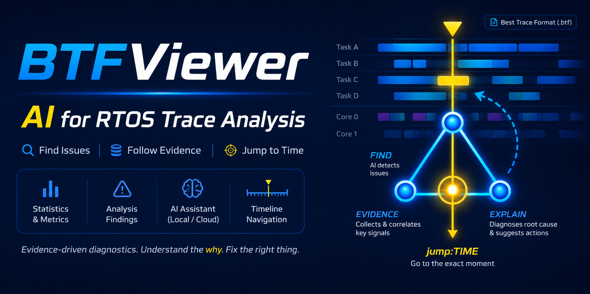

# BTF Trace Viewer

**版本 1.4.0 — Desktop 與 Web**



**BTFViewer 將 BTF trace 轉換成可查證的多核心排程證據，整合直接由 trace 計算的統計、修改前後比較、CI 迴歸檢查，以及選配的 AI 輔助調查。**

BTFViewer 用於分析即時作業系統（RTOS）以 **Best Trace Format**（`.btf`）記錄的 context switch（上下文切換）活動。Desktop 與 Web 版本皆適合在追蹤資料擷取完成後進行分析，並可搭配低階除錯器或目標端 trace recorder（追蹤記錄器）使用。BTFViewer 不會讀取原始碼或 ELF 檔，也不會模擬 RTOS 排程器；所有判讀都以 trace 中實際記錄的事件為依據。


[開啟線上示範](https://apps.kuoping.com/btf_viewer.html?demo)

<a id="why-btfviewer" name="why-btfviewer">&#x200B;</a>

## BTFViewer 的優勢

BTFViewer 的設計重點，是縮短從發現時序異常到取得可查證、可重現證據所需的時間。

- **每項結論都能回到 trace 查證：** 所有統計資料與 Analysis Findings 均由實際記錄的 BTF/STI 事件計算，並保留指標定義、限制及對應的時間軸位置，不需直接接受無法檢查的分析結果。
- **直接呈現多核心行為：** 專用檢視與統計不只顯示工作在何時執行，還能找出負載不均、同時運作的核心數、工作核心親和性、核心遷移頻率、核心往返（ping-pong）遷移，以及頻繁使用的核心間路徑。
- **比較是分析流程的一部分：** 可同時開啟多份 trace、量測修改前後的差異與分布變化、儲存基準，並透過 Desktop CLI 在自動測試或 CI 中執行迴歸檢查。
- **AI 以量測資料為依據：** 選配的 AI Assistant 可協助初步分類、深入調查、驗證原因、評估啟發式實驗，以及說明 trace 比較結果。Statistics 面板與時間軸仍是判斷依據。若 AI Assistant 連接本機模型（例如 Ollama），提供給 AI 的分析證據只會在本機處理，不會傳送到外部雲端服務。
- **容易執行與分享：** Desktop 與 Web 採用相同的分析流程。單一檔案 Web 版本與雙語導覽示範，讓使用者不需安裝專用分析工具，也能檢視或展示 trace。

<a id="features" name="features">&#x200B;</a>

## 功能

| 類別 | 提供的功能 |
|---|---|
| **時間軸與測量** | 依工作或 CPU 核心檢視、水平或垂直版面、縮放、平移、搜尋、游標、書籤及註解 |
| **統計與問題診斷** | 使用率、執行時間、阻塞時間、派送延遲、抖動、搶佔、核心遷移、互斥鎖（mutex）、號誌（semaphore）、佇列（queue）、截止期限（Deadline）及異常分析 |
| **Trace 比較** | 多分頁工作階段、修改前後差異、分布比較、儲存基準及實驗驗證 |
| **AI Assistant** | 分析結果分類、指定範圍調查、證據驗證、啟發式 **What-if** 分析及比較結果說明 |
| **匯出與自動化** | PNG、SVG、CSV、HTML、Perfetto、選取的 BTF 範圍，以及可用於指令稿與 CI 的 Desktop CLI |
| **學習與分享** | 單一檔案 Web 應用程式，以及提供英文或繁體中文語音的 8 核心導覽示範 |

<a id="documentation" name="documentation">&#x200B;</a>

## 文件

| 文件 | 用途 |
|---|---|
| `README.md` | 安裝 BTFViewer 並了解主要功能 |
| [WORKFLOWS_zh-TW.md](WORKFLOWS_zh-TW.md) | 依照步驟進行問題調查 |
| [STATISTICS_zh-TW.md](STATISTICS_zh-TW.md) | 了解統計指標的定義、公式與判讀方式 |
| [AI_zh-TW.md](AI_zh-TW.md) | 設定及使用 AI 輔助調查 |
| [demos/README.md](demos/README.md) | 建立及維護導覽示範 |

若是第一次使用 BTFViewer，請先閱讀[快速開始](#quick-start)，再依照[基本分析流程](#basic-analysis-workflow)操作。需要詳細步驟或指標定義時，再查閱其他文件。

<a id="quick-start" name="quick-start">&#x200B;</a>

## 快速開始

### Desktop 應用程式

系統需求：

- Python 3.8 以上版本，建議使用 Python 3.9 以上版本。
- PySide6 6.4 以上版本。以下指令會一併安裝此套件與其他相依套件。

```bash
cd BTFViewer
pip install -r requirements.txt
python builds/btf_viewer.py trace.btf
```

請將 `trace.btf` 換成實際的追蹤檔案路徑。若未指定檔案，BTFViewer 會還原上一次的工作階段。也可以透過 **File → Open**、**File → Open Recent** 或拖放方式開啟檔案。

### Web 應用程式

使用現代瀏覽器開啟單一 HTML 檔案：

```bash
open BTFViewer/builds/btf_viewer.html
```

也可以直接按兩下該檔案，或使用[線上示範](https://apps.kuoping.com/btf_viewer.html)。一般情況下不需要架設本機伺服器。

若要重新建置 Web 應用程式：

```bash
cd BTFViewer
make web
```

### 支援的檔案格式

| 格式 | 說明 |
|---|---|
| `.btf` | Best Trace Format |
| `.btf.gz`、`.gz` | 經 Gzip 壓縮的 BTF 追蹤檔 |
| `.btf.bz2`、`.bz2` | 經 Bzip2 壓縮的 BTF 追蹤檔 |
| `.btf.zip`、`.zip` | 含有一份或多份 BTF 追蹤檔的壓縮檔；每份檔案會在個別分頁中開啟 |
| `.xml` | Web 應用程式使用的示範指令稿 |
| `.xtf` | 包含指令稿、追蹤資料及選用語音的可攜式示範套件 |

`tracedata/` 內提供範例追蹤檔，包括 `example-2cores.btf.gz`。

<a id="guided-demo" name="guided-demo">&#x200B;</a>

## 導覽示範

`demo_8cores` 套件使用 8 核心追蹤資料與語音說明，示範主要分析流程。初次使用時，建議先執行此示範，熟悉介面及分析順序後，再開啟要分析的追蹤檔。

### 執行示範

Desktop：

```bash
cd BTFViewer
make demo
make demo DEMO_LANG=zh-tw
```

也可以直接開啟以下任一套件：

```bash
python builds/btf_viewer.py demos/demo_8cores/demo_8cores.xml
python builds/btf_viewer.py builds/demo_8cores.xtf
```

Web：

- 選取工具列上的 **Demo**，載入內建導覽。
- 開啟 `demo_8cores.xtf`，或將它拖放至 BTFViewer。
- 開啟示範 XML 檔案，並在系統要求時選取其套件資料夾。

預設語音為英文。可從示範列的 **Voice** 選單選取其他語言。按 **Space** 可暫停或繼續；在 2.5 秒內按兩次 **Esc** 可停止示範。

### 建置可攜式示範套件

```bash
make demo-pack
make demo-pack DEMO_LANGS=en,zh-tw
make demo-pack DEMO_LANGS=all
python3 scripts/demo_pack.py demos/demo_8cores --list-voices
```

產生的 `builds/demo_8cores.xtf` 包含指令稿、追蹤資料及選取的語音檔，可在 Desktop 或 Web 應用程式中開啟。

Web 的 **Record** 功能使用瀏覽器畫面擷取。若要錄下語音，請選取目前的分頁，並啟用分頁音訊。

套件結構、語音產生、錄影、XML 動作及示範 API 的詳細說明，請參閱 [demos/README.md](demos/README.md)。

<a id="viewer-controls" name="viewer-controls">&#x200B;</a>

## BTFViewer 操作

Desktop 與 Web 應用程式採用相同的主要操作流程。平台差異會在相關段落中說明。

目標調查路徑：

```text
SEE → TRIAGE → SCOPE → INVESTIGATE
```

每一步都應能清楚知道：目前 Trace、**Scope**、**Filters**、檢視模式（View Mode）、**Selection** 與 **Highlight**。

### 調查用語（Investigation terminology）

| 用語 | 意義 |
|---|---|
| **Full Trace** | 未以游標定義時間窗；分析使用整段擷取 |
| **Scope** | 目前分析的時間範圍（**Full Trace** 或 **C1–Cn · duration**） |
| **Filter** | Scope 內的資料子集（Task、Core 或 Migration）。以 **×** 或 **Clear All** 清除 |
| **Selection** | 鎖定以供檢查的物件（持續）。本身不會改變分析輸入 |
| **Highlight** | 暫時視覺強調（例如圖例懸停）。不會改變分析輸入 |
| **Fit Trace** | 將視窗縮放至完整擷取（`Ctrl+0` / `F`） |
| **Fit Cursors** | 將視窗縮放至最早–最晚游標區間（`Ctrl+R`） |
| **Baseline / Candidate** | Trace Compare 中的 Trace A 與 Trace B |
| **Regressed / Improved** | 比較判定：指標相對基準變差或變好 |

**Selection** 與 **Highlight** 不會默默變成 **Filter**。檢視模式（**Task** / **Core**）與 Selection、Highlight、Filter 彼此獨立。

### 調查狀態（Investigation context）

狀態列會持續顯示調查狀態，不必再開其他面板：

- **Scope：** `Full Trace`，或游標範圍啟用時的 `C1–Cn · span`。
- **Filter 晶片：** Task Filter、Core Filter（`Core: N of M`）、Migration Filter（`Migration: X→Y`），各自可按 **×**。**Clear All** 清除全部 Filter。
- **Zoom：** 相對縮放（以及有顯示時的物理刻度）。

當任何 Filter 縮小分析子集時，Statistics 會顯示對應的 **Filtered:** 指示。Filter 會依 Analysis 分頁保留。

### 主要控制項目

工具列分組對應常見路徑：**Open** → Zoom / Fit → 檢視模式 → 調查入口（**Find**、Heatmap、**Analysis**、**Compare**）。較少用的動作放在功能表（Desktop）或溢位選單（Web）。

| 控制項目 | 用途 |
|---|---|
| **Open** | 開啟 BTF trace 或示範套件 |
| **Task / Core** | 每個工作顯示一列，或依 CPU 核心分組顯示活動 |
| **Horizontal / Vertical** | 切換時間軸方向 |
| **Zoom in / Zoom out / 1:1 / Fit Trace / Fit Cursors** | 調整可見的時間範圍 |
| **Load** | 顯示或隱藏 CPU 負載圖 |
| **Heatmap** | 檢視工作遷移及核心移動情形 |
| **Analysis** | 開啟目前 **Scope** 內自動產生的分析結果 |
| **Compare** | 比較兩份以上已開啟的 trace |
| **Find** | 搜尋工作、事件、核心遷移、時間區段或同步物件 |
| **Settings** | 設定顯示方式、版面、游標及 AI 選項 |

Web 工具列另外提供 **Demo**、**Record** 及 **About**。視窗較窄時，部分控制項目會移至 **More**。

### Task View 與 Core View

| 檢視模式 | 用途 |
|---|---|
| **Task View** | 追蹤各工作在所有核心上的執行情形 |
| **Core View** | 查看各核心執行的工作；核心可以展開或收合 |

**Task View** 適合檢查工作的執行及核心遷移情形；**Core View** 適合檢查使用率、閒置時間及負載分配。切換檢視模式會保留時間軸位置、Zoom、游標與 Scope。

在 **Core View** 中，圖例的 **Cores** 核取清單即為 **Core Filter**：取消勾選的核心會從 Timeline Core View 列、CPU Load 圖、狀態列晶片、Statistics **Filtered:** 狀態與 AI 內容中排除。

### 縮放、Selection 與 Highlight

- 使用滑鼠滾輪平移。按住 **Ctrl** 再捲動可縮放。
- 按住 **Shift** 再捲動可切換平移軸向。
- 在 macOS 上可使用觸控板的雙指開合手勢縮放。
- 在時間軸上按住滑鼠中鍵拖曳，可放大選取的時間範圍。
- 選取 **Fit Trace** 或按 `Ctrl+0` / `F` 可顯示完整擷取。**Fit Cursors** / `Ctrl+R` 會縮放至最早與最晚游標（C1–Cn）之間。在示範指令中，`<zoom_view/>` 使用 Fit Trace；若已有游標，`<fit_view/>` 則使用 Fit Cursors。顯示完整 trace 時，**Zoom out** 會停在 Fit Trace，且無法繼續縮小。
- 選取 **1:1** 可回到設定的縮放密度。
- **懸停**圖例或時間軸區段為 **Highlight**（暫時）；**點選**工作標籤或圖例為 **Selection**（持續）。兩者都不會套用 Filter。
- 將游標停在時間軸區段上，可查看工作、核心、起迄時間與持續時間。

### CPU 負載

選取 **Load**，在時間軸下方顯示使用率圖。拖曳分隔線可調整圖表大小。

當工作為目前 **Selection** 時，**Task View** 可顯示該工作在各核心上的使用率。可利用此畫面確認工作是否依預期分配，或是否過度頻繁地在核心之間移動。

### 游標與 Scope

游標標記時間點，並定義量測與 **Scope**。BTFViewer 預設支援四個游標；可在 **Settings** 中調整數量上限。游標線帶有依主題調整的對比光暈，避免與鄰近區段顏色混淆；重疊標籤依游標槽位堆疊，不會互相覆蓋。

| 操作 | 方法 |
|---|---|
| 放置游標 | 點選時間軸，或按 `C` 將游標放在目前畫面中央 |
| 移動游標 | 拖曳游標線 |
| 移除游標 | 點選游標線附近，或使用快顯功能表 |
| 清除所有游標 | 按 `Shift+C`，或按住 Shift 再按滑鼠右鍵 |
| 對齊事件邊界 | 按住 Shift 再點選 |

請在需要檢查的區段前後至少放置兩個游標。啟用 Statistics 的 **Limit to C1–Cn**，計算會使用最早–最晚區間；狀態列 Scope 會立即更新。**Fit Cursors**（`Ctrl+R`）只顯示此區段；**Save selection as BTF** 可將該區段匯出為較小的 trace。

### Marks、書籤、註解與 Find

| 工具 | 用途 |
|---|---|
| **Cursor** | 暫時量測／調查點 |
| **Bookmark** | 儲存位置以便稍後返回 |
| **Annotation** | 綁定 Trace 時間點的人工註解 |
| **Find** | 尋找工作、核心遷移、STI 事件、時間區段、生命週期事件及同步物件 |

Marks 面板依序為 **Cursors**、**Cursor Range**，再是 **Marks**（書籤與註解）。使用 **Export Marks** / **Import Marks** 與 **Export Session** / **Import Session**。已知類型時避免泛稱「Marker」。

按 `Ctrl+F` 開啟 Find。狀態顯示 **`k of N matches`**。使用 Previous/Next、`F3`、`Shift+F3` 在結果間移動時不會改變 Scope 或 Filters。Match Mode 說明放在工具提示中。在時間軸上按滑鼠右鍵可操作游標與標記。

### 多份 trace

每份 trace 會在個別分頁中開啟，並保留各自的縮放比例、游標、標記及 Filters。

- `Ctrl+Tab`：下一個分頁
- `Ctrl+Shift+Tab`：上一個分頁
- `Ctrl+W`：關閉目前分頁

Desktop 會從原始路徑還原檔案。Web 最多可從瀏覽器儲存空間還原八份已封裝的 trace。無痕瀏覽、儲存空間限制或清除網站資料，都可能使還原功能無法使用。

<a id="basic-analysis-workflow" name="basic-analysis-workflow">&#x200B;</a>

## 基本分析流程

第一次檢查時，請依照以下順序操作：

1. 開啟 trace，並選取 **Fit Trace** 查看完整時間範圍。
2. 選取 **Load**，確認所有核心是否分擔合理的工作量。
3. 開啟 **Analysis**，先查看嚴重程度最高的分析結果（Triage）。
4. 在結果上選 **Investigate**，開啟對應 Statistics 區段（保留 Scope 與 Filters）。
5. 選取偏高數值或離群值，跳至時間軸上的對應事件。
6. 在問題區段前後放置游標，確認狀態列 **Scope: C1–Cn**，並啟用 **Limit to C1–Cn**。
7. 檢查工作、核心、搶佔、阻塞、同步或核心遷移的詳細資料。
8. 必要時，請 AI Assistant 說明或驗證量測證據。

請從量測證據開始，不要先假設原因。確認時間軸與 Statistics 中的行為後，再下結論。詳細流程請參閱 [WORKFLOWS_zh-TW.md](WORKFLOWS_zh-TW.md)。

<a id="analysis-and-statistics" name="analysis-and-statistics">&#x200B;</a>

## 分析與統計（Analysis and Statistics）

BTFViewer 的所有結果都由已記錄的 BTF 事件計算而來。它不會檢查原始碼或 ELF 檔案、不會模擬 RTOS 排程器，也不會估算 trace 中沒有記錄的資料。

### 選擇第一個檢查項目

| 現象 | 先檢查 | 接著檢查 |
|---|---|---|
| 問題不明 | **Analysis Findings** | 分析結果所列的 Statistics 項目 |
| Tick 抖動或 tickless 行為 | **Trace Health (TICK)** | 執行時間離群值 |
| SMP 負載不均 | **Core Utilisation** | 同時運作的核心數，再檢查核心遷移 |
| 排程器成本過高 | **Kernel Switch Overhead** | 核心時間分布 |
| 工作執行緩慢 | **Execution Time** | 搶佔及互斥鎖活動 |
| 等待時間過長 | **Blocking Time** | 互斥鎖擁有者及搶佔活動 |
| 就緒後仍延遲執行 | **Dispatch Latency** | 阻塞及搶佔 |
| 優先權反轉 | **Priority Inheritance** | 互斥鎖配對及阻塞 |
| 頻繁在核心間移動 | **Core Migrations** | 負載平衡、核心遷移熱圖及互斥鎖跨核心移動（mutex bounce） |
| 鎖或佇列問題 | **Mutex / Semaphore / Queue** | 阻塞及核心遷移 |

統計指標的詳細定義與公式請參閱 [STATISTICS_zh-TW.md](STATISTICS_zh-TW.md)。

### 分析結果（Analysis Findings）

選取 **Analysis**，查看目前 **Scope**（**Full Trace** 或 **C1–Cn**）內的可能問題。分析結果可能包括負載不均、執行時間熱點、阻塞、優先權反轉、頻繁的核心遷移、錯過截止期限、Tick 健康狀態問題，以及同步物件在核心間移動等情形。

每項結果包含：

- 清楚的 **Severity** 與問題導向標題。
- 最相關的支持指標。
- 由量測 `evidence_text` 產生的 **Evidence** 列（觀察結果，與詮釋文字分開）。
- **Investigate** — 界定 Finding 並開啟對應 Statistics 區段，不需 AI。
- **Show Evidence** — 保留給跨介面 Evidence Navigation（該流程完成前為停用）。
- 若已設定 AI，可使用 **Investigate…** / **Auto investigate…** 等選項。

請將 Finding 視為線索，而非已確認的根因。若 Finding 建議有用的時間窗，請套用游標後再於該 Scope 內重查 Statistics。

對於可量測使用率的多核心 trace，核心平衡分析會顯示 **Load Balance Score** 與相關分布數值。分數越高，表示工作分配越平均。判斷分配方式是否適合目前工作負載前，仍應檢查時間軸及核心遷移資料。

### Max、p95 與 p99 的判讀方式

- **Max** 是量測到的最大值，用於尋找觀察期間內最差的事件。
- **p95** 表示 95% 的樣本不超過此數值。它能反映正常運作中較慢的一段，同時避免結果被單一罕見事件主導。
- **p99** 表示 99% 的樣本不超過此數值。它可找出平均值可能掩蓋、但仍會重複發生的嚴重延遲。

p95 很重要，因為只看平均值無法完整判斷即時效能。即使平均值良好，仍可能反覆出現緩慢事件。請一起比較 p95、p99 與 Max，以區分常見的尾端延遲和較少發生的極端值。

### 核心遷移檢查

判讀核心遷移次數前，請先檢查負載平衡。SMP 排程器可能會將工作移至閒置核心以分配負載，因此出現一定程度的核心遷移是正常現象。

確認負載平衡後，再檢查工作是否過度頻繁地在核心間移動。頻繁的核心遷移可能增加 L1 快取未命中（cache miss）。在 Xtensa 處理器上，核心遷移也可能降低延遲上下文切換（lazy context switching）的效益：工作移至另一個核心時，可能必須儲存協同處理器暫存器（coprocessor registers），因而增加上下文切換開銷。

請一併檢查 **Task View**、各核心負載、**Core Migrations** 及核心遷移熱圖。若偏高的核心遷移次數同時伴隨快取行為變差、上下文切換開銷增加、延遲升高或負載分配不穩，才具有較明確的分析意義。

### 比較已開啟的 trace（Comparing open traces）

開啟兩份以上的 trace 時，可以使用 **Compare** 查看使用率、核心遷移、執行時間、阻塞時間、回應時間（Response Time）、同步活動及錯過截止期限（Deadline Miss）等差異。

這是選用的比較工具，不是基本分析流程的必要步驟。使用時，應比較相同的工作負載階段與量測範圍。

<a id="ai-assistant" name="ai-assistant">&#x200B;</a>

## AI Assistant

選配的 AI Assistant 可說明 BTFViewer 量測出的 Analysis Findings（分析結果）與 Statistics（統計資料）。它不能取代時間軸驗證，也無法補出 trace 中未記錄的量測資料。

建議操作方式：

1. 選取一項分析結果，或使用游標定義時間範圍。
2. 請 AI Assistant 調查或說明該項結果。
3. 查看 AI 引用的統計資料與時間軸證據。
4. 使用 **Verify with AI** 檢查提出的原因是否成立。
5. 若實際修改系統，請擷取新的 trace，並重複相同範圍的量測。

可用的內容層級包括 **Compact**、**Balanced** 及 **Full evidence**。Compact 可減少 token 使用量，預設值為 Balanced。可在 **Settings → AI** 中設定模型、服務端點（endpoint）、驗證方式、內容層級、隱私選項及回覆語言。

匯入 `examples/ai/presets.json`，可取得 Ollama、OpenAI、Gemini、DeepSeek 及 Grok 的範例設定。使用本機 Ollama 不需要 API 金鑰（API key）。若使用雲端模型，BTFViewer 會將分析所需的統計摘要與證據傳送給對應的服務供應商；處理敏感資料時，請視需要啟用匿名化及敏感資料選項。

設定、隱私、模型選項、工具、疑難排解、CLI 測試及評估方式的詳細說明，請參閱 [AI_zh-TW.md](AI_zh-TW.md)。

<a id="export" name="export">&#x200B;</a>

## 匯出

| 輸出格式 | Desktop | Web |
|---|---|---|
| 含註記的 PNG | Snapshot editor（快照編輯器） | Snapshot editor（快照編輯器） |
| 目前畫面圖片 | 複製到剪貼簿 | 複製到剪貼簿 |
| SVG | **Save SVG** | **Save SVG** |
| Perfetto JSON | **Export Perfetto** | **Perfetto** |
| 選取的 BTF 範圍 | **Save selection as BTF** | 下載選取範圍 |
| 統計報告 | CSV 或 HTML | CSV 或 HTML |
| Trace 比較結果 | CSV 或 HTML | CSV 或 HTML |

<a id="desktop-command-line" name="desktop-command-line">&#x200B;</a>

## Desktop 命令列

Desktop CLI 與圖形介面使用相同的分析引擎。在沒有顯示器的環境中執行時，請設定 `QT_QPA_PLATFORM=offscreen`。

| 指令 | 用途 |
|---|---|
| `info` | 顯示追蹤資料摘要 |
| `report` | 產生統計報告 |
| `compare` | 比較兩份 trace |
| `analyze` | 在 CI 中以基準檢查候選 trace |
| `ai-test` | 執行 AI 證據與驗證測試 |
| `migrations` | 將核心遷移表匯出為 CSV |
| `snapshot` | 儲存時間軸、核心遷移或指標圖片 |
| `perfetto` | 匯出 Chrome Trace JSON |
| `slice` | 將選取的時間範圍儲存為較小的 BTF 檔案 |

```bash
python builds/btf_viewer.py info trace.btf
python builds/btf_viewer.py report trace.btf -o report.html --format html
python builds/btf_viewer.py compare before.btf after.btf -o diff.html
python builds/btf_viewer.py analyze candidate.btf --baseline baseline.btf --fail-on-regression
python builds/btf_viewer.py snapshot trace.btf -o view.png --view timeline
python builds/btf_viewer.py perfetto trace.btf -o trace.json
python builds/btf_viewer.py slice trace.btf -o window.btf --lo 100000 --hi 500000
```

執行 `python builds/btf_viewer.py <command> -h` 可查看所有選項。

<a id="settings" name="settings">&#x200B;</a>

## 設定

從工具列開啟 **Settings**，或按 `Ctrl+,`。

| 區域 | 選項 |
|---|---|
| **Appearance** | 佈景主題、字型及色盲友善色盤 |
| **Display** | 面板、時間軸疊加資訊、CPU 預算及工作截止期限 |
| **Layout** | 標籤寬度、列高、縮放密度、游標數量上限、時間精度及圖表大小 |
| **AI** | 啟用狀態、內容層級、隱私、服務供應商、模型、驗證方式及回覆語言 |

Desktop 將設定儲存在 BTFViewer 旁的 `btf_viewer.rc`；Web 則儲存在瀏覽器的 `localStorage`。變更會立即預覽；選取 **OK** 儲存，或選取 **Cancel** 還原先前的設定值。

<a id="keyboard-and-mouse" name="keyboard-and-mouse">&#x200B;</a>

## 鍵盤與滑鼠操作

### 常用快速鍵

| 按鍵 | 動作 |
|---|---|
| `Ctrl+O` | 開啟檔案 |
| `Ctrl+W` | 關閉目前分頁 |
| `Ctrl+Tab` / `Ctrl+Shift+Tab` | 切換分頁 |
| `Ctrl++` / `Ctrl+-` | 放大，或縮小至 Fit Trace |
| `Ctrl+0` / `F` | Fit Trace（完整擷取） |
| `Ctrl+R` | Fit Cursors（最早–最晚游標區間） |
| `Ctrl+F` / `F3` / `Shift+F3` | 搜尋、下一個結果或上一個結果 |
| `Ctrl+G` | 跳至指定時間點 |
| `Ctrl+K` | 開啟指令選單（command palette） |
| `C` / `Shift+C` | 放置游標或清除所有游標 |
| `Ctrl+B` | 新增書籤 |
| `A` | 新增註解 |
| `Ctrl+S` | 開啟 Snapshot editor（快照編輯器） |
| `Ctrl+Shift+S` | 儲存 SVG |
| `Ctrl+Shift+E` | 匯出 Perfetto JSON |
| `?` | 顯示 Web 快速鍵 |

### 滑鼠操作

| 操作 | 結果 |
|---|---|
| 滑鼠滾輪 | 平移 |
| Ctrl+滾輪 | 縮放 |
| 在背景按住滑鼠左鍵拖曳 | 平移 |
| 按住滑鼠中鍵拖曳 | 縮放至選取範圍 |
| 按住 Ctrl 並以滑鼠左鍵拖曳 | 測量兩點之間的時間 |
| 點選時間軸 | 放置游標 |
| 拖曳游標或標記 | 移動游標或標記 |
| 按滑鼠右鍵 | 開啟快顯功能表 |

<a id="build-and-test" name="build-and-test">&#x200B;</a>

## 建置與測試

一般使用者不需要執行本節中的操作。

| 工作 | 指令 |
|---|---|
| 建置 Desktop 與 Web | `make -C BTFViewer` |
| 建置 Desktop 套件 | `make -C BTFViewer bundle` |
| 建置 Web 應用程式 | `make -C BTFViewer web` |
| 執行導覽示範 | `make -C BTFViewer demo` |
| 執行 Desktop 測試 | `make -C BTFViewer test` |
| 執行 Web 測試 | `make -C BTFViewer test-web` |
| 執行所有測試 | `make -C BTFViewer test-all` |
| 建置 PDF 文件 | `make -C BTFViewer doc` |
| 從原始碼執行 | 在 `BTFViewer/` 中執行 `python -m btf_viewer_pkg trace.btf` |

Desktop 原始碼位於 `btf_viewer_pkg/`，Web 原始碼位於 `web/`。修改原始碼時，請一併提交 `builds/` 下重新產生的檔案。共用解析器與統計結果會使用 `tests/fixtures/` 下的測試資料進行檢查。

BTF 欄位定義請參閱上層目錄中的 `TRACE_FORMAT.md`。

<a id="contributors" name="contributors">&#x200B;</a>

## 貢獻者

感謝所有為本專案提供貢獻的人員。

| 貢獻者 | 貢獻內容 |
|---|---|
| [DiogoRoseira](https://github.com/DiogoRoseira) | CPU 負載圖（CPU Load Graph）與指標分布圖 |
