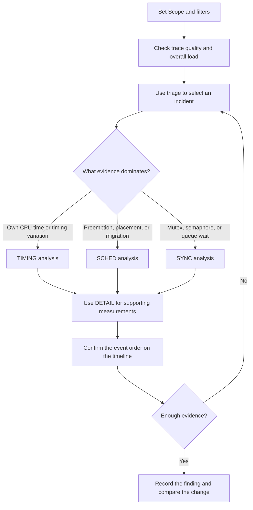
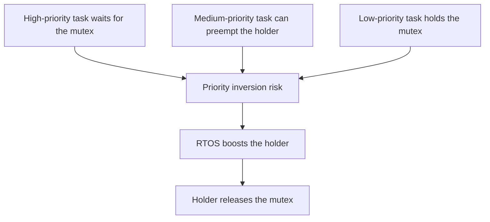

# BTFViewer Statistics Reference 

This document is both a statistics reference and an analysis tutorial. It explains what BTFViewer measures, how each value is calculated, when to use it, which other statistics are required for confirmation, and what the result cannot prove. It focuses on analysis rather than implementation.

Use [README.md](README.md) for product operation, [WORKFLOWS.md](WORKFLOWS.md) for step-by-step investigations, and [AI.md](AI.md) for AI-assisted analysis.

## How to use this reference

BTFViewer calculates statistics from the BTF/STI events present in a trace. A result describes the selected **Scope** and active filters, not necessarily the complete system run.

Before interpreting a value:

1. Confirm whether the Scope is **Full Trace** or a cursor range.
2. Check active task, core, and migration filters.
3. Compare **Avg** with tail values such as **p95**, **p99**, and **Max**.
4. Return to the timeline to inspect the events behind an unusual value.
5. Compare equivalent workload phases when using two traces.

Some values are measured directly from recorded events. Others are marked as **estimated** or **heuristic**, meaning they are inferred from observable events because the trace does not contain an explicit kernel event. An estimate is useful evidence, but it is not a guarantee.

The Statistics panel is most useful when it is treated as a path back to evidence. A table can identify a task, core, object, or time range that deserves attention. The timeline then shows what actually happened around that sample.

### Basic terms

| Term | Meaning |
|---|---|
| **Task** | A schedulable unit of work. Some RTOSes use the term *thread*. |
| **Core** | A processor core that can run one task at a time. |
| **Slice** | One continuous period during which a task runs on a core. |
| **Off-CPU** | Time when a task is not running. It may be ready, blocked, suspended, or waiting for its next activation. |
| **STI event** | Optional software trace instrumentation that records events such as task resume, mutex access, queue access, intervals, or tags. |
| **p95 / p99** | The value at or below which 95% / 99% of samples fall. These values describe the tail more reliably than the average alone. |
| **Jitter** | Variation in timing. BTFViewer commonly reports the observed range, `Max − Min`. |
| **CV** | Coefficient of variation, `standard deviation ÷ average`. It compares variation across metrics with different scales. |

### Measurement model

BTFViewer first reconstructs continuous task execution slices from the scheduling events in the trace. Most statistics are then derived from the start and end times of these slices, optional STI events, or both.

For a task with slices `S1 ... Sn`, slice `Sk` has a start time `s_k`, end time `e_k`, duration `d_k = e_k - s_k`, and core `c_k`. These values form several related sample sets:

| Sample set | Calculation | Main use |
|---|---|---|
| Execution | `d_k = e_k - s_k` | On-CPU work per scheduling slice |
| Off-CPU gap | `g_k = s_(k+1) - e_k` | Time between consecutive slices |
| Inter-arrival | `a_k = s_(k+1) - s_k` | Activation spacing and periodicity |
| Migration | `c_(k+1) != c_k` | Core movement between slices |
| Switch gap | Next slice start on a core minus the previous slice end | Unaccounted time around a switch |
| Dispatch latency | Next switch-in minus a recorded ready event | Ready-to-run delay when a ready point exists |
| Interval duration | `interval_stop - interval_start` | Instrumented application operation |

These sets are related but not interchangeable. For example, an off-CPU gap can contain preemption, blocking, suspension, or a normal wait until the next periodic activation. It should not automatically be called mutex blocking or scheduling latency.

### Scope, filters, and sample boundaries

Every statistic is calculated from the current **Scope** and active filters.

- **Full Trace** uses the complete captured time span.
- **C1–Cn** uses the selected cursor range. Slices crossing a boundary may be clipped to the range for time accounting.
- A task filter limits the tasks included in the calculation.
- A core or migration filter limits the visible scheduling evidence.

Always record the Scope when comparing results. A 10 ms start-up phase and a 10 s steady-state phase describe different workloads even if they come from the same trace.

Boundary effects are especially important for gaps, intervals, mutex holds, queues, and lifecycle events. A start event may be outside the Scope while its matching end event is inside it. An unmatched event near a boundary may therefore indicate partial capture rather than an application error.

### Common summary values

For samples `x_1 ... x_n`, BTFViewer uses the following concepts throughout the Statistics panel:

| Value | Calculation or meaning | How to use it |
|---|---|---|
| **Count / Runs** | Number of valid samples | Check whether the result has enough evidence |
| **Total** | `sum(x_i)` | Understand accumulated cost in the Scope |
| **Min / Max** | Smallest / largest observed sample | Locate extremes; not proven BCET or WCET |
| **Avg** | `sum(x_i) / n` | Describe the centre when the distribution is not strongly skewed |
| **Median / p50** | Middle ordered sample | Describe a typical sample with less sensitivity to outliers |
| **p95 / p99 / p99.9** | Ordered nearest-rank sample at index `ceil(n × p) − 1` | Describe increasingly rare tail delays |
| **Jitter / Spread** | `Max - Min` | Show the absolute observed range |
| **Standard deviation (σ)** | Population standard deviation, dividing the squared-distance sum by `n` | Measure absolute dispersion around the average |
| **CV** | `σ / Avg` | Compare relative variation across different scales |
| **Rate** | Count divided by a time or event base | Compare traces of different lengths |

Samples are sorted before percentiles are selected. For example, p95 uses the sample at `ceil(n × 0.95) − 1`, with the index limited to the valid range. Percentiles require enough samples. With 10 samples, p99 is effectively the maximum and does not describe a stable one-percent tail. Always read the sample count before treating a high percentile as representative.

**Trace resolution.** Execution Time and Blocking Time show a note when a large share of samples are at or below one unit of the trace's display scale (`us` → 1 µs, `ms` → 1 ms) — the grid the exported timestamps sit on. When that share is high, percentiles near that value describe the timestamp grid rather than task behavior; use a finer capture clock or an instrumented Interval for those cases.

In task tables, **CPU%** normally means `task on-CPU time ÷ Scope wall-clock duration × 100`. IDLE and TICK tasks are omitted from user-task rankings, but they are not subtracted from the denominator. On a multicore system, CPU% values across tasks can therefore add to more than 100%.

### Direct, derived, estimated, and configured results

The confidence of a result depends on its source:

| Type | Examples | Interpretation |
|---|---|---|
| **Direct** | Slice start/end, core ID, STI tag value | Recorded evidence |
| **Derived** | Execution time, CPU share, inter-arrival, migration count | Deterministic calculation from recorded evidence |
| **Estimated / heuristic** | Response time, mutex waiter–owner handoff, task-health score | Useful screening evidence with stated assumptions |
| **Configured comparison** | Deadline and CPU budget violations | Valid only when the configured threshold matches the application requirement |

Do not combine metrics with different confidence levels as if they were equally exact. Use a heuristic to locate an episode, then confirm it with direct or instrumented evidence when possible.

## Analysis workflows

The following workflows show how statistics should be combined. They are not rigid checklists; begin with the question you need to answer and follow the evidence.

### Statistics panel scope and controls

The Statistics tab is available in the right-side panel. Its header shows **Full Trace** or the active **C1–Cn** cursor range. When a task, core, or migration filter is active, the panel shows a **Filtered** indicator. Scope and filters apply to the calculated samples, so they must be checked before any value is interpreted.

Place at least two cursors and enable **Limit to C1–Cn** to recalculate Statistics and Analysis Findings for that time range. The toolbar **C1–Cn** chip (before the right-hand icons) uses the Statistics Scope colour when Limit is on and the muted Detail colour when it is off. Click it to toggle. Clear the cursor range to return to Full Trace. Restricting the range is useful for separating start-up, steady-state, overload, and recovery phases.

| Control | Action |
|---|---|
| **+** | Expand all sections |
| **−** | Collapse all sections; pinned sections remain open |
| Reset order | Restore `OVERVIEW → TRIAGE → TIMING → SCHED → SYNC → DETAIL` |
| Section title / chevron | Expand or collapse one section |
| **⠿** grip | Drag a section to another position |
| Pin | Keep a section open when Collapse All is used |

Section order, pins, expanded state, and table heights are retained across launches. Reordering changes presentation only; it does not change a section's category or calculation.

### From a statistic back to evidence

Supported tables and charts provide direct navigation:

- Click a row or task name to highlight the related task or open its distribution.
- Click Min, Max, p50, p95, or p99 to jump to the corresponding captured sample.
- Click an anomaly, worst event, or critical-path episode to zoom and place evidence cursors.
- Click a synchronization issue to jump to the related STI event.
- Click a core-time bin, migration pair, or matrix cell to inspect the matching time range.

A navigation action does not make the selected event a root cause. It only connects the summary value to the evidence that produced it.

### Exported statistics reports

**Export HTML** uses the current Scope and creates a self-contained review report with search, sorting, Problems only, and Show all on each statistics table. The report includes:

- Analysis Scope, trace metadata, filters, and timestamp origin;
- diagnostic KPIs and Analysis Findings;
- the same Statistics tables, grouped table of contents, and section notes;
- search, sorting, Problems only, and Show all for each statistics table; and
- an SVG load-balance gauge under Core Utilisation.

The HTML report can identify where to investigate, but it cannot preserve every interactive timeline action. Keep the source trace when another reviewer may need to verify an event.

### Analysis flow

Use this flow to move from the full trace to a testable explanation. The categories narrow the problem; the timeline confirms the event order.



The flow is intentionally iterative. If supporting data does not confirm the first explanation, return to triage and test the next plausible cause.

### Using Analysis Findings

Toolbar **Analysis** provides a heuristic inbox for the current Scope. It stays open while the timeline remains interactive. Each finding separates the measured **Evidence** from the interpretation:

- **Investigate** opens the related Statistics section without changing Scope or filters.
- **Show on timeline** centers the timeline on the supporting timestamp and can highlight the related task. It never changes Scope or Filters.
- Severity ranks attention; it does not assign failure probability.
- Each finding shows an **evidence-strength** label (Direct / Derived / Estimated / Configured) with tooltips where applicable.

### Analysis Context strip

Findings, AI, and Compare show the full **Analysis Context** strip (trace name, **Scope**, **Filters**, sample count). The Statistics panel keeps Scope and Filters in its header; when cursors are placed but **Limit to C1–Cn** is off, it shows only a short note: **Not limited to cursors**. **Clear filters** remains available. Selection and Highlight are never listed as analysis constraints.

When Scope or Filters change after results were calculated, Findings and AI may mark content **stale** and offer **Recalculate with current context**. The Statistics panel recalculates automatically when Scope or Filters change (same as Desktop).

### Symptom shortcuts

**Where should I start?** is an optional guide on the Statistics toolbar (Desktop and Web). It stays closed by default so familiar users see tables immediately. Open it to pick a symptom card (unknown issue, late task, spike, dispatch delay, blocking, jitter, load imbalance, migration, sync, deadline); each jumps to the first recommended metric. **Recommended from Findings** appears when a finding maps to a symptom.

Use a finding to select the next measurement, not as the conclusion. Confirm the sample count, related distribution, and timeline event order before recording a root cause.

### Workflow A — first review of an unfamiliar trace

1. Set the Scope to a meaningful workload phase.
2. Open **Trace Health** and confirm that the captured TICK pattern and gaps are plausible.
3. Check **Core Utilisation**, **Core Time Breakdown**, and **Concurrent Core Active Distribution** for overall load and missing time.
4. Use **Timeline Anomalies**, **Worst Events**, and **Task Health** to choose a task or time range.
5. Inspect the relevant **Execution**, **Blocking**, **Response**, or **Period** distribution.
6. Return to the timeline and place cursors around the selected sample.
7. Use scheduling or synchronization statistics to explain what happened inside that range.

### Workflow B — investigate a latency spike

1. Find the task in **Response Time**, **Worst Events**, or **Timeline Anomalies**.
2. Compare Avg, p95, p99, and Max. A large gap between p95 and Max suggests a rare episode; a high p95 suggests a recurring tail.
3. Split the episode into own execution and off-CPU time with **Execution Time**, **Blocking Time**, and **Critical Path**.
4. If own execution grew, inspect **Distribution Explorer**, **Intervals**, and relevant Tags.
5. If off-CPU time grew, inspect **Dispatch Latency**, **Preemption Matrix**, **Mutex Blocking**, and **Core Migrations**.
6. Confirm the event order on the timeline. Use an instrumented Interval when an exact end-to-end boundary is required.

### Workflow C — investigate an unstable periodic task

1. Use **Period / Jitter** to find missed, extra, or burst activations.
2. Open **Inter-Arrival Time** and compare the median, p95, and Max.
3. Check **Unified Jitter** to determine whether variation comes mainly from execution, off-CPU gaps, response, or dispatch.
4. Check **Core Utilization Over Time** for load bursts at the same time.
5. Check **Preemption**, **Mutex Blocking**, and **Migrations** for interference.
6. If the application defines an explicit period or deadline, compare against that requirement rather than only the observed median.

### Workflow D — investigate multicore load balance or migration

1. Confirm that load balancing and task migration are enabled by the RTOS design. Migration is not expected for pinned tasks.
2. Use **Core Utilisation** and **Core Utilization Over Time** to distinguish a persistent imbalance from a short phase.
3. Use **Task × Core** to identify which tasks contribute to each core.
4. Use **Core Migrations** and **Core-Pair Migration Summary** to find frequent moves and bounce paths.
5. Validate the allowed placement with **Core Affinity**.
6. Correlate migration with **Execution**, **Response**, **Switch Overhead**, and **Preemption**. A migration count alone does not measure its cost.

### Workflow E — investigate synchronization delay

1. Confirm that the trace contains the required STI take/give or send/receive events.
2. Use **Mutex / Semaphore** or **Queue** to check pairing quality before using derived wait values.
3. Use **Mutex Blocking** to rank likely contention by task and object.
4. Use **Waiter × Owner** to identify the task pairs involved in repeated handoffs.
5. Use **Priority Inheritance** to look for priority boosts and possible inversion patterns.
6. Verify the exact take/give order on the timeline. Heuristic handoffs are not a kernel wait queue.

### Workflow F — validate a change with Trace Compare

1. Select equivalent workload phases in Baseline A and Candidate B.
2. Confirm compatible instrumentation, task naming, time units, and core configuration.
3. Compare normalized values such as CPU%, events/s, and migrations/s before totals.
4. Compare tail values, not only averages.
5. Return to each trace and inspect the samples responsible for the change.
6. Treat a difference as a regression only when it exceeds normal run-to-run variation and matters to a requirement.

## Statistic dependency map

The table below identifies the strongest dependencies. “Requires” describes the evidence needed to calculate a statistic. “Confirm with” lists related statistics that usually help explain it.

| Statistic | Requires | Confirm with |
|---|---|---|
| Core Utilisation | Per-core slices and Scope duration | Core Time Breakdown, Task × Core, Core Time |
| Trace Health | TICK events | Core Breakdown, Timeline |
| Task Health | Several timing and scheduling statistics | The component section selected by the score |
| Anomalies / Worst / Patterns | Derived sample sets | Timeline and the named source statistic |
| Response Time | Consecutive task slices | Execution, Blocking, Dispatch, Interval |
| Execution Time | Slice start/end | Distribution, Interval, Tags |
| Dispatch Latency | Ready STI/create plus switch-in | Preemption, Core Time, Timeline |
| Blocking Time | Consecutive task slices | Preemption, Mutex Blocking, Period |
| Critical Path | Response windows and overlapping evidence | Execution, Blocking, Preemption, Migration |
| Period / Inter-arrival | Consecutive activation starts | Unified Jitter, Deadline, Core Time |
| Activation Latency | Activation starts plus fitted period T | Period / Jitter, Dispatch Latency, Ready-Gap |
| Ready-Gap (Starvation) | Off-CPU gaps, same-core overlap, STI take/suspend | Preemption Chain, Priority, Mutex Blocking |
| Migration statistics | Consecutive slices and core IDs | Affinity, Task × Core, Switch Overhead |
| Idle Analysis | Per-core IDLE segments clipped to scope | Core Utilisation, Ready-Gap, Blocking Time |
| Queue Backlog / Semaphore Level | STI give/send and take/recv per object | Mutex / Semaphore, Dispatch Latency, Ready-Gap |
| Preemption statistics | Off-CPU gaps plus same-core overlap | Priority, Core Time, Timeline |
| Switch Reason Breakdown | Off-CPU gaps, same-core overlap, STI take/suspend | Preemption Matrix, Preemption Chain, Priority |
| Scheduling Load Over Time | Per-core slice starts and utilisation bins | Core Utilization Over Time, Task × Core, Core Utilisation |
| Mutex statistics | STI synchronization events | Waiter × Owner, Priority, Timeline |
| Queue statistics | STI queue events | Tags, Intervals, Timeline |
| Intervals / Tags | Application STI events | Execution, Response, Timeline |
| Deadline / CPU Budget | Configured thresholds plus slices | Execution, CPU share, Period |

## Advanced analysis tutorials

The following tutorials restore the worked explanations from the earlier guide. They complement the per-section reference below.

### Migration investigation

Before treating migration as a problem, confirm that the RTOS configuration permits load balancing. A task pinned to one core should not migrate; an unpinned task may legitimately move when the scheduler balances ready work.

Use this sequence:

1. Confirm load balance. An SMP scheduler may move tasks to idle cores, so some migration is expected.
2. Open **Core Migrations** and rank by Rate, Dwell, and Ping rather than Count alone.
3. Open the **Migration & Corridor Inspector**. The workspace has three columns: **Core path**, **migration heatmap**, and **Topology**, sized **1 : 2 : 1** by default. Drag the pane dividers to resize; Desktop stores the layout in `btf_viewer.rc` and Web stores it in localStorage. Path-table columns are resizable (drag the header dividers); widths stay fixed when you click a header to sort. Topology has Circle and Matrix views (icons stay at the top right). Traces with more than 16 cores open in Matrix. Click a heatmap cell to show **Path info** in the right column. Topology and Path info share that column and are exclusive.
4. Check ping-pong, median dwell, and short-dwell share on the selected path.
5. Treat **Handoff** as a synchronization-ownership heuristic, not a measured cache-line transfer.
6. Inspect the relevant timeline window with **Show events**. **Filter Timeline** is a persistent task filter; Inspector filters stay local.

**Analysis Scope** defaults to **Follow zoom**: Fit (or ≥ 92% of the trace) is **Full Trace**; a zoomed-in window is **Viewport** and follows pan/zoom. Lock **Full Trace** or **Viewport** from the menu, or choose **Cursor C1–Cn** when at least two cursors are placed. If fewer than two cursors are placed, Cursor C1–Cn is disabled.

The Inspector overview shows scope, load-balance status, migration count and rate, the most affected task, the hottest path, and the main concern (None / Burst / Ping-pong / Short dwell / Handoff suspect). Use **Show Top 5 / 10 / 25 / All paths** rather than a percentage cutoff. The Core path table lists Rate, Count, Ping, Dwell, Handoff, Net, and Share (hover a header for the full name). Click a column header to sort the path list and heatmap together; click again to reverse. **Investigate with AI** sends that structured context on the `migrations` template; it does not filter the timeline or move cursors unless you choose a viewer action.

A corridor is evidence of repeated placement, not proof of cache cost. Cache misses, lazy coprocessor context invalidation, and additional register saves require processor-specific evidence.

### Priority inheritance and the L/M/H pattern

Priority Inheritance appears when the trace contains a create priority and later priority events. Supported event meanings are:

| Event | Meaning |
|---|---|
| `priority_inherit Name[id] pri:N` | A mutex holder inherited priority `N` |
| `priority_disinherit Name[id] pri:N` | The holder returned toward its base priority |
| `set_priority Name[id] pri:N` | The application or RTOS explicitly changed priority |

A boost episode is a continuous interval during which effective priority is above the create priority:

```math
T_{boosted} = \sum_j (t_{end,j} - t_{start,j})
```

**Boosts** is the number of episodes, **Peak** is the highest observed priority, and **Boosted** is their total duration.

The classic **L/M/H** pattern contains:

- **L:** a low-priority task holding a mutex;
- **H:** a high-priority task waiting for that mutex; and
- **M:** runnable work with priority strictly between L and H.

Without inheritance, M can delay L while H waits. With inheritance, the RTOS raises L toward H so L can release the mutex. In BTFViewer, an orange band means a boost without the L/M/H pattern; a red band means mutex inheritance or an L/M/H-related pattern.



The viewer finds a possible medium blocker by looking for a known base priority strictly between Base and Peak. This is supporting geometry, not proof that the medium task ran during every boost. Confirm the mutex object, task activity, and switch order on the timeline.

### Mutex, semaphore, and queue pairing

Synchronization events are grouped by object pointer so that different objects on the same STI channel remain separate.

| Object pattern | Pairing direction | Typical meaning |
|---|---|---|
| Mutex | `take → give` | Ownership / hold duration |
| Semaphore used as a resource | `take → give` | Resource residency |
| Semaphore used as a signal | `give → take` | Posted signal consumed later |
| Queue | `send → receive` | Recorded producer-to-consumer interval |

For completed hold spans `τ_h`, average hold time is:

```math
AvgHold = \frac{1}{N} \sum_h \tau_h
```

Review pairing quality before using hold or blocking results. Important issues include orphan give, cross-task give, unmatched take, unmatched signal, deletion while held, and an object still held at the end of the capture. A mutex taken on one core and given on another is reported as a core-boundary bounce. It may imply cache-line movement, but the trace does not measure the hardware cost.

**Waiter × Owner** and **Mutex Blocking** are derived from successful handoffs. They do not reconstruct blocked attempts or the RTOS wait queue. Use them to rank likely contention, then verify the take/give order and task states on the timeline.

### Interval and Tag instrumentation

Use an **Interval** when one task can record a clear start and stop for an operation. Current interval notes include the interval ID and task ID, allowing different tasks to reuse the same numeric ID without cross-pairing. Legacy notes without a task ID can be ambiguous when concurrent tasks use the same ID.

| Trace pattern | Suitable for |
|---|---|
| `interval_start` / `interval_stop` on the same task | Loop iteration, handler, critical region, or complete job |
| Consecutive values on one Tag channel | Timing across tasks or ISRs |
| Tag value samples | Queue depth, free memory, sensor value, application state |

Completed intervals provide Count, Min, Avg, Max, Jitter, σ, p50, p95, and p99. Unmatched events near the Scope boundary are excluded and may reflect partial capture. Recursive or overlapping use of the same interval ID should be avoided unless the instrumentation contract defines the nesting order.

Tag values have application-defined units. The viewer can summarize and plot the numeric payload, but it cannot infer whether `10` means bytes, messages, degrees, or a state code. Document each channel and correlate value changes with timeline events.

### Reading scatter plots, histograms, and CDFs

All three views use the same selected sample set:

| View | Preserves time order? | Main question |
|---|---:|---|
| Scatter | Yes | When did a spike, trend, or mode change occur? |
| Histogram | No | Which value ranges contain most samples? |
| CDF | No | What percentage of samples is at or below a value? |

On a CDF, the horizontal axis is the metric value and the vertical axis is cumulative percentage. The curve begins near 0% and rises toward 100%. A steep rise indicates a tight cluster; a gradual rise indicates a wider distribution or long tail.

| Reference | CDF interpretation |
|---|---|
| p5 | 5% of observed samples are at or below this value |
| p50 | Half of the samples are at or below the median |
| p95 | 95% are at or below this value; 5% are above it |
| Avg | A mean reference line; it does not correspond to a fixed cumulative percentage |

Use Linear scale for compact distributions, p5–p95 to focus on the main population while retaining edge buckets, and Log duration when short and long samples differ by orders of magnitude. The scale changes only the horizontal mapping; it does not change the samples or percentiles.

For a deadline `D`, read the CDF height at `D` to estimate the observed completion percentage. This is a result for the selected Scope, not a future guarantee or a proof of worst-case timing.

### Trace Compare reading order

Trace Compare is most reliable when read in this order:

1. Confirm file identity, Scope, tick mode, task matching, core count, and validation warnings.
2. Use span-normalized Summary rows when capture lengths differ.
3. Review the regression result on the **Summary** tab for differences that exceed both absolute and relative thresholds.
4. Open the related detail table and compare tail values. Click a column header to sort; click again to reverse.
5. Return to both timelines and verify the events behind the difference.

Task rows are matched by display name (`Name[id]`). A changed ID can prevent a logical match. A dash means unavailable, not zero. CPU and utilisation differences use percentage points (`pp`).

Useful comparison groups include Summary, Top Tasks, Core Util, Core Migrations, Execution, Blocking, Inter-Arrival, Preemption, Sync, Response, Mutex, Shared Patterns, and Trends. Exported reports include the full tables rather than only the dialog preview.

#### Example: fixed tick compared with tickless idle 

Capture the same workload once with a fixed tick and once with tickless idle. Keep TICK instrumentation, workload duration, and build options otherwise equivalent.

| Compare item | What to check |
|---|---|
| Context switches and `/s` | Whether suppressed idle ticks reduce scheduler activity |
| Tick mode, count, gaps, and CV | Whether the two policies were actually observed |
| Core gap, utilisation, and load balance | Whether idle and busy phases are comparable |
| Migrations and core pairs | Whether wake-up policy changes task placement |
| Execution, Blocking, Response tails | Whether power savings affect latency budgets |
| Preemption and Top Tasks | Which work absorbs tick or wake-up overhead |

Tickless behavior is easiest to see in an idle-heavy cursor range. In a fully busy phase, context-switch and tick counts can remain similar. If a supposed tickless capture still shows regular TICK events, investigate kernel eligibility and ready-list behavior before blaming the trace or viewer.

## Stable Help links

Each Statistics section has a stable anchor in this form:

```text
STATISTICS.md#statistics-<section-id>
```

The `<section-id>` is the same identifier used by the Statistics panel. English and Traditional Chinese documents use identical anchors, so the application can select the appropriate file without changing the fragment.

| Category | Section IDs in default order |
|---|---|
| **OVERVIEW** | `cores`, `health`, `task_health` |
| **TRIAGE** | `anomalies`, `worst`, `patterns` |
| **TIMING** | `response`, `exec`, `dispatch`, `block`, `crit_path`, `period`, `jitter`, `inter` |
| **SCHED** | `task_core`, `core_time`, `migrations`, `core_pairs`, `affinity`, `preempt_matrix`, `preemption`, `priority`, `concurrency` |
| **SYNC** | `mutex_block`, `wait_owner`, `sync`, `queue` |
| **DETAIL** | `core_breakdown`, `switch_overhead`, `tasks`, `distrib`, `intervals`, `tags`, `lifecycle`, `deadline` |

The categories describe an investigation purpose:

- **OVERVIEW** summarizes overall condition.
- **TRIAGE** identifies where to investigate first.
- **TIMING** explains task latency, execution, and variation.
- **SCHED** explains multicore placement and scheduling behavior.
- **SYNC** explains waits and synchronization objects.
- **DETAIL** provides supporting measurements and instrumented data.

## 1. OVERVIEW — overall condition 

Start here to understand system load, trace quality, and which tasks may need attention.

<a id="statistics-cores" name="statistics-cores"></a>
### Core Utilisation (excl. IDLE/TICK) 

**What it tells you**

Shows the percentage of the current Scope during which each core runs a user task. IDLE and TICK activity are excluded from the busy percentage.

The **Load Balance Score** summarizes how evenly work is distributed across active cores. A high score means similar utilisation; a low score means work is concentrated on fewer cores. The score does not indicate whether the system is overloaded—a system can be evenly busy or evenly idle.

Use this section to find heavily loaded cores and uneven placement. Confirm the cause with **Task × Core**, **Core Migrations**, and **Core Affinity**.

**Calculation.** For each core, BTFViewer sums the overlap between user-task slices and the Scope, then divides by the scoped duration. IDLE and TICK slices are excluded from the busy numerator. The load-balance score is `100 × (1 − Gini coefficient)` for the per-core utilisation values. A score near 100 means a more even distribution; it is not an available-capacity score.

**How to use it.** Compare the busiest and least busy cores, then open **Core Utilization Over Time** to see whether the difference persists. Use **Task × Core** to identify the tasks behind the load. A low score can be correct when affinity intentionally reserves a core or the workload contains a serial stage.

<a id="statistics-health" name="statistics-health"></a>
### Trace Health (TICK) 

**What it tells you**

Uses the time between consecutive TICK events to assess tick regularity and identify a periodic or tickless pattern.

| Value | Meaning |
|---|---|
| **Mode** | `TICK` for regular intervals or `TICKLESS` for wider variation associated with suppressed idle ticks |
| **Avg period / Max gap** | Typical and longest observed TICK interval |
| **CV** | Relative variation of TICK intervals |
| **Missed ticks (est.)** | Approximate number of nominal periods covered by unusually large gaps |

A large gap can come from tickless idle, a long critical section, CPU pressure, or missing trace data. A `GOOD` status describes the observed TICK pattern; it is not a complete performance verdict.

**Calculation.** Consecutive TICK timestamps form the interval samples. The average, maximum, CV, and typical interval are calculated from that set. The missed-tick estimate compares unusually large intervals with the nominal period; it does not prove that the hardware tick failed.

**How to use it.** Establish whether the trace is periodic or tickless before treating a large gap as an error. Correlate the gap with **Core Time Breakdown**, CPU load, and the timeline. If all event types disappear in the same range, suspect capture loss; if tasks continue but TICK events disappear, investigate tick suppression, interrupt masking, or instrumentation.


<a id="statistics-task_health" name="statistics-task_health"></a>
### Task Health 

**What it tells you**

Combines measured execution variation, blocking tails, period behavior, migration, deadline results, and CPU share into a 0–100 screening score.

Use the score to prioritize tasks for inspection. It is not an AI probability, a failure probability, or proof of a root cause. Open the related Statistics section before drawing a conclusion.

**Calculation.** The score starts at 100 and subtracts the following heuristic penalties. A component uses the more severe of its applicable checks.

| Component | Warning | Fail | Penalty (warning / fail) |
|---|---|---|---|
| Execution | CV `≥ 0.5` or `Max / Avg ≥ 3` | CV `≥ 1.0` or `Max / Avg ≥ 8` | 10 / 20 |
| Blocking | CV `≥ 0.6` or `Max / Avg ≥ 4` | CV `≥ 1.2` or `Max / Avg ≥ 10` | 10 / 20 |
| Period | CV `≥ 0.15` or at least one estimated miss | CV `≥ 0.4` or at least three estimated misses | 8 / 16 |
| Migration | `migration count / execution-slice count ≥ 0.3` | Ratio `≥ 0.7` | 8 / 16 |
| Deadline | — | At least one configured violation | 30 |
| CPU share | CPU% `≥ 80` | CPU% `≥ 95` | 8 / 16 |

The final score is limited to 0–100. The thresholds are screening rules chosen by BTFViewer, not RTOS requirements. Missing components are not treated as confirmed failures.

**How to use it.** Open the score band or contributing metric with the strongest warning. Check its sample count and distribution, then inspect the corresponding event. A lower score can also result from richer instrumentation or a larger sample set, so compare tasks in context.

## 2. TRIAGE — where to investigate first 

These sections reduce a long trace to a short list of events and recurring problems.

<a id="statistics-anomalies" name="statistics-anomalies"></a>
### Timeline Anomalies 

**What it tells you**

Lists unusual long tails, bursts, CPU spikes, idle gaps, mutex waits, and deadline misses in the current Scope. Each row identifies the event type, affected task, time, and reason it was selected.

Click a row to inspect the evidence on the timeline. An anomaly means “worth checking”; it does not prove a defect.

**Selection logic.** The section searches available sample sets for long tails, bursts, spikes, gaps, repeated migration or preemption, mutex-wait estimates, and configured deadline violations. Each row retains the source statistic and a timestamp.

**How to use it.** Start with severe or repeated rows, but remember that one physical episode may create several related anomalies. Place C1–C2 around the episode and analyse the related timing, scheduling, and synchronization rows together.

<a id="statistics-worst" name="statistics-worst"></a>
### Worst Events 

**What it tells you**

Collects the longest execution, blocking, inter-arrival, and estimated response episodes in one table.

Use it when the first question is “Where is the largest observed delay?” A maximum is only the worst sample captured in this Scope; it is not a guaranteed worst-case bound.

**Calculation.** BTFViewer takes the largest valid samples from execution, off-CPU gap, inter-arrival, and heuristic-response sets, retaining the task and time boundary for each sample.

**How to use it.** Compare Max with p95 and p99. A Max far above p99 suggests a rare episode; high p95, p99, and Max suggest a persistent tail. Longer traces have more opportunities to contain an extreme, so do not compare Max alone across runs.

<a id="statistics-patterns" name="statistics-patterns"></a>
### Recurring Patterns 

**What it tells you**

Groups repeated anomaly types by task and points to the worst instance of each group.

Repeated events are more likely to represent a systematic condition than a single isolated sample. Their cause still needs confirmation from timing, scheduling, or synchronization evidence.

**Calculation.** Anomalies with the same task and type are grouped. The table reports recurrence and retains the worst representative instance.

**How to use it.** Prefer patterns that recur across several workload cycles. Inspect the worst instance and at least one other instance to verify a consistent event order. Pair this section with **Period / Jitter** for periodic recurrence and **Core Utilization Over Time** for phase-related recurrence.


## 3. TIMING — task latency and variation 

These sections describe when a task runs, how long it runs, and how long it waits. The metrics observe different boundaries and should not be treated as interchangeable.


<a id="statistics-response" name="statistics-response"></a>
### Response Time 

**What it tells you**

Estimates a ready-to-completion window from adjacent task slices. For later slices, the window starts when the previous slice ends and finishes when the current slice ends; the first slice uses its execution duration.

This is a **heuristic response time**, not an explicit release/completion pair recorded by the kernel. Use an instrumented interval when an exact application response boundary is required.

Tail percentiles are usually more useful than the average for latency-sensitive work. Click a percentile or extreme value to inspect the corresponding episode.

For later slices, the calculation can be written as:

```math
R_k = s_k - e_{k-1} + d_k = e_k - e_{k-1}
```

It includes the off-CPU gap before the current slice and the current execution duration. Compare it with **Execution Time** and **Blocking Time** to see which part dominates. Use **Dispatch Latency** when an STI ready point exists, and an instrumented **Interval** for an exact request-to-response boundary.


The following distribution for `CS[11]` illustrates how to read the metric beyond the table. A steep CDF at short durations means most estimated responses are short; the sparse points to the right form the latency tail. Compare p95 and p99 with the application requirement, then jump to the corresponding samples to determine whether execution or the preceding off-CPU gap dominates.

![Response time distribution for CS[11] in example-8cores.btf.gz](../images/stats/stats-response-cs11.svg)

<a id="statistics-exec" name="statistics-exec"></a>
### Execution Time Per Slice 

**What it tells you**

Measures each continuous on-CPU slice:

```math
d_k = t_{end,k} - t_{start,k}
```

**Runs** is the number of slices. **CPU%** is the task's on-CPU time divided by the Scope wall-clock duration. **Jitter** is the observed `Max − Min` range.

Long slices may coincide with computation, critical sections, lock ownership, or disabled interrupts, but timing alone cannot identify the cause. **Max** is an observed maximum, not a proven WCET; **Min** is not a proven BCET.

**Calculation.** A complete slice inside the selected range forms an execution-duration sample. CPU time accounting clips slice overlap to the Scope before calculating CPU%. A preempted application operation may appear as several Runs, so a Run is not necessarily one job or request.

**How to use it.** Use Avg or p50 for typical cost, p95/p99 for recurring tails, and Max to locate the largest captured slice. If preemption can divide one operation, use **Interval Analysis** to measure the whole operation. Correlate long slices with Tags, mutex holds, and timeline activity.

In this example, the scatter reveals when longer slices occur, while the histogram and CDF show whether they are common or limited to a small tail. A log-scaled duration axis may be selected when short and long samples span a wide range.

![Execution time distribution for CS[11] in example-8cores.btf.gz](../images/stats/stats-exec-cs11.svg)

<a id="statistics-dispatch" name="statistics-dispatch"></a>
### Dispatch / Scheduling Latency 

**What it tells you**

Measures the delay from a recorded ready point to the next switch-in:

```math
L_{dispatch} = t_{switch-in} - t_{ready}
```

The ready point comes from a task create or STI resume event. Synchronization-object wakeups cannot be assigned to a task when the trace does not record the woken task ID. Therefore, this section covers only activations with a known ready point.

**Pairing.** A ready event is paired with the next switch-in of the same task. An event without a later switch-in in the Scope does not form a completed sample. Multiple ready events before one switch-in can make attribution ambiguous.

**How to use it.** A high tail means the task was known to be ready but did not run promptly. Check **Preemption Matrix**, task priorities, and **Core Utilization Over Time**. Wakes without a task ID require application instrumentation or direct timeline inspection.

The distribution for `SR0[271]` demonstrates a lifecycle task with create, suspend, and resume samples. Use it to distinguish a consistently slow dispatch path from a few isolated scheduling delays.

![Dispatch latency distribution for SR0[271] in example-8cores.btf.gz](../images/stats/stats-dispatch-sr0.svg)

<a id="statistics-block" name="statistics-block"></a>
### Blocking Time (off-CPU gap) 

**What it tells you**

Measures the positive gap from one slice ending to the task's next slice starting:

```math
g_k = t_{start,k+1} - t_{end,k}
```

The task may be ready, blocked, suspended, preempted, or waiting for its next period during this gap. The metric therefore shows **off-CPU time**, not the exact RTOS state and not end-to-end response time.

**Calculation.** Each pair of consecutive slices produces one positive gap. Scope boundaries can remove either side of a pair, so the sample count may change when the Scope changes.

**How to use it.** Compare the gap with **Inter-Arrival Time** and the expected period. A long gap can be normal when a task sleeps between activations. If the task should remain ready, inspect **Preemption**, **Dispatch Latency**, and CPU load. If synchronization events overlap, inspect **Mutex Blocking** and **Waiter × Owner**.

In this example, large gaps cluster in particular time regions. That pattern is a prompt to inspect concurrent high-priority work or synchronization evidence; it is not, by itself, proof of lock contention.

![Blocking time distribution for CS[11] in example-8cores.btf.gz](../images/stats/stats-block-cs11.svg)

<a id="statistics-crit_path" name="statistics-crit_path"></a>
### Critical Path 

**What it tells you**

Shows the longest estimated ready-to-completion windows and how much time overlaps task execution, off-CPU waiting, preemption, and migration.

**Preempt**, **Wait**, and **Migration** can overlap. Do not add them as if they were separate parts of **Duration**. This is an investigation view, not a kernel-recorded dependency graph.

**Calculation.** BTFViewer selects long heuristic response windows, sums the task's own on-CPU overlap as Exec, and treats the remainder as Off-CPU. It then attaches preemption, wait, and migration evidence that overlaps the window. The annotations can describe the same time simultaneously.

**How to use it.** Follow the dominant evidence: execution distribution for high Exec, preemption and load for Off-CPU, synchronization views for waits, or migration views for core changes. Confirm the event order on the timeline.


<a id="statistics-period" name="statistics-period"></a>
### Period / Jitter 

**What it tells you**

Uses inter-arrival samples to estimate periodic behavior. The median interval is the **Expected** period.

| Value | Meaning |
|---|---|
| **Missed** | Interval greater than `1.5 × Expected` |
| **Extra** | Interval less than `0.5 × Expected` |
| **Burst** | Interval less than `0.25 × Expected` |
| **RMS** | Root-mean-square variation from the expected period |

These thresholds describe observed scheduling behavior. They are not application deadlines unless the expected period matches the application's timing contract.

**Calculation.** Expected is the median inter-arrival because it is less sensitive than Avg to a few large gaps. Each sample is classified relative to Expected, while RMS summarizes the overall distance from it.

**How to use it.** Limit the Scope to one operating mode. Start-up, shutdown, or a deliberately variable rate can create misleading classifications. Confirm missed periods with **Inter-Arrival Time**, **Core Utilization Over Time**, and the timeline. Use the application's configured requirement when it differs from the observed median.

<a id="statistics-jitter" name="statistics-jitter"></a>
### Unified Jitter 

**What it tells you**

Places execution, blocking, inter-arrival, estimated response, dispatch, and wake-to-run variation in one table.

The spread (`Max − Min`) shows the absolute range. **CV** shows variation relative to the average, which helps compare metrics with different time scales. High CV with very small absolute times may be less important than moderate CV on a large latency.

**Calculation.** Each row reuses the samples of its source metric. Wake-to-run is a stand-in derived from available response-wait evidence; dispatch includes only explicit ready events.

**How to use it.** Compare both duration and CV. A very small metric can have a high CV without practical impact, while moderate variation on a large delay can break a deadline. Open the source distribution before drawing a conclusion.


<a id="statistics-inter" name="statistics-inter"></a>
### Inter-Arrival Time 

**What it tells you**

Measures the time between consecutive starts of the same task:

```math
\Delta t_k = t_{start,k+1} - t_{start,k}
```

For the same pair of slices, inter-arrival time is approximately the previous execution time plus the following off-CPU gap. Use it to study activation frequency, drift, missed periods, and burst behavior.

**Calculation.** Every pair of consecutive slice starts forms a sample, even after a migration. If one logical activation is split by preemption, the additional slice starts also enter the set. It is therefore a scheduling-slice interval unless instrumentation defines a cleaner release point.

**How to use it.** Use the median and distribution to find the dominant cadence. Compare with **Period / Jitter** for classification and **Blocking Time** for long intervals. For exact application arrivals, record an STI Tag or Interval event at the release point.

The example spans very short and much longer activation gaps, so the duration axis is logarithmic. Compare it with **Blocking Time** carefully: inter-arrival includes the previous execution slice as well as the following off-CPU gap.

![Inter-arrival time distribution for CS[11] in example-8cores.btf.gz](../images/stats/stats-inter-cs11.svg)

<a id="statistics-activation" name="statistics-activation"></a>
### Activation Latency 

**What it tells you**

For each periodic task, how far every actual activation lands from a fitted ideal periodic clock. Inter-Arrival and Period / Jitter measure each release against the *previous* release; a task can drift steadily against the schedule while every gap still looks close to `T`. Activation Latency measures each release against a fixed grid, so accumulating phase error shows up.

**Calculation.** The period `T` is the p50 inter-arrival gap (the same value **Period / Jitter** calls "Expected"). The grid is `anchor + k·T`, anchored at the first activation in the current Scope. For activation `t`, the error is `min_k |t − (anchor + k·T)|` — the distance to the nearest grid point. The Min / Avg / Max / Jitter / σ / p50 / p95 / p99 columns summarise that error distribution, worst (largest Max) first. Needs at least three activations per task.

**How to use it.** A near-zero row is a task locked to the schedule. A large Max with a small p50 is an occasional slip; a p50 that is itself large is steady phase drift — check the task's release path and any lower-priority work delaying it. Compare with **Dispatch / Scheduling Latency** (ready → running) and **Ready-Gap** to see whether the late release is the task itself or the scheduler. Click a row to highlight the task on the timeline.

<a id="statistics-ready_gap" name="statistics-ready_gap"></a>
### Ready-Gap (Starvation) 

**What it tells you**

Per task, the off-CPU time it spent while arguably able to run — a starvation view. Long or frequent ready-gaps mean the task wanted the CPU and did not get it.

**Calculation.** Built on the same off-CPU gap classifier as **Switch Reason Breakdown**. Each gap between two consecutive slices of a task is labelled `preempted` (another task ran on its core), `blocked` (an STI take/recv ended the slice), `suspended` (STI suspend), `period_wait` (only IDLE ran), or `unknown`. Ready-Gap keeps the `preempted` / `blocked` / `unknown` gaps and drops `suspended` / `period_wait`, which are the task voluntarily off-CPU. Columns: gap count, Longest single gap, Total, Avg, p95, and **% preempt** — the preempted share of the total, so you can tell scheduling starvation (high %) from lock contention (low %). Sorted longest-gap first.

**How to use it.** Rank by Longest or Total. A high **% preempt** points at priority or affinity — cross-check **Preemption Chain Analysis** and task priorities. A low **% preempt** means the gap is mostly `blocked`; follow it into **Mutex / Semaphore** and **Waiter × Owner**. `blocked` here is a heuristic (STI take/recv near the slice end), not a kernel-recorded wait. Click a row to highlight the task on the timeline.

## 4. SCHED — multicore scheduling and placement 

These sections explain where tasks run, how they move, and which tasks interfere with one another.

<a id="statistics-task_core" name="statistics-task_core"></a>
### Task × Core 

**What it tells you**

Shows how much of the current Scope each task spends on each core. A task concentrated on one core may be pinned or naturally stable; a task spread across many cores may be load-balanced or frequently migrated.

Use this table with **Core Affinity** and **Core Migrations**. Click a cell to inspect the first matching slice.

**Calculation.** Each cell is the sum of the task's slice overlap on that core within the Scope. Read a row to see a task's placement; read a column to see which tasks consume one core.

**How to use it.** A spread row is not automatically harmful. Check whether the task is allowed to migrate, then use **Core Migrations** to distinguish occasional placement from frequent movement. Compare columns with **Core Utilisation** when investigating imbalance.

<a id="statistics-core_time" name="statistics-core_time"></a>
### Core Utilization Over Time 

**What it tells you**

Divides the current Scope into equal time bins and reports each core's user-task busy percentage in every bin.

The overall utilisation summary can hide short bursts. This section reveals when an imbalance, overload, or idle phase occurred. Click a bin to zoom to that time range.

**Calculation.** The Scope is divided into equal-width bins. For each core and bin, user-task slice overlap is divided by the bin duration. A slice crossing bins contributes only its overlap to each bin.

**How to use it.** Look for bins near saturation, persistent differences between cores, and load changes aligned with a latency spike. Increase the selected Scope for phase analysis or narrow it with cursors for an incident. Use **Task × Core** and the timeline to identify the work inside a hot bin.


<a id="statistics-migrations" name="statistics-migrations"></a>
### Core Migrations 

**What it tells you**

A migration occurs when consecutive slices of the same task run on different cores.

| Value | Meaning |
|---|---|
| **Count** | Number of observed core changes |
| **Rate** | Migrations relative to the task's active time; `/tick` is shown when TICK evidence is available |
| **Dwell** | Average time a task remains on a core before its next scheduling episode |
| **Ping** | Rapid return or bounce between cores |
| **Primary** | Core with the largest share of the task's on-CPU time |

High Count alone is not enough to diagnose a problem. Short Dwell together with high Rate and Ping is stronger evidence of repeated migration. Frequent migration can increase scheduling and cache costs, but the effect depends on the processor and workload.

**Calculation.** Consecutive slices of the same task are compared in time order. A core change creates a migration sample. Count is the number of changes; Primary comes from accumulated on-CPU time. Rate normalizes Count to an available time or TICK base. Dwell and Ping describe how long placement remains stable and how quickly a task returns.

**How to use it.** First confirm that RTOS load balancing permits migration. Rank by Rate and short Dwell rather than Count alone, then inspect **Core-Pair Migration Summary**, **Core Affinity**, and the **Migration & Corridor Inspector**. Compare the migration timestamps with response, execution, and switch-gap tails. The trace cannot directly measure cache refill or coprocessor save cost.


To inspect a migrating task in context, lock-highlight it in Task View and enable per-core CPU Load. If the problem is limited to a time window, zoom the timeline (**Follow zoom** becomes Viewport) or lock Inspector **Analysis Scope** to **Viewport**, or place at least two cursors and select **Cursor C1–Cn**. Statistics **Limit to C1–Cn** is independent: it changes Statistics calculations, not Inspector results, unless you also select Cursor C1–Cn in the Inspector.

![CS[22] highlighted in Task View with per-core CPU Load](../images/stats/tasks-cpu-load-cs22.svg)

The migration plot has three complementary views:

- **Dwell** plots the duration of each on-core run. A concentration of short samples suggests unstable placement.
- **Rate** plots the time since the previous migration. Clusters of short gaps reveal bursts of rapid movement.
- **Gap** plots the positive off-CPU gap immediately after a migration. Compare it with **Blocking Time**, which includes all off-CPU gaps rather than only post-migration samples.

![On-core dwell time distribution for CS[22] in example-8cores.btf.gz](../images/stats/stats-mig-dwell-cs22.svg)

![Time between migrations for CS[22] in example-8cores.btf.gz](../images/stats/stats-mig-rate-cs22.svg)

![Post-migration gap distribution for CS[22] in example-8cores.btf.gz](../images/stats/stats-mig-gap-cs22.svg)

<a id="statistics-core_pairs" name="statistics-core_pairs"></a>
### Core-Pair Migration Summary 

**What it tells you**

Aggregates directed migrations such as `Core_2 → Core_5`. It identifies busy migration corridors, return traffic, and the average gap around a move.

Use it to determine whether migrations are distributed broadly or concentrated between a few cores. A high bounce percentage suggests repeated movement in both directions.

**Calculation.** Each directed migration increments its `from → to` pair. Reverse moves are kept separately; bounce statistics relate traffic in both directions and short returns. Average gap describes observed time around migrations, not a hardware transfer duration.

**How to use it.** A concentrated corridor can point to affinity layout, asymmetric load, or two cores repeatedly exchanging a task. Open the pair plot and correlate it with per-core utilisation. Broad low-rate movement may be normal load balancing.


<a id="statistics-affinity" name="statistics-affinity"></a>
### Core Affinity 

**What it tells you**

Compares the latest recorded affinity mask with the cores on which a task actually ran. **Violations** are slices observed outside the active mask.

Slices before the first recorded affinity setting are treated as unrestricted. Absence of an `affinity_set` event means the viewer cannot verify the configured mask.

**Calculation.** Affinity events update the active mask over time. Each later task slice is checked against the most recent known mask. A slice on a core whose bit is not set is counted as a violation.

**How to use it.** Inspect violations first because they can indicate configuration, instrumentation, ID mapping, or scheduling problems. When there are no violations, use the allowed-core count with **Task × Core** to determine whether the task actually uses the available placement. No event means “unknown,” not “unrestricted by design.”

<a id="statistics-preempt_matrix" name="statistics-preempt_matrix"></a>
### Preemption Matrix 

**What it tells you**

Summarizes overlap between an off-CPU **victim** and tasks that ran on the same core during that gap. Rows and cells help identify the main sources of interference for each victim.

This is evidence of temporal overlap, not proof that one task directly caused another task to block.

**Calculation.** During each victim off-CPU gap, BTFViewer finds task slices that run on the victim's previous core and sums their overlap. The matrix aggregates victim rows and possible preemptor columns.

**How to use it.** Large row totals identify tasks that lose substantial time; large cells identify recurring same-core interference pairs. Check priorities and the switch sequence on the timeline. A victim may have blocked voluntarily while another task happened to run, so the matrix alone does not prove preemption.


<a id="statistics-preemption" name="statistics-preemption"></a>
### Preemption Chain Analysis 

**What it tells you**

Lists victim–preemptor pairs with count, total overlap, average overlap, and maximum overlap.

High total overlap indicates a persistent source of interference; a large maximum indicates a severe single episode. Check task priorities and the timeline before attributing causality.

**Calculation.** This section uses the same overlap evidence as the matrix but presents pair statistics: occurrence count, total, average, and maximum overlap. One off-CPU gap can overlap more than one task.

**How to use it.** Use Total to find sustained interference and Max to locate a severe episode. Compare with **Blocking Time**, **Dispatch Latency**, and **Core Time**. Confirm that the possible preemptor actually switched in as the victim left before calling it causal.

![Preemption chain distribution CS[24] preempted by CS[25] in example-8cores.btf.gz](../images/stats/stats-preempt-cs24-cs25.svg)

<a id="statistics-priority" name="statistics-priority"></a>
### Priority Inheritance 

**What it tells you**

Shows tasks whose observed priority rises above their create priority. Priority inheritance commonly occurs when a high-priority task waits for a mutex held by a lower-priority task, temporarily boosting the holder.

Orange ranges show boosts. A red L/M/H pattern indicates that a medium-priority task ran at a priority between the holder's base and boosted priority. This is supporting evidence; confirm it with mutex and timeline events.

**Calculation.** The create priority is the baseline. Later `set_priority` STI events define changes over time. A value above the baseline is shown as a boost. The L/M/H pattern combines low/base, medium, and high/boosted priority activity observed in the same episode.

**Columns.** `Boosted` is the total time the task spent above its base priority. `Invert (worst)` / `Invert (total)` are the *measured* priority-inversion duration: for each boost episode, the wall-clock time a medium-priority task (base priority strictly between this task's base and peak) actually ran on some core while this task — the resource holder — was off-CPU. Worst is the largest single episode; total is the sum. A dash means no medium task ran during any episode — for an inherited boost that is priority inheritance working (the boost stops medium tasks preempting the holder); a large value means the mechanism was absent or too slow.

**How to use it.** Rank by `Invert (total)` to find where a lock actually caused unbounded inversion, then pair that episode with **Mutex / Semaphore**, **Waiter × Owner**, and **Ready-Gap** for the blocked high-priority task. A priority change can have an application-specific cause; it is not automatically priority inheritance. A boost with a `—` inversion usually shows that mitigation occurred, while a non-zero value shows latency that a working PI mutex would have removed.

![Timeline view: Low[266] with three red priority-inheritance stripes](../images/stats/tasks-priority-low.svg)

![Priority boost distribution chart for Low[266]](../images/stats/stats-priority-low.svg)

<a id="statistics-concurrency" name="statistics-concurrency"></a>
### Concurrent Core Active Distribution 

**What it tells you**

Reports how much of the current Scope had exactly 0, 1, 2, … cores running user tasks at the same time.

This measures **temporal parallelism**. It differs from load balance: cores can have similar total utilisation without running tasks concurrently. Low concurrency may be expected for a serial workload.

**Calculation.** BTFViewer sweeps the Scope boundaries of user-task slices and measures how long the number of simultaneously active cores equals `0 ... N`. The durations should account for the scoped time, subject to trace gaps and clipping.

**How to use it.** Compare the observed distribution with the workload's expected parallelism. High time at one active core in an SMP workload can indicate serialization, affinity restrictions, or insufficient ready work. Use **Core Utilisation**, **Task × Core**, and synchronization statistics to explain it.


<a id="statistics-switch_reason" name="statistics-switch_reason"></a>
### Switch Reason Breakdown 

**What it tells you**

For each task, why it went off-CPU on every context switch in the Scope: **Preempted** (another user task ran on its previous core during the gap — involuntary), **Blocked** (an STI `take` / `recv` on that core ended the slice), **Suspended** (an STI `suspend` for that task), **Period** (only IDLE ran for the whole gap — the task is between activations), or **Other** (no signal — partial coverage, a capture gap, or an unrecorded cause). **Preempt/s** is the involuntary rate, the number most worth ranking on.

Involuntary preemption count is a first-order real-time metric; a high or rising value points to scheduling thrash, an over-tuned tick, or a lock convoy.

**Calculation.** Each off-CPU gap between consecutive slices of a task is classified in that priority order using same-core slice overlap and STI events within ~50 native time units of the slice end. The result is a heuristic screen, not a kernel-recorded reason.

**How to use it.** Rank by **Preempted** or **Preempt/s**. Click a row to highlight that task on the timeline. Confirm a high count against **Preemption Matrix** and **Preemption Chain Analysis** for the interfering tasks, and check task priorities. A high **Period** count is normal for a periodic task that sleeps between jobs.

<a id="statistics-sched_load" name="statistics-sched_load"></a>
### Scheduling Load Over Time 

**What it tells you**

Divides the Scope into equal time bins and reports, per bin, the **context-switch count** and rate (**Ctx sw/s**), the **busiest core**, and the load-balance spread — core-utilisation standard deviation (**Util σ**) and **LB score** (`100 × (1 − Gini)`). It places a switching burst or a load imbalance *in time* rather than only detecting it as a Scope-wide average.

**Calculation.** Bins reuse the Core Utilization Over Time grid (4–32 bins). Context switches per bin are slice starts per core inside the bin. Util σ and LB score use the per-bin per-core utilisation percentages.

**How to use it.** Look for bins with a spike in Ctx sw/s, a persistent low LB score, or a load change aligned with a latency spike elsewhere. Click a row to select that time bin on the timeline, then use **Task × Core** and **Switch Reason Breakdown** to identify the work inside it.

## 5. SYNC — synchronization and waiting 

These sections use STI synchronization events. They appear only when the trace contains the required events.

<a id="statistics-mutex_block" name="statistics-mutex_block"></a>
### Mutex Blocking 

**What it tells you**

Summarizes estimated mutex wait time by task, object, and previous owner. The estimate uses handoff order between distinct acquirers.

Because the trace does not expose the kernel wait queue, this is not an exact record of which task was blocked on the mutex. Use it to locate likely contention and confirm the episode on the timeline.

**Calculation.** Completed holds are ordered by object. When a different task acquires the object after the previous holder, BTFViewer treats the transition as a possible handoff and estimates the waiting interval from the observable hold/acquire sequence. Results are aggregated by possible waiter, object, and previous owner.

**How to use it.** Rank by Total to find accumulated contention and by Max or tail values to find a severe episode. Check **Mutex / Semaphore** pairing quality first. Then use **Waiter × Owner**, **Priority Inheritance**, and the timeline. Treat a value as an upper-level contention estimate, not an exact kernel block time.


<a id="statistics-wait_owner" name="statistics-wait_owner"></a>
### Waiter × Owner 

**What it tells you**

Shows an estimated handoff matrix. The next distinct task to acquire a mutex is treated as the waiter following the previous owner.

Large or frequent cells identify task pairs worth investigating. They do not prove a direct waiter–owner relationship when other unrecorded events occur between acquisitions.

**Calculation.** Rows are possible waiters and columns are previous owners. The next distinct acquirer after a completed hold contributes to the corresponding cell. Re-acquisition by the same task does not establish a cross-task handoff.

**How to use it.** A large cell shows a repeated relationship around one object or set of objects. Open the longest handoff, confirm that the tasks access the same object, and check whether priority and timing support the waiter–owner interpretation.

<a id="statistics-sync" name="statistics-sync"></a>
### Mutex / Semaphore 

**What it tells you**

Pairs take/give events by synchronization-object pointer and reports hold counts, hold durations, core bounce, and pairing issues.

Common issues include an unmatched take, an orphan give, deletion while held, or an object still held at the end of the trace. These may indicate incomplete capture, missing instrumentation, or a real synchronization problem.

**Calculation.** Events are grouped by object pointer and processed in timestamp order. A matching take/give pair forms a hold-duration sample. The current owner and held-object state support orphan, unmatched, delete-while-held, and end-of-trace checks. Nested or recursive behavior is only as accurate as the recorded events allow.

**Columns.** Alongside `Avg hold`, the table reports **p95 hold** / **p99 hold** — the tail of the hold-duration distribution, so one pathological hold shows even when the average looks fine. **Waiters** is the number of distinct tasks that acquired the object while it was already held (a fan-in count); **MaxNest** is the deepest set of simultaneously-open takes seen. Both are computed over the whole trace, not the current Scope. They only register when the capture logs a `take` before the previous holder's `give` — which happens with recursive mutexes or a tracer that logs `take` at the blocking attempt; a tracer that logs `take` only at acquire will show `0` even for a heavily contended lock.

**How to use it.** Resolve pairing problems before trusting hold or blocking estimates. Rank by **p99 hold** to find the objects with the worst hold tail, then a non-zero **Waiters** tells you that tail actually delayed other tasks — follow it into **Mutex Blocking** and **Waiter × Owner**. A **MaxNest** above 1 means lock nesting; check the acquire order against your locking hierarchy for deadlock risk. A long *uncontended* hold (Waiters 0) may be harmless. Combine with task priorities and the timeline.

<a id="statistics-queue" name="statistics-queue"></a>
### Queue 

**What it tells you**

Pairs send/receive events by queue pointer and summarizes completed holds and pairing issues.

The table describes recorded queue activity; it does not reconstruct queue contents or application semantics. Missing or unmatched events may come from a partial Scope or incomplete instrumentation.

**Calculation.** Send and receive events are grouped by queue pointer and paired in recorded order to form completed activity intervals. Without message IDs or queue-content snapshots, the viewer cannot prove which receive consumed which application message in complex producer/consumer patterns.

**How to use it.** Check pairing quality and event rates, then correlate queue activity with **Inter-Arrival**, **Dispatch Latency**, Tags such as queue depth, and end-to-end Intervals. A long send-to-receive interval can include normal batching or consumer scheduling delay.

<a id="statistics-sync_level" name="statistics-sync_level"></a>
### Queue Backlog / Semaphore Level 

**What it tells you**

The running fill level of every queue and semaphore over the Scope, reconstructed from the STI event stream. For a queue this is the message backlog; for a counting semaphore it is the number of available tokens. Peak level flags a producer outrunning its consumer (or a token leak); a rising end-of-scope level is a slow leak.

**Calculation.** Per object pointer, `give` / `send` add 1 and `take` / `recv` subtract 1, with the level floored at 0. **Peak** is the highest level reached, **Time at peak** is how long it sat there, and **End level** is the level at the end of the Scope. **Starved** counts `take` / `recv` events issued while the level was 0 — an attempt that would block (a genuine capacity limit or a lost `give`). Sorted by peak, then starved.

**How to use it.** A high Peak with a large Time-at-peak on a queue means the consumer cannot keep up — check the consumer's **Dispatch / Scheduling Latency**, priority, and **Ready-Gap**. A non-zero End level that grows across runs is a leak. Frequent Starved counts on a semaphore point at a mis-sized token pool or a missing release path. This reconstruction assumes every `give`/`take` is instrumented; unmatched events (see **Mutex / Semaphore** issues) make the level approximate.

## 6. DETAIL — supporting measurements 

Use these sections when the earlier categories identify an area that needs more evidence.

<a id="statistics-core_breakdown" name="statistics-core_breakdown"></a>
### Core Time Breakdown 

**What it tells you**

Splits each core's current Scope into:

| Value | Meaning |
|---|---|
| **Active** | User-task execution time |
| **Idle** | IDLE task time |
| **Tick** | TICK handler time |
| **Gap** | Time not represented by consecutive core slices |

Gap can include scheduling overhead, interrupts, critical sections, trace loss, or resolution limits. It is not automatically kernel overhead.

**Calculation.** Each recorded core slice is clipped to the Scope and classified as Active, Idle, or Tick. Gap is the remaining scoped core time not covered by those categories. Small overlaps or rounding can affect totals at trace resolution.

**How to use it.** Active explains workload, Idle explains unused capacity, and Tick explains recorded tick service. Investigate a large Gap with **Kernel Switch Overhead**, Trace Health, and the timeline. If all cores show a gap at the same time, capture loss or a global event is more plausible than ordinary per-core scheduling.

<a id="statistics-idle" name="statistics-idle"></a>
### Idle Analysis 

**What it tells you**

Per core, how the IDLE time is shaped: the total, the single longest idle stretch, how many separate idle fragments there were, and p95. A large total with a large longest stretch is real headroom; a large total split into many tiny fragments is a core that is busy but constantly waiting. The note reports the longest window where **every** core was idle at once.

**Calculation.** Every IDLE segment in each core's slice list is clipped to the Scope. **Idle total** is their sum, **Longest** the largest single one, **Frags** the count, **p95** the 95th-percentile fragment. The all-cores-idle window is a sweep over all cores' idle intervals for the longest stretch covered on every core simultaneously. Sorted by idle total, most-idle core first.

**How to use it.** Use the total against **Core Utilisation** to size spare capacity. A long all-cores-idle window is fine if nothing was pending — cross-check **Ready-Gap** and **Blocking Time** for the same interval to be sure it was not a system-wide stall. A high fragment count with a small longest stretch usually means fine-grained blocking; follow it into **Switch Reason Breakdown**. Click a row to highlight that core on the timeline.

<a id="statistics-switch_overhead" name="statistics-switch_overhead"></a>
### Kernel Switch Overhead 

**What it tells you**

Measures the gap from one task leaving a core to the next task starting on that core:

```math
O_{switch} = t_{next\ start} - t_{previous\ end}
```

The gap is an observed interval around a switch. It can include scheduler work, interrupt activity, trace overhead, or unrecorded time, so treat it as an upper-level switch-gap measurement rather than a pure kernel instruction cost.

**Calculation.** Consecutive slices on the same core form a sample when the next start follows the previous end. The value is associated with that transition. Overlapping or invalid pairs are excluded.

**How to use it.** Compare cores and tail percentiles, then inspect the largest transition. Correlate with migration, interrupts, TICK, and trace gaps. A larger value after a change can signal more scheduling work, but it cannot isolate the scheduler's instruction cycles without lower-level instrumentation.


<a id="statistics-tasks" name="statistics-tasks"></a>
### Top Tasks by CPU (excl. IDLE/TICK) 

**What it tells you**

Ranks user tasks by `task on-CPU time ÷ Scope wall-clock duration`. IDLE and TICK tasks are not listed.

This ranking shows where processor time is spent. A high share is not necessarily a problem if it matches the workload design.

**Calculation.** A task's clipped slice durations are summed and divided by the Scope wall-clock duration. On multicore traces, the sum across tasks can exceed 100% because several cores can run at the same time. This value is different from per-core utilisation and from a task's percentage of only user-task CPU time.

**How to use it.** Use this as a starting point for CPU optimisation and workload validation. Compare with per-core utilisation and Execution distributions. A low-share task can still be latency-critical, and a high-share task can be healthy when it performs the intended work.

<a id="statistics-distrib" name="statistics-distrib"></a>
### Distribution Explorer 

**What it tells you**

Selects a task and timing metric, then shows sample count, percentiles, variation, a trend summary, and the related histogram/CDF.

- A **scatter plot** reveals trends, bursts, and isolated outliers over time.
- A **histogram** shows how many samples fall in each value range.
- A **CDF** shows the percentage of samples at or below a value.

For example, the CDF crosses p95 at 95%. If a deadline is drawn at that value, about 95% of the observed samples meet it. This is an observation from the current Scope, not a future guarantee.

**How plots relate.** The scatter plot preserves sample order and time; the histogram groups values into bins; the CDF sorts values and shows cumulative probability. The three views use the same selected sample set but answer different questions.

**How to use it.** Start with the CDF to assess tail probability, use the histogram to see whether there are multiple operating modes, and use the scatter plot to locate when the mode or outlier occurred. Confirm the selected metric's definition—especially heuristic response, wake, and blocking—before applying a requirement line.

<a id="statistics-intervals" name="statistics-intervals"></a>
### Interval Analysis 

**What it tells you**

Pairs `interval_start` and `interval_stop` STI events and measures each completed interval:

```math
\tau_j = t_{stop,j} - t_{start,j}
```

Current traces pair by interval ID and task ID, allowing parallel tasks to reuse an interval ID. Unmatched events are excluded. Legacy traces without a task ID can pair concurrent intervals incorrectly.

Use intervals for code regions with explicit boundaries, such as one loop iteration or an end-to-end handler. For timing across different tasks or ISRs, use consecutive samples on a tag channel.

**Pairing and nesting.** The same interval ID can be used by different tasks because task ID participates in current pairing. Completed start/stop pairs become samples; unmatched starts or stops are reported or excluded. Avoid ambiguous recursive use of the same ID unless the instrumentation contract defines how nesting is paired.

**Columns.** Count, Min, Avg, Max, Jitter (`Max − Min`), σ (population standard deviation), p50, p95, and p99 — the same summary set as the slice-based timing tables, so an interval and an execution distribution can be read the same way.

**How to use it.** Intervals are preferable to slice-based response estimates when the application can mark the real operation boundaries. Compare interval tails with Execution and Blocking to determine whether the operation spends time on-CPU or waiting. Keep instrumentation overhead and partial-Scope pairing in mind.


<a id="statistics-tags" name="statistics-tags"></a>
### Tag Analysis 

**What it tells you**

Summarizes numeric values recorded on `tag0_event` … `tag7_event` or `tag_event`. A tag can represent any application-defined value, such as queue depth, free memory, or a sensor reading.

The value axis is not a duration unless the application records a duration. The **Interval** view measures time between consecutive samples on the same channel and can measure a handoff across tasks or ISRs.

**Calculation.** Samples are grouped by tag channel and kept in timestamp order. Value statistics operate on the recorded numeric payload. Inter-sample timing uses consecutive timestamps on the same channel, independent of which task or ISR emitted them.

**Columns.** Count, Min, Avg, Max, Jitter (`Max − Min`), σ, p50, p95, and p99 — computed on the recorded value, not on time. Read them against the channel's documented unit.

**How to use it.** Document each channel's unit and meaning. Use values for state variables such as queue depth or free memory, and inter-sample time for cross-context handoff or event cadence. Correlate a value change with the timeline; the viewer cannot infer application semantics from the number alone.


<a id="statistics-lifecycle" name="statistics-lifecycle"></a>
### Task Lifecycle 

**What it tells you**

Summarizes recorded task create, delete, suspend, and resume events, together with alive span and run count.

Only recorded STI lifecycle events are shown. An absent event may mean the event did not occur, was outside the Scope, or was not instrumented.

**Calculation.** Lifecycle records are grouped by task ID. Alive span uses available create and delete boundaries; run count comes from scheduling slices. Suspend and resume counts use their STI events.

**How to use it.** Check for unexpected creation, deletion, or repeated suspend/resume behavior. Use lifecycle boundaries to avoid interpreting start-up or shutdown as steady state. Missing create events are common when capture begins after tasks already exist.

<a id="statistics-deadline" name="statistics-deadline"></a>
### Deadlines / CPU Budget 

**What it tells you**

Compares observed slice durations and CPU shares with per-task thresholds configured in **Settings → Display**.

- A **deadline violation** means an observed slice exceeded its configured duration threshold.
- A **CPU budget violation** means the task's CPU share exceeded its configured limit in the current Scope.

If no threshold is configured, BTFViewer cannot evaluate compliance. A result of zero violations is meaningful only for configured tasks and the selected Scope.

**Calculation.** Each execution slice is compared with the configured duration threshold. CPU budget compares the task's scoped CPU share with its configured percentage. These checks use the viewer's slice and CPU-share definitions; they do not automatically represent a complete application job or scheduling-server budget.

**How to use it.** Set thresholds from an engineering requirement, not from the same trace being tested. Inspect every violation on the timeline and compare with p95/p99. Use **Interval Analysis** when the deadline applies to a multi-slice operation, and **Period / Jitter** when it applies to activation timing.

## Trace comparison

<a id="statistics-trace-compare" name="statistics-trace-compare"></a>
### Trace Compare 

**What it tells you**

The **Summary** tab shows the regression result (Baseline and Candidate identity, regression and improvement counts, and the largest regression) and the summary metric table. Click a column header to sort any compare table; click again to reverse.

Compares two runs of the same workload. Use Trace A as the baseline and Trace B as the candidate. Keep workload, instrumentation, core count, and capture phase as similar as possible.

When trace lengths differ, prefer normalized values such as `/s`, `%`, and percentage points (`pp`) over raw totals. Task rows are matched by display name (`Name[id]`), so changed task IDs can prevent a logical match.

The comparison uses two delta conventions:

| Location | Formula | Meaning |
|---|---|---|
| Data tables | `Δ = Baseline A − Candidate B` | Positive means A is numerically larger |
| Change charts | `Change = Candidate B − Baseline A` | Positive means the candidate increased |

Always use the metric meaning and the **Improved / Regressed / Changed** status. A positive sign is not automatically good or bad.

**Shape Δ.** The Execution Time, Blocking Time, and Inter-Arrival Time tables add a **Shape Δ** column: the two-sample Kolmogorov–Smirnov (KS) *D* statistic between the task's Baseline A and Candidate B sample distributions.

*What it measures.* Build the empirical CDF of each side — for every duration *x*, the fraction of that side's samples that are ≤ *x*. **Shape Δ** is the largest vertical gap between the two curves: `D = max over x of |F_A(x) − F_B(x)|`, a value in `[0, 1]`. `0` means the two sample sets trace the same curve — same spread *and* same location; `1` means they do not overlap at all. It is distribution-free (assumes no particular shape) and scale-free (a global unit or clock-rate change does not move it), so it reacts to a widened tail, a split mode, or a pure location shift that Avg, Max, and the `Δ` column can each miss.

*Calculation.* Each side's raw per-slice samples for that metric are sorted, then the two ECDFs are walked together in one merge pass tracking the running fraction on each side; `D` is the maximum absolute difference seen. Samples are collected per task by display name over each trace's compare Scope — the same matching and scoping the other columns use — with IDLE and TICK excluded. The cell shows `D` to two decimals; a dash (`—`) means one side had fewer than three samples, too few to have a shape.

*How to read it.* Treat it as a distance, not a direction: it says *how much* the distribution moved, not *which way* — read it next to the signed `Δ`, `p95`, and `p99` columns for direction, and open the distribution plot to see the change. Rough bands: `< 0.10` practically the same shape; `0.10–0.30` a visible change worth checking on the timeline; `> 0.30` a substantial shift. With very large sample counts even a trivial real difference yields a non-zero `D`, so do not chase small values; with counts near the three-sample floor a single outlier can swing `D`, so confirm against several runs. **Shape Δ** is the raw statistic only — BTFViewer applies no critical value or p-value — so it is evidence of a difference, not a significance test.

### Comparison workflow and dependencies

Start with capture compatibility and workload duration, then compare overall load, top-task CPU share, timing tails, migration rates, and synchronization evidence. A difference in one metric often explains another: higher CPU load can increase dispatch and blocking tails; changed affinity can increase migration; changed instrumentation can alter event counts without changing runtime behavior.

Use at least several comparable runs when normal run-to-run variation is unknown. Trace Compare shows an observed difference between two captures; it does not by itself perform a statistical significance test or prove that a code change caused the difference.

## Documentation navigation

| Document | Purpose |
|---|---|
| [README.md](README.md) | Installation, interface, and general operation |
| [WORKFLOWS.md](WORKFLOWS.md) | Step-by-step investigation workflows |
| [STATISTICS_zh-TW.md](STATISTICS_zh-TW.md) | Traditional Chinese version of this reference |
| [AI.md](AI.md) | AI-assisted investigation |
