# BTF Viewer Statistics 

This guide explains the **deterministic statistics and analysis** in BTFViewer Desktop and Web.

Use this document when you need to answer questions such as:

- What does this metric measure?
- How is it calculated?
- What does a high or low value mean?
- What are the limitations of the metric?
- Which related metrics should I check next?

For product usage and navigation, see [`README.md`](README.md). For step-by-step investigations, see [`WORKFLOWS.md`](WORKFLOWS.md). For AI-assisted analysis, see [`AI.md`](AI.md).

> **Important:** BTFViewer reports evidence captured in the BTF/STI trace.
>
> A maximum value is an observed value, not a guarantee. Correlation does not prove causation. If an event is missing from the trace, it does not prove that the event never happened.

## Quick start

A typical investigation follows this path:


1. Start from a symptom or an **Analysis Finding**.
2. Open the related Statistics section.
3. Check **Min / Avg / p95 / p99 / Max** and the distribution, when available.
4. Jump from an unusual value or chart point to the timeline.
5. Place at least two cursors around the relevant period and enable **Limit to C1–Cn**.
6. Check related metrics before deciding on the cause.
7. Use **Trace Compare** to measure before/after changes.

## What BTFViewer measures

BTFViewer statistics are based on **captured BTF/STI events and deterministic calculations derived from them**.

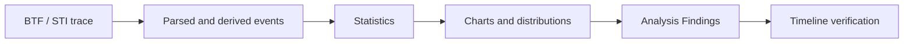

BTFViewer does **not** perform source-code analysis and does **not** simulate an RTOS scheduler.

Some values cannot be measured exactly because the trace does not contain enough information. BTFViewer marks these values as **heuristic** or **limited**.

For example, true task response time needs explicit release and completion events. Context-switch data alone cannot link these events reliably.

## Documentation map

| Document | Main question | Use it for |
|---|---|---|
| [`README.md`](README.md) | How do I use BTFViewer? | Installation, navigation, and normal viewer usage |
| [`WORKFLOWS.md`](WORKFLOWS.md) | How do I diagnose a problem? | Step-by-step investigation workflows |
| [`STATISTICS.md`](STATISTICS.md) | What does this measurement mean? | Metric definitions, formulas, interpretation, and limitations |
| [`AI.md`](AI.md) | How does AI-assisted investigation work? | AI setup, tools, planner, evaluation, and implementation |

## Statistics at a glance

The Statistics panel is shared by Desktop and Web. Most sections are collapsible. Some sections appear only when the trace contains the required STI events.

### System and CPU load

| Metric | What it answers |
|---|---|
| [Summary](#summary-scheduling-and-core-utilisation) | What is in the current trace or cursor scope? |
| [Scheduling summary](#summary-scheduling-and-core-utilisation) | How often does each core switch tasks, and how large are the gaps? |
| [Core utilisation](#summary-scheduling-and-core-utilisation) | How busy is each core, and how balanced is the workload? |
| [Trace Health (TICK)](#trace-health-tick) | Is the scheduler tick regular, tickless, or showing unusual gaps? |
| [Core Time Breakdown](#core-time-breakdown) | Where does each core spend its time: Active, Idle, Tick, or Gap? |
| [Concurrent Core Active Distribution](#concurrent-core-active-distribution) | How many cores are doing useful work at the same time? |
| [Kernel Switch Overhead](#kernel-switch-overhead) | How much time is spent between consecutive task slices? |
| [Top tasks by CPU](#top-tasks-by-cpu) | Which tasks consume the most CPU time? |

### Task placement and migration

| Metric | What it answers |
|---|---|
| [Core Migrations](#core-migration-analysis) | How often does a task move between cores? |
| [Core-Pair Migration Summary](#core-pair-migration-summary) | Which core-to-core migration paths are most active? |
| [Migration & Corridor Inspector](#migration--corridor-inspector) | Where are migration corridors and hot core pairs? |
| [Core Affinity](#core-affinity) | Did a task run outside its configured affinity mask? |
| [Task × Core](#task--core) | How is each task's execution distributed across cores? |
| [Core Utilization Over Time](#core-utilization-over-time) | How does core load change over time? |

### Task timing and health

| Metric | What it answers |
|---|---|
| [Task Lifecycle](#task-lifecycle) | When was a task created, deleted, suspended, resumed, or dispatched? |
| [Deadlines / CPU budget](#deadlines--cpu-budget) | Which slices exceed configured deadlines or CPU budgets? |
| [Task Health](#task-health) | Which tasks show unusual behavior across several metrics? |
| [Execution Time Per Slice](#execution-time-per-slice) | How long does each on-CPU slice run? |
| [Blocking Time](#blocking-time) | How long is a task off-CPU before it runs again? |
| [Dispatch / Scheduling Latency](#dispatch--scheduling-latency) | How long does a recorded ready/create event wait before execution? |
| [Inter-Arrival Time](#inter-arrival-time) | How much time passes between consecutive task starts? |
| [Period / Jitter](#period--jitter) | How stable is a task's observed activation period? |
| [Response Time](#response-time) | What heuristic ready-to-completion delay is observed? |
| [Unified Jitter](#unified-jitter) | Which timing metric has the largest variation? |

### Preemption and synchronization

| Metric | What it answers |
|---|---|
| [Preemption Chain Analysis](#preemption-chain-analysis) | Which task ran while another task was waiting? |
| [Preemption Matrix](#preemption-matrix) | Which victim/preemptor pairs dominate the trace? |
| [Priority Inheritance](#priority-inheritance) | When and how was task priority boosted? |
| [Mutex / Semaphore pairing](#mutex--semaphore-pairing) | Are synchronization events correctly paired, and where are issues? |
| [Waiter × Owner](#waiter--owner) | Which task-to-task mutex handoffs are observed? |
| [Mutex Blocking](#mutex-blocking) | Which tasks spend the most time waiting around mutex handoffs? |
| [Queue](#queue) | Are queue send/receive events paired correctly? |

### Instrumentation, anomalies, and comparison

| Metric | What it answers |
|---|---|
| [Timeline Anomalies](#timeline-anomalies) | Which unusual events should I inspect first? |
| [Worst Events](#worst-events) | What are the longest timing events in the scope? |
| [Critical Path](#critical-path) | Where is time spent inside the longest heuristic ready-to-completion windows? |
| [Recurring Patterns](#recurring-patterns) | Which anomaly types repeat for the same task? |
| [Interval Analysis](#interval-analysis) | How long do paired application-defined intervals take? |
| [Tag Analysis](#tag-analysis) | What values are recorded by tag STI channels? |
| [Trace Compare…](#trace-compare-1) | What changed between two traces? |
| [Metrics Distribution Charts](#metrics-distribution-charts) | How are samples distributed over time and by value? |

## Panel scope and controls

The **Statistics** tab appears in the right-side panel on both Desktop and Web.

### Limit statistics to a time range

Place at least two cursors, then enable **Limit to C1–Cn**.
All Statistics metrics and **Analysis Findings** are recalculated for the selected range.
Section titles show **(cursor range)** while this scope is active.

Clear the cursors to return to full-trace statistics.

### Panel controls

| Control | Action |
|---|---|
| **+** | Expand all sections |
| **−** | Collapse all sections; pinned sections remain open |
| Reset-order | Restore the default section order |
| Section title / chevron | Expand or collapse one section |
| **⠿** grip | Drag a section to a new position |
| Pin | Keep a section open when **Collapse all** is used |

Section order, pinned sections, expanded/collapsed state, and table heights are saved across launches. **Settings → Reset to Defaults** restores the built-in layout.

### Export and compare

**Export CSV** and **Export HTML** use the current cursor scope.

- **CSV** exports the Statistics summary tables and related calculated values.
- **HTML** exports the same summaries and adds presentation-oriented details such as **Analysis Findings**, the **Load Balance Score** gauge, and supported detail tables. The HTML table of contents includes **Expand all** / **Collapse all**.
- **Trace Compare…** compares supported metrics between two open traces. Trace A is the **baseline** and Trace B is the **candidate**. **Δ** is Baseline A − Candidate B. Enable **Limit to each tab's cursor range** when the two traces should use different time windows. **Export CSV** / **Export HTML** write every Compare table (not only the dialog top-N preview). HTML adds a table of contents with **Expand all** / **Collapse all**; Overview and Summary start expanded. Overview is a comparison identity, verdict, and Notable Changes summary (Improved / Regressed above threshold). Summary, Core Util, Response, and Core Migrations include charts; Core Migrations defaults to the largest count changes.

For exact exported fields and section-specific behavior, see the detailed metric descriptions below.

<a id="statistics-metric-tables" name="statistics-metric-tables">&#x200B;</a>
## Detailed metric reference 

The Statistics panel is available on both Desktop and Web. Metrics are grouped into collapsible sections. Click a table column header to sort it.

**Export CSV** and **Export HTML** use the current cursor scope. Both exports include the summary table from each section.

**Export HTML** starts with an **Analysis Findings** card.
It contains the same main findings as toolbar **Analysis**: load balance, WCET, blocking, thrashing, deadlines, tick health, and synchronization.
It also adds the **Load Balance Score** gauge as an SVG under Core Utilisation.
The report includes a **Table of Contents** with **Expand all** / **Collapse all** for every section card. Analysis Findings, Statistics Notes, Core Utilisation, Top Tasks, and Trace Health start expanded; other sections start collapsed.

Priority Inheritance, Mutex / Semaphore, and Interval Analysis also include detail tables. The longest instances or hold episodes appear first. Each detail table is limited to about 150–200 rows.

Use toolbar **Analysis** for interactive triage. Use **Save as Text…** when you need a text copy.

**Recommended workflow**

1. Open a trace (for example, `tracedata/example-4cores.btf.gz` for a 4-core SMP workload, or `tracedata/example-2cores.btf.gz` for a smaller 2-core demo).
2. Optionally click toolbar **Analysis** for a severity-tagged triage of the current scope.
3. **Core utilisation** and **Trace Health** start expanded. Other sections start collapsed. Open only the sections you need, or use **+** / **−** at the top. BTFViewer saves this layout for the next launch. Pin sections that you want to keep open.
4. Optionally drag **⠿** grips to reorder sections for your workflow; use the reset-order icon when you want the built-in sequence back.
5. Optionally place **2+ cursors** and enable **Limit to C1–Cn** to restrict every metric (and Analysis Findings) to a time window.
6. Use table actions to move from statistics back to the timeline:
   - Click a **table row** to open a distribution chart, when supported.
   - Click **Min** / **Max** / **p95** / **p99** to jump to that slice or gap and add an annotation.
   - Click a **Timeline Anomalies** or **Worst Events** row to zoom and place C1–C2.
   - Click a **Mutex / Semaphore** issue row to jump to that STI event and add an annotation.
   - In **Deadlines / CPU budget**, click a slice row to annotate it or a CPU-budget row to highlight the task. Use **Settings → Display** to edit thresholds.
7. Use toolbar **Compare** when two traces are open to diff summary and migration stats.

Example plots below use **`tracedata/example-8cores.btf.gz`**. Worked diagnosis steps for that sample: [WORKFLOWS.md §3](WORKFLOWS.md#3-worked-example--example-8cores).

## Analysis overview

Start with **Analysis Findings** for a quick summary of the current scope. Use the detailed metrics below when you need supporting evidence.

<a id="analysis-findings" name="analysis-findings">&#x200B;</a>
### Analysis Findings 

Toolbar **Analysis** is the same heuristic card on Desktop and Web (not a Statistics panel section). Product buttons and overlays: [README → Analysis Findings](README.md#analysis-findings).

Load-balance findings use the same Score, σ, and Gini values as **Core utilisation**. BTFViewer creates these findings only when there are **at least 2 cores** and total utilisation is **greater than 0**.

Balanced and moderate cases still show:

`Load Balance Score …% (σ=…%, G=…)`

The text “reasonably balanced” is used only when Score ≥ 85 % and σ ≤ 30 %.

The dialog uses theme-aware colours. This keeps Info and OK findings readable in both **dark** and **light** themes.

## 1. System and CPU load

Use these metrics to understand overall CPU load, core utilisation, tick health, and scheduling overhead.

<a id="summary-scheduling-and-core-utilisation" name="summary-scheduling-and-core-utilisation">&#x200B;</a>
### Summary, scheduling, and core utilisation 

These sections follow the **default** Statistics order. Summary and Scheduling summary are always first. **Core utilisation** is the first section that can be pinned.

This guide follows the same order: system load → migrations / affinity / lifecycle / deadlines → slice timing → preemption / synchronization / tags. You can drag sections to a different order in the UI.

**Summary** — scope-wide counts: trace span, tasks, segments, STI events. Span is *t*<sub>max</sub> − *t*<sub>min</sub> in the active scope (full trace or cursor range).

**Scheduling summary** — per core, **context switches** count slice boundaries and **core gap** is idle time between consecutive slices on that core:

```math
g_{\mathrm{core}} = t_{\mathrm{start},k+1} - t_{\mathrm{end},k}
```

Large **max core gap** on a core that should be busy suggests starvation, tickless idle, or a single long-running task blocking others.

**Core utilisation** — per core, share of non-IDLE, non-TICK active time in scope:

```math
U_{\mathrm{core}} = \frac{T_{\mathrm{active,core}}}{T_{\mathrm{scope}}} \times 100
```

When two or more cores are present, two gauges are shown side by side at the top of the section. **Load Balance Score** and **Std Deviation (σ)**:

```math
\mathrm{Score} = 100\,\% \times (1 - G)
```

where *G* is the Gini coefficient of {*U*<sub>core</sub>}.

σ is the population standard deviation of `{U_core}`.

The Score gauge uses a 0–100 % scale. A value of 100 means perfect balance. A value of 0 means the load is concentrated on one core.

The σ gauge uses a 0–60 % scale. Its warning threshold is at the middle of the scale. The zones match toolbar **Analysis**:

| Zone | Condition | UI |
|------|-----------|-----|
| **Red** | Score &lt; 70 % | **Unbalanced** chip + alert (red zone); Score gauge red |
| **Amber** | Score ≥ 70 % and σ &gt; 30 % | **σ &gt; 30%** chip; σ gauge amber (red if σ &gt; 50 %) |
| **OK** (green) | Score ≥ 70 % and σ ≤ 30 % | Green needles |

Toolbar **Analysis** warns when Score &lt; 70 % or σ &gt; 30 %. It uses “reasonably balanced” only when Score ≥ 85 % and σ ≤ 30 %.

When at least 2 cores have total utilisation &gt; 0, the dialog always lists **Core utilisation balance**. This includes OK and moderate cases. The line uses the same values as the gauges:

`Load Balance Score …% (σ=…%, G=…)`

**Export HTML** includes the gauges and the Analysis Findings card. **Export CSV** includes Score, σ, and G.

**What it tells you:** Imbalanced utilisation across cores may indicate poor affinity, lock pinning, or workload placement issues. Cross-check with **Core Migrations**, the Migration & Corridor Inspector, and toolbar **Analysis**.

<a id="trace-health-tick" name="trace-health-tick">&#x200B;</a>
#### Trace Health (TICK) 

Uses STI **TICK** timestamps to estimate scheduler tick regularity and detect whether the trace uses a periodic tick or **tickless idle**. For FreeRTOS traces, `configUSE_TICKLESS_IDLE` is one way to identify the configured mode.

**Formula** — for consecutive TICK events at times *t*<sub>n</sub>:

```math
\Delta_n = t_n - t_{n-1}, \quad
\mu = \mathrm{mean}(\Delta_n), \quad
\sigma = \mathrm{stdev}(\Delta_n), \quad
\mathrm{CV} = \frac{\sigma}{\mu}
```

**Missed ticks (est.)** counts large gaps where Δ<sub>n</sub> ≫ μ (about ⌊Δ<sub>n</sub> / μ⌋ − 1).

**What it tells you:** In **TICK** mode (CV ≤ 5 %), intervals stay close to one nominal period. This means the scheduler clock is steady.

In **TICKLESS** mode (CV > 5 %), idle periods suppress the tick interrupt. The distribution becomes wider. Tall scatter-plot spikes can be multi-tick sleeps, not CPU overload.

A large **Max gap** is still worth checking even when Status is **good**. It may come from a long critical section or missing trace data.

| Field | Meaning |
|-------|---------|
| **Status** | `good` / `warning` / `critical` based on gap threshold |
| **Mode badge** | `TICK` (blue) or `TICKLESS` (amber) — detected automatically from the coefficient of variation (CV = σ/μ) of consecutive tick intervals. CV > 5 % is classified as tickless. Hover the badge to see the exact CV value |
| **Ticks** | TICK event count in scope |
| **Avg period / Max gap** | Observed tick spacing |
| **Missed ticks (est.)** | Rough count of skipped ticks from large gaps |

In **tick mode** the timer interrupt fires at a constant rate and tick intervals form a tight cluster.
In **tickless mode** the scheduler suppresses the tick interrupt during idle periods to save power, so consecutive intervals span one or many nominal tick periods. The distribution becomes much wider.

When tick intervals can be charted, a **Tick Distribution…** button (bar-chart icon, theme-aware amber/orange styling) appears beside the **TICK** / **TICKLESS** mode badge when **≥ 2 ticks** are in scope (Desktop + Web).
Clicking it opens the standard scatter + histogram popup showing:
- **Scatter plot** — each tick interval over trace time; long idle periods appear as tall spikes.
- **Histogram** — interval distribution with adaptive scaling and a CDF overlay (auto may choose p5–p95 or log duration when tickless idle stretches the range); clearly multi-modal in tickless mode (one sharp peak at 1 × period, another at 2×, 3×, etc.). The CDF helps measure what fraction of tick intervals are a single period compared with two or more.

Click any scatter point to jump to that tick time, add an **annotation**, and open the **Marks** tab with the annotation selected (same behaviour as other metric distribution charts).

**Tick Distribution** in `example-8cores.btf.gz` (~2496 TICK events, CV ≈ 35.9 % → **TICKLESS**):


The histogram's multiple peaks (1×, 2×, 3× the nominal period) confirm tickless idle: most gaps are a single tick, but idle stretches skip several nominal periods before the next TICK fires.

Large gaps may indicate CPU overload, long critical sections, tickless idle, or tracing gaps. This does not always mean the RTOS configuration is wrong.

<a id="core-time-breakdown" name="core-time-breakdown">&#x200B;</a>
### Core Time Breakdown 

Per-core time budget for the scoped window, split into four mutually exclusive buckets (percentages of the core span):

| Bucket | Meaning |
|--------|---------|
| **Active** | Non-IDLE, non-TICK task time |
| **Idle** | IDLE task time |
| **Tick** | TICK handler time |
| **Gap** | Unaccounted span between consecutive `core_segs` (scheduler latency / ISR overhead / tracing gaps) |

**What it tells you:** High **Gap %** on a busy core often correlates with elevated **Kernel Switch Overhead** or long ISR/critical sections.
High **Idle %** with low **Active %** on some cores and overload on others points to affinity or placement imbalance. Cross-check **Core utilisation** and **Core Migrations**.
Click a core row (Desktop) to focus that core in **Core View**.

<a id="concurrent-core-active-distribution" name="concurrent-core-active-distribution">&#x200B;</a>
### Concurrent Core Active Distribution 

Temporal parallelism: how much of the scoped window is spent with exactly *N* cores concurrently running non-IDLE/non-TICK work (*N* = 0…number of cores).

**Formula** — let isActive(c,t) be 1 when core *c* runs a non-IDLE/non-TICK task at time *t*:

```math
N_{\mathrm{active}}(t) = \sum_{c} \mathrm{isActive}(c,t)
```

The table aggregates dwell time at each level *N*.

| Column | Meaning |
|--------|---------|
| **Active Cores** | Concurrency level *N* |
| **Duration** | Total time spent with N<sub>active</sub> = N |
| **% of Span** | Share of the scoped window |

**Distribution chart** — click any row: scatter of interval start compared with dwell duration while that many cores were active; histogram of those dwells.
Complements **Load Balance Score** (which is utilisation balance, not simultaneous activity).

**Headless snapshot** (`example-8cores.btf.gz`, *N* = 4 active cores):

```bash
python builds/btf_viewer.py snapshot ../tracedata/example-8cores.btf.gz \
    -o stats-concurrency-4.svg --view plot --metric concurrency --active-cores 4
```

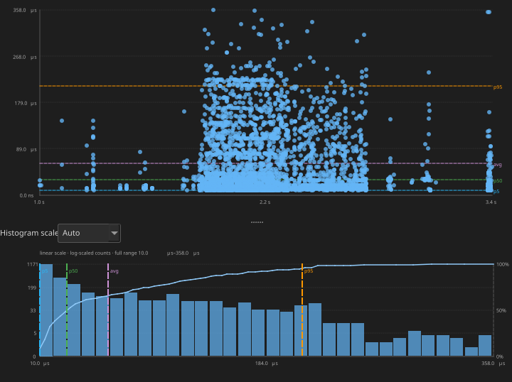

<a id="kernel-switch-overhead" name="kernel-switch-overhead">&#x200B;</a>
### Kernel Switch Overhead 

Per-core cost of consecutive context switches from `core_segs` gaps. It measures the time from the previous slice's preempt/end to the next slice's resume/start on the same core:

```math
O_{\mathrm{switch}} = t_{\mathrm{resume},B} - t_{\mathrm{preempt},A}
```

| Column | Meaning |
|--------|---------|
| **Core** | Core name (`Core_N`) |
| **Switches** | Number of consecutive-slice gaps in scope |
| **Min / Avg / Max** | Switch-gap duration statistics |
| **Total Overhead** | Sum of gaps in scope |
| **% of Core** | Total overhead as a percentage of the core / scope span |

**Distribution chart** — click any row: scatter of switch time compared with gap duration; histogram with variability overlay (avg ± σ).
Zero or near-zero gaps mean back-to-back slices with negligible scheduler overhead in the trace resolution.

**Headless snapshot** (`example-8cores.btf.gz`, Core_0):

```bash
python builds/btf_viewer.py snapshot ../tracedata/example-8cores.btf.gz \
    -o stats-switch-core0.svg --view plot --metric switch_overhead --core Core_0
```

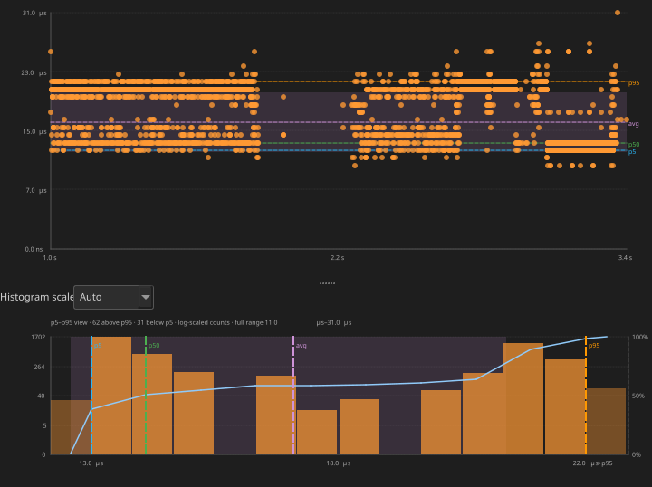

<a id="top-tasks-by-cpu" name="top-tasks-by-cpu">&#x200B;</a>
### Top tasks by CPU 

This table ranks worker tasks by total on-CPU time. It does not include IDLE or TICK.

The calculation uses the same *T*<sub>exec,i</sub> value as **CPU%** in Execution Time Per Slice.
Click a row to highlight the task on the timeline.

Migration tables, highlight / inspect steps, the corridor inspector, and **Trace Compare…** are under [Core migration analysis](#core-migration-analysis).

## 2. Task placement and migration

Use these metrics to see where tasks run and whether migration, core preference, or load placement may be a problem.

<a id="core-affinity" name="core-affinity">&#x200B;</a>
### Core Affinity 

Per-task affinity mask history from `affinity_set` STI (`vTaskCoreAffinitySet`) compared with observed execution cores.
**Violations** lists cores used while outside the mask then in effect (slices before the first set are unrestricted; mask changes are shown as `0x1 → 0x8`).

Always visible. Empty hint when the trace has no `affinity_set` events.

<a id="task--core" name="task--core">&#x200B;</a>
### Task × Core 

Per-task execution time on each core as a percent of the scoped span.
Complements Core Time Breakdown (which is per-core totals) and Core Affinity (which is mask compared with observed cores).
Click a cell to jump to the first on-CPU slice of that task on that core.

<a id="core-utilization-over-time" name="core-utilization-over-time">&#x200B;</a>
### Core Utilization Over Time 

Equal time bins of the current Statistics scope, with each core's busy percent in that bin. Complements Core Time Breakdown (span totals) and Task × Core (per-task share). Click a bin to zoom that window.

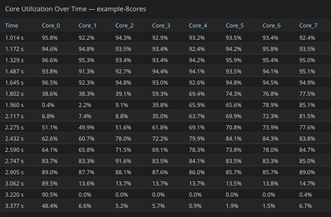

<a id="core-migration-analysis" name="core-migration-analysis">&#x200B;</a>
### Core migration and affinity 

A **migration** is recorded when consecutive slices of the same task (merge-key) run on different cores.
Migrations are detected at parse time from the segment timeline. There are no separate markers drawn on the timeline; use the **Core Migrations** table, the **Migration & Corridor Inspector** (toolbar **Heatmap**), **Trace Compare…**, or Find **Migrations** mode to inspect them.

Affinity, lifecycle, and deadline meanings are earlier in this chapter. This section is the deep dive for the migration tables, highlight / inspect steps, the corridor inspector, and **Trace Compare…**.

<a id="highlight-a-migrating-task-on-the-timeline" name="highlight-a-migrating-task-on-the-timeline">&#x200B;</a>
### Highlight a migrating task on the timeline 

To *see* a hot migrating task in context (not only read rates in a table):

1. Stay in **Task View** (toolbar **Task**).
2. Click the task label (for example, `CS[22]`) to **lock-highlight** it. Other tasks stay on the timeline but gray out; do **not** use the legend filter.
3. Enable **Load** to see that task’s CPU usage **per core** under the timeline (see [CPU Load](README.md#cpu-load)).
4. Optionally place cursors around the burst and enable **Limit to C1–Cn** so **Statistics → Core Migrations** recomputes for that window. The inspector grid follows the **visible timeline viewport** independently.

![CS[22] highlighted in Task View with per-core CPU Load](../images/stats/tasks-cpu-load-cs22.svg)

*`CS[22]` lock-highlighted in Task View; CPU Load shows that task’s share on each core (`example-8cores.btf.gz`).*

**Headless example** (full-span Task View + CPU Load for the same highlight):

```bash
python builds/btf_viewer.py snapshot ../tracedata/example-8cores.btf.gz \
    -o /tmp/cs22-cpu-load.svg \
    --view timeline --view-mode task --task "CS[22]" --cpu-load
```

Zoomed burst without the load strip:

```bash
python builds/btf_viewer.py snapshot ../tracedata/example-8cores.btf.gz \
    -o /tmp/cs22-burst.svg \
    --view timeline --view-mode task --task "CS[22]" \
    --lo 1805000 --hi 1865000
```

<a id="inspect-migrations-involving-a-specific-core" name="inspect-migrations-involving-a-specific-core">&#x200B;</a>
### Inspect migrations involving a specific core 

After highlighting a hot task:

1. **Statistics → Core Migrations** — note **Primary** core, **Rate**, **Dwell**, **Ping** for that task.  Click the row → **Dwell** / **Rate** / **Gap** charts.
2. **Core-Pair Migration Summary** — sort or scan pairs where that core is **From** or **To** (for example, `Core_5→Core_7`) to see which neighbour absorbs the traffic and whether **Bounce %** is elevated. Click the row for Gap / Rate charts; use **Open Heatmap** / **Open Chord** from the dialog footer to open the unified inspector focused on that pair.
3. Toolbar **Heatmap** — corridor tree + time-bin grid: click a hot cell or expand a corridor to see contributing tasks, then **Inspect in Timeline** / double-click for Spotlight.
4. **Show topology** in the inspector (or pair-chart **Open Chord**). The same window with the topology sidebar expanded; hover outer (egress) / inner (ingress) rings or a ribbon to isolate flows.
5. **Core Time Breakdown** — click a core row to jump Core View focused on that core.
6. Headless CSV for a scoped window:

```bash
python builds/btf_viewer.py migrations ../tracedata/example-8cores.btf.gz \
    --lo 1805000 --hi 1865000 -o - | head
```

**Legend panel:** check **Migrated tasks only** to hide tasks that never left their first core.

**Statistics → Core Migrations** (collapsible section) lists tasks that ran on two or more cores:

**Migration rate** — normalizes raw migration count against task active time and (when TICK STIs exist) scheduler ticks, so a task that migrates often relative to how much it runs stands out:

```math
R_m = \frac{N_{\mathrm{migrations},i}}{T_{\mathrm{exec},i}}
```

The **Rate** column shows *R*<sub>m</sub> as migrations per second of on-CPU time (for example, `1.23/s`).
When the trace includes TICK events, it also shows migrations per **on-CPU** scheduler tick for that task (for example, `2.785/tick`). TICK STIs that fall inside one of the task's slices in scope, not trace-wide tick count.

**What it tells you:** A high rate means the task is **bouncing** between cores (thrashing). For high-priority real-time tasks you ideally want this close to zero.

**Average core dwell time** — mean duration of each on-CPU stay before the task blocks, yields, or migrates:

```math
\bar{T}_d = \frac{1}{N_{\mathrm{slices}}} \sum_k d_k
= \frac{T_{\mathrm{exec},i}}{N_{\mathrm{slices},i}}
```

Each slice *d*<sub>k</sub> is one switch-in episode (equivalent to averaging per-core dwell, *T*<sub>on</sub> / *N*<sub>slices</sub>, on each core the task visited).

**What it tells you:** If **Dwell** is extremely short (for example, less than a few milliseconds or close to your system tick period), the scheduler is spending too much effort moving the task between cores instead of letting it compute.

| Column | Meaning |
|--------|---------|
| **Task** | Display name (`Name[id]`) |
| **Migr** | Migration count in the current scope (full trace, or cursor range when **Limit to C1–Cn** is on) |
| **Rate** | Migration rate — `/s` of task active time; `/tick` = migrations per on-CPU TICK for this task in scope |
| **Dwell** | Average on-CPU slice duration (core dwell time) in scope |
| **Cores** | Distinct cores with on-CPU time or migrations in the current scope |
| **Primary** | Core with the most active time in scope, with its share (%) |
| **Ping** | Ping-pong migrations — three consecutive migrations A→B→A within 1 µs |
| **STI±** | Number of migrations that have an STI event within ±500 ns. |
| **Gap after** | Average off-CPU gap immediately after a migration |
| **Gap other** | Average blocking gap elsewhere for the same task |

Click a row to open a **distribution chart** with three in-dialog tabs (switches the chart in place, no need to close and reopen):

- **Dwell** (default tab) — one point per on-core run: x = run start time, y = run duration *d*<sub>k</sub> (same definition as **Average core dwell time** above, but per-sample instead of averaged).
- **Rate** — one point per migration after the first: x = migration time, y = time since the task's *previous* migration. Clusters of short gaps mean bursts of rapid bouncing; a flat, evenly spaced scatter means migrations are rare and spread out.
- **Gap** — one point per migration with a positive **Gap after** value: x = migration time, y = off-CPU gap immediately following that migration (the same samples averaged into the **Gap after** column; **Gap other** is not plotted here — open the **Blocking Time** chart for the same task instead, since it covers all off-CPU gaps).

Each tab's scatter + histogram uses the same **adaptive scaling** as other metrics charts (see [Metrics Distribution Charts](#metrics-distribution-charts)).

**CS[22]** in `example-8cores.btf.gz` (a context-switch stress task that migrates often):

![On-core dwell time distribution for CS[22] in example-8cores.btf.gz](../images/stats/stats-mig-dwell-cs22.svg)

![Time between migrations for CS[22] in example-8cores.btf.gz](../images/stats/stats-mig-rate-cs22.svg)

![Post-migration gap distribution for CS[22] in example-8cores.btf.gz](../images/stats/stats-mig-gap-cs22.svg)

Drag the resize handle below the table to show more or fewer rows.

<a id="core-pair-migration-summary" name="core-pair-migration-summary">&#x200B;</a>
### Core-Pair Migration Summary 

Shows directed migration paths (`From → To`) across all tasks.

Use **Core Migrations** to find which task is moving too often.

Use this table to find:
- which core pair has the most migration traffic;
- how much of that traffic is caused by lock bounce.

| Column | Meaning |
|--------|---------|
| **From / To** | Source and destination cores |
| **Count** | Directed migrations in scope |
| **Bounces** | Subset that occurred while a mutex was held across cores |
| **Bounce %** | Percentage of migrations on this path that are lock bounces: `100 × Bounces / Count`. |
| **Avg Gap** | Mean post-migration off-CPU gap for that corridor |

Click a row to open a **distribution chart** with two tabs:

- **Gap** (default) — one point per directed migration with a positive gap: x = migration time, y = post-migration gap (the samples behind **Avg Gap**). Lock-bounce events are drawn in **orange**; others use the source-core colour.
- **Rate** — one point per consecutive migration on the *same* directed pair: x = migration time, y = time since the previous hop on this corridor. Tight vertical bands mean bursty corridor traffic.

Dialog footer:

- **Open Heatmap** — open the Migration & Corridor Inspector focused on that pair (prefers **Lock Bounces Only** when Bounce % is elevated).
- **Open Chord** — same inspector with topology expanded and the pair highlighted.

**`Core_5 → Core_7`** in `example-8cores.btf.gz` (hottest corridor by Count):

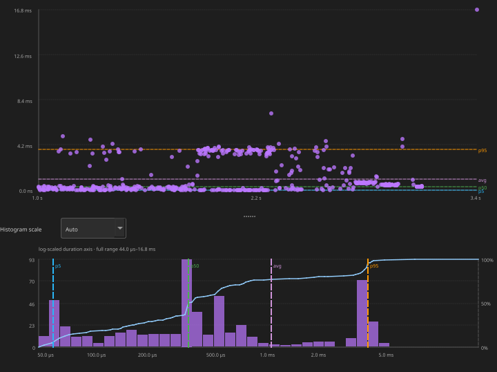

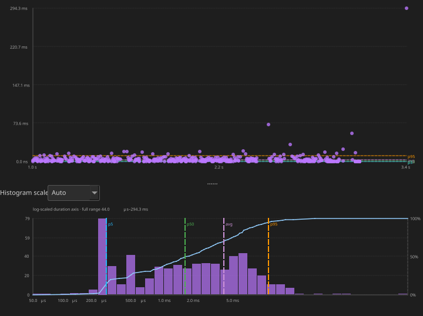

<a id="migration--corridor-inspector" name="migration--corridor-inspector">&#x200B;</a>
### Migration & Corridor Inspector 

Toolbar **Heatmap** opens the inspector (Desktop + Web): corridor/task tree, time-bin grid, and mini-chord topology.
**Open Chord** (core-pair charts) and **Show topology** inside the inspector expand the same window’s topology sidebar.

| | |
|--|--|
| **Open** | Toolbar **Heatmap** (2+ cores). Pair-chart **Open Chord** / inspector **Show topology** for the chord-first layout. Desktop: non-modal. Web: overlay keeps the timeline interactive. Tab switch closes the inspector. |
| **Scope** | Visible timeline viewport. Independent of Statistics **Limit to C1–Cn**. A **Full view** / **Viewport view** banner (same colors as the distribution chart) shows the current time range — Fit to window compared with zoomed. Empty tree/grid shows *No migrations in scope*; topology stays available. |
| **Filter** | **Top corridors**, **Direction**, **Task filter**. **Lock Bounces Only** when the trace has cross-core mutex holds. |
| **Select** | Click a tree row, grid cell, or chord ribbon. Double-click or **Inspect in Timeline** spotlights that bin (or task) with C1–C2. Toolbar **All** / **Show all tasks** clears the filter. |
| **Query with AI…** | Runs the **Migration thrash** template in the **AI** tab (same findings context as Statistics). If AI is disabled, opens **Settings → AI**. |
| **> 16 cores** | Tree groups by source; topology offers Circle ↔ Matrix. Dock topology **Bottom** or **Right**. |

**Example** (`example-8cores.btf.gz`):

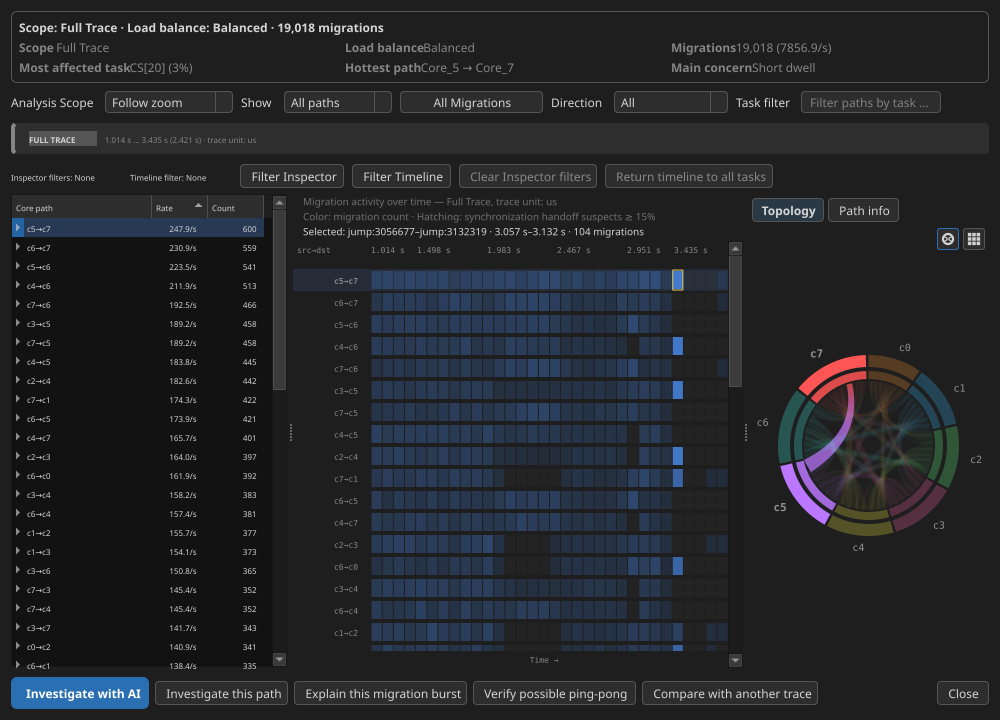

Hover a ribbon for `cN→cM: count` in the footer. Per-task ping-pong / STI / gap-after aggregates are in Statistics **Core Migrations**.

```bash
make -C BTFViewer update-images
```

```bash
python builds/btf_viewer.py snapshot ../tracedata/example-8cores.btf.gz \
  -o /tmp/migration.svg --view chord --width 1000 --height 720 --drill-row 0
```

## 3. Task timing and health

Use these metrics to inspect task lifecycle, deadlines, execution time, blocking, period, jitter, and response time.

<a id="task-lifecycle" name="task-lifecycle">&#x200B;</a>
### Task Lifecycle 

This section shows task lifecycle events from the `task` STI channel.

It includes `create`, `delete`, `suspend`, and `resume` events.

The section shows:
- create and delete timestamps;
- suspend and resume counts;
- alive span (create → delete);
- total lifecycle event count;
- **Runs**, the number of times the scheduler dispatched the task to a core.

**Runs** counts context-switch-in events or segments.
It is normally much larger than Susp/Res.
Susp/Res counts only explicit `vTaskSuspend()` and `vTaskResume()` calls.
A task can run, be preempted, and run again many times without being explicitly suspended.

In `example-8cores.btf.gz`, test 9 creates **SR0–SR3** (pinned across cores) with overlapping suspend-while-blocked and suspend-while-running rounds. Use this section to confirm Susp/Res counts match the STI pairs.

Always visible. Empty hint when the trace has no task create/delete/suspend/resume STI events.

<a id="deadlines--cpu-budget" name="deadlines--cpu-budget">&#x200B;</a>
### Deadlines / CPU budget 

Lets you set a per-task execution deadline and a global CPU budget threshold.

Task deadlines are entered in **nanoseconds**. BTFViewer converts them to the trace `#timeScale` before comparison.

The section shows:
- **Slice over deadline** — the 20 longest slices over the deadline. Click a row to jump to it and add an annotation.
- **CPU budget exceeded** — tasks over the CPU budget. Click a row to highlight the task.

Click a column header to sort. Use **Settings → Display** in this section to edit Analysis thresholds (`Ctrl+,`).

This section is always visible. If no thresholds are set, it shows a setup prompt.

<a id="task-health" name="task-health">&#x200B;</a>
### Task Health 

This is a **heuristic** score from 0 to 100.

The score uses measured data from the trace. It considers execution spread, blocking tail, period CV, missed activations, migration ratio, deadline misses, and CPU share.

Status marks are ✓ / ⚠ / ❌. This score is **not** an AI probability.

Click a band to open the related Statistics section.

<a id="execution-blocking-and-inter-arrival" name="execution-blocking-and-inter-arrival">&#x200B;</a>
### Task timing 

These three task metrics are measured from consecutive on-CPU slices of the same task. The figure below shows how they relate on the timeline (UI label **Block Time** = Statistics **Blocking Time**):

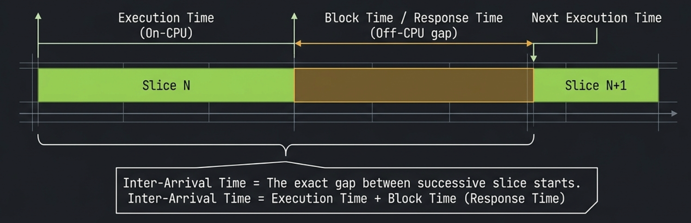

| Metric | Spans |
|--------|--------|
| **Execution Time** | Start → end of one on-CPU slice |
| **Blocking Time** | End of one slice → start of the next (off-CPU gap) |
| **Inter-Arrival Time** | Start of one slice → start of the next (period between activations) |

Inter-arrival ≈ execution + blocking for the same pair of activations (when the gap is positive).

<a id="execution-time-per-slice" name="execution-time-per-slice">&#x200B;</a>
### Execution Time Per Slice 

Measures how long each **on-CPU slice** lasts for a task. It starts at switch-in until the task blocks, yields, or is preempted.

**Formula** — for task *i*, each on-CPU slice *k* in scope:

```math
d_k = t_{\mathrm{end},k} - t_{\mathrm{start},k}
```

Table statistics are computed over all slice durations *d*<sub>k</sub> in scope.
**Jitter** is the observed range, `Max − Min`; **σ** is the population standard deviation (the observed slices are treated as the complete population in scope).
**CPU%** is the task's share of total active CPU time in scope:

```math
\mathrm{CPU}_i = \frac{T_{\mathrm{exec},i}}{\sum_j T_{\mathrm{exec},j}} \times 100
```

**What it tells you:** Short, uniform slices suggest periodic or tick-driven scheduling.
A long **Max** or heavy **p95** tail marks worst-case execution time (WCET) slices. These often come from critical sections, lock holds, or interrupt-disabled regions.
Compare **Min** (BCET) and **Max** (WCET) to judge jitter; a wide spread on a real-time task may violate deadline assumptions even when **Avg** looks acceptable.

| Column | Meaning |
|--------|---------|
| **Task** | Display name (`Name[id]`) |
| **Runs** | Number of slices in scope |
| **CPU%** | Share of total trace (or cursor-range) active time |
| **Min / Avg / Max / p95** | Slice duration statistics |
| **Jitter** | Observed duration range (`Max − Min`) |
| **σ** | Population standard deviation of slice durations |
| **Min / Max** links | Jump and annotate BCET / WCET slice |

**Distribution chart** — click any row:

- **Scatter:** x = slice start time, y = slice duration.
- **Histogram:** distribution of slice durations (auto log scale when the tail is wide; the blue CDF curve shows the cumulative fraction of samples).
- **Variability overlay:** the translucent purple band is average ± one population σ. Jitter (`Max − Min`) is the full extent of the plotted data, so it needs no marker lines.

In `example-8cores.btf.gz`, task **CS[11]** has 730 slices with a long tail of longer runs (context-switch stress tasks):

![Execution time distribution for CS[11] in example-8cores.btf.gz](../images/stats/stats-exec-cs11.svg)

The scatter shows periodic bursts of short slices; the histogram uses a **log-scaled duration axis** so short and long slices are both visible.
The **CDF** rises steeply on the left (most slices are short) then levels toward 100% as longer runs are included; **p5**, **p50**, and **p95** vertical markers align with the 5%, 50%, and 95% ticks on the right axis.

<a id="blocking-time" name="blocking-time">&#x200B;</a>
### Blocking Time 

Measures the **off-CPU gap** between the end of one slice and the start of the next for the same task. This is the time spent waiting to run again (preempted, blocked on a resource, or delayed by the scheduler).

> **Not end-to-end response time:** BTFViewer's **Blocking Time** is only the off-CPU gap until the task next resumes.
True response time is normally measured from an explicit release event to completion and cannot be derived reliably from context-switch slices alone.
It requires matching release/completion instrumentation (for example, paired interval events).

**Formula** — for consecutive activations *k* and *k+1* of task *i*:

```math
g_k = t_{\mathrm{start},k+1} - t_{\mathrm{end},k}
```

Only positive gaps are counted. Min / Avg / Max / p95 are taken over all gaps *g*<sub>k</sub> in scope.

**What it tells you:** Blocking time is pure **wait time**. The task is runnable or blocked but not on-CPU.
High **Avg** or **Max** gaps often point to lock contention, priority inversion, or a higher-priority task monopolizing the core.
Spikes clustered at specific times in the scatter plot usually correlate with a particular preemptor or synchronization object; use **Preemption Chain Analysis** or **Mutex / Semaphore** pairing to find the cause.

| Column | Meaning |
|--------|---------|
| **Task** | Display name |
| **Gaps** | Number of positive off-CPU gaps |
| **Min / Avg / Max / p95** | Gap duration statistics |
| **Jitter** | Observed gap range (`Max − Min`) |
| **σ** | Population standard deviation of off-CPU gaps |
| **Min / Max** links | Jump and annotate resume slice at shortest / longest gap |

**Distribution chart** — click any row:

- **Scatter:** x = resume time, y = off-CPU gap.
- **Histogram:** distribution of blocking gaps.

**CS[11]** in `example-8cores.btf.gz` (729 gaps):

![Blocking time distribution for CS[11] in example-8cores.btf.gz](../images/stats/stats-block-cs11.svg)

High blocking gaps clustered at certain times often correlate with lock contention or a higher-priority task dominating the core.

<a id="dispatch--scheduling-latency" name="dispatch--scheduling-latency">&#x200B;</a>
### Dispatch / Scheduling Latency 

Ready→run delay for a task: t<sub>ready</sub> from STI `resume Name[id]` (`vTaskResume`) or task **create** time, and t<sub>resume</sub> from the next switch-in (segment start):

```math
L_{\mathrm{dispatch},k} = t_{\mathrm{resume},k} - t_{\mathrm{ready},k}
```

Sync-object wakes (`give`/`send`) are **not** attributed yet. BTF notes carry the object pointer, not the woken task id.

| Column | Meaning |
|--------|---------|
| **Task** | Display name (`Name[id]`) |
| **Activations** | Number of dispatch samples in scope |
| **Min / Avg / Max / p95 / p99** | Dispatch latency duration statistics |
| **Jitter / σ** | Observed range (`Max − Min`) and population standard deviation |
| **Min / Max** links | Jump and annotate the fastest / slowest dispatch |

**Distribution chart** — click any row: scatter of dispatch time compared with latency; histogram with variability overlay. Click a point to jump to the switch-in segment.

**Headless snapshot** (`example-8cores.btf.gz`, lifecycle test task **SR0[271]** — create / suspend / resume samples):

```bash
python builds/btf_viewer.py snapshot ../tracedata/example-8cores.btf.gz \
    -o stats-dispatch-sr0.svg --view plot --metric dispatch --task "SR0[271]"
```

![Dispatch latency distribution for SR0[271] in example-8cores.btf.gz](../images/stats/stats-dispatch-sr0.svg)

<a id="inter-arrival-time" name="inter-arrival-time">&#x200B;</a>
### Inter-Arrival Time 

Measures the gap between **successive activation start times** of the same task (time between slice starts, not off-CPU gap).

**Formula** — for consecutive activations *k* and *k+1*:

```math
\Delta t_k = t_{\mathrm{start},k+1} - t_{\mathrm{start},k}
```

Min / Avg / Max / p95 are taken over all inter-arrival samples Δ*t*<sub>k</sub> in scope.

**What it tells you:** Inter-arrival time reflects how often the task is **scheduled to run**, including time it spent on-CPU.
For periodic tasks it should cluster near the expected period; drift or bimodality hints at missed deadlines, timer jitter, or workload-dependent release patterns.
Because Δ*t*<sub>k</sub> = *d*<sub>k</sub> + *g*<sub>k</sub> (slice duration plus blocking gap), inter-arrival is always **≥** blocking time for the same activations. Compare both tables to see whether jitter comes from short runs or long waits.

| Column | Meaning |
|--------|---------|
| **Task** | Display name |
| **Runs** | Number of inter-arrival samples |
| **Min / Avg / Max / p95** | Gap between activation starts |
| **Jitter** | Observed inter-arrival range (`Max − Min`) |
| **σ** | Population standard deviation of inter-arrival times |
| **Min / Max** links | Jump and annotate activation at shortest / longest inter-arrival |

**Distribution chart** — click any row:

- **Scatter:** x = activation time, y = gap since previous activation.
- **Histogram:** distribution of inter-arrival gaps.

**CS[11]** in `example-8cores.btf.gz`:

![Inter-arrival time distribution for CS[11] in example-8cores.btf.gz](../images/stats/stats-inter-cs11.svg)

Compare with Blocking Time: inter-arrival includes time the task was **running**, so values are typically larger than off-CPU gaps alone.
The histogram auto-selects **log duration** for CS[11] because activation gaps span microseconds to milliseconds.

<a id="period--jitter" name="period--jitter">&#x200B;</a>
### Period / Jitter 

Uses the same inter-arrival gaps as the Inter-Arrival table.
**Expected** is the median gap.
**Missed** counts gaps &gt; 1.5× expected; **extra** counts gaps &lt; 0.5× expected; **burst** counts gaps &lt; 0.25× expected.
**RMS** is jitter versus that expected period.
**Spark** is the chronological gap series.
Click a time column to jump to that gap; click the task name to open the existing Inter-arrival distribution plot (this page does not add a second histogram).

<a id="response-time" name="response-time">&#x200B;</a>
### Response Time 

Heuristic ready→completion: previous slice end → this slice end (the first slice uses its own exec duration).
BTF does not record an explicit release/completion pair, so this is **not** kernel response time.
Percentiles include p50 / p90 / p95 / p99 / p99.9.
Click the task to open the existing Response plot; click **Min** / **Max** / **p50** / **p90** / **p95** / **p99** / **p99.9** to jump to that event.

**CS[11]** in `example-8cores.btf.gz`:

![Response time distribution for CS[11] in example-8cores.btf.gz](../images/stats/stats-response-cs11.svg)

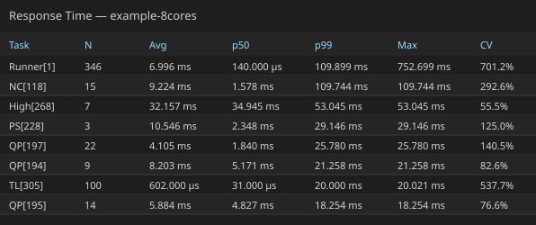

<a id="unified-jitter" name="unified-jitter">&#x200B;</a>
### Unified Jitter 

Max−Min spread and CV for execution, blocking, inter-arrival, heuristic response, STI **dispatch** latency (resume/create → switch-in), and **wake** (heuristic response wait, used as a stand-in when BTF does not name the woken task).
Click a column to open the matching plot.
This page does not add a second histogram.

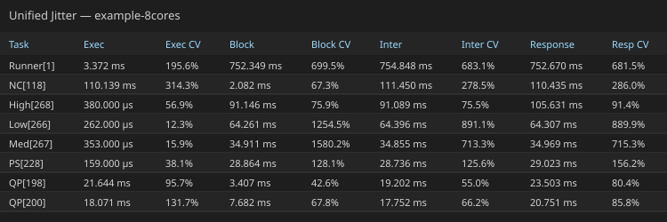

## 4. Preemption and synchronization

Use these metrics to inspect preemption, priority inheritance, mutex / semaphore behavior, and queues.

<a id="preemption-chain-analysis" name="preemption-chain-analysis">&#x200B;</a>
### Preemption Chain Analysis 

For each **victim** task's off-CPU gap, the analyser finds which **preemptor** tasks ran on the **same core** as the victim during that gap and aggregates overlap duration.

**Formula** — for victim *v* and preemptor *p* on the same core during gap *g*:

```math
\mathrm{overlap}(v,p,g) = \sum_{p \in g}
\left[ \min(t_{\mathrm{end}}, g_{\mathrm{end}}) - \max(t_{\mathrm{start}}, g_{\mathrm{start}}) \right]
```

**Count** is the number of overlap events.

**Total**, **Avg**, and **Max** show how long the preemptor ran during the victim's gaps.

**What it tells you:** Answers *who ran while this task waited*.
A single pair with high **Count** and **Total** means one preemptor dominates the victim's blocking; many pairs with moderate counts suggest fair sharing or frequent context switches.
Large **Max** overlap points to long stretches where the victim was ready but could not run. This can be a sign of priority misconfiguration or a CPU hog.

| Column | Meaning |
|--------|---------|
| **Victim** | Task that was off-CPU |
| **Preemptor** | Task that ran during the victim's gap |
| **Count** | Number of preemption overlap events |
| **Total / Avg / Max** | Overlap duration (how long the preemptor held the CPU during victim gaps) |

**Distribution chart** — click any row (victim ← preemptor pair):

- **Scatter:** x = when the preemption overlap started, y = overlap duration.
- **Histogram:** how long that preemptor typically held the CPU during gaps.
- **Click a point** to jump to the **preemptor's segment** and add an annotation with duration/time notes.

**CS[24] ← CS[25]** in `example-8cores.btf.gz` (55 overlap events, 14.936 ms total overlap) — two context-switch stress tasks repeatedly preempting each other:

![Preemption chain distribution CS[24] preempted by CS[25] in example-8cores.btf.gz](../images/stats/stats-preempt-cs24-cs25.svg)

High **Count** with moderate **Avg** overlap suggests frequent short preemptions; a few points with large **y** values are long stretches where CS[25] ran while CS[24] waited.
Use this table to answer *who preempted whom* and whether a victim's blocking is dominated by one preemptor or many.

<a id="preemption-matrix" name="preemption-matrix">&#x200B;</a>
### Preemption Matrix 

Same-core victim × preemptor overlap plus a ranking of who preempts each victim most, including an A → B → resumed story.
Complements Preemption Chain Analysis (pair totals with a plot).
Click a ranking row or matrix cell to jump to the longest overlap.

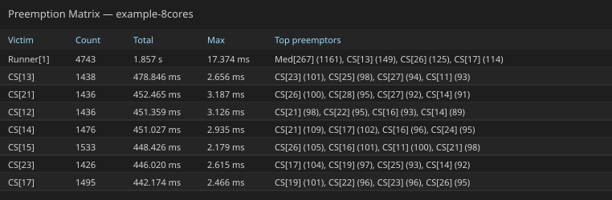

<a id="priority-inheritance" name="priority-inheritance">&#x200B;</a>
### Priority Inheritance 

Shown when the trace has **`create pri:N`** on task-create `T` rows **and** at least one priority STI on the `task` channel:

| STI note prefix | Hook | Meaning |
|-----------------|------|---------|
| `priority_inherit Name[id] pri:N` | `traceTASK_PRIORITY_INHERIT` | Mutex holder inherited priority *N* |
| `priority_disinherit Name[id] pri:N` | `traceTASK_PRIORITY_DISINHERIT` | Mutex holder returned to base priority *N* |
| `set_priority Name[id] pri:N` | `traceTASK_PRIORITY_SET` | Explicit `vTaskPrioritySet()` |

**Formula** — a **boost episode** is a contiguous interval where the task's effective priority is above its **Base** (from `create pri:N`):

```math
T_{\mathrm{boosted}} = \sum_{\mathrm{episodes}} (t_{\mathrm{end}} - t_{\mathrm{start}})
```

where *t*<sub>start</sub> is the inherit / set-up STI and *t*<sub>end</sub> is the disinherit / set-back STI for each episode.

**Boosts** is the number of boost episodes.

**Peak** is the highest priority seen during those episodes.

**What it tells you:** Priority inheritance prevents priority inversion when a low-priority mutex holder blocks a high-priority waiter.
Long **Boosted** time or many **Boosts** on a task that is not the mutex owner under test may indicate lock contention or chained inheritance.
**Mutex inherit** confirms the kernel raised priority via `priority_inherit`; **L/M/H pattern** flags the classic three-level inversion geometry (see below); **Boost only** means manual `vTaskPrioritySet()` without mutex hooks.

| Column | Meaning |
|--------|---------|
| **Task** | Mutex holder or subject whose priority was raised |
| **Base** | Priority at task create (`create pri:N`) |
| **Peak** | Highest `set_priority` level observed while boosted |
| **Boosts** | Number of boost episodes (base → above base → back to base) |
| **Boosted** | Total time above base priority in scope |
| **Pattern** | Summary label — see [L/M/H pattern](#lmh-pattern-priority-inversion-geometry) and table below |

| **Pattern** (summary) | When it appears |
|-------------------------|-----------------|
| **Mutex inherit** | At least one boost episode used `priority_inherit` / `priority_disinherit`, and no extra inversion episodes beyond inherits |
| **Mutex inherit + L/M/H** | Mutex inheritance **and** additional boost episodes where medium-priority tasks sit between base and peak |
| **L/M/H pattern** | Boost above base (usually `set_priority`) with medium-priority tasks between **Base** and **Peak**, but no `priority_inherit` on that task |
| **Boost only** | Raised above base with no medium tasks in range and no mutex inherit |

Per-episode detail (distribution chart tooltips, **Export HTML → Boost episodes**) can be more specific, for example, `Mutex inherit L/M/H (CS[11], CS[12] +126)`. It lists up to two medium-task names plus a count of any other tasks.

<a id="lmh-pattern-priority-inversion-geometry" name="lmh-pattern-priority-inversion-geometry">&#x200B;</a>
##### L/M/H pattern (priority inversion geometry) 

**L/M/H** names the textbook **priority-inversion** layout on three priority levels.
In the demo firmware (`Demo/examples/freertos_test/main.c` test 8) the tasks are named **Low**, **Med**, and **High**, pinned to **Core_0** on SMP, and the scenario is repeated **`T8_ROUNDS` (3) times** so the timeline shows multiple red boost stripes and the Priority Inheritance chart has several inherit points:

| Role | Meaning | In `example-8cores.btf.gz` test 8 |
|------|---------|--------------------------------|
| **L** (Low) | Mutex holder at the lowest priority of the three | **Low[266]** — `create pri:2`, holds the test mutex |
| **M** (Medium) | Runnable work at a priority **between** L and H; can preempt L while H waits | **Med[267]** — `create pri:3`, CPU work after Low takes the mutex |
| **H** (High) | Blocked on the mutex L holds; triggers inheritance | **High[268]** — `create pri:4`, blocks on the same mutex |

Without mutex priority inheritance, **M** would run while **H** waited on **L**. This creates unbounded inversion.
FreeRTOS boosts **L** to **H**'s priority (for example, first `priority_inherit Low[266] pri:4` near ~3099 ms) so **L** finishes its critical section before **M** can starve **H**.

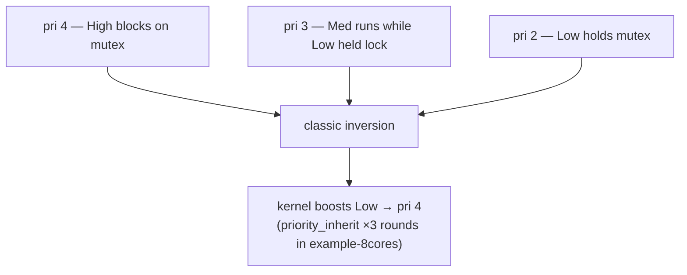

**How the viewer detects L/M/H:** at the end of each boost episode, it scans every task with a known `create pri:N`.
Any task whose **base priority** satisfies **Base** &lt; *p* &lt; **Peak** (strictly between the boosted task's base and peak) is a **medium blocker**.
If at least one exists, the episode is an **inversion suspect** and contributes to the **L/M/H** pattern.

- **Episode** level: `inversionSuspect` when the episode was mutex-inherited **or** medium blockers exist; episode **Pattern** may list medium task names.
- **Summary** level (table **Pattern** column): aggregates episodes — `Mutex inherit`, `L/M/H pattern`, `Mutex inherit + L/M/H`, or `Boost only`.

**Important:** medium-blocker detection uses **all** tasks in the trace with recorded create priorities, not only tasks active in that instant.
On a busy SMP trace (many workers at `pri:3` from earlier tests), the episode label may show several medium names (for example, `Mutex inherit L/M/H (CS[11], CS[12] +126)`).
For test 8, **Med[267]** is the semantically relevant **M**; cross-check with the timeline around test 8 (~3042–3359 ms absolute, `--lo 3042000 --hi 3359000`) and `Demo/examples/freertos_test/main.c` test 8 (`vInvLow` / `vInvMed` / `vInvHigh`).

**Example — test 8 in `example-8cores.btf.gz` (`Low[266]`):**

| Field | Value |
|-------|--------|
| **Base / Peak** | 2 → 4 |
| **Boosts / Boosted** | **3** mutex-inherit episodes, ~34.4 ms each (~103 ms total) |
| **Summary Pattern** | **Mutex inherit** |
| **Episode Pattern** | **Mutex inherit L/M/H** (medium tasks include **Med[267]** at pri 3) |
| **STI windows** | `3099448→3133873`, `3187403→3221850`, `3275380→3309826` µs |

Zoom the timeline to that window (or click a **Low[266]** scatter point) to see the **three red** boost stripes on the Low row and **High** blocking on the mutex between them.

**Contrast — test 7 (`PS[228]`, manual boost):** the runner calls `vTaskPrioritySet(subject, BOOST_PRIORITY)` — trace shows `set_priority` STI events, not `priority_inherit`.
**PS[228]** has the same numeric geometry (base 2, peak 4, medium fillers at pri 3) so the summary **Pattern** is **L/M/H pattern** (not **Mutex inherit**).
Boost duration is much shorter (~119 µs) because no mutex hold loop is involved.
Use **PS[228]** compared with **Low[266]** to separate kernel inheritance from application-driven priority changes.

**Timeline UX** — boosted periods appear as a **bottom stripe** on the task row (horizontal) or a **right-edge stripe** (vertical): **orange** = boost only (`Boost only` / manual `set_priority` without L/M/H geometry); **red** = mutex inherit or any L/M/H-related pattern.
Task labels show **`· pri N`** when create priority is known.

**Low[266]** on the timeline in `example-8cores.btf.gz` (zoomed to test 8, `--lo 3042000 --hi 3359000`).
Three **red bottom stripes** on the Low row mark the `priority_inherit` → `priority_disinherit` windows (~34.4 ms each).
**Med[267]** runs on the same core before each inherit; during each boost window Med stays off-CPU:

![Timeline view: Low[266] with three red priority-inheritance stripes (example-8cores.btf.gz)](../images/stats/tasks-priority-low.svg)

Export a timeline SVG from the viewer (**File → Save SVG** or toolbar) after zooming to the episode, or regenerate it headlessly via `make -C BTFViewer update-images` (desktop CLI `snapshot --view timeline --task ... --lo ... --hi ...`).

**Distribution chart** — click any Priority Inheritance table row:

- **Scatter:** x = boost episode end time, y = boosted duration. Orange points = boost only; red = L/M/H / mutex inherit. Test 8 contributes **three** clustered red points near ~34 ms.
- **Histogram:** distribution of boost durations.
- **Click a point** to zoom to that episode, scroll to the task row, highlight it, and add an annotation (re-click skips duplicate annotations).

**Export HTML** includes a **Boost episodes** detail sub-table (up to 200 rows by start time).

**Low[266]** distribution (test 8: three mutex inherit episodes, base pri 2 → peak 4, ~34.4 ms each):

![Priority boost distribution chart for Low[266] in example-8cores.btf.gz](../images/stats/stats-priority-low.svg)

**PS[228]** (test 7: manual `vTaskPrioritySet`, **L/M/H pattern**, ~119 µs boosted) contrasts with **Low[266]** above. It has the same base/peak numbers, different mechanism and duration.

**Note:** `traceTASK_PRIORITY_INHERIT` / `traceTASK_PRIORITY_DISINHERIT` are invoked by the FreeRTOS kernel inside `xTaskPriorityInherit()` / `xTaskPriorityDisinherit()` when `configUSE_MUTEXES` is enabled.

<a id="mutex--semaphore-pairing" name="mutex--semaphore-pairing">&#x200B;</a>
### Mutex / Semaphore pairing 

When queue trace hooks are enabled (`configINCLUDE_QUEUE_EVENTS`), mutex and semaphore STI lines include the **FreeRTOS object pointer** in the note:

```text
703266,Core_0,0,STI,mutex,0,trigger,take 0x80018700
707222,Core_3,0,STI,mutex,0,trigger,give 0x80018700
```

The viewer pairs **`take`/`give`** (and **`create`/`delete`**) **per pointer**, not per STI channel alone — so two mutexes of the same type stay distinct.
The kernel **`give`** immediately after **`create`** (mutex / binary sem available) is ignored when it falls within **1 ms** of the create event.

**Semaphores** use two pairing directions automatically:

| Pattern | Example | Pairing |
|---------|---------|---------|
| **Hold** (take → give) | Area slot sem, worker acquires then releases | `take` opens, matching `give` closes (FIFO) |
| **Signal** (give → take) | `*_done` / `*_go` coordination sems | `give` posts, matching `take` consumes (FIFO) |

**Mutexes** always use hold pairing (LIFO — owner must `give`).

**Formula** — for each paired hold span *h* of duration τ<sub>h</sub>:

```math
\bar{\tau}_{\mathrm{hold}} = \frac{1}{N_{\mathrm{holds}}} \sum_h \tau_h
```

**What it tells you:** **Avg hold** shows typical lock or semaphore residency time. Very long holds inflate blocking for waiters.
**Issues** > 0 (orphan give, cross-task give, unmatched take, delete while held) mean the trace does not form clean take/give pairs and hold statistics may be incomplete.
**Deadlock risk** at trace end flags multiple mutexes still held by different tasks. Verify whether that is expected teardown or a real stall.

| Column | Meaning |
|--------|---------|
| **Object** | Kind + pointer (`mutex 0x80018700`) |
| **Kind** | `mutex` or `sem` |
| **Holds** | Number of paired take→give spans in scope |
| **Issues** | Pairing problems in scope |
| **Avg hold** | Mean hold duration across paired spans |
| **Status** | **OK**, **Warning**, or **Error** |

| Check | Severity | Meaning |
|-------|----------|---------|
| **Orphan give** | Error | Mutex `give` with no matching open `take` on that pointer |
| **Cross-task give** | Warning | Mutex `give` by a different task than the one that `take` |
| **Unmatched take** | Warning | `take` still open at trace end |
| **Unmatched give** | Warning | Semaphore `give` still unmatched at trace end |
| **Delete while held** | Warning | `delete` while resource `take`s are still open (common during teardown) |
| **`CORE_MIGRATION_WHILE_HELD`** | Warning | Mutex `take` on one core, `give` on a different core — the lock crossed a core boundary while held; indicates a **cache-line bounce** where the hardware cache line containing the lock data is transferred between cores. Shown in the Pairing Issues sub-table with the exact from/to cores (for example, `Lock bounced from Core_0 to Core_1`) |
| **Deadlock risk** | Warning | ≥2 mutexes still held by ≥2 different tasks at trace end |

The running task for each event is inferred from the **core timeline** at that timestamp (same approach as interval `tid` pairing).

Below the summary table, a **Pairing issues** sub-table lists every problem in scope (time, object, issue kind, detail).
**Click any issue row** to zoom to the running task segment on that core (when found), jump to the issue timestamp, highlight the segment, and add an annotation with a descriptive note (Desktop + Web).
Re-clicking the same point skips duplicate annotations.

**Export HTML** adds two detail sub-tables under this section: all **Pairing issues** in scope (including `CORE_MIGRATION_WHILE_HELD` warnings), and **Hold episodes** (longest first, up to 150 rows) with **Take core** and **Give core** columns.

**Export CSV** includes a **Core Affinity Violations** sub-section listing each mutex that had at least one bounced hold, with the bounce count and a description.

`example-4cores.btf.gz` (tests 1–3) exercises `0x80018700` (mutex) and `0x80018650` (counting sem) with clean hold pairing.
The full trace shows `CORE_MIGRATION_WHILE_HELD` warnings on `0x80018700` (3 bounces) and `0x80018650` (1 bounce). The Statistics **Mutex / Semaphore** summary table will show **Warning** for these mutexes and non-zero values in the **Bounces** column.
Coordination sems pair in **signal** direction.

<a id="waiter--owner" name="waiter--owner">&#x200B;</a>
### Waiter × Owner 

Heuristic matrix from consecutive mutex holds on the same object: the next distinct acquirer is treated as the waiter, and the previous holder as the owner.
Cell values are the summed hold time of those handoffs.
This is **not** a kernel wait-queue reconstruction. BTF records successful take/give, not blocked attempts.
Click a cell to zoom the longest handoff.

<a id="mutex-blocking" name="mutex-blocking">&#x200B;</a>
### Mutex Blocking 

Per-task totals of those heuristic mutex waits (object, last owner, count, total, max), plus a **Top blocking contributors** ranking across mutex waits, preemption overlap, and leftover idle gaps.
Click a row to jump to the longest wait.

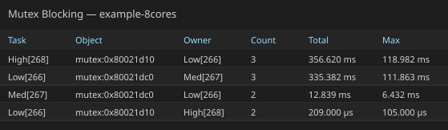

<a id="queue" name="queue">&#x200B;</a>
### Queue 

When `queue` STI events are present (`configINCLUDE_QUEUE_EVENTS`), the **Queue** section pairs `send`/`recv` (and `create`/`delete`) **per object pointer**, the same way Mutex / Semaphore pairing works for `take`/`give`.

| Column | Meaning |
|--------|---------|
| **Object** | Kind + pointer (`queue 0x……`) |
| **Holds** | Number of paired send→recv (or equivalent) spans in scope |
| **Issues** | Pairing problems in scope |
| **Avg hold** | Mean hold duration across paired spans |
| **Status** | **OK**, **Warning**, or **Error** |

Shown only when the trace contains `queue` STI events. For mutex/semaphore bounce and issue detail, see **Mutex / Semaphore pairing** above.

## 5. Anomalies, instrumentation, and advanced analysis

Use these tools to find unusual events, inspect critical paths and recurring patterns, and analyze interval or tag instrumentation.

<a id="timeline-anomalies" name="timeline-anomalies">&#x200B;</a>
### Timeline Anomalies 

Scans the current Statistics scope for unusually long execution, blocking, or heuristic response tails (mean+3σ or ≥ p99), tight migration / preemption / ISR / wakeup bursts, CPU utilization spikes, idle gaps, mutex-wait spikes, and configured deadline misses.
Click a row to zoom, place C1–C2, highlight the task, and scroll to the matching table.
**Investigate…** opens the AI tab on the selected (or top) anomaly.

<a id="worst-events" name="worst-events">&#x200B;</a>
### Worst Events 

One list of the longest execution, blocking, inter-arrival, and heuristic response episodes across tasks. Click a row to jump and set cursors on that episode.

<a id="critical-path" name="critical-path">&#x200B;</a>
### Critical Path 

Takes the longest heuristic ready→completion windows and splits each into overlapping exec / preempt / wait / migration / other.
This is **not** a kernel release/completion pair.
Click a component to jump to that episode.

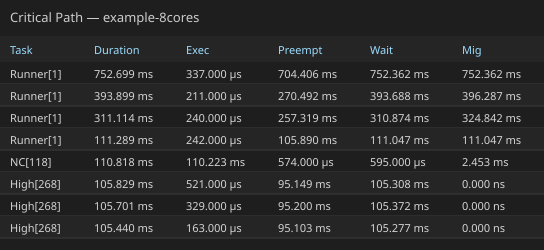

<a id="recurring-patterns" name="recurring-patterns">&#x200B;</a>
### Recurring Patterns 

Groups Timeline Anomalies by task and kind and keeps kinds that repeat. Click a row to jump to the worst instance.

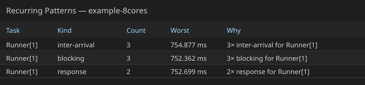

<a id="interval-analysis" name="interval-analysis">&#x200B;</a>
### Interval Analysis 

Pairs **`interval_start` / `interval_stop`** STI events into measurable code regions.
Each interval **id** gets an **Interval N** row on the timeline (horizontal task view) with colored span bars; the statistics table aggregates duration across all paired spans for that id.

**Formula** — for each paired instance *j* with start *t*<sub>s</sub> and stop *t*<sub>e</sub>:

```math
\tau_j = t_e - t_s
```

**Count** is the number of paired spans in scope.

**Min / Avg / Max / p95** are calculated from all interval durations τ<sub>j</sub>.

**What it tells you:** Interval metrics measure **how long instrumented code regions take**, such as loop iterations, critical sections, or end-to-end handlers.
Tight clusters in the distribution chart mean stable iteration time; outliers or a high **Max** often mark contention, preemption inside the region, or pairing artefacts (see **Limitations** under Interval Analysis below).
Compare interval ids to separate workloads (for example, mutex stress compared with lighter loops in the same trace).

> **Cross-task timing tip:** `interval_start` / `interval_stop` pairing is scoped **per task id** (see [Pairing algorithm](#pairing-algorithm) below). It measures elapsed time **within the same task**.
To measure elapsed time **between two different tasks or ISRs** (for example, a producer marks a tag on one task/core and a consumer picks it up on another), pairing by task id does not apply.
Use a **tag channel** (`btf_traceTAG(id, value)`) instead: tag samples carry no task/id pairing, so consecutive samples on the same channel measure the cross-task interval directly.
See [Tag Analysis → Interval tab](#tag-analysis).

**BTF note field** (last CSV column on each interval line):

| Format | Example | Viewer pairing |
|--------|---------|----------------|
| Current firmware | `1 tid:7` or `0 tid:0x8` | Interval id + task id (decimal or `0x` hex); same numeric id on different tasks does not cross-pair |
| Legacy | `1` | Full note string `1` only |

Recorded by `traceINTERVAL_START(id)` / `traceINTERVAL_STOP(id)` in firmware. The task id is captured automatically in `param2` and emitted in the note as `tid:…`.
See [Binary → BTF dump mapping](../TRACE_FORMAT.md#binary--btf-dump-mapping).

| Column | Meaning |
|--------|---------|
| **ID** | Interval id from `traceINTERVAL_START(id)` / `traceINTERVAL_STOP(id)` |
| **Label** | Display name (`Interval N`) |
| **Count** | Number of paired start→stop spans in scope |
| **Min / Avg / Max / p95** | Interval duration statistics |

**Distribution chart** — click any row:

- **Scatter:** x = interval stop time, y = interval duration.
- **Histogram:** distribution of interval durations.
- **Click a point** to jump to the **interval start** and add an annotation with duration/time notes.

**Export HTML** includes an **Interval instances** detail sub-table (longest first, up to 200 rows).

**Interval 1** in `example-8cores.btf.gz` (1728 spans from eighteen `vCtxSwitchWorker` tasks. CS[11]–CS[28] — sharing id `1` — each worker pairs via its own `tid` in the note):


Most spans cluster at short durations (tight yield loops); occasional high **y** points mark iterations that waited longer on the shared mutex or area semaphore.
Compare ids **4–6** (shorter per-iteration work) compared with **1–3** (heavier stress tests) in the same table.

<a id="pairing-algorithm" name="pairing-algorithm">&#x200B;</a>
##### Pairing algorithm 

At parse time, the viewer collects all `interval_start` / `interval_stop` STI events, sorts them by time (start before stop at the same timestamp), and pairs them with a **per-key stack** (LIFO).

**Note parsing** (last BTF CSV field):

| Note format | Pairing key | Timeline / stats row id |
|-------------|-------------|-------------------------|
| `{id} tid:{task_id}` (current firmware) | interval `id` + `task_id` | `id` only (`Interval N`) |
| `{id}` or other legacy text | full note string | same as note |

When `tid:` is present, concurrent workers can share the same interval **id** without cross-pairing: task 7's `START(1)` only pairs with task 7's `STOP(1)`, even if task 8 uses id `1` at the same time.
Legacy traces without `tid` keep the original behaviour (pair by note / id string only).

1. **`interval_start`** — push the event onto that key's stack.
2. **`interval_stop`** — pop the most recent unmatched start for that key and form one instance `[start_time, stop_time]`.
3. **`interval_stop` with an empty stack** — ignored (orphan stop).
4. **Unmatched starts after the trace ends** — counted internally but not shown in statistics or on the timeline.

An **Interval N** row appears only when at least one **start→stop** pair exists for that id.
If firmware emits `interval_start` without matching `interval_stop` events (same id and `tid` when present), that id is omitted entirely.

**Example — interval id with no paired spans:**

| Interval id | `interval_start` | `interval_stop` | Viewer |
|-------------|------------------|-------------------|--------|
| 0 | 50 | 50 | **Interval 0** |
| 1 | 100 | **0** | *(no row — nothing to pair)* |
| 2 | 50 | 50 | **Interval 2** |

If firmware emits `interval_start` for an id but never records matching `interval_stop` events (same id and `tid` when present), that id is omitted from the timeline and statistics.
Ensure every `traceINTERVAL_START(id)` has a corresponding `traceINTERVAL_STOP(id)` with the same task id in the note when `tid:` is used.

This is **LIFO (last-in, first-out) nesting** within each pairing key.

```text
# Nested on one task (same pairing key)
START(id=2)           stack: [A]
  START(id=2)         stack: [A, B]
  STOP(id=2)    →     pairs B→B  (inner span)
STOP(id=2)      →     pairs A→A  (outer span)

# Two tasks, same interval id, with tid in note
Task 7: START  note=1 tid:7
Task 8: START  note=1 tid:8
Task 7: STOP   note=1 tid:7   → pairs with task 7 start only
Task 8: STOP   note=1 tid:8   → pairs with task 8 start only
```

Result: **two** instances — one for the inner region, one for the outer region — each with the correct duration.
**Min / Avg / Max / p95** in the statistics table are computed over **all** paired instances whose time range overlaps the active scope (full trace or cursor range).
Timeline display uses a separate rule (see below).

<a id="limitations" name="limitations">&#x200B;</a>
##### Limitations 

**1. Concurrent overlap with the same id (cross-pairing)**. *legacy traces without `tid`*

When the BTF note has **no** `tid:{task_id}` suffix, pairing uses the note string only.
The stack algorithm then assumes stops arrive in the **reverse order** of starts.
That holds for true call-stack nesting on one thread, but **not** when several tasks use the **same interval id** at the same time.

```text
Task on Core_1: START(2) ─────────────────────── STOP(2)
Task on Core_2:      START(2) ───────── STOP(2)
Event order:       S1          S2         S1      S2
                   └─ stack pairs S2 with S1's STOP (wrong)
```

When starts and stops interleave across cores, the viewer can pair one task's **start** with another task's **stop**. That produces:

- **Count** — still the number of stop events that found a start on the stack (often equals the number of loop iterations).
- **Min / Avg / Max / p95** — can be **wrong**: bogus **very long** spans inflate max and avg; the distribution chart shows outlier points far above the real iteration time.

`example-4cores.btf.gz` is recorded **with** `tid` in each interval note, so ids **1–4** pair correctly across parallel workers.
**Legacy** traces that omit `tid` may still cross-pair when several tasks share one id:

| Interval id | Test (see `Demo/examples/freertos_test/main.c`) | Without `tid` — typical symptom |
|-------------|--------------------------------------------------|--------------------------------|
| 1 | Context-switch / mutex stress (`vCtxSwitchWorker`) | Inflated **Max** / outlier scatter points |
| 2 | Mutex workers (`vMutexWorker`) | Same |
| 3 | Area-semaphore workers | Same |
| 4 | Nested interval stress | Same |

For legacy traces, treat **short-duration clusters** in the scatter/histogram as the meaningful iteration times; treat isolated **very large** points and the table **Max** as pairing artefacts unless you have verified LIFO ordering for that id.

**2. SMP task migration — why pairing is not done by core**

The viewer pairs by **interval id** (and **task id** when `tid` is present), not by the **core** field on each STI event.
A core-based matcher might seem attractive when several tasks share one id, but on **SMP** it is **not reliable**:

- A task can **migrate** between cores while an interval is open (`START` on Core_0, body runs, `STOP` on Core_2 after migration).
- Preemption and scheduling can also make the "running core" at `START`/`STOP` differ from the core where most of the work ran.
- Matching `START` and `STOP` by core would then **fail to pair** valid spans or would **split one logical interval** into orphan events.

```text
Task A (may migrate):
  START(2) on Core_0  … runs on Core_0, then Core_1 …  STOP(2) on Core_1
  Core-based match: no single core owns both ends → broken or missed pair
  Id + tid stack: pairs correctly if no other task uses id 2 concurrently
```

So the viewer does **not** use core as a pairing key.
With **`tid` in the note**, several tasks may share the same interval id safely; without `tid`, prefer **one interval id per logical scope** or accept LIFO-only pairing.
Core columns on paired instances (`start_core` / `stop_core` in the parsed data) are informational only.

**3. True time nesting compared with concurrent overlap**

| Situation | Pairing correct? | Statistics meaningful? |
|-----------|------------------|-------------------------|
| Nested `START`/`STOP` on **one thread** (LIFO order) | Yes | Yes — each nesting level is a separate instance |
| **Concurrent** tasks, **different** ids | Yes | Yes — ids are independent |
| **Concurrent** tasks, **same** id, **with `tid` in note** | Yes | Yes — per-task pairing keys |
| **Concurrent** tasks, **same** id, **no `tid`** (legacy) | Often **no** | **Count** ok; min/avg/max may be skewed |
| Start without matching stop (crash / trace cut-off) | Partial | Unmatched starts excluded from stats |

**4. Timeline bars compared with statistics count**

The statistics table and distribution charts use **every** paired instance in scope.
The timeline draws **top-level spans only**: if instance B's `[start, stop]` lies entirely inside instance A's range (same id), only A is drawn.
This is a **display** rule only; it does not change **Count** or min/avg/max.

| View | What you see |
|------|----------------|
| **Statistics → Count** | All paired spans (including nested and cross-paired) |
| **Distribution chart** | One point per paired span (same set as Count) |
| **Timeline → Interval N row** | Non-nested spans only (fully contained children hidden) |

Typical timeline bar counts for the full `example-4cores.btf.gz` trace:

| Interval id | Statistics **Count** | Timeline bars (top-level) |
|-------------|----------------------|---------------------------|
| 1 | 480 | 5 |
| 2 | 480 | 7 |
| 3 | 240 | 1 |
| 4 | 480 | 1 |

**Interval 2** on the timeline: **7** bars (one long outer span plus six shorter top-level spans), while the table still reports **Count = 480**.
Use the distribution chart (click a scatter point) or a narrow cursor range to jump to one specific paired instance.

**5. Instrumentation guidance**

To get reliable per-task interval statistics:

- **Preferred (firmware in this repo):** use `traceINTERVAL_START(id)` / `traceINTERVAL_STOP(id)` — the logger records **`tid:{task_id}`** in the BTF note so parallel workers can share the same numeric `id`.
- **Legacy traces** without `tid`: use a **distinct interval id per task** (or per logical scope), not one shared id across parallel workers.
- For nested regions on a single thread, reuse the same id — LIFO pairing matches `START`/`STOP` nesting within each pairing key.
- Do **not** rely on **core** to disambiguate pairs on SMP: tasks can **migrate** between `START` and `STOP` (see limitation 2 above).
- Orphan stops (stop without start) are dropped; orphan starts at end of trace are not counted in the table.

<a id="timeline-rendering" name="timeline-rendering">&#x200B;</a>
##### Timeline rendering 

Interval bars are drawn as **solid** spans in the interval’s colour. **Start** and **stop** events are marked with vertical tick lines (solid at start, dashed at stop) on the interval row.

<a id="tag-analysis" name="tag-analysis">&#x200B;</a>
### Tag Analysis 

Aggregates numeric samples from the 8 general-purpose STI **tag** channels (`tag0_event` … `tag7_event`, plus the unindexed `tag_event`). These are free-form values emitted by firmware via `btf_traceTAG(id, value)` for any application-defined metric that does not fit an existing STI channel (queue depth, ADC reading, free heap, sensor reading, etc.).
One row appears per channel that has at least one sample.

**Formula** — over all sample values *v*<sub>k</sub> on a channel in scope: **Count** is the number of samples; **Min / Avg / Max** are the usual statistics; **p95** is the 95th-percentile value.

**What it tells you:** Unlike the other metric tables, the tag y-axis is the **raw application value**, not a duration. Its meaning depends entirely on what firmware puts in the channel.
A widening spread or a rising trend in the scatter plot can flag a slow memory leak (free heap), growing backlog (queue depth), or drifting sensor reading; a tight cluster around **Avg** with occasional **p95**/**Max** outliers is normal sampling noise.

| Column | Meaning |
|--------|---------|
| **Channel** | Display name (`Tag 0` … `Tag 7`, or `Tag` for the unindexed `tag_event`) |
| **Count** | Number of samples in scope |
| **Min / Avg / Max / p95** | Sample value statistics (not a time duration) |

**Distribution chart** — click any row:

- **Scatter:** x = sample time, y = tag value.
- **Histogram:** distribution of tag values.

<a id="interval-tab-time-between-samples" name="interval-tab-time-between-samples">&#x200B;</a>
##### Interval tab (time between samples) 

The distribution popup has two in-dialog tabs — **Value** (above) and **Interval** — mirroring the **Core Migrations** Dwell/Rate/Gap tabs.
Click **Interval** to switch the same scatter + histogram widgets to show the **elapsed time between consecutive samples** on that channel, regardless of which task or core emitted them.

**Formula** — for consecutive samples (sorted by time) *k* and *k−1* on one channel:

```math
\delta_k = t_k - t_{k-1}
```

**Scatter:** x = the later sample's time, y = δ<sub>k</sub> (rendered as a duration, using the same adaptive time units as other metric charts).
**Histogram:** distribution of δ<sub>k</sub> with the usual min/avg/max/p95 reference lines and [CDF overlay](#cdf-overlay).
Clicking a scatter point jumps to and annotates the later sample's time.

This is the **recommended way to measure elapsed time across two different tasks or ISRs**: emit `btf_traceTAG(id, marker)` from each side of the cross-task event (for example, once when a producer task hands off, once when the consumer task/ISR observes it) and read the interval distribution's min/avg/max/p95 as the cross-task latency. No `tid` pairing is needed since tag samples are unpaired, timestamp-ordered markers.

**tag0_event** in `example-8cores.btf.gz` (2330 samples, min 8,144, avg ≈ 36,845, max 71,904, p95 41,936):


Shown only when the trace contains `tag0_event` … `tag7_event` (or `tag_event`) STI samples.

## 6. Charts and trace comparison

Use these tools to inspect metric distributions or compare statistics from two traces.

<a id="distribution-explorer" name="distribution-explorer">&#x200B;</a>
### Distribution Explorer 

Choose a metric (execution, blocking, inter-arrival, response, dispatch, wake, preemption) and a task.
The section shows n / p50 / p99 / CV, a sparkline, and the **histogram/CDF at the bottom** of the section (same adaptive scale as other metric plots).
**Open histogram** still opens the full scatter + histogram window.
Wake is heuristic response wait, not a kernel wakeup event.

<a id="metrics-distribution-charts" name="metrics-distribution-charts">&#x200B;</a>
### Metrics distribution charts 

In the **Statistics** panel, click any row in **Concurrent Core Active**, **Kernel Switch Overhead**, **Execution Time**, **Blocking Time**, **Dispatch / Scheduling Latency**, **Inter-Arrival**, **Core Migrations**, **Preemption Chain**, **Priority Inheritance**, **Interval Analysis**, or **Tag Analysis** to open a floating chart popup.
In **Trace Health (TICK)**, use the **Tick Distribution…** button (bar-chart icon beside the mode badge when ≥ 2 ticks are in scope).
**Core Migrations** popups additionally show in-dialog tabs (**Dwell** / **Rate** / **Gap**) and **Tag Analysis** popups show tabs (**Value** / **Interval**) to switch metrics without closing the chart.

- **Scatter plot** — each event plotted in trace time order so you can spot trends, bursts, or outliers.
- **Histogram** — adaptive bar chart of the value distribution:
  - **Auto scale** (default) picks **linear**, **p5–p95**, or **log duration** from the data spread so bars are not squeezed when min/max or outliers span a wide range.
  - **Histogram scale** dropdown (Desktop toolbar above histogram; Web above the chart): **Auto**, **Linear**, **p5–p95**, **Log duration**.
  - **Adaptive bin count** (Freedman–Diaconis, 12–80 bins) instead of a fixed 50-bin linear split.
  - **Overflow buckets** in p5–p95 mode — separate dimmed bars for values below p5 and above p95, with counts in the caption.
  - **Log-scaled counts** when one bin dominates (tall spike compared with many small bars).
  - **Hover a bar** to see the bin range (or `< p5` / `> p95`) and how many samples fall in that bucket.
  - **CDF overlay** — cumulative distribution curve on the histogram (see [CDF overlay](#cdf-overlay) below).
  - Dashed reference lines for **avg**, **p5**, **p50**, and **p95**; caption shows the active scale and full min–max range.
- **Export PNG / SVG** — buttons in the chart footer save the current scatter + histogram.

The popup can be dragged, resized, and closed independently of the main window.
If the chart is open, it **updates live** when you move cursors or toggle cursor-range scope.
Each open trace tab remembers its own chart when you switch tabs.

<a id="cdf-overlay" name="cdf-overlay">&#x200B;</a>
### CDF overlay 

Every metrics histogram includes a **cumulative distribution function (CDF)** drawn as a **blue line** over the bars. It answers a different question than the histogram alone:

| View | Question it answers |
|------|---------------------|
| **Histogram bars** | *How many* samples fall in each duration bucket? |
| **CDF curve** | *What fraction* of samples are **at or below** a given duration? |

The CDF is an **empirical** CDF (ECDF): for each sample in the active scope (full trace or cursor range), sorted by duration from shortest to longest, the curve plots **(duration → cumulative %)**.
There is one step per sample; when several samples share the same duration, the curve rises vertically at that x position.

**How to read the chart**

```
 100% ┤                              ╭── CDF (blue)
      │                         ╭────╯
  50% ┤              ╭──────────╯
      │         ╭────╯
   0% ┤─────────╯
      └────────────────────────────────── duration →
        short                              long
```

- **Horizontal axis (bottom)** — duration (same scale as the histogram bars: linear, p5–p95, or log, depending on **Histogram scale**).
- **Left vertical axis** — sample **count** per bin (bar height).
- **Right vertical axis** — cumulative **percent** (0%, 50%, 100% labels on a dashed guide line).
- **Curve direction** — starts at the **bottom-left** (0% of samples below the shortest value) and rises toward the **top-right** (100% of samples included). A **steep** rise means many samples cluster at similar short durations; a **gradual** rise means values are spread out.

**Relating the CDF to table columns and reference lines**

The dashed vertical markers on the histogram are single-number summaries; the CDF shows the **full** cumulative picture:

| Marker / table column | On the CDF |
|-----------------------|------------|
| **p5** (cyan) | Curve crosses **5%** on the right axis — 5% of samples are shorter than this duration. |
| **p50** (green) | Curve crosses **50%** on the right axis at the median duration. |
| **p95** (orange) | Curve crosses **95%** — 95% of samples are shorter than this duration. |
| **avg** (purple) | Shown as a vertical line; the CDF does **not** pass through a fixed “avg %” because the mean is not a percentile. |

**Example readings** (Execution Time for a task with 100 slices):

- At duration *D* where the CDF is at **30%**, about **30 slices** (30%) finished in *D* or less — useful for “how often does this task complete within my deadline?”
- If the curve is already above **90%** while still on the **left half** of the chart, most runs are short and the tail is light.
- If the curve stays below **50%** until far right, the distribution is **wide or skewed** — the histogram bars alone may look crowded; switch **Histogram scale** to **Log duration** or **p5–p95** and use the CDF to see where the bulk of the mass sits.

**Histogram scale and the CDF**

The CDF always reflects the **same samples** as the bars; only the **x mapping** changes with the scale mode:

| **Histogram scale** | Effect on CDF |
|---------------------|---------------|
| **Auto** / **Linear** | Duration mapped linearly from min to max. |
| **p5–p95** | Main curve spans the p5–p95 window; outliers appear in dimmed underflow / overflow buckets at the edges, and the CDF steps into those buckets at the corresponding percentiles. |
| **Log duration** | Short and long durations are spread across the axis; the CDF is easier to read when bars would otherwise pile up on the left. |

The caption above the histogram (for example, `log-scaled duration axis · full range 17 µs–975 µs`) always shows the **true** min–max range even when the axis is compressed or clipped.

**When to use the CDF**

- **Deadline / budget checks** — estimate what % of activations meet a time limit without reading individual scatter points.
- **Compare spread** — two tasks with similar **p50** can have very different CDF shapes (tight cluster compared with long tail).
- **Skewed data** — after switching away from a crowded linear histogram, use the CDF with **p5** / **p50** / **p95** lines to see how much of the population sits below each marker.
- **Cursor-scoped analysis** — with **Limit to C1–Cn** enabled, the CDF recalculates for only the slices inside that window, same as the table and scatter plot.

The CDF is included in **Export PNG / SVG** from the plot dialog. It is not interactive (no click-to-jump); use the **scatter plot** above the histogram to jump to individual events.

**Jump links:** in Execution Time, Blocking Time, and Inter-Arrival tables, click **Min** / **Max** / **p95** / **p99** (dotted underline) to jump to that slice or gap and add an **annotation**.
In **Dispatch / Scheduling Latency**, click **Min** or **Max**.
Click any **distribution-chart** point to jump to that event and add an annotation without switching right-panel tabs (segment start for task metrics; tick timestamp for **Tick Distribution**; switch/concurrency timestamp for those plots; zoom + highlight for **Priority Inheritance** episodes; interval start for **Interval Analysis**).
In Preemption Chain, the annotation is placed at the **preemptor segment** start.
In **Mutex / Semaphore**, click any **Pairing issues** row to zoom to the running task segment on that core, jump to the issue time, and add an annotation.
**Timeline Anomalies** / **Worst Events** rows zoom and place C1–C2 on that episode.

Example plots from `tracedata/example-4cores.btf.gz` (4-core SMP trace, 67 tasks) are in [Statistics metric tables](#statistics-metric-tables).

---

<a id="trace-compare-1" name="trace-compare-1">&#x200B;</a>
### Trace Compare… 

Use **Trace Compare…** to compare two runs of the same workload, such as a baseline build and a candidate build. For a meaningful comparison, keep the workload, instrumentation, core count, and capture phase as similar as possible. If the trace lengths differ, prefer the normalized `/s`, `%`, and `pp` metrics over raw totals.

**Before you compare**

- Use **Trace A** for the baseline and **Trace B** for the candidate.
- Compare equivalent phases. When full traces include different setup or teardown periods, place cursors around the matching workload in each tab.
- Check the Overview identity and validation warnings before interpreting a delta. A different span, task set, tick mode, or worst-P99 task can make a numerical difference misleading.
- Task rows are matched by display name (`Name[id]`). If task IDs change between runs, logically identical tasks may appear as separate rows.

**Open a comparison**

1. Open at least **two** `.btf` files (Desktop: **File → Open** adds a tab; Web: **Open** adds a tab in the bar under the toolbar).
2. Click toolbar **Compare** (right after **Analysis**; enabled when two or more tabs are loaded).
3. Choose **Trace A (Baseline)** and **Trace B (Candidate)** from the dropdowns.
4. Optionally check **Limit to each tab's cursor range** to compare metrics within C1–Cn on each trace (requires 2+ cursors per tab).
5. Switch between **Summary**, **Top Tasks**, **Core Util**, **Core Migrations**, **Execution**, **Blocking**, **Inter-Arrival**, **Preemption**, **Sync**, **Response**, **Mutex**, and **Trends** tabs.
6. Optionally click **Validate experiment…** to compare the expected and actual deltas and score the experiment in the **AI** tab. The host fills the actual percentages from the current comparison, including **Scope to cursors**. Use **Query with AI…** to send the current Trace A / B tables to the AI tab; if AI is disabled, BTFViewer opens **Settings → AI**.

By default, Compare uses the **full trace** on both sides. With the cursor-range option enabled, each side uses its own tab's cursor window independently; the two windows do not need the same absolute timestamps, but they should represent equivalent workload phases.

**Export CSV** and **Export HTML** include every Compare table the dialog reports — **Summary**, **Top Tasks**, **Core Util**, **Core Migrations**, **Execution**, **Blocking**, **Inter-Arrival**, **Preemption**, **Sync**, **Response**, **Mutex**, **Shared Patterns**, and **Trends** — with every task row, not only the top-N preview in the dialog. **Export HTML** adds a table of contents with **Expand all** / **Collapse all**. **Overview** and **Summary** start expanded; the remaining tables collapse, matching Statistics HTML export. Summary includes compact change bars; Core Util and Response include charts; Core Migrations starts with a **migration Δ heatmap** and a **Largest changes (count & rate)** preview, then the full 16-column table.

**Overview** — comparison identity (file, range, tick mode), the delta convention, a short verdict, four status cards (regressions, improvements, significant changes, validation warnings), and a **Notable Changes** table. Status always describes **Candidate B relative to Baseline A**: **Improved**, **Regressed**, or **Changed**. A change is listed only when it clears both an absolute and a relative threshold, so small differences are not automatically labelled as regressions. Tick-mode detection is checked against filenames containing `tickful` or `tickless`. Worst response P99 names the task on each side; a warning appears when the two sides refer to different tasks. The formula line also explains that **—** means unavailable, not zero; **pp** means percentage points; and STI, σ, Dwell, Ping, P99, and `/tick` are expanded.

#### Read the delta direction correctly

The report uses two numerical directions for different purposes:

| Location | Formula | How to read it |
|---|---|---|
| Compare data tables | **Δ = Baseline A − Candidate B** | Positive means A is numerically larger; negative means B is numerically larger |
| Notable Changes and change-bar charts | **Change = Candidate B − Baseline A** | Positive means the candidate increased; negative means it decreased |
| Status and colour | Candidate B relative to Baseline A | **Improved** / **Regressed** is based on metric meaning, not on the sign alone |

For a lower-is-better metric such as response time, blocking time, issue count, or migration count, a positive table Δ usually means Candidate B improved. For a higher-is-better metric such as Load Balance Score, a negative table Δ may mean Candidate B improved. Metrics without a clear preferred direction are labelled **Changed**. Always use the status/colour and metric meaning instead of assuming that `+` is good or bad.

Percentage-point deltas (CPU, utilisation, and load balance) use a **pp** suffix. Times omit trailing zeros (`19 µs`, not `19.000 µs`).

**Recommended reading order**

1. Confirm the files, scopes, tick modes, and validation warnings in **Overview**.
2. Use normalized rows in **Summary** when spans differ.
3. Review **Notable Changes** to find changes large enough to investigate.
4. Open the related detail tab, then return to each timeline to verify the events behind the numbers.

**Summary** — high-level diff:

| Metric | Notes |
|--------|--------|
| Span | Total trace duration (or cursor-range width when scoped) |
| Tasks / Segments / STI events | Counts |
| Context switches | Total across all cores |
| Context switches /s | Span-normalized rate (comparable across unequal lengths) |
| Core gap avg / max | Idle time between consecutive slices on each core |
| Migrations (total) / Migrated tasks | Core-migration counts |
| Migrations /s | Span-normalized migration rate |
| Blocking time /s | Accumulated off-CPU blocking-gap time per second of trace span |
| Mutex blocking (total) / Mutex blocking /s | Mutex-wait total and span-normalized rate |
| Load Balance Score / σ | Same Gini-based score and util stddev as Statistics Core Utilisation (one decimal; Δ in **pp**) |
| Tick health / mode / count / missed | Same Trace Health (TICK) summary as Statistics |

Each row shows Baseline A, Candidate B, and **Δ** (signed difference A − B). A compact change-bar chart highlights the largest Summary shifts (Candidate B − Baseline A).

**Top Tasks** — top 10 user tasks by CPU% from each trace, unioned by display name (`Name[id]`). After the union, CPU% is looked up from the **full** dataset on each side. Headers are **CPU A (%)** / **CPU B (%)** / **Δ (pp)**. **—** means the task is absent from that trace, not that it fell outside the top 10.

**Core Util** — per-core utilisation % (IDLE/TICK excluded), A compared with B with Δ (**Util A (%)** / **Util B (%)** / **Δ (pp)**). A paired bar chart shows Baseline A (blue) above Candidate B (purple) for each core.

**Execution** / **Blocking** / **Inter-Arrival** — top tasks by sample count with Runs/Gaps, Avg, Max, and Δ (aligned with the Statistics metric tables).

**Core Migrations** — same columns as the Statistics panel, compared side-by-side. The dialog defaults to the **ten largest count changes** and three views (**Count & rate**, **Dwell & ping**, **Cores**), plus **Changed only**, **Regressions only** (Candidate B has more migrations), **Show all**, a task-family filter (`QP`, `CS`, …), and **Sort |Δ|** / **Sort relative**. A migration Δ heatmap (and HTML export) shows the largest count changes. HTML export still includes every column.

| Column | Meaning |
|--------|---------|
| **Task** | Display name (`Name[id]`) |
| **Migr A** / **B** | Migration count in scope for that trace |
| **Δ** | Difference (Baseline A − Candidate B) |
| **Rate A** / **B** | Migration rate label (`/s` and `/tick`) per trace |
| **Rate Δ** | Signed difference of migrations per second of on-CPU time (A − B) |
| **Dwell A** / **B** | Average on-CPU slice duration per trace |
| **Dwell Δ** | Signed difference of average dwell time (A − B) |
| **Ping A** / **B** | Ping-pong count in each trace |
| **Cores A** / **B** | Distinct cores used in scope |
| **Primary A** / **B** | Primary core and % of on-CPU time |

**Preemption** / **Sync** — victim totals and sync-object aggregates (holds, issues, lock-bounce / affinity violations, mutex/sem/queue counts).

**Response** — per-task heuristic response P99 (ready→completion from adjacent slices) with A / B / Δ. A diverging chart shows Candidate B − Baseline A: improvements to the left, regressions to the right. Summary **Response P99 (worst task)** names the task responsible on each side.
**Mutex** — per-task mutex-wait totals.
**Shared Patterns** — compares recurring anomaly patterns reported for both traces.
**Trends** — one row per open tab (tasks, migrations, load balance, tick health, span).
**Deadline misses** on Summary use the same **Settings → Display** task-deadline map as Statistics. When no deadlines are configured, `0` means that no configured deadline was evaluated; it is not proof that the workload met an unspecified deadline.

Use this to compare builds, configurations, or runs of the same workload without merging traces manually.

<a id="use-case-tickful-vs-tickless-performance-and-context-switches" name="use-case-tickful-vs-tickless-performance-and-context-switches">&#x200B;</a>
#### Use case: tickful compared with tickless (performance and context switches) 

Capture the **same workload** twice — once with a fixed tick (`configUSE_TICKLESS_IDLE = 0`) and once with FreeRTOS **tickless idle** (`= 1`) — then use **Trace Compare…** to measure scheduler cost and application latency.

**Sample pair:** [`tracedata/tickless-8cores.zip`](../tracedata/tickless-8cores.zip) (8-core demo; members `tickful-8cores.btf` + `tickless-8cores.btf`).
Opening the zip in the GUI loads both as tabs; the headless CLI accepts the zip as a single compare input.

**Capture (demo firmware)**

```bash
# Fixed tick
make CORES=8 TICKLESS=0 run
cp tracedata/trace.btf tracedata/tickful-8cores.btf

# Tickless idle
make CORES=8 TICKLESS=1 run
cp tracedata/trace.btf tracedata/tickless-8cores.btf

# Optional: pack for GUI multi-tab open / CLI compare
zip -j tracedata/tickless-8cores.zip \
    tracedata/tickful-8cores.btf tracedata/tickless-8cores.btf
```

Keep STI **TICK** enabled on both builds and use the same suite / duration so Δ is meaningful.

**Compare in the UI**

1. Open the pair: `python builds/btf_viewer.py ../tracedata/tickless-8cores.zip` (two tabs), or open the two `.btf` files separately.
2. Optionally place matching cursor windows on the same busy (or idle) phase in each tab and enable **Limit to each tab's cursor range**.
3. Toolbar **Compare** → set Trace A / B labels (for example, Tickful / Tickless).

**What to read for performance and context switches**

| Compare tab / row | Why it matters |
|-------------------|----------------|
| Summary → **Context switches** | Primary scheduler-activity cost between tick policies |
| Summary → **Tick mode** / **Tick count** / **Tick health** | Confirms config; tickful should favour lower CV when idle stretches dominate |
| Summary → **Core gap avg/max**, **Load Balance Score** / **σ** | Idle/busy structure and SMP balance |
| Summary → **Migrations** | Whether tick wake pattern changes cross-core bouncing |
| **Execution** (Max / p95) | Slice WCET and CPU-share shifts |
| **Blocking** (Max / p95) | Response-time impact under each policy |
| **Preemption** | Peer interference / tick-driven preemption differences |
| **Top Tasks** / **Core Util** | Who absorbs tick or wake-up overhead |

**CLI**

```bash
# Zip with two .btf members (archive-root order → Trace A, Trace B)
python builds/btf_viewer.py compare ../tracedata/tickless-8cores.zip \
    -o /tmp/tick-policy.html --format html \
    --name-a Tickful --name-b Tickless

# Or two paths; optional shared busy/idle window (# timeScale units)
python builds/btf_viewer.py compare \
    ../tracedata/tickful-8cores.btf ../tracedata/tickless-8cores.btf \
    -o /tmp/tick-policy-busy.html \
    --name-a Tickful --name-b Tickless \
    --lo 1464000 --hi 1764000
```

**Example Summary** (`tickless-8cores.zip`, full-trace scope, Baseline A = Tickful, Candidate B = Tickless, Δ = A − B):

| Metric | Tickful | Tickless | Δ |
|--------|--------:|---------:|--:|
| Context switches | 31,414 | 31,620 | −206 |
| Migrations (total) | 19,018 | 18,440 | +578 |
| Tick count | 2,561 | 2,611 | −50 |
| Load Balance Score | 95 % | 95 % | ≈0 |
| Span | 2.421 s | 2.444 s | −23 ms |

On a **full** stress-suite capture (high core util), context-switch and tick counts can stay close. Tick policy matters most in **idle-heavy** windows.
Scope cursors (or `--lo`/`--hi`) around an idle phase (for example, demo test 11) when measuring power-oriented tickless gains; keep a busy CS window when checking that latency budgets still hold.

> **Known limitation of the bundled SMP sample:** in `tickless-8cores.zip`, test 11's TICK STI still fires about every 1 ms in both captures, so the tickless trace does not show the expected wider gaps.
In the FreeRTOS kernel revision used by this sample, `prvGetExpectedIdleTime()` returns zero when more than one task is ready at idle priority. Under this SMP configuration, the per-core IDLE tasks remain in the ready list while running, so tickless idle does not engage as expected. This is a limitation of the sample's kernel/configuration combination, not evidence of a BTF capture or BTFViewer error. Do not generalize this result to every FreeRTOS SMP version or configuration.

**Interpretation**

| Observation | Typical reading |
|-------------|-----------------|
| Tickless: **TICKLESS** mode / higher CV; tickful: **TICK**, CV ≪ 5 % (often clearer in idle-scoped windows) | Configurations captured correctly |
| Context switches ↓ on tickless in idle-heavy windows | Expected — suppressed idle ticks reduce scheduler wake-ups |
| Context switches similar on a fully busy CS phase | Tick policy has little effect when cores never idle |
| Blocking / Execution Max worse on one side | Prefer that policy only if the Δ fits latency budgets |
| Migrations ↑ with one policy | Re-check affinity; tick wake pattern can change placement |

Choose **tickless** when idle power matters and the matched busy- and idle-window comparisons remain within the required latency and scheduling budgets.
Choose **tickful** only when the measured candidate results better satisfy those requirements; a `GOOD` Trace Health label alone is not a performance verdict.
Longer walkthrough: [WORKFLOWS.md §5.2](WORKFLOWS.md#52-compare-two-builds).

**Find → Migrations**: lists migration boundary times; `F3` / `Shift+F3` jump between them (Desktop + Web).

---

## Documentation navigation

| Document | Question answered |
|---|---|
| [README.md](README.md) | How do I use BTFViewer? |
| [WORKFLOWS.md](WORKFLOWS.md) | How do I diagnose a problem? |
| [STATISTICS.md](STATISTICS.md) | What does this measurement mean? |
| [AI.md](AI.md) | How does AI-assisted investigation work? |
