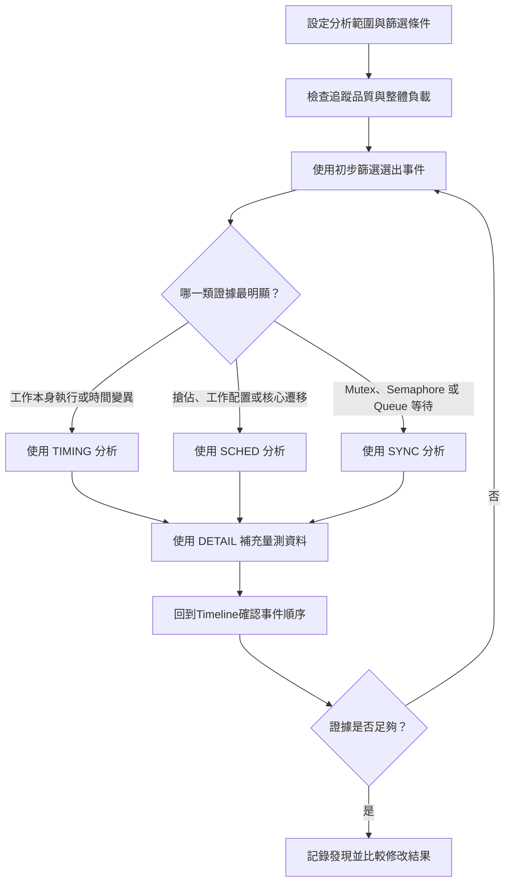
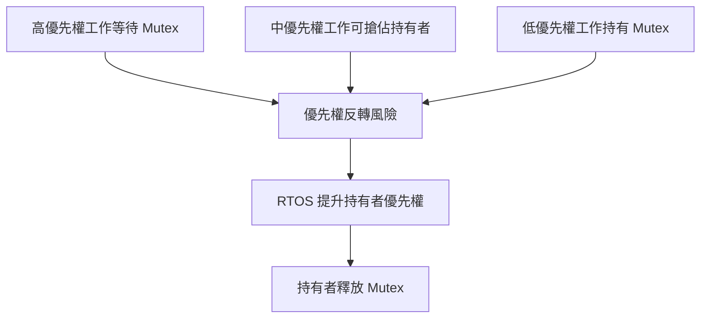

# BTFViewer 統計技術參考 

本文件同時是一份統計參考手冊與分析教學，說明 BTFViewer 測量哪些資料、如何計算、適合用在哪些情境、需要搭配哪些統計確認，以及結果無法證明什麼。內容著重分析方法，不說明程式實作。

產品操作請參閱 [README_zh-TW.md](README_zh-TW.md)，逐步分析流程請參閱 [WORKFLOWS_zh-TW.md](WORKFLOWS_zh-TW.md)，AI 輔助分析請參閱 [AI_zh-TW.md](AI_zh-TW.md)。

## 如何使用本文件

BTFViewer 依追蹤資料中實際存在的 BTF/STI 事件計算統計值。結果只代表目前的**分析範圍（Scope）** 與篩選條件，不一定涵蓋系統的完整執行過程。

判讀數值前，請先：

1. 確認分析範圍是 **Full Trace** 或游標區間。
2. 檢查是否套用工作、核心或遷移篩選條件。
3. 將 **Avg**與**p95**、**p99**、**Max** 等尾端數值一起比較。
4. 回到 **Timeline**檢查異常數值所對應的事件。
5. 比較兩份追蹤資料時，應選擇相同的工作負載階段。

部分數值可直接從追蹤事件量測；部分數值則會標示為**估算值**，表示追蹤資料沒有明確的核心事件，只能依可觀察事件推算。估算值可作為分析證據，但不代表系統保證值。

Statistics 面板的主要用途，是從彙整結果回到實際證據。表格可協助找出值得檢查的工作、核心、物件或時間範圍；**Timeline** 則用來確認該筆樣本前後實際發生的事件。

### 基本名詞

| 名詞 | 說明 |
|---|---|
| **工作（Task）** | 可由排程器安排執行的工作單位；部分 RTOS 使用 *Thread* 一詞。 |
| **核心（Core）** | 處理器核心；同一時間只能執行一個工作。 |
| **執行片段（Slice）** | 工作在某個核心上連續執行的一段時間。 |
| **離開 CPU（Off-CPU）** | 工作未執行的時間；可能處於就緒、阻塞、暫停或等待下一次啟動等狀態。 |
| **STI 事件** | 選用的軟體追蹤事件，可記錄工作恢復、Mutex、Queue、Interval 或 Tag 等資訊。 |
| **p95 / p99** | 95% / 99% 的樣本小於或等於此數值，比單看平均值更能反映尾端延遲。 |
| **抖動（Jitter）** | 時間變異；BTFViewer 常以觀察範圍 `Max − Min` 表示。 |
| **CV** | 變異係數，計算方式為「標準差 ÷ 平均值」，可比較不同尺度指標的相對變異。 |

### 測量模型

BTFViewer 先依追蹤資料中的排程事件，重建工作連續執行的區段。大部分統計再由這些區段的開始時間、結束時間、核心編號與選用的 STI 事件計算。

假設某工作具有 `S1 ... Sn` 等執行片段，第 `k` 段的開始時間為 `s_k`、結束時間為 `e_k`、持續時間為 `d_k = e_k - s_k`，執行核心為 `c_k`，即可建立下列樣本：

| 樣本 | 計算方式 | 主要用途 |
|---|---|---|
| 執行時間 | `d_k = e_k - s_k` | 每次連續使用 CPU 的時間 |
| 離開 CPU 間隔 | `g_k = s_(k+1) - e_k` | 相鄰執行片段之間的等待時間 |
| 到達間隔 | `a_k = s_(k+1) - s_k` | 啟動頻率與週期行為 |
| 核心遷移 | `c_(k+1) != c_k` | 相鄰區段是否更換核心 |
| 切換空檔 | 同一核心下一段開始時間減去前一段結束時間 | 內容切換附近未被執行片段涵蓋的時間 |
| 派送延遲 | 下一次切入時間減去已記錄的就緒時間 | 有明確就緒事件時的就緒至執行延遲 |
| 區間時間 | `interval_stop - interval_start` | 應用程式明確標記的操作時間 |

這些樣本彼此相關，但不能互相取代。例如，離開 CPU 間隔可能包含被搶佔、阻塞、暫停，或正常等待下一個週期，不能一律解讀為 Mutex 阻塞或排程延遲。

### 分析範圍、篩選條件與邊界

所有統計都以目前的**分析範圍**與篩選條件為準。

- **Full Trace** 使用完整擷取範圍。
- **C1–Cn** 使用游標選取範圍；跨越邊界的執行片段在計算時間占比時可能會裁切。
- 工作篩選會限制納入計算的工作。
- 核心或遷移篩選會限制目前分析的排程證據。

比較結果時，務必記錄分析範圍。即使來自同一份追蹤資料，10 ms 的啟動階段與 10 秒的穩定運作階段，也代表不同的工作負載。

區間、Mutex、Queue、工作生命週期與相鄰區段間隔都容易受到邊界影響。開始事件可能在分析範圍外，結束事件卻位於範圍內。因此，邊界附近沒有配對的事件，可能只是擷取不完整，不一定是應用程式錯誤。

### 常見彙整數值

對樣本 `x_1 ... x_n`，Statistics 面板常使用下列數值：

| 數值 | 計算或意義 | 使用方式 |
|---|---|---|
| **Count / Runs** | 有效樣本數 | 先確認證據數量是否足夠 |
| **Total** | `sum(x_i)` | 了解分析範圍內累積成本 |
| **Min / Max** | 觀察到的最小值／最大值 | 尋找極端事件；不是已證明的 BCET／WCET |
| **Avg** | `sum(x_i) / n` | 分布沒有明顯偏斜時，用來描述中心位置 |
| **中位數 / p50** | 排序後的中間樣本 | 較不受少數離群值影響的典型值 |
| **p95 / p99 / p99.9** | 排序後以 `ceil(n × p) − 1` 取最近排名樣本 | 觀察愈來愈少見的尾端延遲 |
| **Jitter / Spread** | `Max - Min` | 觀察到的絕對變異範圍 |
| **標準差（σ）** | 母體標準差，平方差總和除以 `n` | 衡量相對於平均值的絕對分散程度 |
| **CV** | `σ / Avg` | 比較不同時間尺度的相對變異 |
| **Rate** | 次數除以時間或事件基準 | 比較長度不同的追蹤資料 |

計算百分位數前會先排序樣本。例如，p95 取索引 `ceil(n × 0.95) − 1` 的樣本，並將索引限制在有效範圍內。百分位數需要足夠樣本；若只有 10 筆資料，p99 實際上等同 Max，無法穩定描述「最慢 1%」的行為。判讀高百分位數前，應先查看樣本數。

**追蹤解析度：**當大量樣本落在顯示刻度的一個單位以內（`us` → 1 µs、`ms` → 1 ms，即匯出時間戳記所在的格線）時，Execution Time 與 Blocking Time 會顯示提示。此比例偏高時，該數值附近的百分位數描述的是時間戳記格線，而非工作行為——這類情況應改用更細的擷取時鐘或加裝儀器的 Interval。

工作表格中的 **CPU%** 通常為「工作使用 CPU 的時間 ÷ 分析範圍實際時間 × 100」。一般工作排名不列出 IDLE 與 TICK，但分母不會扣除這些時間。多核心系統可同時執行多個工作，因此所有工作的 CPU% 相加可能超過 100%。

### 直接量測、衍生、推估與設定值

結果的可信程度取決於資料來源：

| 類型 | 範例 | 判讀方式 |
|---|---|---|
| **直接量測** | 區段起訖、核心編號、STI Tag 數值 | 追蹤資料直接記錄的證據 |
| **衍生統計** | 執行時間、CPU 占比、到達間隔、遷移次數 | 由記錄事件依明確規則計算 |
| **估算值** | 回應時間、Mutex 等待者／持有者交接、工作健康分數 | 具有前提假設，適合篩選與調查 |
| **設定值比較** | 截止時間、CPU 使用預算違規 | 只有在門檻符合應用程式需求時才有意義 |

不要把可信程度不同的指標視為同樣精確。可先用估算值找出事件，再以直接量測或應用程式明確加入的追蹤事件確認。

## 分析流程教學

以下流程說明如何組合多項統計。實際使用時可依問題切入，不必固定從第一項開始。

### Statistics 面板的範圍與控制項

Statistics 位於右側面板。標題會顯示 **Full Trace**或目前的**C1–Cn**游標範圍；套用工作、核心或遷移篩選時，也會顯示**Filtered**。分析範圍與篩選條件會直接改變納入計算的樣本，判讀任何數值前都應先確認。

放置至少兩個游標並啟用 **Limit to C1–Cn**，即可針對該範圍重新計算 Statistics 與 Analysis Findings。工具列右側圖示前方的 **C1–Cn** 狀態晶片在限定開啟時使用 Statistics Scope 色彩，關閉時使用較淡的 Detail 色彩，可點選切換。清除游標範圍後會返回 Full Trace。此功能適合分離啟動、穩定運作、過載與恢復等不同階段。

| 控制項 | 功能 |
|---|---|
| **+** | 展開所有區段 |
| **−** | 收合所有區段；已釘選的區段維持展開 |
| 重設順序 | 恢復 `OVERVIEW → TRIAGE → TIMING → SCHED → SYNC → DETAIL` |
| 區段標題／箭頭 | 展開或收合單一區段 |
| **⠿** 控制點 | 將區段拖曳到其他位置 |
| 釘選 | 使用 Collapse All 時仍保持區段展開 |

區段順序、釘選狀態、展開狀態與表格高度會保留到下次啟動。重新排序只改變顯示位置，不會改變區段分類或計算方式。

### 從統計結果回到證據

支援互動的表格與圖表可直接導向相關證據：

- 點選資料列或工作名稱，可標示工作或開啟散布／直方分布圖。
- 點選 Min、Max、p50、p95 或 p99，可跳到對應的已擷取樣本。
- 點選異常、最差事件或關鍵路徑，可縮放 **Timeline**並放置證據游標。
- 點選同步問題，可跳到對應的 STI 事件。
- 點選核心時間區間、遷移核心對或矩陣儲存格，可查看相符的時間範圍。

跳到事件只代表將彙整數值連回原始證據，不代表該事件已確認為根本原因。

### 匯出的統計報告

**Export HTML** 使用目前的分析範圍，並產生可獨立閱讀的檢查報告；各統計表格支援搜尋、排序、Problems only 與 Show all。報告包含：

- 分析範圍、追蹤資料資訊、篩選條件與時間戳記起點；
- 診斷重點指標與 Analysis Findings；
- 與 Statistics 相同的表格、分組目錄及區段說明；
- 各統計表格的搜尋、排序、Problems only 與 Show all；
- Core Utilisation 下方的 SVG 負載平衡量表。

HTML 報告可指出應調查的位置，但無法保留所有 **Timeline**互動。若其他人需要驗證事件，仍應保留原始追蹤資料。

### 分析流程圖

可依下圖從完整追蹤資料逐步縮小範圍，建立可驗證的解釋。各類統計用來縮小問題；**Timeline** 則用來確認事件順序。



分析通常需要反覆進行。若輔助資料無法確認最初推測，應回到初步篩選，改為驗證下一個可能原因。

### 使用 Analysis Findings

工具列的 **Analysis**會依目前分析範圍顯示啟發式初步檢查清單。面板保持開啟時，**Timeline** 仍可操作。每項發現會將實際量測的**Evidence** 與推論文字分開：

- **Investigate** 會開啟相關 Statistics 區段，不改變分析範圍或篩選條件。
- **Show Evidence** 會將 **Timeline**置中於證據時間，並可標示相關工作。
- 嚴重程度只用來安排檢查順序，不代表故障機率。

發現項目涵蓋負載平衡、主要 CPU 使用工作、已觀察執行時間最大值、離開 CPU 間隔、頻繁核心遷移、截止時間、TICK 健康狀態與同步問題。負載平衡良好或中等時仍可能顯示資訊，讓使用者可查看負載平衡分數、母體標準差與 Gini 係數。

### Analysis Context strip

Findings、AI 與 Compare 會顯示完整的 **Analysis Context** 列（追蹤名稱、**Scope**、**Filters**、樣本數）。Statistics 面板在標頭保留 Scope 與 Filters；若已放置游標但未開啟 **Limit to C1–Cn**，則只顯示簡短提示：**Not limited to cursors**。**Clear filters** 仍可使用。Selection 與 Highlight 不會列為分析條件。

當結果計算後 Scope 或 Filters 再變更時，Findings 與 AI 可能將內容標為 **stale**，並提供 **Recalculate with current context**。Statistics 面板在 Scope 或 Filters 變更時會自動重算（與 Desktop 相同）。

### Symptom shortcuts

**Where should I start?** 是 Statistics 工具列上的選用導引（Desktop 與 Web）。預設關閉，讓熟悉的使用者直接看到表格。開啟後可選症狀卡片（未知問題、延遲工作、尖峰、派送延遲、阻塞、抖動、負載不均、遷移、同步、截止時間）；每一張會跳到第一個建議指標。當 Findings 對應到某症狀時，會出現 **Recommended from Findings**。

應使用發現項目選擇下一個量測方向，不可直接當成結論。記錄根本原因前，仍需確認樣本數、相關分布及 **Timeline** 事件順序。

### 流程 A：第一次檢查不熟悉的追蹤資料

1. 將分析範圍限制在有意義的工作負載階段。
2. 使用**追蹤健康狀態**確認 TICK 型態與資料缺口是否合理。
3. 使用**核心使用率**、**核心時間分布**與**同時作用中的核心分布**了解整體負載。
4. 使用****Timeline** 異常**、**最差事件**與**工作健康狀態**選出優先檢查的工作或時間範圍。
5. 查看相關的**執行時間**、**阻塞時間**、**回應時間**或**週期**分布。
6. 回到 **Timeline**，在目標事件前後放置游標。
7. 使用排程或同步統計，解釋游標範圍內的事件順序。

### 流程 B：調查延遲尖峰

1. 從**回應時間**、**最差事件**或****Timeline** 異常** 找出目標工作。
2. 同時比較 Avg、p95、p99 與 Max。p95 與 Max 差距很大通常表示少見事件；p95 已偏高則表示尾端問題反覆發生。
3. 使用**執行時間**、**阻塞時間**與**關鍵路徑**，區分工作本身執行與離開 CPU 的時間。
4. 若執行時間增加，查看**分布瀏覽器**、**區間分析**與相關 Tag。
5. 若離開 CPU 時間增加，查看**派送延遲**、**搶佔矩陣**、**Mutex 阻塞**與**核心遷移**。
6. 回到 **Timeline**確認事件順序。需要精確端到端邊界時，應使用明確標記的 Interval。

### 流程 C：調查週期不穩定

1. 使用**週期／抖動**找出遺漏、額外或密集啟動。
2. 開啟**到達間隔時間**，比較中位數、p95 與 Max。
3. 使用**統一抖動**判斷變異主要來自執行、離開 CPU、回應或派送。
4. 使用**核心使用率隨時間變化**確認同一時間是否有負載尖峰。
5. 檢查**搶佔**、**Mutex 阻塞**與**核心遷移**。
6. 若應用程式定義了週期或截止時間，應以正式需求為準，不可只使用觀察到的中位數。

### 流程 D：調查多核心負載或核心遷移

1. 先確認 RTOS 設計是否啟用負載平衡與核心遷移；固定於單一核心的工作原本就不應遷移。
2. 使用**核心使用率**與**核心使用率隨時間變化**，區分長期不平衡與短暫階段。
3. 使用**工作 × 核心**找出各核心的主要工作。
4. 使用**核心遷移**與**核心對遷移摘要**找出高頻遷移與往返路徑。
5. 使用**核心親和性**確認允許的執行位置。
6. 將遷移時間與**執行時間**、**回應時間**、**核心切換空檔**及**搶佔**互相比對。只有遷移次數無法表示遷移成本。

### 流程 E：調查同步延遲

1. 確認追蹤資料包含必要的 STI take/give 或 send/receive 事件。
2. 先使用 **Mutex / Semaphore**或**Queue** 檢查事件配對品質。
3. 使用**Mutex 阻塞** 依工作與物件找出可能的資源競爭。
4. 使用**等待工作 × 持有者** 找出反覆交接的工作組合。
5. 使用**優先權繼承** 檢查優先權提升與可能的反轉型態。
6. 回到 **Timeline**確認 take/give 順序。推估交接關係不等同 RTOS 的實際等待佇列。

### 流程 F：使用 **Trace Compare**驗證修改

1. 在基準版本 A 與候選版本 B 選擇相同工作負載階段。
2. 確認追蹤事件、工作名稱、時間單位與核心設定具有可比性。
3. 先比較 CPU%、每秒事件數與每秒遷移數等標準化數值，再比較總數。
4. 比較尾端數值，不要只看平均值。
5. 回到兩份追蹤資料，檢查造成差異的實際樣本。
6. 只有差異超出正常執行間變異，且影響工程需求時，才能視為變差。

## 統計相依關係

「需要」表示計算該統計所需的事件；「搭配確認」表示通常可協助解釋結果的其他統計。

| 統計 | 需要 | 搭配確認 |
|---|---|---|
| 核心使用率 | 各核心執行片段、分析範圍時間 | 核心時間分布、工作 × 核心、核心使用率隨時間變化 |
| 追蹤健康狀態 | TICK 事件 | 核心時間分布、Timeline |
| 工作健康狀態 | 多項時間與排程統計 | 分數所指向的原始統計 |
| 異常／最差事件／重複模式 | 各種衍生樣本 | **Timeline** 與該列來源統計 |
| 回應時間 | 相鄰工作執行片段 | 執行、阻塞、派送、Interval |
| 執行時間 | 區段起訖 | 分布、Interval、Tag |
| 派送延遲 | 就緒 STI／建立事件與切入事件 | 搶佔、核心負載、Timeline |
| 阻塞時間 | 相鄰工作執行片段 | 搶佔、Mutex 阻塞、週期 |
| 關鍵路徑 | 回應區間與重疊證據 | 執行、阻塞、搶佔、遷移 |
| 週期／到達間隔 | 相鄰啟動時間 | 統一抖動、截止時間、核心負載 |
| 啟動延遲 | 啟動時間與擬合週期 T | 週期／抖動、派送延遲、就緒間隔 |
| 就緒間隔（Starvation） | 離開 CPU 間隔、同核心重疊、STI take/suspend | Preemption Chain、優先權、Mutex 阻塞 |
| 核心遷移 | 相鄰區段與核心編號 | 親和性、工作 × 核心、切換空檔 |
| 閒置分析 | 裁切至範圍的各核心 IDLE 區段 | 核心使用率、就緒間隔、阻塞時間 |
| 佇列積壓／號誌水位 | 各物件的 STI give/send 與 take/recv | Mutex / Semaphore、派送延遲、就緒間隔 |
| 搶佔統計 | 離開 CPU 間隔與同核心重疊區段 | 優先權、核心負載、Timeline |
| 切換原因分析 | 離開 CPU 間隔、同核心重疊、STI take/suspend | Preemption Matrix、Preemption Chain、優先權 |
| 排程負載隨時間變化 | 各核心區段起點與使用率分箱 | Core Utilization Over Time、工作 × 核心、核心使用率 |
| Mutex 統計 | STI 同步事件 | 等待工作 × 持有者、優先權、Timeline |
| Queue 統計 | STI 佇列事件 | Tag、Interval、Timeline |
| Interval / Tag | 應用程式 STI 事件 | 執行、回應、Timeline |
| 截止時間／CPU 使用預算 | 設定門檻與工作區段 | 執行、CPU 占比、週期 |

## 進階分析教學

以下內容補回舊版較完整的操作與判讀說明，並與後方各統計區段互相搭配。

### 核心遷移分析

在把核心遷移判定為問題之前，應先確認 RTOS 設定與排程策略是否允許工作在核心之間移動。固定在單一核心的工作不應遷移；未綁定核心的工作，則可能因排程器進行負載平衡而正常移動。

建議依下列順序檢查：

1. 先確認負載平衡。SMP 排程器可能把工作移到閒置核心，因此部分遷移是預期行為。
2. 開啟**核心遷移**，優先比較 Rate、Dwell 與 Ping，不要只看 Count。
3. 開啟 **Migration & Corridor Inspector**。工作區為三欄：**核心路徑**、**遷移熱圖**、**拓樸**，預設寬度比為 **1 : 2 : 1**。可拖曳分隔線調整欄寬；Desktop 存在 `btf_viewer.rc`，Web 存在 localStorage。路徑表格欄位可拖曳標題分隔線調整寬度；點選標題排序時寬度維持不變。拓樸 可用 Circle 與 Matrix 檢視（圖示固定在右上）。超過 16 個核心時會改開 Matrix。點選熱圖儲存格時，右側改顯示 **路徑資訊**。拓樸 與 路徑資訊 共用右欄，且互斥。
4. 檢查所選路徑的 ping-pong、中位停留時間與短停留比例。
5. **交接** 是同步擁有權啟發式關聯，不是量測到的快取行搬移。
6. 使用 **Show events**檢查相關 **Timeline**視窗。**Filter Timeline**是持續的工作篩選；Inspector 篩選只作用於對話框內。**Analysis Scope**預設為**跟隨縮放**：Fit（或可見範圍 ≥ 追蹤資料的 92%）視為 **Full Trace**；放大後的視窗視為 **目前顯示範圍**並跟隨平移／縮放。可從選單鎖定**Full Trace**或**目前顯示範圍**，或在已放置至少兩個游標時選擇 **Cursor C1–Cn**。若未放置至少兩個游標，Cursor C1–Cn 會停用。

總覽列顯示分析範圍、負載平衡狀態、遷移次數與速率、最受影響的工作、最熱路徑，以及主要關注點（None / Burst / Ping-pong / Short dwell / 交接 suspect）。請使用 **Show Top 5 / 10 / 25 / All paths**，不要用百分比截斷。核心路徑 表格列出 Rate、Count、Ping、Dwell、交接、Net、Share（游標停在標題上可看到完整名稱）。點選欄位標題可一併排序路徑列表與熱圖；再點一次可反向排序。**Investigate with AI** 會把這些結構化內容送到 `migrations` 範本；除非你另外選擇檢視器動作，否則不會篩選 **Timeline**或移動游標。

遷移路徑只能證明工作配置反覆改變，不能直接證明快取成本。快取遺失、Lazy coprocessor context 失效或額外暫存器儲存，仍需要處理器專屬證據。

### 優先權繼承與 L/M/H 型態

追蹤資料包含建立優先權與後續優先權事件時，才會顯示 Priority Inheritance：

| 事件 | 意義 |
|---|---|
| `priority_inherit Name[id] pri:N` | Mutex 持有者繼承優先權 `N` |
| `priority_disinherit Name[id] pri:N` | 持有者回復至原始優先權附近 |
| `set_priority Name[id] pri:N` | 應用程式或 RTOS 明確修改優先權 |

有效優先權高於建立優先權的連續時間稱為一次提升事件：

```math
T_{boosted} = \sum_j (t_{end,j} - t_{start,j})
```

**Boosts**是提升次數，**Peak**是觀察到的最高優先權，**Boosted** 是所有提升時間的總和。

典型 **L/M/H** 型態包含：

- **L：** 持有 Mutex 的低優先權工作。
- **H：** 等待該 Mutex 的高優先權工作。
- **M：** 優先權嚴格介於 L 與 H 之間，且可執行的工作。

若沒有優先權繼承，M 可在 H 等待時延遲 L。啟用繼承後，RTOS 會將 L 提升至接近 H，使 L 儘快釋放 Mutex。BTFViewer 的橘色區段代表沒有 L/M/H 型態的優先權提升；紅色區段代表 Mutex 繼承或與 L/M/H 有關的型態。



系統會尋找 Base 與 Peak 之間具有已知原始優先權的工作，作為可能的中優先權干擾者。這只是優先權幾何關係，不代表該工作在每次提升期間都實際執行。仍應回到 **Timeline**確認 Mutex、工作活動及內容切換順序。

### Mutex、Semaphore 與 Queue 配對

同步事件依物件指標分組，因此同一 STI 通道上的不同物件不會混在一起。

| 物件型態 | 配對方向 | 常見意義 |
|---|---|---|
| Mutex | `take → give` | 所有權與持有時間 |
| 作為資源的 Semaphore | `take → give` | 資源占用時間 |
| 作為訊號的 Semaphore | `give → take` | 發出訊號到被取用的時間 |
| Queue | `send → receive` | 已記錄的生產者至消費者間隔 |

對完成的持有區段 `τ_h`，平均持有時間為：

```math
AvgHold = \frac{1}{N} \sum_h \tau_h
```

使用持有或阻塞統計前，應先檢查配對品質。重要問題包括孤立 give、跨工作 give、未完成 take、未取用訊號、持有中刪除，以及結束擷取時仍持有物件。Mutex 若在某核心 take、另一核心 give，會標示為跨核心往返；這可能涉及快取列搬移，但追蹤資料無法量測實際硬體成本。

**等待工作 × 持有者**與**Mutex 阻塞** 都是依成功交接推估，無法重建阻塞嘗試或 RTOS 等待佇列。可先用來排序可能的競爭，再回到 **Timeline**確認 take/give 順序與工作狀態。

### Interval 與 Tag 追蹤事件

單一工作能明確記錄操作開始與結束時，適合使用 **Interval**。目前的 Interval note 包含區間 ID 與工作 ID，因此不同工作可重複使用相同數字而不會交叉配對。舊格式若沒有工作 ID，多個工作同時使用相同 ID 時可能產生歧義。

| 追蹤方式 | 適合用途 |
|---|---|
| 同一工作的 `interval_start` / `interval_stop` | 迴圈、處理程序、臨界區段或完整工作 |
| 同一 Tag 通道的連續數值 | 跨工作或 ISR 的時間 |
| Tag 數值樣本 | 佇列深度、可用記憶體、感測值或應用程式狀態 |

完成的 Interval 可計算 Count、Min、Avg、Max、Jitter、σ、p50、p95、p99。分析範圍邊界附近未配對的事件會被排除，可能只是部分擷取。除非追蹤規格明確定義巢狀順序，否則應避免以相同 ID 遞迴或重疊記錄。

Tag 數值的單位由應用程式定義。BTFViewer 可彙整並繪製數字，但無法判斷 `10` 代表位元組、訊息數、溫度或狀態碼。應記錄每個通道的定義，並將數值變化與 **Timeline**事件比對。

### 散佈圖、直方圖與 CDF 判讀

三種圖形使用相同的選取樣本：

| 圖形 | 保留時間順序 | 主要問題 |
|---|---:|---|
| 散佈圖 | 是 | 尖峰、趨勢或模式何時改變？ |
| 直方圖 | 否 | 大部分樣本落在哪些數值範圍？ |
| CDF | 否 | 小於或等於某個數值的樣本比例是多少？ |

CDF 的橫軸是指標數值，縱軸是累積百分比；曲線從接近 0% 上升至 100%。曲線快速上升表示樣本集中，緩慢上升則表示分布較寬或具有長尾。

| 參考值 | CDF 判讀 |
|---|---|
| p5 | 5% 的已觀察樣本小於或等於此值 |
| p50 | 一半樣本小於或等於中位數 |
| p95 | 95% 小於或等於此值，另有 5% 高於此值 |
| Avg | 平均值參考線；不對應固定的累積百分比 |

分布集中時可使用 Linear；要聚焦主要樣本並保留兩側離群區間，可使用 p5–p95；極短與極長時間相差數個數量級時，可使用 Log duration。比例尺只改變橫軸映射，不會改變樣本或百分位數。

若截止時間為 `D`，可讀取 CDF 在 `D` 位置的高度，估算目前分析範圍內符合要求的比例。這不是未來保證，也不能證明最壞執行時間。

### Trace Compare 建議判讀順序

建議依下列順序閱讀 Trace Compare：

1. 確認檔案、分析範圍、Tick 模式、工作配對、核心數與驗證警告。
2. 擷取時間不同時，先使用依時間標準化的 Summary 數值。
3. 在 **Summary** 分頁查看比較結果，找出同時超過絕對與相對門檻的差異。
4. 開啟相關明細表並比較尾端數值。點選欄位標題可排序，再點一次可反向排序。
5. 回到兩份追蹤資料的 **Timeline**，驗證造成差異的事件。

工作依顯示名稱 `Name[id]` 配對；ID 改變可能使實際上相同的工作無法配對。破折號表示無資料，不是零。CPU 與使用率差異使用百分點（`pp`）。

常用比較分類包括 Summary、Top Tasks、Core Util、Core Migrations、Execution、Blocking、Inter-Arrival、Preemption、Sync、Response、Mutex、Shared Patterns 與 Trends。匯出報告包含完整表格，不只對話框預覽內容。

#### 範例：固定 Tick 與 Tickless idle 

以相同工作負載分別擷取固定 Tick 與 Tickless idle，除了 Tick 設定外，應保持 TICK 追蹤、執行時間與其他建置設定一致。

| 比較項目 | 檢查重點 |
|---|---|
| Context switches 與 `/s` | 停止閒置 Tick 是否降低排程活動 |
| Tick 模式、數量、間隔與 CV | 是否確實觀察到兩種策略 |
| Core gap、使用率與負載平衡 | 閒置與忙碌階段是否具有可比性 |
| Migrations 與核心對 | 喚醒策略是否改變工作配置 |
| Execution、Blocking、Response 尾端 | 省電策略是否影響延遲需求 |
| Preemption 與 Top Tasks | 哪些工作承擔 Tick 或喚醒開銷 |

Tickless 行為在閒置比例較高的游標範圍最容易看出；完全忙碌的階段中，內容切換與 Tick 數量可能仍接近。若標示為 Tickless 的擷取仍呈現規律 TICK，應先檢查核心進入 Tickless 的條件與 Ready List 行為，不應直接判定為追蹤或檢視器錯誤。

## 固定 Help 連結

每個 Statistics 區段都使用下列格式的固定錨點：

```text
STATISTICS_zh-TW.md#statistics-<section-id>
```

`<section-id>` 與 Statistics 面板使用的區段識別碼相同。英文與繁體中文文件使用相同錨點，因此程式只需切換檔名，不必修改連結片段。

| 分類 | 預設順序與區段識別碼 |
|---|---|
| **OVERVIEW** | `cores`、`health`、`task_health` |
| **TRIAGE** | `anomalies`、`worst`、`patterns` |
| **TIMING** | `response`、`exec`、`dispatch`、`block`、`crit_path`、`period`、`jitter`、`inter` |
| **SCHED** | `task_core`、`core_time`、`migrations`、`core_pairs`、`affinity`、`preempt_matrix`、`preemption`、`priority`、`concurrency` |
| **SYNC** | `mutex_block`、`wait_owner`、`sync`、`queue` |
| **DETAIL** | `core_breakdown`、`switch_overhead`、`tasks`、`distrib`、`intervals`、`tags`、`lifecycle`、`deadline` |

各分類代表不同的分析目的：

- **OVERVIEW**：快速了解整體狀態。
- **TRIAGE**：找出應優先檢查的位置。
- **TIMING**：了解工作延遲、執行時間與時間變異。
- **SCHED**：了解多核心工作配置與排程行為。
- **SYNC**：了解同步物件與等待情況。
- **DETAIL**：提供進一步確認問題所需的輔助數據。

## 1. OVERVIEW — 整體狀態 

先從這裡了解系統負載、追蹤資料品質，以及哪些工作可能需要進一步檢查。

<a id="statistics-cores" name="statistics-cores"></a>
### 核心使用率（Core Utilisation，排除 IDLE/TICK） 

**這項統計代表什麼**

顯示目前分析範圍內，各核心執行一般工作的時間比例。忙碌比例不包含 IDLE 與 TICK。

**負載平衡分數（Load Balance Score）**用來概括工作是否平均分布在各個作用中的核心。分數高表示各核心使用率接近；分數低表示工作集中在少數核心。這個分數不代表系統是否過載，因為系統可能平均忙碌，也可能平均閒置。

可用本區段找出高負載核心與不平均的工作配置，再搭配 **Task × Core**、**Core Migrations**與**Core Affinity**確認原因。** 計算方式：**針對每個核心，將一般工作執行片段與分析範圍的重疊時間加總，再除以分析範圍時間。忙碌時間不包含 IDLE 與 TICK。負載平衡分數為各核心使用率的 `100 × (1 − Gini 係數)`；愈接近 100 代表分布愈平均，不表示剩餘處理能力較高。

**如何使用：**先比較最忙與最閒核心，再開啟**核心使用率隨時間變化**，確認差異是否持續存在。使用**工作 × 核心**找出造成負載的工作。若設計上保留特定核心或包含循序處理階段，低分也可能符合預期。

<a id="statistics-health" name="statistics-health"></a>
### 追蹤健康狀態（Trace Health / TICK） 

**這項統計代表什麼**

根據連續 TICK 事件的時間間隔，檢查 Tick 是否規律，並判斷較接近週期性 Tick 或 Tickless 模式。

| 數值 | 說明 |
|---|---|
| **Mode** | `TICK` 表示間隔規律；`TICKLESS` 表示可能因閒置時停止 Tick，而具有較大的間隔變異 |
| **Avg period / Max gap** | 觀察到的典型與最長 Tick 間隔 |
| **CV** | Tick 間隔的相對變異程度 |
| **Missed ticks (est.)** | 依大型間隔粗略估算跨越的名義 Tick 數 |

大型間隔可能來自 Tickless idle、長時間臨界區段、CPU 壓力或追蹤資料缺口。`GOOD` 只描述觀察到的 Tick 型態，不代表整體效能一定良好。

**計算方式：**以相鄰 TICK 時間戳記建立間隔樣本，再計算平均值、最大值、CV 與典型間隔。遺漏 Tick 估算值會將異常大型間隔與名義週期比較，但不能證明硬體 Tick 確實遺失。

**如何使用：**先判斷系統採固定週期 Tick 或 Tickless，再決定大型間隔是否異常。搭配**核心時間分布**、CPU 負載與 **Timeline**判讀。若同一範圍內所有事件都消失，應優先懷疑擷取缺口；若工作繼續執行而 TICK 消失，則可檢查 Tick 抑制、中斷遮蔽或追蹤事件。


<a id="statistics-task_health" name="statistics-task_health"></a>
### 工作健康狀態（Task Health） 

**這項統計代表什麼**

將執行時間變異、阻塞尾端、週期行為、核心遷移、截止時間與 CPU 占比等實際測量值，整合為 0–100 分的初步檢查分數。

這個分數適合用來決定優先檢查哪些工作，但不是 AI 機率、故障機率或根本原因證明。判讀前應開啟相關的 Statistics 區段確認證據。

**計算方式：**分數從 100 分開始，依下列啟發式規則扣分。同一項目有多個檢查時，採用較嚴重的結果。

| 項目 | 警示條件 | 失敗條件 | 扣分（警示／失敗） |
|---|---|---|---|
| 執行時間 | CV `≥ 0.5` 或 `Max / Avg ≥ 3` | CV `≥ 1.0` 或 `Max / Avg ≥ 8` | 10 / 20 |
| 阻塞時間 | CV `≥ 0.6` 或 `Max / Avg ≥ 4` | CV `≥ 1.2` 或 `Max / Avg ≥ 10` | 10 / 20 |
| 週期 | CV `≥ 0.15` 或至少一次推估遺漏 | CV `≥ 0.4` 或至少三次推估遺漏 | 8 / 16 |
| 核心遷移 | `遷移次數 / 執行片段數 ≥ 0.3` | 比例 `≥ 0.7` | 8 / 16 |
| 截止時間 | — | 至少一次已設定門檻的違規 | 30 |
| CPU 占比 | CPU% `≥ 80` | CPU% `≥ 95` | 8 / 16 |

最後將分數限制在 0–100。這些門檻是 BTFViewer 用來初步篩選的規則，不是 RTOS 規格或應用程式需求；缺少某項資料也不會視為已確認失敗。

**如何使用：**開啟警示最明顯的組成指標，先檢查樣本數與分布，再查看對應事件。追蹤事件較完整或樣本較多的工作，本來就可能出現較多警示，因此比較時應使用相同的分析條件。

## 2. TRIAGE — 優先檢查位置 

這些區段可將較長的追蹤資料整理成少量事件與重複問題，協助快速縮小調查範圍。

<a id="statistics-anomalies" name="statistics-anomalies"></a>
### **Timeline** 異常（Timeline Anomalies） 

**這項統計代表什麼**

列出目前分析範圍內值得優先檢查的長尾、密集事件、CPU 尖峰、閒置間隔、Mutex 等待與截止時間違規。每一列都會說明事件類型、相關工作、時間點及列入原因。

點選資料列可回到 **Timeline**檢查證據。異常只代表「值得檢查」，不等同於已確認的缺陷。

**選取方式：**系統會從可用樣本中找出長尾、密集事件、尖峰、資料缺口、重複遷移或搶佔、Mutex 等待推估與已設定的截止時間違規。每一列會保留來源統計與時間位置。

**如何使用：**可先檢查嚴重或重複出現的資料列，但同一事件可能同時產生阻塞尾端、搶佔密集與截止時間違規。建議以 C1–C2 包住整段事件，將相關統計一起判讀。

<a id="statistics-worst" name="statistics-worst"></a>
### 最差事件（Worst Events） 

**這項統計代表什麼**

將最長的執行、阻塞、到達間隔與推估回應時間集中在同一份表格。

適合用來回答「目前觀察到的最大延遲在哪裡？」Max 只代表目前分析範圍中的最大樣本，不是保證的最壞情況上限。

**計算方式：**從執行時間、離開 CPU 間隔、到達間隔與推估回應時間中取出最大的有效樣本，並保留工作與時間邊界。

**如何使用：**將 Max 與 p95、p99 一起比較。Max 遠高於 p99，通常表示少見事件；p95、p99 與 Max 都偏高，則表示尾端問題較持續。追蹤時間愈長，捕捉到極端值的機會愈高，因此不可只用 Max 比較兩次執行。

<a id="statistics-patterns" name="statistics-patterns"></a>
### 重複異常模式（Recurring Patterns） 

**這項統計代表什麼**

依工作整理重複出現的異常類型，並指向每一類最嚴重的事件。

重複事件比單一偶發樣本更可能代表系統性情況，但仍需使用時間、排程或同步資料確認原因。

**計算方式：**依工作與異常類型分組，統計出現次數，並保留該組最嚴重的代表事件。

**如何使用：**優先檢查跨越多個工作週期反覆出現的模式。除了最差事件，至少再查看另一個實例，確認事件順序一致。週期性問題可搭配**週期／抖動**；與工作階段有關的問題可搭配**核心使用率隨時間變化**。


## 3. TIMING — 工作延遲與時間變異 

這些區段說明工作何時執行、執行多久，以及離開 CPU 多久。各指標使用的時間邊界不同，不應互相替代。


<a id="statistics-response" name="statistics-response"></a>
### 回應時間（Response Time） 

**這項統計代表什麼**

依相鄰執行片段推估工作從就緒到完成的時間。後續區段從前一個執行片段結束開始計算，到目前區段結束為止；第一個區段則使用本身的執行時間。

這是**推估回應時間**，不是核心直接記錄的釋放／完成事件配對。若應用程式需要精確的回應時間邊界，應使用明確加入追蹤事件的 Interval。

對延遲敏感的工作而言，p95、p99 等尾端百分位數通常比平均值更有參考價值。點選百分位數或極端值可查看對應事件。

後續執行片段的推估可寫成：

```math
R_k = s_k - e_{k-1} + d_k = e_k - e_{k-1}
```

數值包含目前區段前的離開 CPU 間隔與目前執行時間。應搭配**執行時間**與**阻塞時間**判斷主要來源；具有 STI 就緒事件時可查看**派送延遲**；需要精確的要求至回覆邊界時，應使用明確標記的 **Interval**。


下列 `CS[11]` 分布圖示範如何進一步判讀表格。CDF 在短時間處快速上升，表示大部分推估回應時間很短；右側少量資料點則形成延遲尾端。先將 p95、p99 與應用程式需求比較，再跳至對應樣本，判斷主要時間來自執行本身或前一段離開 CPU 的間隔。

![CS[11] 的回應時間分布](../images/stats/stats-response-cs11.svg)

<a id="statistics-exec" name="statistics-exec"></a>
### 每個執行片段的執行時間（Execution Time Per Slice） 

**這項統計代表什麼**

測量每段連續使用 CPU 的時間：

```math
d_k = t_{end,k} - t_{start,k}
```

**Runs**是執行片段數；**CPU%**是工作使用 CPU 的時間除以分析範圍實際時間；**Jitter** 是觀察到的 `Max − Min` 範圍。

較長的執行片段可能與大量運算、臨界區段、持有鎖定或停用中斷同時發生，但只靠時間資料無法確認原因。**Max**不是已證明的 WCET；**Min**也不是已證明的 BCET。** 計算方式：**完整位於選取範圍內的區段會形成執行時間樣本；計算 CPU% 時，則會先將區段裁切至分析範圍，再加總重疊時間。一次應用程式操作若被搶佔，可能拆成多個 Runs，因此 Run 不一定等於一次工作週期或要求。

**如何使用：**Avg 或 p50 可表示典型成本，p95／p99 用來觀察反覆出現的尾端，Max 用來定位最大的已捕捉區段。若完整操作可能被搶佔切開，應使用**區間分析**量測，再搭配 Tag、Mutex 持有時間與 **Timeline**判讀。

在此範例中，散佈圖顯示較長的執行片段發生於哪些時間；直方圖與 CDF 則顯示它們是常態，還是只佔少量尾端。當短樣本與長樣本跨越很大的時間尺度時，圖表可能改用對數 **Timeline**。

![CS[11] 的執行時間分布](../images/stats/stats-exec-cs11.svg)

<a id="statistics-dispatch" name="statistics-dispatch"></a>
### 派送／排程延遲（Dispatch / Scheduling Latency） 

**這項統計代表什麼**

測量已記錄的就緒時間到下一次切入執行之間的延遲：

```math
L_{dispatch} = t_{switch-in} - t_{ready}
```

就緒時間來自工作建立或 STI resume 事件。若同步物件的喚醒事件沒有記錄被喚醒工作 ID，BTFViewer 便無法將它歸屬到特定工作。因此，本區段只涵蓋具有明確就緒時間的啟動事件。

**配對方式：**就緒事件會與同一工作下一次切入執行配對。分析範圍內沒有後續切入的事件不會形成完整樣本。若一次切入前出現多個就緒事件，歸屬可能不明確。

**如何使用：**尾端偏高表示工作已知就緒，卻未能立即執行。可檢查**搶佔矩陣**、工作優先權與**核心使用率隨時間變化**。沒有工作 ID 的喚醒，需依應用程式追蹤事件或 **Timeline**確認。

`SR0[271]` 的分布圖包含建立、暫停及繼續執行等生命週期事件。可藉此區分派送路徑是否持續偏慢，或只有少數孤立的排程延遲。

![SR0[271] 的派送延遲分布](../images/stats/stats-dispatch-sr0.svg)

<a id="statistics-block" name="statistics-block"></a>
### 阻塞時間（Blocking Time / Off-CPU gap） 

**這項統計代表什麼**

測量前一個執行片段結束，到同一工作下一個執行片段開始之間的正值間隔：

```math
g_k = t_{start,k+1} - t_{end,k}
```

在這段時間中，工作可能處於就緒、阻塞、暫停、被搶佔或等待下一個週期。因此，這項指標表示**離開 CPU 的時間**，不能判斷精確的 RTOS 狀態，也不是端到端回應時間。

**計算方式：**每一組相鄰執行片段最多產生一筆正值間隔。分析範圍邊界可能移除其中一側，因此改變分析範圍也可能改變樣本數。

**如何使用：**先與**到達間隔時間**及預期週期比較。週期性工作休眠時，長間隔可能完全正常。若工作理應保持就緒，應檢查**搶佔**、**派送延遲**與 CPU 負載；若同時出現同步事件，再查看**Mutex 阻塞**與**等待工作 × 持有者**。

此範例中的大型間隔集中在特定時間區域，表示應進一步檢查同時執行的高優先權工作或同步事件；但僅憑這個分布，不能直接認定原因是鎖定競爭。

![CS[11] 的阻塞時間分布](../images/stats/stats-block-cs11.svg)

<a id="statistics-crit_path" name="statistics-crit_path"></a>
### 關鍵路徑（Critical Path） 

**這項統計代表什麼**

列出最長的就緒至完成推估區間，以及與工作執行、離開 CPU、搶佔和核心遷移重疊的時間。

**Preempt**、**Wait**與**Migration**可能互相重疊，不能相加後視為**Duration**的獨立組成。這是協助調查的檢視方式，不是核心直接記錄的相依關係圖。** 計算方式：**選出較長的推估回應區間，將工作本身在區間內執行的重疊時間加總為 Exec，其餘視為離開 CPU。搶佔、等待與遷移則是同一區間內的相關證據，可能同時描述同一段時間。

**如何使用：**依主要證據選擇後續分析：Exec 偏高時查看執行分布；離開 CPU 偏高時查看搶佔與核心負載；等待證據明顯時查看同步統計；核心變更時查看遷移。最後仍需回到 **Timeline**確認順序。


<a id="statistics-period" name="statistics-period"></a>
### 週期／抖動（Period / Jitter） 

**這項統計代表什麼**

使用到達間隔樣本估算週期行為，並以中位數作為 **Expected** 週期。

| 數值 | 說明 |
|---|---|
| **Missed** | 間隔大於 `1.5 × Expected` |
| **Extra** | 間隔小於 `0.5 × Expected` |
| **Burst** | 間隔小於 `0.25 × Expected` |
| **RMS** | 相對於預期週期的均方根變異 |

這些門檻描述觀察到的排程行為。只有在預期週期與應用程式的時間要求相同時，才能將它視為應用程式截止時間。

**計算方式：**Expected 使用到達間隔中位數，較不受少數大型間隔影響。每筆樣本再依 Expected 分類；RMS 則彙整所有樣本偏離 Expected 的程度。

**如何使用：**將分析範圍限制在單一運作模式。啟動、結束或刻意變速的工作負載，可能造成誤導的 Missed／Extra。搭配**到達間隔時間**、**核心使用率隨時間變化**與 **Timeline**確認。正式需求與觀察中位數不同時，應以正式需求為準。

<a id="statistics-jitter" name="statistics-jitter"></a>
### 統一抖動（Unified Jitter） 

**這項統計代表什麼**

將執行、阻塞、到達間隔、推估回應、派送與喚醒至執行等時間變異整理在同一份表格。

觀察範圍（`Max − Min`）表示絕對變異；**CV**表示相對於平均值的變異，可比較時間尺度不同的指標。絕對時間很小時，即使 CV 偏高，也可能不如大型延遲上的中等 CV 重要。** 計算方式：**每一列沿用來源統計的樣本。Wake-to-run 是依現有回應等待證據建立的替代指標；Dispatch 只包含具有明確就緒事件的樣本。

**如何使用：**必須同時比較時間大小與 CV。時間極短的指標即使 CV 高，也可能沒有實際影響；較大型延遲上的中度變異則可能造成截止時間違規。判斷前應開啟來源分布。


<a id="statistics-inter" name="statistics-inter"></a>
### 到達間隔時間（Inter-Arrival Time） 

**這項統計代表什麼**

測量同一工作連續兩次開始執行的時間差：

```math
\Delta t_k = t_{start,k+1} - t_{start,k}
```

對同一組執行片段而言，到達間隔時間大致等於前一個執行片段的時間，加上後續離開 CPU 的間隔。可用來觀察啟動頻率、時間漂移、遺漏週期與密集啟動。

**計算方式：**每一組相鄰區段開始時間都會形成樣本，即使工作在兩段之間遷移也一樣。若一次邏輯啟動被搶佔拆成多段，額外的區段開始時間也會進入統計。因此，未加入額外追蹤時，這是排程區段的到達間隔。

**如何使用：**以中位數與分布找出主要節奏，搭配**週期／抖動**進行分類，並以**阻塞時間**解釋大型間隔。需要精確的應用程式釋放時間時，應在釋放點記錄 STI Tag 或 Interval。

此範例同時包含很短與較長的啟動間隔，因此使用對數 **Timeline**。與**阻塞時間**比較時需注意：到達間隔同時包含前一個執行片段與後續離開 CPU 的間隔。

![CS[11] 的到達間隔時間分布](../images/stats/stats-inter-cs11.svg)

<a id="statistics-activation" name="statistics-activation"></a>
### 啟動延遲（Activation Latency） 

**這項統計代表什麼**

針對每個週期性工作，量測每次實際啟動與一條擬合的理想週期時鐘之間的距離。「到達間隔」與「週期／抖動」是拿每次釋放與**上一次**釋放比較；即使每個間隔都接近 `T`，工作仍可能相對排程持續漂移。啟動延遲是拿每次釋放與固定格線比較，因此累積的相位誤差會顯現出來。

**計算方式：**週期 `T` 取到達間隔的 p50（也就是**週期／抖動**中的「Expected」）。格線為 `anchor + k·T`，錨定在目前分析範圍內的第一次啟動。對啟動時刻 `t`，誤差為 `min_k |t − (anchor + k·T)|`，即到最近格線點的距離。Min／Avg／Max／Jitter／σ／p50／p95／p99 欄彙整此誤差分布，Max 最大者排在最前。每個工作至少需三次啟動。

**如何使用：**接近零的列代表工作緊貼排程。Max 大而 p50 小是偶發滑移；p50 本身就大則是穩定的相位漂移——檢查該工作的釋放路徑與延誤它的低優先權工作。與 **Dispatch / Scheduling Latency**（就緒→執行）及 **Ready-Gap** 比較，判斷延遲釋放是工作本身還是排程器造成。點選列可開啟啟動延遲分布圖，並在 **Timeline**上突顯該工作。

<a id="statistics-ready_gap" name="statistics-ready_gap"></a>
### 就緒間隔（Ready-Gap / Starvation） 

**這項統計代表什麼**

針對每個工作，統計它在「可執行卻未取得 CPU」狀態下離開 CPU 的時間——一種飢餓（starvation）檢視。就緒間隔又長又頻繁，代表工作想要 CPU 卻沒拿到。

**計算方式：**建立在與 **Switch Reason Breakdown**相同的離開 CPU 間隔分類器之上。工作連續兩段之間的每個間隔會被標為 `preempted`（其他工作在其核心上執行）、`blocked`（該區段以 STI take/recv 結束）、`suspended`（STI suspend）、`period_wait`（整段只有 IDLE 執行）或 `unknown`。就緒間隔保留 `preempted` / `blocked` / `unknown`，捨棄 `suspended` / `period_wait`（工作自願離開 CPU）。欄位：間隔數、最長單一間隔、總計、平均、p95，以及**% preempt**——被搶佔部分佔總計的比例，用以區分排程飢餓（比例高）與鎖競爭（比例低）。依最長間隔排序。

**如何使用：**依「最長」或「總計」排序。**% preempt**高指向優先權或親和性——對照**Preemption Chain Analysis**與工作優先權。**% preempt**低代表間隔多半是 `blocked`；追進**Mutex / Semaphore**與**Waiter × Owner**。此處的 `blocked` 是啟發式判斷（區段結尾附近的 STI take/recv），非核心記錄的等待。點選列可開啟就緒間隔分布圖，並在 **Timeline**上突顯該工作。

## 4. SCHED — 多核心排程與工作配置 

這些區段說明工作在哪些核心執行、如何遷移，以及哪些工作互相干擾。

<a id="statistics-task_core" name="statistics-task_core"></a>
### 工作 × 核心（Task × Core） 

**這項統計代表什麼**

顯示每個工作在目前分析範圍內，分別於各核心執行的時間比例。工作集中在單一核心，可能是受到親和性限制或自然保持穩定；分散在多個核心，則可能來自負載平衡或頻繁遷移。

應搭配 **Core Affinity**與**Core Migrations**判讀。點選儲存格可查看第一個符合條件的執行片段。** 計算方式：**每個儲存格為該工作在指定核心上，與分析範圍重疊的執行時間加總。橫向閱讀可看工作分布；直向閱讀可看核心由哪些工作使用。

**如何使用：**工作分散在多個核心不一定有害。先確認工作是否允許遷移，再以**核心遷移**區分偶爾配置與頻繁移動。分析負載不均時，應將各欄與**核心使用率**一起比較。

<a id="statistics-core_time" name="statistics-core_time"></a>
### 核心使用率隨時間變化（Core Utilization Over Time） 

**這項統計代表什麼**

將目前分析範圍分成等長的時間區間，顯示每個核心於各區間執行一般工作的忙碌比例。

整體平均使用率可能掩蓋短時間尖峰。本區段可顯示負載不均、過載或閒置發生的時間。點選區間可縮放至對應範圍。

**計算方式：**將分析範圍分為等寬時間區間，分別計算各核心的一般工作執行重疊時間，再除以該區間長度。跨越多個區間的工作會依重疊時間分配。

**如何使用：**檢查接近滿載的區間、長期核心差異，以及是否與延遲尖峰同時發生。要分析工作階段可放大範圍；要分析單一事件可用游標縮小範圍。再以**工作 × 核心**或 **Timeline**找出熱區內的工作。


<a id="statistics-migrations" name="statistics-migrations"></a>
### 核心遷移（Core Migrations） 

**這項統計代表什麼**

同一工作的相鄰執行片段若位於不同核心，就記錄一次核心遷移。

| 數值 | 說明 |
|---|---|
| **Count** | 觀察到的核心變更次數 |
| **Rate** | 相對於工作作用時間的遷移率；具有 TICK 證據時也會顯示 `/tick` |
| **Dwell** | 工作在某核心停留至下一次排程事件的平均時間 |
| **Ping** | 短時間內返回或在核心間往返的次數 |
| **Primary** | 工作使用 CPU 時間比例最高的核心 |

只看 Count 無法判斷問題。Dwell 很短，且 Rate 與 Ping 同時偏高，才是反覆遷移的較強證據。頻繁遷移可能增加排程與快取成本，但實際影響仍取決於處理器與工作負載。

**計算方式：**依時間順序比較同一工作的相鄰區段；核心不同時形成一筆遷移。Count 為變更次數，Primary 依累積執行時間決定，Rate 以可用的時間或 TICK 基準標準化；Dwell 與 Ping 則描述配置維持多久及多快返回原核心。

**如何使用：**先確認 RTOS 負載平衡允許遷移，再依 Rate、短 Dwell 與 Ping 排序。搭配**核心對遷移摘要**、**核心親和性**與 **Migration & Corridor Inspector**，並將遷移時間與回應、執行及切換空檔的尾端互相比對。追蹤資料無法直接量測快取重新載入或協同處理器暫存器儲存成本。


若要在 **Timeline**中觀察遷移工作的前後關係，可在 Task View 鎖定反白該工作，並開啟各核心的 CPU Load。若問題只發生在特定時間，可放大 **Timeline**（**跟隨縮放**會改為 目前顯示範圍）、鎖定 Inspector 的**Analysis Scope**為**目前顯示範圍**，或放置至少兩個游標並選擇 **Cursor C1–Cn**。Statistics 的 **Limit to C1–Cn** 是獨立設定：它改變 Statistics 計算，不會自動改變 Inspector 結果。

![在 Task View 鎖定反白 CS[22] 並顯示各核心 CPU Load](../images/stats/tasks-cpu-load-cs22.svg)

遷移圖提供三種互補的觀察方式：

- **Dwell** 顯示每次在核心上連續執行的時間；大量短樣本可能表示配置不穩定。
- **Rate** 顯示與前一次遷移的時間差；短間隔集中成群，表示短時間內快速移動。
- **Gap**顯示遷移後緊接的正值離開 CPU 間隔；應與包含所有離開 CPU 間隔的** 阻塞時間**比較。

![CS[22] 的核心停留時間分布](../images/stats/stats-mig-dwell-cs22.svg)

![CS[22] 的遷移間隔分布](../images/stats/stats-mig-rate-cs22.svg)

![CS[22] 的遷移後間隔分布](../images/stats/stats-mig-gap-cs22.svg)

<a id="statistics-core_pairs" name="statistics-core_pairs"></a>
### 核心對遷移摘要（Core-Pair Migration Summary） 

**這項統計代表什麼**

依方向彙整 `Core_2 → Core_5` 等核心遷移，找出活動較多的遷移路徑、返回流量與遷移前後的平均間隔。

可用來判斷遷移是廣泛分布，還是集中在少數核心對。Bounce 比例偏高，表示工作可能頻繁在兩個方向之間往返。

**計算方式：**每次遷移都會累加到對應的 `來源 → 目的` 核心對；反方向會分開計算。Bounce 用來描述雙向流量或短時間返回；平均間隔是遷移附近觀察到的時間，不是硬體資料搬移時間。

**如何使用：**集中於少數核心對的遷移，可能來自親和性配置、負載不對稱，或工作在兩個核心間反覆交換。點選列可開啟核心對圖形，並與各核心使用率比對。低頻且廣泛的遷移可能只是正常負載平衡。


<a id="statistics-affinity" name="statistics-affinity"></a>
### 核心親和性（Core Affinity） 

**這項統計代表什麼**

比較最近一次記錄的核心親和性遮罩與工作實際執行的核心。**Violations** 表示工作曾在當時有效遮罩之外執行。

第一次記錄親和性設定前的執行片段視為不受限制。若沒有 `affinity_set` 事件，BTFViewer 無法驗證實際設定的遮罩。

**計算方式：**親和性事件會隨時間更新有效遮罩；每個後續執行片段都與最近的已知遮罩比較。若執行核心不在遮罩內，就計為違規。

**如何使用：**違規可能代表配置、追蹤事件、工作 ID 對應或排程問題，應優先檢查。沒有違規時，可將允許核心數與**工作 × 核心**比較，確認工作是否實際使用可用核心。缺少事件表示「無法確認」，不是已知沒有任何限制。

<a id="statistics-preempt_matrix" name="statistics-preempt_matrix"></a>
### 搶佔矩陣（Preemption Matrix） 

**這項統計代表什麼**

彙整被搶佔工作離開 CPU 期間，同一核心上其他工作執行的重疊時間。資料列與儲存格可協助找出主要干擾來源。

這些資料代表時間上的重疊，不足以證明某個工作直接造成另一個工作阻塞。

**計算方式：**對每一段被檢查工作的離開 CPU 間隔，尋找同一核心上其他工作的執行重疊時間，再依被影響工作與可能的搶佔工作彙整成矩陣。

**如何使用：**大型橫列表示某工作累積失去較多 CPU 時間；大型儲存格表示特定工作組合反覆在同一核心重疊。仍需檢查優先權與切換順序，因為工作也可能主動阻塞，而另一個工作只是剛好執行。


<a id="statistics-preemption" name="statistics-preemption"></a>
### 搶佔鏈分析（Preemption Chain Analysis） 

**這項統計代表什麼**

依被搶佔工作與搶佔工作配對，列出發生次數、總重疊時間、平均值與最大值。

總重疊時間偏高，表示某個工作持續造成干擾；Max 偏高則表示曾發生嚴重的單一事件。判斷因果關係前，仍應檢查工作優先權與 **Timeline**。

**計算方式：**使用與搶佔矩陣相同的重疊證據，改以工作配對呈現次數、總時間、平均值與最大值。一段離開 CPU 間隔可能與多個工作重疊。

**如何使用：**Total 適合尋找持續干擾，Max 適合定位嚴重事件。搭配**阻塞時間**、**派送延遲**與核心負載，並確認可能的搶佔工作確實在被影響工作離開時切入，才能建立較強的因果證據。

![CS[24] 被 CS[25] 搶佔的重疊時間分布](../images/stats/stats-preempt-cs24-cs25.svg)

<a id="statistics-priority" name="statistics-priority"></a>
### 優先權繼承（Priority Inheritance） 

**這項統計代表什麼**

顯示觀察到的優先權高於建立時優先權的工作。當高優先權工作等待低優先權工作持有的 Mutex 時，系統通常會暫時提升持有者的優先權，這就是優先權繼承。

橘色區段代表優先權提升；紅色 L/M/H 模式表示中優先權工作曾以介於持有者原始與提升後優先權之間的優先權執行。這些是輔助證據，仍需搭配 Mutex 與 **Timeline**事件確認。

**計算方式：**以工作建立時的優先權為基準，後續 `set_priority` STI 事件更新時間上的優先權；高於基準的區段視為提升。L/M/H 型態結合同一事件中的低／原始、中與高／提升後優先權活動。

**欄位：**`Boosted` 是該工作停留在基準優先權之上的總時間。`Invert (worst)` / `Invert (total)` 是**實測**的優先權反轉時間：對每次提升事件，計算一個中優先權工作（基準優先權嚴格介於本工作基準與峰值之間）實際在某個核心上執行、而本工作（資源持有者）不在 CPU 上的牆鐘時間。worst 是單次事件的最大值，total 是總和。顯示「—」表示任何事件期間都沒有中優先權工作執行——對繼承式提升而言，這代表優先權繼承正在發揮作用（提升阻止了中優先權工作搶佔持有者）；數值偏大則代表機制缺失或反應太慢。

**如何使用：**依 `Invert (total)` 排序，找出某個鎖確實造成無界反轉的位置，再將該事件與 **Mutex / Semaphore**、**等待工作 × 持有者**，以及被阻塞的高優先權工作的 **Ready-Gap** 配對。優先權變更也可能由應用程式主動控制，不一定是優先權繼承。`—` 反轉的提升通常表示系統已緩解；非零值則代表運作正常的 PI mutex 本可消除的延遲。

![Low[266] 的三段優先權繼承時間](../images/stats/tasks-priority-low.svg)

![Low[266] 的優先權提升時間分布](../images/stats/stats-priority-low.svg)

<a id="statistics-concurrency" name="statistics-concurrency"></a>
### 同時作用中的核心分布（Concurrent Core Active 分布） 

**這項統計代表什麼**

統計目前分析範圍中，有多少時間正好有 0、1、2……個核心同時執行一般工作。

這項指標衡量**時間上的平行程度**，與負載平衡不同。各核心的總使用率可能接近，卻沒有同時執行工作；對循序工作負載而言，低平行度也可能是正常結果。

**計算方式：**依一般工作執行片段的起訖時間掃描分析範圍，計算同時有 `0 ... N` 個核心作用中的累積時間。除追蹤缺口與邊界裁切外，各分布時間應涵蓋整個分析範圍。

**如何使用：**將結果與工作負載預期的平行度比較。SMP 工作負載若長時間只有一個核心作用，可能代表序列化、親和性限制或可執行工作不足。可使用**核心使用率**、**工作 × 核心**與同步統計解釋。


<a id="statistics-switch_reason" name="statistics-switch_reason"></a>
### 切換原因分析（Switch Reason Breakdown） 

**這項統計代表什麼**

針對每個工作，統計分析範圍內每次內容切換離開 CPU 的原因：**Preempted**（切出期間有其他一般工作在原核心執行——非自願）、**Blocked**（該核心上出現 STI `take` / `recv` 結束此區段）、**Suspended**（該工作的 STI `suspend`）、**Period**（整段間隔只有 IDLE 執行——工作正在兩次啟動之間）、或 **Other**（沒有訊號——涵蓋不完整、擷取缺口，或未記錄的原因）。**Preempt/s** 是非自願切換速率，最值得用來排序。

非自願搶佔次數是第一線的即時性指標；數值偏高或持續上升，通常代表排程 thrash、tick 調得過密，或 lock convoy。

**計算方式：**依上述優先順序，使用同核心區段重疊與距離區段結尾約 50 個原生時間單位內的 STI 事件，為每個連續區段之間的離開 CPU 間隔分類。這是啟發式篩選，不是核心記錄的原因。

**如何使用：**依 **Preempted**或**Preempt/s**排序。點選任一列可在 **Timeline**上突顯該工作。對照**Preemption Matrix**與**Preemption Chain Analysis**找出干擾工作，並檢查工作優先權。週期性工作在兩次工作之間睡眠時，**Period** 次數偏高是正常的。

<a id="statistics-sched_load" name="statistics-sched_load"></a>
### 排程負載隨時間變化（Scheduling Load Over Time） 

**這項統計代表什麼**

將分析範圍切成等寬時間分箱，每箱回報**內容切換次數**與速率（**Ctx sw/s**）、**最忙碌核心**，以及負載平衡離散度——核心使用率標準差（**Util σ**）與 **LB score**（`100 × (1 − Gini)`）。它把切換爆量或負載不均**定位到時間點**，而非只呈現整個範圍的平均值。

**計算方式：**分箱沿用 Core Utilization Over Time 的格線（4–32 箱）。每箱的內容切換次數為各核心落在該箱內的區段起點數。Util σ 與 LB score 使用該箱各核心的使用率百分比。

**如何使用：**尋找 Ctx sw/s 突增、LB score 持續偏低，或負載變化與他處延遲尖峰對齊的分箱。點選任一列可在 **Timeline**上選取該時間分箱，再用 **工作 × 核心** 與 **Switch Reason Breakdown** 找出其中的工作。

## 5. SYNC — 同步與等待 

這些區段使用 STI 同步事件。只有追蹤資料包含所需事件時，才會顯示相關資料。

<a id="statistics-mutex_block" name="statistics-mutex_block"></a>
### Mutex 阻塞（Mutex Blocking） 

**這項統計代表什麼**

依工作、物件與前一個持有者，彙整推估的 Mutex 等待時間。此推估以不同工作取得 Mutex 的先後順序建立交接關係。

追蹤資料沒有核心等待佇列，因此這不是工作實際阻塞於 Mutex 的精確記錄。可用它找出可能的資源競爭，再回到 **Timeline**確認。

**計算方式：**依同步物件將完成的持有區段排序。不同工作在前一個持有者之後取得同一物件時，視為可能的交接，並依可觀察的持有與取得順序推估等待區間；結果再依可能的等待工作、物件與前一個持有者彙整。

**如何使用：**Total 可找出累積競爭，Max 與尾端數值可找出嚴重事件。使用前應先檢查 **Mutex / Semaphore**配對品質，再搭配** 等待工作 × 持有者**、**優先權繼承**與 **Timeline**。點選列可開啟等待時間分布圖。這是資源競爭推估，不是精確的核心阻塞時間。


<a id="statistics-wait_owner" name="statistics-wait_owner"></a>
### 等待工作 × 持有者（Waiter × Owner） 

**這項統計代表什麼**

顯示推估的 Mutex 交接矩陣。下一個取得 Mutex 的不同工作，會視為前一個持有者之後的等待工作。

數值大或重複出現的儲存格，代表值得優先檢查的工作組合；若兩次取得之間存在未記錄事件，仍不能證明直接的等待者與持有者關係。

**計算方式：**橫列為可能的等待工作，直欄為前一個持有者。完成持有後，下一個取得物件的不同工作會累加到對應儲存格；同一工作再次取得，不建立跨工作交接。

**如何使用：**大型儲存格表示某組工作在同一物件或一組物件附近反覆交接。開啟最長事件，確認兩個工作操作相同物件，再檢查優先權與時間順序是否支持等待者／持有者的判讀。

<a id="statistics-sync" name="statistics-sync"></a>
### Mutex / Semaphore 

**這項統計代表什麼**

依同步物件指標配對 take/give 事件，並顯示持有次數、持有時間、跨核心往返與配對問題。

常見問題包括沒有對應 take 的 give、沒有完成的 take、物件仍被持有時刪除，或追蹤結束時仍持有物件。這些情況可能來自擷取範圍不完整、缺少追蹤事件或實際同步問題。

**計算方式：**依物件指標分組，按時間處理 take/give 事件。成功配對後形成持有時間樣本；目前持有者與持有物件狀態用來檢查孤立 give、未完成 take、持有中刪除及追蹤結束仍持有等問題。遞迴或巢狀使用的準確度取決於追蹤事件是否完整。

**欄位：**除了 `Avg hold`，表格也提供 **p95 hold**/**p99 hold**——持有時間分布的尾端，即使平均值看起來正常，單一異常的長持有也會顯現。**Waiters**是在物件已被持有時仍取得該物件的不同工作數（一種扇入計數）；**MaxNest**是同時開啟的 take 最深疊層。兩者皆以整條追蹤計算，而非目前分析範圍。只有當擷取在前一位持有者 `give` 之前就記錄 `take` 時才會有數值——這發生於遞迴 mutex，或在阻塞嘗試時就記錄 `take` 的追蹤器；只在取得時記錄 `take` 的追蹤器，即使是高度競爭的鎖也會顯示 `0`。** 如何使用：**先處理配對品質，再信任持有或阻塞推估。依 **p99 hold**排序找出持有尾端最差的物件，接著非零的**Waiters**代表該尾端確實延誤了其他工作——追進**Mutex 阻塞**與** 等待工作 × 持有者**。**MaxNest** 大於 1 表示有鎖疊層；對照鎖取得順序與鎖階層以評估死結風險。長時間但無競爭（Waiters 為 0）的持有不一定有害。點選列可開啟持有時間分布圖。搭配優先權與 **Timeline**判讀。

<a id="statistics-queue" name="statistics-queue"></a>
### 佇列（Queue） 

**這項統計代表什麼**

依佇列指標配對 send/receive 事件，並彙整完成的區間與配對問題。

表格只描述已記錄的佇列活動，不會重建佇列內容或應用程式語意。沒有配對的事件可能來自不完整的分析範圍或追蹤事件。

**計算方式：**依佇列指標將 send/receive 事件分組，並按記錄順序配對成完成區間。若沒有訊息 ID 或佇列內容快照，在多生產者／多消費者情況下，無法證明某次 receive 對應哪一筆應用程式訊息。

**如何使用：**先檢查配對品質與事件頻率，再與**到達間隔**、**派送延遲**、佇列深度 Tag 與端到端 Interval 比對。點選列可開啟持有時間分布圖。send 到 receive 的長間隔也可能來自正常批次處理或消費者排程。

<a id="statistics-sync_level" name="statistics-sync_level"></a>
### 佇列積壓／號誌水位（Queue Backlog / Semaphore Level） 

**這項統計代表什麼**

由 STI 事件串流重建每個佇列與號誌在分析範圍內的即時水位。佇列的水位是訊息積壓量；計數號誌的水位是可用 token 數。Peak 偏高代表生產者跑贏消費者（或 token 洩漏）；End level 在多次執行間逐漸上升則是緩慢洩漏。

**計算方式：**依物件指標，`give` / `send` 加 1、`take` / `recv` 減 1，水位下限為 0。**Peak**是到達過的最高水位，**Time at peak**是停在該水位的時間，**End level**是分析範圍結束時的水位。**Starved**計算在水位為 0 時發出的 `take` / `recv`——即會被阻塞的嘗試（真正的容量上限，或遺失的 `give`）。依 Peak、再依 Starved 排序。** 如何使用：**佇列的 Peak 高且 Time-at-peak 大，代表消費者跟不上——檢查消費者的 **Dispatch / Scheduling Latency**、優先權與 **Ready-Gap**。End level 非零且多次執行間增長即為洩漏。號誌頻繁出現 Starved 指向 token 池大小不當或缺少釋放路徑。點選列可跳到 Peak 開始時刻（若 Peak 為 0 則跳到第一次 starve）。此重建假設每次 `give`/`take` 都有記錄；未配對事件（見 **Mutex / Semaphore** 問題）會讓水位變成近似值。

## 6. DETAIL — 輔助測量資料 

前面分類找出需要調查的範圍後，可使用這些區段補充證據。

<a id="statistics-core_breakdown" name="statistics-core_breakdown"></a>
### 核心時間分布（Core Time Breakdown） 

**這項統計代表什麼**

將各核心在目前分析範圍內的時間分成：

| 數值 | 說明 |
|---|---|
| **Active** | 一般工作執行時間 |
| **Idle** | IDLE 工作時間 |
| **Tick** | TICK 處理時間 |
| **Gap** | 連續核心執行片段未涵蓋的時間 |

Gap 可能包含排程開銷、中斷、臨界區段、追蹤資料缺口或解析度限制，不能直接視為核心排程器的純開銷。

**計算方式：**將各核心執行片段裁切至分析範圍，並分為 Active、Idle 與 Tick；未被這三類涵蓋的核心時間列為 Gap。追蹤解析度、捨入或小型重疊可能影響總和。

**如何使用：**Active 表示一般工作負載，Idle 表示未使用能力，Tick 表示已記錄的 Tick 處理。Gap 偏高時應查看**核心切換開銷**、追蹤健康狀態與 **Timeline**。所有核心在相同時間出現 Gap，較可能是擷取缺口或全域事件。點選核心可切換到 Core View、展開該核心並捲動到該列。

<a id="statistics-idle" name="statistics-idle"></a>
### 閒置分析（Idle Analysis） 

**這項統計代表什麼**

針對每個核心，呈現 IDLE 時間的形狀：總計、最長的單一閒置片段、閒置片段數，以及 p95。總計大且最長片段也大，是真正的餘裕；總計大但被切成很多小片段，代表核心其實忙碌卻不斷等待。附註給出所有核心同時閒置的最長視窗。

**計算方式：**將每個核心區段清單中的 IDLE 區段裁切至分析範圍。**Idle total**為其總和，**Longest**為最大的單一片段，**Frags**為數量，**p95**為第 95 百分位片段。所有核心同時閒置的視窗，是對所有核心閒置區間掃描出「每個核心同時涵蓋」的最長區段。依閒置總計排序，最閒置的核心在前。** 如何使用：**用總計對照**核心使用率**估算餘裕。所有核心同時閒置的長視窗，若當時沒有待處理工作就沒問題——用同一區間的 **Ready-Gap**與** 阻塞時間**確認不是全系統停滯。片段數多但最長片段小，通常是細碎阻塞；追進 **Switch Reason Breakdown**。點選列可開啟閒置片段分布圖，並在 **Timeline**上突顯該核心。

<a id="statistics-switch_overhead" name="statistics-switch_overhead"></a>
### 核心切換開銷（Kernel Switch Overhead） 

**這項統計代表什麼**

測量某工作離開核心，到下一個工作開始執行之間的空檔：

```math
O_{switch} = t_{next\ start} - t_{previous\ end}
```

這是內容切換附近觀察到的時間，可能包含排程器、中斷、追蹤開銷或未記錄時間。因此應將它視為切換空檔，不是單純的核心指令執行成本。

**計算方式：**同一核心上的相鄰執行片段形成樣本，以後一段開始時間減去前一段結束時間；重疊或無效配對不納入。

**如何使用：**比較各核心與尾端百分位數，再開啟最大的切換事件。搭配核心遷移、中斷、TICK 與資料缺口判讀。修改後數值增加可能表示排程相關工作變多，但若沒有更底層的追蹤，無法分離排程器真正執行的指令成本。


<a id="statistics-tasks" name="statistics-tasks"></a>
### CPU 使用時間最高的工作（Top Tasks by CPU，排除 IDLE/TICK） 

**這項統計代表什麼**

依「工作使用 CPU 的時間 ÷ 分析範圍實際時間」排序，不列出 IDLE 與 TICK 工作。

這項排名可顯示處理器時間主要花在哪些工作。占比高不一定代表問題，仍需確認是否符合工作負載設計。

**計算方式：**將工作執行片段裁切至分析範圍後加總，再除以分析範圍實際時間。多核心追蹤資料中，多個核心可同時執行，因此所有工作的 CPU% 相加可能超過 100%。這個數值不同於單一核心使用率，也不是工作占所有一般工作 CPU 時間的比例。

**如何使用：**可用來決定 CPU 最佳化順序與確認工作負載組成，再搭配各核心使用率及執行時間分布。CPU 占比低的工作仍可能具有嚴格延遲需求；占比高的工作若符合設計，也可能完全正常。

<a id="statistics-distrib" name="statistics-distrib"></a>
### 分布瀏覽器（分布 Explorer） 

**這項統計代表什麼**

選擇工作與時間指標後，可查看樣本數、百分位數、變異、簡要趨勢，以及相關的直方圖與 CDF。

- **散佈圖**可顯示隨時間變化的趨勢、密集事件與單一離群值。
- **直方圖**可顯示各數值區間內的樣本數。
- **CDF（累積分布函數）** 可顯示小於或等於某個數值的樣本比例。

例如，CDF 在 p95 通過 95%。若截止時間位於該數值，表示目前分析範圍內約 95% 的樣本符合要求，但不代表未來執行一定具有相同比例。

**圖形關係：**散佈圖保留樣本順序與時間，直方圖將數值分組，CDF 將數值排序後顯示累積比例。三種圖使用相同樣本，但回答不同問題。**如何使用：** 先用 CDF 觀察尾端機率，再以直方圖檢查是否存在多個運作模式，最後用散佈圖定位模式改變或離群值發生的時間。套用需求門檻前，務必先確認所選指標的定義，尤其是推估回應、Wake 與阻塞時間。

<a id="statistics-intervals" name="statistics-intervals"></a>
### 區間分析（Interval Analysis） 

**這項統計代表什麼**

配對 `interval_start` 與 `interval_stop` STI 事件，測量每個完成區間的持續時間：

```math
\tau_j = t_{stop,j} - t_{start,j}
```

目前格式會依區間編號與工作 ID 配對，因此平行工作可以共用區間編號。沒有配對的事件不會納入統計；缺少工作 ID 的舊版追蹤資料，可能將並行區間配錯。

Interval 適合測量具有明確開始與結束點的程式區段，例如一次迴圈或端到端處理流程。若要測量不同工作或 ISR 之間的時間，應使用同一 Tag 通道上的連續樣本。

**配對與巢狀使用：**目前配對包含工作 ID，因此不同工作可重複使用相同 Interval ID。只有完成的 start/stop 配對會形成樣本；未配對事件會被排除或標示。若同一工作遞迴使用相同 ID，應先定義清楚巢狀配對規則，避免歧義。

**欄位：**Count、Min、Avg、Max、Jitter（`Max − Min`）、σ（母體標準差）、p50、p95、p99——與以區段為基礎的計時表格相同的摘要欄位組，因此 Interval 與執行時間分布可用相同方式判讀。

**如何使用：**應用程式能標記真實操作邊界時，Interval 比執行片段推估回應時間更適合。將 Interval 尾端與執行、阻塞統計比較，可判斷操作時間主要花在 CPU 或等待。仍需考量追蹤開銷與分析範圍邊界。


<a id="statistics-tags" name="statistics-tags"></a>
### 標記分析（Tag Analysis） 

**這項統計代表什麼**

彙整 `tag0_event` … `tag7_event` 或 `tag_event` 記錄的數值。Tag 可表示任何應用程式自訂資料，例如佇列深度、可用記憶體或感測器讀值。

除非應用程式寫入的是時間，否則垂直軸不是持續時間。**Interval**檢視會測量同一通道連續樣本之間的時間，可用來量測跨工作或 ISR 的交接延遲。** 計算方式：**依 Tag 通道分組，按時間保留樣本。數值統計直接使用記錄的數字；樣本間隔則使用同一通道的相鄰時間戳記，不受發出事件的工作或 ISR 限制。

**欄位：**Count、Min、Avg、Max、Jitter（`Max − Min`）、σ、p50、p95、p99——以記錄的數值計算，不是時間。請對照該通道文件所定義的單位來判讀。

**如何使用：**應在文件中明確定義每個通道的單位與意義。數值可表示佇列深度、可用記憶體等狀態；樣本間隔可量測跨執行環境的交接或事件頻率。單看數字無法推論應用程式語意，必須與 **Timeline**比對。


<a id="statistics-lifecycle" name="statistics-lifecycle"></a>
### 工作生命週期（Task Lifecycle） 

**這項統計代表什麼**

彙整已記錄的工作建立、刪除、暫停與恢復事件，以及存活時間與執行次數。

本區段只顯示已記錄的 STI 生命週期事件。缺少事件可能表示事件未發生、位於分析範圍之外，或沒有加入追蹤。

**計算方式：**依工作 ID 彙整生命週期事件；存活時間使用可取得的建立與刪除邊界，執行次數來自排程區段，暫停與恢復次數則來自 STI 事件。

**如何使用：**檢查是否有非預期的建立、刪除或頻繁暫停／恢復。可利用生命週期邊界排除啟動與結束階段，避免把啟動或結束階段誤判為穩定運作狀態。如果開始擷取時工作已經存在，缺少建立事件是常見情況。

<a id="statistics-deadline" name="statistics-deadline"></a>
### 截止時間／CPU 使用預算（Deadlines / CPU Budget） 

**這項統計代表什麼**

將觀察到的執行片段時間與 CPU 占比，和 **Settings → Display** 中設定的各工作門檻比較。

- **Deadline violation** 表示觀察到的執行片段超過設定的時間門檻。
- **CPU budget violation** 表示工作在目前分析範圍內的 CPU 占比超過設定限制。

若沒有設定門檻，BTFViewer 就無法評估是否符合要求。零次違規只對已設定門檻的工作與目前分析範圍有意義。

**計算方式：**每個執行片段都與設定的時間門檻比較；CPU 使用預算則比較工作在目前分析範圍內的 CPU 占比與設定百分比。這些檢查沿用 BTFViewer 的執行片段與 CPU 占比定義，不一定等同完整應用程式工作的截止時間或排程伺服器的預算。

**如何使用：**門檻值應依工程需求設定，不應只根據同一份追蹤資料中的觀察值決定。每次違規都應回到 **Timeline**檢查，並與 p95／p99 比較。截止時間適用於跨多個執行片段的操作時，應使用**區間分析**；適用於啟動時間時，應使用**週期／抖動**。

## Trace Compare

<a id="statistics-trace-compare" name="statistics-trace-compare"></a>
### Trace Compare 

**這項統計代表什麼**

**Summary** 分頁顯示比較結果：Baseline 與 Candidate 的識別資訊、變差與改善項目數，以及最大變差項目。點選欄位標題可排序表格，再點一次可反向排序。

用來比較相同工作負載的兩次執行結果。Trace A 應設為基準版本，Trace B 應設為候選版本；兩份追蹤資料應盡量使用相同的工作負載、追蹤事件、核心數與擷取階段。

追蹤期間不同時，應優先比較 `/s`、`%` 與百分點（`pp`）等標準化數值，不要只比較原始總數；追蹤時間不同時，應優先比較標準化後的數值。。工作資料列依顯示名稱（`Name[id]`）配對，因此工作 ID 改變時，實際上相同的工作可能無法配對。

比較功能使用兩種差值方向：

| 位置 | 公式 | 說明 |
|---|---|---|
| 資料表 | `Δ = 基準版本 A − 候選版本 B` | 正值表示 A 的數值較大 |
| 變化圖 | `Change = 候選版本 B − 基準版本 A` | 正值表示候選版本增加 |

判讀時應一起查看指標意義與 **Improved / Regressed / Changed**狀態。差值的正負本身不代表改善或變差，必須配合指標的意義判讀。。**Shape Δ：**Execution Time、Blocking Time 與 Inter-Arrival Time 表格新增**Shape Δ** 欄：該工作在 Baseline A 與 Candidate B 兩組樣本分布之間的雙樣本 Kolmogorov–Smirnov（KS）*D* 統計量。

*代表的意義：*為兩側各自建立經驗累積分布函數（ECDF）——對每個時間值 *x*，計算該側樣本中 ≤ *x* 的比例。**Shape Δ** 就是兩條曲線之間最大的垂直落差：`D = 對所有 x 取 |F_A(x) − F_B(x)| 的最大值`，範圍為 `[0, 1]`。`0` 代表兩組樣本描出同一條曲線——離散程度與位置都相同；`1` 代表兩者完全不重疊。這項統計不假設資料符合特定分布，也與尺度無關（全域單位或時脈速率改變不會影響它），因此可用來觀察分布尾端是否變寬、分布出現雙峰，或 Avg、Max 與 `Δ` 欄各自都可能漏掉的整體分布位置的偏移。

*計算方式：*將兩側該指標的原始逐區段樣本排序，再以單次合併掃描同時走過兩條 ECDF，追蹤各側的累積比例；`D` 取過程中出現的最大絕對差。樣本依顯示名稱、在各追蹤的比較範圍內逐工作收集——與其他欄位相同的配對與範圍規則——並排除 IDLE 與 TICK。儲存格顯示 `D` 到小數點兩位；顯示「—」代表其中一側樣本少於三個，樣本數不足時，不適合據此判斷分布形狀是否改變。

*判讀方式：*將它視為距離而非方向：它說明分布位移了「多少」，而非「往哪個方向」——方向請對照帶正負號的 `Δ`、`p95`、`p99` 欄，並開啟分布圖檢視變化。大致區間：`< 0.10` 形狀幾乎相同；`0.10–0.30` 有明顯變化，值得在 **Timeline**上檢查；`> 0.30` 為顯著位移。樣本數極大時，即使實質差異微小也會得到非零的 `D`，因此不必追逐小數值；樣本數接近三個下限時，單一離群值就可能讓 `D` 大幅波動，應以多組執行結果佐證。**Shape Δ** 僅為原始統計量——BTFViewer 不套用任何臨界值或 p 值——因此它是差異的證據，而非統計顯著性檢定。

### 比較流程與相依關係

先確認擷取條件與工作負載時間具有可比性，再依序比較整體負載、主要工作 CPU 占比、時間尾端、遷移率與同步證據。一項差異常會解釋另一項差異：CPU 負載上升可能增加派送與阻塞尾端；親和性改變可能增加遷移；追蹤事件改變則可能只改變事件數，未必改變執行行為。

若不了解正常的執行間變異，應取得多組可比較結果。Trace Compare 顯示兩次擷取之間觀察到的差異，不會自動進行統計統計顯著性檢定，也不能單獨證明差異由某次程式修改造成。

## 文件導覽

| 文件 | 用途 |
|---|---|
| [README_zh-TW.md](README_zh-TW.md) | 安裝、介面與一般操作 |
| [WORKFLOWS_zh-TW.md](WORKFLOWS_zh-TW.md) | 逐步分析流程 |
| [STATISTICS.md](STATISTICS.md) | 本技術參考的英文版 |
| [AI_zh-TW.md](AI_zh-TW.md) | AI 輔助分析 |
