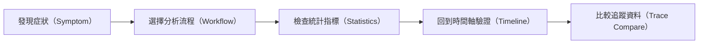
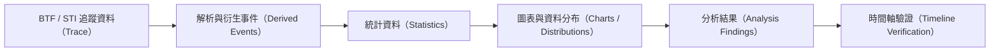
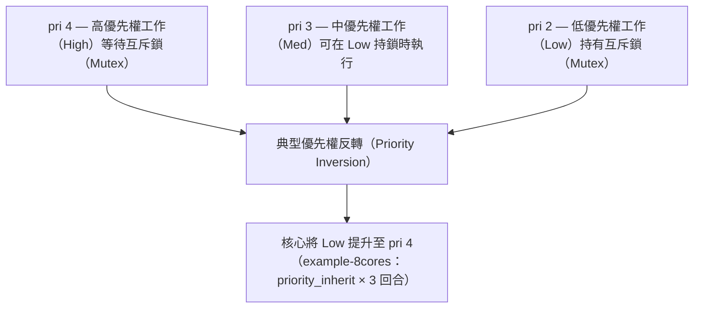

# BTF Viewer 統計分析 

本文件說明 BTFViewer Desktop 與 Web 提供的**確定性統計與分析（deterministic statistics and analysis）**功能。內容以短句與明確步驟為主，方便快速查找指標的定義、計算方式與限制。

當你需要回答下列問題時，可查閱本文件：

- 這項指標實際測量的是什麼？
- 指標如何計算？
- 數值偏高或偏低代表什麼？
- 這項指標有哪些限制？
- 接下來應該交叉檢查哪些相關指標？

如需了解產品操作與介面導覽，請參閱 [`README.md`](README.md)。如需依照步驟進行問題分析，請參閱 [`WORKFLOWS_zh-TW.md`](WORKFLOWS_zh-TW.md)。如需使用 AI 輔助分析，請參閱 [`AI_zh-TW.md`](AI_zh-TW.md)。

> **重要：** BTFViewer 的統計結果代表 BTF/STI Trace 中實際擷取到的證據。
>
> 最大值（Maximum）只是觀察到的數值，不代表系統保證值。相關性（correlation）不代表因果關係（causation）。Trace 中沒有某個事件，也不能證明該事件從未發生。

## 快速開始

一般的問題分析流程如下：



1. 從觀察到的症狀或 **Analysis Finding（分析結果）**開始。
2. 開啟對應的 Statistics 區段。
3. 檢查 **Min / Avg / p95 / p99 / Max**，並在有提供時查看資料分布。
4. 從異常數值或圖表資料點跳回 Timeline，確認事件發生的位置。
5. 在要分析的時間範圍前後放置至少兩個游標，並啟用 **Limit to C1–Cn**。
6. 在判斷原因之前，先交叉檢查其他相關指標。
7. 使用 **Trace Compare** 比較修改前後的結果。

## BTFViewer 測量的內容

BTFViewer 的統計資料來自**實際擷取的 BTF/STI 事件，以及由這些事件進行的確定性計算（deterministic calculation）**。



BTFViewer **不會**進行原始碼分析，也**不會**模擬 RTOS 排程器（scheduler）。

部分數值無法精確測量，因為 Trace 沒有記錄足夠的事件資訊。BTFViewer 會將這類結果明確標示為**啟發式（heuristic）**或**受限（limited）**。

例如，真正的工作回應時間（task response time）需要明確的 release 與 completion 事件。只有 context-switch 資料時，無法可靠建立兩者的對應關係。

## 文件導覽

| 文件 | 主要問題 | 適合用途 |
|---|---|---|
| [`README.md`](README.md) | 如何使用 BTFViewer？ | 安裝、介面導覽與一般操作 |
| [`WORKFLOWS_zh-TW.md`](WORKFLOWS_zh-TW.md) | 如何分析問題？ | 依步驟執行的問題分析流程 |
| [`STATISTICS.md`](STATISTICS.md) | 這項測量值代表什麼？ | 指標定義、公式、判讀方式與限制 |
| [`AI_zh-TW.md`](AI_zh-TW.md) | 如何使用 AI 輔助分析？ | AI 設定、工具、Planner、評估與實作 |

## 統計功能快速導覽

Desktop 與 Web 共用相同的 Statistics 面板。大多數區段都可以展開或收合。部分區段只有在 Trace 包含所需的 STI 事件時才會顯示。

### 系統與 CPU 負載（System and CPU Load）

| 指標 | 可回答的問題 |
|---|---|
| [Summary](#summary-scheduling-and-core-utilisation) | 目前整份 Trace 或游標範圍內包含哪些資料？ |
| [Scheduling summary](#summary-scheduling-and-core-utilisation) | 每個核心切換工作的頻率如何？切換之間的空檔有多大？ |
| [Core utilisation](#summary-scheduling-and-core-utilisation) | 每個核心有多忙？工作負載是否平均？ |
| [Trace Health (TICK)](#trace-health-tick) | 排程 Tick 是否規律？目前是 tickless 模式嗎？是否出現異常間隔？ |
| [Core Time Breakdown](#core-time-breakdown) | 每個核心的時間分別花在 Active、Idle、Tick 或 Gap 的比例是多少？ |
| [Concurrent Core Active Distribution](#concurrent-core-active-distribution) | 同一時間實際有多少個核心正在執行有效工作？ |
| [Kernel Switch Overhead](#kernel-switch-overhead) | 連續兩個工作執行區段之間花了多少時間？ |
| [Top tasks by CPU](#top-tasks-by-cpu) | 哪些工作占用最多 CPU 時間？ |

### 工作配置與核心遷移（Task Placement and Migration）

| 指標 | 可回答的問題 |
|---|---|
| [Core Migrations](#core-migration-analysis) | 工作在不同核心之間遷移的頻率有多高？ |
| [Core-Pair Migration Summary](#core-pair-migration-summary) | 哪些核心對之間的遷移最頻繁？ |
| [Migration & Corridor Inspector](#migration--corridor-inspector) | 主要遷移路徑與高活動核心對位於哪裡？ |
| [Core Affinity](#core-affinity) | 工作是否曾在設定的核心親和性（Core Affinity）範圍之外執行？ |
| [Task × Core](#task--core) | 每個工作的執行時間如何分布在不同核心？ |
| [Core Utilization Over Time](#core-utilization-over-time) | 各核心的負載如何隨時間變化？ |

### 工作時間與健康狀態（Task Timing and Health）

| 指標 | 可回答的問題 |
|---|---|
| [Task Lifecycle](#task-lifecycle) | 工作何時建立、刪除、暫停、恢復或被派送執行？ |
| [Deadlines / CPU budget](#deadlines--cpu-budget) | 哪些執行區段超過設定的 Deadline 或 CPU Budget？ |
| [Task Health](#task-health) | 哪些工作在多項指標上呈現異常行為？ |
| [Execution Time Per Slice](#execution-time-per-slice) | 每次在 CPU 上執行的區段持續多久？ |
| [Blocking Time](#blocking-time) | 工作離開 CPU 後，需要等待多久才再次執行？ |
| [Dispatch / Scheduling Latency](#dispatch--scheduling-latency) | 已記錄的 ready/create 事件到真正開始執行之間等待多久？ |
| [Inter-Arrival Time](#inter-arrival-time) | 同一工作連續兩次開始執行之間相隔多久？ |
| [Period / Jitter](#period--jitter) | 工作實際觀察到的啟動週期是否穩定？ |
| [Response Time](#response-time) | 啟發式估算的 ready-to-completion 延遲是多少？ |
| [Unified Jitter](#unified-jitter) | 哪一種時間指標的變異最大？ |

### 搶佔與同步（Preemption and Synchronization）

| 指標 | 可回答的問題 |
|---|---|
| [Preemption Chain Analysis](#preemption-chain-analysis) | 某個工作等待時，是哪些其他工作占用了 CPU？ |
| [Preemption Matrix](#preemption-matrix) | 哪些 victim/preemptor 組合在 Trace 中最明顯？ |
| [Priority Inheritance](#priority-inheritance) | 工作的優先權（Priority）何時被提升？提升原因為何？ |
| [Mutex / Semaphore pairing](#mutex--semaphore-pairing) | 同步事件是否正確配對？哪些地方出現問題？ |
| [Waiter × Owner](#waiter--owner) | 觀察到哪些工作之間的 Mutex 交接？ |
| [Mutex Blocking](#mutex-blocking) | 哪些工作在 Mutex 交接期間等待最久？ |
| [Queue](#queue) | Queue 的 send/receive 事件是否正確配對？ |

### 儀器事件、異常與比較（Instrumentation, Anomalies, and Comparison）

| 指標 | 可回答的問題 |
|---|---|
| [Timeline Anomalies](#timeline-anomalies) | 哪些異常事件最值得優先檢查？ |
| [Worst Events](#worst-events) | 目前範圍內持續時間最長的事件有哪些？ |
| [Critical Path](#critical-path) | 最長的啟發式 ready-to-completion 區間中，時間主要花在哪裡？ |
| [Recurring Patterns](#recurring-patterns) | 同一工作有哪些異常模式反覆出現？ |
| [Interval Analysis](#interval-analysis) | 應用程式自行定義的成對 Interval 持續多久？ |
| [Tag Analysis](#tag-analysis) | Tag STI channel 記錄了哪些數值？ |
| [Trace Compare…](#trace-compare-1) | 兩份 Trace 之間有哪些變化？ |
| [Metrics Distribution Charts](#metrics-distribution-charts) | 樣本值如何隨時間與數值範圍分布？ |

## 面板範圍與控制項（Panel Scope and Controls）

Desktop 與 Web 的右側面板都提供 **Statistics** 分頁。

### 將統計範圍限制在指定時間

先放置至少兩個游標，再啟用 **Limit to C1–Cn**。所有 Statistics 指標與 **Analysis Findings** 都會依選定的時間範圍重新計算。啟用範圍限制後，區段標題會顯示 **(cursor range)**。

清除所有游標後，即恢復為整份 Trace 的統計結果。

### 面板控制項

| 控制項 | 功能 |
|---|---|
| **+** | 展開所有區段 |
| **−** | 收合所有區段；已 Pin 的區段仍會保持展開 |
| Reset-order | 恢復預設的區段順序 |
| Section title / chevron | 展開或收合單一區段 |
| **⠿** grip | 拖曳區段以調整位置 |
| Pin | 使用 **Collapse all** 時仍保持該區段展開 |

區段順序、Pin 狀態、展開／收合狀態與表格高度都會跨次啟動保存。使用 **Settings → Reset to Defaults** 可恢復內建版面配置。

### 匯出與比較（Export and Compare）

**Export CSV** 與 **Export HTML** 都會套用目前的游標範圍。

- **CSV**：匯出 Statistics 各區段的摘要表格與相關計算值。
- **HTML**：除了相同的摘要資料外，也會加入較適合閱讀與報告使用的內容，例如 **Analysis Findings**、**Load Balance Score** 儀表，以及支援的詳細資料表。HTML 目錄提供 **Expand all** / **Collapse all**。
- **Trace Compare…**：比較兩份已開啟 Trace 的支援指標。Trace A 為 **baseline**，Trace B 為 **candidate**。**Δ** 為 Baseline A − Candidate B。若兩份 Trace 要使用不同的分析時間範圍，可啟用 **Limit to each tab's cursor range**。**Export CSV** / **Export HTML** 會寫出所有 Compare 表格（不只 Dialog 的 top-N 預覽）。HTML 會加上目錄，並提供 **Expand all** / **Collapse all**；Overview 與 Summary 預設展開。Overview 會顯示比較身分、結論與 Notable Changes 摘要（門檻以上的 Improved / Regressed）。Summary、Core Util、Response 與 Core Migrations 會附圖表；Core Migrations 預設顯示 count 變化最大的列。

各區段實際匯出的欄位與詳細行為，請參閱下方的指標說明。

<a id="statistics-metric-tables" name="statistics-metric-tables">&#x200B;</a>
## 詳細指標參考（Detailed Metric Reference） 

Desktop 與 Web 都提供 Statistics 面板。各項指標依功能分組為可展開／收合的區段。點選表格欄位標題，可切換遞增或遞減排序。

面板底部的 **Export CSV** 與 **Export HTML** 會依目前的游標範圍匯出所有區段的摘要資料。**Export HTML** 會在文件開頭加入 **Analysis Findings** 卡片，其內容與工具列的 **Analysis** 相同，包括負載平衡、WCET、阻塞、核心頻繁遷移（thrashing）、Deadline、Tick 健康狀態與同步問題。HTML 目錄（Table of Contents）提供 **Expand all** / **Collapse all**；Analysis Findings、Statistics Notes、Core Utilisation、Top Tasks、Trace Health 預設展開，其餘區段預設收合。

HTML 也會在 Core Utilisation 下方以 SVG 圖片嵌入 **Load Balance Score** 儀表，並在 Priority Inheritance、Mutex / Semaphore 與 Interval Analysis 下加入詳細子表。這些子表會優先列出持續時間最長的 instance 或 hold episode，每個子表最多保留約 150–200 筆資料。

**建議操作流程**

1. 開啟一份 Trace，例如 `tracedata/example-4cores.btf.gz` 可用來觀察 4 核心 SMP 工作負載；`tracedata/example-2cores.btf.gz` 則適合較小型的雙核心範例。
2. 可先點選工具列的 **Analysis**，快速查看目前範圍內依嚴重程度分類的分析結果。
3. 預設會展開 **Core utilisation** 與 **Trace Health**，其他區段則保持收合。依需要展開區段，或使用面板上方的 **+** / **−**。展開／收合狀態會保存，下一次啟動時自動恢復。常用區段可使用 Pin 固定展開。
4. 可拖曳 **⠿** 調整區段順序；需要恢復內建順序時，使用 reset-order 圖示。
5. 放置至少 **2 個游標**並啟用 **Limit to C1–Cn**，可將所有指標與 Analysis Findings 限制在指定時間範圍內。
6. 可從 Statistics 直接回到 Timeline：
   - 點選支援圖表的資料列，可開啟分布圖。
   - 點選 **Min / Max / p95 / p99**，可跳至對應的 slice 或 gap 並加入註解。
   - 點選 **Timeline Anomalies / Worst Events**，可縮放並放置 C1–C2。
   - 點選 **Mutex / Semaphore** 的 issue row，可跳至對應 STI 事件。
   - 在 **Deadlines / CPU budget** 中，可跳至超時 slice，或反白超過 CPU budget 的工作。
7. 同時開啟兩份 Trace 時，可使用工具列的 **Compare** 比較摘要與核心遷移等統計結果。

下方範例圖主要使用 **`tracedata/example-8cores.btf.gz`**。完整的實際分析流程請參閱 [WORKFLOWS_zh-TW.md §3](WORKFLOWS_zh-TW.md#3-worked-example--example-8cores)。

## 分析概觀（Analysis Overview）

先使用 **Analysis Findings** 快速了解目前範圍。需要確認證據時，再查看後面的詳細指標。

<a id="analysis-findings" name="analysis-findings">&#x200B;</a>
### 分析結果（Analysis Findings） 

工具列的 **Analysis** 在 Desktop 與 Web 使用相同的啟發式分析卡片（heuristic card），它並不是 Statistics 面板中的獨立區段。相關按鈕與 Timeline overlay 的操作方式，請參閱 [README → Analysis Findings](README.md#analysis-findings)。

負載平衡相關的分析使用與 **Core utilisation** 相同的 Score / σ / Gini。只有在系統具有 **至少 2 個核心**，且總使用率 **> 0** 時才會產生相關結果。

即使系統負載屬於平衡或中等狀態，畫面仍會顯示：

`Load Balance Score …% (σ=…%, G=…)`

只有當 Score ≥ 85% 且 σ ≤ 30% 時，才會使用「reasonably balanced」的判定。對話框文字會依目前主題使用對應顏色，因此在深色與淺色模式下，資訊與正常狀態都能保持清楚可讀。

## 1. 系統與 CPU 負載（System and CPU Load）

用來了解整體 CPU 負載、核心使用率、Tick 健康狀態與排程切換開銷。

<a id="summary-scheduling-and-core-utilisation" name="summary-scheduling-and-core-utilisation">&#x200B;</a>
### 摘要、排程與核心使用率（Summary, Scheduling, and Core Utilisation） 

這些區段依 Statistics 面板的預設順序排列。Summary 與 Scheduling summary 固定在最前方，**Core utilisation** 則是第一個可以 Pin 的區段。以下說明依照「系統負載 → 遷移／親和性／生命週期／Deadline → Slice timing → 搶佔／同步／Tag」的順序整理；使用者仍可透過拖曳自行調整面板順序。

**Summary（摘要）** — 顯示目前範圍的整體計數，包括 Trace span、task、segment 與 STI event 數量。Span 為目前作用範圍內的 *t*<sub>max</sub> − *t*<sub>min</sub>，範圍可以是完整 Trace 或游標區間。

**Scheduling summary（排程摘要）** — 針對每個核心統計 **context switch（上下文切換）**，並計算同一核心上連續兩個 slice 之間的 **core gap（核心空檔）**：

```math
g_{\mathrm{core}} = t_{\mathrm{start},k+1} - t_{\mathrm{end},k}
```

如果理論上應保持忙碌的核心出現很大的 **max core gap**，可能表示工作飢餓（starvation）、tickless idle，或某個長時間執行的工作阻礙其他工作取得 CPU。

**Core utilisation（核心使用率）** — 計算每個核心在目前範圍執行非 IDLE、非 TICK 工作的時間比例：

```math
U_{\mathrm{core}} = \frac{T_{\mathrm{active,core}}}{T_{\mathrm{scope}}} \times 100
```

當 Trace 包含兩個以上的核心時，區段上方會並排顯示兩個儀表：**Load Balance Score（負載平衡分數）**與**Std Deviation（標準差，σ）**：

```math
\mathrm{Score} = 100\,\% \times (1 - G)
```

其中 *G* 為各核心使用率 {*U*<sub>core</sub>} 的 **Gini coefficient（吉尼係數）**。

σ 是 `{U_core}` 的母體標準差（population standard deviation）。Score 儀表範圍為 0–100%，100 代表完全平衡，0 代表負載高度集中於單一核心。σ 儀表範圍為 0–60%，警告門檻位於量表中間。其狀態區間與工具列 **Analysis** 相同：

| 區間 | 條件 | UI 顯示 |
|------|------|-----|
| **Red** | Score < 70% | 顯示 **Unbalanced** 標籤與警示；Score 儀表進入紅色區域 |
| **Amber** | Score ≥ 70% 且 σ > 30% | 顯示 **σ > 30%** 標籤；σ 儀表顯示 amber，σ > 50% 時為紅色 |
| **OK** | Score ≥ 70% 且 σ ≤ 30% | 儀表顯示正常狀態 |

工具列 **Analysis** 在 Score < 70% **或** σ > 30% 時也會提出警告。只有 Score ≥ 85% 且 σ ≤ 30% 時，才會將核心描述為「reasonably balanced」。

當至少兩個核心的總使用率 > 0 時，即使結果為 OK 或中等狀態，Analysis 對話框仍會顯示 **Core utilisation balance** 與 `Load Balance Score …% (σ=…%, G=…)`。**Export HTML** 會輸出相同儀表與 Analysis Findings；**Export CSV** 則會包含 Score、σ 與 Gini 值。

**如何解讀：** 如果各核心使用率差異很大，可能與不適當的核心親和性、Lock 導致的核心固定，或工作配置不平均有關。建議搭配 **Core Migrations**、Migration & Corridor Inspector 與工具列 **Analysis** 交叉確認。

<a id="trace-health-tick" name="trace-health-tick">&#x200B;</a>
#### Trace 健康狀態（Trace Health / TICK） 

此功能使用 STI **TICK** 時間戳記估算排程 Tick 的規律程度，並判斷 Trace 使用週期性 Tick 或 **tickless idle**。如果分析的是 FreeRTOS Trace，可使用 `configUSE_TICKLESS_IDLE` 對照其設定模式。

**公式** — 對於時間為 *t*<sub>n</sub> 的連續 TICK 事件：

```math
\Delta_n = t_n - t_{n-1}, \quad
\mu = \mathrm{mean}(\Delta_n), \quad
\sigma = \mathrm{stdev}(\Delta_n), \quad
\mathrm{CV} = \frac{\sigma}{\mu}
```

**Missed ticks (est.)（預估遺漏 Tick）**會統計 Δ<sub>n</sub> 明顯大於 μ 的大型間隔，約以 ⌊Δ<sub>n</sub> / μ⌋ − 1 估算。

**如何解讀：** 在 **TICK** 模式（CV ≤ 5%）下，間隔通常集中在單一名義週期附近，表示排程時脈穩定。**TICKLESS** 模式（CV > 5%）則會因 Idle 期間停止 Tick interrupt，而產生較寬的時間分布。Scatter plot 中較高的尖峰可能只是跨越多個 Tick 的睡眠區間，不一定代表 CPU 過載。

即使 Status 顯示為 **good**，如果 **Max gap** 很大，仍值得檢查是否存在長時間 critical section 或 Trace 資料遺失。

| 欄位 | 說明 |
|-------|---------|
| **Status** | 依 gap threshold 顯示 `good` / `warning` / `critical` |
| **Mode badge** | `TICK` 或 `TICKLESS`；依連續 Tick interval 的 CV = σ/μ 自動判斷，CV > 5% 分類為 tickless。將滑鼠停在 badge 上可查看實際 CV |
| **Ticks** | 目前範圍內的 TICK 事件數 |
| **Avg period / Max gap** | 實際觀察到的 Tick 間隔 |
| **Missed ticks (est.)** | 根據大型間隔粗略估算的遺漏 Tick 數 |

在 **tick mode** 下，timer interrupt 以固定頻率觸發，因此 Tick interval 會形成緊密的分布。在 **tickless mode** 下，排程器會在 Idle 期間停止 Tick interrupt 以降低耗電，因此相鄰 TICK 可能跨越一個或多個名義 Tick 週期，資料分布也會明顯變寬。

當目前範圍至少包含 **2 個 TICK** 時，**TICK / TICKLESS** mode badge 旁會出現 **Tick Distribution…** 按鈕。點選後會開啟標準的 scatter + histogram 視窗：

- **Scatter plot（散佈圖）** — 顯示每個 Tick interval 隨 Trace 時間的變化；較長的 Idle 區間會形成較高的尖峰。
- **Histogram（直方圖）** — 顯示 interval 的分布。當 tickless idle 使資料範圍拉大時，系統可能自動使用 p5–p95 或對數 duration。Tickless 模式通常會形成多峰分布，例如 1×、2×、3× 名義週期。CDF 可用來判斷單一週期與多週期間隔各占多少比例。

點選任一 scatter point，可跳至該 Tick 時間、加入 **annotation（註解）**，並開啟 **Marks** 分頁選取該註解。

`example-8cores.btf.gz` 的 **Tick Distribution** 約有 2496 個 TICK 事件，CV ≈ 35.9%，因此判定為 **TICKLESS**：


Histogram 中 1×、2×、3× 名義週期形成的多個峰值可確認 tickless idle 的行為：大部分 gap 為單一 Tick，但部分 Idle 區間會略過數個名義週期後才出現下一個 TICK。

大型 gap 可能來自 CPU 過載、長時間 critical section、tickless idle 或 Trace 資料缺口，**不一定代表 RTOS 設定錯誤**。

<a id="core-time-breakdown" name="core-time-breakdown">&#x200B;</a>
### 核心時間分布（Core Time Breakdown） 

將目前範圍內每個核心的時間分成四個互斥類別，並以核心時間百分比表示：

| 類別 | 說明 |
|--------|---------|
| **Active** | 執行非 IDLE、非 TICK 工作的時間 |
| **Idle** | IDLE 工作時間 |
| **Tick** | TICK handler 執行時間 |
| **Gap** | 連續 `core_segs` 之間未被計入的時間，例如 scheduler latency、ISR overhead 或 Trace gap |

**如何解讀：** 忙碌核心的 **Gap %** 偏高時，可能與較大的 **Kernel Switch Overhead**、長時間 ISR 或 critical section 有關。

如果部分核心的 **Idle %** 很高、**Active %** 很低，但其他核心接近過載，可能代表核心親和性或工作配置不平均。建議搭配 **Core utilisation** 與 **Core Migrations** 檢查。

Desktop 版可點選核心資料列，在 **Core View** 中聚焦該核心。

<a id="concurrent-core-active-distribution" name="concurrent-core-active-distribution">&#x200B;</a>
### 同時作用中的核心分布（Concurrent Core Active Distribution） 

此指標用來觀察**時間上的平行度（temporal parallelism）**：目前範圍內，有多少時間正好有 *N* 個核心同時執行非 IDLE、非 TICK 工作，其中 *N* = 0…核心總數。

**公式** — 當核心 *c* 在時間 *t* 執行非 IDLE、非 TICK 工作時，令 isActive(c,t) = 1：

```math
N_{\mathrm{active}}(t) = \sum_{c} \mathrm{isActive}(c,t)
```

表格會統計每個 *N* 層級的累積停留時間（dwell time）。

| 欄位 | 說明 |
|--------|---------|
| **Active Cores** | 同時作用中的核心數 *N* |
| **Duration** | N<sub>active</sub> = N 的累積時間 |
| **% of Span** | 占目前分析範圍的比例 |

**Distribution chart（分布圖）** — 點選任一資料列，可查看該核心數量下各 interval 的開始時間與 dwell duration scatter，以及 dwell histogram。這項指標可補充 **Load Balance Score**：Load Balance Score 衡量的是使用率是否平均，而不是核心是否在同一時間一起執行工作。

**Headless snapshot**（`example-8cores.btf.gz`，*N* = 4 個 active core）：

```bash
python builds/btf_viewer.py snapshot ../tracedata/example-8cores.btf.gz \
    -o stats-concurrency-4.svg --view plot --metric concurrency --active-cores 4
```


<a id="kernel-switch-overhead" name="kernel-switch-overhead">&#x200B;</a>
### 核心切換開銷（Kernel Switch Overhead） 

此指標根據 `core_segs` 之間的 gap，計算每個核心連續 context switch 的成本，也就是同一核心上前一個 slice 被 preempt/end 到下一個 slice resume/start 之間的時間：

```math
O_{\mathrm{switch}} = t_{\mathrm{resume},B} - t_{\mathrm{preempt},A}
```

| 欄位 | 說明 |
|--------|---------|
| **Core** | 核心名稱（`Core_N`） |
| **Switches** | 目前範圍內連續 slice gap 的數量 |
| **Min / Avg / Max** | Switch gap 的時間統計 |
| **Total Overhead** | 目前範圍內所有 gap 的總和 |
| **% of Core** | Total overhead 占核心／目前分析範圍的百分比 |

**Distribution chart** — 點選任一資料列，可查看 switch time 與 gap duration 的 scatter，以及包含 variability overlay（avg ± σ）的 histogram。Gap 為零或接近零，表示兩個 slice 幾乎連續執行，在目前 Trace 解析度下看不到明顯排程開銷。

**Headless snapshot**（`example-8cores.btf.gz`，Core_0）：

```bash
python builds/btf_viewer.py snapshot ../tracedata/example-8cores.btf.gz \
    -o stats-switch-core0.svg --view plot --metric switch_overhead --core Core_0
```


<a id="top-tasks-by-cpu" name="top-tasks-by-cpu">&#x200B;</a>
### CPU 使用時間最高的工作（Top Tasks by CPU） 

依目前範圍內的總 on-CPU 時間，對 worker task 排名；IDLE 與 TICK 不列入。計算使用與 **Execution Time Per Slice** 中 **CPU%** 相同的 *T*<sub>exec,i</sub>。點選資料列可在 Timeline 上反白對應工作。

核心遷移表格、工作反白／檢查流程、Corridor Inspector 與 **Trace Compare…** 請參閱 [Core migration analysis](#core-migration-analysis)。

## 2. 工作配置與核心遷移（Task Placement and Migration）

用來了解工作在哪些核心執行，以及是否有過度遷移、核心偏好或負載配置問題。

<a id="core-affinity" name="core-affinity">&#x200B;</a>
### 核心親和性（Core Affinity） 

比較每個工作的 `affinity_set` STI（`vTaskCoreAffinitySet`）歷史與實際執行核心。

**Violations（違規）**會列出工作在當時有效 affinity mask 之外執行的核心。第一次設定 affinity mask 之前的 slice 視為不受限制。Mask 變更會以例如 `0x1 → 0x8` 的形式顯示。

此區段固定顯示。如果 Trace 沒有 `affinity_set` 事件，會顯示空資料提示。

<a id="task--core" name="task--core">&#x200B;</a>
### 工作 × 核心（Task × Core） 

顯示每個工作在各核心上的執行時間，占目前分析範圍的百分比。

此指標可搭配 **Core Time Breakdown** 與 **Core Affinity** 使用：Core Time Breakdown 顯示每個核心的整體時間分布；Core Affinity 則比較設定的 affinity mask 與實際執行核心。

點選任一儲存格，可跳至該工作第一次在該核心執行的 on-CPU slice。

<a id="core-utilization-over-time" name="core-utilization-over-time">&#x200B;</a>
### 核心使用率隨時間變化（Core Utilization Over Time） 

將目前 Statistics 範圍切成等長的時間區間，顯示每個核心在各區間中的 busy percentage。

此指標可補充 **Core Time Breakdown** 的整體範圍統計，以及 **Task × Core** 的個別工作分布。點選任一時間區間，可直接縮放到該時間範圍。


<a id="core-migration-analysis" name="core-migration-analysis">&#x200B;</a>
### 核心遷移與親和性（Core Migration and Affinity） 

如果同一個工作的下一個 slice 改到另一個核心執行，Viewer 就記錄一次**核心遷移（Migration）**。

Viewer 會在解析 segment timeline 時偵測 Migration。

Timeline 不會另外畫出獨立的 migration marker。

可使用下列功能檢查：

- **Core Migrations** table。
- 工具列 **Heatmap** 開啟的 **Migration & Corridor Inspector**。
- **Trace Compare…**。
- Find 的 **Migrations** mode。

Affinity、Lifecycle 與 Deadline 的基本定義已在前面章節說明。本節進一步介紹 Migration table、Highlight／Inspect 流程、Corridor Inspector 與 Trace Compare。

<a id="highlight-a-migrating-task-on-the-timeline" name="highlight-a-migrating-task-on-the-timeline">&#x200B;</a>
### 在 Timeline 上反白核心遷移工作（Highlight a Migrating Task） 

如果要在實際 Timeline 情境中觀察頻繁遷移的工作，而不只是查看表格數值：

1. 保持在 **Task View**（工具列 **Task**）。
2. 點選工作名稱，例如 `CS[22]`，將它設為 **lock-highlight**。其他工作仍會保留在 Timeline 上，但會變灰。此處**不要使用 Legend filter**。
3. 啟用 **Load**，在 Timeline 下方查看該工作於**各核心**的 CPU usage。詳見 [CPU Load](README.md#cpu-load)。
4. 如有需要，可在 migration burst 前後放置游標並啟用 **Limit to C1–Cn**，讓 **Statistics → Core Migrations** 只針對該時間範圍重新計算。Inspector grid 則會獨立依目前可見的 Timeline viewport 更新。

![CS[22] highlighted in Task View with per-core CPU Load](../images/stats/tasks-cpu-load-cs22.svg)

*`example-8cores.btf.gz` 中的 `CS[22]` 在 Task View 被 lock-highlight；CPU Load 顯示該工作在每個核心上的使用比例。*

**Headless 範例** — 顯示完整範圍 Task View + CPU Load：

```bash
python builds/btf_viewer.py snapshot ../tracedata/example-8cores.btf.gz \
    -o /tmp/cs22-cpu-load.svg \
    --view timeline --view-mode task --task "CS[22]" --cpu-load
```

只查看放大的 migration burst，不顯示 Load strip：

```bash
python builds/btf_viewer.py snapshot ../tracedata/example-8cores.btf.gz \
    -o /tmp/cs22-burst.svg \
    --view timeline --view-mode task --task "CS[22]" \
    --lo 1805000 --hi 1865000
```

<a id="inspect-migrations-involving-a-specific-core" name="inspect-migrations-involving-a-specific-core">&#x200B;</a>
### 檢查特定核心相關的遷移（Inspect Migrations Involving a Specific Core） 

反白頻繁遷移的工作後，可依下列順序檢查：

1. **Statistics → Core Migrations**  
   查看該工作的 **Primary core**、**Rate**、**Dwell** 與 **Ping**。點選資料列可開啟 **Dwell / Rate / Gap** chart。

2. **Core-Pair Migration Summary**  
   排序或尋找 **From** / **To** 包含目標核心的 core pair，例如 `Core_5→Core_7`。可確認哪個相鄰核心承接最多 migration，以及 **Bounce %** 是否偏高。點選資料列可查看 Gap / Rate chart；使用視窗底部的 **Open Heatmap** / **Open Chord** 可開啟 Inspector，並聚焦該 core pair。

3. 工具列 **Heatmap**  
   使用 Corridor tree + time-bin grid。點選 hot cell，或展開 corridor 查看哪些工作造成該流量，再使用 **Inspect in Timeline** 或 double-click 進入 Spotlight。

4. **Show topology**  
   在 Inspector 中啟用，或從 pair chart 使用 **Open Chord**。同一視窗會展開 topology sidebar。將滑鼠移到外圈 egress、內圈 ingress 或 ribbon 上，可隔離特定 flow。

5. **Core Time Breakdown**  
   點選 core row，可跳到以該核心為焦點的 Core View。

6. **Headless CSV**  
   可針對指定時間範圍輸出 migration：

```bash
python builds/btf_viewer.py migrations ../tracedata/example-8cores.btf.gz \
    --lo 1805000 --hi 1865000 -o - | head
```

**Legend panel：** 啟用 **Migrated tasks only**，可隱藏從未離開初始核心的工作。

**核心遷移統計（Core Migrations）**

**Statistics → Core Migrations** 是可收合區段，只列出曾在兩個以上核心執行的工作。

**遷移率（Migration Rate）**

單看 migration 次數容易誤判：執行時間很長的工作，即使 migration 次數較多，實際遷移頻率也可能不高。因此 BTFViewer 會將 migration count 依工作實際 on-CPU 時間正規化：

```math
R_m = \frac{N_{\mathrm{migrations},i}}{T_{\mathrm{exec},i}}
```

**Rate** 欄位以工作 on-CPU 時間每秒發生的 migration 次數表示，例如 `1.23/s`。

如果 Trace 包含 TICK event，也會顯示該工作每個 **on-CPU scheduler tick** 的 migration 次數，例如 `2.785/tick`。這裡只計算目前範圍內落在該工作 slice 中的 TICK STI，不使用整份 Trace 的 Tick 總數。

**如何解讀：** Rate 很高，表示工作經常在不同核心之間移動。這種情況稱為 **Thrashing（頻繁遷移）**。

對高優先權即時工作而言，通常希望 Rate 接近零。

**平均核心停留時間（Average Core Dwell Time）**

表示工作每次取得 CPU 後，在 block、yield 或 migration 之前，平均可以持續執行多久：

```math
\bar{T}_d = \frac{1}{N_{\mathrm{slices}}} \sum_k d_k
= \frac{T_{\mathrm{exec},i}}{N_{\mathrm{slices},i}}
```

每個 *d*<sub>k</sub> 代表一次 switch-in episode。也可以理解成：對工作曾經執行過的每個核心，以 *T*<sub>on</sub> / *N*<sub>slices</sub> 計算 per-core dwell 後的整體平均。

**如何解讀：** **Dwell** 很短，表示工作無法長時間留在同一個核心。

例如，Dwell 只有數毫秒，而且接近系統 Tick period。這可能表示排程器太常把工作移到其他核心。

| 欄位 | 說明 |
|---|---|
| **Task** | 工作顯示名稱（`Name[id]`） |
| **Migr** | 目前範圍內的 migration 次數；範圍可以是完整 Trace，或啟用 **Limit to C1–Cn** 後的游標區間 |
| **Rate** | Migration rate；`/s` 為每秒工作 active time 的遷移次數；`/tick` 為目前範圍內每個 on-CPU TICK 的遷移次數 |
| **Dwell** | 目前範圍內平均 on-CPU slice duration，也就是平均 core dwell time |
| **Cores** | 目前範圍內有 on-CPU time 或 migration 的不同核心數 |
| **Primary** | Active time 最長的核心，以及該核心所占比例（%） |
| **Ping** | Ping-pong migration；1 µs 內連續發生 A→B→A 三次 migration |
| **STI±** | Migration 前後 ±500 ns 內存在 STI event 的次數 |
| **Gap after** | Migration 後緊接著發生的平均 off-CPU gap |
| **Gap other** | 同一工作其他位置的平均 blocking gap |

點選資料列會開啟 **Distribution Chart（分布圖）**，對話框中提供三個分頁，不需要關閉視窗即可切換：

- **Dwell**（預設）— 每次 on-core run 一個資料點。x = run start time；y = run duration *d*<sub>k</sub>。
- **Rate** — 除第一次之外，每次 migration 一個資料點。x = migration time；y = 與該工作**前一次 migration**之間的時間。大量短 gap 聚集表示短時間內頻繁 bounce；分布平坦且間距較大則表示 migration 較少且分散。
- **Gap** — 每次 migration 後存在正值 **Gap after** 時產生一個資料點。x = migration time；y = migration 後的 off-CPU gap。這些就是 **Gap after** 欄位的原始 sample。**Gap other** 不會畫在這裡；若要查看所有 off-CPU gap，應開啟同一工作的 **Blocking Time** chart。

三個分頁都使用與其他 Statistics chart 相同的 **Adaptive Scaling（自適應縮放）**。

`example-8cores.btf.gz` 中的 **CS[22]** 是經常遷移的 context-switch stress task：

![On-core dwell time distribution for CS[22] in example-8cores.btf.gz](../images/stats/stats-mig-dwell-cs22.svg)

![Time between migrations for CS[22] in example-8cores.btf.gz](../images/stats/stats-mig-rate-cs22.svg)

![Post-migration gap distribution for CS[22] in example-8cores.btf.gz](../images/stats/stats-mig-gap-cs22.svg)

可拖曳表格下方的 resize handle，增加或減少可見資料列數。

<a id="core-pair-migration-summary" name="core-pair-migration-summary">&#x200B;</a>
### 核心對遷移摘要（Core-Pair Migration Summary） 

這個表格顯示所有工作的核心遷移方向。

每一列代表一條 `From → To` 的核心路徑。

兩個表格回答不同的問題：

- **Core Migrations**：哪個工作遷移得太頻繁？
- **Core-Pair Migration Summary**：哪一組核心之間的遷移最多？其中有多少是 Lock Bounce？

| 欄位 | 說明 |
|---|---|
| **From / To** | 來源核心與目的核心 |
| **Count** | 目前範圍內沿此方向發生的 migration 次數 |
| **Bounces** | 持有 Mutex 跨核心遷移時發生的 migration 子集合 |
| **Bounce %** | `100 × Bounces / Count` |
| **Avg Gap** | 此 corridor 中 migration 後平均 off-CPU gap |

點選資料列會開啟包含兩個分頁的 Distribution Chart：

- **Gap**（預設）— 每次 directed migration 若有正值 gap，就顯示一個資料點。x = migration time；y = post-migration gap，也就是 **Avg Gap** 的原始 sample。Lock-bounce event 以**橘色**顯示，其餘使用來源核心的顏色。
- **Rate** — 同一 directed pair 上，每次連續 migration 顯示一個資料點。x = migration time；y = 此 corridor 與前一次 hop 的時間差。緊密的垂直帶狀分布表示 corridor traffic 具有明顯 burst。

對話框底部提供：

- **Open Heatmap** — 開啟 **Migration & Corridor Inspector** 並聚焦目前 core pair；當 Bounce % 偏高時，會優先使用 **Lock Bounces Only**。
- **Open Chord** — 開啟相同 Inspector，同時展開 topology，並反白目前 core pair。

`example-8cores.btf.gz` 中，依 Count 排名最前面的 corridor 是 **`Core_5 → Core_7`**：


<a id="migration--corridor-inspector" name="migration--corridor-inspector">&#x200B;</a>
### 遷移與路徑檢視器（Migration & Corridor Inspector） 

工具列的 **Heatmap** 會在 Desktop 與 Web 開啟 Inspector，其中包含：

- Corridor / Task tree。
- Time-bin grid。
- Mini-chord topology。

Core-pair chart 的 **Open Chord**，以及 Inspector 內的 **Show topology**，都會在**同一個 Inspector 視窗**中展開 topology sidebar。

| 功能 | 說明 |
|---|---|
| **Open** | 2 個以上核心時，可從工具列 **Heatmap** 開啟。Pair chart 的 **Open Chord** 或 Inspector 的 **Show topology** 可切換到以 chord 為主的版面。Desktop 為 non-modal；Web 使用 overlay，但 Timeline 仍可操作。切換分頁時 Inspector 會關閉 |
| **Scope** | 使用目前 Timeline 可見範圍，與 Statistics 的 **Limit to C1–Cn** 相互獨立。頂端 **Full view** / **Viewport view** 橫幅（顏色與 distribution chart 相同）顯示目前時間範圍：Fit to window 或縮放後的視窗。若目前範圍沒有 migration，tree/grid 顯示 *No migrations in scope*，但 topology 仍可使用 |
| **Filter** | **Top corridors**、**Direction**、**Task filter**。Trace 存在跨核心 Mutex hold 時，另外提供 **Lock Bounces Only** |
| **Select** | 可點選 tree row、grid cell 或 chord ribbon。Double-click 或 **Inspect in Timeline** 會以 C1–C2 Spotlight 該 time bin 或工作。工具列 **All** / **Show all tasks** 可清除 filter |
| **Query with AI…** | 在 **AI** 分頁執行 **Migration thrash** template，使用與 Statistics 相同的 findings context。若 AI 尚未啟用，會開啟 **Settings → AI** |
| **> 16 cores** | Tree 依來源核心分組；topology 可切換 Circle ↔ Matrix，並可將 topology Dock 到 **Bottom** 或 **Right** |

`example-8cores.btf.gz`：


將滑鼠停在 ribbon 上，footer 會顯示 `cN→cM: count`。每個工作的 ping-pong、STI 與 gap-after 彙整仍位於 Statistics 的 **Core Migrations**。

```bash
make -C BTFViewer update-images
```

```bash
python builds/btf_viewer.py snapshot ../tracedata/example-8cores.btf.gz \
  -o /tmp/migration.svg --view chord --width 1000 --height 720 --drill-row 0
```

## 3. 工作時間與健康狀態（Task Timing and Health）

用來檢查工作生命週期、Deadline、執行時間、阻塞、週期、Jitter 與 Response Time。

<a id="task-lifecycle" name="task-lifecycle">&#x200B;</a>
### 工作生命週期（Task Lifecycle） 

依工作彙整 `task` STI channel 記錄的 `create`、`delete`、`suspend` 與 `resume` 事件，包括：

- 建立與刪除時間戳記。
- Suspend / Resume 次數。
- Alive span（create → delete）。
- Lifecycle event 總數。
- **Runs** — 工作實際被派送到核心執行的次數，也就是 context-switch-in / segment count。

**Runs** 是排程器層級的指標，通常會遠大於 Susp/Res。Susp/Res 只計算明確呼叫 `vTaskSuspend()` / `vTaskResume()` 所產生的事件；工作即使從未被明確 suspend，也可能被排程器多次執行、preempt，再重新取得 CPU。

在 `example-8cores.btf.gz` 中，test 9 建立 **SR0–SR3**，並固定在不同核心上，測試 suspend-while-blocked 與 suspend-while-running 的重疊情境。可使用此區段確認 Susp/Res 數量是否與 STI event pair 相符。

此區段固定顯示。如果 Trace 沒有 task create/delete/suspend/resume STI 事件，會顯示空資料提示。

<a id="deadlines--cpu-budget" name="deadlines--cpu-budget">&#x200B;</a>
### 截止時間／CPU 預算（Deadlines / CPU Budget） 

可為每個工作設定 execution deadline（單位為**奈秒，nanoseconds**；比較前會依 Trace `#timeScale` 轉換），並設定全域 CPU budget threshold（%）。

此區段顯示：

- **Slice over deadline** — 依 duration 列出最長的 20 筆超時 slice；點選資料列可跳至對應位置並加入 annotation。
- **CPU budget exceeded** — 列出超過 CPU budget 的工作；點選資料列可反白該工作。

點選欄位標題可排序。使用區段內的 **Settings → Display** 可開啟 Analysis threshold 設定（`Ctrl+,`）。

此區段固定顯示；尚未設定 threshold 時，會提示使用者進行設定。

<a id="task-health" name="task-health">&#x200B;</a>
### 工作健康狀態（Task Health） 

根據實際測得的統計資料，以**啟發式（heuristic）**方式計算 0–100 分的健康分數。評估項目包括 execution spread、blocking tail、period CV／missed activation、migration ratio、deadline miss 與 CPU share。

狀態使用 ✓ / ⚠ / ❌ 顯示。

> **注意：** Task Health 並不是 AI 機率，也不代表問題發生機率。它只是將多項統計指標整合成便於快速檢查的啟發式分數。

點選任一狀態區間，可直接開啟對應的 Statistics 區段。

<a id="execution-blocking-and-inter-arrival" name="execution-blocking-and-inter-arrival">&#x200B;</a>
### 工作時間分析（Task Timing） 

BTFViewer 會根據同一工作連續的 on-CPU slice，計算三個最基本的時間指標：**執行時間（Execution Time）**、**阻塞時間（Blocking Time）**與**到達間隔時間（Inter-Arrival Time）**。

下圖顯示三者在 Timeline 上的關係。UI 中的 **Block Time** 對應 Statistics 的 **Blocking Time**。


| 指標 | 測量範圍 |
|---|---|
| **Execution Time（執行時間）** | 單一 on-CPU slice 的開始 → 結束 |
| **Blocking Time（阻塞時間）** | 前一個 slice 結束 → 下一個 slice 開始，也就是 off-CPU gap |
| **Inter-Arrival Time（到達間隔時間）** | 前一個 slice 開始 → 下一個 slice 開始 |

對同一對連續 activation 而言，當 gap 為正值時，大致可表示為：

**Inter-arrival ≈ execution + blocking**

這三個指標描述的是不同觀察角度。Execution Time 告訴你工作取得 CPU 後執行多久；Blocking Time 告訴你離開 CPU 後等待多久；Inter-Arrival Time 則反映兩次開始執行之間的整體間隔。

<a id="execution-time-per-slice" name="execution-time-per-slice">&#x200B;</a>
### 每個 Slice 的執行時間（Execution Time Per Slice） 

測量每個工作單次 **on-CPU slice** 的持續時間，也就是從 switch-in 開始，到工作 block、yield 或被 preempt 為止。

**公式** — 對工作 *i* 在目前範圍的每個 on-CPU slice *k*：

```math
d_k = t_{\mathrm{end},k} - t_{\mathrm{start},k}
```

表格中的統計值由目前範圍內所有 slice duration *d*<sub>k</sub> 計算。

**Jitter（抖動）**定義為觀察到的範圍：

`Max − Min`

**σ（標準差）**使用母體標準差（population standard deviation），因為目前範圍內觀察到的 slice 被視為完整樣本集合。

**CPU%** 則表示該工作占目前範圍內所有有效 CPU 執行時間的比例：

```math
\mathrm{CPU}_i = \frac{T_{\mathrm{exec},i}}{\sum_j T_{\mathrm{exec},j}} \times 100
```

**如何解讀：** 短且集中的 slice 通常表示工作執行時間穩定，可能具有週期性或由 Tick 驅動。若 **Max** 明顯偏大，或 p95/p99 形成很長的 tail，表示存在較長的執行事件。

對即時系統而言，可將 **Min** 視為觀察到的最佳案例執行時間（Best-Case Execution Time, **BCET**），將 **Max** 視為觀察到的最差案例執行時間（Worst-Case Execution Time, **WCET**）。兩者差距過大代表執行時間變異較高，即使 Avg 看起來正常，也可能影響 Deadline。

較長的 slice 可能與 critical section、lock hold 或 interrupt-disabled region 有關，但 Statistics 本身只提供時間證據，仍應回到 Timeline 與其他指標確認原因。

| 欄位 | 說明 |
|---|---|
| **Task** | 顯示名稱，例如 `Name[id]` |
| **Runs** | 目前範圍內的 slice 數 |
| **CPU%** | 該工作占目前 Trace／游標範圍內有效 CPU 時間的比例 |
| **Min / Avg / Max / p95** | Slice duration 統計 |
| **Jitter** | 觀察到的 duration 範圍（`Max − Min`） |
| **σ** | Slice duration 的母體標準差 |
| **Min / Max** links | 跳至並標註 BCET / WCET slice |

**Distribution chart（分布圖）** — 點選工作資料列後：

- **Scatter（散佈圖）**：x = slice 開始時間，y = slice duration。
- **Histogram（直方圖）**：顯示 slice duration 的分布；tail 很寬時會自動使用 log scale。
- **CDF（累積分布函數，Cumulative Distribution Function）**：顯示不超過某個 duration 的樣本比例。
- **Variability overlay（變異範圍）**：半透明區域代表 average ± 一個母體 σ。

Jitter 已經由資料的完整 `Max − Min` 範圍表示，因此不需要額外的 marker line。

在 `example-8cores.btf.gz` 中，工作 **CS[11]** 有 730 個 slice，並存在一段較長的 execution tail：

![Execution time distribution for CS[11] in example-8cores.btf.gz](../images/stats/stats-exec-cs11.svg)

Scatter 可看到週期性出現的短 slice burst。由於 duration 從短時間一路延伸到較長時間，Histogram 使用**對數 duration 軸（log-scaled duration axis）**，讓兩端資料都能清楚顯示。

CDF 左側快速上升，表示大多數 slice 都很短；之後逐漸趨近 100%，表示較長 slice 只占少數。圖中的 p5、p50 與 p95 marker 可搭配右側累積百分比判讀。

<a id="blocking-time" name="blocking-time">&#x200B;</a>
### 阻塞時間（Blocking Time） 

測量同一工作前一個 slice 結束，到下一個 slice 開始之間的 **off-CPU gap**。

這段時間代表工作尚未再次取得 CPU。可能原因包括：

- 被其他工作 preempt。
- 等待資源。
- 等待排程器再次派送。

> **Blocking Time 不是端到端回應時間（end-to-end response time）。**
>
> BTFViewer 的 Blocking Time 只測量工作離開 CPU 到下一次 resume 的時間。真正的 Response Time 通常必須從明確的 release event 測量到 completion event，無法只靠 context-switch slice 可靠推導。若需要精確量測，應使用可配對的 instrumentation，例如 interval start/stop event。

**公式** — 對工作 *i* 的連續 activation *k* 與 *k+1*：

```math
g_k = t_{\mathrm{start},k+1} - t_{\mathrm{end},k}
```

只計算正值 gap。Min / Avg / Max / p95 等統計值皆由目前範圍內的 *g*<sub>k</sub> 計算。

**如何解讀：** Blocking Time 代表工作沒有在 CPU 上執行的**等待時間**。Avg 或 Max 偏高，可能與 lock contention（鎖競爭）、priority inversion（優先權反轉），或較高優先權工作長時間占用核心有關。

如果 Scatter 中的 spike 集中在特定時間，可搭配 **Preemption Chain Analysis** 或 **Mutex / Semaphore** pairing，確認當時是哪個工作或同步物件造成等待。

| 欄位 | 說明 |
|---|---|
| **Task** | 工作顯示名稱 |
| **Gaps** | 正值 off-CPU gap 數量 |
| **Min / Avg / Max / p95** | Gap duration 統計 |
| **Jitter** | Gap 的觀察範圍（`Max − Min`） |
| **σ** | Off-CPU gap 的母體標準差 |
| **Min / Max** links | 跳至最短／最長 gap 後的 resume slice 並加入註解 |

**Distribution chart**：

- **Scatter**：x = resume time，y = off-CPU gap。
- **Histogram**：顯示 blocking gap 的分布。

`example-8cores.btf.gz` 中 **CS[11]** 有 729 個 gap：

![Blocking time distribution for CS[11] in example-8cores.btf.gz](../images/stats/stats-block-cs11.svg)

若較大的 Blocking Time 集中在特定時段，通常值得檢查該時段是否有 lock contention，或某個較高優先權工作長時間占用 CPU。

<a id="dispatch--scheduling-latency" name="dispatch--scheduling-latency">&#x200B;</a>
### 派送／排程延遲（Dispatch / Scheduling Latency） 

此指標測量工作從**已知 ready 狀態到真正開始執行**之間的延遲。

BTFViewer 使用：

- STI `resume Name[id]`（`vTaskResume`）或 task **create** time 作為 *t*<sub>ready</sub>。
- 下一次 switch-in（segment start）作為 *t*<sub>resume</sub>。

```math
L_{\mathrm{dispatch},k} = t_{\mathrm{resume},k} - t_{\mathrm{ready},k}
```

目前尚無法將 synchronization object 的 wake（例如 `give` / `send`）可靠歸屬到被喚醒的工作，因為 BTF note 記錄的是 object pointer，而不是 woken task id。

| 欄位 | 說明 |
|---|---|
| **Task** | 工作顯示名稱，例如 `Name[id]` |
| **Activations** | 目前範圍內可計算的 dispatch sample 數 |
| **Min / Avg / Max / p95 / p99** | Dispatch latency 統計 |
| **Jitter / σ** | `Max − Min` 與母體標準差 |
| **Min / Max** links | 跳至最快／最慢的 dispatch 並加入註解 |

**Distribution chart** — 點選工作資料列後，可查看 dispatch time 對 latency 的 scatter，以及包含 variability overlay 的 histogram。點選 scatter point 可直接跳至對應的 switch-in segment。

`example-8cores.btf.gz` 中 lifecycle test 的 **SR0[271]** 可用來觀察 create / suspend / resume sample：

```bash
python builds/btf_viewer.py snapshot ../tracedata/example-8cores.btf.gz \
    -o stats-dispatch-sr0.svg --view plot --metric dispatch --task "SR0[271]"
```

![Dispatch latency distribution for SR0[271] in example-8cores.btf.gz](../images/stats/stats-dispatch-sr0.svg)

<a id="inter-arrival-time" name="inter-arrival-time">&#x200B;</a>
### 到達間隔時間（Inter-Arrival Time） 

測量同一工作**連續兩次 activation 開始時間**之間的間隔。

它測量的是兩個 slice start 之間的時間，不是 off-CPU gap。

**公式**：

```math
\Delta t_k = t_{\mathrm{start},k+1} - t_{\mathrm{start},k}
```

Min / Avg / Max / p95 等統計值由目前範圍內所有 inter-arrival sample Δ*t*<sub>k</sub> 計算。

**如何解讀：** Inter-Arrival Time 反映工作**實際被排程開始執行的頻率**，其中也包含前一次工作本身的 on-CPU execution time。

對週期性工作而言，數值通常應集中在預期週期附近。如果分布逐漸偏移（drift）或出現雙峰／多峰，可能表示 missed deadline、timer jitter 或 workload-dependent release pattern。

對同一對 activation 而言：

Δ*t*<sub>k</sub> = *d*<sub>k</sub> + *g*<sub>k</sub>

也就是 slice duration 加上 blocking gap，因此 Inter-Arrival Time 會大於或等於同一對 activation 的 Blocking Time。比較兩者可以判斷 Jitter 主要來自執行時間變化，還是等待時間變長。

| 欄位 | 說明 |
|---|---|
| **Task** | 工作顯示名稱 |
| **Runs** | Inter-arrival sample 數 |
| **Min / Avg / Max / p95** | 連續 activation start 的間隔統計 |
| **Jitter** | Inter-arrival 的觀察範圍（`Max − Min`） |
| **σ** | Inter-arrival time 的母體標準差 |
| **Min / Max** links | 跳至最短／最長 inter-arrival 的 activation 並加入註解 |

**Distribution chart**：

- **Scatter**：x = activation time，y = 與前一次 activation 的時間間隔。
- **Histogram**：顯示 inter-arrival gap 的分布。

`example-8cores.btf.gz` 中的 **CS[11]**：

![Inter-arrival time distribution for CS[11] in example-8cores.btf.gz](../images/stats/stats-inter-cs11.svg)

與 Blocking Time 相比，Inter-Arrival Time 還包含工作實際執行的時間，因此通常會比單純的 off-CPU gap 大。

CS[11] 的 activation gap 橫跨 microsecond 到 millisecond，因此 Histogram 會自動選擇 **log duration** 顯示。

<a id="period--jitter" name="period--jitter">&#x200B;</a>
### 週期／抖動（Period / Jitter） 

使用與 **Inter-Arrival Time** 相同的 gap 資料，進一步估算工作的週期穩定度。

- **Expected** — 使用 inter-arrival gap 的 median（中位數）作為預期週期。
- **Missed** — gap > 1.5× expected 的次數。
- **Extra** — gap < 0.5× expected 的次數。
- **Burst** — gap < 0.25× expected 的次數。
- **RMS** — 相對於 expected period 的 RMS jitter。
- **Spark** — 依時間排列的 gap sparkline。

點選時間欄位可跳至對應 gap；點選工作名稱則會開啟既有的 Inter-Arrival distribution plot。此區段不另外建立第二份 histogram。

> **注意：** Expected 是從目前 Trace 中觀察到的 median 推導，不是由應用程式設定或原始碼取得的正式 task period。

<a id="response-time" name="response-time">&#x200B;</a>
### 回應時間（Response Time） 

BTFViewer 提供的是**啟發式 ready→completion（heuristic ready-to-completion）**時間。

其範圍定義為：

- 一般 slice：前一個 slice end → 目前 slice end。
- 第一個 slice：使用該 slice 自身的 execution duration。

由於 BTF 並未記錄明確配對的 release/completion event，因此這個值**不是核心或 RTOS 定義的正式 Response Time**。

表格提供 p50 / p90 / p95 / p99 / p99.9 等百分位數。

點選工作名稱可開啟既有的 Response distribution plot；點選 **Min / Max / p50 / p90 / p95 / p99 / p99.9** 可跳至對應事件。

`example-8cores.btf.gz` 中的 **CS[11]**：

![Response time distribution for CS[11] in example-8cores.btf.gz](../images/stats/stats-response-cs11.svg)


<a id="unified-jitter" name="unified-jitter">&#x200B;</a>
### 統一抖動分析（Unified Jitter） 

將多種時間指標的 **Max−Min spread** 與 **CV（Coefficient of Variation，變異係數）**集中在同一張表中，包括：

- Execution。
- Blocking。
- Inter-arrival。
- 啟發式 Response。
- STI **dispatch latency**（resume/create → switch-in）。
- **Wake** — 使用 heuristic response wait 作為替代值，因為 BTF 沒有提供可直接辨識 woken task 的事件。

點選任一指標欄位，可開啟對應的 distribution plot。此區段不另外建立第二份 histogram。


## 4. 搶佔與同步（Preemption and Synchronization）

用來分析搶佔、Priority Inheritance、Mutex / Semaphore 與 Queue 行為。

<a id="preemption-chain-analysis" name="preemption-chain-analysis">&#x200B;</a>
**搶佔分析（Preemption Analysis）**

### 搶佔鏈分析（Preemption Chain Analysis） 

對每個 **victim（被搶佔工作）**的 off-CPU gap，分析器會找出在該 gap 期間、於**同一核心**上執行的 **preemptor（搶佔者）**，並彙整重疊時間。

**公式** — 對 victim *v*、preemptor *p* 與同核心 gap *g*：

```math
\mathrm{overlap}(v,p,g) = \sum_{p \in g}
\left[ \min(t_{\mathrm{end}}, g_{\mathrm{end}}) - \max(t_{\mathrm{start}}, g_{\mathrm{start}}) \right]
```

**Count** 是這類 overlap event 的數量；**Total / Avg / Max** 則依 victim ← preemptor 組合彙整 overlap duration。

**如何解讀：** 此指標回答的是：

> 「這個工作等待期間，是誰在使用 CPU？」

若某一組 victim ← preemptor 的 **Count** 與 **Total** 都很高，表示 victim 的等待時間主要由單一 preemptor 占用。

如果有許多 preemptor，各自具有中等 Count，則可能表示 CPU 正在多個工作之間頻繁切換。

較大的 **Max** 表示 victim 有一段較長時間無法取得 CPU。這可能與 priority configuration 或 CPU-intensive task 有關，但仍需搭配 Timeline 與其他排程資訊確認。

| 欄位 | 說明 |
|---|---|
| **Victim** | 處於 off-CPU 狀態的工作 |
| **Preemptor** | Victim gap 期間實際執行的工作 |
| **Count** | Preemption overlap event 數 |
| **Total / Avg / Max** | Preemptor 在 victim gap 期間占用 CPU 的時間統計 |

**Distribution chart** — 點選 victim ← preemptor 資料列：

- **Scatter**：x = preemption overlap 開始時間，y = overlap duration。
- **Histogram**：顯示該 preemptor 通常在 victim gap 中占用 CPU 多久。
- 點選 scatter point，可跳至 **preemptor segment**，並加入包含 duration/time 的 annotation。

在 `example-8cores.btf.gz` 中，**CS[24] ← CS[25]** 有 55 個 overlap event，總 overlap 約 14.936 ms：

![Preemption chain distribution CS[24] preempted by CS[25] in example-8cores.btf.gz](../images/stats/stats-preempt-cs24-cs25.svg)

較高的 **Count** 搭配中等 **Avg**，通常表示大量短時間搶佔；少數 y 值很大的資料點則表示 CS[25] 曾長時間執行，使 CS[24] 持續等待。

<a id="preemption-matrix" name="preemption-matrix">&#x200B;</a>
### 搶佔矩陣（Preemption Matrix） 

以矩陣方式顯示同一核心上的 **victim × preemptor overlap**，並對每個 victim 的主要 preemptor 排名。

同時提供類似：

`A → B → resumed`

的事件脈絡，方便閱讀一次完整的搶佔關係。

此區段與 **Preemption Chain Analysis** 互補：

- Preemption Chain Analysis 著重 pair 的總量與 distribution plot。
- Preemption Matrix 適合快速比較多組 victim/preemptor 關係。

點選 matrix cell 或 ranking row，可跳至該組合最長的 overlap。


<a id="priority-inheritance" name="priority-inheritance">&#x200B;</a>
### 優先權繼承（Priority Inheritance） 

當 Trace 同時包含 task-create `T` row 中的 **`create pri:N`**，以及 `task` channel 上至少一個 priority STI event 時，此區段才會顯示。

| STI note prefix | Hook | 說明 |
|---|---|---|
| `priority_inherit Name[id] pri:N` | `traceTASK_PRIORITY_INHERIT` | Mutex holder 繼承優先權 *N* |
| `priority_disinherit Name[id] pri:N` | `traceTASK_PRIORITY_DISINHERIT` | Mutex holder 回復到 base priority *N* |
| `set_priority Name[id] pri:N` | `traceTASK_PRIORITY_SET` | 明確呼叫 `vTaskPrioritySet()` 修改優先權 |

**公式** — **Boost episode（優先權提升區間）**是工作 effective priority 高於建立時 **Base** priority 的連續時間：

```math
T_{\mathrm{boosted}} = \sum_{\mathrm{episodes}} (t_{\mathrm{end}} - t_{\mathrm{start}})
```

其中：

- *t*<sub>start</sub>：`priority_inherit` 或提高 priority 的 `set_priority` STI。
- *t*<sub>end</sub>：`priority_disinherit` 或將 priority 設回 base 的 STI。

**Boosts** 為 episode 數量；**Peak** 為 boost 期間觀察到的最高優先權。

**如何解讀：** 優先權繼承用來避免低優先權 Mutex holder 阻塞高優先權 waiter 時產生無限制的**優先權反轉（Priority Inversion）**。

如果某個工作長時間處於 **Boosted** 狀態，或反覆發生大量 **Boosts**，可能表示 lock contention 或 chained inheritance。

**Mutex inherit** 表示核心透過 `priority_inherit` 提升優先權；**L/M/H pattern** 則表示存在典型三層優先權反轉的幾何關係；**Boost only** 表示只有手動 `vTaskPrioritySet()`，沒有觀察到 Mutex inheritance hook。

| 欄位 | 說明 |
|---|---|
| **Task** | 被提升優先權的 Mutex holder 或其他工作 |
| **Base** | Task create 時記錄的 priority（`create pri:N`） |
| **Peak** | Boost 期間觀察到的最高 priority |
| **Boosts** | 從 base → 高於 base → 回到 base 的 episode 數 |
| **Boosted** | 目前範圍內高於 base priority 的總時間 |
| **Pattern** | 優先權提升模式摘要 |

| **Pattern** | 顯示條件 |
|---|---|
| **Mutex inherit** | 至少一個 episode 使用 `priority_inherit` / `priority_disinherit`，且沒有額外 inversion episode |
| **Mutex inherit + L/M/H** | 同時存在 Mutex inheritance 與具有中間優先權工作的額外 boost episode |
| **L/M/H pattern** | Priority 高於 base，且 Base 與 Peak 之間存在 medium-priority task，但該工作沒有 `priority_inherit` |
| **Boost only** | Priority 高於 base，但沒有中間 priority task，也沒有 Mutex inheritance |

每個 episode 的詳細資訊可以更具體，例如：

`Mutex inherit L/M/H (CS[11], CS[12] +126)`

最多列出兩個 medium task 名稱，其餘以數量表示。

<a id="lmh-pattern-priority-inversion-geometry" name="lmh-pattern-priority-inversion-geometry">&#x200B;</a>
#### L/M/H 模式：優先權反轉結構（L/M/H Pattern — Priority Inversion Geometry） 

**L/M/H** 代表教科書中典型的三層**優先權反轉（Priority Inversion）**：

- **L — Low priority**
- **M — Medium priority**
- **H — High priority**

在 demo firmware 的 `Demo/examples/freertos_test/main.c` test 8 中，工作名稱為 **Low**、**Med** 與 **High**。

在 SMP 測試中，三個工作都固定在 **Core_0**。測試會重複 **`T8_ROUNDS`（3）次**。因此 Timeline 會出現多段 boost stripe，Priority Inheritance chart 也會看到多個 inherit point。

| 角色 | 意義 | `example-8cores.btf.gz` test 8 |
|---|---|---|
| **L (Low)** | 三者中最低優先權的 Mutex holder | **Low[266]** — `create pri:2`，持有測試 Mutex |
| **M (Medium)** | Priority 位於 L 與 H 之間的 runnable work；H 等待時可搶佔 L | **Med[267]** — `create pri:3` |
| **H (High)** | 等待 L 所持有 Mutex 的高優先權工作，會觸發 inheritance | **High[268]** — `create pri:4` |

如果沒有 Mutex priority inheritance，**M** 可以在 **H** 等待 **L** 的期間持續執行，形成無限制的 priority inversion。

FreeRTOS 會將 **L** 提升到 **H** 的優先權，例如第一次：

`priority_inherit Low[266] pri:4`

約出現在 3099 ms 附近。如此可讓 L 優先完成 critical section，避免 M 持續搶佔 L，使 H 長時間無法取得 Mutex。



**Viewer 如何偵測 L/M/H：**

每個 boost episode 結束時，BTFViewer 會檢查所有具有已知 `create pri:N` 的工作。

若某工作的 **base priority** *p* 符合：

**Base < p < Peak**

也就是嚴格位於被 boost 工作的 Base 與 Peak 之間，則將其視為 **medium blocker**。

只要存在至少一個 medium blocker，該 episode 就會被視為 **inversion suspect（優先權反轉疑似事件）**，並影響 **L/M/H** pattern 判定。

- **Episode level**：如果 episode 由 Mutex inheritance 觸發，或存在 medium blocker，則 `inversionSuspect` 成立；Pattern 可以列出 medium task 名稱。
- **Summary level**：整合所有 episode 後，Pattern 欄位可能顯示 `Mutex inherit`、`L/M/H pattern`、`Mutex inherit + L/M/H` 或 `Boost only`。

> **重要限制：** Medium-blocker 偵測會檢查 Trace 中**所有**具有 create priority 的工作，而不只是在該時間點實際執行的工作。

因此在大型 SMP Trace 中，如果先前測試已建立大量 `pri:3` worker，episode label 可能列出多個 medium task，例如：

`Mutex inherit L/M/H (CS[11], CS[12] +126)`

在 test 8 中，語意上真正相關的 **M** 是 **Med[267]**。應搭配 test 8 的 Timeline 範圍（約 3042–3359 ms absolute，`--lo 3042000 --hi 3359000`）以及 `Demo/examples/freertos_test/main.c` 中的 `vInvLow` / `vInvMed` / `vInvHigh` 交叉確認。

**範例 — `example-8cores.btf.gz` test 8，`Low[266]`：**

| 欄位 | 值 |
|---|---|
| **Base / Peak** | 2 → 4 |
| **Boosts / Boosted** | **3** 個 Mutex-inherit episode，每次約 34.4 ms，總計約 103 ms |
| **Summary Pattern** | **Mutex inherit** |
| **Episode Pattern** | **Mutex inherit L/M/H**，medium task 包含 pri 3 的 **Med[267]** |
| **STI windows** | `3099448→3133873`, `3187403→3221850`, `3275380→3309826` µs |

將 Timeline 縮放到上述範圍，或點選 **Low[266]** scatter point，可看到 Low row 上三段 boost stripe，以及 High 等待 Mutex 的情況。

**對照 — test 7，`PS[228]` 手動提升優先權：**

Runner 使用 `vTaskPrioritySet(subject, BOOST_PRIORITY)`，因此 Trace 記錄的是 `set_priority` STI，而不是 `priority_inherit`。

**PS[228]** 同樣具有 base 2、peak 4，並存在 pri 3 的 medium filler，因此 summary Pattern 為 **L/M/H pattern**，而不是 **Mutex inherit**。

其 boost duration 約 119 µs，遠短於 Low[266]，因為這個案例沒有 Mutex hold loop。

可比較 **PS[228]** 與 **Low[266]**，區分核心的優先權繼承（Priority Inheritance） 與應用程式主動修改優先權（priority） 的行為。

**Export HTML** 會加入 **Boost episodes** 詳細子表，依開始時間排列，最多 200 筆。

`example-8cores.btf.gz` test 8 中 **Low[266]** 的分布：共有三次 Mutex inheritance episode，base priority 2 → peak priority 4，每次約 34.4 ms。

![Priority boost distribution chart for Low[266] in example-8cores.btf.gz](../images/stats/stats-priority-low.svg)

**PS[228]**（test 7）則是透過 `vTaskPrioritySet` 手動提升優先權，屬於 **L/M/H pattern**，boost 時間約 119 µs。它與前述 **Low[266]** 具有相同的 base/peak priority，但觸發機制與持續時間不同。

> **注意：** 當 `configUSE_MUTEXES` 啟用時，FreeRTOS kernel 會在 `xTaskPriorityInherit()` / `xTaskPriorityDisinherit()` 內呼叫 `traceTASK_PRIORITY_INHERIT` / `traceTASK_PRIORITY_DISINHERIT`。

<a id="mutex--semaphore-pairing" name="mutex--semaphore-pairing">&#x200B;</a>
### Mutex／Semaphore 配對（Mutex / Semaphore Pairing） 

啟用 Queue trace hook（`configINCLUDE_QUEUE_EVENTS`）後，Mutex 與 Semaphore 的 STI event 會在 note 中包含 **FreeRTOS object pointer（物件指標）**：

```text
703266,Core_0,0,STI,mutex,0,trigger,take 0x80018700
707222,Core_3,0,STI,mutex,0,trigger,give 0x80018700
```

Viewer 會依**個別 object pointer** 配對 `take` / `give`，以及 `create` / `delete`，而不是只依 STI channel 配對。因此，即使兩個 Mutex 類型相同，也不會被混在一起。

Mutex 或 binary semaphore 建立後，kernel 可能立即產生一個 `give`。如果這個 `give` 發生在 `create` 後 **1 ms** 以內，Viewer 會將它視為初始化行為並忽略。

**Semaphore 配對方向**

Semaphore 會自動判斷兩種配對模式：

| 模式 | 範例 | 配對方式 |
|---|---|---|
| **Hold**（take → give） | Worker 取得 area slot semaphore 後再釋放 | `take` 開始，對應的 `give` 結束；使用 FIFO |
| **Signal**（give → take） | `*_done` / `*_go` 等協調用 semaphore | `give` 發出訊號，對應的 `take` 消耗訊號；使用 FIFO |

**Mutex** 一律採用 Hold pairing，並使用 LIFO；Mutex owner 必須執行 `give`。

**Hold Time**

對每個已配對的 hold span *h*，其 duration 為 τ<sub>h</sub>：

```math
\bar{\tau}_{\mathrm{hold}} = \frac{1}{N_{\mathrm{holds}}} \sum_h \tau_h
```

**如何解讀：** **Avg hold（平均持有時間）**表示 Lock 或 Semaphore 一般會被持有多久。

Hold Time 太長時，其他 waiter 可能需要等待更久。

若 **Issues > 0**，例如 orphan give、cross-task give、unmatched take 或 delete while held，代表 Trace 中的 take/give event 無法形成完整且乾淨的配對，因此 Hold Time 統計可能不完整。

如果 Trace 結束時仍有多個 Mutex 分別被不同工作持有，Viewer 會標示 **Deadlock risk（死結風險）**。這不一定代表真的發生 deadlock，仍需確認是否只是正常的 teardown 狀態。

| 欄位 | 說明 |
|---|---|
| **Object** | 類型 + pointer，例如 `mutex 0x80018700` |
| **Kind** | `mutex` 或 `sem` |
| **Holds** | 目前範圍內成功配對的 take→give span 數 |
| **Issues** | 目前範圍內的配對問題數 |
| **Avg hold** | 已配對 span 的平均 Hold Time |
| **Status** | **OK**、**Warning** 或 **Error** |

**配對問題（Pairing Issues）**

| 檢查項目 | 嚴重程度 | 說明 |
|---|---|---|
| **Orphan give** | Error | Mutex `give` 找不到同一 pointer 上尚未結束的 `take` |
| **Cross-task give** | Warning | 執行 Mutex `give` 的工作與原本執行 `take` 的工作不同 |
| **Unmatched take** | Warning | Trace 結束時 `take` 仍未關閉 |
| **Unmatched give** | Warning | Trace 結束時 Semaphore `give` 仍未找到配對 |
| **Delete while held** | Warning | Resource 尚有未結束的 `take` 時就執行 `delete`；teardown 階段可能正常出現 |
| **`CORE_MIGRATION_WHILE_HELD`** | Warning | Mutex 在一個核心 `take`，卻在另一個核心 `give`；表示持有 Lock 期間跨核心遷移，可能造成 **cache-line bounce（快取線轉移）** |
| **Deadlock risk** | Warning | Trace 結束時，至少兩個不同工作仍分別持有兩個以上 Mutex |

`CORE_MIGRATION_WHILE_HELD` 會在 **Pairing Issues** 子表中列出實際來源與目的核心，例如：

`Lock bounced from Core_0 to Core_1`

每個 STI event 的 running task 會根據該時間點的 **core timeline** 推導，做法與 Interval 的 `tid` pairing 類似。

Summary table 下方的 **Pairing issues** 子表會列出目前範圍內所有問題，包括時間、物件、issue kind 與詳細說明。

點選任一 issue row 後，若能找到對應 running-task segment，Viewer 會：

1. Zoom 到該核心上的工作區段。
2. 跳到 issue timestamp。
3. Highlight 該 segment。
4. 加入描述問題的 annotation。

Desktop 與 Web 行為相同。再次點選同一位置時，不會重複加入相同 annotation。

**Export HTML** 在此區段另外輸出：

- 所有 **Pairing issues**，包括 `CORE_MIGRATION_WHILE_HELD`。
- **Hold episodes**，依 duration 由長到短排列，最多 150 筆，並包含 **Take core** 與 **Give core**。

**Export CSV** 會加入 **Core Affinity Violations** 子區段，列出至少發生一次 bounced hold 的 Mutex，包括 bounce count 與說明。

`example-4cores.btf.gz` 的 tests 1–3 使用：

- `0x80018700` — Mutex。
- `0x80018650` — Counting Semaphore。

兩者都具有正常的 Hold pairing。不過完整 Trace 中，`0x80018700` 有 3 次 `CORE_MIGRATION_WHILE_HELD`，`0x80018650` 有 1 次。因此 Statistics 的 **Mutex / Semaphore** Summary table 會顯示 **Warning**，且 **Bounces** 欄位為非零值。

協調用途的 Semaphore 則使用 **Signal pairing**。

<a id="waiter--owner" name="waiter--owner">&#x200B;</a>
### 等待者 × 持有者（Waiter × Owner） 

這是一個**啟發式矩陣（heuristic matrix）**。

它用來觀察同一個 Mutex 在不同工作之間的交接情況。

每次交接時：

- 下一個取得 Mutex 的工作，視為 **Waiter（等待者）**。
- 前一個持有 Mutex 的工作，視為 **Owner（持有者）**。

每個矩陣儲存格代表一組 Waiter / Owner。

儲存格中的數值，是這組工作所有 Hold Time 的總和。

> **限制：** 這不是 kernel wait queue 的重建結果。BTF 只記錄成功的 `take` / `give` 事件，不會記錄每一次被阻塞的 `take` 嘗試。

點選任一儲存格，可跳到該 Waiter / Owner 組合中持續時間最長的一次交接。

<a id="mutex-blocking" name="mutex-blocking">&#x200B;</a>
### Mutex 阻塞（Mutex Blocking） 

這個表格依工作整理 Mutex wait。

這些等待時間是啟發式估算值。

表格包含：

- Object。
- Previous owner。
- Count。
- Total wait。
- Max wait。

**Top blocking contributors（主要阻塞來源）**則用來比較不同的延遲來源，包括：

- Mutex wait。
- Preemption overlap。
- 剩餘的 Idle gap。

點選資料列，可直接跳到持續時間最長的等待事件。


<a id="queue" name="queue">&#x200B;</a>
### Queue 

當 Trace 包含 `queue` STI event（`configINCLUDE_QUEUE_EVENTS`）時，**Queue** 區段會依 object pointer 配對 `send` / `recv`，以及 `create` / `delete`。

其配對概念與 Mutex / Semaphore 的 `take` / `give` 相同。

| 欄位 | 說明 |
|---|---|
| **Object** | 類型 + pointer，例如 `queue 0x……` |
| **Holds** | 目前範圍內成功配對的 send→recv（或等效）span 數 |
| **Issues** | 目前範圍內的配對問題數 |
| **Avg hold** | 已配對 span 的平均 duration |
| **Status** | **OK**、**Warning** 或 **Error** |

只有 Trace 包含 `queue` STI event 時才會顯示此區段。

Mutex / Semaphore 的 Core Bounce 與 Issue 詳細說明，請參閱前面的 **Mutex / Semaphore Pairing**。

## 5. 異常、Instrumentation 與進階分析（Anomalies, Instrumentation, and Advanced Analysis）

用來找出異常事件、Critical Path、重複模式，以及分析 Interval 與 Tag instrumentation。

<a id="timeline-anomalies" name="timeline-anomalies">&#x200B;</a>
### Timeline 異常（Timeline Anomalies） 

此區段會掃描目前的 Statistics 範圍，找出值得優先檢查的異常事件，包括：

- 異常偏長的 execution、blocking 或啟發式 response tail，例如 `mean + 3σ` 或 ≥ p99。
- 短時間內密集發生的 migration、preemption、ISR 或 wakeup。
- CPU 使用率尖峰。
- 異常 Idle gap。
- Mutex wait spike。
- 已設定 Deadline 的逾時事件。

點選資料列後，BTFViewer 會縮放到對應時間、放置 C1–C2、反白相關工作，並捲動到對應的 Statistics 表格。

**Investigate…** 可將目前選取的異常（若未選取則使用排名最前面的異常）送到 AI 分頁進一步分析。

<a id="worst-events" name="worst-events">&#x200B;</a>
### 最差事件（Worst Events） 

將各工作中持續時間最長的 **Execution Time**、**Blocking Time**、**Inter-Arrival Time** 與啟發式 **Response Time** 集中列在同一份清單中。

點選任一資料列，可直接跳至該事件，並在事件範圍前後設定游標。

這個區段適合用來快速回答：

> 「目前這段 Trace 中，最嚴重的時間異常發生在哪裡？」

找到事件後，再回到對應的詳細 Statistics 指標判斷原因。

<a id="critical-path" name="critical-path">&#x200B;</a>
### 關鍵路徑（Critical Path） 

此區段會找出最長的**啟發式 ready→completion 時間區間**，並將其中的時間拆分為：

- `exec` — 工作實際執行的時間。
- `preempt` — 被其他工作搶佔的時間。
- `wait` — 等待時間。
- `migration` — 與核心遷移相關的時間。
- `other` — 無法歸入上述類別的時間。

> **注意：** 這裡的 Critical Path 並不是由核心明確記錄的 release/completion event pair。它是根據 Trace 中可觀察到的事件建立的**啟發式分析（heuristic analysis）**。

點選其中一個 component，可直接跳到對應事件。


<a id="recurring-patterns" name="recurring-patterns">&#x200B;</a>
### 重複出現的異常模式（Recurring Patterns） 

此區段依**工作**與**異常種類**整理 Timeline Anomalies，只保留重複發生的異常類型。

點選資料列，可跳至該類型最嚴重的一次事件。

這有助於區分：

- 只發生一次的偶發事件。
- 持續重複出現、可能代表系統性問題的模式。


<a id="interval-analysis" name="interval-analysis">&#x200B;</a>
### 區間分析（Interval Analysis） 

將 `interval_start` / `interval_stop` STI event 配對，形成可測量的程式執行區間。

每個 Interval **id** 都會在水平 Task View 的 Timeline 上建立一列 **Interval N**，並以彩色 span bar 顯示。Statistics table 則依 id 彙整所有成功配對的 duration。

**Duration 計算**

對每個成功配對的 instance *j*，開始時間為 *t*<sub>s</sub>、結束時間為 *t*<sub>e</sub>：

```math
\tau_j = t_e - t_s
```

**Count** 是目前範圍內成功配對的 span 數；Min / Avg / Max / p95 由所有 interval duration τ<sub>j</sub> 計算。

**如何解讀：** Interval metric 用來測量已加入 instrumentation 的程式區段執行多久。

例如：

- 一次 Loop iteration。
- 一段 Critical section。
- 一次 End-to-end handler。

如果 Distribution Chart 中的資料集中在狹窄範圍，表示 iteration time 相對穩定。

如果出現 outlier 或 **Max** 明顯偏大，可能與：

- Resource contention。
- Interval 內發生 preemption。
- Pairing artifact。

有關。應搭配本節後面的 **Limitations** 判讀。

不同 Interval id 可用來區分不同 workload，例如同一 Trace 中的 Mutex stress 與較輕量的 loop。

> **跨工作計時提示（Cross-task timing）：**
>
> `interval_start` / `interval_stop` 會依 **task id** 配對，因此測量的是**同一個工作內部**的 elapsed time。
>
> 如果要測量兩個不同工作或 ISR 之間的時間，例如 Producer 在某核心產生事件，而 Consumer 在另一個核心收到事件，則不適合使用依 task id 配對的 Interval。
>
> 這種情況建議使用 **Tag channel**（`btf_traceTAG(id, value)`）。Tag sample 不需要 task/id pairing，因此同一 channel 上依時間排序的連續 sample，即使由不同工作產生，也可以直接測量跨工作的時間間隔。詳見 [Tag Analysis → Interval tab](#interval-tab-time-between-samples)。

**BTF Note 格式**

| 格式 | 範例 | Viewer 配對方式 |
|---|---|---|
| Current firmware | `1 tid:7` 或 `0 tid:0x8` | Interval id + task id；task id 可為 decimal 或 `0x` hex。不同工作使用相同 numeric id 時不會互相配對 |
| Legacy | `1` | 僅使用完整 note string `1` |

Firmware 透過 `traceINTERVAL_START(id)` / `traceINTERVAL_STOP(id)` 記錄。Task id 會自動存入 `param2`，並以 `tid:…` 寫入 note。

Binary → BTF 的轉換方式請參閱 [Binary → BTF dump mapping](../TRACE_FORMAT.md#binary--btf-dump-mapping)。

| 欄位 | 說明 |
|---|---|
| **ID** | `traceINTERVAL_START(id)` / `traceINTERVAL_STOP(id)` 使用的 Interval id |
| **Label** | 顯示名稱，例如 `Interval N` |
| **Count** | 目前範圍內成功配對的 start→stop span 數 |
| **Min / Avg / Max / p95** | Interval duration 統計 |

**Distribution Chart**

點選任一資料列：

- **Scatter**：x = interval stop time，y = interval duration。
- **Histogram**：顯示 interval duration 的分布。
- 點選 scatter point：跳至 **interval start**，並加入包含 duration/time 的 annotation。

**Export HTML** 會輸出 **Interval instances** 詳細子表，依 duration 由長到短排列，最多 200 筆。

`example-8cores.btf.gz` 的 **Interval 1** 有 1728 個 span，來自 18 個 `vCtxSwitchWorker` 工作（CS[11]–CS[28]）。這些工作共用 id `1`，但每個 worker 都依 note 中自己的 `tid` 進行配對，因此不會互相交叉配對。

<a id="pairing-algorithm" name="pairing-algorithm">&#x200B;</a>
#### 配對演算法（Pairing Algorithm） 

Viewer 的 Interval pairing 以 **Interval id + task id** 作為主要 pairing key。

同一個工作內，如果相同 id 發生巢狀（nested）START/STOP，則使用 **LIFO** 配對，使內層 STOP 先與最近的 START 配對。

這可正確處理：

- 同一工作內的 nested interval。
- 多個工作同時使用相同 Interval id，只要 note 中包含 `tid`。

Legacy Trace 若沒有 `tid`，只能依 Interval id / note 配對，因此多個平行工作共用相同 id 時，可能產生 cross-pairing。

<a id="limitations" name="limitations">&#x200B;</a>
#### 限制（Limitations） 

**1. Legacy Trace 沒有 `tid`**

如果舊版 Trace 的 Interval note 只有 id，沒有 task id，Viewer 無法知道 START 與 STOP 分別屬於哪個工作。

當多個工作平行使用同一 Interval id 時，**Count 可能仍正確，但 duration 的 Min / Avg / Max 可能受到錯誤配對影響**。

**2. 不使用 Core 作為配對依據**

Interval START 與 STOP 之間，工作可能發生**核心遷移（Core Migration）**。

因此 Viewer 不會使用 core id 來區分 pairing key。Parsed data 中的 `start_core` / `stop_core` 只提供資訊，不參與配對。

**3. 真正的巢狀區間與平行重疊**

| 情況 | 配對正確？ | Statistics 是否有意義？ |
|---|---|---|
| 單一 thread 上 nested `START` / `STOP`，且為 LIFO 順序 | 是 | 是；每個 nesting level 都是獨立 instance |
| 多個工作同時執行，但使用不同 id | 是 | 是；各 id 互相獨立 |
| 多個工作同時使用相同 id，且 note 有 `tid` | 是 | 是；依 task 建立 pairing key |
| 多個工作同時使用相同 id，但沒有 `tid`（legacy） | 通常否 | **Count** 可能正確，但 Min / Avg / Max 可能失真 |
| START 沒有對應 STOP，例如 crash 或 Trace 被截斷 | 部分 | 未配對 START 不納入 Statistics |

**4. Timeline Bar 與 Statistics Count**

Statistics table 與 Distribution Chart 會使用目前範圍內的**所有成功配對 instance**。

Timeline 則只繪製 **top-level span**。

如果 instance B 的 `[start, stop]` 完全包含在 instance A 的範圍內，而且兩者 id 相同，Timeline 只會繪製 A。

這只是**顯示規則**，不會改變 Statistics 的 **Count** 或 Min / Avg / Max。

| View | 顯示內容 |
|---|---|
| **Statistics → Count** | 所有成功配對的 span，包括 nested 與 cross-paired span |
| **Distribution chart** | 每個 paired span 一個資料點，與 Count 使用相同資料集合 |
| **Timeline → Interval N row** | 只顯示 non-nested span；完全包含在其他 span 內的 child 會隱藏 |

完整 `example-4cores.btf.gz` Trace 的典型數量：

| Interval id | Statistics **Count** | Timeline bars（top-level） |
|---|---:|---:|
| 1 | 480 | 5 |
| 2 | 480 | 7 |
| 3 | 240 | 1 |
| 4 | 480 | 1 |

例如 **Interval 2** 在 Timeline 上只有 **7** 個 bar，其中包含一個較長的 outer span 與六個較短的 top-level span，但 Statistics table 仍會顯示 **Count = 480**。

若要查看特定 paired instance，可點選 Distribution Chart 的 scatter point，或使用較窄的 cursor range。

**5. Instrumentation 建議**

若要取得可靠的 per-task Interval Statistics：

- **建議方式（本 repo firmware）**：使用 `traceINTERVAL_START(id)` / `traceINTERVAL_STOP(id)`。Logger 會在 BTF note 中記錄 **`tid:{task_id}`**，因此多個平行 worker 可以共用相同 numeric id。
- **Legacy Trace** 沒有 `tid` 時：不同工作應使用**不同 Interval id**，不要讓多個平行 worker 共用同一 id。
- 單一 thread 中的 nested region 可以重複使用同一 id；每個 pairing key 內的 LIFO pairing 可正確對應 START / STOP nesting。
- SMP 環境下**不要使用 Core 來區分 Interval pair**，因為工作可能在 START 與 STOP 之間遷移。
- Orphan STOP（沒有 START）會被捨棄；Trace 結束時仍未配對的 START 不會計入 Statistics。

<a id="timeline-rendering" name="timeline-rendering">&#x200B;</a>
#### Timeline 顯示方式（Timeline Rendering） 

Interval bar 會使用該 Interval 的顏色，以**實心 span** 顯示。

Start 與 Stop event 則在 Interval row 上以垂直線標記：

- Start：實線。
- Stop：虛線。

<a id="tag-analysis" name="tag-analysis">&#x200B;</a>
### Tag 分析（Tag Analysis） 

彙整 8 個通用 STI **Tag channel**：

`tag0_event` … `tag7_event`

以及未編號的：

`tag_event`

Firmware 可使用 `btf_traceTAG(id, value)` 記錄任何不適合現有 STI channel 的應用程式自訂數值，例如：

- Queue depth。
- ADC reading。
- Free heap。
- Sensor reading。
- 其他 application-defined metric。

只要某個 channel 至少有一筆 sample，就會顯示一列。

**數值統計**

對目前範圍內 channel 上所有 sample value *v*<sub>k</sub>：

- **Count**：Sample 數量。
- **Min / Avg / Max**：一般數值統計。
- **p95**：第 95 百分位數。

**如何解讀：** 與其他時間指標不同，Tag 的 y-axis 是**應用程式寫入的原始數值**，不是 duration。因此實際意義完全取決於 firmware 在該 channel 記錄什麼。

例如：

- Free heap 持續下降，可能表示 memory leak。
- Queue depth 持續上升，可能表示 backlog 增加。
- Sensor value 緩慢漂移，可能表示量測值發生 drift。
- 大部分 sample 集中在 Avg 附近，只有少數 p95 / Max outlier，則可能只是正常 sampling noise。

| 欄位 | 說明 |
|---|---|
| **Channel** | `Tag 0` … `Tag 7`，未編號的 `tag_event` 顯示為 `Tag` |
| **Count** | 目前範圍內的 sample 數 |
| **Min / Avg / Max / p95** | Sample value 統計；**不是時間 duration** |

**Distribution chart**：

- **Scatter**：x = sample time，y = tag value。
- **Histogram**：顯示 tag value 分布。

<a id="interval-tab-time-between-samples" name="interval-tab-time-between-samples">&#x200B;</a>
#### Interval 分頁：Sample 之間的時間（Interval Tab — Time Between Samples） 

Distribution popup 內提供兩個分頁：

- **Value** — 顯示前述 Tag value。
- **Interval** — 顯示同一 channel 連續 sample 之間的 elapsed time。

操作概念與 **Core Migrations** 的 Dwell / Rate / Gap 分頁相同。

點選 **Interval** 後，原本的 scatter + histogram 會改為顯示同一 channel 中，依時間排序的連續 sample 之間的時間差，不論 sample 是由哪個工作或核心產生。

**公式** — 對同一 channel 中依時間排序的連續 sample *k* 與 *k−1*：

```math
\delta_k = t_k - t_{k-1}
```

**Scatter**：

- x = 較晚 sample 的時間。
- y = δ<sub>k</sub>。
- Duration 使用與其他 metric chart 相同的 adaptive time unit。

**Histogram** 顯示 δ<sub>k</sub> 的分布，並提供一般的 Min / Avg / Max / p95 reference line 與 [CDF overlay](#cdf-overlay)。

點選 scatter point，可跳至較晚 sample 的時間並加入 annotation。

**跨工作／ISR 延遲量測**

這是 BTFViewer **建議用來測量兩個不同工作或 ISR 之間 elapsed time 的方式**。

例如：

1. Producer task handoff 時呼叫 `btf_traceTAG(id, marker)`。
2. Consumer task 或 ISR 觀察到事件時，再呼叫同一 Tag channel。
3. 在 Tag Analysis 的 **Interval** 分頁查看 Min / Avg / Max / p95。

Tag sample 是依 timestamp 排序的 marker，不需要 `tid` pairing，因此可直接量測跨工作事件延遲。

`example-8cores.btf.gz` 中的 `tag0_event` 有 2330 筆 sample：

- Min：8,144
- Avg：約 36,845
- Max：71,904
- p95：41,936


只有 Trace 包含 `tag0_event` … `tag7_event` 或 `tag_event` STI sample 時，才會顯示此區段。

## 6. 圖表與 Trace 比較（Charts and Trace Comparison）

用來查看指標分布，或比較兩份 Trace 的統計差異。

<a id="distribution-explorer" name="distribution-explorer">&#x200B;</a>
### 分布瀏覽器（Distribution Explorer） 

可選擇一項 metric 與一個工作，快速檢查該資料的分布。

支援的 metric 包括：

- execution
- blocking
- inter-arrival
- response
- dispatch
- wake
- preemption

區段會顯示：

- `n` — 樣本數。
- `p50`。
- `p99`。
- `CV`。
- Sparkline。
- 區段底部的 histogram / CDF。

Histogram / CDF 使用與其他 metric plot 相同的 adaptive scale。**Open histogram** 可開啟完整的 scatter + histogram 視窗。

> **Wake 是啟發式 response wait，不是核心明確記錄的 wakeup event。**

<a id="metrics-distribution-charts" name="metrics-distribution-charts">&#x200B;</a>
### 指標分布圖（Metrics Distribution Charts） 

在 **Statistics** 面板中，點選下列區段的資料列可開啟浮動 Chart popup：

- **Concurrent Core Active**
- **Kernel Switch Overhead**
- **Execution Time**
- **Blocking Time**
- **Dispatch / Scheduling Latency**
- **Inter-Arrival**
- **Core Migrations**
- **Preemption Chain**
- **Priority Inheritance**
- **Interval Analysis**
- **Tag Analysis**

在 **Trace Health (TICK)** 中，當目前範圍至少有 2 個 Tick 時，可使用 mode badge 旁的長條圖圖示 **Tick Distribution…**。

**Core Migrations** popup 另外提供 **Dwell / Rate / Gap** 分頁；**Tag Analysis** 則提供 **Value / Interval** 分頁，因此可以直接切換 metric，不需要關閉圖表。

**Scatter Plot（散佈圖）**

每個事件依 Trace 時間順序顯示，可用來觀察：

- Trend（趨勢）。
- Burst（短時間密集事件）。
- Outlier（離群值）。

**Histogram（直方圖）**

Histogram 會依資料分布自動調整：

- **Auto scale**（預設）會依資料 spread 自動選擇 **Linear**、**p5–p95** 或 **Log duration**，避免極端 Min / Max 或 outlier 讓大部分 bar 被擠在一起。
- **Histogram scale** 下拉選單提供 **Auto / Linear / p5–p95 / Log duration**。
- 使用 **Freedman–Diaconis** 方法自動決定 bin count，範圍為 12–80 bins，而不是固定切成 50 個 linear bin。
- 使用 p5–p95 時，低於 p5 與高於 p95 的資料會放入獨立的淡色 **Overflow Bucket（溢位區間）**，caption 顯示 sample count。
- 若單一 bin 遠高於其他 bar，count axis 會自動使用 log scale。
- 將滑鼠停在 bar 上，可查看 bin range（或 `< p5` / `> p95`）以及該 bucket 的 sample 數。
- Histogram 上會疊加 **CDF（Cumulative Distribution Function，累積分布函數）**。
- 以虛線標示 **avg、p5、p50、p95**；caption 顯示目前 scale 與完整 Min–Max range。

圖表 footer 的 **Export PNG / SVG** 可匯出目前的 Scatter + Histogram。

Popup 可獨立拖曳、調整大小與關閉。如果圖表保持開啟，移動游標或切換 cursor-range scope 時，圖表會**即時更新**。切換 Trace tab 時，每個 tab 都會記住自己的 chart。

<a id="cdf-overlay" name="cdf-overlay">&#x200B;</a>
### 累積分布函數（CDF Overlay） 

每個 Metrics Histogram 都會在 bar 上疊加一條**藍色的累積分布函數（Cumulative Distribution Function, CDF）**。

Histogram 與 CDF 回答的是不同問題：

| 顯示方式 | 回答的問題 |
|---|---|
| **Histogram bars** | 每個 duration bucket 中有**多少筆** sample？ |
| **CDF curve** | 有**多少比例**的 sample 小於或等於指定 duration？ |

BTFViewer 使用的是**經驗累積分布函數（Empirical CDF, ECDF）**。

對目前範圍（完整 Trace 或 cursor range）的 sample 依 duration 由短到長排序後，曲線表示：

**duration → cumulative %**

每個 sample 對應一個 step。多個 sample 具有相同 duration 時，曲線會在同一 x 位置垂直上升。

**如何閱讀 CDF**

```text
 100% ┤                              ╭── CDF（藍色）
      │                         ╭────╯
  50% ┤              ╭──────────╯
      │         ╭────╯
   0% ┤─────────╯
      └────────────────────────────────── duration →
        短                                  長
```

- **水平軸（下方）** — Duration。使用與 Histogram bar 相同的 Linear、p5–p95 或 Log scale。
- **左側垂直軸** — 每個 bin 的 sample **count**，也就是 bar 高度。
- **右側垂直軸** — 累積**百分比**，以虛線 guide 顯示 0%、50%、100%。
- **曲線方向** — 從左下方開始，逐漸往右上方上升直到 100%。
- 曲線快速陡升，表示大量 sample 集中在相近且較短的 duration。
- 曲線緩慢上升，表示 sample 分布較廣。

**CDF 與表格欄位／Reference Line 的關係**

Histogram 上的虛線 marker 是單一統計摘要；CDF 則顯示完整累積分布：

| Marker／表格欄位 | CDF 上的意義 |
|---|---|
| **p5** | 曲線通過右側軸 **5%** 的位置；5% sample 的 duration 不超過此值 |
| **p50** | 曲線通過 **50%**，也就是 median duration |
| **p95** | 曲線通過 **95%**；95% sample 的 duration 不超過此值 |
| **avg** | 以垂直線顯示；CDF **沒有固定的「avg %」**，因為 Mean 不是 Percentile |

**CDF 判讀範例**

假設某工作的 Execution Time 有 100 個 slice：

- 若 duration *D* 的 CDF 為 **30%**，表示大約 **30 個 slice（30%）**在 *D* 以內完成。這很適合回答「有多少 activation 可以在 Deadline 內完成？」
- 如果曲線在圖表左半部就已超過 **90%**，表示大部分執行時間很短，tail 較輕。
- 如果曲線直到很靠右的位置才超過 **50%**，表示 distribution 很寬或具有明顯 skew。此時 Linear Histogram 可能擠在一起，可切換到 **Log duration** 或 **p5–p95**，再利用 CDF 判斷主要 sample 集中在哪裡。

**Histogram Scale 對 CDF 的影響**

CDF 始終使用與 Histogram bar **相同的 sample**，只有 x-axis mapping 會隨 scale 改變：

| Histogram scale | 對 CDF 的影響 |
|---|---|
| **Auto / Linear** | Duration 由 Min 到 Max 線性映射 |
| **p5–p95** | 主要曲線使用 p5–p95 範圍；outlier 會出現在左右兩側淡色 underflow / overflow bucket，CDF 在對應 percentile 進入這些 bucket |
| **Log duration** | 短與長 duration 會在軸上拉開，當 bar 原本大量堆在左側時，CDF 更容易判讀 |

Histogram 上方的 caption，例如：

`log-scaled duration axis · full range 17 µs–975 µs`

即使 x-axis 經過壓縮或裁切，仍會顯示**真正的 Min–Max range**。

**什麼時候適合使用 CDF**

- **Deadline / Budget 檢查** — 不必逐一查看 scatter point，就能估算多少比例的 activation 符合時間限制。
- **比較資料分散程度** — 兩個工作即使 **p50** 接近，也可能具有完全不同的 CDF shape，例如一個高度集中、另一個有 long tail。
- **偏斜資料（Skewed Data）** — Linear Histogram 過於擁擠時，可切換 scale，並搭配 **p5 / p50 / p95** 判斷主要資料分布。
- **Cursor-scoped Analysis** — 啟用 **Limit to C1–Cn** 後，CDF 與 table、scatter 一樣，只會使用該時間範圍內的 slice 重新計算。

CDF 會包含在 Plot Dialog 的 **Export PNG / SVG** 中。

CDF 本身不支援 click-to-jump；如果要跳至單一事件，請使用 Histogram 上方的 **Scatter Plot**。

**從 Statistics 跳回 Timeline**

**Execution Time、Blocking Time、Inter-Arrival** table 中，可點選帶有虛線底線的 **Min / Max / p95 / p99**，跳到對應 slice 或 gap 並加入 **annotation（註解）**。

其他指標：

- **Dispatch / Scheduling Latency** — 可點選 **Min / Max**。
- **Distribution Chart point** — 跳至對應事件並加入 annotation，不會切換右側 panel tab。
- Task metric → segment start。
- **Tick Distribution** → Tick timestamp。
- Switch / concurrency plot → 對應 timestamp。
- **Priority Inheritance** → Zoom + Highlight boost episode。
- **Interval Analysis** → Interval start。
- **Preemption Chain** → annotation 放在 preemptor segment start。
- **Mutex / Semaphore** → 點選 **Pairing issues** row，Zoom 到該核心的 running-task segment、跳至 issue time 並加入 annotation。
- **Timeline Anomalies / Worst Events** → Zoom 並在該 episode 放置 C1–C2。

`tracedata/example-4cores.btf.gz`（4-core SMP、67 tasks）的範例圖可參閱前面的 [Statistics metric tables](#statistics-metric-tables)。

---

<a id="trace-compare-1" name="trace-compare-1">&#x200B;</a>
### Trace 比較（Trace Compare…） 

**Trace Compare…** 用來比較相同 workload 的兩次執行結果，例如 Baseline build 與 Candidate build。若要讓比較結果具有意義，兩側應盡量使用相同的 workload、instrumentation、核心數與擷取階段。若 Trace 長度不同，應優先查看經過正規化的 `/s`、`%` 與 `pp` 指標，不要只比較原始總數。

**比較前先確認**

- **Trace A** 應設為 Baseline，**Trace B** 應設為 Candidate。
- 比較相同的 workload phase。如果完整 Trace 包含不同長度的初始化或結束階段，請分別在兩個分頁以游標框出相對應的工作區間。
- 判讀差值前，先檢查 Overview 中的比較身分與 validation warning。Span、task set、tick mode 或 worst-P99 task 不同，都可能使數值差異產生誤導。
- Task row 會依顯示名稱（`Name[id]`）配對。如果兩次執行的 task ID 改變，邏輯上相同的工作可能會被列為不同資料列。

**開啟比較**

1. 至少開啟 **兩份** `.btf`。Desktop 使用 **File → Open** 新增分頁；Web 使用工具列下方 tab bar 的 **Open**。
2. 點選工具列 **Compare**。此按鈕位於 **Analysis** 後方，載入兩個以上分頁後才會啟用。
3. 從下拉選單指定 **Trace A (Baseline)** 與 **Trace B (Candidate)**。
4. 如有需要，啟用 **Limit to each tab's cursor range**，分別使用兩份 Trace 自己的 C1–Cn 範圍進行比較；每個分頁都至少需要 2 個游標。
5. 可切換 **Summary**、**Top Tasks**、**Core Util**、**Core Migrations**、**Execution**、**Blocking**、**Inter-Arrival**、**Preemption**、**Sync**、**Response**、**Mutex** 與 **Trends** 分頁。
6. 可使用 **Validate experiment…**，在 **AI** 分頁比較預期與實際差值，並為實驗結果評分。系統會依目前的比較結果自動填入實際百分比，包括 **Scope to cursors**。也可使用 **Query with AI…**，將目前的 Trace A / B 表格送到 AI 分頁；若 AI 尚未啟用，BTFViewer 會開啟 **Settings → AI**。

預設會使用兩側的**完整 Trace**。啟用 cursor-range 選項後，A、B 會各自使用所屬分頁的 cursor window。兩個視窗不需使用相同的絕對時間戳，但應代表相對應的 workload phase。

**Export CSV** 與 **Export HTML** 會匯出 Dialog 回報的所有 Compare 表格（**Summary**、**Top Tasks**、**Core Util**、**Core Migrations**、**Execution**、**Blocking**、**Inter-Arrival**、**Preemption**、**Sync**、**Response**、**Mutex**、**Shared Patterns**、**Trends**），而且是每一個 task 列，不只 Dialog 預覽的 top-N。**Export HTML** 會加上目錄（Table of Contents），並提供 **Expand all** / **Collapse all**；**Overview** 與 **Summary** 預設展開，其餘表格預設收合，行為與 Statistics HTML 匯出相同。Summary 會附 compact change bars；Core Util 與 Response 會附圖表；Core Migrations 會先顯示 **migration Δ heatmap** 與 **Largest changes (count & rate)** 預覽，再列出完整的 16 欄表格。

**Overview** — 顯示比較身分（檔名、範圍、tick mode）、差值規則、簡短結論、四張狀態卡（regressions、improvements、significant changes、validation warnings），以及 **Notable Changes** 表格。Status 一律表示 **Candidate B 相對 Baseline A** 的結果：**Improved**、**Regressed** 或 **Changed**。只有同時超過絕對與相對門檻的變化才會列出，避免將微小差異自動標示為 regression。檔名含 `tickful` 或 `tickless` 時，會與偵測到的 tick mode 交叉檢查。Summary 的 worst response P99 會標出兩側各自的 task；若不是同一個 task，會顯示 warning。公式列也會說明 **—** 代表無可用資料，不是零；**pp** 代表百分點；並展開 STI、σ、Dwell、Ping、P99 與 `/tick` 等縮寫。

#### 正確解讀差值方向

報告依使用情境採用兩種數值方向：

| 位置 | 公式 | 解讀方式 |
|---|---|---|
| Compare 資料表 | **Δ = Baseline A − Candidate B** | 正值代表 A 的數值較大；負值代表 B 的數值較大 |
| Notable Changes 與 change-bar chart | **Change = Candidate B − Baseline A** | 正值代表 Candidate 增加；負值代表 Candidate 減少 |
| Status 與顏色 | Candidate B 相對 Baseline A | **Improved** / **Regressed** 依指標意義判定，不能只看正負號 |

對 Response Time、Blocking Time、Issue count 或 Migration count 這類「越低越好」的指標，資料表中的正 Δ 通常代表 Candidate B 改善。對 Load Balance Score 這類「越高越好」的指標，負 Δ 反而可能代表 Candidate B 改善。沒有明確優劣方向的指標會標示為 **Changed**。因此，應搭配 Status、顏色與指標意義判讀，不要直接把 `+` 當成改善或退步。

CPU、核心使用率與負載平衡等百分點差值使用 **pp** 後綴。時間值會省略尾端的零，例如顯示 `19 µs`，而不是 `19.000 µs`。

**建議判讀順序**

1. 在 **Overview** 確認檔案、範圍、tick mode 與 validation warning。
2. 若兩份 Trace 的 span 不同，先查看 **Summary** 中經過正規化的指標。
3. 使用 **Notable Changes** 找出差異足夠大、值得調查的項目。
4. 開啟對應的詳細分頁，再回到兩側 Timeline 驗證數值背後的實際事件。

**Summary**

提供高階差異摘要：

| 指標 | 說明 |
|---|---|
| **Span** | Trace 總時間；使用 cursor scope 時則為游標範圍寬度 |
| **Tasks / Segments / STI events** | 各項數量 |
| **Context switches** | 所有核心的 context switch 總數 |
| **Context switches /s** | 依 span 正規化的速率（長度不同也可比較） |
| **Core gap avg / max** | 同一核心連續 slice 之間的 Idle time |
| **Migrations (total) / Migrated tasks** | Core migration 數量 |
| **Migrations /s** | 依 span 正規化的 migration rate |
| **Blocking time /s** | 每秒 Trace span 所累積的 off-CPU blocking-gap 時間 |
| **Mutex blocking (total) / Mutex blocking /s** | Mutex wait 總量與 span 正規化速率 |
| **Load Balance Score / σ** | 與 Statistics → Core Utilisation 相同的 Gini-based score 與使用率標準差（一位小數；Δ 以 **pp** 表示） |
| **Tick health / mode / count / missed** | 與 Statistics → Trace Health (TICK) 相同的摘要 |

每一列都會顯示 Baseline A、Candidate B 與帶正負號的 **Δ**（A − B）。Summary 會附 compact change-bar 圖，標出最大的變化（Candidate B − Baseline A）。

**其他 Compare 分頁**

**Top Tasks** — 分別取兩份 Trace CPU% 最高的前 10 個 user task，再依顯示名稱（`Name[id]`）合併。合併後會從**完整資料集**查回該 task 的 CPU%。表頭為 **CPU A (%)** / **CPU B (%)** / **Δ (pp)**。**—** 只代表該 Trace 沒有這個 task，不是因為它沒進前 10。

**Core Util** — 比較每個核心的 utilisation %；不包含 IDLE / TICK，並顯示 A、B 與 Δ（**Util A (%)** / **Util B (%)** / **Δ (pp)**）。配對長條圖以藍色顯示 Baseline A、紫色顯示 Candidate B。

**Execution / Blocking / Inter-Arrival** — 依 sample count 選出主要工作，比較 Runs/Gaps、Avg、Max 與 Δ，欄位定義與 Statistics metric table 一致。

**Core Migrations** — 使用與 Statistics panel 相同的欄位並排比較。Dialog 預設只顯示 **count 變化最大的 10 筆**，並提供三種檢視（**Count & rate**、**Dwell & ping**、**Cores**），以及 **Changed only**、**Regressions only**（Candidate B 的 migration 較多）、**Show all**、task-family 篩選（`QP`、`CS` 等），以及 **Sort |Δ|** / **Sort relative**。Migration Δ heatmap（含 HTML 匯出）會標出 count 變化最大的列。HTML 匯出仍包含全部欄位。

| 欄位 | 說明 |
|---|---|
| **Task** | 工作顯示名稱（`Name[id]`） |
| **Migr A / B** | 各 Trace 目前範圍內的 migration count |
| **Δ** | 差值（Baseline A − Candidate B） |
| **Rate A / B** | 各 Trace 的 migration rate label（`/s` 與 `/tick`） |
| **Rate Δ** | 每秒 on-CPU time migration rate 的帶正負號差值（A − B） |
| **Dwell A / B** | 各 Trace 的平均 on-CPU slice duration |
| **Dwell Δ** | 平均 Dwell Time 差值（A − B） |
| **Ping A / B** | 各 Trace 的 ping-pong count |
| **Cores A / B** | 目前範圍內使用的不同核心數 |
| **Primary A / B** | Primary core 與 on-CPU time 百分比 |

**Preemption / Sync** — 比較 victim total 與 synchronization object aggregate，包括 holds、issues、lock-bounce / affinity violation，以及 Mutex / Semaphore / Queue 數量。

**Response** — 依工作比較啟發式 Response P99（由相鄰 slice 推導的 ready→completion），顯示 A / B / Δ。發散圖顯示 Candidate B − Baseline A：改善向左、退步向右。Summary 的 **Response P99 (worst task)** 會標出兩側各自負責的 task。

**Mutex** — 依工作比較 Mutex wait total。

**Shared Patterns** — 比較兩份 Trace 各自回報的重複異常模式。

**Trends** — 每個已開啟分頁一列（tasks、migrations、load balance、tick health、span）。

Summary 中的 **Deadline misses** 使用與 Statistics 相同的 **Settings → Display** task-deadline map。若沒有設定 Deadline，`0` 只代表沒有可評估的已設定 Deadline，不能視為 workload 已符合未定義的 Deadline。

Trace Compare 適合比較相同 workload 的不同 build、設定或執行結果，不需要先手動合併 Trace。

<a id="use-case-tickful-vs-tickless-performance-and-context-switches" name="use-case-tickful-vs-tickless-performance-and-context-switches">&#x200B;</a>
#### 使用案例：Tickful 與 Tickless（效能與 Context Switch） 

對**相同 workload** 擷取兩次 Trace：

- Fixed tick：`configUSE_TICKLESS_IDLE = 0`
- FreeRTOS tickless idle：`configUSE_TICKLESS_IDLE = 1`

再使用 **Trace Compare…** 量化 scheduler cost 與 application latency。

**範例 Trace：**

[`tracedata/tickless-8cores.zip`](../tracedata/tickless-8cores.zip)

其中包含：

- `tickful-8cores.btf`
- `tickless-8cores.btf`

GUI 開啟 ZIP 時會自動載入為兩個分頁；Headless CLI 也可以直接將 ZIP 作為單一 Compare input。

**擷取 Demo Trace**

```bash
# Fixed tick
make CORES=8 TICKLESS=0 run
cp tracedata/trace.btf tracedata/tickful-8cores.btf

# Tickless idle
make CORES=8 TICKLESS=1 run
cp tracedata/trace.btf tracedata/tickless-8cores.btf

# Optional: pack for GUI multi-tab open / CLI compare
zip -j tracedata/tickless-8cores.zip \
    tracedata/tickful-8cores.btf tracedata/tickless-8cores.btf
```

兩個 build 都應保持 STI **TICK** 啟用，並使用相同 test suite 與 duration，這樣 Δ 才具有比較意義。

**在 UI 中比較**

1. 執行 `python builds/btf_viewer.py ../tracedata/tickless-8cores.zip` 開啟兩個分頁，或分別開啟兩份 `.btf`。
2. 如有需要，在兩份 Trace 中對相同 busy 或 idle phase 設定相符的 cursor window，並啟用 **Limit to each tab's cursor range**。
3. 工具列 **Compare** → 設定 Trace A / B 名稱，例如 Tickful / Tickless。

**效能與 Context Switch 應檢查哪些指標**

| Compare 分頁／欄位 | 原因 |
|---|---|
| Summary → **Context switches** | 比較兩種 Tick policy 最主要的 scheduler activity cost |
| Summary → **Tick mode / Tick count / Tick health** | 確認設定是否符合預期；Idle 區段較多時，tickful 通常具有較低 CV |
| Summary → **Core gap avg/max、Load Balance Score / σ** | 比較 Idle / Busy 結構與 SMP 負載平衡 |
| Summary → **Migrations** | 檢查 Tick wake pattern 是否改變跨核心遷移 |
| **Execution**（Max / p95） | 比較 Slice WCET 與 CPU share 變化 |
| **Blocking**（Max / p95） | 比較兩種 policy 對 Response Time 的影響 |
| **Preemption** | 比較 peer interference 與 Tick-driven preemption |
| **Top Tasks / Core Util** | 找出哪些工作吸收了 Tick 或 wake-up overhead |

**CLI**

```bash
# Zip with two .btf members (archive-root order → Trace A, Trace B)
python builds/btf_viewer.py compare ../tracedata/tickless-8cores.zip \
    -o /tmp/tick-policy.html --format html \
    --name-a Tickful --name-b Tickless

# Or two paths; optional shared busy/idle window (# timeScale units)
python builds/btf_viewer.py compare \
    ../tracedata/tickful-8cores.btf ../tracedata/tickless-8cores.btf \
    -o /tmp/tick-policy-busy.html \
    --name-a Tickful --name-b Tickless \
    --lo 1464000 --hi 1764000
```

**範例 Summary**

`tickless-8cores.zip`，完整 Trace；Baseline A = Tickful、Candidate B = Tickless、Δ = A − B：

| Metric | Tickful | Tickless | Δ |
|---|---:|---:|---:|
| Context switches | 31,414 | 31,620 | −206 |
| Migrations (total) | 19,018 | 18,440 | +578 |
| Tick count | 2,561 | 2,611 | −50 |
| Load Balance Score | 95 % | 95 % | ≈0 |
| Span | 2.421 s | 2.444 s | −23 ms |

在完整的 stress-suite Trace 中，如果 Core Util 很高，Context Switch 與 Tick count 可能仍然非常接近。Tick policy 的影響通常在 **Idle-heavy window** 最明顯。

若要評估 Tickless 的省電效果，可將 cursor（或 `--lo` / `--hi`）限制在 Idle phase，例如 demo test 11。若要確認 latency budget 是否仍符合需求，則應保留 busy CS window 進行比較。

> **內附 SMP 範例的已知限制**
>
> 在內附的 `tickless-8cores.zip` 範例中，test 11 的 TICK STI 在兩個 build 仍約每 1 ms 觸發一次，Tickless capture 沒有出現預期的較大 gap。
>
> 在此範例使用的 FreeRTOS kernel 版本中，`prvGetExpectedIdleTime()` 會在 Idle priority 的 ready task 超過一個時回傳 0。
>
> SMP 下，正在執行的 task 仍留在 ready list 中，只改變 `xTaskRunState`。因此 `configNUMBER_OF_CORES = 8` 時，8 個 per-core IDLE task 同時被視為 ready，導致 tickless idle 實際上無法啟動。
>
> 這是此範例的 kernel 與設定組合限制，**不代表 BTF Capture 或 BTFViewer 出錯**。也不應將這個結果直接推廣到所有 FreeRTOS SMP 版本與設定。

**判讀方式**

| 觀察結果 | 一般判讀 |
|---|---|
| Tickless：**TICKLESS** mode / CV 較高；Tickful：**TICK**、CV ≪ 5% | 設定通常已正確擷取；Idle-scoped window 會更容易看出差異 |
| Tickless 在 Idle-heavy window 的 Context Switch ↓ | 符合預期；抑制 Idle Tick 可減少 scheduler wake-up |
| 完全 Busy 的 CS phase 中 Context Switch 接近 | 核心沒有進入 Idle 時，Tick policy 影響有限 |
| 某一側 Blocking / Execution Max 明顯變差 | 只有在差值仍符合 latency budget 時，才適合採用該 policy |
| 某一 policy 的 Migrations ↑ | 應重新檢查 affinity；Tick wake pattern 可能改變工作配置 |

如果 Idle power 是主要考量，且相對應的 busy-window 與 idle-window 比較都符合必要的 latency 與 scheduling budget，可考慮使用 **Tickless**。只有當實際量測結果顯示 **Tickful** 更符合這些需求時，才應選擇 Tickful；單看 `GOOD` Trace Health 標籤不能作為效能結論。完整流程請參閱 [WORKFLOWS_zh-TW.md §5.2](WORKFLOWS_zh-TW.md#52-compare-two-builds)。

**Find → Migrations** 會列出 migration boundary time。Desktop 與 Web 都可使用 `F3` / `Shift+F3` 在事件之間跳轉。

---

## 文件導覽（Documentation Navigation）

| 文件 | 回答的問題 |
|---|---|
| [README.md](README.md) | 如何使用 BTFViewer？ |
| [WORKFLOWS_zh-TW.md](WORKFLOWS_zh-TW.md) | 如何分析問題？ |
| [STATISTICS.md](STATISTICS.md) | 這項測量值代表什麼？（英文） |
| [AI_zh-TW.md](AI_zh-TW.md) | 如何使用 AI 輔助分析？ |
