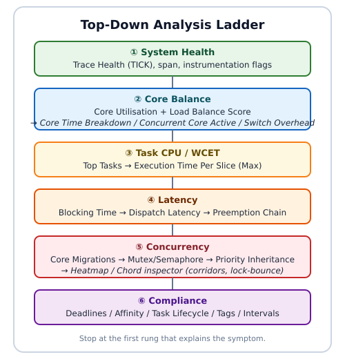

# BTF Viewer — Analysis Workflows

This is the procedure manual for diagnosing RTOS scheduler behaviour with BTF Viewer. It assumes you can already open a trace; for feature descriptions, metric definitions, and formulas, see the [user guide](README.md).

Every workflow here follows the same method. Start at the system level, let the **Analysis** findings point you at a metric, open the Statistics section that finding names, and confirm the evidence on the timeline before drawing a conclusion. The measured figures throughout come from `tracedata/example-8cores.btf.gz`, so you can reproduce each step yourself.

**Conventions used below.** Bold names such as **Core Utilisation** are labels you will find in the interface. Keyboard shortcuts are for the desktop viewer. Command lines run from the `BTFViewer/` directory. Desktop and web viewers offer the same analyses; where they differ, the step says so.

---

## Table of Contents

| Section | What it covers |
|---------|----------------|
| [1. Load a Trace](#1-load-a-trace) | Opening a file and getting oriented |
| [2. Top-Down Analysis Ladder](#2-top-down-analysis-ladder) | The inspection order to use on any new trace |
| [3. Worked Example — `example-8cores`](#3-worked-example--example-8cores) | A full walkthrough with measured numbers |
| [4. Deep-Dive Playbooks](#4-deep-dive-playbooks) | One short procedure per metric |
| [5. Scope, Compare, and Custom Signals](#5-scope-compare-and-custom-signals) | Cursor scoping, Trace Compare, tags and intervals |
| [6. Export Results](#6-export-results) | Findings, CSV/HTML, Perfetto, and the headless CLI |
| [7. AI Assistant Flow](#7-ai-assistant-flow) | Asking an AI model to triage the findings |
| [Quick-Reference](#quick-reference-metric-to-root-cause) | Symptom-to-metric lookup table |

---

## 1. Load a Trace

Open a trace from the command line, through **File → Open** (`Ctrl+O`), or by dragging the file onto the window. The viewer reads `.btf`, `.btf.gz`, `.bz2`, and `.zip`. The web viewer is the self-contained `builds/btf_viewer.html`; open it in a browser and load the file the same way.

```bash
python builds/btf_viewer.py [trace.btf]
```


*Timeline, CPU Load, and Statistics on first open.*

Spend the first minute confirming that the capture is sound and that you are looking at the whole trace. These four steps do that:

| Step | Action | Why |
|------|--------|-----|
| 1 | Read the span in the status bar, then press `Ctrl+0` (Fit to Window) | Confirms the capture covers the window you care about |
| 2 | Switch the toolbar to **Core** or **Task** view and enable **Load** | Orients you on per-core or per-task activity |
| 3 | Open the **Statistics** panel and the toolbar **Analysis** dialog | Gives summary metrics plus a severity-tagged triage |
| 4 | Read **Trace Health (TICK)** | Timer health decides how far you can trust every derived timing |

Migration analysis has its own walkthrough in [§3.5](#35-concurrency--migrations-locks-priority-inheritance) (including the [heatmap / chord inspector](#migration-heatmap--chord)) and its own playbook in [§4.5](#45-core-migrations).

---

## 2. Top-Down Analysis Ladder

Work down this hierarchy one rung at a time and stop as soon as the evidence explains the symptom. Each rung narrows the search: system health tells you whether the timebase is trustworthy, core balance tells you whether the load is spread, and only then is it worth attributing cost to individual tasks.



The Statistics panel is ordered to match this ladder. After the Summary it runs utilisation, trace health, core time breakdown, concurrency, switch overhead, top tasks, migrations, and so on down to tags. CSV and HTML exports use the same order, so an exported report reads in ladder order too. Toolbar **Heatmap** / **Chord** open the Migration & Corridor Inspector — a viewport-scoped companion to the **Core Migrations** tables, not a Statistics section.

**Working through it in the interface**

1. Open the toolbar **Analysis** dialog and read every finding, not just the first.
2. Open the Statistics section that the finding names.
3. Click a **Max** value, a scatter point, or a heatmap cell to jump the timeline to that moment. For migration findings, open toolbar **Heatmap** or **Chord** after the table.
4. Place cursors (`C`) around the phase you care about and enable the cursor-scope checkbox so the numbers describe only that window. Zoom the timeline first if you will use the inspector — its grid follows the **visible viewport**, not cursor-scoped Statistics.
5. Optionally click **Query with AI…** in the Analysis dialog (or open the **AI** tab) and have a model narrate the same findings ([§7](#7-ai-assistant-flow)).

**A caution about the demo traces.** `example-8cores.btf.gz` is a concatenation of deliberate stress tests, so it triggers warnings by design. Scope to a single phase before treating any warning as a product defect.

---

## 3. Worked Example — `example-8cores`

This section walks the ladder end to end on one trace and ends with a prioritised verdict. Every number below is reproducible: open `tracedata/example-8cores.btf.gz` and follow along.

### 3.0 Trace snapshot

| Field | Value |
|-------|-------|
| File | `tracedata/example-8cores.btf.gz` |
| Span | **2.358 s** (`#timeScale us`) |
| Cores / tasks / segments / STI | **8** / **154** / **31 141** / **33 495** |
| Context switches / migrations | **31 133** / **18 992** |
| Instrumentation | priority + sync + intervals |
| TICK | **WARNING / TICKLESS** — CV **35.9 %**, missed ≈ **8** |

Open the **Statistics** panel and the toolbar **Analysis** dialog, then work down the ladder.

---

### 3.1 System health (TICK)

**Statistics → Trace Health (TICK)**

| Metric | Measured |
|--------|----------|
| Mode | **TICKLESS** (CV 35.9 % ≫ 5 % threshold) |
| Avg period / max gap | 944 µs / 2.481 ms |
| Missed ticks (est.) | 8 |


*2496 TICK events; multi-tick gaps often fall in idle stretches between suite phases.*

The high coefficient of variation is expected here because tickless idle is active: the kernel deliberately suppresses ticks when no task is runnable. A large gap between ticks is therefore not by itself evidence of a lost interrupt during real work. Before chasing the eight estimated missed ticks, scope the analysis to a busy phase and re-read this section — if the mode still reports WARNING while every core is loaded, the finding is worth pursuing. The trade-offs between tickless and tickful builds are covered in [§5.2](#52-compare-two-builds).

---

### 3.2 Core balance

**Statistics → Core Utilisation**

| Metric | Measured |
|--------|----------|
| Core_0 … Core_7 (excl. IDLE/TICK) | 68.7 … **77.3 %** |
| Load Balance Score | **95 %** (Gini G = 0.049, σ = 6.0 %) |

A Load Balance Score of 85 % or more with σ at or below 30 % counts as reasonably balanced, so imbalance is not the primary problem on this sample. Do not stop here, though: good balance and expensive migration bouncing routinely coexist, because a scheduler can keep every core equally busy precisely by moving work between them.

Three sections refine the picture:

| Next section | What to look for |
|--------------|------------------|
| **Core Time Breakdown** | Elevated **Gap %** often tracks switch overhead |
| **Concurrent Core Active** | Time with *N* cores busy; click a row for the duration chart |
| **Kernel Switch Overhead** | Per-core switch gaps; click a row for the distribution |


*Interval dwell while exactly 4 cores run non-IDLE/non-TICK work.*


*Context-switch gaps on Core_0 (`t_resume,B − t_preempt,A`).*

---

### 3.3 Task CPU and WCET

With the cores accounted for, attribute the time to tasks. **Top Tasks by CPU** (excluding IDLE and TICK) is dominated by a set of equal-priority context-switch workers:

| Task | CPU % | Max slice | p95 |
|------|-------|-----------|-----|
| CS[28] | 15.9 % | **3.623 ms** | 1.631 ms |
| CS[11] / CS[24] | ~15 % | ~2.5–3.3 ms | ~1.6 ms |

`Med[267]` (around 6 %) and the mutex and semaphore workers (5–6 % each) round out the list.

To find the worst-case execution time, open **Execution Time Per Slice**, sort by **Max**, and click the **Max** value to zoom the timeline to that slice. The worst slices here run 3–4 ms, which is long relative to the 1 ms tick — a single slice can therefore span several tick periods and delay everything behind it.

Three responses are worth considering:

- Cap the concurrency of the equal-priority workers, or pin them with `vTaskCoreAffinitySet`.
- Set deadlines under **Settings → Display → Analysis thresholds** (values are in **nanoseconds**, so `CS[28]=2000000` means 2 ms) and then review the **Deadlines / CPU budget** section.
- For any unusually long **Max** slice, check **Preemption Chain** and **Mutex / Semaphore** to see whether the slice was stretched by interference rather than by its own work.

---

### 3.4 Latency

**Statistics → Blocking Time** (off-CPU gap until next resume)

| Task | Max block | Notes |
|------|-----------|-------|
| High[268] | **52.865 ms** | High waiter during inversion demo |
| Low[266] / Med[267] | ~35–40 ms | Expected around test 8 |
| CS[*] | ~5–6 ms | Peer contention + migration |
| Runner[1] | 737 ms | Orchestrator sleep — ignore |

Place cursors around the inversion window (the `Low`, `Med`, and `High` activity at roughly 3.085–3.310 s) and cross-check **Preemption Chain**, which names the preemptor for each victim, such as `CS[25]←CS[19]`.

Blocking time answers "how long was this task off-CPU". A different question — how long a task waited between becoming ready and actually running — is answered by **Dispatch / Scheduling Latency**, which samples from a task create or `vTaskResume` to the first switch-in. Wakes through synchronisation objects are not attributed to dispatch latency yet. Click any row for its distribution; **Min** and **Max** jump the timeline to the extremes.

![Dispatch latency for SR0[271] — example-8cores](../images/stats/stats-dispatch-sr0.svg)

*Lifecycle test task SR0: create/resume → next switch-in samples.*

---

### 3.5 Concurrency — migrations, locks, priority inheritance

#### Core migrations

| Task | Migrations | Rate | Avg dwell | Ping |
|------|------------|------|-----------|------|
| CS[18] | 586 | **1692 /s** | 476 µs | 24 |
| CS[21] / CS[12] | ~580 | ~1.6k/s | ~0.5 ms | ~20 |

Trace-wide: **18 992** migrations. Hottest pairs (`Core_5→Core_7`, …) are mostly **0 % lock-bounce**, which identifies this as scheduling thrash from test 1 rather than lock contention — an important distinction, because the two have different fixes.

Read the migration columns together rather than individually:

| Signal | Meaning |
|--------|---------|
| High **Ping** + high **Rate** / short **Dwell** | Rapid A↔B thrashing (Ping = A→B→A within 1 µs) |
| High **Migr**, low **Ping** | Spreads across cores without oscillation |
| Elevated **Bounce %** on a busy pair | Migration while a mutex/queue hold is active |

**Procedure.** Sort **Core Migrations** by **Ping** or **Rate**, click a row for its rate and dwell charts, then lock-highlight the task in **Task** view with **Load** enabled to see its share of each core. To chase lock-bounce specifically, open **Core-Pair Migration Summary**, sort by **Bounce %**, read the gap chart (orange marks a bounce), and confirm the object in **Mutex / Semaphore → Bounces**. The full playbook is [§4.5](#45-core-migrations).

![CS[22] highlighted in Task View with per-core CPU Load](../images/stats/tasks-cpu-load-cs22.svg)

*`CS[22]` locked in Task View; CPU Load shows that task’s share per core.*

##### Migration heatmap / chord

Tables name *which* task and *which* pair. Toolbar **Heatmap** and **Chord** open the same Migration & Corridor Inspector and show *when* those hops cluster on a time-bin grid (plus a mini-chord of directed corridors).

1. Zoom the timeline to the phase you care about first — the inspector follows the **visible viewport**, independent of Statistics **Limit to C1–Cn**.
2. Open toolbar **Heatmap** (grid-first) or **Chord** (topology expanded). On 2+ cores only; switching trace tabs closes it.
3. Read the corridor tree and time-bin grid. Hot cells are bursts. Expand a corridor for contributing tasks; hover a chord ribbon for `cN→cM: count`.
4. Optional filters: **Top corridors**, **Direction**, **Task filter** (name substring or exact numeric id), and **Lock Bounces Only** when chasing mutex/queue hops.
5. Click a hot cell, tree row, or ribbon, then **Inspect in Timeline** / double-click to spotlight that bin with C1–C2. Toolbar **All** / **Show all tasks** clears the filter.
6. From a **Core-Pair** chart dialog, **Open Heatmap** / **Open Chord** focuses that pair (prefers **Lock Bounces Only** when Bounce % is elevated).
7. Optionally click **Query with AI…** to run the **Migration thrash** template on the current Analysis Findings ([§7](#7-ai-assistant-flow)).


*`example-8cores.btf.gz`: corridor heatmap with chord topology (hottest pair drilled).*

#### Mutex / semaphore / queue

| Object | Holds | Bounces | Status |
|--------|-------|---------|--------|
| mutex `0x80021920` | 864 | 6 | Warning |
| queue `0x80021990` | 864 | **858** | OK status, extreme bounce |

The queue is the striking row: in 858 of its 864 holds, the holder migrated to another core while still holding the object. Co-locate tasks that share a hot mutex or queue so the object stays on one core. Investigate every **Warning** row on the timeline before acting on it — in demo traces, teardown often leaves an unpaired STI event that reads as a warning.

#### Priority inheritance

| Task | Base→Peak | Boosted time | Pattern |
|------|-----------|--------------|---------|
| Low[266] | 2→4 | **103.318 ms** | **Mutex inherit** |
| PS[228] | 2→4 | 119 µs | **L/M/H pattern** |


*Red bottom stripes on `Low[266]` during test 8 (`priority_inherit` → `priority_disinherit`).*

The boost on `Low[266]` shows kernel priority inheritance doing its job: the low-priority holder is lifted to priority 4 for as long as a higher-priority task waits on its mutex. An **L/M/H** row is different — it marks the classic three-task inversion pattern and deserves a design review rather than a tuning change. The window used for the screenshot above is `--lo 3042000 --hi 3359000` (in µs, this trace's time unit).

---

### 3.6 Compliance — affinity, suspend/resume, tags

The last rung checks that the system did what it was told to do:

- **Core Affinity** — every `Aff[*]` mask matches the cores the task actually ran on, and the `AffM[299]` remask behaved. **No violations.**
- **Task Lifecycle** — `SR0`…`SR3` show suspend and resume counts of **4/4**, and no task ran between its `suspend` and `resume`.
- **Tag Analysis → `tag0_event`** — 2357 samples (avg ≈ 34 631, p95 41 936). Tag channels are only as useful as the budgets you bind them to; once a channel maps to a real limit, Trace Compare turns it into a pass/fail signal between builds.


---

### 3.7 Performance verdict

Collecting the six rungs into one prioritised list gives the output an engineering team can act on:

| Priority | Finding | Product action |
|----------|---------|----------------|
| P0 | CS migration thrash (~1.6k/s, dwell ~0.5 ms) | Affinity-pin hot tasks; reduce equal-priority fan-out |
| P0 | Queue core bounces (**858**) | Co-locate producers/consumers; shorten holds |
| P1 | L/M/H on `PS[228]`; High Max block ~53 ms | Keep inheritance; audit critical sections; set deadlines |
| P1 | WCET CS Max ~3.6 ms vs 1 ms tick | Budget slices; verify under tickful config |
| P2 | TICKLESS CV 35.9 % | Scope busy windows before chasing missed ticks |
| OK | Load Balance 95 %; Affinity + SR 4/4 | Keep as CI checks (`report` HTML) |

Define success before you change anything, then capture a second trace and read the deltas in Trace Compare ([§5.2](#52-compare-two-builds)). A fix has worked when the CS migration rate and Ping count fall, queue bounces fall, the High task's maximum blocking time is stable or better, and the Load Balance Score stays at 85 % or above with σ at or below 30 %.

### Summary

| Ladder Rung / Step | Main Metrics & Findings | Measured Values / Observations | Key Takeaway & Action |
| --- | --- | --- | --- |
| **3.0 Trace Snapshot** | Overview of trace metadata, size, and system health baseline. | 8 cores, 154 tasks, 2.358 s span, 31 133 context switches, 18 992 migrations, TICK WARNING (tickless). | Establishes total trace scope and identifies tickless idle mode early. |
| **3.1 System Health** | Trace Health (TICK) | Mode: **TICKLESS** (CV 35.9 %); Avg period: 944 µs; Max gap: 2.481 ms; Missed ticks: ~8. | High CV is normal during tickless idle; scope to a busy phase before investigating missed ticks. |
| **3.2 Core Balance** | Core Utilisation, Load Balance Score, Core Time Breakdown, Concurrent Active Cores, Switch Overhead | Active utilization: 68.7 % – 77.3 %; **Load Balance Score: 95 %** (Gini G = 0.049, σ = 6.0 %). | System load is well balanced across cores, but migration thrashing can still coexist with good balance. |
| **3.3 Task CPU / WCET** | Top Tasks by CPU %, Execution Time Per Slice | `CS[28]` dominated at 15.9 % CPU (Max slice: 3.623 ms); `CS[11]`/`CS[24]` ~15 % each. | Longest slices (3–4 ms) exceed 1 ms tick. Pin equal-priority tasks or enforce CPU budget thresholds. |
| **3.4 Latency** | Blocking Time, Dispatch / Scheduling Latency, Preemption Chain | `High[268]` Max block: **52.865 ms** (during inversion demo); `CS[*]` block: ~5–6 ms. | Differentiates off-CPU blocking time from ready-to-run dispatch delay. |
| **3.5 Concurrency** | Core Migrations, Heatmap / Chord inspector, Mutex / Semaphore / Queue, Priority Inheritance | **18 992 total migrations** (`CS[18]` at 1692/s); hottest pairs mostly **0 %** lock-bounce (test-1 thrash); Queue `0x80021990` **858 core bounces**; `Low[266]` boosted 103.3 ms. | High thrash from equal-priority workers — confirm bursts on the heatmap; extreme lock bouncing on the shared queue needs task co-location (**Lock Bounces Only**). |
| **3.6 Compliance** | Core Affinity, Task Lifecycle, Tag Analysis | Affinity: **No violations**; Lifecycle: Suspend/Resume 4/4 counts; Tag: `tag0_event` 2357 samples. | System complied with core masks and state lifecycles correctly. |
| **3.7 Performance Verdict** | Prioritised Engineering Action Plan | **P0:** Thrash (~1.6k/s) & Queue bounces (858); **P1:** Inversion & WCET ~3.6 ms; **P2:** TICKLESS CV. | Focus on affinity-pinning, producer/consumer co-location, and slice budgeting. |

---

## 4. Deep-Dive Playbooks

Each playbook is a short procedure to run once **Analysis** or the ladder has pointed you at a metric. Examples use `example-8cores` unless stated otherwise, and the parenthesised CLI fragments reproduce the same chart headlessly ([§6](#6-export-results)).

### 4.1 Core utilisation and load balance

Establishes whether the work is spread across the cores and, if not, where it piles up.

1. **Core Utilisation** reports active CPU percentage per core, excluding IDLE and TICK. The badge turns amber when σ exceeds 30 %.
2. **Analysis** raises a finding when the Load Balance Score drops below 70 % or σ exceeds 30 %, and calls the trace reasonably balanced at a score of 85 % or more with σ at or below 30 %.
3. **Core Time Breakdown** attributes each core's time; a high **Gap %** points to **Kernel Switch Overhead**.
4. **Concurrent Core Active** shows how long exactly *N* cores were busy. Click a level for its dwell distribution (`snapshot … --metric concurrency --active-cores N`).
5. **Kernel Switch Overhead** shows the gap between one task leaving a core and the next arriving. Click a core for its distribution (`… --metric switch_overhead --core Core_N`).
6. **Top Tasks by CPU** names the tasks consuming the budget.

| Symptom | Where to look next |
|---------|--------------------|
| One core above 90 %, others idle | **Core Affinity** — the work may be pinned |
| Every core high except one | **Mutex / Semaphore** and **Preemption Chain** — serialisation |
| *N* cores rarely busy together | **Concurrent Core Active**; review affinity and worker count |
| High Gap % or switch Max | **Kernel Switch Overhead**; suspect ISRs or critical sections |

### 4.2 WCET (execution time per slice)

Finds the longest single run of a task and explains why it was that long.

1. Open **Execution Time Per Slice**, sort by **Max**, and click the **Max** value to zoom the timeline to that slice.
2. Inspect the neighbouring slices on the same core, and check **Preemption Chain** for that victim to see whether the slice was stretched by interference.

### 4.3 Blocking / scheduling delay

Separates two different waits that are easy to confuse.

1. Open **Blocking Time** and sort by **Max** or **p95**.
2. For a long gap, follow up in **Preemption Chain** and **Mutex / Semaphore**.
3. Scope away from orchestrator sleeps — a `Runner` task that sleeps between phases will otherwise dominate the table.
4. Open **Dispatch / Scheduling Latency** for the ready-to-run delay, measured from an STI `resume Name[id]` or a task create to the next switch-in (`… --metric dispatch --task …`). Wakes through synchronisation objects are not attributed yet.

Blocking time is the off-CPU gap until the next resume; it is not release-to-completion response time. Dispatch latency answers a narrower question: once the task was known to be ready, how long before it actually ran.

### 4.4 Priority inversion

Confirms whether inheritance is working and whether the inversion is a design problem.

1. Open **Priority Inheritance**. It needs `priority_inherit` and `priority_disinherit` STI events in the trace.
2. Classify the row: **Mutex inherit** is the kernel doing its job, **L/M/H** is the classic three-task inversion, and **Boost only** means a lift with no matching mutex evidence.
3. On the timeline the holder carries a red bottom stripe for the boosted interval; in the distribution chart, click a point to jump to it.

### 4.5 Core migrations

Distinguishes scheduler thrash from lock-driven bouncing, because the fixes differ.

1. Open **Core Migrations** and sort by **Rate**, **Dwell**, or **Ping**. A high rate with short dwell and a high ping count means thrashing. Click the row for **Dwell** / **Rate** / **Gap** charts.
2. Open **Core-Pair Migration Summary**. **Bounces** and **Bounce %** count hops taken while a lock was held. Click a row for Gap / Rate charts (orange = bounce).
3. Switch to **Task** view, lock-highlight the task, and enable **Load** to see its per-core CPU load (`snapshot … --view-mode task --task … --cpu-load`).
4. Open toolbar **Heatmap** (same inspector; use **Show topology** or pair-chart **Open Chord** for the chord-first layout). Zoom the timeline first — the grid follows the viewport, not cursor-scoped Statistics. Click a hot cell or expand a corridor; **Inspect in Timeline** spotlights that bin. Use **Lock Bounces Only** to isolate lock-bounce traffic; **Task filter** accepts a name substring or an exact numeric task id. From a pair-chart dialog, **Open Heatmap** / **Open Chord** focuses that corridor (`snapshot … --view heatmap` or `--view chord --drill-row 0`).
5. Confirm the object in **Mutex / Semaphore → Bounces**. Find **Migrations** (`F3`) jumps migration boundaries on the timeline.

Column definitions and inspector controls: [README → Core migration analysis](README.md#core-migration-analysis).

### 4.6 Tick health

Decides how much to trust every timing derived from the tick.

1. Read **Trace Health (TICK)** for the mode, coefficient of variation, largest gaps, and the missed-tick estimate.
2. Open **Tick Distribution…** for the scatter and histogram.
3. On a tickless system, re-evaluate inside a cursor-scoped busy window before concluding anything — idle stretches inflate the variation.

### 4.7 Mutex / semaphore correctness

Checks lock usage for pairing errors and cross-core ownership.

1. Open **Mutex / Semaphore** and read the **Issues**, **Bounces**, and **Status** columns.
2. For a **Warning** row, find the `take` and `give` STI events on the timeline and check for a delete-while-held.
3. A high core-bounce count means the object is shared across cores: pin the sharers or redesign the ownership.

### 4.8 Task suspend / resume

Verifies lifecycle correctness.

1. Open **Task Lifecycle**. Suspend and resume counts must match — the `SR*` tasks show 4/4 on this sample.
2. On the timeline, confirm the task does not run between its `suspend` and `resume`.

### 4.9 Deadlines and CPU budgets

Turns subjective "too slow" judgements into pass/fail checks.

Open **Settings** (`Ctrl+,`) → **Display → Analysis thresholds**, or use the link inside the **Deadlines / CPU budget** section, and set:

| Threshold | Example | Meaning |
|-----------|---------|---------|
| CPU budget % | `25` | Flag any task whose CPU share of the analysed window exceeds 25 % |
| Task deadlines | `CS[28]=2000000` | Values are in **nanoseconds**, so this is 2 ms |

Then expand **Deadlines / CPU budget**. Click a violating slice to jump to it and annotate it, and scope the check to a phase with cursors. Once thresholds are set, both violation tables are included in exports, which makes them usable as CI checks.

---

## 5. Scope, Compare, and Custom Signals

The ladder and the playbooks assume you are looking at the right slice of the right trace. This section covers the three tools that make that true: cursors to narrow a trace, Trace Compare to hold two traces against each other, and firmware-side tags and intervals when the built-in metrics do not measure what you need.

### 5.1 Cursor-scoped analysis

Most findings only make sense inside one phase of a trace. Place two cursors around that phase and every statistic recomputes for the window between them.

| Action | Effect |
|--------|--------|
| Left-click | Place a cursor, or remove the one you click on |
| `Shift`+click | Place a cursor snapped to the nearest segment boundary |
| `C` | Place a cursor at the pointer (falls back to the viewport centre) |
| `Ctrl+R` | Zoom the view to the cursor range |
| Cursor-scope checkbox | Recompute Statistics and Analysis for C1–Cn |
| **File → Save selection as BTF…** / web toolbar crop | Export only the raw events between the earliest and latest cursor |

The cursor-scope checkbox is labelled **Limit to C1–Cn** (desktop and web); it sits at the top of the Statistics panel.


Scoping is not a simple crop, because each metric has to decide what to do with an event that straddles a cursor. The rules are:

| Metric | Cursor rule |
|--------|-------------|
| CPU % | Overlapping time ÷ range width |
| Execution slices | Counted only when fully inside the range |
| Blocking | Counted when both surrounding slices are inside |
| Migrations | Counted when the event overlaps the range |
| Heatmap / Chord inspector | **Not** cursor-scoped — follows the visible timeline viewport |

### 5.2 Compare two builds

Comparing a before and an after trace is the only way to prove a fix worked rather than moved the problem.

1. Open both traces in tabs, then choose **Trace Compare…** in the Statistics footer.
2. Work through the comparison pages: Summary (load balance and tick), Top Tasks, Core Utilisation, Migrations, Execution, Blocking, Preemption, and Sync.
3. Each **Δ** column is A − B. Export the whole comparison as CSV or HTML from the dialog, or click **Query with AI…** to run the Trace Compare template on the current A / B pair.

The AI `trigger_compare` tool returns the same CSV and opens this dialog. The same comparison runs headlessly, which is what makes it usable in CI:

```bash
python builds/btf_viewer.py compare before.btf.gz after.btf.gz \
    --output compare.html --format html \
    --name-a "Before" --name-b "After"
```

In place of two paths, `compare` also accepts a single `.zip` holding exactly two `.btf` members, which keeps a matched pair together as one artefact.

#### Tickless vs tickful

Capture the **same workload** twice, once with tickless idle enabled and once with a fixed tick, and keep TICK STI enabled in both. Compare matching busy windows — either with cursors or with `--lo`/`--hi` — because idle stretches differ by construction between the two builds and would dominate any whole-trace comparison.

| Compare signal | Why it matters |
|----------------|----------------|
| Tick mode / health / count | Confirms TICKLESS vs TICK |
| Context switches | Scheduler activity cost |
| Core gap avg/max, Load Balance | Idle/busy structure |
| Migrations | Whether tick policy changes bouncing |
| Execution / Blocking Max, p95 | Latency under each policy |

The repository ships such a pair. This runs the comparison over one matched busy window:

```bash
python builds/btf_viewer.py compare ../tracedata/tickless-8cores.zip \
    --output tick-policy-compare.html --format html \
    --name-a "Tickful" --name-b "Tickless" \
    --lo 1464000 --hi 1764000
```

| Observation | Typical reading |
|-------------|-----------------|
| Tickless: fewer ticks, higher CV; tickful: CV ≪ 5 % | Configurations captured correctly |
| Context switches ↓ on tickless in idle-heavy windows | Expected — suppressed idle ticks |
| Context switches similar on a fully busy phase | Tick policy has little effect when cores never idle |
| Blocking / Execution Max worse on one side | Prefer that policy only if Δ fits latency budgets |

Use tickless when idle power matters and scoped busy-window metrics stay within budget. Prefer tickful when Trace Health must stay GOOD or soft real-time slices cannot tolerate tick stretching.

### 5.3 Tags and intervals

When the built-in metrics cannot express what you need to measure, instrument the firmware directly. Tags sample a value over time; intervals measure a named region:

```c
trace_tag_emit(0, (int)value);          /* tag0_event … tag7_event */
trace_interval_start(1); /* … */ trace_interval_stop(1);
```

Both appear as waveform rows at the bottom of the timeline and get their own summaries under **Tag Analysis** and **Interval Analysis**. When the BTF note carries `tid:{task_id}`, interval start and stop events pair per task, so overlapping regions from different tasks stay distinct.


---

## 6. Export Results

Findings and Statistics exports describe the current cursor scope, so scope first and export second:

| Output | How |
|--------|-----|
| Findings text | **Analysis → Save as Text…** |
| Statistics CSV/HTML | Statistics → Export (uses the default section order) |
| Perfetto JSON | **File → Export Perfetto…**, or the `perfetto` subcommand |
| Timeline PNG/SVG | Toolbar **Save PNG** (opens the snapshot editor) or **Save SVG** |
| Headless report | `report trace.btf --output out.html --format html` |

An exported HTML report is a reasonable CI artefact because **Analysis** applies fixed triggers: load imbalance (score below 70 % or σ above 30 %), WCET and blocking candidates, the L/M/H priority pattern, thrashing (high migration rate or ping count), hot lock-bounce pairs, a tick mode other than GOOD, and any sync object with a core bounce above zero.

The headless CLI exposes six subcommands — `info`, `report`, `compare`, `migrations`, `snapshot`, and `perfetto` — so the same analyses run in a build pipeline. The examples below run from `BTFViewer/`; `--lo` and `--hi` are always raw `#timeScale` units from the trace header (µs for this sample), never nanoseconds.

Start with a summary and a full report:

```bash
python builds/btf_viewer.py info ../tracedata/example-8cores.btf.gz
python builds/btf_viewer.py report ../tracedata/example-8cores.btf.gz \
    --output report.html --format html

# Same report, scoped to the priority-inversion window
python builds/btf_viewer.py report ../tracedata/example-8cores.btf.gz \
    --output pi.html --format html --lo 3042000 --hi 3359000

python builds/btf_viewer.py migrations ../tracedata/example-8cores.btf.gz -o mig.csv
python builds/btf_viewer.py perfetto ../tracedata/example-8cores.btf.gz -o trace.json
```

`snapshot` renders any single view to PNG or SVG. `--view timeline` captures the timeline itself; `--view heatmap` / `--view chord` capture the Migration & Corridor Inspector (`--drill-row` expands a corridor); `--view plot` captures one metric chart, chosen with `--metric` and narrowed with `--task`, `--core`, or `--active-cores`:

```bash
# Timeline window, core view, one task highlighted
python builds/btf_viewer.py snapshot ../tracedata/example-8cores.btf.gz \
    -o migrate.svg --view timeline --view-mode core --task "CS[22]" \
    --lo 1805000 --hi 1865000

# Migration & Corridor Inspector (heatmap grid, or chord topology)
python builds/btf_viewer.py snapshot ../tracedata/example-8cores.btf.gz \
    -o heatmap.svg --view heatmap --width 1000 --height 720 --drill-row 0
python builds/btf_viewer.py snapshot ../tracedata/example-8cores.btf.gz \
    -o chord.svg --view chord --width 1000 --height 720 --drill-row 0

# Metric charts: dispatch latency, switch overhead, concurrency dwell
python builds/btf_viewer.py snapshot ../tracedata/example-8cores.btf.gz \
    -o dispatch.svg --view plot --metric dispatch --task "SR0[271]"
python builds/btf_viewer.py snapshot ../tracedata/example-8cores.btf.gz \
    -o switch.svg --view plot --metric switch_overhead --core Core_0
python builds/btf_viewer.py snapshot ../tracedata/example-8cores.btf.gz \
    -o concurrency.svg --view plot --metric concurrency --active-cores 4
```

---

## 7. AI Assistant Flow

The right-panel **AI** tab turns the findings into a narrative triage. It is worth using once Analysis Findings exist, not before — the first turn only receives the **structured findings for the current Statistics scope**, plus the span and core count (not the raw BTF stream), so prompts stay compact. The model can then call `query_raw_metric` for a scoped per-task series (priority-inheritance episodes, execution slices, and so on), `search_timeline` for STI / tag / task timestamps, or `trigger_compare` when two traces are open. An empty or mis-scoped Statistics panel produces a confident answer about nothing. Setup details and troubleshooting live in [README.md → AI Assistant](README.md#ai-assistant). Ask in this order: triage overall findings → drill into the named metric (latency, WCET, inversion) → request mitigations after the timeline agrees (§7.2).

The flow from trace to verified answer:

```text
① Load trace + open Statistics
② (Optional) Place cursors → limit Statistics to the cursor range
③ Toolbar Analysis / Statistics findings for that scope
④ Analysis → Query with AI…  (or AI tab → template / free-form Ask)
⑤ Context = Analysis Findings (+ span, cores, scope), or Trace Compare CSV for that template
⑥ Endpoint: OpenAI-compatible /chat/completions (Ollama, OpenAI, Gemini, or Custom)
⑦ Reply (jump:TIME links → timeline; Markdown tables render as HTML tables; optional mermaid diagrams; optional GUI tool cards)
⑧ Apply / Skip tool cards or **Apply GUI actions** under the log, or enable **Settings → AI → Auto-apply GUI actions**; open the Statistics section the reply names; verify on the timeline
```

### 7.1 One-time setup

Configuration is per preset, and the desktop and web viewers work the same way apart from the browser's CORS rules, font units (desktop **pt** vs web **px**), and mermaid transport (desktop chat is a hit-tested image; web is inline SVG). Click a node to highlight, empty figure to zoom (scroll to zoom in the overlay); both have a link row; exported HTML keeps clickable SVG:

| Step | Desktop | Web |
|------|---------|-----|
| Choose preset | **Settings → AI → Preset**: Ollama, OpenAI, Google Gemini, or Custom | Same |
| Ollama | `ollama serve`; `ollama pull qwen2.5:7b` (or `llama3.1:8b`) for native tools; `phi4-mini:3.8b` is the light default. Base URL `http://localhost:11434/v1`; ≥8k context | Same; for `file://` use Vite, or allow CORS (`OLLAMA_ORIGINS="*" ollama serve`; macOS app: `launchctl setenv OLLAMA_ORIGINS "*"` + restart) |
| OpenAI / Gemini / Custom | Base URL + model + Authentication (API key or Sign in) | Same; OpenAI and Gemini are proxied under `npm run dev` / `preview` |
| Authentication | **None (local)** / **API key** / **Sign in** (opens vendor page; paste the key). Panel chip: Local / Key saved / Needs API key / Needs sign-in / Signed in. 401 keeps Sign in / Settings CTAs until a successful turn | Same (`VITE_*` env keys) |
| Self-signed TLS | **Allow self-signed TLS** per preset (desktop urllib skips certificate checks) | Same setting is stored; browsers still verify — trust the cert, use `http://`, or use Desktop |
| Verify | Refresh the **Model** list, open the Model dropdown to pick a served id, then **Test connection** (chat probe, 120s). `GET /models` succeeding does not mean chat is ready — first load can be slow. Gemini tool follow-ups need a thought signature — retry a 400 that mentions `thought_signature` | Same |
| GUI tools | **Auto-apply GUI actions** off (default) → Apply / Skip / Undo in chat, plus **Apply GUI actions** under the log. `query_raw_metric` / `search_timeline` / `trigger_compare` run immediately (read-only). `add_annotation` / `export_report` / `clear_marks` / `reset_view` follow Apply. **Ctrl/Cmd+Z** also undoes cursors/marks after Apply. Chat timeout 120s. Small models without native tools may emit ` ```btftool ` fences instead. | Same |
| Share a setup | **Import…** a JSON file (`examples/ai/ollama.json`, `gemini.json`, `openai.json`, `deepseek.json`, `grok.json`, `presets.json`) | Same |
| Show panel | **View → Show AI Assistant** / Display settings | Display → AI Assistant panel |

Each preset keeps its own base URL, model, API key, auth method, and TLS-verify flag — in `btf_viewer.rc` on the desktop and in browser storage on the web — so you can switch between a local and a cloud endpoint without retyping either configuration. **Sign in** opens the vendor key/login page in the browser; paste the issued key or token back into Settings (device-code OAuth is not wired yet). Keys may also come from the environment as `OPENAI_API_KEY`, `GEMINI_API_KEY`, or `OLLAMA_API_KEY` (`VITE_*` prefixed on the web). A local Ollama endpoint needs no key at all.

### 7.2 Recommended ask order

Ask in the same order as the [top-down ladder](#2-top-down-analysis-ladder), and prefer the built-in templates before free-form questions — a template sends a prompt that already names the metrics and the units.

| Order | Template / ask | Then verify in UI |
|------:|----------------|-------------------|
| 1 | **Analysis Findings** or **Triage findings** | Open each named Statistics section |
| — | **Trace Compare** (2+ tabs; pick if 3+) | Trace Compare pages / Statistics on both builds |
| 2 | **Tick health** | Trace Health (TICK); scope a busy window if TICKLESS |
| 3 | **Core balance** | Core Utilisation → Concurrent Active / Switch Overhead |
| 4 | **WCET / hot CPU** | Top Tasks → Execution Max; click Max to jump |
| 5 | **Highest latency** | Blocking → Dispatch → Preemption Chain |
| 6 | **Migration thrash** | Migrations Rate/Ping; Core-Pair Bounce %; Heatmap / Chord |
| 7 | **Priority inversion** | Priority Inheritance L/M/H |
| 8 | **Deadline / budget** | After thresholds are set in Settings → Display → Analysis thresholds |

**Reply language.** Use **Language…** on the AI bar, or **Settings → AI → Reply language**.

**Times in replies.** The model is instructed to cite times as `jump:1805120`, in the trace's `#timeScale` units. Clicking such a link seeks the timeline in both viewers; confirm what you find there against Statistics and cursors.

**Keeping a reply.** Right-click the reply area to copy the whole conversation or save it as Markdown, plain text, or HTML.

### 7.3 Scope the question

The assistant answers about whatever scope Statistics currently shows, so set the scope before you ask:

| Goal | Before you ask |
|------|----------------|
| Full-trace triage | Leave the cursor-scope checkbox off |
| One suite phase, such as the thrash window | Place two cursors, enable cursor scope, re-open Analysis if needed, then ask |
| Compare builds | Use the **Trace Compare** template (two tabs are picked automatically; with three or more you choose the pair), or open the Trace Compare dialog ([§5.2](#52-compare-two-builds)) |

Use **Clear** between unrelated questions so earlier context cannot colour the answer, and **Stop** if a request hangs while a local model loads for the first time.

### 7.4 When not to trust the reply

The assistant reasons only over the findings text it was given, which makes its failure modes predictable:

- **The findings are empty or the scope is wrong.** Fix Statistics and the cursors first; the model cannot tell that it received nothing useful.
- **The trace is a demo or a concatenation of stress tests.** Scope to one phase before acting on any advice.
- **Tick health is not GOOD, or the system is tickless.** Ask about tick health first, then re-check derived latency inside a busy window.
- **Any specific claim.** Open the Statistics section and the timeline evidence yourself. Treat the assistant as a triage aid, not as ground truth.

### 7.5 Multi-source recommendation

Different models fail differently, which makes disagreement between them useful. Switch backends in **Settings → AI → Preset**, or paste the findings into an external chat when the vendor is not OpenAI-compatible.

| Role | Source | Use when |
|------|--------|----------|
| **Default in-app** | Local Ollama (`phi4-mini:3.8b` for light triage; `qwen2.5:7b` / `llama3.1:8b` for native tools) | Fast, private triage; iterate templates + `jump:TIME` |
| **Stronger in-app** | OpenAI or Gemini preset, or a Custom endpoint (Grok, DeepSeek, a company gateway) | Better reasoning while keeping Ask + jump links |
| **Second opinion** | Switch preset and Ask the same template again | Where replies diverge — verify on the timeline |
| **External paste** | Any other chat (Claude, etc.) | Export HTML / copy findings when the vendor is not OpenAI-compatible |
| **Code / firmware angle** | Coding model + FreeRTOS sources | After BTFViewer names a task/ISR/lock; respect IP policy for cloud |

**A practical loop**

1. Scope the findings, then ask locally with Ollama using **Triage findings** or a ladder template.
2. Switch to OpenAI, Gemini, a Custom endpoint, or simply a larger Ollama model, and ask the same question again.
3. Verify the points the models agree on first; treat the points where they diverge as open questions rather than as answers.
4. Never accept a `jump:TIME` or a WCET claim until you have clicked it inside BTF Viewer.

**Privacy.** Prefer local Ollama for confidential traces. Use a cloud endpoint only if the findings text (and any `query_raw_metric` samples the model requests) are cleared to leave the machine: the viewer never sends the raw BTF stream, but findings and metric rows still name tasks, priorities, and timings.

---

## Quick-Reference: Metric to Root Cause

When you already know the symptom, start from this table instead of the ladder.

| Observed symptom | Start here | Then check |
|-----------------|------------|------------|
| Unknown — triage first | Toolbar **Analysis** | Named Statistics sections in each finding |
| Need a narrative triage | Right-panel **AI** ([§7](#7-ai-assistant-flow)) | Templates → open named sections; click `jump:TIME` |
| Tick jitter / tickless | Trace Health (TICK) | Scope busy window; Execution Max |
| Tickless vs tickful trade-off | Trace Compare (Tick mode, Context switches) | Execution / Blocking on the same busy phase |
| SMP uneven load | Core Utilisation (Score / σ) | Concurrent Core Active; Migrations, Affinity |
| Rarely *N* cores busy together | Concurrent Core Active | Affinity, Top Tasks, worker count |
| High scheduler / switch cost | Kernel Switch Overhead | Core Time Breakdown (Gap %) |
| Task too slow on CPU | Execution Time (Max / p95) | Preemption Chain, Mutex |
| Task waits too long | Blocking Time | Preemption Chain, Mutex |
| Ready→run delay (resume / create) | Dispatch / Scheduling Latency | Blocking, Preemption; needs STI resume Name[id] |
| Priority inversion | Priority Inheritance | Mutex pairing, Blocking |
| Core thrashing | Core Migrations (**Rate**, **Ping**, Dwell) | Task lock-highlight + Load; Heatmap / Chord; Core-Pair |
| Lock-bounce migrations | Core-Pair (**Bounces**, **Bounce %**) | Heatmap **Lock Bounces Only**; Mutex **Bounces** |
| Lock / queue issues | Mutex/Semaphore / Queue | Blocking, Migrations |
| Suspend/resume | Task Lifecycle (Susp/Res) | Timeline STI |
| Affinity wrong | Core Affinity | Lock-bounce table |
| Custom metric / region | Tag / Interval Analysis | Owning task Execution Time |
| Before/after change | Trace Compare | Same cursor phases on both tabs |
