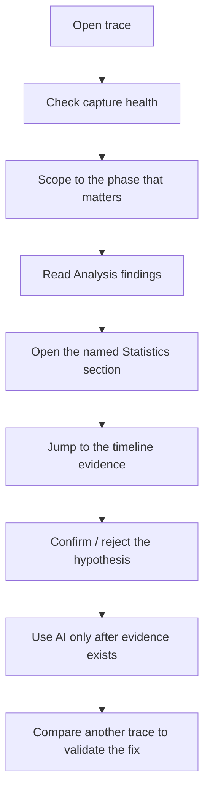
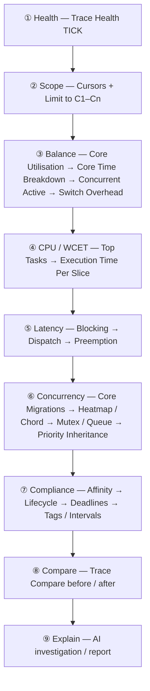
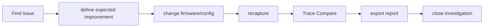

# BTF Viewer — Newbie Analysis Workflows

> **Goal:** give a new BTFViewer user a repeatable way to find most RTOS scheduling issues step by step.
>
> **Rule:** find deterministic evidence first, then ask AI to explain it.

This document is the procedure guide for diagnosing RTOS trace behavior with BTFViewer.

| Document | Use it for |
|---|---|
| [`README.md`](README.md) | Product overview, UI tour, quick start, demo, export, settings |
| [`WORKFLOWS.md`](WORKFLOWS.md) | Step-by-step diagnosis procedure — this document |
| [`STATISTICS.md`](STATISTICS.md) | Metric definitions, formulas, interpretation, chart behavior |
| [`AI.md`](AI.md) | AI Assistant architecture, model setup, tools, planner, validator, benchmark |

---

## 0. Mental model

BTFViewer is evidence-first:



The AI Assistant is useful, but it is not the first source of truth. It explains **Analysis Findings**, **Statistics**, and **Trace Compare** data. It does not replace the deterministic BTF measurements.

---

## 1. Fast path: 10-minute triage

Use this when you open an unknown trace.

| Step | What to do | Why |
|---:|---|---|
| 1 | Open the trace and press `Ctrl+0` / **Fit** | Confirm the whole capture is visible |
| 2 | Turn on **Load** and switch between **Task** / **Core** view | Understand overall activity |
| 3 | Open **Statistics** and toolbar **Analysis** | Overview (quality, incident clusters, phase window) plus severity-tagged findings |
| 4 | Read **Trace Health (TICK)** first | Bad or tickless timebase changes how timing should be interpreted |
| 5 | Open only the Statistics sections named by Analysis | Avoid chasing every table |
| 6 | Click **Max**, **p95**, a table row, chart point, or heatmap cell | Jump to the actual timeline evidence |
| 7 | Place C1–Cn cursors around the phase and enable **Limit to C1–Cn** | Remove unrelated phases from the numbers |
| 8 | Re-read Analysis and Statistics inside that scope | Confirm the issue is still present |
| 9 | Use **Start Investigation**, **Investigate…**, **Verify with AI…**, or **Explain region** (`Ctrl+K` opens Analysis / AI / workspace presets / Inspect task) | Ask AI to explain evidence, not invent it |
| 10 | Export HTML or run **Trace Compare** after a fix | Keep a record and validate improvement |

### Stop rule

Stop drilling when one of these is true:

- The measured evidence explains the symptom.
- The issue disappears after scoping to the relevant phase.
- The required instrumentation is missing.
- The next step is a firmware change and recapture.

---

## 2. The top-down ladder

Most trace problems can be handled by this order:



### Why this order works

| Ladder rung | Question answered |
|---|---|
| **Health** | Can I trust timing metrics in this capture? |
| **Scope** | Am I looking at the right phase? |
| **Balance** | Is work distributed across cores? |
| **CPU / WCET** | Which task runs too long on CPU? |
| **Latency** | Which task waits too long, and why? |
| **Concurrency** | Is SMP scheduling causing migration, lock-bounce, or priority issues? |
| **Compliance** | Did affinity, suspend/resume, deadlines, and custom signals behave as expected? |
| **Compare** | Did a change actually improve the measured behavior? |
| **Explain** | Can AI summarize and challenge the evidence? |

---

## 3. Step-by-step workflow

### Step 1 — Check trace health

**Open:** Statistics → **Trace Health (TICK)**

| Check | If you see this | Do this |
|---|---|---|
| TICK mode, low CV | Timing source looks stable | Continue |
| TICKLESS, high CV | Idle tick suppression may be expected | Scope to a busy window and re-check |
| Large gaps during busy work | Possible lost ticks, long critical section, or trace gap | Inspect the timeline and compare with Execution / Blocking |
| No useful TICK evidence | Timing interpretation is weaker | Prefer relative comparisons and explicit interval/tag instrumentation |

**Newbie rule:** do not treat a tickless warning as a bug until you scope to a busy region.

---

### Step 2 — Scope the phase

Mixed traces often contain setup, stress tests, sleeps, and teardown. Whole-trace numbers may hide the real issue.

| Action | Result |
|---|---|
| Click timeline / press `C` | Place cursors |
| `Ctrl+R` | Zoom to cursor range |
| Enable **Limit to C1–Cn** | Recompute Statistics and Analysis for that phase |
| Clear cursors | Return to full-trace statistics |

**Important:** the Migration **Heatmap / Chord** inspector follows the visible viewport, not the cursor-scope checkbox. Zoom the timeline before opening the inspector.

---

### Step 3 — Check core balance

**Open:** Statistics → **Core Utilisation**

| Signal | Meaning | Next |
|---|---|---|
| Load Balance Score ≥ 85% and σ ≤ 30% | Generally balanced (**Analysis** still shows Score/σ/G; “reasonably balanced”) | Continue to CPU / latency |
| Score < 70% | Imbalance likely | Check Affinity and Task × Core |
| σ > 30% | Utilization spread is high | Check Core Time Breakdown |
| One core hot, others idle | Work may be pinned | Check Core Affinity |
| All cores high, one underused | Serialization or lock contention | Check Mutex / Preemption |

Then open:

| Section | What it reveals |
|---|---|
| **Core Time Breakdown** | Active / Idle / Tick / Gap time per core |
| **Concurrent Core Active** | How often N cores are busy together |
| **Kernel Switch Overhead** | Gap between one slice ending and the next starting |
| **Task × Core** | Which task used which core |

---

### Step 4 — Find CPU / WCET problems

**Open:** Statistics → **Top Tasks by CPU**, then **Execution Time Per Slice**

| Check | Red flag | Next |
|---|---|---|
| Top CPU tasks | One task dominates CPU | Inspect task behavior and deadline |
| Equal-priority workers dominate | Scheduler stress or fan-out issue | Consider affinity or reducing concurrency |
| Execution **Max** much larger than p95 | Rare spike | Click Max and inspect the timeline |
| Execution Max exceeds budget | WCET concern | Set **Deadlines / CPU budget** thresholds |
| Long slice overlaps lock or preemptor activity | Interference | Open Mutex / Preemption |

**Do not rely only on Average.** Use Max, p95/p99, and the distribution chart.

---

### Step 5 — Diagnose latency

Latency questions usually split into three different metrics.

| Metric | Meaning | Start here when… |
|---|---|---|
| **Blocking Time** | Off-CPU gap until the task runs again | A task waits too long |
| **Dispatch / Scheduling Latency** | Ready/create/resume → first run | A ready task does not run soon enough |
| **Inter-Arrival / Period / Jitter** | Start-to-start cadence | A periodic task is late or irregular |
| **Response Time** | Heuristic adjacent-slice ready→completion | You need a rough tail signal, not kernel release/completion |

**Workflow**

1. Open **Blocking Time**, sort by **Max** or **p95**.
2. Ignore known orchestrator sleeps and setup/teardown phases.
3. Click the long gap and inspect the timeline.
4. Open **Preemption Chain** to see who ran while the task waited.
5. Open **Mutex / Semaphore / Queue** if the gap aligns with a hold.
6. Open **Dispatch / Scheduling Latency** only when the trace has create/resume STI evidence.

**Important:** BTFViewer Blocking Time is not true end-to-end response time. For true application response time, instrument release/completion with intervals or tags.

---

### Step 6 — Diagnose SMP concurrency issues

This catches many multi-core problems: thrash, lock-bounce, queue sharing, and priority inheritance.

#### 6.1 Core migrations

**Open:** Statistics → **Core Migrations**

| Signal | Meaning |
|---|---|
| High **Rate** | Task moves often relative to active time |
| Short **Dwell** | Task does not stay on one core long |
| High **Ping** | A→B→A bouncing |
| High **Gap after** | Migration may be followed by extra waiting |
| High **STI±** | Migration near software trace events |

**Procedure**

1. Sort by **Rate**, **Dwell**, or **Ping**.
2. Click the row and inspect **Dwell / Rate / Gap** charts.
3. Switch to **Task View**, lock-highlight the task, enable **Load**.
4. Check whether the task is bouncing between cores or simply spreading.

#### 6.2 Core-pair and heatmap

**Open:** Statistics → **Core-Pair Migration Summary**, then toolbar **Heatmap** / **Chord**

| Signal | Meaning |
|---|---|
| High pair count | Hot migration corridor |
| High **Bounce %** | Task migrated while holding a sync object |
| Hot heatmap cell | Burst of migrations in one time window |
| Hot chord ribbon | Heavy directed core-to-core movement |

Use **Lock Bounces Only** when chasing mutex/queue-related hops.

#### 6.3 Mutex / semaphore / queue

**Open:** Statistics → **Mutex / Semaphore** or **Queue**

| Signal | Meaning |
|---|---|
| Issues > 0 | Pairing problem, teardown, cross-task give, unmatched take/give |
| Bounces high | Object crossed core boundaries while held |
| Long hold | Contention risk |
| Warning / Error | Inspect the timeline before acting |

Typical fixes:

- Co-locate producer/consumer tasks.
- Pin tasks that share hot locks.
- Shorten critical sections.
- Reduce equal-priority runnable fan-out.

#### 6.4 Priority inheritance

**Open:** Statistics → **Priority Inheritance**

| Pattern | Reading |
|---|---|
| **Mutex inherit** | Kernel boost is working |
| **L/M/H pattern** | Classic priority inversion geometry; review design |
| **Boost only** | Manual priority change or incomplete evidence |

Click a boost episode or red timeline stripe to verify.

---

### Step 7 — Compliance checks

Use this rung to verify that configured behavior actually happened.

| Section | Check |
|---|---|
| **Core Affinity** | Observed cores should fit the active affinity mask |
| **Task Lifecycle** | Suspend/resume counts should match; task should not run while suspended |
| **Deadlines / CPU budget** | Violations should match your real budgets |
| **Tag Analysis** | Custom values should stay inside application limits |
| **Interval Analysis** | Instrumented regions should meet duration budgets |

Deadline values are configured in **nanoseconds** under Settings → Display → Analysis thresholds.

---

### Step 8 — Compare before / after

A fix is not validated until a second trace proves it.

**Open:** two traces → toolbar **Compare**

| Compare page | What to check |
|---|---|
| **Summary** | Span, context switches, migrations, load balance, tick health |
| **Core Util** | Per-core utilization delta |
| **Execution** | WCET / p95 / Max changes |
| **Blocking** | Wait-time changes |
| **Preemption** | Whether interference improved |
| **Sync / Mutex** | Holds, issues, bounces |
| **Response** | Heuristic P99 signal |
| **Trends** | All open tabs (3+): load balance, migrations, tick health |
| **Deadline misses** | Pass/fail thresholds |

**Comparison rule:** use equivalent workload phases. Place cursors in both traces and enable compare cursor scope when needed. **Save as baseline** on Trace A, then **Score vs baseline** after a recapture.

---

### Step 9 — Use AI after deterministic evidence

Use AI when:

- Analysis Findings exist.
- Statistics are scoped correctly.
- You have clicked at least one timeline event.
- You want a narrative, hypothesis ranking, or experiment plan.

| AI action | Best use |
|---|---|
| **Triage findings** / **Analysis Findings** | Summarize top issues |
| **Explain region** | Explain a cursor-scoped phase |
| **Investigate…** | Rank hypotheses and gather evidence |
| **Verify with AI…** | Confirm or reject a selected finding |
| **Root cause…** | Walk the top finding through related metrics |
| **Start Investigation** / **Auto investigate…** | Empty AI log (also after restart with no user/assistant turn) or full tool-driven drill-down |
| **What-if / Optimize** | Estimate possible experiments |
| **Diagnostic report** | Write a structured summary |

**Trust rule:** click every `jump:TIME` and verify it on the timeline. Treat What-if / Optimize as estimates, not measured results. After **Clear**, replies, usage cost, and current investigation issues are gone (no leftover **Current Issue** card). Restart does not restore **Current Issue** unless the log still has a user or assistant turn — **Start Investigation** stays available.

---

## 4. Symptom → metric map

| Symptom | Start here | Then check |
|---|---|---|
| Unknown problem | Toolbar **Analysis** | Statistics sections named by findings |
| Tick irregularity | Trace Health (TICK) | Scope busy window; Tick Distribution |
| Uneven SMP load | Core Utilisation | Task × Core, Affinity, Concurrent Active |
| Rarely N cores active | Concurrent Core Active | Worker count, affinity, locks |
| High switch cost | Kernel Switch Overhead | Core Time Breakdown Gap % |
| Task burns CPU | Top Tasks by CPU | Execution Time Max / p95 |
| Task slice too long | Execution Time Per Slice | Preemption, Mutex, Deadlines |
| Task waits too long | Blocking Time | Preemption Chain, Mutex |
| Ready task delayed | Dispatch / Scheduling Latency | create/resume STI evidence |
| Periodic task irregular | Period / Jitter | Inter-Arrival, Tick Health |
| Core thrashing | Core Migrations | Rate, Dwell, Ping, Heatmap |
| Lock-bounce | Core-Pair Bounce % | Heatmap Lock Bounces Only, Mutex Bounces |
| Priority inversion | Priority Inheritance | Mutex, Blocking, timeline stripes |
| Affinity wrong | Core Affinity | Task × Core, migrations |
| Suspend/resume issue | Task Lifecycle | Timeline STI |
| Custom latency | Interval / Tag Analysis | Instrumentation design |
| Regression after change | Trace Compare | Same scoped phase on both traces |
| Need explanation | AI Assistant | Verify timeline evidence first; use **Settings → AI → Context → Compact** on small local models |
| Context vs score / cost | `ai-test --compare-context` | Live suite runs Compact, Balanced, and Full; compare score, tokens, and latency in [AI_BENCHMARK.md](AI_BENCHMARK.md) — [AI.md → Benchmark](AI.md#context-mode-benchmarking) |

---

## 5. Newbie checklist

Before concluding:

```text
☐ Trace opened and full span checked
☐ Statistics + Analysis opened
☐ Trace Health checked first
☐ Relevant phase scoped with C1–Cn if needed
☐ Analysis finding mapped to a Statistics section
☐ Max / p95 / row / chart point clicked on timeline
☐ Core balance checked
☐ CPU / WCET checked
☐ Blocking / dispatch / preemption checked for latency issues
☐ Migrations / Heatmap / Mutex / Priority Inheritance checked for SMP issues
☐ Affinity / Lifecycle / Deadlines / Tags checked
☐ AI used only after deterministic evidence exists
☐ Any jump:TIME verified on timeline
☐ Before/after fix validated with Trace Compare or exported report
```

---

## 6. Worked example summary: `example-8cores`

The sample trace is intentionally noisy because it concatenates stress tests. Scope to one phase before treating a warning as a product defect.

| Ladder rung | Example observation | Reading |
|---|---|---|
| Health | TICKLESS, CV ~36.7%, missed ~10 | Expected in idle/tickless phases; scope busy window |
| Balance | Load Balance Score ~95%, σ ~6.3% | Generally balanced |
| CPU / WCET | CS workers around 15% CPU; Max slices ~3–4 ms | Equal-priority stress; inspect long slices |
| Latency | High task max block ~53 ms in inversion demo | Scope inversion phase; verify preemption/mutex |
| Migrations | ~19k migrations; hot CS tasks ~1.6k/s | Scheduler thrash |
| Lock-bounce | Hot queue with hundreds of bounces | Co-locate producers/consumers |
| Priority | Low task boosted by priority inheritance | Kernel inheritance working |
| Compliance | Affinity and lifecycle checks pass | Keep as CI checks |
| Verdict | Thrash + queue bounces are P0 | Pin/co-locate/reduce fan-out, then compare |

---

## 7. Export and CI loop

After you find an issue:

```bash
python builds/btf_viewer.py report ../tracedata/example-8cores.btf.gz \
    --output report.html --format html

python builds/btf_viewer.py compare before.btf.gz after.btf.gz \
    --output compare.html --format html \
    --name-a "Before" --name-b "After"
```

Recommended loop:



---

## 8. What to read next

| Need | Read |
|---|---|
| Basic UI, demo, settings, export | [`README.md`](README.md) |
| API keys | [`README.md#ai-api-keys`](README.md#ai-api-keys) |
| Metric definitions and formulas | [`STATISTICS.md`](STATISTICS.md) |
| AI setup, model choice, tools, validator | [`AI.md`](AI.md) |
| Repeatable practical diagnosis | This document |
| Guided walkthrough | [`README.md#demo`](README.md#demo) |
