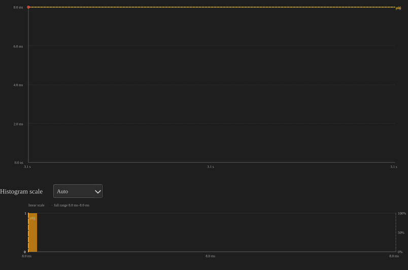
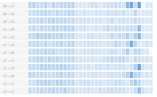
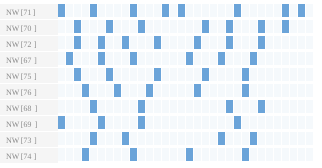

# BTF Viewer — Application Notes

Practical workflows for using BTFViewer to analyse RTOS scheduler behaviour and diagnose real-time performance issues.  Each section is self-contained — jump to the pattern that matches your problem.

---

## Table of Contents

| Workflow | When to use it |
|----------|----------------|
| [1. First look at a new trace](#1-first-look-at-a-new-trace) | Orient yourself after loading a trace for the first time |
| [2. Measure CPU utilisation and load balance](#2-measure-cpu-utilisation-and-load-balance) | Find overloaded / idle cores on SMP systems |
| [3. Find the worst-case execution time (WCET)](#3-find-the-worst-case-execution-time-wcet) | Identify the longest task slice and its context |
| [4. Diagnose high blocking / response time](#4-diagnose-high-blocking--response-time) | Understand why a task waits longer than expected |
| [5. Detect priority inversion](#5-detect-priority-inversion) | Spot mutex-induced priority inversion and L/M/H geometry |
| [6. Analyse core migrations on SMP](#6-analyse-core-migrations-on-smp) | Find ping-pong tasks and lock-boundary bounces |
| [7. Verify task deadlines and CPU budgets](#7-verify-task-deadlines-and-cpu-budgets) | Flag executions that breach real-time requirements |
| [8. Scope analysis to a time window](#8-scope-analysis-to-a-time-window) | Restrict every metric to a specific region of interest |
| [9. Compare two builds or configurations](#9-compare-two-builds-or-configurations) | Before/after diffing with Trace Compare |
| [10. Monitor custom signals and code regions](#10-monitor-custom-signals-and-code-regions) | Heap usage, periodic counters, interval timing |
| [11. Detect tick jitter and tickless modes](#11-detect-tick-jitter-and-tickless-modes) | Evaluate scheduler timer health |
| [12. Check mutex and semaphore correctness](#12-check-mutex-and-semaphore-correctness) | Find unpaired takes/gives and core-boundary bounces |
| [13. Export results for reports](#13-export-results-for-reports) | CSV/HTML export, PNG/SVG snapshots, headless CLI |

---

## 1. First Look at a New Trace

### Load and orient

```bash
python btf_viewer.py your-trace.btf
```

Or open via **File → Open** (`Ctrl+O`) / drag-and-drop.
Replace `your-trace.btf` with the path to your `.btf` trace file.


*BTF Viewer in **Core View** with the CPU Load graph enabled.  The right panel shows **Statistics** with Execution Time Per Slice table open; a distribution chart has been opened by clicking a task row.*

### What to check first

| Step | Action | What to look for |
|------|--------|------------------|
| 1 | Read the **status bar** | Task count, segment count, total trace span |
| 2 | Press `Ctrl+0` | Fit the entire trace on screen |
| 3 | Switch **Task View ↔ Core View** | Task View: one row per task; Core View: one row per core, expandable |
| 4 | Hover a segment | Tooltip shows duration, slice index, previous/next task on that core, and the gap before this slice |
| 5 | Open **Statistics panel** | Summary, core utilisation, and top tasks appear immediately without placing cursors |
| 6 | Check **Trace Health (TICK)** section | Verify tick regularity; a warning badge signals jitter or a missed-tick estimate |

### Tips

- **Core View** is usually better for a first look on SMP traces: you can see which cores are busy and which are idle without needing to identify individual tasks.
- Click any core label in Core View to expand/collapse that core's per-task sub-rows.  Use **⊞ Expand All** / **⊟ Collapse All** to toggle all at once.
- The **CPU Load Graph** (toolbar **Load** button) shows per-core utilisation as a bar chart below the timeline — enable it immediately on any multi-core trace.

---

## 2. Measure CPU Utilisation and Load Balance

### Goal

Determine how much CPU time each core and each task consumes, and detect load imbalance across cores on SMP systems.

### Procedure

1. Open the **Statistics** panel.
2. Expand **Core Utilisation** — one bar per core, showing active (non-IDLE, non-TICK) CPU%.
3. Read the **Load Balance Score** badge at the top of the section.
   - Score = 100 × (1 − Gini coefficient): **100** = perfect balance, **0** = one core does everything.
   - The badge turns **amber** when the population standard deviation σ > 30 %, signalling significant imbalance.
4. Expand **Top Tasks by CPU** to see which 10 tasks consume the most CPU time.

### Interpreting results

| Symptom | Likely cause | What to investigate next |
|---------|-------------|--------------------------|
| One core > 90 %, others idle | Tasks pinned to one core, or poor affinity configuration | **Core Affinity** table; verify observed execution cores against declared affinity masks |
| All cores high but one consistently low | A bottleneck serializes work (lock, queue) | **Mutex / Semaphore** and **Preemption Chain** tables |
| IDLE% unexpectedly high on all cores | Work is not being generated fast enough, or tickless idle is kicking in | **Trace Health (TICK)** section for tickless detection |
| One task dominates Top Tasks list | It may be consuming its budget; check against deadline/budget thresholds | **Deadlines / CPU budget** section (see §7) |

### Example — multi-core trace

```bash
python btf_viewer.py your-trace.btf
```

Open the **Statistics** panel → **Core Utilisation**.  Check that each core's active CPU% is within an expected range and the **Load Balance Score** badge shows σ < 30 % (green), indicating a well-balanced workload.  **Top Tasks by CPU** reveals which tasks dominate CPU consumption.

### Cursor-scoped utilisation

Place two cursors (`C`) around a region of interest and enable **Limit to cursor range (C1–Cn)**.  Core utilisation percentages are re-computed for that window only — useful for comparing a load spike against the baseline.

---

## 3. Find the Worst-Case Execution Time (WCET)

### Goal

Identify the single longest on-CPU slice for each task, navigate to it on the timeline, and understand what preceded it.

### Procedure

1. Open **Statistics → Execution Time Per Slice**.
2. Click the **Max** column header to sort descending.
3. The **Max** cell for each task row is a link (dotted underline) — click it to:
   - Scroll and zoom the timeline to that slice.
   - Place a bookmark annotation with the duration.
4. Open the **distribution chart** for that task (click its row) to see the full slice-duration spread:
   - **Scatter plot**: each point is one slice; x = start time, y = duration.  A single outlier far above the cluster is a WCET candidate for investigation.
   - **Histogram**: the **CDF overlay** (blue curve) shows what fraction of slices finish within a given duration — useful for checking whether the WCET is a rare tail event or part of a regular pattern.

### Reading the scatter plot for WCET context

- Click any scatter point → the viewer jumps to that exact slice and adds an annotation.
- Hover the segment on the timeline to read the **gap before this slice** (scheduling latency).
- Switch to **Core View**, expand the core, to see which other tasks ran on the same core immediately before and after.

### Tip — `p95` vs `Max`

If the **Max** slice is an isolated spike far above **p95**, suspect an external interrupt or OS overhead rather than a deterministic WCET.  A **p95** value that is already near your deadline budget is the more actionable number for design margins.

### Example — Execution Time distribution chart

```bash
python btf_viewer.py your-trace.btf
```

Open **Statistics → Execution Time Per Slice**, click any task row to open its distribution chart:


*The scatter plot (top) shows all slices over the trace span.  The histogram (bottom) automatically selects a **log-scaled duration axis** when the duration range spans more than an order of magnitude.  The blue **CDF** curve rises steeply on the left when most slices are short, then levels off as longer outliers are counted.  The **p50** (green) and **p95** (orange) dashed lines align with the corresponding percentile ticks on the right axis, making it easy to read off deadline-compliance percentages.*

---

## 4. Diagnose High Blocking / Response Time

### Goal

Find out why a task spends a long time off-CPU between consecutive activations (scheduled-to-run but waiting).

> **Note:** BTFViewer's **Blocking Time** is identical to Tracealyzer's **Response Time** — the off-CPU gap between the end of one task activation and the start of the next.

### Procedure

1. Open **Statistics → Blocking Time**.  Sort by **Max** or **p95** to identify tasks with long waits.
2. Click a task row to open its **blocking-time distribution chart**:
   - **Scatter**: x = when the task resumed, y = how long it waited.  Clusters at certain x positions often correspond to a specific preemptor or lock contention period.
3. Click the **Max** link to jump to the worst off-CPU gap.
4. While that region is visible on the timeline, open **Statistics → Preemption Chain Analysis**:
   - Find the victim task in the list to see which preemptors ran on the same core during its gaps.
   - Sort by **Count** or **Total** for the victim to identify the dominant preemptor.
5. If a single preemptor dominates, investigate whether it holds a mutex during that window — open **Mutex / Semaphore** pairing to correlate object pointers.

### Metric relationships


*For consecutive activations of `Worker_7[19]`: **Execution Time** = on-CPU slice duration; **Block Time** (Response Time) = off-CPU gap from the end of one slice to the start of the next; **Inter-Arrival Time** = gap between successive slice starts = Execution Time + Block Time.*

### Example — Blocking Time distribution chart

```bash
python btf_viewer.py your-trace.btf
```

Open **Statistics → Blocking Time**, click any task row:


*The scatter plot reveals clusters of high blocking at specific points in time — these align with periods when a higher-priority preemptor held the core for a long stretch.  Cross-reference with the **Preemption Chain** table (§4 step 4) to identify the offending task.*

### Example — Preemption Chain distribution chart


*Each point represents one preemption overlap event; the y-axis shows how long the preemptor held the core during the victim's off-CPU gap.  Click any scatter point to jump to the preemptor's segment on the timeline and add an annotation at that moment.*

### Decision table

| Blocking pattern | Root cause | Fix |
|-----------------|-----------|-----|
| Blocking time ≈ tick period | Task is runnable but waiting for the next scheduler tick (tickless or low priority) | Raise priority, or verify the tickless idle mode configuration |
| Large sporadic spikes correlated with one preemptor | Priority inversion or a high-priority CPU hog | Investigate **Priority Inheritance** and **Preemption Chain** tables |
| Blocking time ≈ mutex hold time | Lock contention; victim waits while holder runs a critical section | Reduce critical-section length; check **Core Bounce** column in Mutex/Semaphore |
| Blocking constant across time | Periodic blocking in design — expected for periodic tasks | Use inter-arrival time to verify period; compare to deadline |

---

## 5. Detect Priority Inversion

### Goal

Identify episodes where a low-priority task holds a resource that blocks a high-priority waiter while medium-priority tasks run unimpeded — the classic L/M/H priority inversion geometry.

### Prerequisites

Enable mutex support and task-priority tracing in your RTOS configuration.
The trace library must emit `priority_inherit` and `priority_disinherit` STI events when the kernel raises or restores a task's effective priority during mutex ownership transfers.

### Procedure

1. Open **Statistics → Priority Inheritance** (shown only when the trace contains priority STI events).
2. Look at the **Pattern** column:
   - **Mutex inherit**: kernel raised the holder's priority — expected, correct behaviour.
   - **L/M/H pattern** or **Mutex inherit + L/M/H**: inversion geometry detected — a medium-priority task ran while the high-priority waiter was blocked.
   - **Boost only**: manual priority-set call without kernel inheritance.
3. Click a task row to open its **boost distribution chart**:
   - Orange scatter points = boost only; red = L/M/H or mutex inherit.
   - Click a point to zoom to that episode on the timeline, highlight the task, and add an annotation.
4. On the timeline, look for the **red bottom stripe** on the task row — it marks the priority-boost window from `priority_inherit` to `priority_disinherit`.
5. Expand the core in **Core View** around the episode to see L (holder, boosted), M (medium preemptor), and H (blocked waiter) running simultaneously.

### Identifying the L/M/H actors

| Role | How to find it |
|------|---------------|
| **L (Low holder)** | Task with a **Mutex inherit** pattern and the lowest base priority in the episode |
| **M (Medium)** | Tasks whose base priority falls strictly between L's base and L's boosted peak — listed in the scatter-point tooltip |
| **H (High waiter)** | Task blocked on the same mutex object pointer — cross-check with **Mutex / Semaphore** pairing |

### Example — Priority Inversion in a multi-core trace

Open **Statistics → Priority Inheritance** on any trace that contains priority STI events.
The screenshots below illustrate a classic L/M/H scenario: the low-priority mutex holder (L) is boosted to the high-priority waiter's (H) priority level so the medium-priority task (M) cannot preempt it while it holds the mutex.

**Timeline — Core View expanded, zoomed to the boost window:**


*The **red bottom stripe** on the low-priority task's sub-row marks the `priority_inherit` → `priority_disinherit` window.  During this interval the kernel has raised the holder's effective priority, preventing any medium-priority task from preempting it.*

**Priority Inheritance distribution chart (Statistics → Priority Inheritance → click any task row):**



*Red points = mutex-inherit episodes; orange points = manual priority changes without kernel inheritance.  The **Pattern** column classifies each episode: **Mutex inherit**, **L/M/H pattern** (a medium-priority task ran while H waited), or **Boost only** (explicit priority change).*

---

## 6. Analyse Core Migrations on SMP

### Goal

Identify tasks that move between cores frequently, detect lock-induced core bounces, and use the migration heatmap to find when migrations cluster in time.

### Procedure

1. Open **Statistics → Core Migrations**.
   - **Rate** = migrations per second of active time (and per scheduler tick) — a high rate relative to the task's execution frequency suggests unnecessary migration.
   - **Dwell** = average on-CPU slice before migrating — short dwell + high rate = ping-pong.
   - **Ping-pong** count = migrations that immediately reverse direction (A→B followed by B→A) — a strong indicator of lock-bounce or affinity issues.
2. Open the **Migration Heatmap** (toolbar **Heatmap** button, visible on multi-core traces):
   - **Level 1**: directed core-pair rows × time bins.  Dark cells = many migrations in that period.  Migrations clustered in time indicate a periodic workload pattern or a contention event.
   - **Click a hot cell** → drill into **Level 2**: per-task sub-bins within that pair/time window.
   - **Click a task cell** → zoom the timeline, place cursors, switch to Task View, and filter to that task.
3. Enable **Migrated tasks only** in the Legend filter to hide single-core tasks and focus on migrators.
4. Check **Core-Pair Migration Summary** in Statistics:
   - **Lock-bounce %** = fraction of migrations where a task held a mutex while crossing core boundaries (`CORE_MIGRATION_WHILE_HELD` warning in Mutex/Semaphore).
   - High lock-bounce % on a specific core pair points to a mutex that is frequently taken on one core and released on another.

### Example — Migration Heatmap for a multi-core trace

```bash
python btf_viewer.py your-trace.btf
```

With the trace open, click the **Heatmap** toolbar button to open the migration heatmap.

**Level 1 — core-pair overview (directed pairs × 32 time bins):**



*Each row is a directed pair (e.g. `c0→c1`).  Darker cells = more migrations in that bin.  Click any dark cell to drill into Level 2.*

**Level 2 — per-task sub-bins (after clicking a hot cell):**



*Rows are tasks that migrated on the selected pair within the chosen bin; columns are 32 sub-bins inside that bin.  Click a task cell to zoom the timeline, place cursors, switch to Task View, and filter to that task.*

### Reducing migration overhead

| Symptom | Remedy |
|---------|--------|
| High ping-pong between two cores | Pin the task to specific cores using the RTOS core affinity API |
| High lock-bounce % | Release the mutex on the same core it was taken, or increase the mutex holder's priority to finish the critical section quickly |
| Migrations clustered in one time bin | A burst of work on one core is pushing tasks off; check if a high-priority task dominates that period (Preemption Chain) |

---

## 7. Verify Task Deadlines and CPU Budgets

### Goal

Automatically flag every task execution slice that exceeds a configured per-task deadline, and every task whose CPU% exceeds a global budget threshold.

### Configure thresholds

Open **Settings** (`Ctrl+,`) → **Analysis thresholds**:

| Threshold | Unit | Example |
|-----------|------|---------|
| **CPU budget %** | 0–100 % (0 = off) | `25` flags any task using more than 25 % CPU |
| **Task deadlines** | nanoseconds, one `Name=ns` per line | `Worker[0]=500000` flags slices > 500 µs |

Task names must match the **display name** shown in the label column (e.g. `Worker[0]`, `SensorTask[2]`).

### Reading violations

Open **Statistics → Deadlines / CPU budget**:

- **Slice over deadline** table — every slice that exceeded its per-task threshold, sorted by excess.  Click any row's **Max** link to jump to that slice on the timeline.
- **CPU budget exceeded** table — tasks whose CPU% in the current scope is above the global budget.

### Workflow tip — cursor-scoped deadline checking

Place cursors around a specific test phase and enable **Limit to cursor range**.  The violation tables update to show only slices and CPU% within that window, letting you verify deadline compliance phase by phase without noise from the rest of the trace.

---

## 8. Scope Analysis to a Time Window

### Goal

Restrict all statistics, charts, exports, and metric tables to a specific region of the trace — for example, a single test run, a load spike, or the period around a known anomaly.

### Placing cursors

| Action | Effect |
|--------|--------|
| Left-click on the timeline | Place a cursor (removes one if near an existing line) |
| `Shift` + left-click | Snap to the nearest segment boundary |
| `C` | Place a cursor at the viewport centre |
| Right-click → **Clear all cursors** | Remove all |
| `Ctrl+R` | Zoom the viewport to fit exactly between C1 and the last cursor |

### Example — three cursors placed on a trace

```bash
python btf_viewer.py your-trace.btf
```

Left-click three times on the timeline to place **C1**, **C2**, and **C3**:


*The Δ badges between consecutive cursors show elapsed time between C1–C2 and C2–C3.  Enable **Limit to cursor range (C1–Cn)** in the Statistics panel to restrict all metrics to the C1–C3 window.*

### Enabling cursor scope

In the **Statistics** panel, check **Limit to cursor range (C1–Cn)**.  All metric tables, core utilisation, top tasks, charts, and exports immediately re-compute for the C1–Cn window.

The **status bar** shows a quick min/max/avg summary of segment durations that start and end within the cursor range — useful for a fast sanity check before diving into the full statistics.

### Scoping rule summary

| Metric | Included in cursor range |
|--------|-------------------------|
| Core & task CPU% | Overlapping active time ÷ range width |
| Execution time per slice | Only slices **fully inside** the range |
| Blocking time | Pairs where **both** slices are fully inside the range |
| Inter-arrival | Activations whose **start** time falls inside the range |
| Preemption chain | Overlaps counted only when the victim's gap and the preemptor are inside the range |
| Core migrations | Events and per-core active time with any overlap in the range |

---

## 9. Compare Two Builds or Configurations

### Goal

Quantitatively diff CPU%, top tasks, core migrations, blocking, preemption, and sync between two trace files — for before/after comparison or A/B configuration testing.

### Procedure

1. Open both traces in separate tabs (**File → Open** twice, or drag-and-drop two files).
2. In the **Statistics** panel footer, click **Trace Compare…**.
3. Select **Trace A** and **Trace B** from the dropdowns.
4. Optionally enable **Limit to each tab's cursor range** to compare each trace's C1–Cn window independently (requires cursors placed in each tab before opening the dialog).
5. Browse the tabs: **Summary**, **Top Tasks**, **Core Migrations**, **Blocking**, **Preemption**, **Sync**.
6. Export with **Export CSV** or **Export HTML** for offline reporting.

### What the Δ column shows

The **Δ** column in each table is the raw difference B − A for numeric fields.  Positive Δ in CPU% means a task uses more CPU in build B; negative Δ in blocking time means the task waits less in build B — an improvement.

### Headless batch comparison

```bash
python btf_viewer.py compare a.btf b.btf \
  --output compare-report \
  --format html \
  --name-a "Before" --name-b "After"
```

Produces `compare-report.html` (and/or `.csv`) without opening the GUI — suitable for CI pipelines or automated regression reports.

---

## 10. Monitor Custom Signals and Code Regions

### Goal

Embed application-level measurements (heap usage, counters, code-region timing) into the trace without modifying the scheduler hooks.

### Tag events — periodic scalar values

Emit a 32-bit scalar value on any of 8 named STI channels (`tag0_event` … `tag7_event`) from any periodic callback or task.  Consult your RTOS trace library documentation for the exact API; a typical call looks like:

```c
/* In any periodic hook or task */
uint32_t value = my_get_metric();   /* heap used, stack high-water, custom counter, etc. */
trace_tag_emit(0, (int)value);      /* channel 0–7, 32-bit payload */
```

In BTFViewer:
- The **tag0_event** (through **tag7_event**) row appears in the label column as a waveform row.
- Expand the row to see the waveform.
- Open **Statistics → Tag Analysis** for per-channel min/avg/max/p95; click a row for a scatter + histogram chart.

**Example — heap usage waveform (sample trace):**

```bash
python btf_viewer.py your-trace.btf
```


*The `tag0_event` row (expanded) shows a user-defined scalar metric sampled periodically (e.g. heap bytes in use, stack high-water mark, or any 32-bit counter).  Drops indicate resource release; plateaus show steady-state consumption.*

**Example — Tag Analysis distribution chart:**

```bash
python btf_viewer.py example-8cores.btf
```

Open **Statistics → Tag Analysis**, click the `tag0_event` row:


*1966 samples on `tag0_event` (min 8,496, avg 37,587.5, max 45,504, p95 43,904). Unlike the other metric charts, the y-axis here is the raw application value, not a duration — clusters and outliers reflect whatever firmware puts in the channel (queue depth, ADC reading, free heap, etc.).*

### Interval events — bracketing code regions

Bracket any code region with matching `interval_start` / `interval_stop` STI events.  Consult your RTOS trace library documentation for the exact API; a typical pattern is:

```c
trace_interval_start(1);   /* start of timed region; id = 1 */
do_work();
trace_interval_stop(1);    /* end of timed region; id must match */
```

In BTFViewer:
- Paired spans appear as **Interval N** rows at the bottom of the timeline (horizontal task view).
- Hover a bar for duration; click to add an annotation.
- Open **Statistics → Interval Analysis** for min/avg/max/p95 per interval ID.
- Click any row → distribution chart; click a scatter point → jump to that interval start and annotate.

**Example — Interval Analysis distribution chart:**

```bash
python btf_viewer.py your-trace.btf
```

Open **Statistics → Interval Analysis**, click any interval row:


*Each point in the scatter represents one `interval_start` → `interval_stop` pair.  The histogram shows the duration distribution of all timed code regions in scope.  Click any scatter point to jump to that interval's start on the timeline.*

### Tip — per-task interval pairing

When the BTF note includes `tid:{task_id}` (supported by trace libraries that embed the calling task ID in interval events), start/stop events pair **per interval ID and per calling task**.  This lets you use the same `id` value in multiple tasks and get separate statistics for each.

---

## 11. Detect Tick Jitter and Tickless Modes

### Goal

Verify that the RTOS tick fires at the expected period and detect tickless-idle operation.

### Procedure

1. Open **Statistics → Trace Health (TICK)**.
2. The section shows:
   - **Tick period** (min/avg/max from consecutive TICK STI events).
   - **Mode badge** — **TICK** (regular) or **TICKLESS** (low-power tickless mode detected from a high coefficient of variation in tick intervals).
   - **Large gaps** count and estimated missed-tick count.
3. Click the **Tick Distribution…** button (bar-chart icon, visible when ≥ 2 ticks are in scope) to open a histogram of tick intervals.

### Example — Tick Distribution chart

```bash
python btf_viewer.py example-8cores.btf
```

Open **Statistics → Trace Health (TICK)**, click the **Tick Distribution…** button:


*1966 TICK events at a nominal 1.000 ms period (1000 Hz) — the coefficient of variation (≈ 24.7 %) exceeds the 5 % threshold, so the mode badge reads **TICKLESS**. The histogram's peaks at 1×, 2×, and 3× the nominal period show idle stretches skipping several ticks before the next one fires; the 4 largest gaps (up to 2.340 ms) are flagged as estimated missed ticks.*

### Interpreting results

| Symptom | Interpretation |
|---------|---------------|
| **TICKLESS** badge with large gaps | Tickless idle active — verify the tickless idle mode is intentionally enabled |
| Max tick period >> average | Missed ticks; the tick was delayed by a long critical section or ISR |
| High CoV (coefficient of variation) of tick intervals | Tick jitter — interrupt latency or scheduler interference |
| Missed-tick estimate > 0 | Some tick events were dropped before they could be recorded — increase the ring buffer event capacity |

### Cursor-scoped tick health

Place cursors around a suspect region and enable **Limit to cursor range** to restrict the tick analysis to that interval — helpful when tickless periods should be confined to specific application phases.

---

## 12. Check Mutex and Semaphore Correctness

### Goal

Detect unpaired takes/gives, orphaned mutex holds at trace end, cross-task gives, and lock-boundary core bounces.

### Prerequisites

Enable mutex and semaphore event tracing in your RTOS trace library configuration so that `take`, `give`, `create`, and `delete` STI events are emitted for each synchronization object.

### Procedure

1. Open **Statistics → Mutex / Semaphore pairing** (shown only when mutex/semaphore STI events are present).
2. The **main table** shows each sync object (identified by its unique object pointer) with:
   - **Hold count** — number of take/give cycles.
   - **Issue count** — number of pairing anomalies.
   - **Core bounce** — number of takes on one core with the corresponding give on a different core.
   - **Avg hold** — average time between take and give.
3. Expand **Pairing issues** sub-table to see individual anomalies:

   | Issue type | Meaning |
   |-----------|---------|
   | **Orphan give** | `give` with no matching `take` — double-release or give from wrong task |
   | **Cross-task give** | `give` by a different task than the `take` — valid for binary semaphores but a bug for mutexes |
   | **Unmatched take** | `take` with no matching `give` — mutex held at trace end or leaked lock |
   | **CORE_MIGRATION_WHILE_HELD** | Task crossed core boundary while holding the lock — source of race conditions on SMP without proper locking |

4. Click any **Pairing issues** row to zoom the timeline to that event, jump to the relevant segment, and add an annotation.

### Core bounce investigation

A high **Core bounce** count on a mutex indicates the lock holder frequently migrates while the mutex is taken.  Cross-reference with **Core-Pair Migration Summary** to find the specific pair and then zoom to that window in the timeline to see whether a scheduling policy or affinity change would help.

---

## 13. Export Results for Reports

### GUI exports

| Output | How to trigger | What is included |
|--------|---------------|-----------------|
| **Statistics CSV** | Statistics panel → **Export CSV** | All metric tables for the current cursor scope |
| **Statistics HTML** | Statistics panel → **Export HTML** | Same tables plus Priority Inheritance boost episodes, Mutex/Semaphore hold episodes, and Interval Analysis instances |
| **Trace Compare CSV/HTML** | Trace Compare dialog → **Export CSV / Export HTML** | Summary, Top Tasks, Core Migrations, Blocking, Preemption, Sync diff between two traces |
| **Timeline PNG** | Toolbar **Shot** → Snapshot Editor → **Save PNG** | Current timeline viewport with optional arrow/shape annotations |
| **Timeline SVG** | **File → Save as SVG** (`Ctrl+Shift+S`) | Vector SVG of current viewport |
| **Clipboard** | **File → Copy Image to Clipboard** (`Ctrl+Shift+C`) | Raw viewport image (no editor) |
| **Distribution chart PNG/SVG** | Plot dialog → **Export PNG** / **Export SVG** | Scatter + histogram for that metric |
| **Migration heatmap PNG/SVG** | Heatmap dialog → **Export PNG** / **Export SVG** | Current heatmap drill level |

### Headless CLI exports (Desktop only)

No GUI is opened; output is written directly to a file.

```bash
# Trace summary (human-readable)
python btf_viewer.py info trace.btf

# Trace summary (machine-readable JSON)
python btf_viewer.py info trace.btf --json

# Full statistics report — HTML
python btf_viewer.py report trace.btf --output report.html --format html

# Full statistics report — CSV
python btf_viewer.py report trace.btf --output report.csv --format csv

# Scoped to a time window (nanoseconds)
python btf_viewer.py report trace.btf --output report.html --lo 100000 --hi 500000

# Two-trace comparison — HTML
python btf_viewer.py compare before.btf after.btf \
    --output compare.html --format html \
    --name-a "Before" --name-b "After"

# Core migration table as CSV
python btf_viewer.py migrations trace.btf -o migrations.csv
```

### Automating reports in CI

Chain the headless commands in a Makefile or shell script to generate artefacts after every simulation run:

```bash
report.html: trace.btf
	python btf_viewer.py report $< --output $@ --format html

.PHONY: report
report: report.html
```

The headless commands exit with code 0 on success and non-zero on parse error — suitable for CI pass/fail gates.

---

## Quick-Reference: Metric to Root Cause

| Observed symptom | Primary metric | Secondary metrics to check |
|-----------------|---------------|---------------------------|
| Task misses its deadline | Execution Time Per Slice (WCET) | Preemption Chain, Blocking Time, Priority Inheritance |
| Task waits too long between runs | Blocking Time (Max / p95) | Preemption Chain, Mutex/Semaphore, Inter-Arrival |
| SMP cores unevenly loaded | Core Utilisation (Load Balance Score) | Core Migrations, Core Affinity, Preemption Chain |
| Lock-related slowdown | Mutex/Semaphore (Issue count, Core bounce) | Blocking Time, Preemption Chain, Core Migrations |
| Priority inversion suspected | Priority Inheritance (L/M/H pattern) | Mutex/Semaphore pairing, Blocking Time |
| Tasks migrating excessively | Core Migrations (Rate, Ping-pong) | Migration Heatmap, Core Affinity violations |
| Tick irregularity or missed ticks | Trace Health (TICK) | Execution Time Per Slice (long slices blocking the tick) |
| Memory or counter regression | Tag Analysis | Interval Analysis for the code path owning that tag |
| Code region too slow | Interval Analysis (WCET, p95) | Execution Time Per Slice for the owning task |
