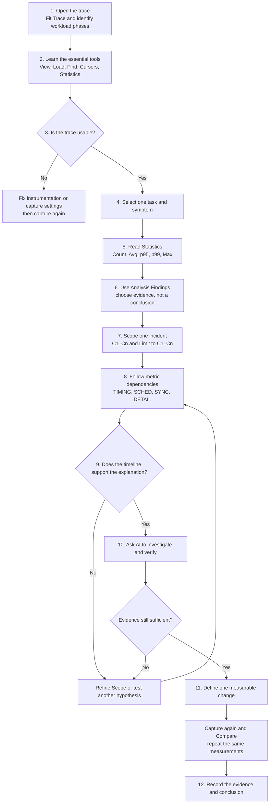
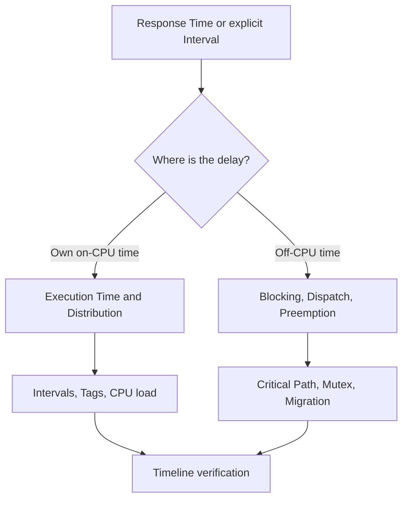
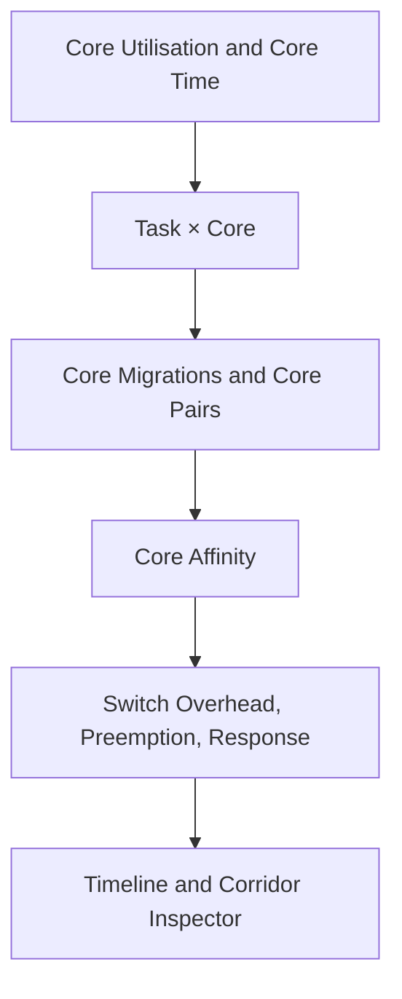
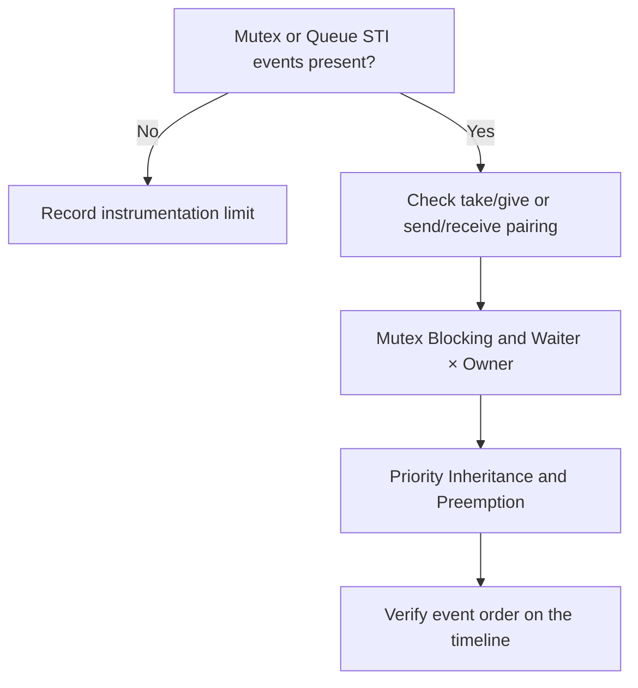
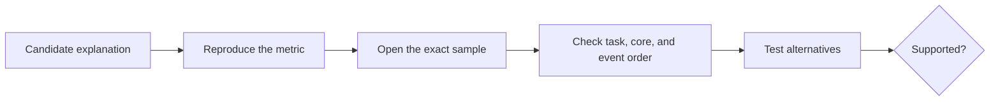
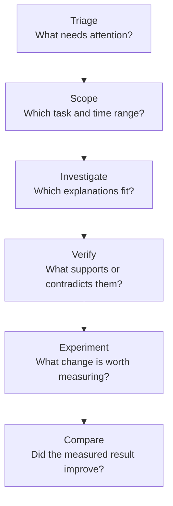

# BTFViewer Beginner Workflow

This guide takes a first-time user through one complete investigation: learn the viewer controls, locate one task, read its Statistics, verify one incident on the timeline, and then use the AI Assistant to investigate and challenge the explanation.

The order matters. BTFViewer Statistics and the timeline provide measured evidence. **Analysis Findings** identify where to look. The AI Assistant organizes evidence and tests explanations. **What-if** and **Optimize** provide estimates only.

## What you will learn

By the end of this workflow, you should be able to:

- distinguish Scope, Filter, Selection, and Highlight;
- use Task View, Core View, Load, Find, Cursors, Analysis, and Statistics;
- read Count, Avg, p95, p99, and Max without overinterpreting them;
- move from a Statistics value to the event that produced it;
- follow dependencies between timing, scheduling, and synchronization statistics;
- use AI after selecting evidence, not as the source of measurements; and
- validate a change with a new trace and equivalent measurements.

## Running example: one task is sometimes late

This guide uses a generic task named `ControlTask`. Replace it with the task that matters in your trace.

The reported symptom is:

> `ControlTask` usually behaves normally, but some activations finish later than expected.

The workflow does not assume the cause. Long response can come from longer own execution, preemption, an off-CPU wait, dispatch delay, synchronization, migration, or an incomplete trace. The purpose of the investigation is to distinguish these possibilities with evidence.

## Essential terms

| Term | Meaning in this workflow |
|---|---|
| **Full Trace** | The complete captured time span, with no cursor-defined analysis window |
| **Scope** | The time range used by Statistics, Analysis Findings, and AI: Full Trace or C1–Cn |
| **Filter** | A task, core, or migration subset inside the current Scope |
| **Selection** | The task or object kept active for inspection; it does not change calculations by itself |
| **Highlight** | Temporary visual emphasis; it does not change calculations |
| **Slice** | One continuous period when a task runs on one core |
| **Off-CPU** | Time when a task is not running; the trace may not show whether it was ready, blocked, suspended, or waiting for activation |
| **STI event** | Optional software instrumentation for ready/resume, mutex, queue, interval, tag, lifecycle, or priority events |
| **Finding** | A deterministic or heuristic lead produced by Analysis; it is not a confirmed root cause |
| **Hypothesis** | A possible explanation that still requires supporting evidence and alternative checks |

Selection and Highlight never silently become Filters. Always check the status bar and the Statistics **Filtered:** indicator before interpreting a value.

## Evidence levels

| Evidence level | Examples | How to use it |
|---|---|---|
| **Direct** | Recorded timestamp, task/core ID, slice boundary, STI tag | Strongest trace evidence |
| **Derived** | Execution duration, CPU share, migration count, inter-arrival | Deterministic calculation from recorded events |
| **Estimated / heuristic** | Response Time, mutex waiter–owner handoff, Critical Path, Task Health | Use to locate an episode, then confirm with stronger evidence |
| **Configured comparison** | Deadline or CPU-budget violation | Valid only when the configured threshold matches the real requirement |
| **AI interpretation** | Proposed cause, explanation, or recommendation | Verify against Statistics and the timeline |

Do not describe an estimated value as a directly recorded kernel event.

## Step 1 — Open and orient the trace

### Actions

1. Select **Open** and load the trace.
2. Select **Fit Trace** (`Ctrl+0` or `F`) so the complete capture is visible.
3. Start in **Task View**. Identify startup, steady-state, overload, idle, and shutdown phases.
4. Switch to **Core View** to see which task ran on each core.
5. Enable **Load** and resize the load chart if needed.
6. Hover over several timeline slices and read the task name, core, start/end time, and duration.
7. Confirm the status bar shows the expected active trace, **Scope: Full Trace**, Filters, and Zoom.

### What to look for

- Does the trace contain the reported workload phase?
- Is `ControlTask` present and active?
- Are all expected cores visible?
- Are there long empty regions, activity bursts, or an unexpectedly short capture?
- Does the load graph show a distinct phase where the symptom may occur?

### Continue when

You can identify the task of interest and the workload phase that should contain the problem. Do not choose a root cause yet.

## Step 2 — Learn the essential tools

You do not need every toolbar function for a first investigation. Learn these controls first:

| Tool | First-time use | What it changes |
|---|---|---|
| **Task View / Core View** | Follow one task or inspect per-core scheduling | Presentation only; Scope and Filters remain |
| **Load** | Show utilization over time | Adds the load chart; calculations do not change |
| **Fit Trace** | Return to the complete capture | Viewport only |
| **Fit Cursors** | Display the earliest–latest cursor span | Viewport only |
| **Find** (`Ctrl+F`) | Locate a task, migration, STI event, interval, lifecycle event, or object pointer | Moves between matches; Scope and Filters remain |
| **Cursor** | Mark an evidence time or define C1–Cn | Becomes Scope only when **Limit to C1–Cn** is enabled |
| **Statistics** | Calculate and display measurements | Uses the current Scope and active Filters |
| **Analysis** | Rank findings for the current Scope | Provides leads and navigation |
| **Migration & Corridor Inspector** | Inspect repeated core-to-core movement | Three columns: core path, heatmap, Topology. Click the heatmap for Path info. **Analysis Scope** defaults to Follow zoom (Fit = Full Trace, zoomed-in = Viewport). Lock Full Trace or Viewport, or choose Cursor C1–Cn |
| **Compare** | Compare Baseline and Candidate traces | Requires at least two open traces |
| **AI Assistant** | Explain, investigate, and verify supplied evidence | May request read-only or viewer-changing tools |

### Practice before analysis

1. Click the `ControlTask` label to make it the **Selection**.
2. Hover another task to see a temporary **Highlight**.
3. Open **Find**, search for `ControlTask`, and move through several matches with `F3` and `Shift+F3`.
4. Place one cursor and move it by dragging.
5. Clear the cursor with the context menu or `Shift+C`.
6. Switch Task/Core View and confirm that Scope and Selection are preserved.

### Continue when

You understand which actions only change the view and which actions change the analyzed data.

## Step 3 — Check trace quality and the full-trace overview

Open **Statistics** in the right-side panel. Start with the default categories in this order:

`OVERVIEW → TRIAGE → TIMING → SCHED → SYNC → DETAIL`

For the first quality check, use only these sections:

| Statistics section | Question to answer | Warning |
|---|---|---|
| **Core Utilisation** | Which cores were busy, idle, or unbalanced? | Average balance can hide a short overloaded phase |
| **Trace Health (TICK)** | Are TICK intervals, large gaps, and tickless behavior plausible? | Tickless idle can legitimately produce uneven intervals |
| **Task Health** | Which tasks deserve attention first? | The score is heuristic, not an AI probability |
| **Core Time Breakdown** | Does active, IDLE, TICK, and gap time account for the Scope? | Gap time is not automatically idle time |
| **Top Tasks by CPU** | Which tasks dominate on-CPU time? | CPU% uses wall-clock Scope duration and may total above 100% on multicore systems |

Check whether the trace contains the STI data needed for the question. For example:

- dispatch latency needs a recorded ready/resume or create event;
- mutex, semaphore, and queue analysis needs corresponding STI events;
- explicit end-to-end operation time needs an Interval or other defined boundary;
- deadline results need a correct configured threshold.

If a required event is missing, record the limitation. Do not replace missing evidence with a precise explanation.

### Continue when

The relevant workload phase is present, task/core data is plausible, and the trace has enough instrumentation for the intended analysis. Otherwise, fix the capture and record again.

## Step 4 — Locate one task and one symptom

Keep the first investigation narrow. For the running example, the subject is `ControlTask`, and the symptom is occasional late completion.

### Actions

1. Use **Find** or the Legend to locate `ControlTask`.
2. Select it so its timeline row remains easy to follow.
3. In **Statistics**, open **Response Time**, **Execution Time Per Slice**, **Blocking Time**, and **Period / Jitter**.
4. Do not apply a task Filter yet unless unrelated tasks make the data unreadable. Other tasks may explain preemption or synchronization delay.
5. Record the current Scope and any active Filters.

### Translate the symptom into a measurement question

| User report | First measurement question |
|---|---|
| “The task finishes late” | Is Response Time high, or is there an explicit Interval for the complete job? |
| “The task runs too long” | Is Execution Time per slice high? |
| “The task starts late after becoming ready” | Is Dispatch Latency high, and is a ready event available? |
| “The task wakes irregularly” | Are Period / Jitter and Inter-Arrival unstable? |
| “The task waits for a lock” | Do mutex STI events and Mutex Blocking support that statement? |
| “The task moves too much” | Are Migration Rate, Dwell, Ping, and core-pair paths unusual for this workload? |

Use the user report to select the first statistic, not to declare the cause.

### Continue when

You can state one measurable question, such as: “Which `ControlTask` samples have the longest response, and is the delay mainly own execution or off-CPU time?”

## Step 5 — Read the Statistics correctly

### Start with sample count

Always read **Count** or **Runs** before a percentile. A p99 calculated from ten samples is effectively the maximum and does not describe a stable one-percent tail.

| Value | Beginner interpretation | Use |
|---|---|---|
| **Count / Runs** | Number of valid samples | Decide whether the result has enough evidence |
| **Avg** | Arithmetic mean | Describe the center, but not the tail |
| **Median / p50** | Middle ordered sample | Describe a typical sample with less outlier sensitivity |
| **p95** | 95% of samples are at or below this value | Identify recurring slow-tail behavior |
| **p99 / p99.9** | 99% / 99.9% are at or below this value | Inspect rarer tail delays when the sample count is sufficient |
| **Max** | Largest value observed in this capture and Scope | Jump to the worst observed event; not proven WCET |
| **Jitter / Spread** | `Max − Min` | Show the observed timing range |
| **CV** | Standard deviation divided by Avg | Compare relative variation across metrics with different scales |

### Read the shape, not only one number

For `ControlTask`:

1. Compare Avg, p95, p99, and Max.
2. Open the distribution or **Distribution Explorer**.
3. Use Scatter to see when spikes occur.
4. Use Histogram to see common value ranges.
5. Use CDF to see what percentage of samples are at or below a value.

Interpret common patterns cautiously:

| Pattern | Possible meaning | Next check |
|---|---|---|
| Avg normal, Max much higher | One rare episode or small outlier group | Jump to Max and inspect its timeline window |
| p95 and p99 both high | Repeated tail delay | Check Recurring Patterns and several evidence times |
| Execution high with little off-CPU time | More own CPU work or long uninterrupted slices | Distribution, Intervals, Tags, preemption context |
| Response high but Execution normal | Delay is likely outside own on-CPU slices | Blocking, Dispatch, Preemption, Mutex, Migration |
| High CV | Behavior varies relative to its average | Scatter plot and workload-phase split |

### Continue when

You have selected one measured sample or recurring pattern that deserves timeline inspection.

## Trace quality banner

When capture metadata reports overflow, truncation, or missing instrumentation, a **trace-quality banner** appears with **Review details**, **Continue with limitations**, and **Open capture guidance** (WORKFLOWS). Grouped details list affected Statistics and AI conclusions.

## Guided first review

The guided demo (toolbar or Help) walks a sample trace end-to-end.

## Step 6 — Use Analysis Findings for triage

Select **Analysis**. Findings are calculated for the current Scope and stay open while the timeline remains interactive.

For each relevant finding:

1. Read its severity, title, measured value, and **Evidence** line.
2. Treat severity as attention priority, not failure probability.
3. Select **Show on timeline** to center the timeline on the cited event without changing Scope or Filters.
4. Select **Investigate** to open the supporting Statistics section and apply a recommended cursor range when offered.
5. Confirm that the Statistics value, task name, and timestamp match the finding.
6. Mark **Done** when reviewed, **Dismiss…** with a short reason when not applicable, or **Add to case** to pin the finding on the AI Case.

If no relevant finding exists, continue from the measured Statistics sample. A missing finding does not mean the task has no problem; the symptom may not match a built-in heuristic.

### Good first triage sections

| Section | Use it for |
|---|---|
| **Timeline Anomalies** | Ranked unusual tails, bursts, gaps, migrations, and deadline events |
| **Worst Events** | Longest observed execution, blocking, inter-arrival, and response episodes |
| **Recurring Patterns** | Repeated anomaly types for the same task |
| **Task Health** | A broad heuristic screening score and links to component sections |

### Continue when

You have one task, one metric, and at least one evidence timestamp or interval.

## Step 7 — Scope one incident with Cursors

Full-trace Statistics can mix startup, steady-state, overload, recovery, and shutdown. Use Cursors to turn one event into a testable incident.

### Actions

1. Jump to Max, p95, p99, an anomaly, worst event, chart point, or finding evidence.
2. Place **C1** before the activity that may have triggered the delay.
3. Place **C2** after `ControlTask` completes or recovers. Additional cursors may mark intermediate evidence.
4. Select **Fit Cursors** (`Ctrl+R`) to display the earliest–latest cursor span.
5. Enable **Limit to C1–Cn** in Statistics, from the toolbar **C1–Cn** chip, or from the banner: **Use C1–Cn as analysis Scope** → **Enable Limit to C1–Cn**. The chip uses the Scope colour when Limit is on.
6. Confirm the status bar and Statistics header show **Scope: C1–Cn · duration**.
7. Recheck the **Filtered:** indicator. Clear unintended task, core, or migration Filters.
8. Reopen **Analysis** so findings use the same Scope.
9. Add a Bookmark or Annotation at the strongest evidence time.

### Choosing a useful window

- Start early enough to include the possible trigger, previous task slice, ready event, mutex acquisition, or migration.
- End late enough to include completion, release, or recovery.
- Avoid a window so wide that unrelated phases dominate the measurements.
- Avoid a window so narrow that the cause lies outside it.

Navigation, Scope, and Filter are different. **Show Evidence**, Find, and Fit change where you look. **Limit to C1–Cn** changes which samples are calculated.

### Continue when

The unusual value still appears inside the cursor Scope and you can see the surrounding task/core activity.

## Step 8 — Follow statistic dependencies

Do not open every table. Start with the symptom and follow the smallest dependency path that can confirm or reject a cause.

### Path A — task latency

| Primary statistic | What it measures | Confirm with | Important limit |
|---|---|---|---|
| **Response Time** | Heuristic previous-slice-end to current-slice-end window | Execution, Blocking, Dispatch, Interval | Not an explicit release-to-completion pair |
| **Execution Time** | One continuous on-CPU slice | Distribution, Interval, Tags, Preemption | A task job may contain several slices |
| **Blocking Time** | Off-CPU gap between consecutive slices | Preemption, Mutex Blocking, Period | Off-CPU does not prove mutex blocking |
| **Dispatch Latency** | Recorded ready/create event to next switch-in | Timeline, Preemption, Core Time | Requires suitable STI ready evidence |
| **Critical Path** | Heuristic ready-to-completion window with overlapping evidence | Execution, Blocking, Preemption, Migration | Components can overlap; they are not a stacked duration split |
| **Interval Analysis** | Explicit instrumented start-to-stop duration | Timeline, Execution, Tags | Correctness depends on application instrumentation |

For `ControlTask`, first decide whether the late response contains unusually long own execution or mostly off-CPU time. That decision determines the next path.

### Path B — scheduling and multicore placement

Check load balance before calling migration a problem. An SMP scheduler may move an unpinned task to use an idle core.

| Question | Statistics |
|---|---|
| Is imbalance persistent or phase-specific? | Core Utilisation, Core Utilization Over Time |
| Which task contributes to each core? | Task × Core |
| How often and how quickly does the task move? | Core Migrations: Count, Rate, Dwell, Ping |
| Which directed path dominates? | Core-Pair Migration Summary |
| Was the placement allowed? | Core Affinity |
| Did the move coincide with delay or scheduling cost? | Response, Execution, Switch Overhead, Preemption |

Migration count alone does not measure cache misses, coprocessor-save cost, or scheduler overhead. Use processor-specific evidence when making those claims.

### Path C — synchronization and waiting

Use **Mutex / Semaphore** or **Queue** to check event-pair quality before trusting derived waits. **Waiter × Owner** and **Mutex Blocking** use heuristic handoffs; they do not reconstruct the RTOS wait queue. Confirm the object pointer, owner, waiter, take/give order, and priority activity on the timeline.

### Path D — periodicity and jitter

| Start with | Check next | Question |
|---|---|---|
| **Period / Jitter** | Inter-Arrival Time | Are activations missed, extra, or bursty? |
| **Inter-Arrival Time** | Unified Jitter | Is variation in activation spacing recurring? |
| **Unified Jitter** | Execution, Blocking, Response, Dispatch | Which component contributes most variation? |
| **Core Utilization Over Time** | Preemption, Mutex, Migration | Does a load burst coincide with the timing change? |
| **Deadlines / CPU Budget** | Execution, Period, Critical Path | Does the measured behavior violate a real configured requirement? |

### Continue when

The leading explanation is supported by a primary statistic and at least one dependent statistic, or the evidence shows that another path is more plausible.

## Step 9 — Verify the event on the timeline

Statistics summarize samples. The timeline shows event order. A useful conclusion needs both.

Ask these questions:

1. Does the value reproduce inside the current C1–Cn Scope?
2. Does clicking the value open the expected task, core, and time?
3. What ran immediately before, during, and after the delay?
4. Is `ControlTask` running, ready, preempted, blocked, suspended, or waiting for its next activation? Does the trace contain enough events to tell?
5. Do mutex, queue, priority, migration, or ready events support the proposed mechanism?
6. Is the relationship causal, correlated, or only close in time?
7. What evidence would disprove the explanation?
8. Can a simpler explanation fit the same evidence?

### Confidence labels

| Label | Minimum evidence |
|---|---|
| **Supported** | Metric reproduces, exact timeline evidence matches, and reasonable alternatives were checked |
| **Plausible** | Some evidence matches, but an important event or relationship is missing |
| **Inconclusive** | The trace cannot distinguish the main alternatives |
| **Unsupported** | The scoped metric or timeline contradicts the explanation |

Use **Confirmed** only when the application requirement and instrumentation define the relevant boundaries, and repeated equivalent measurements support the same conclusion.

### Continue when

You can write one evidence-based statement without using the AI, for example: “The longest observed `ControlTask` response in this Scope contains a normal execution slice but a long off-CPU interval that overlaps specific preemption activity.”

## Step 10 — Use the AI Assistant

AI is optional. Use it after selecting a finding, task, event, distribution, or C1–Cn range. It receives structured Findings and tool results, not the complete raw `.btf` event stream.

### One-time setup

1. Open **Settings → AI**.
2. Select a provider preset, endpoint, model, and authentication method.
3. Use **Test connection**.
4. Start with **Balanced** Context. Use Compact for a smaller context window or Full evidence when the investigation needs more findings and history.
5. Review privacy settings before using a cloud endpoint. Local Ollama normally needs no API key.

### Choose the entry point that matches the evidence

| Evidence already selected | AI entry point | Context sent |
|---|---|---|
| No clear starting issue | **Start Investigation** or **Triage findings** | Current Scope, Filters, and available findings |
| One Analysis Finding | **Investigate**, **Explain**, **Verify**, or **Auto investigate** | Selected finding and its evidence |
| C1–Cn incident | **Explain this region with AI** or **Explain region** | Cursor range and scoped findings |
| One timeline segment | **Ask AI about this event** | Selected task, core, segment, and nearby evidence |
| Open distribution | **Query with AI…** | Selected metric, task, and displayed samples |
| Migration & Corridor Inspector | **Investigate with AI** | Analysis scope, selected path, ping-pong/dwell, handoff heuristic, load balance, Inspector filters |
| Two comparable traces | Trace Compare **Query with AI…** | Selected comparison tables |

### Follow the six AI stages

For the running example:

1. Ask **Investigate** to explain the scoped `ControlTask` incident.
2. Open every cited Statistics section and `jump:TIME` / `range:LO/HI` link.
3. Check that every cited time lies inside C1–Cn.
4. Use **Verify finding** to request supporting evidence, contradictory evidence, alternatives, and missing information.
5. Reject any statement that cannot be reproduced in Statistics or assumes an unrecorded event.
6. In **Evidence & Validation**, click **[Run]** on **▶ Next check** to continue in the same Investigation Case, Context, and Scope. Extra host follow-ups are under **More next steps…**.
7. If the reply includes a dedicated `nextstep:{action}` line (`nextstep:` in English; the action in the reply language), that line also has **[Run]** and sends that sentence. A heading such as **Next check:** without that tag is not a button.
8. Confirm the follow-up on the timeline and named Statistics pages before treating it as done.

### Understand AI tool actions

| Tool behavior | What happens |
|---|---|
| Evidence query | Runs immediately and returns measured or derived data |
| Investigation-state or export tool | Runs immediately; may update hypotheses, memory, experiment records, or save a report |
| Viewer-changing tool | Waits for **Apply** or **Skip** unless **Auto-apply GUI actions** is enabled |

Viewer-changing tools can place Cursors, zoom, highlight a task, change View Mode, open the Corridor Inspector, add a note or bookmark, clear marks, or reset the view. Inspect the tool card before selecting **Apply**. Use **Undo last actions** if an applied batch is not useful.

### A useful AI answer should include

- the active Scope and focus task;
- measured observations separated from interpretation;
- supporting and contradictory evidence;
- alternative explanations;
- a verdict such as Supported, Rejected, or Inconclusive;
- missing evidence and a tagged `nextstep:{action}` follow-up (`nextstep:` stays English; the action uses the reply language); and
- a clear estimate disclaimer for What-if or Optimize.

### Continue when

The AI explanation matches the Statistics and timeline evidence, or it has identified a specific missing measurement that requires another capture.

## Step 11 — Define one change and measure it again

Do not move from a Finding directly to a fix. Make a change only after the evidence supports a mechanism.

### Actions

1. Define one change, such as task affinity, priority, mutex scope, workload distribution, or instrumentation.
2. Write the expected metric effect before applying the change.
3. Optionally use **What-if** or **Optimize** to rank experiments. Treat the output as a heuristic estimate, not an RTOS scheduler simulation.
4. Apply the change to the real system.
5. Capture the same workload again with equivalent instrumentation.
6. Open the original trace as **Baseline** and the new trace as **Candidate**.
7. Select equivalent workload phases and cursor ranges.
8. Repeat the same Statistics used in the original investigation.
9. Use **Compare** to review normalized totals, tail values, notable changes, and side effects.
10. Return to both timelines and inspect the samples behind the difference.

### Example acceptance statements

- Response p99 decreases without increasing deadline misses.
- Blocking tail decreases without increasing migration rate or core imbalance.
- Migration rate decreases without overloading the selected core.
- Load balance improves while execution and response tails remain within the requirement.

If the result does not match the prediction, revise the hypothesis. Do not rewrite the explanation to fit the outcome.

### Continue when

Baseline and Candidate represent equivalent conditions, the target metric has been remeasured, and important side effects have been checked.

## Step 12 — Record and share the investigation

Record enough information for another engineer to reproduce the result:

| Record | Include |
|---|---|
| Capture context | Trace names, firmware/configuration, workload, core count, instrumentation |
| Analysis context | Scope, Filters, selected task, and relevant cursor times |
| Symptom | User-visible problem and affected task/core |
| Measurements | Count, Avg, p95, p99, Max, units, and exact evidence times |
| Dependencies | Supporting timing, scheduling, synchronization, or instrumented statistics |
| Conclusion | Supported explanation, confidence, alternatives, and missing evidence |
| Experiment | Change, expected result, Candidate measurement, and side effects |

Useful outputs include:

- Bookmarks and Annotations for important timestamps;
- an annotated Snapshot or Timeline SVG;
- **Save cursor range as BTF** for the selected incident;
- Statistics **Export HTML** (self-contained report with searchable tables);
- Trace Compare **Export HTML**; and
- AI diagnostic report or Investigation Case when AI was used.

Keep the source trace. An exported report summarizes evidence but cannot preserve every interactive timeline action.

## Complete worked example

The following example shows the entire path without inventing numeric results.

| Stage | Action for `ControlTask` | Decision |
|---:|---|---|
| 1 | Open trace, Fit Trace, enable Load, identify steady-state phase | The reported workload is present |
| 2 | Select `ControlTask`, practice Find and Task/Core View | Task and surrounding cores are visible |
| 3 | Check Core Utilisation, Trace Health, and instrumentation | Trace is usable for timing analysis |
| 4 | Open Response, Execution, Blocking, and Period/Jitter | The question becomes “own execution or off-CPU delay?” |
| 5 | Compare Count, Avg, p95, p99, Max, and distribution | One tail sample or recurring group is selected |
| 6 | Open Analysis; use Show Evidence or Investigate | Finding and Statistics point to the same episode |
| 7 | Place C1 before the trigger and C2 after completion; enable Limit | Statistics now describe one incident |
| 8 | Follow Response → Execution/Blocking → Preemption/Mutex/Migration | The smallest supporting dependency path is collected |
| 9 | Verify exact task/core/event order on the timeline | Explanation is Supported, Plausible, Inconclusive, or Unsupported |
| 10 | Ask AI to Investigate, then Verify finding; continue with Evidence **[Run]** or a tagged `nextstep:{…}` **[Run]** | AI explanation is checked against the same evidence |
| 11 | Define one expected metric change, capture Candidate, Compare | The change is measured rather than assumed |
| 12 | Save Scope, values, evidence times, conclusion, and report | Another engineer can reproduce the investigation |

## Beginner completion checklist

- [ ] I confirmed the active trace, Scope, Filters, and View Mode.
- [ ] I checked trace quality and required STI instrumentation.
- [ ] I selected one task and one measurable question.
- [ ] I read Count before interpreting p95 or p99.
- [ ] I compared Avg, p95, p99, Max, and the distribution.
- [ ] I treated Analysis Findings as leads, not conclusions.
- [ ] I placed at least two Cursors and enabled **Limit to C1–Cn**.
- [ ] I followed the relevant statistic dependencies.
- [ ] I opened the exact sample on the timeline.
- [ ] I checked contradictory evidence and alternative explanations.
- [ ] I used AI only after selecting evidence.
- [ ] I continued the AI investigation with Evidence **[Run]** or a conversation `nextstep:{…}` **[Run]**.
- [ ] I verified every AI measurement and timestamp.
- [ ] I treated What-if and Optimize as estimates.
- [ ] I captured an equivalent Candidate and repeated the same measurements.
- [ ] I recorded enough context for another engineer to reproduce the result.

## Common beginner mistakes

| Mistake | Better practice |
|---|---|
| Starting with AI on the entire trace | Select a Finding, task, event, distribution, or C1–Cn range first |
| Confusing Highlight with Filter | Check the status bar and Statistics **Filtered:** indicator |
| Treating viewport zoom as Scope | Enable **Limit to C1–Cn** and confirm the Scope label |
| Reading p99 from very few samples | Read Count first and treat a small-sample percentile cautiously |
| Calling Max a guaranteed WCET | Say “maximum observed in this capture and Scope” |
| Calling every off-CPU gap mutex blocking | Require synchronization evidence or keep the term Off-CPU / Blocking Time |
| Calling every migration harmful | Check load balance, affinity, rate, dwell, and correlated delay |
| Assuming two nearby events prove causation | Check event order, alternatives, and contradictory evidence |
| Comparing different workload phases | Match workload, instrumentation, Scope, and Filters |
| Treating an AI explanation as a measurement | Reproduce it in Statistics and on the timeline |
| Expecting **Next check:** in the reply to be a button | Use Evidence **[Run]**, or a dedicated `nextstep:{action}` line |
| Treating What-if as a verified improvement | Apply the change, capture again, and Compare |

## When to stop and recapture

Stop the current investigation and capture again when:

- the reported phase or incident is missing;
- the required task, core, TICK, ready, mutex, queue, interval, or tag events were not recorded;
- Scope boundaries cut off the event needed to match a pair;
- Baseline and Candidate do not represent equivalent workloads;
- the next useful check requires new instrumentation; or
- the evidence cannot distinguish the remaining hypotheses.

An inconclusive result with a clear instrumentation requirement is more useful than a confident explanation without evidence.

## Documentation navigation

- [`README.md`](README.md) — installation, supported files, toolbar, timeline controls, export, and shortcuts
- [`STATISTICS.md`](STATISTICS.md) — definitions, calculations, dependencies, interpretation, and limitations for every Statistics section
- [`AI.md`](AI.md) — AI setup, actions, tools, privacy, evidence validation, and advanced reference
- [`WORKFLOWS_zh-TW.md`](WORKFLOWS_zh-TW.md) — Traditional Chinese version
