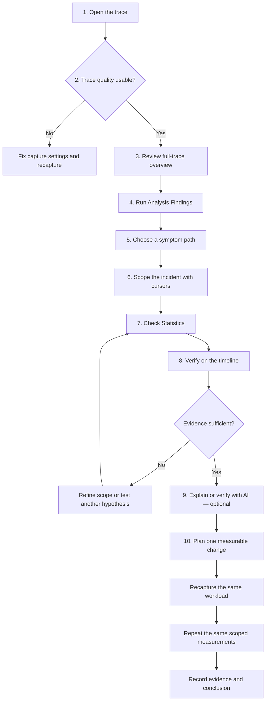
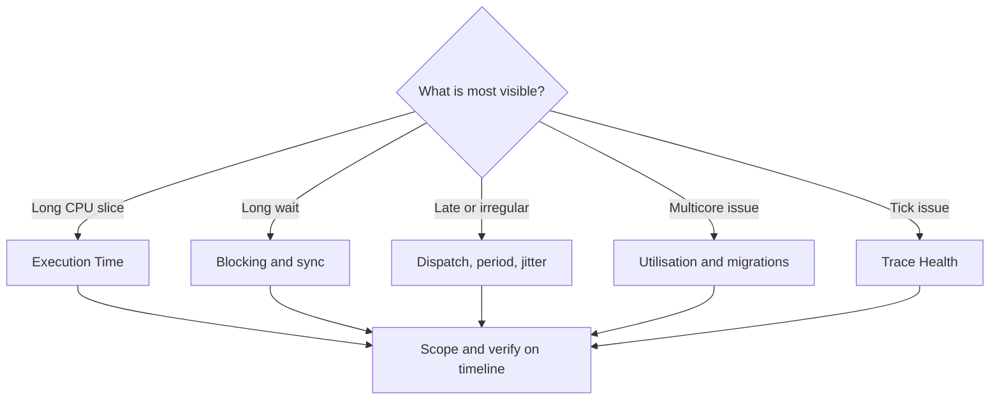
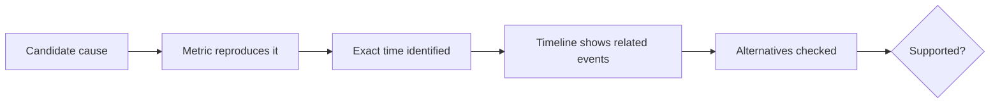
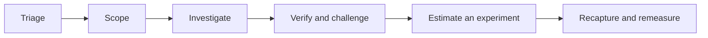

# BTFViewer Workflow

A beginner-friendly workflow for investigating RTOS scheduling traces with BTFViewer.

Use this guide when you know the symptom but do not yet know where to look. For viewer controls, see [`README.md`](README.md). For metric definitions and limitations, see [`STATISTICS.md`](STATISTICS.md). For AI setup and advanced investigation tools, see [`AI.md`](AI.md).

> **Core rule:** treat the trace and Statistics as measured evidence. Treat Analysis Findings as leads, AI explanations as interpretations, and What-if results as estimates.

<a id="workflow-at-a-glance" name="workflow-at-a-glance">&#x200B;</a>

## Workflow at a glance

You do not need AI to complete the workflow. Deterministic Statistics and timeline evidence should remain the basis of the conclusion.

<a id="10-minute-first-pass" name="10-minute-first-pass">&#x200B;</a>

## 10-minute first pass

When opening an unfamiliar trace, use this short pass before reading every Statistics table:

| Step | Action | Result |
|---:|---|---|
| 1 | Open the trace and select **Fit** | Confirm the whole capture is visible |
| 2 | Enable **Load**; switch between **Task View** and **Core View** | Identify workload phases and overall activity |
| 3 | Open **Statistics** and **Analysis** | See trace warnings, incident clusters, and ranked findings |
| 4 | Read **Trace Health (TICK)** | Decide whether timing evidence is usable or tickless behavior is expected |
| 5 | Open the Statistics sections named by the most relevant finding | Avoid inspecting unrelated metrics |
| 6 | Click **Max**, **p95**, a row, chart point, or heatmap cell | Jump to measured timeline evidence |
| 7 | Place C1–C2 and enable **Limit to C1–Cn** | Remove unrelated workload phases |
| 8 | Recheck Analysis and Statistics | Confirm the issue remains inside the selected scope |
| 9 | Optionally use **Investigate…**, **Verify with AI…**, or **Explain region** | Ask AI about evidence already found |
| 10 | Save evidence and repeat the same measurements after a change | Preserve and validate the result |

<a id="before-you-start" name="before-you-start">&#x200B;</a>

## Before you start

Have the following ready when possible:

- A trace that includes the reported failure or slow period.
- The expected workload, task names, priorities, deadlines, and CPU budgets.
- A rough incident time or a repeatable way to trigger the problem.
- STI events when you need dispatch latency, lifecycle, mutex, queue, interval, or priority-inheritance evidence.

Do not expect BTFViewer to inspect source code or simulate the RTOS scheduler. It measures events present in the trace. If the required event was not captured, record the limitation instead of inferring a precise value.

## 1. Open and orient the trace

1. Open the `.btf`, compressed BTF, or archive.
2. Select **Fit** to view the whole capture.
3. Start in **Task View** to identify active tasks, then switch to **Core View** for multicore placement.
4. Enable **Load** to see CPU utilisation over time.
5. Hover representative slices to learn their task, core, start time, and duration.

At this stage, look for phases rather than causes: startup, steady state, bursts, idle periods, and shutdown.

## 2. Check trace quality first

Open **Statistics** and review **Summary** and **Trace Health (TICK)** before diagnosing application behaviour.

Check for:

- Missing or irregular tick data.
- Large gaps or an unexpectedly short capture.
- Missing STI channels required by the intended analysis.
- Tasks or cores that appear absent despite being expected.
- A trace window that does not contain the reported incident.

If capture quality is poor, recapture before continuing. A gap in the trace is not evidence that the system was idle, and a missing event is not evidence that it never happened.

A **TICKLESS** result is not automatically a defect. If tick suppression is expected during idle periods, place cursors around a busy phase and check Trace Health again.

## 3. Build a full-trace overview

Review these Statistics sections before narrowing the scope:

| Check | What it establishes |
|---|---|
| **Summary / Core utilisation** | Trace duration, tasks, cores, total load, and load balance |
| **Top tasks by CPU** | Tasks that dominate CPU time |
| **Core Time Breakdown** | Active, Idle, Tick, and Gap time by core |
| **Execution Time Per Slice** | Typical and worst on-CPU slice durations |
| **Blocking Time** | Tasks with long off-CPU intervals |
| **Core Migrations** | Tasks that frequently move between cores |
| **Timeline Anomalies / Worst Events** | Candidate regions and outliers to inspect |

Use distributions, not only averages. Compare **Avg**, **p95**, **p99**, and **Max** when available. A high maximum with a normal average often indicates a short incident that should be scoped separately.

## 4. Run deterministic triage

Click **Analysis** to open **Analysis Findings** for the current Statistics scope.

For each relevant finding:

1. Note its severity, task or core, metric, and suggested Statistics section.
2. Treat the finding as a hypothesis, not a confirmed root cause.
3. Open the named Statistics section and reproduce the reported value.
4. Use **Apply cursors** when the finding recommends a useful time window.

If no finding stands out, begin with **Timeline Anomalies**, **Worst Events**, and the symptom table below.

## 5. Choose a symptom path

| Observed symptom | Start here | Cross-check next |
|---|---|---|
| Unknown problem | **Analysis Findings** | Timeline Anomalies, Worst Events, Task Health |
| Task runs too long | **Execution Time Per Slice** | Preemption Chain, Mutex Blocking, Critical Path |
| Task waits too long | **Blocking Time** | Preemption Chain, Mutex / Semaphore, Waiter × Owner |
| Ready task starts late | **Dispatch / Scheduling Latency** | Blocking, preemption, STI ready/resume events |
| Deadline or CPU budget miss | **Deadlines / CPU budget** | Execution p95/p99/Max, Period / Jitter, Critical Path |
| Irregular activation | **Period / Jitter** | Inter-Arrival Time, Unified Jitter, Recurring Patterns |
| Tick jitter or missed ticks | **Trace Health (TICK)** | Tick Distribution, busy-window Execution Max |
| Uneven multicore load | **Core utilisation** | Task × Core, Concurrent Core Active, Core Time Breakdown; **Load Balance Score** |
| Migration thrash or ping-pong | **Core Migrations** | Heatmap, corridor inspector, Core Affinity, mutex bounces |
| Priority inversion | **Priority Inheritance** | Mutex pairing, Mutex Blocking, Waiter × Owner |
| Lock or queue delay | **Mutex / Semaphore / Queue** | Blocking Time, Critical Path, migrations |

### Symptom decision map

## 6. Scope one incident with cursors

Use a small, meaningful window instead of repeatedly analysing the entire trace.

1. Jump to an outlier by clicking a Statistics row, percentile, chart point, or finding.
2. Place **C1** before the suspected cause and **C2** after the visible effect.
3. Select **Zoom to cursor range**.
4. Enable **Limit to C1–Cn** in Statistics.
5. Reopen **Analysis** so its findings use the same window.
6. Add a bookmark or annotation at the strongest evidence time.

Choose a window that contains enough context to see what ran immediately before and after the incident. If the window is too wide, unrelated activity may dominate the statistics; if it is too narrow, the triggering event may be excluded.

> **Viewport note:** the Migration **Heatmap / Chord** inspector follows the visible timeline viewport rather than the **Limit to C1–Cn** checkbox. The top banner is **Full view** (with the trace time range) after Fit to window, or **Viewport view** (orange, with the visible range) when zoomed. Zoom to the cursor range before opening it if you want the inspector to match C1–Cn.

## 7. Measure before explaining

For the suspect task or core, record:

- The scoped **Avg**, **p95**, **p99**, and **Max** values.
- The outlier timestamp and duration.
- The task and core active immediately before the incident.
- Related preemption, blocking, migration, mutex, queue, or STI events.
- Whether the behavior repeats elsewhere in the trace.

Use **Find** when you know a task name, core, migration, STI event, interval, lifecycle event, or synchronization pointer. Use **Recurring Patterns** when the same type of incident appears several times.

## 8. Verify the hypothesis on the timeline

A useful conclusion must connect the metric to visible events.

Ask these questions:

1. Does the Statistics value reproduce inside the cursor scope?
2. Can you jump to an exact timestamp that shows the event?
3. Do the task, core, duration, and surrounding events match the claim?
4. Is the relationship causal, merely correlated, or only close in time?
5. What evidence would disprove the hypothesis?
6. Is a simpler alternative consistent with the same data?

Use the following confidence labels:

| Confidence | Minimum evidence |
|---|---|
| **Confirmed** | Reproducible metric, matching timeline event, and a repeated measurement that supports the conclusion |
| **Supported** | Reproducible metric and matching timeline evidence; alternatives checked |
| **Plausible** | Some matching evidence, but a required event or relationship is missing |
| **Unsupported** | The scoped metric or timeline contradicts the claim |

Do not call a cause confirmed only because two events occur near each other.

### When to stop drilling down

Stop and record the current result when any of the following is true:

- The measured evidence explains the symptom.
- The suspected issue disappears when the correct workload phase is selected.
- Required instrumentation is missing, so the hypothesis cannot be verified.
- The next useful step is a firmware or configuration change followed by a new capture.

Continuing to inspect more tables after one of these conditions usually adds detail, not confidence.

### Optional compliance checks

Use these checks when the expected configuration is known:

| Statistics section | Verify |
|---|---|
| **Core Affinity** | Observed cores fit the configured affinity mask |
| **Task Lifecycle** | Create, suspend, resume, and delete behavior matches expectations |
| **Deadlines / CPU budget** | Violations use the real engineering limits; configured thresholds are in nanoseconds |
| **Tag Analysis** | Application-defined values remain inside their limits |
| **Interval Analysis** | Instrumented regions meet their duration budgets |

## 9. Use the AI Assistant only after scoping

AI is optional. It is most useful after you have selected a finding, task, event, or cursor range.

| Goal | Recommended entry point | What to verify yourself |
|---|---|---|
| Explain a finding | Select it → **Explain…** | Named metrics and timestamps |
| Check a finding | **Verify with AI…** | Supporting and contradicting evidence |
| Investigate a region | Two or more cursors → **Explain this region with AI** | Every `jump:TIME` lies within C1–Cn |
| Investigate one segment | Right-click → **Ask AI about this event** | Task, core, duration, nearby STI events |
| Run a guided investigation | **Investigate…** or **Auto investigate…** | Scope, tool results, evidence quality, alternatives |

Recommended AI sequence:

Reject an AI statement when it cannot be reproduced in Statistics, cites a time outside the cursor range, presents an estimate as a measurement, or assumes events that the trace did not capture.

**Start Investigation** (empty log) runs **Auto investigate**. Restart restores a **Current Issue** card only when the log still has a user or assistant turn. **Ctrl+K** opens Analysis, AI, Compare, workspace presets, and Inspect task. Toolbar **Compare** can **Save as baseline** / **Score vs baseline**; the **Trends** page lists every open tab.

## 10. Test one measurable change

After the evidence supports a cause:

1. Define one change, such as affinity, priority, mutex scope, task period, or workload distribution.
2. State the expected metric change before editing firmware or configuration.
3. Optionally use **What-if** or **Optimize** to rank ideas. Treat the result as a heuristic estimate, not scheduler simulation.
4. Reproduce the same workload and capture a new trace.
5. Open the new trace and select the same workload phase with equivalent cursor boundaries.
6. Repeat the same Statistics measurements used in the original investigation.
7. Check both the target metric and possible side effects, then record the difference.

Example acceptance criteria:

- Execution p99 decreases without increasing deadline misses.
- Blocking time decreases without causing migration or CPU imbalance to rise sharply.
- Migrations decrease without overloading the pinned core.
- Load balance improves while throughput and timing remain comparable.

If the result does not match the prediction, revise the hypothesis rather than adjusting the explanation to fit the outcome.

## 11. Close the investigation

Record enough information for another engineer to reproduce the conclusion:

- Trace name and capture conditions.
- Full-trace and cursor scope.
- Symptom and affected task or core.
- Measured baseline values and exact evidence times.
- Supported cause, alternatives considered, and missing evidence.
- Change applied and expected outcome.
- New-capture values and their change from the original measurements.
- Final confidence and any follow-up capture required.

Use bookmarks and annotations for important timestamps. Export an HTML/CSV report, annotated snapshot, selected BTF range, or an Investigation Case when useful.

<a id="beginner-checklist" name="beginner-checklist">&#x200B;</a>

## Beginner checklist

- [ ] I checked trace quality before application behavior.
- [ ] I reviewed the full trace before narrowing the scope.
- [ ] I treated Analysis Findings as leads, not facts.
- [ ] I used at least two cursors and enabled **Limit to C1–Cn**.
- [ ] I checked a distribution or percentile, not only the average.
- [ ] I reproduced the claim in Statistics.
- [ ] I verified the exact event on the timeline.
- [ ] I considered contradictory evidence and alternative causes.
- [ ] I labeled estimates and missing trace data clearly.
- [ ] I recaptured the same workload and repeated the same scoped measurements after a change.

<a id="common-mistakes" name="common-mistakes">&#x200B;</a>

## Common mistakes

| Mistake | Better practice |
|---|---|
| Starting with AI on the whole trace | Select a finding or cursor range first |
| Treating Max as guaranteed WCET | Describe it as the maximum observed in this capture |
| Using Avg alone | Check p95, p99, Max, and the distribution |
| Calling off-CPU time a mutex wait | Confirm synchronization events or label it as blocking only |
| Comparing different workload phases | Match capture conditions and cursor scopes |
| Assuming correlation proves causation | Check sequence, alternatives, and contradicting evidence |
| Treating What-if as measured behavior | Recapture and repeat the same Statistics measurements |
| Continuing with a poor trace | Fix instrumentation or capture settings first |

<a id="documentation-navigation" name="documentation-navigation">&#x200B;</a>

## Documentation navigation

- [`README.md`](README.md) — installation, controls, timeline navigation, export, and [demo](README.md#demo)
- [`STATISTICS.md`](STATISTICS.md) — metric definitions, formulas, interpretation, and limitations
- [`AI.md`](AI.md) — AI models, tools, privacy, investigation engine, and evaluation
- [`WORKFLOWS_zh-TW.md`](WORKFLOWS_zh-TW.md) — Traditional Chinese version
