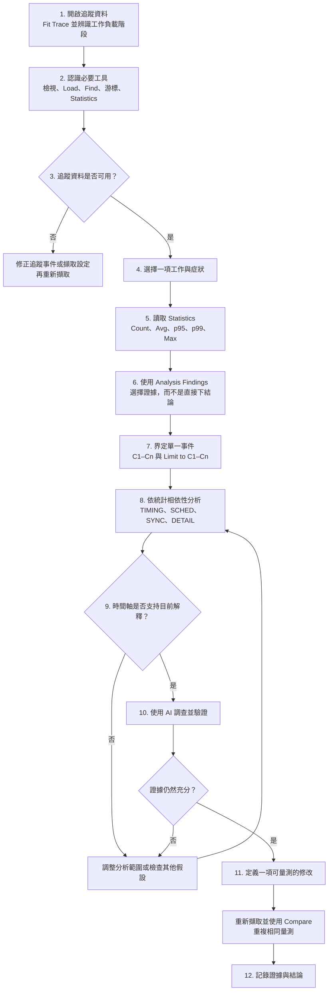
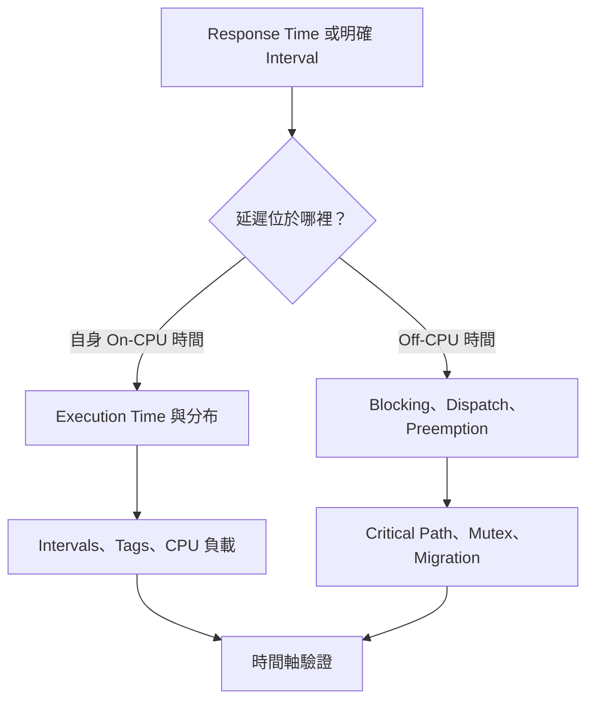
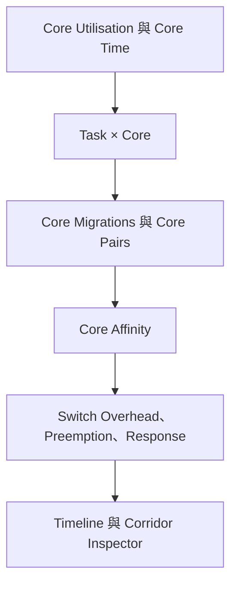
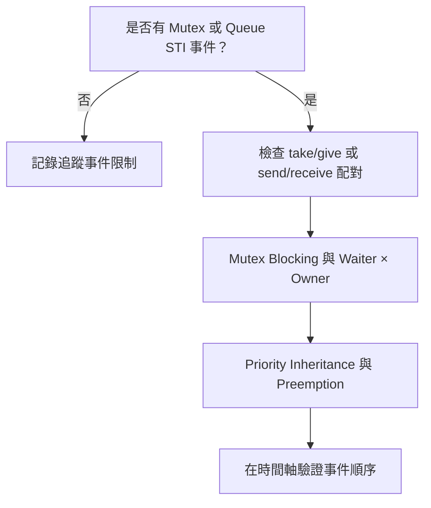
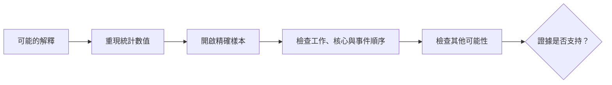
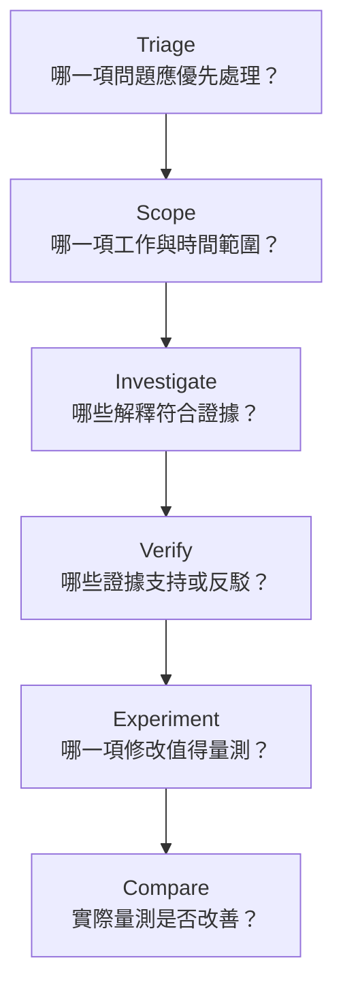

# BTFViewer 初學者操作與驗證流程

本文件帶領第一次使用 BTFViewer 的讀者完成一項完整分析：先認識檢視器操作，找出一項工作（Task），讀懂相關 Statistics，在時間軸驗證一個事件，最後使用 AI 助理調查並檢驗可能的解釋。

流程順序很重要。BTFViewer 的 Statistics 與時間軸提供量測證據；**Analysis Findings** 協助找出應優先檢查的位置；AI 助理用來整理證據並檢驗可能的解釋；**What-if** 與 **Optimize** 只提供估算。

## 完成本流程後可以學到什麼

完成本流程後，你應該能夠：

- 分辨分析範圍、篩選條件、選取項目與反白的差異；
- 使用 Task View、Core View、Load、Find、游標、Analysis 與 Statistics；
- 正確解讀 Count、Avg、p95、p99 與 Max，不過度延伸結論；
- 從 Statistics 數值回到產生該數值的時間軸事件；
- 依照時序、排程與同步統計之間的相依性進行分析；
- 在選定證據後才使用 AI，而不是讓 AI 產生量測結果；以及
- 使用新的追蹤資料與相同量測方式驗證修改結果。

## 貫穿全文的範例：一項工作偶爾延遲

本文件使用虛構的工作名稱 `ControlTask`。實際操作時，請換成追蹤資料中真正需要分析的工作。

使用者回報的症狀是：

> `ControlTask` 通常運作正常，但有些執行週期比預期更晚完成。

本流程不預設原因。回應時間過長可能來自工作本身執行時間增加、遭到搶占、離開 CPU 的等待、派送延遲、同步、核心遷移，或追蹤資料不完整。分析的目的，是用證據區分這些可能性。

## 必要名詞

| 名詞 | 在本流程中的意義 |
|---|---|
| **Full Trace** | 完整的擷取時間範圍，未使用游標限制分析區段 |
| **分析範圍（Scope）** | Statistics、Analysis Findings 與 AI 使用的時間範圍，可以是 Full Trace 或 C1–Cn |
| **篩選條件（Filter）** | 目前分析範圍內的工作、核心或遷移資料子集合 |
| **選取項目（Selection）** | 持續選取以便查看的工作或物件；本身不會改變統計計算 |
| **反白（Highlight）** | 暫時的視覺強調；不會改變統計計算 |
| **執行片段（Slice）** | 一項工作在一個核心上連續執行的區段 |
| **Off-CPU** | 工作未在 CPU 上執行的時間；追蹤資料不一定能分辨工作當時是就緒、阻塞、暫停，還是等待下一次啟動 |
| **STI 事件** | 選用的軟體追蹤事件，可記錄 ready/resume、互斥鎖、佇列、區間、標籤、生命週期或優先權事件 |
| **分析結果（Finding）** | Analysis 依固定規則或啟發式方法找出的線索，不等於已確認的根本原因 |
| **假設（Hypothesis）** | 仍需支持證據與其他可能性檢查的原因解釋 |

選取項目與反白不會自動變成篩選條件。解讀數值前，請固定檢查狀態列與 Statistics 的 **Filtered:** 指示。

## 證據層級

| 證據層級 | 範例 | 使用方式 |
|---|---|---|
| **直接證據** | 記錄的時間點、工作／核心 ID、執行片段邊界、STI 標籤 | 最強的追蹤證據 |
| **推導結果** | 執行時間、CPU 比例、核心遷移次數、到達間隔 | 由記錄事件進行確定性計算 |
| **估計／啟發式結果** | Response Time、互斥鎖 waiter–owner 交接、Critical Path、Task Health | 用來定位事件，再以更直接的證據確認 |
| **設定值比較** | 期限或 CPU 預算違規 | 只有設定門檻符合實際需求時才有意義 |
| **AI 解讀** | 可能原因、說明或改善建議 | 必須回到 Statistics 與時間軸驗證 |

不要把估計值描述成核心直接記錄的事件。

## 步驟 1 — 開啟並認識追蹤資料

### 操作

1. 選取 **Open** 並載入追蹤資料。
2. 選取 **Fit Trace**（`Ctrl+0` 或 `F`），顯示完整擷取範圍。
3. 先使用 **Task View**，辨識啟動、穩定執行、過載、閒置與關閉等階段。
4. 切換至 **Core View**，查看各核心實際執行哪些工作。
5. 啟用 **Load**；需要時拖曳分隔線調整負載圖高度。
6. 將游標移到幾個時間軸執行片段上，查看工作名稱、核心、開始／結束時間與持續時間。
7. 確認狀態列顯示正確的追蹤資料、**Scope: Full Trace**、篩選條件與縮放狀態。

### 應觀察的內容

- 追蹤資料是否包含問題發生時的工作負載階段？
- 是否能找到 `ControlTask`，而且它確實有執行？
- 是否看得到所有預期核心？
- 是否有很長的空白區、活動突增，或擷取時間異常短？
- 負載圖是否顯示可能發生問題的明顯階段？

### 繼續條件

你已能指出要分析的工作，以及應包含問題的工作負載階段。此時先不要判定根本原因。

## 步驟 2 — 認識必要工具

第一次分析不需要熟悉工具列上的所有功能。先學會以下操作：

| 工具 | 第一次使用時的用途 | 會改變什麼 |
|---|---|---|
| **Task View / Core View** | 追蹤一項工作，或查看各核心排程 | 只改變呈現方式；分析範圍與篩選條件不變 |
| **Load** | 顯示使用率隨時間變化 | 加入負載圖；不改變計算 |
| **Fit Trace** | 回到完整擷取畫面 | 只改變可見範圍 |
| **Fit Cursors** | 顯示最早至最晚游標之間的區段 | 只改變可見範圍 |
| **Find**（`Ctrl+F`） | 尋找工作、核心遷移、STI 事件、區間、生命週期事件或物件指標 | 在符合項目間移動；分析範圍與篩選條件不變 |
| **Cursor** | 標記事件時間，或定義 C1–Cn | 只有啟用 **Limit to C1–Cn** 後才會成為分析範圍 |
| **Statistics** | 計算並顯示統計結果 | 使用目前分析範圍與篩選條件 |
| **Analysis** | 排列目前分析範圍內的分析結果 | 提供線索與導覽 |
| **Migration & Corridor Inspector** | 檢查重複的核心間移動 | 使用目前可見的遷移證據 |
| **Compare** | 比較 Baseline 與 Candidate 追蹤資料 | 至少需要開啟兩份追蹤資料 |
| **AI Assistant** | 解釋、調查與驗證已提供的證據 | 可能要求唯讀查詢或改變檢視器的工具動作 |

### 正式分析前的練習

1. 點選 `ControlTask` 標籤，讓它成為選取項目。
2. 將游標移到另一項工作上，觀察暫時反白效果。
3. 開啟 **Find**，搜尋 `ControlTask`，使用 `F3` 與 `Shift+F3` 在符合項目之間移動。
4. 放置一個游標，並拖曳游標線調整位置。
5. 使用右鍵選單或 `Shift+C` 清除游標。
6. 切換 Task/Core View，確認分析範圍與選取項目仍保留。

### 繼續條件

你已了解哪些操作只改變畫面，以及哪些操作會改變被分析的資料。

## 步驟 3 — 檢查追蹤品質與完整範圍概觀

在右側面板開啟 **Statistics**。先認識預設分類順序：

`OVERVIEW → TRIAGE → TIMING → SCHED → SYNC → DETAIL`

第一次品質檢查只需要查看以下區段：

| Statistics 區段 | 要回答的問題 | 注意事項 |
|---|---|---|
| **Core Utilisation** | 哪些核心忙碌、閒置或負載不平均？ | 平均負載平衡可能掩蓋短暫過載 |
| **Trace Health (TICK)** | TICK 間隔、大間隔與 tickless 行為是否合理？ | 無週期滴答閒置可能合理地產生不規則間隔 |
| **Task Health** | 哪些工作應優先檢查？ | 分數是啟發式指標，不是 AI 機率 |
| **Core Time Breakdown** | Active、IDLE、TICK 與 Gap 是否合理涵蓋分析範圍？ | Gap 不一定代表核心閒置 |
| **Top Tasks by CPU** | 哪些工作占用最多 CPU 時間？ | CPU% 以分析範圍的實際時間為分母；多核心系統的合計可能超過 100% |

確認追蹤資料是否包含分析問題所需的 STI 事件。例如：

- Dispatch Latency 需要已記錄的 ready/resume 或 create 事件；
- 互斥鎖、號誌與佇列分析需要對應的 STI 事件；
- 精確的端對端操作時間需要 Interval 或其他明確邊界；
- 期限結果需要正確的設定門檻。

若缺少必要事件，請記錄這項限制。不要用精確的解釋取代缺失的證據。

### 繼續條件

追蹤資料包含相關工作負載階段，工作與核心資料合理，而且追蹤事件足以支持預定分析。否則應先修正擷取設定並重新記錄。

## 步驟 4 — 鎖定一項工作與一個症狀

第一次分析應保持範圍單純。本範例的對象是 `ControlTask`，症狀是偶發的完成延遲。

### 操作

1. 使用 **Find** 或圖例找到 `ControlTask`。
2. 選取該工作，方便持續追蹤它的時間軸列。
3. 在 **Statistics** 開啟 **Response Time、Execution Time Per Slice、Blocking Time** 與 **Period / Jitter**。
4. 除非其他工作讓資料無法閱讀，否則先不要套用工作篩選條件。其他工作可能正是搶占或同步延遲的來源。
5. 記錄目前分析範圍與所有作用中的篩選條件。

### 將症狀改寫成可量測的問題

| 使用者回報 | 第一個量測問題 |
|---|---|
| 「工作完成得太晚」 | Response Time 是否偏高？是否有能代表完整工作的明確 Interval？ |
| 「工作執行太久」 | 每個執行片段的 Execution Time 是否偏高？ |
| 「工作就緒後很晚才開始」 | Dispatch Latency 是否偏高？追蹤資料是否包含 ready 事件？ |
| 「工作啟動時間不規律」 | Period / Jitter 與 Inter-Arrival 是否不穩定？ |
| 「工作在等待鎖」 | 互斥鎖 STI 事件與 Mutex Blocking 是否支持這項說法？ |
| 「工作移動太頻繁」 | Migration Rate、Dwell、Ping 與核心路徑是否不符合此工作負載的預期？ |

使用者回報用來選擇第一項統計，不用來直接宣告原因。

### 繼續條件

你已能提出一個可量測的問題，例如：「哪些 `ControlTask` 樣本具有最長回應時間？延遲主要來自自身執行，還是 Off-CPU 時間？」

## 步驟 5 — 正確解讀 Statistics

### 先確認樣本數

解讀百分位數前，一律先讀 **Count** 或 **Runs**。若只有十個樣本，p99 實際上接近 Max，不能代表穩定的百分之一尾端行為。

| 數值 | 初學者解讀方式 | 用途 |
|---|---|---|
| **Count / Runs** | 有效樣本數量 | 判斷證據是否充足 |
| **Avg** | 算術平均 | 描述中心位置，但不能代表尾端 |
| **Median / p50** | 排序後位於中間的樣本 | 描述較不受離群值影響的典型樣本 |
| **p95** | 95% 的樣本小於或等於此值 | 找出重複出現的慢速尾端行為 |
| **p99 / p99.9** | 99%／99.9% 的樣本小於或等於此值 | 樣本數足夠時，用來檢查更少見的尾端延遲 |
| **Max** | 目前追蹤資料與分析範圍內觀測到的最大值 | 跳到最差觀測事件；不是已證明的 WCET |
| **Jitter / Spread** | `Max − Min` | 顯示觀測到的時間範圍 |
| **CV** | 標準差除以 Avg | 比較不同尺度指標的相對變異程度 |

### 判讀分布形狀，不要只看單一數值

針對 `ControlTask`：

1. 比較 Avg、p95、p99 與 Max。
2. 開啟該指標的分布圖或 **Distribution Explorer**。
3. 使用 Scatter 查看尖峰發生時間。
4. 使用 Histogram 查看樣本集中在哪些數值區間。
5. 使用 CDF 查看小於或等於某個數值的樣本比例。

以下是常見型態，但仍需保守解讀：

| 型態 | 可能意義 | 下一項檢查 |
|---|---|---|
| Avg 正常，但 Max 高出很多 | 單一罕見事件或少量離群樣本 | 跳到 Max 並檢查周圍時間軸 |
| p95 與 p99 都偏高 | 重複出現的尾端延遲 | 檢查 Recurring Patterns 與多個證據時間 |
| Execution 高，但 Off-CPU 很少 | 自身 CPU 工作增加或連續執行片段變長 | Distribution、Intervals、Tags 與搶占前後關係 |
| Response 高，但 Execution 正常 | 延遲可能位於自身執行片段之外 | Blocking、Dispatch、Preemption、Mutex、Migration |
| CV 高 | 相對於平均值的變動程度高 | Scatter 與工作負載階段切分 |

### 繼續條件

你已選出一個需要回到時間軸檢查的量測樣本或重複型態。

## 步驟 6 — 使用 Analysis Findings 進行初步判斷

選取 **Analysis**。分析結果使用目前分析範圍計算；視窗開啟時仍可操作時間軸。

對每一項相關分析結果：

1. 讀取嚴重程度、標題、量測值與 **Evidence** 說明。
2. 嚴重程度代表檢查優先順序，不代表故障機率。
3. 選取 **Show on timeline**，在不改變分析範圍與篩選條件的情況下，將時間軸移到證據位置。
4. 選取 **Investigate**，開啟支持該結果的 Statistics 區段；若提供建議游標範圍，也可一併套用。
5. 確認 Statistics 數值、工作名稱與時間點都和分析結果一致。
6. 已檢視可標 **Done**；不適用可 **Dismiss…** 並寫簡短原因；要納入調查可 **Add to case**。

如果沒有相關分析結果，仍可從已選定的 Statistics 樣本繼續。沒有 Finding 不代表工作沒有問題；症狀可能不符合內建啟發式規則。

### 適合第一次檢查的 TRIAGE 區段

| 區段 | 用途 |
|---|---|
| **Timeline Anomalies** | 排序不尋常的尾端、突發、間隔、遷移與期限事件 |
| **Worst Events** | 最長的執行、阻塞、到達間隔與回應事件 |
| **Recurring Patterns** | 同一工作重複發生的異常型態 |
| **Task Health** | 整體啟發式篩選分數，以及前往各組成統計的連結 |

### 繼續條件

你已選定一項工作、一個指標，以及至少一個證據時間點或區間。

## 步驟 7 — 使用游標界定單一事件

完整追蹤資料的 Statistics 可能同時包含啟動、穩定執行、過載、復原與關閉階段。使用游標將一個事件轉換成可驗證的分析範圍。

### 操作

1. 跳到 Max、p95、p99、Anomaly、Worst Event、圖表資料點或 Finding 證據。
2. 在可能引發延遲的活動之前放置 **C1**。
3. 在 `ControlTask` 完成或恢復之後放置 **C2**。其他游標可用來標示中間證據。
4. 選取 **Fit Cursors**（`Ctrl+R`），顯示最早至最晚游標之間的範圍。
5. 在 Statistics 啟用 **Limit to C1–Cn**（Desktop 與 Web 也會顯示橫幅：**Use C1–Cn as analysis Scope** → **Enable Limit to C1–Cn**）。
6. 確認狀態列與 Statistics 標頭顯示 **Scope: C1–Cn · duration**。
7. 再次檢查 **Filtered:** 指示，清除非預期的工作、核心或遷移篩選條件。
8. 重新開啟 **Analysis**，讓 Findings 使用相同分析範圍。
9. 在最強證據時間加入 Bookmark 或 Annotation。

### 如何選擇適當範圍

- 起點應足以包含可能觸發問題的事件、前一個執行片段、ready 事件、互斥鎖取得或核心遷移。
- 終點應足以包含完成、釋放或恢復。
- 範圍不要太寬，以免無關工作負載階段主導統計。
- 範圍不要太窄，以免真正原因落在範圍之外。

導覽、分析範圍與篩選條件彼此不同。**Show Evidence**、Find 與 Fit 只改變查看位置；**Limit to C1–Cn** 才會改變被計算的樣本。

### 繼續條件

異常數值在游標分析範圍內仍然存在，而且你能看見周圍的工作與核心活動。

## 步驟 8 — 依統計相依性分析

不需要開啟所有表格。從症狀開始，只沿著能確認或排除原因的最短相依路徑前進。

### 路徑 A — 工作延遲

| 主要統計 | 量測內容 | 搭配確認 | 重要限制 |
|---|---|---|---|
| **Response Time** | 啟發式的前一執行片段結束至目前片段結束區間 | Execution、Blocking、Dispatch、Interval | 不是明確的 release-to-completion 配對 |
| **Execution Time** | 一個連續的 On-CPU 執行片段 | Distribution、Interval、Tags、Preemption | 一次工作可能包含多個執行片段 |
| **Blocking Time** | 連續執行片段之間的 Off-CPU 間隔 | Preemption、Mutex Blocking、Period | Off-CPU 不能證明互斥鎖阻塞 |
| **Dispatch Latency** | 記錄的 ready/create 事件至下一次 switch-in | Timeline、Preemption、Core Time | 需要適當的 STI ready 證據 |
| **Critical Path** | 啟發式 ready-to-completion 區間與重疊證據 | Execution、Blocking、Preemption、Migration | 各成分可能重疊，不能當成彼此互斥的時間拆分 |
| **Interval Analysis** | 應用程式明確記錄的 start-to-stop 時間 | Timeline、Execution、Tags | 正確性取決於應用程式追蹤事件 |

針對 `ControlTask`，先判斷延遲回應主要包含異常的自身執行時間，還是大部分來自 Off-CPU 時間。這項判斷會決定下一條分析路徑。

### 路徑 B — 排程與多核心配置

不要看到遷移次數就直接判定問題，應先檢查負載平衡。SMP 排程器可能合理地將未綁定工作的執行移到閒置核心。

| 問題 | Statistics |
|---|---|
| 負載不平衡是長期狀態，還是特定階段？ | Core Utilisation、Core Utilization Over Time |
| 哪些工作造成各核心負載？ | Task × Core |
| 工作多久移動一次？移動後停留多久？ | Core Migrations：Count、Rate、Dwell、Ping |
| 哪一個方向的核心路徑最常出現？ | Core-Pair Migration Summary |
| 實際配置是否符合允許的核心範圍？ | Core Affinity |
| 遷移是否與延遲或排程成本同時出現？ | Response、Execution、Switch Overhead、Preemption |

核心遷移次數本身無法量測快取失誤、協同處理器暫存器儲存成本或排程器額外負擔。這類結論需要處理器專屬證據。

### 路徑 C — 同步與等待

使用衍生等待時間前，先以 **Mutex / Semaphore** 或 **Queue** 檢查事件配對品質。**Waiter × Owner** 與 **Mutex Blocking** 使用啟發式交接關係，不會重建 RTOS 的等待佇列。請在時間軸確認物件指標、持有者、等待者、take/give 順序與優先權活動。

### 路徑 D — 週期與抖動

| 起點 | 接著檢查 | 要回答的問題 |
|---|---|---|
| **Period / Jitter** | Inter-Arrival Time | 啟動是否有遺漏、額外或突發？ |
| **Inter-Arrival Time** | Unified Jitter | 啟動間隔變化是否重複發生？ |
| **Unified Jitter** | Execution、Blocking、Response、Dispatch | 哪一類成分造成最多變異？ |
| **Core Utilization Over Time** | Preemption、Mutex、Migration | 負載突增是否和時序變化同時出現？ |
| **Deadlines / CPU Budget** | Execution、Period、Critical Path | 量測結果是否違反真實且正確設定的需求？ |

### 繼續條件

主要解釋同時獲得一項主要統計與至少一項相依統計支持，或證據顯示另一條路徑更合理。

## 步驟 9 — 在時間軸驗證事件

Statistics 負責摘要樣本，時間軸負責顯示事件順序。可靠結論需要兩者相互支持。

依序回答以下問題：

1. 該數值是否能在目前 C1–Cn 分析範圍內重現？
2. 點選數值後，是否開啟預期的工作、核心與時間？
3. 延遲發生前、發生期間與發生後，分別執行了什麼？
4. `ControlTask` 當時正在執行、就緒、遭搶占、阻塞、暫停，還是等待下一次啟動？追蹤事件是否足以分辨？
5. 互斥鎖、佇列、優先權、核心遷移或 ready 事件是否支持目前機制？
6. 事件關係是因果、相關，還是只在時間上接近？
7. 哪一項證據會推翻目前解釋？
8. 是否有更簡單的解釋同樣符合現有證據？

### 信心程度

| 標示 | 最低證據要求 |
|---|---|
| **Supported** | 統計可重現、精確時間軸證據吻合，而且已檢查合理的其他解釋 |
| **Plausible** | 部分證據吻合，但缺少重要事件或關係 |
| **Inconclusive** | 追蹤資料無法區分主要可能性 |
| **Unsupported** | 目前分析範圍的統計或時間軸與解釋矛盾 |

只有應用程式需求與追蹤事件明確定義必要邊界，而且多次等效量測都支持相同結論時，才使用 **Confirmed**。

### 繼續條件

不使用 AI，你也能寫出一段以證據為基礎的敘述。例如：「在此分析範圍內，觀測到最長的 `ControlTask` 回應包含正常的執行片段，但具有與特定搶占活動重疊的長 Off-CPU 間隔。」

## 步驟 10 — 使用 AI 助理

AI 是選用工具。選定分析結果、工作、事件、分布圖或 C1–Cn 範圍後再使用。AI 接收結構化 Findings 與工具結果，不會取得完整的原始 `.btf` 事件資料流。

### 第一次使用的設定

1. 開啟 **Settings → AI**。
2. 選擇服務供應商預設集、端點、模型與認證方式。
3. 使用 **Test connection** 確認連線。
4. 先使用 **Balanced** Context。內容長度較小時可使用 Compact；調查確實需要更多 Findings 與對話記錄時再使用 Full evidence。
5. 使用雲端端點前，先檢查隱私設定。本機 Ollama 通常不需要 API 金鑰。

### 依現有證據選擇進入方式

| 已選定的證據 | AI 進入方式 | 傳送內容 |
|---|---|---|
| 還沒有明確問題 | **Start Investigation** 或 **Triage findings** | 目前分析範圍、篩選條件與可用 Findings |
| 一項 Analysis Finding | **Investigate、Explain、Verify** 或 **Auto investigate** | 所選 Finding 與其證據 |
| C1–Cn 事件 | **Explain this region with AI** 或 **Explain region** | 游標範圍與限定範圍的 Findings |
| 一個時間軸執行片段 | **Ask AI about this event** | 所選工作、核心、片段與附近證據 |
| 已開啟的分布圖 | **Query with AI…** | 所選指標、工作與圖表顯示的樣本 |
| 兩份可比較追蹤資料 | Trace Compare **Query with AI…** | 所選比較表格 |

### 依六個 AI 階段進行

針對本範例：

1. 使用 **Investigate** 調查已限定範圍的 `ControlTask` 事件。
2. 開啟回覆引用的每個 Statistics 區段與 `jump:TIME`／`range:LO/HI` 連結。
3. 確認引用的每個時間都位於 C1–Cn 內。
4. 使用 **Verify finding**，要求列出支持證據、矛盾證據、其他解釋與缺失資訊。
5. 若敘述無法在 Statistics 重現，或假設了未記錄的事件，就不應採用。

### 了解 AI 工具動作

| 工具行為 | 執行方式 |
|---|---|
| 證據查詢 | 立即執行，傳回量測或推導資料 |
| 調查狀態或匯出工具 | 立即執行；可能更新假設、調查記憶、實驗紀錄或儲存報告 |
| 會改變檢視器的工具 | 除非啟用 **Auto-apply GUI actions**，否則等待使用者選擇 **Apply** 或 **Skip** |

會改變檢視器的工具可以放置游標、縮放、反白工作、切換 View Mode、開啟 Corridor Inspector、加入註解或書籤、清除標記，或重設畫面。選取 **Apply** 前應先檢查工具卡片；若整批動作不適合，可使用 **Undo last actions**。

### 有用的 AI 回覆應包含

- 目前分析範圍與主要工作；
- 分開描述的量測觀察與解讀；
- 支持與矛盾證據；
- 其他可能解釋；
- Supported、Rejected 或 Inconclusive 等結論；
- 缺失證據與一項有用的下一步；以及
- What-if 或 Optimize 的明確估算聲明。

### 繼續條件

AI 的解釋與 Statistics、時間軸證據一致，或 AI 已指出需要重新擷取才能補足的具體量測。

## 步驟 11 — 定義一項修改並重新量測

不要從 Finding 直接跳到修正。只有證據支持某項機制後，才開始修改。

### 操作

1. 定義一項修改，例如工作核心親和性、優先權、互斥鎖範圍、工作負載配置或追蹤事件。
2. 套用修改前，先寫下預期會改變的指標。
3. 可選擇使用 **What-if** 或 **Optimize** 排列實驗優先順序。結果是啟發式估算，不是 RTOS 排程器模擬。
4. 將修改套用到實際系統。
5. 使用相同追蹤事件重新執行同一工作負載並擷取資料。
6. 將原始追蹤資料設為 **Baseline**，新追蹤資料設為 **Candidate**。
7. 選擇相同的工作負載階段與等效游標範圍。
8. 重複原始調查使用的 Statistics 量測。
9. 使用 **Compare** 檢查正規化總量、尾端數值、重要變化與副作用。
10. 回到兩份時間軸，檢查造成差異的實際樣本。

### 驗收敘述範例

- Response p99 降低，而且 Deadline Miss 沒有增加。
- Blocking 尾端降低，而且 Migration Rate 或核心負載不平衡沒有增加。
- Migration Rate 降低，而且被指定的核心沒有過載。
- 負載平衡改善，同時 Execution 與 Response 尾端仍符合需求。

如果實際結果不符合預測，應修正假設，不要為了配合結果而改寫原本解釋。

### 繼續條件

Baseline 與 Candidate 代表等效條件，目標指標已重新量測，而且重要副作用也已檢查。

## 步驟 12 — 記錄並分享調查結果

記錄足以讓另一位工程師重現結果的資訊：

| 記錄項目 | 應包含內容 |
|---|---|
| 擷取條件 | 追蹤資料名稱、韌體／設定、工作負載、核心數量、追蹤事件 |
| 分析條件 | 分析範圍、篩選條件、所選工作與相關游標時間 |
| 症狀 | 使用者觀察到的問題，以及受影響的工作／核心 |
| 量測 | Count、Avg、p95、p99、Max、單位與精確證據時間 |
| 相依統計 | 支持結論的時序、排程、同步或應用程式追蹤統計 |
| 結論 | 獲得支持的解釋、信心程度、其他可能性與缺失證據 |
| 實驗 | 修改內容、預期結果、Candidate 量測與副作用 |

可使用以下輸出：

- 使用 Bookmark 與 Annotation 標示重要時間點；
- 產生含註解的 Snapshot 或時間軸 SVG；
- 使用 **Save cursor range as BTF** 儲存所選事件；
- 使用 Statistics **Export HTML**（含可搜尋表格的自包含報告）；
- 使用 Trace Compare **Export HTML**；以及
- 使用 AI 時產生診斷報告或 Investigation Case。

請保留原始追蹤資料。匯出報告可以摘要證據，但無法保留所有互動式時間軸操作。

## 完整操作範例

下表顯示完整路徑，不加入虛構量測數值。

| 階段 | `ControlTask` 操作 | 判斷結果 |
|---:|---|---|
| 1 | 開啟追蹤資料、Fit Trace、啟用 Load、辨識穩定執行階段 | 問題工作負載確實存在 |
| 2 | 選取 `ControlTask`，練習 Find 與 Task/Core View | 能看見該工作與周圍核心活動 |
| 3 | 檢查 Core Utilisation、Trace Health 與追蹤事件 | 追蹤資料可用於時序分析 |
| 4 | 開啟 Response、Execution、Blocking 與 Period/Jitter | 問題轉換成「自身執行，還是 Off-CPU 延遲？」 |
| 5 | 比較 Count、Avg、p95、p99、Max 與分布 | 選定一個尾端樣本或重複型態 |
| 6 | 開啟 Analysis，使用 Show Evidence 或 Investigate | Finding 與 Statistics 指向相同事件 |
| 7 | 在觸發前放置 C1，完成後放置 C2，再啟用 Limit | Statistics 現在只描述一個事件 |
| 8 | 依 Response → Execution/Blocking → Preemption/Mutex/Migration 分析 | 收集最短且足以支持判斷的相依資料 |
| 9 | 在時間軸驗證工作／核心／事件順序 | 得出 Supported、Plausible、Inconclusive 或 Unsupported |
| 10 | 要求 AI Investigate，再使用 Verify finding | 以相同證據核對 AI 解釋 |
| 11 | 定義一項預期指標變化、擷取 Candidate、使用 Compare | 修改結果經過實際量測 |
| 12 | 儲存分析範圍、數值、證據時間、結論與報告 | 其他工程師可以重現調查 |

## 初學者完成檢查表

- [ ] 我已確認目前追蹤資料、分析範圍、篩選條件與 View Mode。
- [ ] 我已檢查追蹤品質與必要 STI 事件。
- [ ] 我已選定一項工作與一個可量測問題。
- [ ] 我在解讀 p95 或 p99 前先讀取 Count。
- [ ] 我已比較 Avg、p95、p99、Max 與分布。
- [ ] 我把 Analysis Findings 當成線索，而不是結論。
- [ ] 我已放置至少兩個游標並啟用 **Limit to C1–Cn**。
- [ ] 我已檢查相關統計相依性。
- [ ] 我已在時間軸開啟精確樣本。
- [ ] 我已檢查矛盾證據與其他可能解釋。
- [ ] 我只在選定證據後使用 AI。
- [ ] 我已驗證 AI 引用的每個量測與時間點。
- [ ] 我把 What-if 與 Optimize 視為估算。
- [ ] 我已擷取等效 Candidate，並重複相同量測。
- [ ] 我已記錄足以讓其他工程師重現結果的資訊。

## 初學者常見錯誤

| 錯誤 | 較好的做法 |
|---|---|
| 一開始就要求 AI 分析完整追蹤資料 | 先選定 Finding、工作、事件、分布圖或 C1–Cn 範圍 |
| 把反白當成篩選條件 | 檢查狀態列與 Statistics **Filtered:** 指示 |
| 把畫面縮放範圍當成分析範圍 | 啟用 **Limit to C1–Cn** 並確認 Scope 標示 |
| 用很少的樣本解讀 p99 | 先看 Count，對小樣本百分位數保持保守 |
| 把 Max 稱為保證的 WCET | 使用「此追蹤資料與分析範圍內觀測到的最大值」 |
| 把所有 Off-CPU 間隔都稱為互斥鎖阻塞 | 要求同步證據，否則只稱 Off-CPU／Blocking Time |
| 認為所有核心遷移都有害 | 檢查負載平衡、Affinity、Rate、Dwell 與相關延遲 |
| 認為時間接近就能證明因果 | 檢查事件順序、其他可能性與矛盾證據 |
| 比較不同工作負載階段 | 對齊工作負載、追蹤事件、分析範圍與篩選條件 |
| 把 AI 解釋當成量測值 | 在 Statistics 與時間軸重現 |
| 把 What-if 當成已驗證改善 | 套用修改、重新擷取，再使用 Compare |

## 何時應停止並重新擷取

遇到以下情況，應停止目前調查並重新擷取：

- 追蹤資料沒有包含回報的階段或事件；
- 沒有記錄必要的工作、核心、TICK、ready、互斥鎖、佇列、Interval 或 Tag 事件；
- 分析範圍邊界切掉了配對所需的事件；
- Baseline 與 Candidate 並非等效工作負載；
- 下一項有效檢查需要新增追蹤事件；或
- 現有證據無法區分剩餘假設。

清楚說明需要哪些新追蹤事件的 Inconclusive 結果，比沒有證據卻很有信心的解釋更有價值。

## 文件導覽

- [`README_zh-TW.md`](README_zh-TW.md) — 安裝、支援檔案、工具列、時間軸操作、匯出與快捷鍵
- [`STATISTICS_zh-TW.md`](STATISTICS_zh-TW.md) — 每個 Statistics 區段的定義、計算方式、相依性、判讀與限制
- [`AI_zh-TW.md`](AI_zh-TW.md) — AI 設定、操作、工具、隱私、證據驗證與進階參考
- [`WORKFLOWS.md`](WORKFLOWS.md) — 英文版
