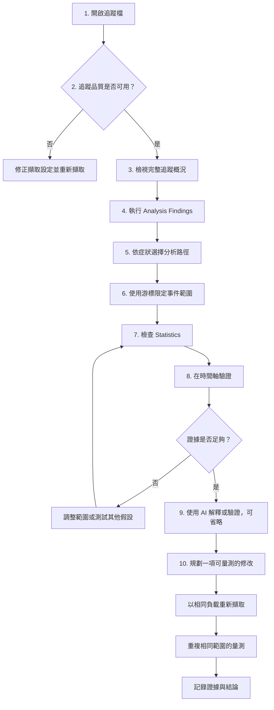
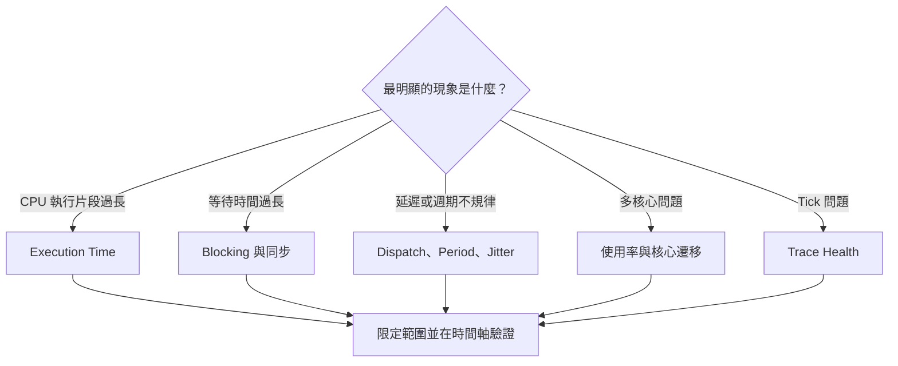
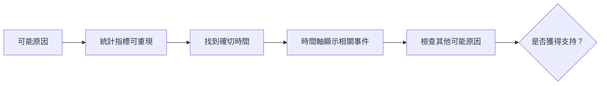

# BTFViewer 新手分析流程

本文件提供一套適合新手的 RTOS 排程追蹤分析流程，協助你從現象逐步找到可驗證的證據。

若要了解介面操作，請參閱 [`README.md`](README.md)；若要查詢統計指標的定義與限制，請參閱 [`STATISTICS_zh-TW.md`](STATISTICS_zh-TW.md)；若要設定 AI 或使用進階調查工具，請參閱 [`AI_zh-TW.md`](AI_zh-TW.md)。

> **核心原則：**追蹤資料與 Statistics 是實際量測的證據；Analysis Findings 是調查線索；AI 回覆是解讀；What-if 結果則是估算。

<a id="workflow-at-a-glance" name="workflow-at-a-glance">&#x200B;</a>

## 流程總覽

即使不使用 AI，也能完成這套流程。步驟 1～8 都以確定性的追蹤資料為基礎，應作為判斷結論的主要依據。

<a id="10-minute-first-pass" name="10-minute-first-pass">&#x200B;</a>

## 10 分鐘快速檢查

第一次開啟不熟悉的追蹤檔時，先依下列步驟快速檢查，不必從頭閱讀所有 Statistics 表格：

| 步驟 | 操作 | 結果 |
|---:|---|---|
| 1 | 開啟追蹤檔並選擇 **Fit** | 確認完整擷取範圍可見 |
| 2 | 開啟 **Load**，切換 **Task View** 與 **Core View** | 找出工作負載階段與整體活動狀況 |
| 3 | 開啟 **Statistics** 與 **Analysis** | 查看追蹤警告、事件群組與排序後的發現 |
| 4 | 查看 **Trace Health (TICK)** | 判斷時序資料是否可用，或 Tickless 行為是否符合預期 |
| 5 | 開啟最相關 Finding 指定的 Statistics 項目 | 避免檢查無關指標 |
| 6 | 按一下 **Max**、**p95**、資料列、圖表資料點或熱圖儲存格 | 跳到實際量測的時間軸證據 |
| 7 | 設定 C1–C2，並啟用 **Limit to C1–Cn** | 排除無關的工作負載階段 |
| 8 | 重新檢查 Analysis 與 Statistics | 確認問題在限定範圍內仍然存在 |
| 9 | 視需要使用 **Investigate…**、**Verify with AI…** 或 **Explain region** | 讓 AI 解釋已找到的證據 |
| 10 | 保存證據，並在修改後重複相同量測 | 保留並驗證分析結果 |

<a id="before-you-start" name="before-you-start">&#x200B;</a>

## 開始前的準備

請盡可能準備下列資訊：

- 包含異常或效能問題時段的追蹤檔。
- 預期的工作負載、工作名稱、優先權、截止期限與 CPU 預算。
- 大致的事件時間，或能穩定重現問題的方式。
- 分析派送延遲、生命週期、互斥鎖、佇列、區間或優先權繼承時所需的 STI 事件。

BTFViewer 不會分析原始碼，也不會模擬 RTOS 排程器；它只能量測追蹤檔內實際記錄的事件。若追蹤資料未包含必要事件，應清楚註明限制，不要推斷出看似精確的數值。

## 1. 開啟並掌握追蹤內容

1. 開啟 `.btf`、壓縮 BTF 或封裝檔。
2. 選擇 **Fit**，先查看完整擷取範圍。
3. 先用 **Task View** 找出執行中的工作，再切換至 **Core View** 檢查多核心配置。
4. 開啟 **Load**，觀察 CPU 使用率隨時間的變化。
5. 將滑鼠移到代表性的執行片段上，確認工作、核心、開始時間與持續時間。

此時先辨識階段，不要急著判定原因，例如：啟動、穩定執行、突發負載、閒置與結束階段。

## 2. 先檢查追蹤品質

開始診斷應用程式前，先開啟 **Statistics**，查看 **Summary** 與 **Trace Health (TICK)**。

請確認：

- Tick 資料是否缺漏或不規律。
- 是否出現大型間隙，或擷取時間短於預期。
- 分析所需的 STI 通道是否存在。
- 預期出現的工作或核心是否缺少。
- 追蹤範圍是否真的包含使用者回報的問題。

若擷取品質不佳，請先重新擷取。追蹤中的空白不代表系統處於閒置狀態；缺少某項事件，也不代表該事件從未發生。

出現 **TICKLESS** 不一定代表錯誤。若系統在閒置期間本來就會抑制 Tick，請用游標限定忙碌時段，再次檢查 Trace Health。

## 3. 建立完整追蹤的基準

限定範圍之前，先查看下列 Statistics 項目：

| 檢查項目 | 用途 |
|---|---|
| **Summary / Core utilisation** | 確認追蹤時間、工作、核心、總負載與負載平衡 |
| **Top tasks by CPU** | 找出占用最多 CPU 時間的工作 |
| **Core Time Breakdown** | 比較各核心的 Active、Idle、Tick 與 Gap 時間 |
| **Execution Time Per Slice** | 掌握一般與最差的單次執行時間 |
| **Blocking Time** | 找出離開 CPU 過久的工作 |
| **Core Migrations** | 找出頻繁在核心間移動的工作 |
| **Timeline Anomalies / Worst Events** | 找出值得檢查的異常區域與離群事件 |

不要只看平均值。若有資料，請同時比較 **Avg**、**p95**、**p99** 與 **Max**。若最大值很高、平均值卻正常，通常代表問題只出現在短暫時段，應另行限定範圍分析。

## 4. 執行確定性初步分析

按一下 **Analysis**，開啟目前 Statistics 範圍的 **Analysis Findings**。

針對每項相關發現：

1. 記下嚴重程度、工作或核心、相關指標，以及建議查看的 Statistics 項目。
2. 將發現視為待驗證的假設，不要直接當成根本原因。
3. 開啟指定的 Statistics 項目，確認能否重現報告中的數值。
4. 若發現內容提供合適的時間範圍，可使用 **Apply cursors**。

若沒有明顯發現，請先查看 **Timeline Anomalies**、**Worst Events**，再依下表選擇分析路徑。

## 5. 依症狀選擇分析路徑

| 觀察到的症狀 | 從這裡開始 | 接著交叉檢查 |
|---|---|---|
| 問題不明 | **Analysis Findings** | Timeline Anomalies、Worst Events、Task Health |
| 工作執行時間過長 | **Execution Time Per Slice** | Preemption Chain、Mutex Blocking、Critical Path |
| 工作等待時間過長 | **Blocking Time** | Preemption Chain、Mutex / Semaphore、Waiter × Owner |
| 工作已就緒但很晚才執行 | **Dispatch / Scheduling Latency** | Blocking、Preemption、STI ready/resume 事件 |
| 超過截止期限或 CPU 預算 | **Deadlines / CPU budget** | Execution p95/p99/Max、Period / Jitter、Critical Path |
| 啟動週期不規律 | **Period / Jitter** | Inter-Arrival Time、Unified Jitter、Recurring Patterns |
| Tick 抖動或遺漏 | **Trace Health (TICK)** | Tick Distribution、忙碌時段的 Execution Max |
| 多核心負載不平均 | **Core utilisation** | Task × Core、Concurrent Core Active、Core Time Breakdown；**Load Balance Score** |
| 核心頻繁遷移或來回跳動 | **Core Migrations** | Heatmap、Corridor Inspector、Core Affinity、mutex bounces |
| 優先權反轉 | **Priority Inheritance** | Mutex pairing、Mutex Blocking、Waiter × Owner |
| 鎖定或佇列延遲 | **Mutex / Semaphore / Queue** | Blocking Time、Critical Path、Migrations |

### 症狀分流圖

## 6. 使用游標限定單一事件

不要一直分析整份追蹤檔；請將範圍縮小到一個有意義的時段。

1. 按一下 Statistics 列、百分位數、圖表資料點或發現項目，跳到離群事件。
2. 將 **C1** 放在疑似原因之前，將 **C2** 放在可見結果之後。
3. 選擇 **Zoom to cursor range**。
4. 在 Statistics 啟用 **Limit to C1–Cn**。
5. 重新開啟 **Analysis**，讓 Findings 使用相同範圍。
6. 在最重要的證據時間加入書籤或註解。

範圍必須包含事件前後足夠的上下文。範圍過大時，無關活動可能主導統計結果；範圍過小時，則可能排除真正的觸發事件。

> **可見範圍注意事項：**核心遷移的 **Heatmap / Chord** 檢視器使用時間軸目前顯示的範圍，不會跟隨 **Limit to C1–Cn** 核取方塊。頂端橫幅在 Fit to window 時顯示 **Full view**（含完整時間範圍），縮放後改為橘色 **Viewport view**（含目前可見範圍）。若要讓檢視器對齊 C1–Cn，請先縮放至游標範圍再開啟。

## 7. 先量測，再解釋

針對可疑的工作或核心，記錄下列資料：

- 限定範圍內的 **Avg**、**p95**、**p99** 與 **Max**。
- 離群事件的時間與持續時間。
- 事件發生前正在執行的工作與核心。
- 相關的搶佔、阻塞、核心遷移、互斥鎖、佇列或 STI 事件。
- 相同行為是否在追蹤檔的其他位置重複出現。

若已知工作名稱、核心、核心遷移、STI 事件、區間、生命週期事件或同步物件指標，請使用 **Find**。若同類問題重複出現，請查看 **Recurring Patterns**。

## 8. 在時間軸驗證假設

有效的結論必須能將統計數值連結到時間軸上的可見事件。

請逐項確認：

1. 在游標範圍內，Statistics 是否能重現該數值？
2. 是否能跳到顯示該事件的確切時間？
3. 工作、核心、持續時間與前後事件是否符合假設？
4. 兩者之間是因果關係、相關性，還是只有時間相近？
5. 哪一項證據可以推翻這個假設？
6. 是否有更簡單的其他原因，也能解釋相同資料？

建議使用下列信心標示：

| 信心程度 | 最低證據要求 |
|---|---|
| **已確認** | 指標可重現、時間軸事件吻合，且修改前後的量測結果符合預期 |
| **有證據支持** | 指標可重現且時間軸吻合，並已檢查其他可能原因 |
| **可能** | 部分證據吻合，但缺少必要事件或關係 |
| **不支持** | 限定範圍的統計或時間軸內容與假設矛盾 |

兩個事件在時間上接近，不足以證明因果關係。

### 何時應停止深入調查

符合下列任一條件時，請停止深入檢查並記錄目前結果：

- 實際量測的證據已能解釋問題現象。
- 選取正確的工作負載階段後，原先懷疑的問題已消失。
- 缺少必要的插樁資料，因此無法驗證假設。
- 下一個有效步驟是修改韌體或設定，並重新擷取追蹤資料。

達到上述條件後繼續查看更多表格，通常只會增加細節，不會提高結論的可信度。

### 選用的合規檢查

若已知預期設定，可使用下列項目確認實際行為是否符合規格：

| Statistics 項目 | 檢查內容 |
|---|---|
| **Core Affinity** | 實際執行核心是否符合設定的親和性遮罩 |
| **Task Lifecycle** | 建立、暫停、恢復與刪除行為是否符合預期 |
| **Deadlines / CPU budget** | 違規判定是否採用真正的工程限制；設定門檻的單位為奈秒 |
| **Tag Analysis** | 應用程式自訂數值是否維持在限制範圍內 |
| **Interval Analysis** | 已插樁區間是否符合持續時間預算 |

## 9. 限定範圍後再使用 AI Assistant

AI 並非必要功能。選定發現、工作、事件或游標範圍後，AI 才能提供較有價值的協助。

| 目的 | 建議入口 | 必須自行驗證的內容 |
|---|---|---|
| 解釋一項發現 | 選取發現 → **Explain…** | 指標名稱與時間 |
| 檢查一項發現 | **Verify with AI…** | 支持與反對證據 |
| 調查一段時間 | 設定兩個以上游標 → **Explain this region with AI** | 每個 `jump:TIME` 都位於 C1–Cn 內 |
| 調查單一執行片段 | 按右鍵 → **Ask AI about this event** | 工作、核心、持續時間與鄰近 STI 事件 |
| 執行引導式調查 | **Investigate…** 或 **Auto investigate…** | 範圍、工具結果、證據品質與其他原因 |

建議的 AI 使用順序：

若 AI 的說法無法在 Statistics 重現、引用游標範圍外的時間、把估算結果當成量測值，或假設追蹤檔未記錄的事件，就不應採用該說法。

**Start Investigation**（紀錄為空時）會執行 **Auto investigate**。重新啟動後，只有當紀錄仍有 user 或 assistant turn 時才會還原 **Current Issue** card。**Ctrl+K** 可開啟 Analysis、AI、Compare、workspace presets 與 Inspect task。工具列 **Compare** 提供 **Save as baseline** / **Score vs baseline**；**Trends** 頁面會列出所有已開啟的分頁。

## 10. 測試一項可量測的修改

當證據足以支持某個原因後：

1. 定義一項修改，例如核心親和性、優先權、互斥鎖範圍、工作週期或工作負載分配。
2. 修改韌體或設定前，先寫下預期改善的指標。
3. 可使用 **What-if** 或 **Optimize** 排列候選方案，但其結果只是啟發式估算，不是排程器模擬。
4. 重現相同工作負載並擷取新的追蹤檔。
5. 在新的追蹤檔中選擇相同的工作負載階段，並使用等效的游標範圍。
6. 重複原本調查使用的 Statistics 量測。
7. 同時檢查目標指標與可能的副作用，並記錄差異。

驗收條件範例：

- Execution p99 降低，且 Deadline Misses 沒有增加。
- Blocking Time 降低，且核心遷移或 CPU 負載不平衡沒有明顯惡化。
- 核心遷移次數降低，且固定工作的核心沒有過載。
- 負載平衡改善，同時維持相近的吞吐量與時序表現。

若結果不符合預測，應修改原本的假設，而不是勉強調整解釋來符合結果。

## 11. 完成調查

記錄足以讓其他工程師重現結論的資訊：

- 追蹤檔名稱與擷取條件。
- 完整追蹤範圍與游標限定範圍。
- 問題現象及受影響的工作或核心。
- 基準量測值與確切證據時間。
- 獲得支持的原因、其他可能原因，以及缺少的證據。
- 實際修改內容與預期結果。
- 修改後數值，以及與原始量測結果的差異。
- 最終信心程度，以及是否需要再次擷取。

可使用書籤與註解保留重要時間點，並視需要匯出 HTML/CSV 報告、加註快照、選取範圍的 BTF，或完整的 Investigation Case。

<a id="beginner-checklist" name="beginner-checklist">&#x200B;</a>

## 新手檢查清單

- [ ] 我先檢查追蹤品質，再分析應用程式行為。
- [ ] 我先查看完整追蹤，再縮小分析範圍。
- [ ] 我將 Analysis Findings 視為線索，而不是事實。
- [ ] 我至少設定兩個游標，並啟用 **Limit to C1–Cn**。
- [ ] 我查看分布或百分位數，而不是只看平均值。
- [ ] 我已在 Statistics 重現相關數值。
- [ ] 我已在時間軸確認確切事件。
- [ ] 我已考慮矛盾證據與其他可能原因。
- [ ] 我已清楚標示估算結果與追蹤資料的限制。
- [ ] 修改後，我以相同工作負載重新擷取，並重複相同範圍的量測。

<a id="common-mistakes" name="common-mistakes">&#x200B;</a>

## 常見錯誤

| 錯誤做法 | 建議做法 |
|---|---|
| 一開始就讓 AI 分析整份追蹤檔 | 先選擇發現或設定游標範圍 |
| 將 Max 視為保證的 WCET | 說明它只是本次擷取中觀察到的最大值 |
| 只查看 Avg | 同時查看 p95、p99、Max 與資料分布 |
| 將所有離開 CPU 的時間都視為互斥鎖等待 | 先確認同步事件，否則只能稱為 Blocking |
| 比較不同的工作負載階段 | 對齊擷取條件與游標範圍 |
| 因為事件相關就判定具有因果關係 | 檢查事件順序、其他原因與矛盾證據 |
| 將 What-if 當成實際量測結果 | 重新擷取並重複相同的 Statistics 量測 |
| 追蹤品質不佳仍繼續分析 | 先修正插樁或擷取設定 |

<a id="documentation-navigation" name="documentation-navigation">&#x200B;</a>

## 文件導覽

- [`README.md`](README.md) — 安裝、介面操作、時間軸瀏覽、匯出與 [Demo](README.md#demo)
- [`STATISTICS_zh-TW.md`](STATISTICS_zh-TW.md) — 指標定義、公式、解讀方式與限制
- [`AI_zh-TW.md`](AI_zh-TW.md) — AI 模型、工具、隱私、調查引擎與評估方式
- [`WORKFLOWS.md`](WORKFLOWS.md) — 英文版
