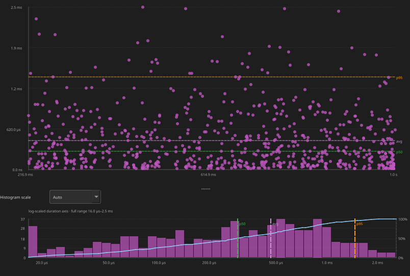
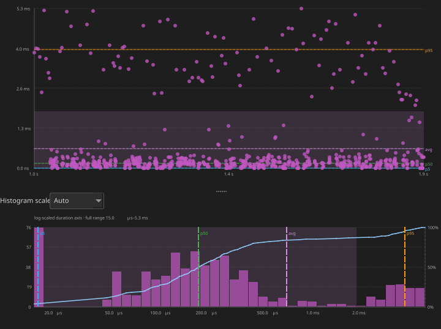
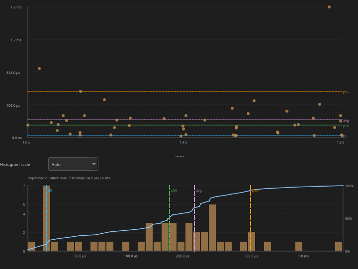
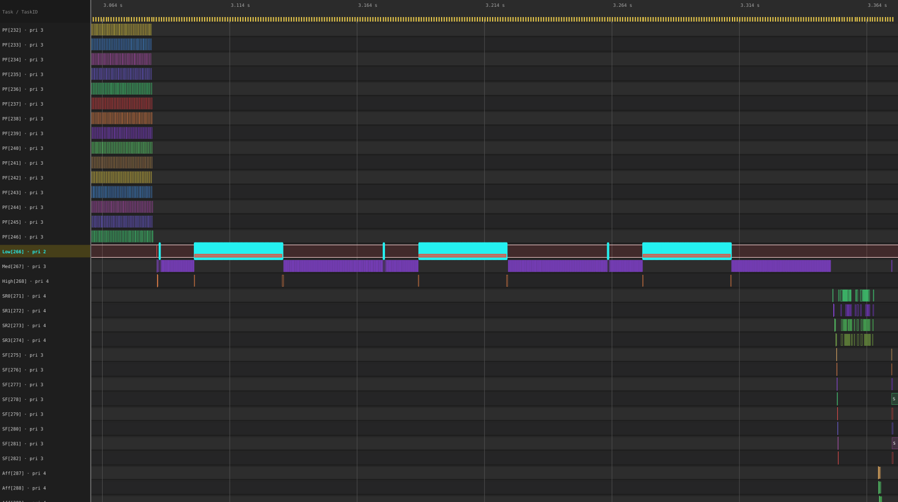
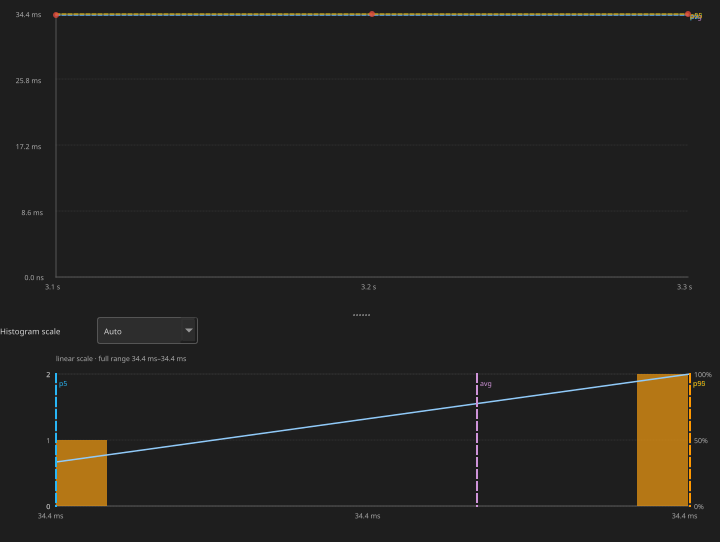
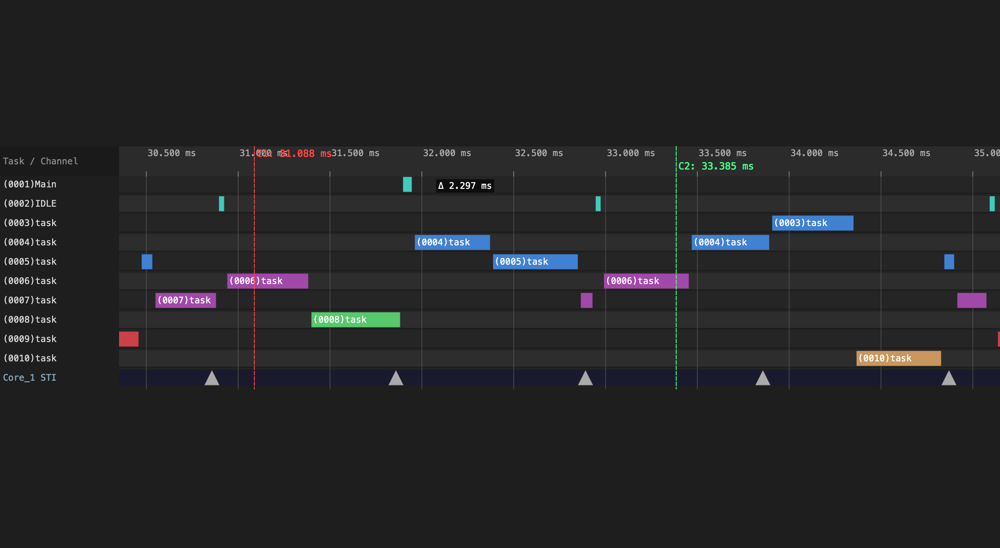

<!-- _class: title -->

# BTF Viewer

## Top-Down RTOS Scheduler Analysis

Worked example: `example-8cores.btf.gz` — from system health to recommendations

---

# Why Top-Down?

Real-time systems fail in subtle ways — a task that **almost** meets its deadline, cores that are **almost** balanced, a mutex that **occasionally** bounces across cores.

Static review cannot reveal these patterns. Trace-driven analysis gives **evidence**.

## The Ladder (match WORKFLOWS.md)

```
① System health     TICK, span, instrumentation
② Core balance      Utilisation + Load Balance Score
③ Task CPU / WCET   Top Tasks → Execution Max
④ Latency           Blocking → Preemption Chain
⑤ Concurrency       Migrations → Mutex → Priority Inheritance
⑥ Compliance        Affinity · Lifecycle · Deadlines · Tags
```

**Drive it:** toolbar **Analysis** → open named Statistics sections → click Max / scatter / heatmap → scope with cursors when the file mixes test phases.

---

# Worked Sample — `example-8cores`

```bash
python builds/btf_viewer.py ../tracedata/example-8cores.btf.gz
python builds/btf_viewer.py report ../tracedata/example-8cores.btf.gz \
    --output report.html --format html
```

| Field | Measured |
|-------|----------|
| Span | **2.358 s** (`#timeScale us`) |
| Cores / tasks / segments | **8** / **154** / **31 141** |
| Context switches / migrations | **31 133** / **18 992** |
| TICK | **WARNING / TICKLESS** — 2496 ticks, CV **35.9 %**, missed ≈ **8** |

> This file concatenates intentional stress tests (CS thrash, locks, priority inversion, suspend/resume, affinity). A **warning** may be expected for that phase — **Limit to cursor range** before calling it a product defect.

---

<!-- _class: section-header -->

# ① System Health
## Orient + Trace Health (TICK)

---

# Load & Orient

```bash
python builds/btf_viewer.py ../tracedata/example-8cores.btf.gz
# smoke: ../tracedata/example-2cores.btf.gz  ·  Web Demo embeds example-2cores
```

| # | Action | Why |
|---|--------|-----|
| 1 | Status bar + `Ctrl+0` | Span, counts; **Fit to Window** |
| 2 | Toolbar **Task** + **Load** | Task View; CPU Load strip |
| 3 | Click a task label | Lock-highlight → others gray out; Load shows **that task’s** usage **on each core** |
| 4 | **Statistics** + **Analysis** | Summary + heuristic triage |
| 5 | **Trace Health (TICK)** | Timer health before trusting derived metrics |

```bash
snapshot … --view timeline --view-mode task --task "CS[22]" --cpu-load
# omit --lo/--hi → Fit to Window
```


*`CS[22]` locked in Task View at Fit to Window; other tasks grayed; CPU Load = per-core sparklines for that task.*

---

# Tick Health on `example-8cores`

**Statistics → Trace Health (TICK)** → **Tick Distribution…**

| Metric | Value |
|--------|-------|
| Mode | **TICKLESS** (CV 35.9 % ≫ 5 %) |
| Avg period / max gap | 944 µs / **2.481 ms** |
| Missed (est.) | **8** large gaps |


**Recommendation:** Scope a **busy** CS window before chasing missed ticks — many gaps sit in idle stretches between suite phases. Product hard-RT builds should capture with tickless off and expect CV ≪ 5 %.

---

<!-- _class: section-header -->

# ② Core Balance
## CPU Utilisation — Score + σ Gauges

---

# Is the Workload Distributed?

Side-by-side gauges: **Load Balance Score** and **Std Deviation (σ)**.

$$\text{Load Balance Score} = 100 \times (1 - \text{Gini})$$

| Signal | Meaning |
|--------|---------|
| Gauge **red** / **Unbalanced** | Score **&lt; 70 %** (red zone) |
| Gauge **amber** | Score ≥ 70 % and population σ **&gt; 30 %** |
| **Analysis** warning | Score **&lt; 70 %** *or* σ **&gt; 30 %** |
| “Reasonably balanced” | Score **≥ 85 %** and σ **≤ 30 %** |

## `example-8cores` result

| Core util (excl. IDLE/TICK) | ~60–77 % across Core_0…7 |
| **Load Balance Score** | **95 %** (G = 0.049) |
| **σ** | **6.0 %** |

<span class="pill pill-ok">OK</span> Analysis: cores look reasonably balanced — **not** the primary problem.

**Escalate only if:** one core > 90 % (Affinity) · one core stuck low (Mutex / Preemption) · high IDLE everywhere (TICK / tickless).

---

<!-- _class: section-header -->

# ③ Task CPU / WCET
## Top Tasks & Execution Time

---

# Who Consumes the CPU?

**Top Tasks** on this sample = equal-priority CS workers:

| Task | CPU % | Max slice | p95 |
|------|-------|-----------|-----|
| CS[28] | **15.9 %** | **3.623 ms** | 1.631 ms |
| CS[11] | 15.3 % | 2.486 ms | 1.628 ms |
| CS[24] | 15.3 % | 3.283 ms | 1.644 ms |
| … CS[*] | ~14–15 % each | ~2.5–3.5 ms | ~1.5 ms |

## Finding WCET

1. **Execution Time Per Slice** → sort **Max** → click link to zoom + annotate
2. If Max ≫ p95 → rare spike; use **p95** for design margin
3. Check neighbours / **Preemption Chain** at that instant

**Recommendation:** Cap equal-priority fan-out or affinity-pin workers; set deadline thresholds (e.g. `CS[28]=2000000` ns) for pass/fail.

---

# Execution Time Distribution



*Scatter + histogram/CDF. Click Max on CS[*] (~3 ms) — long vs 1 ms tick; contributes to tick stretch when those tasks run.*

---

# Timing Relationships


| Metric | Meaning |
|--------|---------|
| **Execution** | On-CPU slice |
| **Blocking** | Off-CPU gap (≡ Tracealyzer *Response Time*) |
| **Inter-Arrival** | Execution + Blocking |

Which one is inflated tells you where to drill next.

---

<!-- _class: section-header -->

# ④ Latency
## Blocking Time & Preemption

---

# Blocking on `example-8cores`

**Statistics → Blocking Time** — Analysis warns on top gap counts.

| Task | Max block | Reading |
|------|-----------|---------|
| High[268] | **~53 ms** | Inversion demo waiter |
| Low[266] / Med[267] | **~35–40 ms** | Test 8 geometry |
| CS[*] | ~5–6 ms | Peer contention + migration |
| Runner[1] | hundreds of ms | Orchestrator sleep — **ignore** |

## Decision tree

| Pattern | Next |
|---------|------|
| Spikes + one preemptor | **Preemption Chain** |
| ≈ mutex hold | **Mutex/Semaphore** — shorten CS |
| ≈ tick period | Priority / tickless |

**Recommendation:** Cursor-scope the Low/Med/High window (~3.085–3.310 s); do not treat Runner sleeps as latency bugs.

---

# Blocking & Preemption Charts

<div style="display:grid;grid-template-columns:1fr 1fr;gap:1rem">





</div>

*Left: blocking clusters. Right: preemption overlaps — top pairs are CS[*]↔CS[*] peer interference (e.g. CS[25]←CS[19]).*

---

<!-- _class: section-header -->

# ⑤ Concurrency
## Migrations · Locks · Priority Inheritance

---

# Core Thrashing (CS Storm)

**Analysis:** *Excessive bouncing / core thrashing* — expected for test 1.

| Task | Migr | Rate | Dwell | Ping |
|------|------|------|-------|------|
| CS[18] | 586 | **~1692 /s** | 476 µs | 24 |
| CS[21] | 580 | ~1648 /s | 494 µs | 19 |
| Trace-wide | **18 992** migrations | | | |

## See hops on the timeline

**Task View** → click `CS[22]` to lock-highlight (others gray out; no filter).  See also `tasks-cpu-load-cs22.svg`.  Headless burst window:

```bash
snapshot … --view timeline --view-mode task --task "CS[22]" \
    --lo 1805000 --hi 1865000
```

*`CS[22]` locked in the CS burst (~60 ms).  Then **Core Migrations** (Primary / Rate / Ping) → **Core-Pair** / **Heatmap** / **Chord** for traffic on a specific core.*

**Recommendation (product):** Affinity-pin latency-critical / lock-sharing tasks; fewer equal-priority runnables.

---

# Migration Heatmap

<div style="display:grid;grid-template-columns:1fr 1fr;gap:1rem">


</div>

*Level 1: core-pair × 32 time bins → Level 2: per-task sub-bins → click to zoom/filter.*

| Metric | Red flag |
|--------|----------|
| Rate + short dwell | Ping-pong thrash |
| Lock-bounce % | > ~5 % on latency paths |

---

# Mutex / Queue Core Bounces

| Object | Holds | Bounces | Note |
|--------|-------|---------|------|
| queue `0x80021990` | 864 | **858** | Extreme cross-core holds |
| mutex `0x80021920` | 864 | 6 | Warning + issues |
| several sems | few | 2–5 | Unmatched / bounce warnings |

**19** sync objects with Core bounce > 0; **6** migration-while-held style issues.

**Recommendation:** Co-locate producers/consumers on one affinity mask; shorten holds; treat Warning pairing rows on the timeline (demo teardown can leave unpaired STI — confirm outside the suite).

---

# Priority Inversion — L/M/H

| Task | Base→Peak | Boosted | Pattern |
|------|-----------|---------|---------|
| Low[266] | 2→4 | **103.3 ms** | **Mutex inherit** ✅ |
| PS[228] | 2→4 | 119 µs | **L/M/H** ⚠ |



*Three red inherit stripes on `Low[266]` (test 8). Kernel inheritance works; still review any L/M/H row.*

**Recommendation:** Keep inheritance on; shorten critical sections; snapshot `--lo 3042000 --hi 3359000` (µs).

---

# Priority Boost Chart



*Click a point → zoom + annotate that episode. Red = mutex inherit; orange = manual boost.*

---

<!-- _class: section-header -->

# ⑥ Compliance
## Affinity · Suspend/Resume · Deadlines · Tags

---

# Affinity & Suspend/Resume

## Core Affinity (test 10)

`Aff[287]`…`Aff[298]` masks `0x1`…`0x80` — observed only on matching cores; `AffM[299]` mask change OK. **No violations.**

→ Use the same pin pattern for IO / shared-lock tasks; re-check after every affinity change.

## Task Lifecycle (test 9)

| Subjects | Susp/Res | Meaning |
|----------|----------|---------|
| SR0…SR3 | **4/4** each | 2 patterns × `T9_ROUNDS=2` |

Blocked + running suspend patterns; staggered `resume` STI across cores. Navigator pan sits **above** CPU Load while zoomed.

> Susp/Res = explicit API only; **Runs** ≫ Res.

---

# Deadlines, Scope, Tags

**Settings → Analysis thresholds** — e.g. CPU budget `25` %, `CS[28]=2000000` (ns).

**Cursors:** place C1…Cn → **Limit to cursor range** → Analysis + all tables recompute.



**Tags / intervals**

```c
trace_tag_emit(0, (int)value);
trace_interval_start(1); /* … */ trace_interval_stop(1);
```

`tag0_event` on this sample: **2357** samples (min 8 144, avg ≈ 34 631, max 45 392, p95 41 936).

---

# Tag Waveform


*Bind channels to real budgets (heap, queue depth). Rising max/p95 across builds → Trace Compare.*

---

<!-- _class: section-header -->

# Verdict & Next Steps
## Recommendations · Compare · Export

---

# Performance Verdict — `example-8cores`

| Pri | Finding | Verdict | Action |
|-----|---------|---------|--------|
| P0 | CS Migr ~1.6k/s, dwell ~0.5 ms | Stress artefact | Affinity-pin; cut equal-priority fan-out |
| P0 | Queue **858** core bounces | Shared objects across cores | Co-locate; shorten holds |
| P1 | L/M/H on PS[228]; High block ~53 ms | Demo inversion | Keep inherit; audit critical sections; deadlines |
| P1 | CS WCET ~3.6 ms vs 1 ms tick | Stress length | Budget slices; tickful re-capture |
| P2 | TICKLESS CV 35.9 % | Idle between tests | Scope busy windows |
| OK | Score 95 %, σ 6 %; Affinity; SR 4/4 | Healthy / correct | Keep as CI regression checks |

---

# Before / After & Export

```bash
python builds/btf_viewer.py compare before.btf.gz after.btf.gz \
    --output compare.html --format html \
    --name-a "Before" --name-b "After"

# --lo/--hi = raw #timeScale (us here), not nanoseconds
python builds/btf_viewer.py report ../tracedata/example-8cores.btf.gz \
    --output pi.html --format html --lo 3042000 --hi 3359000

# Highlight a migrating task across cores (Core View)
python builds/btf_viewer.py snapshot ../tracedata/example-8cores.btf.gz \
    -o migrate.svg --view timeline --view-mode core --task "CS[22]" \
    --lo 1805000 --hi 1865000
```

**Success Δ to watch:** lower CS Migr rate / Ping · lower queue Bounces · High Max block stable or down · Score still ≥ 85 % with σ ≤ 30 %.

| Export | How |
|--------|-----|
| Findings | Toolbar **Analysis** → Save as text / HTML report card |
| Stats | Export CSV/HTML |
| Perfetto | File → Export Perfetto… / `perfetto` CLI |

---

# Symptom → Root Cause Map

| Symptom | Start here | Then |
|---------|------------|------|
| Unknown — triage | Toolbar **Analysis** | Named Statistics sections |
| Tick / tickless | Trace Health | Scope busy window; Execution Max |
| Uneven SMP load | Core Utilisation | Migrations · Affinity |
| Slice too long | Execution Max/p95 | Preemption · Mutex |
| Waits too long | Blocking | Preemption · Mutex · Inter-Arrival |
| Priority inversion | Priority Inheritance | Mutex · Blocking |
| Core thrashing | Migrations (Rate, Ping) | Core View highlight · Heatmap · Bounce % · Affinity |
| Lock / queue issues | Mutex/Semaphore | Blocking · Migrations |
| Suspend/resume | Task Lifecycle | Timeline STI · test 9 |
| Custom metric | Tag / Interval | Owning task Execution |

---

<!-- _class: title -->

# Start at the Top

## Analysis → ladder → evidence → fix → compare

System → Core balance → Task timing → Latency → Concurrency → Compliance

&nbsp;

**Load `example-8cores.btf.gz`, open Analysis, drill only where findings point.**

---

<!-- _class: title -->

# Demo

## Walk the hierarchy on the 8-core sample

```bash
cd BTFViewer
python builds/btf_viewer.py ../tracedata/example-8cores.btf.gz
# Web smoke: builds/btf_viewer.html → Demo (example-2cores)
```

1. **Analysis** findings  
2. Core util (Score 95 %) → CS Top Tasks → Migrations  
3. Cursor-scope test 8 for PI stripes · test 9 for SR* 4/4  
4. Export HTML report for the improvement plan
