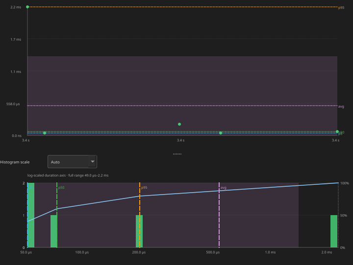

<!-- _class: title -->

# BTF Viewer

## Quick Metric Check Guide

Open **Analysis** → follow findings down the ladder → stop when evidence explains the symptom

---

# How to Check Fast

| Step | Action |
|------|--------|
| 1 | Open **Statistics** + toolbar **Analysis** |
| 2 | Open only the sections named by findings |
| 3 | Click **Max** / row / chart point / heatmap cell to jump the timeline |
| 4 | Place cursors + **Limit to C1–Cn** for mixed-phase traces |
| 5 | Optional: Analysis **Investigate…** / **Verify with AI…** ([WORKFLOWS §7](WORKFLOWS.md#7-ai-assistant-flow)) |

```text
① Health      Trace Health (TICK)
② Balance     Core Utilisation → Breakdown / Concurrent / Switch
③ WCET        Top Tasks → Execution Time (Max)
④ Latency     Blocking → Dispatch → Preemption
⑤ Concurrency Migrations → Heatmap/Chord → Mutex → Priority Inheritance
⑥ Compliance  Affinity · Lifecycle · Deadlines · Tags
```

Default panel order (and CSV/HTML export) follows this catalogue. Toolbar **Heatmap** / **Chord** is viewport-scoped (zoom first) — not a Statistics section.

> Demo file `example-8cores.btf.gz` concatenates stress tests — scope a phase before treating a warning as a product defect.

---

<!-- _class: section-header -->

# ① System Health
## Confirm the timer before trusting timing metrics

---

# Trace Health (TICK)

**Where:** Statistics → **Trace Health (TICK)** → Tick Distribution…

| Check | Red flag | Next |
|-------|----------|------|
| Mode / CV | TICKLESS with CV ≫ 5 % | Scope a **busy** window; re-check |
| Large gaps / missed | Gaps only in idle stretches | Expected on tickless — not lost IRQs alone |
| Product hard-RT | Still not GOOD when busy | Capture tickful; expect CV ≪ 5 % |


*Sample: TICKLESS, CV 35.9 %. Compare tick policies with Trace Compare if needed.*

---

<!-- _class: section-header -->

# ② Core Balance
## Is work placed evenly — and are cores busy together?

---

# Core Utilisation

**Where:** Statistics → **Core Utilisation** (Load Balance Score + σ)

| Signal | Meaning |
|--------|---------|
| Score **&lt; 70 %** or σ **&gt; 30 %** | Analysis warning — imbalance |
| Score **≥ 85 %** and σ **≤ 30 %** | Reasonably balanced |
| One core &gt; 90 %, others idle | → **Core Affinity** |
| All high, one stuck low | → **Mutex** / **Preemption** |

Then check (same default order):

| Section | Quick question |
|---------|----------------|
| **Core Time Breakdown** | High **Gap %**? → switch cost |
| **Concurrent Core Active** | How often are *N* cores busy together? |
| **Kernel Switch Overhead** | Switch-gap Max / total % high? |


*Click a Concurrent / Switch row for the distribution chart.*

---

<!-- _class: section-header -->

# ③ Task CPU / WCET
## Who burns CPU — and how long is a single slice?

---

# Top Tasks & Execution Time

**Where:** **Top Tasks** → **Execution Time Per Slice** → sort **Max** → click **Max**

| Check | Red flag | Next |
|-------|----------|------|
| Top CPU tasks | Dominated by equal-priority workers | Cap fan-out or affinity-pin |
| Max ≫ p95 | Rare spike | Design on **p95**; inspect that Max |
| Max vs tick | Slice longer than tick period | Preemption / Mutex at that instant |


| Metric | Measures |
|--------|----------|
| **Execution** | On-CPU slice |
| **Blocking** | Off-CPU until next resume |
| **Dispatch** | Ready→run (create / `vTaskResume`) |
| **Inter-Arrival** | Start-to-start cadence |

---

<!-- _class: section-header -->

# ④ Latency
## Why did the task wait — or how long until it ran?

---

# Blocking → Preemption → Dispatch

**Blocking Time** — sort **Max** / **p95**; ignore orchestrator sleeps (`Runner`).

| Pattern | Open next |
|---------|-----------|
| Spikes + one preemptor | **Preemption Chain** |
| Aligns with lock hold | **Mutex / Semaphore** |
| Ready→run (resume/create) | **Dispatch / Scheduling Latency** |



*Dispatch: \(t_{\text{resume}}-t_{\text{ready}}\). Sync wakes not attributed yet. Click row / Min / Max.*

---

<!-- _class: section-header -->

# ⑤ Concurrency
## Thrashing, heatmap / chord, lock-bounce, priority inheritance

---

# Migrations & Lock Bounce

**Where:** **Core Migrations** → **Core-Pair** → toolbar **Heatmap** / **Chord** → **Mutex → Bounces**

| Signal | Red flag |
|--------|----------|
| High **Rate** + short **Dwell** + high **Ping** | A↔B thrashing (Ping = A→B→A ≤ 1 µs) |
| High Migr, low Ping | Spreads without oscillation |
| Core-Pair **Bounce %** high on a busy pair | Migration while mutex/queue held |

**Quick path:** Task view → lock-highlight + **Load** → sort Migrations by Ping/Rate → Core-Pair Bounce % → Heatmap **Lock Bounces Only**.

| Fix direction |
|---------------|
| Affinity-pin latency / lock-sharing tasks |
| Fewer equal-priority runnables |
| Co-locate producers/consumers on hot queues |

---

# Migration Heatmap / Chord

**Where:** toolbar **Heatmap** or **Chord** (same inspector, 2+ cores). Zoom the timeline first.

| Check | Meaning |
|-------|---------|
| Scope | Grid follows **viewport**, not cursor-scoped Statistics |
| Hot cells / ribbons | When & where hops burst (`cN→cM`) |
| **Lock Bounces Only** | Mutex/queue hops only |
| **Task filter** | Name substring or exact numeric id |
| Cell / ribbon → **Inspect** | Spotlight with C1–C2 |


*Core-Pair chart → **Open Heatmap** / **Open Chord** focuses that corridor.*

---

# Priority Inheritance

**Where:** **Priority Inheritance** (needs inherit STI)

| Pattern | Reading |
|---------|---------|
| **Mutex inherit** | Kernel boost working |
| **L/M/H** | Design review — medium between base and peak |
| **Boost only** | Manual / unexplained boost |


*Red stripe = inherit window. Click chart points to jump episodes.*

---

<!-- _class: section-header -->

# ⑥ Compliance
## Affinity · Lifecycle · Deadlines · Tags

---

# Pass / Fail Checks

| Section | Quick check |
|---------|-------------|
| **Core Affinity** | Observed cores ⊆ mask? Violations = 0 |
| **Task Lifecycle** | Susp/Res match; no run between suspend and resume |
| **Deadlines / CPU budget** | Set thresholds (ns); click violating slice |
| **Tag / Interval Analysis** | Bind channels to real budgets; compare builds |

**Thresholds:** Settings → Display → Analysis thresholds  
Example: `CS[28]=2000000` (**ns**) = 2 ms on a `us` trace.

**Cursors:** C1…Cn → **Limit to C1–Cn** → all tables + Analysis recompute.

---

# Symptom → Metric

| Symptom | Start here | Then |
|---------|------------|------|
| Unknown | **Analysis** | Named Statistics sections |
| Tick / tickless | Trace Health | Scope busy window |
| Uneven SMP | Core Utilisation | Concurrent · Migrations · Affinity |
| Rarely *N* busy | Concurrent Core Active | Affinity · Top Tasks |
| High switch cost | Kernel Switch Overhead | Breakdown Gap % |
| Slice too long | Execution Max / p95 | Preemption · Mutex |
| Waits too long | Blocking | Preemption · Mutex |
| Ready→run delay | Dispatch Latency | Blocking · Preemption |
| Thrashing | Migrations (Rate, Ping) | Task+Load · Heatmap / Chord |
| Lock-bounce | Core-Pair Bounce % | Heatmap **Lock Bounces Only** · Mutex Bounces |
| Priority inversion | Priority Inheritance | Mutex · Blocking |
| Before / after | Trace Compare | Same cursor phases |

---

# Checklist Card

```text
☐ Analysis findings reviewed
☐ Trace Health GOOD (or scoped busy window OK)
☐ Load Balance Score ≥ 85 % and σ ≤ 30 %  (or Affinity explained)
☐ Top Tasks + Execution Max within budget
☐ Blocking / Dispatch Max acceptable for critical tasks
☐ No thrashing (Rate/Ping/Dwell) on latency paths — confirm on Heatmap
☐ No hot lock-bounce pairs (**Lock Bounces Only**); Mutex Status clean
☐ Affinity / Lifecycle / Deadlines as required
☐ Export HTML or Trace Compare for the record
```

```bash
python builds/btf_viewer.py ../tracedata/example-8cores.btf.gz
python builds/btf_viewer.py report ../tracedata/example-8cores.btf.gz \
    --output report.html --format html
```

---

<!-- _class: title -->

# Start at the Top

## Analysis → ladder → evidence → fix

Drill only where findings point. Scope before you escalate.

AI templates follow the same ladder ([WORKFLOWS.md §7](WORKFLOWS.md#7-ai-assistant-flow)). Narrated tour: [README → Demo](README.md#demo).
