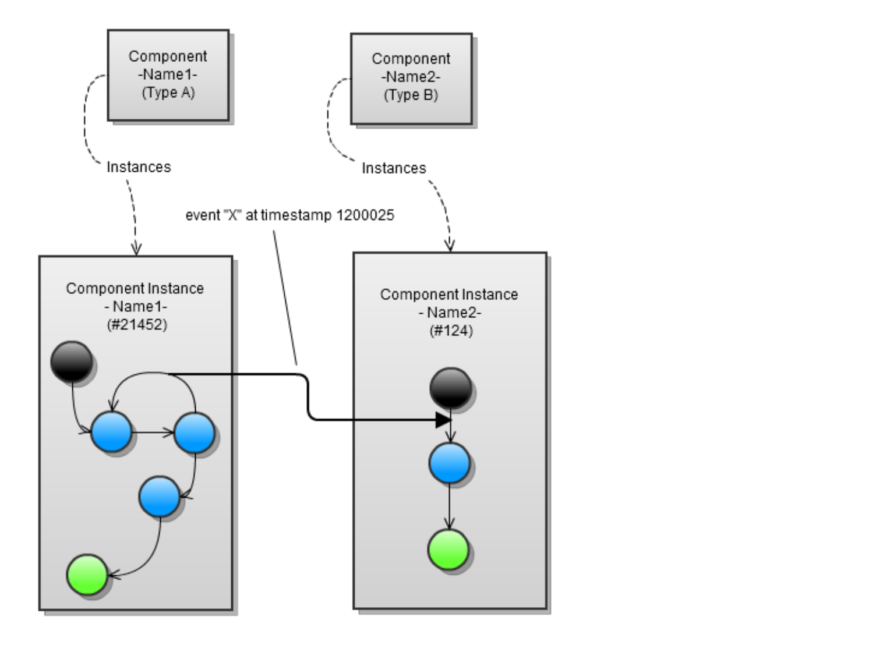
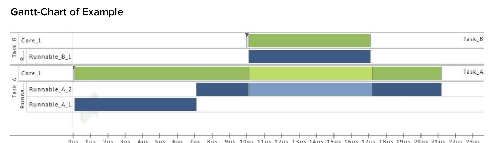
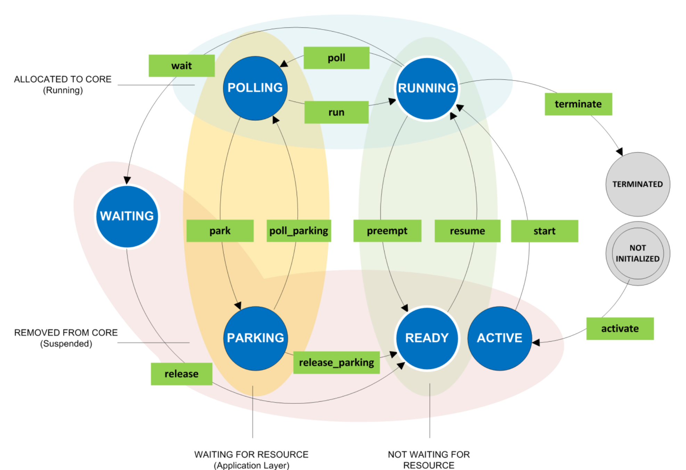
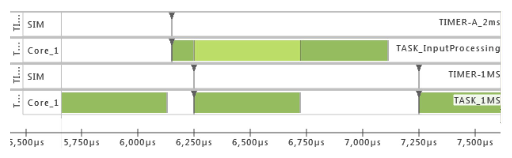
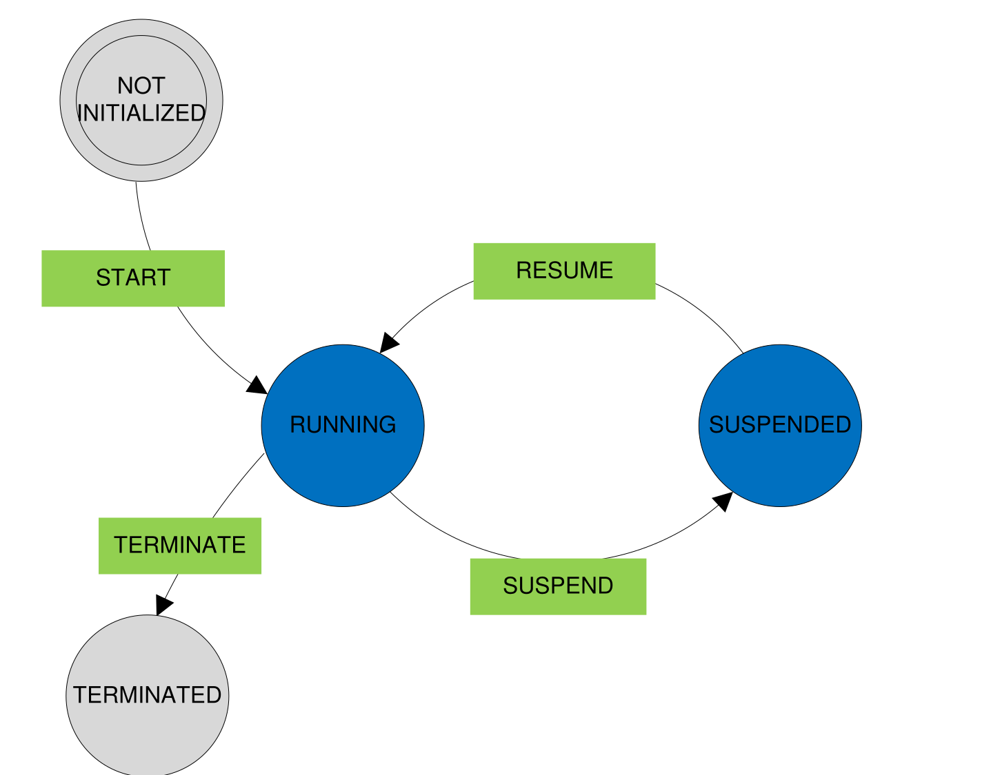
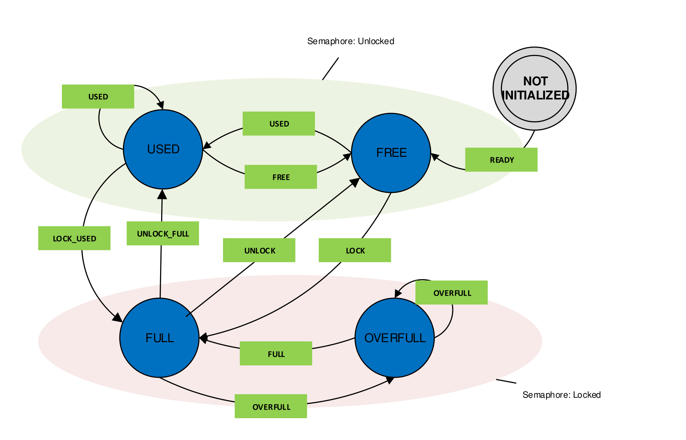

# BTF Specification

**Version:** 2.1.5  
**Publisher:** Vector Informatik GmbH  
**Source:** [Eclipse APP4MC archive](https://archive.eclipse.org/app4mc/documents/misc/BTF_Specification_2.1.5.pdf)

> This Markdown transcription preserves the structure and technical content of the source PDF. Figures are high-resolution PNG crops taken directly from the original PDF to preserve their original appearance. Minor typographic normalization was applied to line breaks, punctuation, and code formatting.

## Version history

| Version | Author | Date | Description |
| --- | --- | --- | --- |
| V1.0 | Timing-Architects | 2011-07-18 | Initial specification approved with thanks by Continental Automotive GmbH; extended by source-entity-instance column. |
| V2.0 | Timing-Architects | 2012-04-17 | Added new data types. |
| V2.0.1 | Timing-Architects | 2013-03-29 | Added state charts and description of all entities. |
| V2.0.2 | Timing-Architects | 2013-04-22 | First public release. |
| V2.1.0 | Timing-Architects; Robert Bosch GmbH | 2013-06-18 | Changed Process State Chart for compliance to OSEK 2.2.3 Extended Task Model; some improvements of description. |
| V2.1.1 | Timing-Architects | 2013-10-30 | Clarified description and examples regarding difference preempt/suspend for processes/runnables. |
| V2.1.3 | Timing-Architects | 2014-04-10 | Process state chart: changed layout according to OSEK state order. |
| V2.1.4 | Timing-Architects | 2015-03-24 | Added Scheduler, OS-Events, Semaphore-Events and Simulation-Events; updated examples; corrected diction of mtalimitexceeded; changed allowed source type for activating a process. |
| V2.1.5 | Timing-Architects | 2016-01-29 | Semaphore state chart: added missing state transition; updated Interrupt Service Routine abbreviation (I, not ISR); added System-Events; updated OS Events; improved SourceInstance in 2.3; corrected #typeTable; improved Source and Target in 2.3. |

*Note: In version key V x.x.y, x represents change in BTF; y is only a specification update.*

## License disclaimer

- BTF is accessible to everyone free of charge.
- BTF and Vector Informatik GmbH do not favor one implementer over another for any reason other than technical standards compliance of a vendor's implementation.
- BTF is published under royalty-free terms.
- BTF remains accessible and free of charge.
- BTF is documented in all its details; all aspects of the standard are transparent, and access to and use of the documentation are free.
- BTF is free for all to implement, with no royalty or fee. Certification of compliance by Vector Informatik GmbH may involve a fee.
- BTF implementations may be extended or offered in subset form. Certification organizations may decline to certify subsets and may place requirements on extensions.
- BTF extensions have to be integrated in BTF and published under this open-format license.

## Contents

- [1. Introduction](#1-introduction)
- [2. Structure of BTF file](#2-structure-of-btf-file)
  - [2.1 Header](#21-header)
  - [2.2 Data section](#22-data-section)
  - [2.3 Entities and events](#23-entities-and-events)
- [3. References](#3-references)

## List of figures

1. Schematic visualization of interaction between two entity instances
2. Gantt chart of example
3. Process state chart
4. Gantt chart of process example
5. Runnable state chart
6. Semaphore state chart

## List of tables

Tables 1 through 25 appear inline in the relevant sections below.

# 1. Introduction

This document specifies a tracing format for timing evaluation of event-based systems. BTF (Best Trace Format, originating from Better Trace Format, BTF V1.0) is a CSV-based ASCII format for representing event traces. It defines full-scale timing traces from simulator and profiling tools.

The Best Trace Format is based on the Better Trace Format initially defined by Continental Automotive GmbH. It supports chronologically correct analysis for timing, performance, and reliability evaluation. In the assumed signal-processing system, one component notifies another through events stored in the BTF file. Unlike compact debugger trace formats, a BTF event log contains the complete interaction: which component interacts with which other component through which event.

Advanced scheduling concepts on multicore systems may allow multiple simultaneous instances of one traced component, for example with global scheduling or task migration. Instance identification is therefore required to determine which instance is addressed. Each task execution can be identified throughout its lifetime, from activation to termination, by component name and instance counter.

The following figure shows component `Name1` instance `#21452` sending event `X` to component `Name2` instance `#124` at `t=1200025`. A component instance is generated from its parent component and duplicates its behavior, such as execution time according to a sequence. A component instance may also exist throughout the complete traced interval.



*Figure 1: Schematic visualization of interaction between two entity instances.*

# 2. Structure of BTF file

A BTF file consists of two parts:

1. A **header section** containing trace-object metadata and optional comments. Every line starts with `#`. Metadata uses pragma statements; a comment has whitespace immediately after `#`, distinguishing it from a pragma.
2. A **data section** containing simulation or measurement trace data. It consists of CSV lines and optional comment lines. Each line represents one traced-system event, with columns describing time, entities, and event.

The data section may use either symbolic or numeric representation. Symbolic mode names entities and events. Numeric mode uses identifiers, with the header providing mappings from numerical identifiers to names.

## 2.1 Header

The header contains parameters used to interpret the trace or describe the trace generator, plus comments. Parameters and comments are indicated by `#`. A typical header includes at least the BTF version, creator, creation date, and time scale; further information is optional.

### Comments

A row beginning with `#` followed by whitespace is a comment. Comments may appear in the header or at any point in the data section.

### Parameters

A row beginning with `#` immediately followed by a parameter definition is a parameter. The definition must not start with whitespace. If `-` follows `#`, the row is an entry in the most recently defined table, such as `typeTable`.

**Table 1: Parameters for the BTF header section**

| Parameter | Description | Type | Example |
| --- | --- | --- | --- |
| `#version` | Version of BTF format definition | String | `#version 1.0` |
| `#creator` | Name and version of the program or device which generated the trace | String | `#creator TA-Simulator (12.10.2.47)` |
| `#creationDate` | Timestamp of the start of simulation or measurement. The format has to comply with ISO 8601 extended specification: `YYYY-MM-DDTHH:MM:SS`. The time should be UTC (indicated by `Z`). | String (ISO 8601) | `#creationdate 2012-09-02T16:40:30Z` |
| `#inputFile` | Filename of the model used for the simulation | String (URI) | `#inputFile D:\Workspace\Project\DualCore.rte` |
| `#timescale` | Resolution of timestamps in the trace. Default unit: nanoseconds (`ns`). | String; enumeration: `ps`, `ns`, `us`, `ms`, `s` | `#timescale ns` |
| `#typeTable` | Begins a mapping from all entities to numerical Type-IDs. See Table 3. Type-IDs start with 0; missing IDs are allowed. | `-<n> String` | `#typeTable`<br>`#-0 T`<br>`#-1 R`<br>`#-2 SIG` |
| `#entityTable <n>` | Begins a mapping from all entities to numerical Entity-IDs. An entity can be a task, runnable, etc. IDs start with 0; missing IDs are allowed. | `-<n> String` | `#entityTable`<br>`#-0 Task_1ms`<br>`#-1 GetSignal`<br>`#-2 Main`<br>`#-3 Temperature` |
| `#entityTypeTable <n>` | Begins a mapping from all entities to types. Entity and type must have been defined in `entityTable` and `typeTable`. | `-<n> String` | `#entityTypeTable`<br>`#-T Task_1ms`<br>`#-R GetSignal`<br>`#-R Main`<br>`#-SIG Temperature` |

**Example header**

```text
#version 1.0
#creator TA-Toolsuite 12.06.1
# Simulation of dualcore processor 120MHz, 16Kbyte RAM
#creationDate 2012-08-31T15:53:00
#inputFile c:\TAsc\doc\examples\ems.tap
#timeScale ns
#typeTable
#-0 T
#-1 R
#entityTable
#-0 Task_1ms
#-1 Task_2ms
#-2 Runnable_1ms_Init
#-3 Runnable_2ms_Store
#-4 Runnable_2ms_Read
#entityTypeTable
#-T Task_1ms
#-T Task_2ms
#-R Runnable_1ms_Init
#-R Runnable_2ms_Store
#-R Runnable_2ms_Read
```

## 2.2 Data section

Trace information is represented in CSV. Each line describes one event, and its interpretation depends on the event type described in the next section. Fields are separated by commas. Floating-point values use a period as the decimal separator. A comment using the `#` pragma may appear anywhere in the trace section.

## 2.3 Entities and events

The data section is interpreted line by line. Each line has eight columns; the final column is optional:

```text
<Time>,<Source>,<SourceInstance>,<TargetType>,<Target>,<TargetInstance>,<Event>,<Note>
```

Column interpretation depends on `<TargetType>`.

**Table 2: Description of BTF columns**

| Column | Name | Description | Relevant entity type |
| --- | --- | --- | --- |
| 1 | Time | Integer timestamp for one action. Timescale is set by `#timescale`. | all |
| 2 | Source | Arbitrary but unique name for the source that triggers the event (for example, a core at task start or a stimulus at task activation). | all |
| 3 | SourceInstance | Instance counter for the source. Simulation entities use `-1`; other non-instanceable entities normally use `0`, except at initialization events. Instanceable entities such as stimuli start at 0 and increment for each instantiation. The field may be empty if no instance information exists. | all |
| 4 | Type | Type of the event target. | all |
| 5 | Target | Arbitrary but unique name for the target (for example, a task, runnable, or signal access). | all |
| 6 | TargetInstance | Instance counter for the target. | all |
| 7 | Event | Name of the event. | all |
| 8 | Note | Optional further information, such as a signal value at read or write access. | all |

The fourth column (`<TargetType>`) identifies the target entity type. The following entity types are defined.

**Table 3: Entity types**

| Category | Type-ID | Name | Description |
| --- | --- | --- | --- |
| Environment | STI | Stimulus | Trigger point for a Task or Interrupt-Service-Routine. |
| Software | T | Task (specialization of Process) | Object handled by the OS scheduler and calling all top-level Runnables. |
| Software | I | Interrupt-Service-Routine (specialization of Process) | Object handled by the interrupt-management unit and calling all top-level Runnables. |
| Software | R | Runnable | Object called by a Process or another Runnable. |
| Software | IB | Instruction block | Sub-fraction of a Runnable. |
| Hardware | ECU | Electronic Control Unit | Hardware device with at least one processor. |
| Hardware | Processor | Processor | Hardware device with at least one core. |
| Hardware | C | Core | Part of a processor that executes software. |
| Hardware | M | Memory Module | Part of a processor. |
| Operating System | SCHED | Scheduler | Assigns processes to cores. |
| Operating System | SIG | Signal | Shared data object (for example, a software variable). |
| Operating System | SEM | Semaphore | Restricts access to resources. |
| Operating System | EVENT | Event | Operating-system synchronization object. |
| Information | SIM | Simulation | Notification events from the simulation environment, such as simulation start or stop. |

**Example**

```text
0,     Stimulus_Task_A, 0, T, Task_A,       0, activate
100,   Core_1,          0, T, Task_A,       0, start
100,   Task_A,          0, R, Runnable_A_1, 0, start
7100,  Task_A,          0, R, Runnable_A_1, 0, terminate
7100,  Task_A,          0, R, Runnable_A_2, 0, start
10000, Stimulus_Task_B, 0, T, Task_B,       0, activate
10100, Task_A,          0, R, Runnable_A_2, 0, suspend
10100, Core_1,          0, T, Task_A,       0, preempt
10100, Core_1,          0, T, Task_B,       0, start
10100, Task_B,          0, R, Runnable_B_1, 0, start
17100, Task_B,          0, R, Runnable_B_1, 0, terminate
17100, Core_1,          0, T, Task_B,       0, terminate
17200, Core_1,          0, T, Task_A,       0, resume
17200, Task_A,          0, R, Runnable_A_2, 0, resume
21200, Task_A,          0, R, Runnable_A_2, 0, terminate
21200, Core_1,          0, T, Task_A,       0, terminate
```



*Figure 2: Gantt chart of the example. Dark green/blue indicates task/runnable execution; light green/blue indicates READY/SUSPENDED.*

### Stimulus events

A stimulus models external inputs or internal behavior not modeled by other software or hardware parts. It can activate a Task/Interrupt-Service-Routine or set a signal value.

**Table 4: Columns for the Stimulus entity**

| Column | Entries |
| --- | --- |
| `<Source>` | Simulation (SIM), Task (T), or Interrupt-Service-Routine (I) |
| `<Event>` | `trigger` |

In the following example, `Task_A` is activated by the single stimulus `Stimulus_Task_A`, triggered by the simulation system. `Task_A` then activates `Task_B` through inter-process activation by triggering `Stimulus_Task_B`.

```text
0,    SIM,             -1, STI, Stimulus_Task_A, 0, trigger
0,    Stimulus_Task_A,  0, T,   Task_A,          0, activate
100,  Task_A,           0, STI, IR_Scheduler_1,  0, trigger
100,  Core_1,           0, T,   Task_A,          0, start
7100, Task_A,           0, STI, Stimulus_Task_B, 0, trigger
7100, Stimulus_Task_B,  0, T,   Task_B,          0, activate
7200, Task_B,           0, STI, IR_Scheduler_1,  1, trigger
7200, Core_1,           0, T,   Task_A,          0, preempt
7200, Core_1,           0, T,   Task_B,          0, start
```

### Process events (Task and ISR events)

A Process can be either a Task or an Interrupt-Service-Routine. It is activated by a stimulus. After activation, a scheduler assigns it to a core for execution. A running Process can be preempted and change to READY. A cooperative Process may change itself to READY at a schedule point or explicitly migrate to another core.

When a running Process requests an unavailable resource, such as a semaphore or event, it may wait actively by polling. This is represented by POLLING. The scheduler may remove the waiting Process from the core, changing it to PARKING (passive waiting). When the resource becomes available while the Process is PARKING, it returns to READY.



*Figure 3: Process state chart.*

*Note: In this section, Process (P) can be either a Task (T) or Interrupt-Service-Routine (I).*

**Table 5: Columns for the Process entity**

| Column | Entries |
| --- | --- |
| `<Source>` | Stimulus (STI), Core (C) |
| `<Event>` | `activate`, `start`, `preempt`, `resume`, `terminate`, `poll`, `run`, `park`, `poll_parking`, `release_parking`, `wait`, `release`, `mtalimitexceeded`, `boundedmigration`, `phasemigration`, `fullmigration`, `enforcedmigration` |

**Table 6: States for the Process entity**

| State | Description |
| --- | --- |
| ACTIVE | Instance is ready for execution. |
| RUNNING | Instance executes on a core. |
| READY | Instance was preempted. |
| WAITING | Instance requested an unavailable OS Event and waits passively. |
| POLLING | Instance requested an unavailable resource and waits actively. |
| PARKING | Instance waits for an unavailable resource and is preempted. |
| TERMINATED | Instance has finished execution. |

**Table 7: Events for the Process entity**

| Internal event | Description | Source |
| --- | --- | --- |
| ACTIVATE | Process instance is activated by a stimulus. | STI |
| START | Process instance is allocated to a core and starts execution for the first time. | C |
| PREEMPT | Executing instance is stopped by the scheduler, for example because a higher-priority process is activated. | C |
| RESUME | Preempted instance continues execution on the same or another core. | C |
| TERMINATE | Instance has finished execution. | C |
| POLL | Instance requested an unavailable resource by polling (active waiting). | C |
| RUN | Instance resumes execution after polling for a resource. | C |
| PARK | Actively waiting instance is preempted by another process. | C |
| POLL_PARKING | Parking instance is allocated to the core and polls again. | C |
| RELEASE_PARKING | Requested resource becomes available, but the parking instance stays preempted and changes to READY. | C (last Core) |
| WAIT | Process requested a non-set OS EVENT (OSEK 2.2.3 Extended Task Model, `WAIT_Event()`). | C (last Core) |
| RELEASE | Requested OS EVENT is set (`SET_Event()`), and the process is ready to continue. | C (last Core) |

**Table 8: Information events for the Process entity**

| Notification event | Description |
| --- | --- |
| MTALIMITEXCEEDED | There are more instances of this process than the MTA-LIMIT value (MTA = Multiple Task Activation). |
| BOUNDEDMIGRATION | Last executing core of the previous instance differs from the first executing core of this instance. |
| PHASEMIGRATION | Core before preemption differs from the new core, with no schedule point immediately before this execution. |
| FULLMIGRATION | Core before preemption differs from the new core, with a schedule point immediately before this execution. |
| ENFORCEDMIGRATION | A process migrates at a predefined position to execute on another scheduler. |

**Example**

`TASK_InputProcessing` is activated by a timer, starts, and is preempted by `TASK_1MS`, also triggered by a timer. When `TASK_1MS` finishes, `TASK_InputProcessing` resumes.

```text
6150000, TIMER-A_2ms,         3, T,   TASK_InputProcessing, 3, activate
6150100, Core_1,              0, T,   TASK_InputProcessing, 3, start
6250000, TIMER-1MS,           6, T,   TASK_1MS,             6, activate
6250100, TASK_1MS,            6, STI, IR_SCHED_Tasks_C1,  24, trigger
6250100, Core_1,              0, T,   TASK_InputProcessing, 3, preempt
6250100, Core_1,              0, T,   TASK_1MS,             6, start
6721825, Core_1,              0, T,   TASK_1MS,             6, terminate
6721925, Core_1,              0, T,   TASK_InputProcessing, 3, resume
7110175, Core_1,              0, T,   TASK_InputProcessing, 3, terminate
```



*Figure 4: Gantt chart of the Process example. Dark green indicates execution; light green indicates READY.*

### Runnable events

A Runnable is called within a Process instance or in the context of another Runnable. When called, it changes to RUNNING. If the containing Process is suspended, the Runnable changes to SUSPENDED. When the Process resumes, the Runnable returns to RUNNING. After complete execution, the Runnable changes to TERMINATED.



*Figure 5: Runnable state chart.*

**Table 9: Columns for the Runnable entity**

| Column | Entries |
| --- | --- |
| `<Source>` | Process (P) |
| `<Event>` | `start`, `suspend`, `resume`, `terminate` |

**Table 10: States for the Runnable entity**

| State | Description |
| --- | --- |
| RUNNING | Runnable instance executes on a core. |
| SUSPENDED | Runnable instance has stopped execution on a core. |

**Table 11: Events for the Runnable entity**

| Event | Description | Source |
| --- | --- | --- |
| START | Runnable is allocated to the core and starts for the first time. | P |
| SUSPEND | Runnable is stopped because the calling process is suspended. | P |
| RESUME | Suspended runnable continues on the same or another core. | P |
| TERMINATE | Runnable has finished execution. | P |

Runnable `Runnable_A_2` starts and is suspended while `Runnable_B_1` executes. After `Runnable_B_1` terminates, `Runnable_A_2` resumes.

```text
7100,  Task_A, 0, R, Runnable_A_2, 0, start
10100, Task_A, 0, R, Runnable_A_2, 0, suspend
10100, Task_B, 0, R, Runnable_B_1, 0, start
17100, Task_B, 0, R, Runnable_B_1, 0, terminate
17200, Task_A, 0, R, Runnable_A_2, 0, resume
21200, Task_A, 0, R, Runnable_A_2, 0, terminate
```

### Scheduler

The scheduler is part of the operating system and manages one or more cores. It determines the execution order of all mapped Processes on those cores.

**Table 12: Columns for the Scheduler entity**

| Column | Entries |
| --- | --- |
| `<Source>` | Scheduler (SCHED), Process (P) |
| `<Event>` | `finalize`, `schedule`, `processactivate`, `schedulepoint`, `processpolling`, `processterminate` |

**Table 13: Events for the Scheduler entity**

| Internal event | Description | Source |
| --- | --- | --- |
| SCHEDULE | Scheduling algorithm is executed. | SCHED |
| PROCESSACTIVATE | A process has been activated. | P |
| SCHEDULEPOINT | A process has reached a cooperative schedule point. | P |
| PROCESSPOLLING | A process has entered POLLING. | P |
| PROCESSTERMINATE | A process has terminated. | P |

**Example 1 - preemption and resumption**

`TASK_A` is preempted by higher-priority `TASK_B`. After `TASK_B` terminates, `Scheduler_1` runs. No other task is active, so `TASK_A` resumes.

```text
10100, Core_1,      0, T,     Task_A,      0,  preempt
10100, Core_1,      0, T,     Task_B,      0,  start
17100, Core_1,      0, T,     Task_B,      0,  terminate
17100, Task_B,      0, SCHED, Scheduler_1, -1, processterminate
17200, Scheduler_1, -1, SCHED, Scheduler_1, -1, schedule
17200, Core_1,      0, T,     Task_A,      0,  resume
```

**Example 2 - cooperative schedule point**

`TASK_B` reaches a schedule point and is preempted. `Scheduler_1` runs, finds no higher-priority active task, and resumes `TASK_B`.

```text
10100, Core_1,      0, T,     Task_B,      0,  start
17100, Task_B,      0, SCHED, Scheduler_1, -1, schedulepoint
17100, Core_1,      0, T,     Task_B,      0,  preempt
17200, Scheduler_1, -1, SCHED, Scheduler_1, -1, schedule
17200, Core_1,      0, T,     Task_B,      0,  resume
24200, Core_1,      0, T,     Task_B,      0,  terminate
```

**Example 3 - polling and scheduler notification**

`Task_A` starts on `Core_1`, waits for `Event_1`, and enters POLLING. This invokes the scheduler. `Task_B` starts on `Core_2` and sets `Event_1`, allowing `Task_A` to return to RUNNING on `Core_1`.

```text
100,   Core_1,          0, T,     Task_A,      0,  start
7108,  Task_A,          0, EVENT, Event_1,     0,  wait_event
7108,  Core_1,          0, T,     Task_A,      0,  poll
7108,  Task_A,          0, SCHED, Scheduler_1, -1, processpolling
10000, Stimulus_Task_B, 0, T,     Task_B,      0,  activate
10000, Task_B,          0, SCHED, Scheduler_2, -1, processactivate
10100, Scheduler_2,    -1, SCHED, Scheduler_2, -1, schedule
10100, Core_2,          0, T,     Task_B,      0,  start
17100, Task_B,          0, EVENT, Event_1,     0,  set_event,Task_A
17100, Core_1,          0, T,     Task_A,      0,  run
24100, Core_1,          0, T,     Task_A,      0,  terminate
```

### OS events

OS Events are operating-system objects executed in a Process context. They synchronize Processes. If a Process needs information from another Process at a predefined position, it waits for an OS Event (`WAIT_EVENT`) and polls/waits until that event is set (`SET_EVENT`). An event is reset with `CLEAR_EVENT` (see OSEK 2.2.3, Event Mechanism).

**Table 14: Columns for the OS Event entity**

| Column | Entries |
| --- | --- |
| `<Source>` | Process (P) |
| `<Event>` | `wait_event`, `clear_event`, `set_event` |
| `<Note>` for `set_event` | Process (P): target for which the event should be set |

**Table 15: Events for the OS Event entity**

| Internal event | Description | Source |
| --- | --- | --- |
| WAIT_EVENT | A process must wait for an OS Event. | P |
| CLEAR_EVENT | A potentially set OS Event for the calling task is cleared. | P |
| SET_EVENT | A process sets an OS Event for another process; the Note column identifies the triggered process. | P |

`Task_A` waits for `ExampleOsEvent` and therefore polls. `Task_B` sets the event for `Task_A`, which resumes and then clears it.

```text
0,     Stimulus_Task_A, 0, T,     Task_A,         0, activate
100,   Core_1,          0, T,     Task_A,         0, start
1000,  Stimulus_Task_B, 0, T,     Task_B,         0, activate
1100,  Core_2,          0, T,     Task_B,         0, start
10108, Task_A,          0, EVENT, ExampleOsEvent, 0, wait_event
10108, Core_1,          0, T,     Task_A,         0, poll
11100, Task_B,          0, EVENT, ExampleOsEvent, 0, set_event,Task_A
11100, Core_1,          0, T,     Task_A,         0, run
11100, Task_A,          0, EVENT, ExampleOsEvent, 0, clear_event
21100, Core_1,          0, T,     Task_A,         0, terminate
21100, Core_2,          0, T,     Task_B,         0, terminate
```

### Signal events

A Signal is an address in microcontroller memory containing a value accessible by a Process instance. It names memory like a label; a reading Process may change behavior according to the stored value (`READ`). A Process or Stimulus may write to the location and change the value (`WRITE`).

**Table 16: Columns for the Signal entity**

| Column | Entries |
| --- | --- |
| `<Source>` | Process (P), Stimulus (STI) |
| `<Event>` | `read`, `write` |
| `<Note>` | Signal value (unused for READ event) |

**Table 17: Events for the Signal entity**

| Event | Description | Source |
| --- | --- | --- |
| READ | Signal is read by a process or dynamic signal. | P, SIG |
| WRITE | Signal is written by a process or stimulus; the value is stored in `<Note>`. | P, STI |

```text
1222481, STI_MODE_SWITCH,       0, SIG, HighPowerMode, 0, write, 1
1222481, TASK_200MS,            0, SIG, HighPowerMode, 0, read,  1
4482566, TASK_WritingActuator,  2, SIG, S16_C1_1,      0, write, 0
5590428, TASK_10MS,             0, SIG, S16_C1_1,      0, read,  0
```

### Semaphore events

When multiple Processes can access a shared resource, access may need to be limited to prevent race conditions. A semaphore allows Processes to be assigned to the resource until the maximum value is reached. At that point the semaphore is locked, and new requesters wait until an assigned Process releases it.



*Figure 6: Semaphore state chart.*

**Table 18: Columns for the Semaphore entity**

| Column | Entries |
| --- | --- |
| `<Source>` | Semaphore (SEM) |
| `<Event>` | `ready`, `lock`, `unlock`, `finalize`, `requestsemaphore`, `exclusivesemaphore`, `releasesemaphore`, `trigger`, `increment`, `decrement`, `queued`, `assigned`, `waiting`, `released`, `free`, `used`, `full`, `overfull`, `unlock_full`, `lock_used` |
| `<Note>` | Count of requesting users |

**Table 19: States for the Semaphore entity**

| State | Description |
| --- | --- |
| NOTINITALIZED | Semaphore is in this state before its counter is initialized. |
| FREE | Semaphore has no assigned users. |
| USED | Semaphore has assigned requests and can handle at least one more request. |
| FULL | Semaphore has reached its maximum assigned-request value. |
| OVERFULL | Semaphore is locked and at least one request is waiting. |

**Table 20: Events for the Semaphore entity**

| Event | Description | Source |
| --- | --- | --- |
| READY | Semaphore is initialized. | SEM |
| LOCK | Semaphore reaches its maximum simultaneous-access value and had no users assigned before. | SEM |
| UNLOCK | Semaphore reaches 0 assigned users and was full before. | SEM |
| REQUESTSEMAPHORE | Semaphore is requested by a task. | P |
| EXCLUSIVESEMAPHORE | A task makes an exclusive semaphore request. | P |
| QUEUED | Semaphore request is queued. | SEM |
| ASSIGNED | Semaphore request is assigned to the resource. | P |
| WAITING | Semaphore is locked, so the request must wait. | P |
| RELEASED | Assigned request releases the semaphore. | P |
| FREE | Semaphore reaches 0 assigned users and was not full before. | SEM |
| USED | Semaphore has assigned users but has not reached its maximum. | SEM |
| UNLOCK_FULL | A user releases the semaphore; other users remain and it was full before. | SEM |
| FULL | A user releases the semaphore and it reaches its maximum; no requester must wait. | SEM |
| LOCK_USED | A request makes the semaphore reach its maximum. | SEM |
| OVERFULL | A request exceeds the maximum simultaneous accesses; at least one requester must wait. | SEM |
| INCREMENT | A task requests the semaphore, incrementing its counter. | P |
| DECREMENT | A task releases the semaphore, decrementing its counter. | P |

The example uses `SEM_MemProtection` with a maximum simultaneous-access count of 1. `TASK_1ms_C1` acquires it; `TASK_1ms_C2` must wait until `TASK_1ms_C1` releases it.

```text
0,      SEM_MemProtection, 0, SEM, SEM_MemProtection, 0, ready,            0
0,      SEM_MemProtection, 0, SEM, SEM_MemProtection, 0, free,             0
3225,   TASK_1ms_C1,       0, SEM, SEM_MemProtection, 0, increment
3225,   TASK_1ms_C1,       0, SEM, SEM_MemProtection, 0, requestsemaphore, 0
3225,   SEM_MemProtection, 0, SEM, SEM_MemProtection, 0, queued,            0
3225,   SEM_MemProtection, 0, SEM, SEM_MemProtection, 0, lock,              1
3225,   TASK_1ms_C1,       0, SEM, SEM_MemProtection, 0, assigned,          1
4225,   TASK_1ms_C2,       0, SEM, SEM_MemProtection, 0, increment
4225,   TASK_1ms_C2,       0, SEM, SEM_MemProtection, 0, requestsemaphore, 1
4225,   SEM_MemProtection, 0, SEM, SEM_MemProtection, 0, queued,            1
4225,   SEM_MemProtection, 0, SEM, SEM_MemProtection, 0, overfull,          2
4225,   TASK_1ms_C2,       0, SEM, SEM_MemProtection, 0, waiting,           2
460031, TASK_1ms_C1,       0, SEM, SEM_MemProtection, 0, released,          2
460031, TASK_1ms_C1,       0, SEM, SEM_MemProtection, 0, decrement
460031, TASK_1ms_C2,       0, SEM, SEM_MemProtection, 0, assigned,          1
460031, SEM_MemProtection, 0, SEM, SEM_MemProtection, 0, full,              1
687875, TASK_1ms_C2,       0, SEM, SEM_MemProtection, 0, released,          1
687875, TASK_1ms_C2,       0, SEM, SEM_MemProtection, 0, decrement
687875, SEM_MemProtection, 0, SEM, SEM_MemProtection, 0, unlock,            0
```

### Simulation events

Simulation-environment events provide additional information such as simulation state and model information.

**Table 21: Columns for the Simulation entity**

| Column | Entries |
| --- | --- |
| `<Source>` | SIM |
| `<Event>` | `finalize`, `error`, `tag`, `description` |

**Table 22: Events for the Simulation entity**

| Event | Description | Source |
| --- | --- | --- |
| FINALIZE | Simulation-environment initialization is complete. | SIM |
| ERROR | An error occurred during simulation. | SIM |
| TAG | Transmit tag metadata for the corresponding source entity; information is in Note. | * |
| DESCRIPTION | Transmit descriptive metadata for the corresponding source entity; information is in Note. | * |

```text
0, Process_1, 0, SIM, Simulation, 0, tag, <tagName>
```

**Table 23: Defined tag events**

| Note | Description | Source |
| --- | --- | --- |
| `SIG_INIT_VALUE,<value>` | Written at trace start; lists every signal with its initial value. | SIG |
| `ECU_INIT` | Written at trace start; used for ECU <-> Processor <-> Core mapping. | ECU |
| `PROCESSOR_INIT` | Written at trace start; used for ECU <-> Processor <-> Core mapping. | Processor |
| `CORE_INIT` | Written at trace start; used for ECU <-> Processor <-> Core mapping. | C |
| `OSOVERHEAD_RUNNABLE` | Written at trace start; identifies Runnables responsible for OS overhead. | R |
| `OSOVERHEAD_PROCESS` | Written at trace start; identifies Processes responsible for OS overhead. | P |

**Hardware-mapping example**

`Core_3` maps to `Processor_2`; `Core_1` and `Core_2` map to `Processor_1`; both processors map to `Ecu_1`.

```text
0, Ecu_1,       -1, SIM, SIM, -1, tag, ECU_INIT
0, Processor_1, -1, SIM, SIM, -1, tag, PROCESSOR_INIT
0, Core_1,      -1, SIM, SIM, -1, tag, CORE_INIT
0, Core_2,      -1, SIM, SIM, -1, tag, CORE_INIT
0, Processor_2, -1, SIM, SIM, -1, tag, PROCESSOR_INIT
0, Core_3,      -1, SIM, SIM, -1, tag, CORE_INIT
```

**Signal-initialization example**

```text
0, SIG_Temperature, -1, SIM, SIM, -1, tag, SIG_INIT_VALUE,0
```

**OS-overhead identification example**

```text
0, apiSetEvent, -1, SIM, SIM, -1, tag, OSOverhead_Runnable
0, Sched_ISR,   -1, SIM, SIM, -1, tag, OSOverhead_Process
```

### System events

The System may be any device responsible for creating the BTF trace, such as TA Simulator or hardware.

**Table 24: Columns for the System entity**

| Column | Entries |
| --- | --- |
| `<Source>` | SIM |
| `<Event>` | `start`, `stop` |

**Table 25: Events for the System entity**

| Event | Description | Source |
| --- | --- | --- |
| START | System starts tracing; first trace event except for initialization events. | SIM |
| STOP | System stops tracing; last trace event. | SIM |

```text
0,    Ecu_1,       -1, SIM, SIM,    -1, tag, ECU_INIT
0,    Processor_1, -1, SIM, SIM,    -1, tag, PROCESSOR_INIT
0,    Core_1,      -1, SIM, SIM,    -1, tag, CORE_INIT
0,    SIM,         -1, SYS, SYSTEM,  0, start
0,    Sti_Task_1,   0, T,   Task_1,  0, activate
100,  Core_1,       0, T,   Task_1,  0, start
170,  Core_1,       0, T,   Task_1,  0, terminate
1000, SIM,         -1, SYS, SYSTEM,  0, stop
```

# 3. References

1. OSEK Specification 2.2.3 (2005): <http://portal.osek-vdx.org/files/pdf/specs/os223.pdf>

---

© Vector Informatik GmbH 2018. Original rights and license terms remain applicable. This file is a format conversion of the public BTF Specification V2.1.5 PDF.
