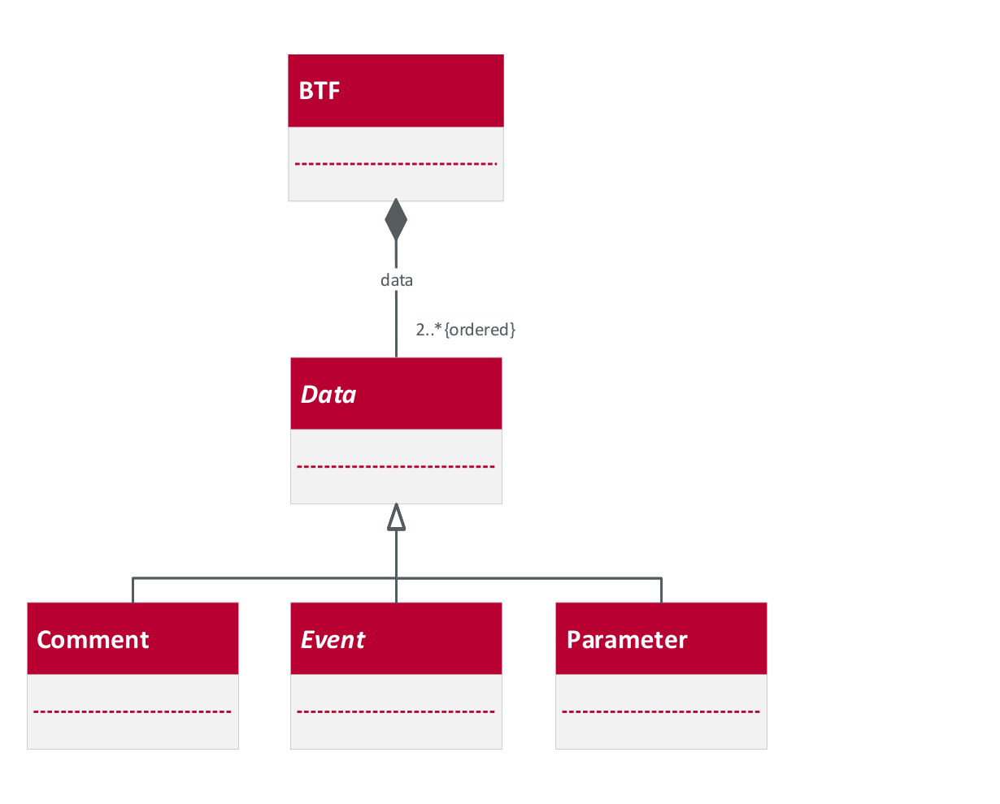
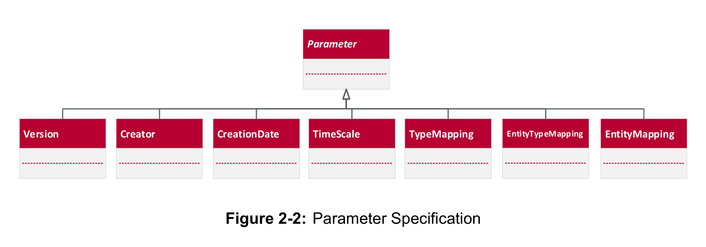
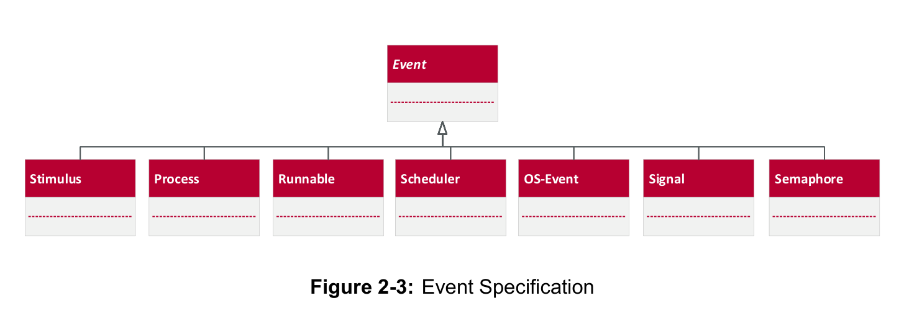
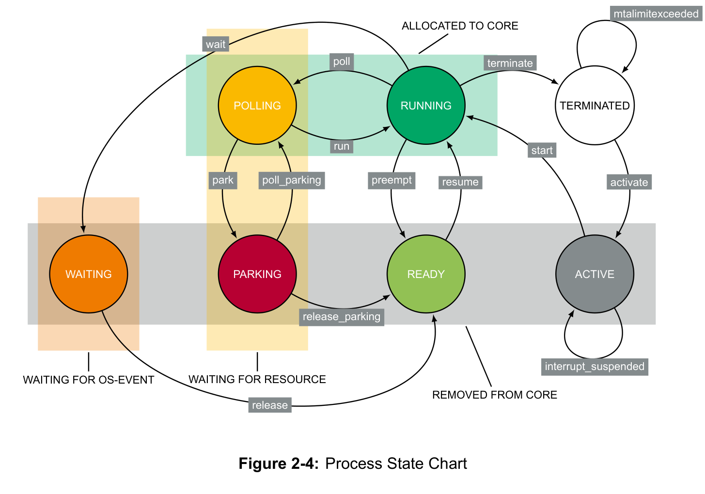
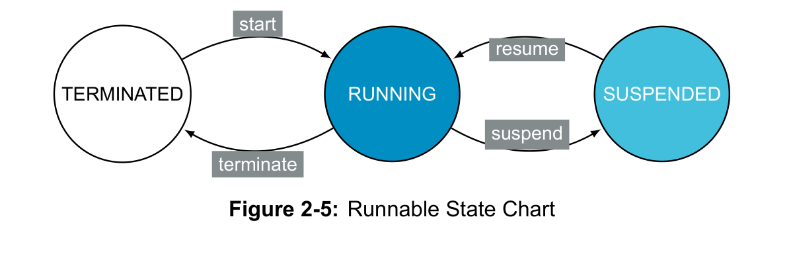
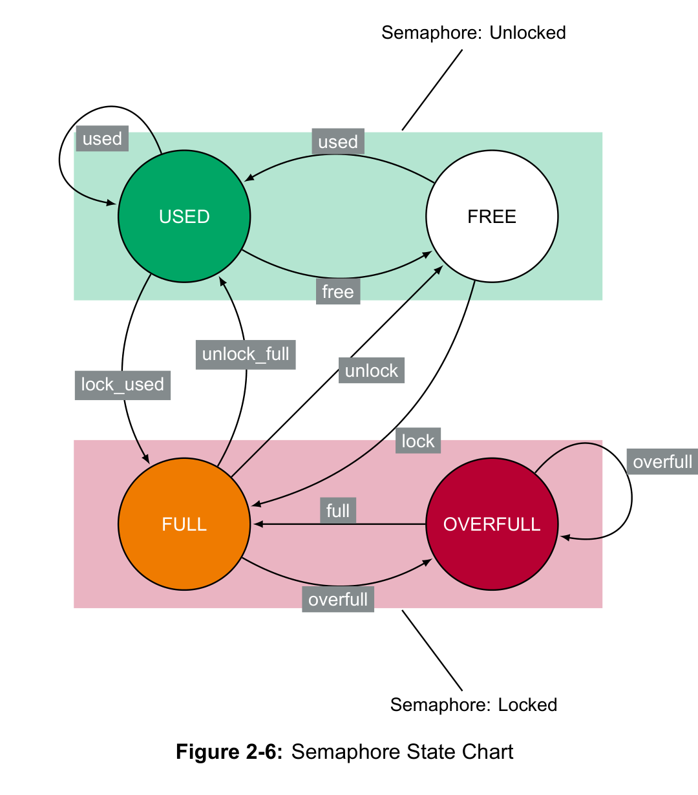
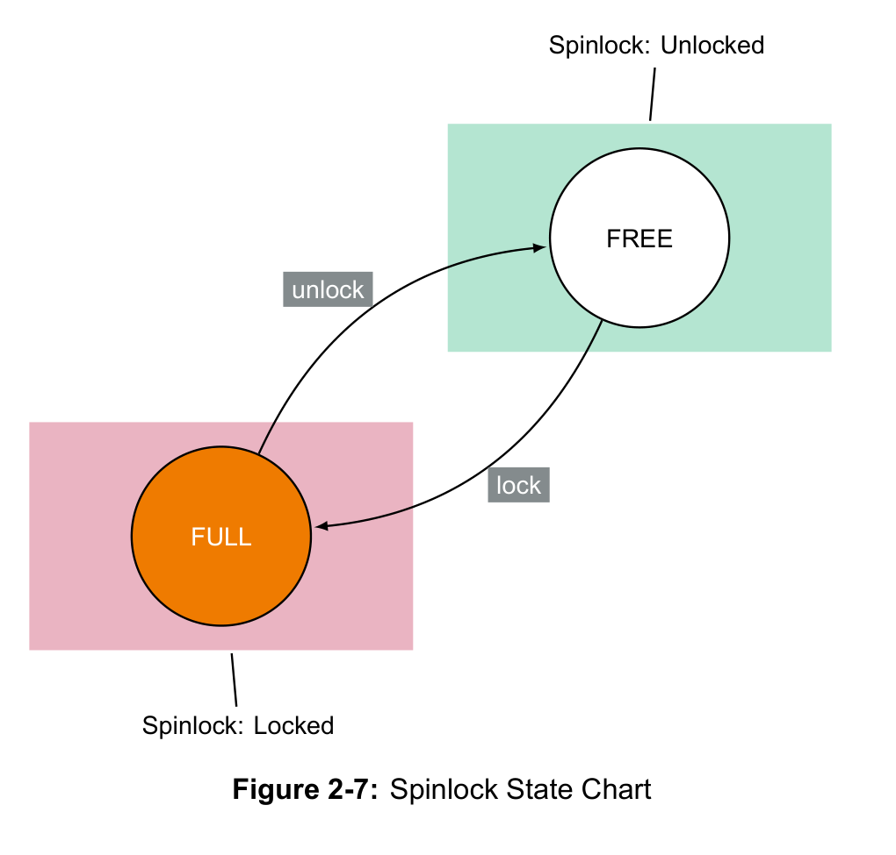

# Best Trace Format (BTF)

**Technical Specification - Version 2.3.0**  
Vector Informatik GmbH, 2023

> Converted from the original PDF. Figures are unmodified raster snapshots of the source pages.

## Contents

- 1 Introduction
- 2 Best Trace Format (BTF)
  - 2.1 Comment
  - 2.2 Parameter
  - 2.3 Event

<!-- Source page 2 -->
## Version History

| Version | Date | Author | Description |
| --- | --- | --- | --- |
| 2.3.0 | 2022-07-05 | Vector Informatik GmbH | Update specification of Semaphore events to better suit Spinlocks |
| 2.2.1 | 2021-01-07 | Vector Informatik GmbH | Include updated License Disclaimer |
| 2.2.0 | 2020-03-01 | Vector Informatik GmbH | &gt; Updated structure of specification &gt; Updated introduction &gt; Update descriptions for comment, parameter and event sections &gt; Outline constraints for comment, parameter and event sections &gt; Improved and added examples &gt; Change instance number of scheduler from -1 to 0 &gt; Changed source entity type of mtalimitexceeded to stimulus &gt; Add new source entity type for OS-Events &gt; Add process interrupt_suspended event &gt; Removed timing tool specific simulation and system events &gt; Removed NOT INITIALIZED state of processes, runnables and semaphores &gt; Removed timing tool specific process events boundedmigration, phasemigration, fullmigration and enforcedmigration &gt; Removed timing tool specific scheduler events processactivate, processpolling and processterminate &gt; Removed timing tool specific semaphore event ready and exclusivesemaphore |
| 2.1.5 | 2016-01-29 | Timing-Architects Embedded Systems GmbH | &gt; Semaphore state chart: added missing state transition. &gt; Updated description of Interrupt Service Routine: short version is changed from ISR to I. &gt; Added System-Events. &gt; Updated description of OS-Events. &gt; Improved description of SourceInstance in 2.3. &gt; Corrected description of #typeTable. &gt; Improved description of Source and Target in 2.3. |

<!-- Source page 3 -->
| Version | Date | Author | Description |
| --- | --- | --- | --- |
| 2.1.4 | 2015-03-24 | Timing-Architects Embedded Systems GmbH | &gt; Added Scheduler, OS-Events, Semaphore- Events and Simulation-Events. &gt; Updated examples. &gt; Corrected diction of mtalimitexceeded. &gt; Changed allowed source type for activating a process. |
| 2.1.3 | 2014-04-10 | Timing-Architects Embedded Systems GmbH | Process state chart: changed layout according to OSEK state order. |
| 2.1.1 | 2013-10-30 | Timing-Architects Embedded Systems GmbH | Clarified description and examples regarding difference preempt/suspend for processes/runnables. |
| 2.1 | 2013-06-18 | Timing-Architects Embedded Systems GmbH, Robert Bosch GmbH | &gt; Changed Process State Chart for compliance to OSEK 2.2.3 Extended Task Model. &gt; Improved some descriptions. |
| 2.0.2 | 2013-04-22 | Timing-Architects Embedded Systems GmbH | First public release. |
| 2.0.1 | 2013-03-29 | Timing-Architects Embedded Systems GmbH | Added state charts and description of all entities. |
| 2.0 | 2012-04-17 | Timing-Architects Embedded Systems GmbH | Added new data types. |
| 1.0 | 2011-07-18 | Timing-Architects Embedded Systems GmbH, INCHRON GmbH | Initial specification approved with thanks by Continental Automotive GmbH, extended by sourceentity-instance column. |

<!-- Source page 4 -->
## License Disclaimer

> BTF is and remains accessible to everyone free of charge.

> Certification of compliance can be issued by Vector Infomatik GmbH as the certification organisation. Certification can be subject to a fee.

> BTF implementations may be extended, or offered in subset form. However, Vector Informatik GmbH as the certification organisation may decline to certify subset implementations, and may place requirements upon extensions.

<!-- Source page 11 -->
# 1 Introduction

This document specifies the CSV-based Best Trace Format (BTF) used to record traces on system level in order to analyze timing, performance, and reliability of embedded real-time multi-core systems. The Best Trace Format is based on the Better Trace Format (BTF V1.0) and its first public release was v2.0.2 in 2013. The BTF trace format, recorded by simulation or profiling tools, allows to analyze the behavior of a system in a chronologically correct manner. It assumes a signal processing system where one entity of the system influences another entity. Therefore, logged events in the BTF do not only contain information about state changes of entities but also the reason of these changes. Advanced scheduling concepts may be used in multi-core systems where one traced entity may have multiple instances at the same time. For this purpose, the Best Trace Format provides instance identification in order to derive which instance of the entity is addressed in the event log. This means for example that each task execution can be exactly identified for the complete lifetime from activation until termination by its name and instance counter.

At first, a description of the optional comments which can appear anywhere within a trace log is presented in Section 2.1. This is followed by the definition of the parameters in Section 2.2. These describe the meta-information of a BTF compliant file. Finally, Section 2.3 specifies the exact format of the CSV-based trace log. It introduces all entities and their according logging events suggested by this specification to guarantee a reliable timing and performance analysis.

The concepts used in this specification are based on OSEK [2] and AUTOSAR [1].

<!-- Source page 12 -->
# 2 Best Trace Format (BTF)

The BTF trace is a ordered list of data records which is represented in a UTF-8 encoded CSV (comma-separated values) format. As shown in Listing 2-1, each line of the file is a data record and represents a piece of information, which can either be a comment, a parameter definition, or an event entry. A comma (',') is used to separate the content within an entry. For cases, in which floating numbers have to be represented, a dot ('.') must be used as decimal separator.

```text
1 #version 2.2.0
2 #creator TA-Tool Suite 12.06.1
3 # Simulation of dualcore processor 120MHz, 16Kbyte RAM
4 #creationDate 2012-08-31T15:53:00
5 #timeScale ns
6 0,Stimulus_Task_A,0,T,Task_A,0,activate
7 100,Core_1,0,T,Task_A,0,start
8 100,Task_A,0,R,Runnable_A_1,0,start
9 200,Task_A,0,SIG,S1,0,read,12.3
```

*Listing 2-1: Snippet of a BTF File*

The interpretation of each line depends on its type. As shown in Figure 2-1, there are three different groups of types available which are introduced in detail in the following sections.



*Figure 2-1: BTF Specification*

<!-- Source page 13 -->
There are two ways to represent the data records. The symbolic-mode describes entities and events by names. The numeric-mode describes entities and events by a numerical identifier. In the latter case, the parameters Entity Mappings (see Section 2.2.4), Type Mappings (see Section 2.2.7), or Entity Type Mappings (see Section 2.2.5) define a mapping between a numerical identifier and a string of the name.

<!-- Source page 14 -->
## 2.1 Comment

Each row starting with a '#' symbol and followed by a blank space is defined as a Comment, as shown in Listing 2-2.

```text
1 # <content of comment>
```

*Listing 2-2: Syntax of Comments*

## 2.2 Parameter



A parameter gives meta information on the trace and allows one to interpret it correctly. As a consequence, some pieces of information are mandatory and others are optional.

Each parameter definition is indicated by a '#' symbol at the beginning. In contrast to comments, a parameter definition must not start with a blank space after the '#' symbol but with a predefined keyword or symbol.

As shown in Figure 2-2, the following parameters are predefined.

### 2.2.1 Version Parameter

The version parameter is mandatory and specifies the version of the BTF format definition. Each BTF file must start with the version parameter (version) that indicates which specification has to be considered for processing the BTF file.

| Property | Description |
| --- | --- |
| Definition | #version &lt;number&gt; |
| Type | &lt;number&gt;: String |
| Multiplicity | 1 … 1 |
| Example | #version 2.1.6 |

*Table 2-1: Definition of Version Parameter*

> **Constraint: There must be exactly one version parameter in a BTF file.**

> **Constraint: The version parameter must be the first entry a BTF file.**

<!-- Source page 15 -->
### 2.2.2 Creation Date Parameter

The creation date parameter is optional and specifies the timestamp of the start of simulation or measurement. The format has to comply with "ISO 8601 extended specification for representations of dates and times": YYYY-MM-DDTHH:MM:SS. The time shall be in UTC time, which is indicated by a 'Z' at the end.

| Property | Description |
| --- | --- |
| Definition | #creationDate &lt;date&gt; |
| Type | &lt;date&gt;: String matching ISO 8601 date format |
| Multiplicity | 0 … 1 |
| Example | #creationDate 2012-09-02T16:40:30Z |

*Table 2-2: Definition of Creation Date Parameter*

> **Constraint: The BTF file must not contain more than one creation date parameter.**

> **Constraint: The creation date parameter must be written before the first event entry.**

### 2.2.3 Creator Parameter

The creator parameter is optional and specifies the name and version of the application software or device that generated the trace.

| Property | Description |
| --- | --- |
| Definition | #creator &lt;info&gt; |
| Type | &lt;info&gt;: String |
| Multiplicity | 0 … 1 |
| Example | #creator TA-Simulator (12.10.2.47) |

*Table 2-3: Definition of Creator Parameter*

> **Constraint: The BTF file must not contain more than one creator parameter.**

> **Constraint: The creator parameter must be written before the first event entry.**

### 2.2.4 Entity Mapping Parameter

The entity mapping parameter is optional and indicates a mapping of an entity to a numerical ID. An entity can be a task, runnable, etc.

<!-- Source page 16 -->
| Property | Description |
| --- | --- |
| Definition | #entityMapping &lt;id&gt; &lt;name&gt; |
| Type | &lt;id&gt;: Non-negative integer |
|  | &lt;name&gt;: String |
| Multiplicity | 0 … 1 |
|  | #entityMapping 0 Task_1ms |
| Example | #entityMapping 1 GetSignal |
|  | #entityMapping 2 Main |
|  | #entityMapping 3 Temperature |

*Table 2-4: Definition of Entity Mapping Parameter*

> **Constraint: The IDs within the entity mapping parameter must be unique.**

> **Constraint: The entity mapping must be written before the first event of the according entity.**

### 2.2.5 Entity Type Mapping Parameter

The entity type mapping parameter is optional and indicates a bijective mapping of an entity to a specific entity type. Instead of entering the names of the entities and types in this mapping, it is also possible to use the numerical IDs defined in the type mapping or entity mapping.

<!-- Source page 17 -->
| Property | Description |
| --- | --- |
| Definition | #entityTypeMapping &lt;type&gt; &lt;name&gt; |
| Type | &lt;type&gt;: String/non-negative integer |
|  | &lt;name&gt;: String/non-negative integer |
| Multiplicity | 0 … 1 |
|  | #entityTypeMapping T Task_1ms |
| Example | #entityTypeMapping R GetSignal |
|  | #entityTypeMapping R Main |
|  | #entityTypeMapping SIG Temperature |
|  | #entityMapping 0 Task_1ms |
|  | #entityMapping 1 GetSignal |
|  | #entityMapping 2 Main |
|  | #entityMapping 3 Temperature |
|  | #typeMapping 0 T |
| Example (numeric) | #typeMapping 1 R |
|  | #typeMapping 2 SIG |
|  | #entityTypeMapping 0 0 |
|  | #entityTypeMapping 1 1 |
|  | #entityTypeMapping 1 2 |
|  | #entityTypeMapping 2 3 |

*Table 2-5: Definition of Entity Type Mapping Parameter*

> **Constraint: In case the numeric IDs from a type mapping or entity mapping are used, the type mapping or entity mapping must be defined before the entity type mapping.**

> **Constraint: The entity type mapping must be written before the first event of the according entity.**

### 2.2.6 Time Scale Parameter

The time scale parameter is mandatory and specifies the resolution of the timestamps in the trace.

| Property | Description |
| --- | --- |
| Definition | #timescale &lt;time&gt; |
| Type | &lt;time&gt;: String (Enumeration [ps,ns,us,ms,s]) |
| Multiplicity | 1 … 1 |
| Example | #timescale ns |

*Table 2-6: Definition of Time Scale Parameter*

> **Constraint: The BTF file must contain exactly one time scale parameter.**

> **Constraint: The time scale parameter must be written before the first event entry.**

<!-- Source page 18 -->
### 2.2.7 Type Mapping Parameter

The type mapping parameter is optional and indicates the mapping of an entity type to a numerical ID. See Section 2.3 for existing entity types.

| Property | Description |
| --- | --- |
| Definition | #typeMapping &lt;id&gt; &lt;name&gt; |
| Type | &lt;id&gt;: Non-negative integer |
|  | &lt;name&gt;: String |
| Multiplicity | 0 … 1 |
|  | #typeMapping 0 T |
| Example | #typeMapping 1 R |
|  | #typeMapping 2 SIG |

*Table 2-7: Definition of Type Mapping Parameter*

> **Constraint: The IDs within the type mapping parameter must be unique.**

> **Constraint: The type mapping must be written before the first event of the according type.**

<!-- Source page 19 -->
## 2.3 Event



An Event gives information on what happened where and when within a system. To do so, an event entry is specified by the following elements:

`<Time>`,`<Source>`,`<SourceInstance>`,`<TargetType>`,`<Target>`,`<TargetInstance>`,`<Event>`,`<Note>`

An event entry is defined by eight fields, separated by commas. Each field describes a dedicated piece of information, which is necessary to interpret the event. The order of the fields and, thus, the position of the information, is fixed and cannot be changed. However, for some events, the last field is optional and can be omitted. Table 2-8 gives a detailed overview on the specified fields and their purpose.

| Field | Name | Type | Description |
| --- | --- | --- | --- |
| 1 | &lt;Time&gt; | Non-negative Integer | Timestamp that states the absolute point in time at which the event was observed. The corresponding time scale is defined by the Time Scale Parameter (#timescale). |
| 2 | &lt;Source&gt; | String | Unique textual identifier of an entity which states the source of the observed event and that allows one to unambiguously distinguish between all entities. |
| 3 | &lt;SourceInstance&gt; | Integer | Unique numerical identifier for the source instance of the observed event that allows one to unambiguously distinguish between instances of the same entity. |
| 4 | &lt;TargetType&gt; | String | Type of the target entity and, thus, of the observed event. |
| 5 | &lt;Target&gt; | String | Unique textual identifier of an entity which states the target of the observed event and that allows one to unambiguously distinguish between all entities. |
| 6 | &lt;TargetInstance&gt; | Integer | Unique numerical identifier for the target instance of the observed event that allows one to unambiguously distinguish between instances of the same entity. |
| 7 | &lt;Event&gt; | String | Name of the observed event. |

<!-- Source page 20 -->
| Field | Name | Type | Description |
| --- | --- | --- | --- |
| 8 | &lt;Note&gt; | String | Additional information for specific events. |

*Table 2-8: Description of Event Fields*

> **Constraint: The `<Time>` field must not decrease from one line to the next line in a BTF file.**

As shown in Figure 2-3, there are specific types of observable Events available which are stated in the fourth field (`<TargetType>`) of an event entry. Following sections introduce the types that are currently defined in the BTF. It is not required that all defined entity types appear in one single BTF file. Therefore, a BTF file may focus on only one or multiple target entity types as it is shown in Listing 2-1.

```text
1 0,Stimulus_Task_A,0,T,Task_A,0,activate
2 100,Core_1,0,T,Task_A,0,start
3 100,Task_A,0,R,Runnable_A_1,0,start
4 7100,Task_A,0,R,Runnable_A_1,0,terminate
5 7100,Task_A,0,R,Runnable_A_2,0,start
6 10000,Stimulus_Task_B,0,T,Task_B,0,activate
7 10100,Task_A,0,R,Runnable_A_2,0,suspend
8 10100,Core_1,0,T,Task_A,0,preempt
9 10100,Core_1,0,T,Task_B,0,start
10 10100,Task_B,0,R,Runnable_B_1,0,start
```

```text
11 17100,Task_B,0,R,Runnable_B_1,0,terminate
12 17100,Core_1,0,T,Task_B,0,terminate
13 17200,Core_1,0,T,Task_A,0,resume
14 17200,Task_A,0,R,Runnable_A_2,0,resume
15 21200,Task_A,0,R,Runnable_A_2,0,terminate
16 21200,Core_1,0,T,Task_A,0,terminate
```

*Listing 2-3: Example for BTF Events*

<!-- Source page 21 -->
### 2.3.1 Stimulus Events

A Stimulus (STI) is used to represent interactions among the internal behavior and between the system and the surrounding environment.

#### 2.3.1.1 trigger

The trigger event indicates that the internal behavior or the surrounding environment triggers the activation of a task/interrupt service routine or the setting of a signal value or OS-Event.

| Field | Description |
| --- | --- |
| &lt;Source&gt; | The source shall state the name of the stimulus entity that is triggered, if a process is activated or a signal value or OS-Event is set by the surrounding environment, or it shall state the name of a task/interrupt service routine, if the event represent an inter-process activation. |
| &lt;SourceInstance&gt; | In case of an inter-process activation, the source instance shall state the number of the process instance or otherwise the number of the stimulus instance, which shall increase gaplessly with each event. |
| &lt;TargetType&gt; | STI |
| &lt;Target&gt; | The target shall state the name of the stimulus entity that is triggered. |
| &lt;TargetInstance&gt; | The target instance shall state the number of the stimulus instance that is triggered. |
| &lt;Event&gt; | trigger |
| &lt;Note&gt; | This field shall not be used for a trigger event. |

*Table 2-9: Definition of Stimulus Trigger Event*

> **Constraint: In case of an inter-process activation, the process instance stated as source shall be in RUNNING state at the time of the triggering.**

> **Constraint: If the source is a stimulus, the source instance must be equal to the target instance.**

> **Constraint: If the source is a stimulus, the source must be equal to the target.**

> **Constraint: The trigger event must appear before the associated process activation and signal or OS-Event set event.**

> **Constraint: If the source is a stimulus, the source instance shall change unambiguously with each event.**

##### Example

In Listing 2-4, Task_A is activated by Stimulus_Task_A (line 2), which is triggered before (line 1) as a single stimulus by environment, e.g., due to some alarm or schedule table. After that, Task_A activates Task_B via an inter-process activation. Therefore, Task_A triggers Stimulus_Task_B (line 4) and this stimulus activates Task_B afterwards (line 5).

<!-- Source page 22 -->
```text
1 0,Stimulus_Task_A,0,STI,Stimulus_Task_A,0,trigger
2 0,Stimulus_Task_A,0,T,Task_A,0,activate
3 100,Core_1,0,T,Task_A,0,start
4 7100,Task_A,0,STI,Stimulus_Task_B,0,trigger
5 7100,Stimulus_Task_B,0,T,Task_B,0,activate
6 7200,Core_1,0,T,Task_A,0,preempt
7 7200,Core_1,0,T,Task_B,0,start
```

*Listing 2-4: Example with Task Activations by Stimuli*

In Listing 2-5, the stimulus Periodic_Stimulus sets OS-Event Event_1.

```text
1 20000000,SIM,0,STI,Periodic_Stimulus,1,trigger
2 20000000,Periodic_Stimulus,1,EVENT,Event_1,0,set_event,Task_1
```

*Listing 2-5: Example with an OS-Event Set by a Stimulus*

In Listing 2-6, the stimulus Periodic_Stimulus writes signal Signal_1.

```text
1 20000000,SIM,0,STI,Periodic_Stimulus,1,trigger
2 20000000,Periodic_Stimulus,1,SIG,Signal_1,0,write,2
```

*Listing 2-6: Example with a Signal Written by a Stimulus*

<!-- Source page 23 -->
### 2.3.2 Process Events (Task and ISR Events)

A Process can be either a task (T) or an interrupt service routine (I). It is activated by a stimulus as described in Section 2.3.1. After activation, a scheduler assigns the process to a core where the process is executed. A running process can be preempted by another process and change to READY. Alternatively, a cooperative process can change itself to READY, e.g. at a schedule point, or explicitly migrate to another core. If a running process calls the system service to wait for at least one operating system event and these events are not set, the process changes its state to WAITING. If the according event gets set, the process is again READY for execution. A process accessing a resource which is locked by a semaphore (e.g. spinlock), checks repeatedly the availability of this resource within a loop. This active waiting of the process is represented by the POLLING state. The scheduler might decide in this scenario to remove the process from the core which results in PARKING. Is the resource available again, the process changes its state to READY.



<!-- Source page 24 -->
| State | Description |
| --- | --- |
| ACTIVE | The process instance is ready for execution. |
| PARKING | The process instance has been preempted while actively waiting for a resource that is not available. |
| POLLING | The process instance has requested a not available resource and waits actively. |
| READY | The process instance has been preempted. |
| RUNNING | The process instance executes on a core. |
| TERMINATED | The process instance has finished its execution or hasn't been activated yet. |
| WAITING | The process instance has called the system service to wait for an OS-Event which is not set and waits passively. |

*Table 2-10: States for Process Entities*

At the beginning of a BTF trace, a process may be in any defined state.

#### 2.3.2.1 activate

The activate event indicates that a process instance (target) is activated by a stimulus (source) and, thus, transitions from TERMINATED to ACTIVE state.

| Field | Description |
| --- | --- |
| &lt;Source&gt; | The source must state the name of the stimulus entity that activates the process. |
| &lt;SourceInstance&gt; | The source instance must state the number of the stimulus instance that activates the task. |
| &lt;TargetType&gt; | "T" if the activated process is a task and "I" if the it is an interrupt service routine. |
| &lt;Target&gt; | The target must state the name of the process that is activated. |
| &lt;TargetInstance&gt; | The target instance must state the number of the process instance that is activated and shall increase gaplessly with each activate or mtalimitexceeded event. |
| &lt;Event&gt; | activate |
| &lt;Note&gt; | This field must not be used for this event. |

*Table 2-11: Definition of Process Activate Event*

> **Constraint: The source stimulus must be triggered before the process instance is activated. This order must be considered in the BTF file.**

#### 2.3.2.2 interrupt_suspended

The interrupt_suspended event indicates that the stated interrupt service routine instance (target) is not scheduled for execution by the scheduler (source) because of a previous OS service call to suspend interrupts.

<!-- Source page 25 -->
| Field | Description |
| --- | --- |
| &lt;Source&gt; | The source must state the name of the scheduler entity that manages the scheduling of this interrupt service routine. |
| &lt;SourceInstance&gt; | 0 |
| &lt;TargetType&gt; | I |
| &lt;Target&gt; | The target must state the name of the interrupt service routine that is suspended from execution. |
| &lt;Target&gt; | The target instance must state the number of the interrupt service routine instance that is suspended from execution. |
| &lt;Event&gt; | interrupt_suspended |
| &lt;Note&gt; | This field must not be used for this event. |

*Table 2-12: Definition of Process Interrupt_Suspended Event*

#### 2.3.2.3 mtalimitexceeded

The mtalimitexceeded event indicates that a stimulus (source) attempts to activate a task (target) but the maximum allowed number of concurrent activations of this task is already reached and, thus, the task is not activated.

| Field | Description |
| --- | --- |
| &lt;Source&gt; | The source must state the name of the stimulus entity that attempts to activate the task. |
| &lt;SourceInstance&gt; | The source instance must state the number of the stimulus instance that attempts to activate the task. |
| &lt;TargetType&gt; | T |
| &lt;Target&gt; | The target must state the name of the task entity whose maximum number of concurrent activations would be exceeded. |
| &lt;TargetInstance&gt; | The instance number of the stated task entity must be increased with each event. |
| &lt;Event&gt; | mtalimitexceeded |
| &lt;Note&gt; | This field must not be used for this event. |

*Table 2-13: Definition of Process Mtalimitexceeded Event*

#### 2.3.2.4 park

The park event indicates that a process (target) that is actively waiting for a resource is suspended, i.e, its execution is removed from the allocated core (source).

<!-- Source page 26 -->
| Field | Description |
| --- | --- |
| &lt;Source&gt; | The source must state the name of the core from which the process gets removed. |
| &lt;SourceInstance&gt; | 0 |
| &lt;TargetType&gt; | "T" if the parking process is a task and "I" if it is an interrupt service routine. |
| &lt;Target&gt; | The target must state the name of the process that is parked. |
| &lt;TargetInstance&gt; | The target instance must state the number of the process instance that is parked. |
| &lt;Event&gt; | park |
| &lt;Note&gt; | This field must not be used for this event. |

*Table 2-14: Definition of Process Park Event*

#### 2.3.2.5 poll

The poll event indicates that a process (target) that is executing on a core (source) requests a resource that is not available and starts waiting actively to access it.

| Field | Description |
| --- | --- |
| &lt;Source&gt; | The source must state the name of the core on which the process is executing. |
| &lt;SourceInstance&gt; | 0 |
| &lt;TargetType&gt; | "T" if the polling process is a task and "I" if it is an interrupt service routine. |
| &lt;Target&gt; | The target must state the name of the process that is polling. |
| &lt;TargetInstance&gt; | The target instance must state the number of the process instance that is polling. |
| &lt;Event&gt; | poll |
| &lt;Note&gt; | This field must not be used for this event. |

*Table 2-15: Definition of Process Poll Event*

#### 2.3.2.6 poll_parking

The poll_parking event indicates that a process (target) that has been removed from the allocated core during actively waiting for a resource gets allocated to a core (source). During this reallocation, the requested resource is still not available.

<!-- Source page 27 -->
| Field | Description |
| --- | --- |
| &lt;Source&gt; | The source must state the name of the core on which the process resumes actively waiting for a resource. |
| &lt;SourceInstance&gt; | 0 |
| &lt;TargetType&gt; | "T" if the process that resumes actively waiting is a task and "I" if it is an interrupt service routine. |
| &lt;Target&gt; | The target must state the name of the process that resumes actively waiting. |
| &lt;TargetInstance&gt; | The target instance must state the number of the process instance that resumes actively waiting. |
| &lt;Event&gt; | poll_parking |
| &lt;Note&gt; | This field must not be used for this event. |

*Table 2-16: Definition of Process Poll_Parking Event*

#### 2.3.2.7 preempt

The preempt event indicates that a process (target) that is executing on a core (source) gets removed from it due to a scheduling decision.

| Field | Description |
| --- | --- |
| &lt;Source&gt; | The source must state the name of the core from which the process gets removed. |
| &lt;SourceInstance&gt; | 0 |
| &lt;TargetType&gt; | "T" if the preempted process is a task and "I" if it is an interrupt service routine. |
| &lt;Target&gt; | The target must state the name of the process that is preempted. |
| &lt;TargetInstance&gt; | The target instance must state the number of the process instance that is preempted. |
| &lt;Event&gt; | preempt |
| &lt;Note&gt; | This field must not be used for this event |

*Table 2-17: Definition of Process Preempt Event*

#### 2.3.2.8 release

The release event indicates that at least one OS-Event a process (target) is passively waiting for is set and the process is ready to proceed execution. During this time, the process is still removed from a core (source) due to a scheduling decision.

<!-- Source page 28 -->
| Field | Description |
| --- | --- |
| &lt;Source&gt; | The source must state the name of the core from which the process got removed when it started passively waiting for at least one OS-Event. |
| &lt;SourceInstance&gt; | 0 |
| &lt;TargetType&gt; | "T" if the released process is a task and "I" if it is an interrupt service routine. |
| &lt;Target&gt; | The target must state the name of the process that is released. |
| &lt;TargetInstance&gt; | The target instance must state the number of the process instance that is released. |
| &lt;Event&gt; | release |
| &lt;Note&gt; | This field must not be used for this event. |

*Table 2-18: Definition of Process Release Event*

#### 2.3.2.9 release_parking

The release_parking event indicates that a process (target) that has been removed from the allocated core (source) during actively waiting for a resource gets access to this resource. During this time, the process is still removed from the core due to a scheduling decision.

| Field | Description |
| --- | --- |
| &lt;Source&gt; | The source must state the name of the core from which the process got removed due to a scheduling decision. |
| &lt;SourceInstance&gt; | 0 |
| &lt;TargetType&gt; | "T" if the process getting access to a resource is a task and "I" if it is an interrupt service routine. |
| &lt;Target&gt; | The target must state the name of the process that gets access to a resource. |
| &lt;TargetInstance&gt; | The target instance must state the number of the process instance that gets access to a resource. |
| &lt;Event&gt; | release_parking |
| &lt;Note&gt; | This field must not be used for this event. |

*Table 2-19: Definition of Process Release_Parking Event*

#### 2.3.2.10 resume

The resume event indicates that a process (target) that has been removed from a core by a scheduler gets allocated to a core (source) due to a new scheduling decision.

<!-- Source page 29 -->
| Field | Description |
| --- | --- |
| &lt;Source&gt; | The source must state the name of the core to which the process gets allocated. |
| &lt;SourceInstance&gt; | 0 |
| &lt;TargetType&gt; | "T" if the resuming process is a task and "I" if it is an interrupt service routine. |
| &lt;Target&gt; | The target must state the name of the process that is resuming. |
| &lt;TargetInstance&gt; | The target instance must state the number of the process instance that is resuming. |
| &lt;Event&gt; | resume |
| &lt;Note&gt; | This field must not be used for this event. |

*Table 2-20: Definition of Process Resume Event*

#### 2.3.2.11 run

The run event indicates that a process (target) that is actively waiting for a resource on a core (source) gets access to this resource and continues execution.

| Field | Description |
| --- | --- |
| &lt;Source&gt; | The source must state the name of the core on which the process is executing. |
| &lt;SourceInstance&gt; | 0 |
| &lt;TargetType&gt; | "T" if the running process is a task and "I" if it is an interrupt service routine. |
| &lt;Target&gt; | The target must state the name of the process that is running. |
| &lt;TargetInstance&gt; | The target instance must state the number of the process instance that is running. |
| &lt;Event&gt; | run |
| &lt;Note&gt; | This field must not be used for this event. |

*Table 2-21: Definition of Process Run Event*

#### 2.3.2.12 start

The start event indicates that a process (target) that is active for execution gets scheduled and allocated to a core (source).

<!-- Source page 30 -->
| Field | Description |
| --- | --- |
| &lt;Source&gt; | The source must state the name of the core to which the process gets allocated. |
| &lt;SourceInstance&gt; | 0 |
| &lt;TargetType&gt; | "T" if the starting process is a task and "I" if it is an interrupt service routine. |
| &lt;Target&gt; | The target must state the name of the process that is starting. |
| &lt;TargetInstance&gt; | The target instance must state the number of the process instance that is starting. |
| &lt;Event&gt; | start |
| &lt;Note&gt; | This field must not be used for this event. |

*Table 2-22: Definition of Process Start Event*

#### 2.3.2.13 terminate

The terminate event indicates that a process (target) has finished its execution.

| Field | Description |
| --- | --- |
| &lt;Source&gt; | The source must state the name of the core on which the process has finished its execution. |
| &lt;SourceInstance&gt; | 0 |
| &lt;TargetType&gt; | "T" if the terminating process is a task and "I" if it is an interrupt service routine. |
| &lt;Target&gt; | The target must state the name of the process that is terminating. |
| &lt;TargetInstance&gt; | The target instance must state the number of the process instance that is terminating. |
| &lt;Event&gt; | terminate |
| &lt;Note&gt; | This field must not be used for this event. |

*Table 2-23: Definition of Process Terminate Event*

#### 2.3.2.14 wait

The wait event indicates that a process (target) calls a system service to wait for at least one OS-Event and these events are not set. The process gets removed from the core (source) it is allocated to.

<!-- Source page 31 -->
| Field | Description |
| --- | --- |
| &lt;Source&gt; | The source must state the name of the core from which the process gets removed. |
| &lt;SourceInstance&gt; | 0 |
| &lt;TargetType&gt; | "T" if the waiting process is a task and "I" if it is an interrupt service routine. |
| &lt;Target&gt; | The target must state the name of the process that is waiting. |
| &lt;TargetInstance&gt; | The target instance must state the number of the process instance that is waiting. |
| &lt;Event&gt; | wait |
| &lt;Note&gt; | This field must not be used for this event. |

*Table 2-24: Definition of Process Wait Event*

##### Example

The example shows the activation of TASK_InputProcessing (line 1), triggered by timer TIMER_2ms. TASK_InputProcessing starts execution (line 2). Afterwards, TIMER_1ms activates TASK_1MS (line 3). Due to scheduling effects, TASK_InputProcessing gets preempted (line 4) and TASK_1MS starts execution (line 5). After TASK_1MS has finished execution (line 6), TASK_InputProcessing resumes execution (line 7).

```text
1 6150000,TIMER_2ms,3,T,TASK_InputProcessing,3,activate
2 6150100,Core_1,0,T,TASK_InputProcessing,3,start
3 6250000,TIMER_1MS,6,T,TASK_1MS,6,activate
4 6250100,Core_1,0,T,TASK_InputProcessing,3,preempt
5 6250100,Core_1,0,T,TASK_1MS,6,start
6 6721825,Core_1,0,T,TASK_1MS,6,terminate
7 6721925,Core_1,0,T,TASK_InputProcessing,3,resume
8 7110175,Core_1,0,T,TASK_InputProcessing,3,terminate
```

*Listing 2-7: BTF Extract with Process Events*

<!-- Source page 32 -->
### 2.3.3 Runnable Events

A runnable (R) is called in context of a process instance or by another runnable. A called runnable starts and changes to RUNNING. If the process instance which includes the runnable gets removed from core (e.g. preempted), the currently executed runnable is suspended and changes to state SUSPENDED. If the process instance gets allocated to core (e.g. resumed), the runnable changes to RUNNING. After complete execution, the runnable changes to TER- MINATED.



| State | Description |
| --- | --- |
| RUNNING | The runnable instance executes on a core. |
| SUSPENDED | The runnable instance stops execution as the process instance has to be removed from core. |
| TERMINATED | The runnable instance has finished execution or hasn't been started yet. |

*Table 2-25: States for Runnable Entities*

At the beginning of a BTF trace, a runnable may be in any of above states. As runnables are executed in context of a process, the process is seen as source of all state transitions. This implies that the process has to be allocated to a core to initiate a new runnable state. This has an effect on the expected process and runnable event order in a BTF trace. These constraints will be defined in the following chapters. Similar scenario is also expected in case a runnable calls another runnable (sub-runnable) as direct function call. Constraints will be defined which define that a runnable is in RUNNING state if a sub-runnable is in RUNNING state. Below chapters imply that the process context must also be used as source for sub-runnables.

#### 2.3.3.1 resume

The resume event indicates that a runnable (target) can continue execution as its process (source) resumes.

<!-- Source page 33 -->
| Field | Description |
| --- | --- |
| &lt;Source&gt; | The source must state the name of the process that is calling the runnable. |
| &lt;SourceInstance&gt; | The source instance must state the number of the process instance that is calling the runnable. |
| &lt;TargetType&gt; | "R" |
| &lt;Target&gt; | The target must state the name of the runnable that is resuming. |
| &lt;TargetInstance&gt; | The target instance must state the number of the runnable instance that is resuming. |
| &lt;Event&gt; | resume |
| &lt;Note&gt; | This field must not be used for this event. |

*Table 2-26: Definition of Runnable Resume Event*

> **Constraint: A runnable instance gets resumed after its process instance got allocated to a core. This order has to be considered in the BTF file.**

> **Constraint: A sub-runnable instance gets resumed after its calling runnable instance is resumed. This order has to be considered in the BTF file.**

#### 2.3.3.2 start

The start event indicates that a runnable (target) gets called by a process (source) and starts execution.

| Field | Description |
| --- | --- |
| &lt;Source&gt; | The source must state the name of the process that is calling the runnable. |
| &lt;SourceInstance&gt; | The source instance must state the number of the process instance that is calling the runnable. |
| &lt;TargetType&gt; | "R" |
| &lt;Target&gt; | The target must state the name of the runnable that is starting. |
| &lt;TargetInstance&gt; | The target instance must state the number of the runnable instance that is starting and must increase gaplessly with each event. |
| &lt;Event&gt; | start |
| &lt;Note&gt; | This field must not be used for this event. |

*Table 2-27: Definition of Runnable Start Event*

> **Constraint: A runnable instance gets started after its process instance got allocated to a core. This order has to be considered in the BTF file.**

> **Constraint: A sub-runnable instance gets started after its calling runnable instance is started. This order has to be considered in the BTF file.**

#### 2.3.3.3 suspend

The suspend event indicates that a runnable (target) has to pause its execution as its calling process (source) gets preempted.

<!-- Source page 34 -->
| Field | Description |
| --- | --- |
| &lt;Source&gt; | The source must state the name of the process that is calling the runnable. |
| &lt;SourceInstance&gt; | The source instance must state the number of the process instance that is calling the runnable. |
| &lt;TargetType&gt; | "R" |
| &lt;Target&gt; | The target must state the name of the runnable that is suspended. |
| &lt;TargetInstance&gt; | The target instance must state the number of the runnable instance that is suspended. |
| &lt;Event&gt; | suspend |
| &lt;Note&gt; | This field must not be used for this event. |

*Table 2-28: Definition of Runnable Suspend Event*

> **Constraint: A runnable instance gets suspended before its process instance is removed from a core. This order has to be considered in the BTF file.**

> **Constraint: A sub-runnable instance gets suspended before its calling runnable instance is suspended. This order has to be considered in the BTF file.**

#### 2.3.3.4 terminate

The terminate event indicates that a runnable (target) that has been called by a process (source) has finished its execution.

| Field | Description |
| --- | --- |
| &lt;Source&gt; | The source must state the name of the process that is calling the runnable. |
| &lt;SourceInstance&gt; | The source instance must state the number of the process instance that is calling the runnable. |
| &lt;TargetType&gt; | "R" |
| &lt;Target&gt; | The target must state the name of the runnable that is terminating. |
| &lt;TargetInstance&gt; | The target instance must state the number of the runnable instance that is terminating. |
| &lt;Event&gt; | terminate |
| &lt;Note&gt; | This field must not be used for this event. |

*Table 2-29: Definition of Runnable Terminate Event*

> **Constraint: All runnable instances executed in context of a process instance have to be terminated before the process instance itself gets terminated. This order has to be considered in the BTF file.**

> **Constraint: All sub-runnable instances called by a runnable instance have to be terminated before the runnable instance itself gets terminated. This order has to be considered in the BTF file.**

<!-- Source page 35 -->
##### Example

Runnable Runnable_A is started (line 1) and then suspended as Task_B with Runnable_B gets allocated to Core_1 (line 2 till 6). After termination of Runnable_B (line 7), Runnable_A resumes execution as Task_A gets allocated to Core_1 (line 9 and 10).

```text
1 100100,Task_A,0,R,Runnable_A,0,start
2 125000,Stimulus_2,0,T,Task_B,0,activate
3 125100,Task_A,0,R,Runnable_A,0,suspend
4 125100,Core_1,0,T,Task_A,0,preempt
5 125100,Core_1,0,T,Task_B,0,start
6 125100,Task_B,0,R,Runnable_B,0,start
7 126100,Task_B,0,R,Runnable_B,0,terminate
8 126100,Core_1,0,T,Task_B,0,terminate
9 126200,Core_1,0,T,Task_A,0,resume
10 126200,Task_A,0,R,Runnable_A,0,resume
```

```text
11 151200,Task_A,0,R,Runnable_A,0,terminate
```

*Listing 2-8: BTF Extract with Runnable and Task Events*

In Listing 2-9 Runnable_1 gets started by Task_1 (line 1). Afterwards, Runnable_1 starts Runnable_1_1 as direct function call (line 2). Due to scheduling effects, first Runnable_1_1 and then Runnable_1 get suspended (line 3 and 4). This enables execution of Runnable_2 (line 5). After Runnable_2 finishes execution (line 6), Runnable_1 resumes execution (line 7) first and afterwards Runnable_1_1 (line 8). Then sub-runnable Runnable_1_1 (line 9) and runnable Runnable_1 (line 10) finishes execution.

```text
1 100,Task_1,0,R,Runnable_1,0,start
2 170,Task_1,0,R,Runnable_1_1,0,start
3 205,Task_1,0,R,Runnable_1_1,0,suspend
4 205,Task_1,0,R,Runnable_1,0,suspend
5 205,Task_2,0,R,Runnable_2,0,start
6 275,Task_2,0,R,Runnable_2,0,terminate
7 375,Task_1,0,R,Runnable_1,0,resume
8 375,Task_1,0,R,Runnable_1_1,0,resume
9 410,Task_1,0,R,Runnable_1_1,0,terminate
10 480,Task_1,0,R,Runnable_1,0,terminate
```

*Listing 2-9: BTF Extract with Sub-Runnables*

<!-- Source page 36 -->
### 2.3.4 Scheduler Events

The scheduler (SCHED) is part of the operating system and manages one or multiple cores. It is responsible for the execution order of all mapped processes on those cores.

#### 2.3.4.1 schedule

The schedule event indicates that the scheduler (target and source) makes a scheduling decision.

| Field | Description |
| --- | --- |
| &lt;Source&gt; | The source must state the name of the scheduler that makes the scheduling decision. |
| &lt;SourceInstance&gt; | 0 |
| &lt;TargetType&gt; | "SCHED" |
| &lt;Target&gt; | The target must state the same name as the source. |
| &lt;TargetInstance&gt; | 0 |
| &lt;Event&gt; | schedule |
| &lt;Note&gt; | This field must not be used for this event. |

*Table 2-30: Definition of Scheduler Schedule Event*

#### 2.3.4.2 schedulepoint

The schedulepoint event indicates that a scheduler (target) is requested by a task (source) at a cooperative schedule point.

| Field | Description |
| --- | --- |
| &lt;Source&gt; | The source must state the name of the task that calls a cooperative schedule point. |
| &lt;SourceInstance&gt; | The source instance must state the number of the task instance that calls a cooperative schedule point. |
| &lt;TargetType&gt; | "SCHED" |
| &lt;Target&gt; | The target must state the name of the scheduler that is requested. |
| &lt;TargetInstance&gt; | 0 |
| &lt;Event&gt; | schedulepoint |
| &lt;Note&gt; | This field must not be used for this event. |

*Table 2-31: Definition of Scheduler Schedulepoint Event*

> **Constraint: The source task instance has to be in RUNNING state to call a schedule point.**

##### Example

TASK_B is preempted (line 3), because it reaches a schedule point (line 2). A schedule decision is required and therefore Scheduler_1 is called (line 4). As no task with higher priority is active, TASK_B can be resumed (line 5).

<!-- Source page 37 -->
```text
1 10100,Core_1,0,T,Task_B,0,start
2 17100,Task_B,0,SCHED,Scheduler_1,0,schedulepoint
3 17100,Core_1,0,T,Task_B,0,preempt
4 17200,Scheduler_1,0,SCHED,Scheduler_1,0,schedule
5 17200,Core_1,0,T,Task_B,0,resume
6 24200,Core_1,0,T,Task_B,0,terminate
```

*Listing 2-10: BTF Extract with Scheduler Events*

<!-- Source page 38 -->
### 2.3.5 OS-Events

OS-Events (EVENT) are objects provided by the operating system. They offer a possibility to synchronize different processes. An OS-Event is always associated with a task, which "owns" the event. If for example a task instance requires information provided by another process at a predefined position, it waits for an OS-Event it owns (wait_event). If the according information is available, the providing process sets the OS-Event (set_event) for the waiting task instance. In case the event should be reset, it has to be cleared (clear_event) by its owner.

#### 2.3.5.1 clear_event

The clear_event event indicates that a potentially set OS-Event (target) gets reset by the task owning this OS-Event.

| Field | Description |
| --- | --- |
| &lt;Source&gt; | The source must state the name of the task that owns the OS-Event and clears it. |
| &lt;SourceInstance&gt; | The source instance must state the number of the task instance that owns the OS-Event and clears it. |
| &lt;TargetType&gt; | "EVENT" |
| &lt;Target&gt; | The target must state the name of the OS-Event that is cleared. |
| &lt;TargetInstance&gt; | 0 |
| &lt;Event&gt; | clear_event |
| &lt;Note&gt; | This field must not be used for this event. |

*Table 2-32: Definition of OS-Event Clear_Event Event*

> **Constraint: The source task instance has to be in RUNNING state to clear an OS-Event.**

#### 2.3.5.2 set_event

The set_event event indicates that an OS-Event (target) gets set by a process or a stimulus (source).

<!-- Source page 39 -->
| Field | Description |
| --- | --- |
| &lt;Source&gt; | The source must state the name of the process or stimulus that sets the event. |
| &lt;SourceInstance&gt; | The source instance must state the number of the process or stimulus instance that sets the event. |
| &lt;TargetType&gt; | "EVENT" |
| &lt;Target&gt; | The target must state the name of the OS-Event that is set. |
| &lt;TargetInstance&gt; | 0 |
| &lt;Event&gt; | set_event |
| &lt;Note&gt; | This field must state the name of the task that owns the event and for that it gets set. |

*Table 2-33: Definition of OS-Event Set_Event Event*

> **Constraint: The source process instance has to be in RUNNING state to set an OS-Event.**

> **Constraint: The source stimulus has to be triggered before setting an OS-Event. This order has to be considered in the BTF file.**

#### 2.3.5.3 wait_event

The wait_event event indicates that a task calls a system service to wait for an OS-Event.

| Field | Description |
| --- | --- |
| &lt;Source&gt; | The source must state the name of the task that owns the OS-Event and that calls the system service to wait for this OS-Event. |
| &lt;SourceInstance&gt; | The source instance must state the number of the task instance that owns the OS-Event and that calls the system service to wait for the OS-Event. |
| &lt;TargetType&gt; | "EVENT" |
| &lt;Target&gt; | The target must state the name of the OS-Event the task has to wait for. |
| &lt;TargetInstance&gt; | 0 |
| &lt;Event&gt; | wait_event |
| &lt;Note&gt; | This field must not be used for this event. |

*Table 2-34: Definition of OS-Event Wait_Event*

> **Constraint: The source task instance has to be in RUNNING state to call a system service to wait for an OS-Event.**

##### Example

Task_A calls the system service to wait for the OS-Event ExampleOsEvent (line 5) and therefore, Task_A has to wait (line 6). Task_B sets this event for Task_A (line 7), so that Task_A can resume (line 8 and 9). Afterwards, the event gets cleared (line 10).

<!-- Source page 40 -->
```text
1 0,Stimulus_Task_A,0,T,Task_A,0,activate
2 100,Core_1,0,T,Task_A,0,start
3 1000,Stimulus_Task_B,0,T,Task_B,0,activate
4 1100,Core_2,0,T,Task_B,0,start
5 10108,Task_A,0,EVENT,ExampleOsEvent,0,wait_event
6 10108,Core_1,0,T,Task_A,0,wait
7 11100,Task_B,0,EVENT,ExampleOsEvent,0,set_event,Task_A
8 11100,Core_1,0,T,Task_A,0,release
9 11200,Core_1,0,T,Task_A,0,resume
10 11200,Task_A,0,EVENT,ExampleOsEvent,0,clear_event
```

```text
11 21100,Core_1,0,T,Task_A,0,terminate
12 21100,Core_2,0,T,Task_B,0,terminate
```

*Listing 2-11: BTF Extract with OS-Event events*

<!-- Source page 41 -->
### 2.3.6 Signal Events

A Signal (SIG) is basically an address in the memory of a micro-controller. This memory location contains a certain value, which can be accessed by a process instance if required. So generally, a signal fulfills the function of naming the memory space, like a label. According to the stored value the process accessing it might change its behavior (READ). Besides a process also a stimulus is able to write to the storage location and change the value of this label (WRITE).

#### 2.3.6.1 read

The read event indicates that a signal (target) gets read by a process (source).

| Field | Description |
| --- | --- |
| &lt;Source&gt; | The source must state the name of the process that reads the signal. |
| &lt;SourceInstance&gt; | The source instance must state the number of the process instance that reads the signal. |
| &lt;TargetType&gt; | "SIG" |
| &lt;Target&gt; | The target must state the name of signal that is read by the process. |
| &lt;TargetInstance&gt; | 0 |
| &lt;Event&gt; | read |
| &lt;Note&gt; | This field can be used to track the current numerical value of the signal. |

*Table 2-35: Definition of Signal Read Event*

> **Constraint: The source process instance has to be in RUNNING state to read a signal.**

#### 2.3.6.2 write

The write event indicates that a signal (target) gets written by a process or stimulus (source).

| Field | Description |
| --- | --- |
| &lt;Source&gt; | The source must state the name of the process or stimulus that writes the signal. |
| &lt;SourceInstance&gt; | The source instance must state the number of the process or stimulus instance that writes the signal. |
| &lt;TargetType&gt; | "SIG" |
| &lt;Target&gt; | The target must state the name of signal that is written by the process. |
| &lt;TargetInstance&gt; | 0 |
| &lt;Event&gt; | write |
| &lt;Note&gt; | This field can be used to track the new numerical value of the signal. |

*Table 2-36: Definition of Signal Write Event*

> **Constraint: The source process instance has to be in RUNNING state to write a signal.**

> **Constraint: The source stimulus instance has to be triggered before writting to a signal.**

<!-- Source page 42 -->
##### Example

Stimulus STI_MODE_SWITCH writes value 1 to signal HighPowerMode (line 1) which is later read by TASK_200MS (line 2). Afterwards, TASK_WritingActuator writes value 0 to signal S16_C1_1 (line 3) and TASK_10MS reads it (line 4).

```text
1 1222481,STI_MODE_SWITCH,0,SIG,HighPowerMode,0,write,1
2 1222481,TASK_200MS,0,SIG,HighPowerMode,0,read,1
3 4482566,TASK_WritingActuator,2,SIG,S16_C1_1,0,write,0
4 5590428,TASK_10MS,0,SIG,S16_C1_1,0,read,0
```

*Listing 2-12: BTF Extract with Signal Events*

<!-- Source page 43 -->
### 2.3.7 Semaphore Events

If more than one process is able to access a common resource, it might be necessary to restrict the maximum amount of accesses in order to protect this resource from race conditions. Therefore, the operating system provides the possibility to use a semaphore (SEM). It is possible to assign processes to the protected resource as long as the maximum amount of simultaneous accesses is not reached (semaphore is unlocked). If a process is assigned and the maximum amount of semaphore users is reached, the resource gets locked. In this state every new accessing entity has to poll until one of the previous accessing ones releases the resource.



| State | Description |
| --- | --- |
| FREE | Semaphore has no assigned users. |
| FULL | Semaphore has assigned requests and has reached its maximum amount of simultaneous accesses. |
| OVERFULL | Semaphore is locked and at least one request is waiting for the semaphore. |
| USED | Semaphore has assigned requests and is still able to handle at least one request. |

*Table 2-37: States for Semaphore Entities*

<!-- Source page 44 -->
At the beginning of a trace, a semaphore may be in any of above states.

#### 2.3.7.1 assigned

The assigned event indicates that a process (source) gets assigned to a semaphore (target) and does not have to wait for assignment.

| Field | Description |
| --- | --- |
| &lt;Source&gt; | The source must state the name of the process that gets assigned. |
| &lt;SourceInstance&gt; | The source instance must state the number of the process instance that gets assigned. |
| &lt;TargetType&gt; | "SEM" |
| &lt;Target&gt; | The target must state the name of the semaphore the process is assigned to. |
| &lt;TargetInstance&gt; | 0 |
| &lt;Event&gt; | assigned |
| &lt;Note&gt; | This field may only be used if increment or decrement events are used. This field can be used to state the amount of accesses. |

*Table 2-38: Definition of Semaphore Assigned Event*

> **Constraint: The assigned event has to appear after the increment or decrement event in the BTF file.**

#### 2.3.7.2 decrement

The decrement event is optional. The decrement event indicates that a process (source) has released a semaphore (target) and now decrements its counter.

| Field | Description |
| --- | --- |
| &lt;Source&gt; | The source must state the name of the process that decrements the counter |
| &lt;SourceInstance&gt; | The source instance must state the number of the process instance that decrements the counter |
| &lt;TargetType&gt; | "SEM" |
| &lt;Target&gt; | The target must state the name of the semaphore whose counter gets decremented |
| &lt;TargetInstance&gt; | 0 |
| &lt;Event&gt; | decrement |
| &lt;Note&gt; | This field may only be used if increment or decrement events are used. This field can be used to state the amount of accesses after the current release/decrement |

*Table 2-39: Definition of Semaphore Decrement Event*

<!-- Source page 45 -->
> **Constraint: The source process instance has to be in RUNNING state to decrement a semaphore.**

> **Constraint: The decrement event has to appear after the released event in the BTF file.**

> **Constraint: The semaphore has to change its state after the decrement event. This order must be considered in the BTF file.**

> **Constraint: If the decrement event appears, it has to occur after the corresponding increment event in the BTF file.**

#### 2.3.7.3 free

The free event indicates that a semaphore (source and target) reaches 0 assigned users and was not full before.

| Field | Description |
| --- | --- |
| &lt;Source&gt; | The source must state the name of the semaphore that gets freed. |
| &lt;SourceInstance&gt; | 0 |
| &lt;TargetType&gt; | "SEM" |
| &lt;Target&gt; | The target must state the same name as the source. |
| &lt;TargetInstance&gt; | 0 |
| &lt;Event&gt; | free |
| &lt;Note&gt; | This field may only be used if increment or decrement events are used. This field can be used to state the amount of accesses, which is 0 in this case. |

*Table 2-40: Definition of Semaphore Free Event*

#### 2.3.7.4 full

The full event indicates that a semaphore (source and target) gets released by a user and reaches its maximum amount of assignable semaphore users. In this case, no requesting user has to wait anymore.

| Field | Description |
| --- | --- |
| &lt;Source&gt; | The source must state the name of the semaphore that gets released and reaches its maximum amount of assignable semaphore users. |
| &lt;SourceInstance&gt; | 0 |
| &lt;TargetType&gt; | "SEM" |
| &lt;Target&gt; | The target must state the same name as the source. |
| &lt;TargetInstance&gt; | 0 |
| &lt;Event&gt; | full |
| &lt;Note&gt; | This field may only be used if increment or decrement events are used. This field can be used to state the amount of accesses, which is the maximum amount of assignable semaphore users in this case. |

*Table 2-41: Definition of Semaphore Full Event*

<!-- Source page 46 -->
#### 2.3.7.5 increment

The increment event is optional. The increment event indicates that a process (source) has requested a semaphore (target) and now increments its counter.

| Field | Description |
| --- | --- |
| &lt;Source&gt; | The source must state the name of the process that increments the counter. |
| &lt;SourceInstance&gt; | The source instance must state the number of the process instance that increments the counter. |
| &lt;TargetType&gt; | "SEM" |
| &lt;Target&gt; | The target must state the name of the semaphore whose counter gets incremented. |
| &lt;TargetInstance&gt; | 0 |
| &lt;Event&gt; | increment |
| &lt;Note&gt; | This field may only be used if increment or decrement events are used. This field can be used to state the amount of accesses after the current request/increment. |

*Table 2-42: Definition of Semaphore Increment Event*

> **Constraint: The source process instance has to be in RUNNING state to increment a semaphore.**

> **Constraint: The increment event has to appear after the requestsemaphore event in the BTF file.**

> **Constraint: The semaphore has to change its state after the increment event. This order must be considered in the BTF file.**

> **Constraint: If the increment event appears, it has to occur before the corresponding decrement event in the BTF file.**

#### 2.3.7.6 lock

The lock event indicates that a semaphore (source and target) is requested by a user and reaches its maximum amount of assignable semaphore users and had no user assigned before.

<!-- Source page 47 -->
| Field | Description |
| --- | --- |
| &lt;Source&gt; | The source must state the name of the semaphore that is requested by a user and reaches its maximum amount of assignable semaphore users and had no user assigned before. |
| &lt;SourceInstance&gt; | 0 |
| &lt;TargetType&gt; | "SEM" |
| &lt;Target&gt; | The target must state the same name as the source. |
| &lt;TargetInstance&gt; | 0 |
| &lt;Event&gt; | lock |
| &lt;Note&gt; | This field may only be used if increment or decrement events are used. This field can be used to state the amount of accesses, which is 1 in this case. |

*Table 2-43: Definition of Semaphore Lock Event*

#### 2.3.7.7 lock_used

The lock_used event indicates that a semaphore (source and target) is requested by an additional user and reaches its maximum amount of assignable semaphore users.

| Field | Description |
| --- | --- |
| &lt;Source&gt; | The source must state the name of the semaphore that is requested by an additional user and reaches its maximum amount of assignable semaphore users. |
| &lt;SourceInstance&gt; | 0 |
| &lt;TargetType&gt; | "SEM" |
| &lt;Target&gt; | The target must state the same name as the source. |
| &lt;TargetInstance&gt; | 0 |
| &lt;Event&gt; | lock_used |
| &lt;Note&gt; | This field may only be used if increment or decrement events are used. This field can be used to state the amount of accesses, which is the maximum amount of assignable semaphore users in this case. |

*Table 2-44: Definition of Semaphore Lock_Used Event*

#### 2.3.7.8 overfull

The overfull event indicates that a semaphore (source and target) is requested by a user and has more simultaneous accesses as assignable. Therefore, at least one requesting user has to wait.

<!-- Source page 48 -->
| Field | Description |
| --- | --- |
| &lt;Source&gt; | The source must state the name of the semaphore that is requested by a user and has more simultaneous accesses as assignable. |
| &lt;SourceInstance&gt; | 0 |
| &lt;TargetType&gt; | "SEM" |
| &lt;Target&gt; | The target must state the same name as the source. |
| &lt;TargetInstance&gt; | 0 |
| &lt;Event&gt; | overfull |
| &lt;Note&gt; | This field may only be used if increment or decrement events are used. This field can be used to state the amount of accesses, which is greater as the maximum amount of assignable semaphore users in this case. |

*Table 2-45: Definition of Semaphore Overfull Event*

#### 2.3.7.9 queued

The queued event indicates that a process (source) has requested a semaphore (target) and this request is queued to be either assigned or waiting later on.

| Field | Description |
| --- | --- |
| &lt;Source&gt; | The source must state the name of the process that is queued. |
| &lt;SourceInstance&gt; | The source instance must state the number of the process instance that is queued. |
| &lt;TargetType&gt; | "SEM" |
| &lt;Target&gt; | The target must state the name of the semaphore that queues the process request. |
| &lt;TargetInstance&gt; | 0 |
| &lt;Event&gt; | queued |
| &lt;Note&gt; | This field may only be used if increment or decrement events are used. This field can be used to state the amount of accesses after the current request/increment. |

*Table 2-46: Definition of Semaphore Queued Event*

> **Constraint: The queued event has to appear after the increment event in the BTF file.**

#### 2.3.7.10 released

The released event indicates that a process (source) that is assigned to a semaphore (target) releases this semaphore.

<!-- Source page 49 -->
| Field | Description |
| --- | --- |
| &lt;Source&gt; | The source must state the name of the process that releases the semaphore. |
| &lt;SourceInstance&gt; | The source instance must state the number of the process instance that releases the semaphore. |
| &lt;TargetType&gt; | "SEM" |
| &lt;Target&gt; | The target must state the name of the semaphore that gets released. |
| &lt;TargetInstance&gt; | 0 |
| &lt;Event&gt; | released |
| &lt;Note&gt; | This field may only be used if increment or decrement events are used. This field can be used to state the amount of accesses before processing the current release/decrement. |

*Table 2-47: Definition of Semaphore Released Event*

> **Constraint: The source process instance has to be in RUNNING state to release a semaphore.**

#### 2.3.7.11 requestsemaphore

The requestsemaphore event indicates that a process (source) requests a semaphore (target).

| Field | Description |
| --- | --- |
| &lt;Source&gt; | The source must state the name of the process that requests the semaphore. |
| &lt;SourceInstance&gt; | The source instance must state the number of the process instance that requests the semaphore. |
| &lt;TargetType&gt; | "SEM" |
| &lt;Target&gt; | The target must state the name of the semaphore that gets requested. |
| &lt;TargetInstance&gt; | 0 |
| &lt;Event&gt; | requestsemaphore |
| &lt;Note&gt; | This field may only be used if increment or decrement events are used. This field can be used to state the amount of accesses before processing the current request/increment. |

*Table 2-48: Definition of Semaphore Requestsemaphore Event*

> **Constraint: The source process instance has to be in RUNNING state to request a semaphore.**

#### 2.3.7.12 unlock

The unlock event indicates that a semaphore (source and target) reaches 0 assigned users and was full before.

<!-- Source page 50 -->
| Field | Description |
| --- | --- |
| &lt;Source&gt; | The source must state the name of the semaphore that reaches 0 assigned users and was full before. |
| &lt;SourceInstance&gt; | 0 |
| &lt;TargetType&gt; | "SEM" |
| &lt;Target&gt; | The target must state the same name as the source. |
| &lt;TargetInstance&gt; | 0 |
| &lt;Event&gt; | unlock |
| &lt;Note&gt; | This field may only be used if increment or decrement events are used. This field can be used to state the amount of accesses, which is 0 in this case. |

*Table 2-49: Definition of Semaphore Unlock Event*

#### 2.3.7.13 unlock_full

The unlock_full event indicates that a semaphore (source and target) is released by a user, has still other users assigned and was full before.

| Field | Description |
| --- | --- |
| &lt;Source&gt; | The source must state the name of the semaphore that is released by a user, has still other users assigned and was full before. |
| &lt;SourceInstance&gt; | 0 |
| &lt;TargetType&gt; | "SEM" |
| &lt;Target&gt; | The target must state the same name as the source. |
| &lt;TargetInstance&gt; | 0 |
| &lt;Event&gt; | unlock_full |
| &lt;Note&gt; | This field may only be used if increment or decrement events are used. This field can be used to state the amount of accesses, which is greater than 0 and less than the maximum amount of assignable semaphore users in this case. |

*Table 2-50: Definition of Semaphore Unlock_Full Event*

#### 2.3.7.14 used

The used event indicates that a semaphore (source and target) is requested and has users assigned. The amount of assigned semaphore users is afterwards still less than the maximum amount of assignable semaphore users.

<!-- Source page 51 -->
| Field | Description |
| --- | --- |
| &lt;Source&gt; | The source must state the name of the semaphore that gets a user assigned but does not reach the maximum amount of assignable semaphore users. |
| &lt;SourceInstance&gt; | 0 |
| &lt;TargetType&gt; | "SEM" |
| &lt;Target&gt; | The target must state the same name as the source. |
| &lt;TargetInstance&gt; | 0 |
| &lt;Event&gt; | used |
| &lt;Note&gt; | This field may only be used if increment or decrement events are used. This field can be used to state the amount of accesses, which is greater than 0 and less than the maximum amount of assignable semaphore users in this case. |

*Table 2-51: Definition of Semaphore Used Event*

#### 2.3.7.15 waiting

The waiting event indicates that a process (source) requests a semaphore (target). The semaphore has already reached the maximum amount of assignable semaphore users. Therefore, the request has to wait.

| Field | Description |
| --- | --- |
| &lt;Source&gt; | The source must state the name of the process that requests the semaphore and has to wait for its assignment. |
| &lt;SourceInstance&gt; | The source instance must state the number of the process instance that requests the semaphore and has to wait for its assignment. |
| &lt;TargetType&gt; | "SEM" |
| &lt;Target&gt; | The target must state the name of the semaphore that gets requested and has already reached its maximum amount of assignable semaphore users. |
| &lt;TargetInstance&gt; | 0 |
| &lt;Event&gt; | waiting |
| &lt;Note&gt; | This field may only be used if increment or decrement events are used. This field can be used to state the amount of accesses after processing the current request/increment. |

*Table 2-52: Definition of Semaphore Waiting Event*

> **Constraint: The waiting event has to appear after the increment event in the BTF file.**

##### Example

The following example shows the behavior of a semaphore Sem1, which has 1 as its maximum count of assignable semaphore users. It is requested by Process1 (line 2 till 4), which gets assigned to the resource (line 6). Therefore, Sem1 gets locked (line 5) and the second requesting process Process2 (line 7 till 9) has to wait (line 10 and 11) until Process1 releases the resource (line 12 and 13).

<!-- Source page 52 -->
```text
0,Sem1,0,SEM,Sem1,0,free,0
308,Process1,0,SEM,Sem1,0,requestsemaphore,0
308,Process1,0,SEM,Sem1,0,increment,1
308,Process1,0,SEM,Sem1,0,queued,1
308,Sem1,0,SEM,Sem1,0,lock,1
308,Process1,0,SEM,Sem1,0,assigned,1
9539,Process2,0,SEM,Sem1,0,requestsemaphore,1
9539,Process2,0,SEM,Sem1,0,increment,2
9539,Process2,0,SEM,Sem1,0,queued,2
9539,Sem1,0,SEM,Sem1,0,overfull,2
9539,Process2,0,SEM,Sem1,0,waiting,2
462154,Process1,0,SEM,Sem1,0,released,2
462154,Process1,0,SEM,Sem1,0,decrement,1
462154,Sem1,0,SEM,Sem1,0,full,1
462154,Process2,0,SEM,Sem1,0,assigned,1
```

*Listing 2-13: BTF Extract with Semaphore Events*

<!-- Source page 53 -->
### 2.3.8 Spinlock Events

Spinlocks are a special case of semaphores with a simplified internal behavior. Spinlocks still have the type "SEM" but only use a subset of the events and states specified for semaphores.



#### 2.3.8.1 assigned

The assigned event indicates that a process (source) gets assigned to a spinlock (target).

| Field | Description |
| --- | --- |
| &lt;Source&gt; | The source must state the name of the process that gets assigned. |
| &lt;SourceInstance&gt; | The source instance must state the number of the process instance that gets assigned. |
| &lt;TargetType&gt; | "SEM" |
| &lt;Target&gt; | The target must state the name of the spinlock the process is assigned to. |
| &lt;TargetInstance&gt; | 0 |
| &lt;Event&gt; | assigned |
| &lt;Note&gt; | This field must not be used for this event. |

*Table 2-53: Definition of Spinlock Assigned Event*

#### 2.3.8.2 lock

The lock event indicates that a spinlock (source and target) is requested by a user and reaches its maximum amount of assignable spinlock users (which is 1 in this case) and had no user assigned before.

<!-- Source page 54 -->
| Field | Description |
| --- | --- |
| &lt;Source&gt; | The source must state the name of the spinlock that is requested by a user and reaches its maximum amount of assignable spinlock users (which is 1 in this case) and had no user assigned before. |
| &lt;SourceInstance&gt; | 0 |
| &lt;TargetType&gt; | "SEM" |
| &lt;Target&gt; | The target must state the same name as the source. |
| &lt;TargetInstance&gt; | 0 |
| &lt;Event&gt; | lock |
| &lt;Note&gt; | This field must not be used for this event. |

*Table 2-54: Definition of Spinlock Lock Event*

#### 2.3.8.3 released

The released event indicates that a process (source) that is assigned to a spinlock (target) releases this spinlock.

| Field | Description |
| --- | --- |
| &lt;Source&gt; | The source must state the name of the process that releases the spinlock. |
| &lt;SourceInstance&gt; | The source instance must state the number of the process instance that releases the spinlock. |
| &lt;TargetType&gt; | "SEM" |
| &lt;Target&gt; | The target must state the name of the spinlock that gets released. |
| &lt;TargetInstance&gt; | 0 |
| &lt;Event&gt; | released |
| &lt;Note&gt; | This field must not be used for this event. |

*Table 2-55: Definition of Spinlock Released Event*

> **Constraint: The source process instance has to be in RUNNING state to release a spinlock.**

#### 2.3.8.4 requestsemaphore

The requestsemaphore event indicates that a process (source) requests a spinlock (target).

<!-- Source page 55 -->
| Field | Description |
| --- | --- |
| &lt;Source&gt; | The source must state the name of the process that requests the spinlock. |
| &lt;SourceInstance&gt; | The source instance must state the number of the process instance that requests the spinlock. |
| &lt;TargetType&gt; | "SEM" |
| &lt;Target&gt; | The target must state the name of the spinlock that gets requested. |
| &lt;TargetInstance&gt; | 0 |
| &lt;Event&gt; | requestsemaphore |
| &lt;Note&gt; | This field must not be used for this event. |

*Table 2-56: Definition of Spinlock Requestsemaphore Event*

> **Constraint: The source process instance has to be in RUNNING state to request a spinlock.**

#### 2.3.8.5 unlock

The unlock event indicates that a spinlock (source and target) reaches 0 assigned users and was full before.

| Field | Description |
| --- | --- |
| &lt;Source&gt; | The source must state the name of the spinlock that reaches 0 assigned users and was full before. |
| &lt;SourceInstance&gt; | 0 |
| &lt;TargetType&gt; | "SEM" |
| &lt;Target&gt; | The target must state the same name as the source. |
| &lt;TargetInstance&gt; | 0 |
| &lt;Event&gt; | unlock |
| &lt;Note&gt; | This field must not be used for this event. |

*Table 2-57: Definition of Spinlock Unlock Event*

##### Example

The following example shows the behavior of the spinlock "Spinlock". It is requested by Task_1 (line 1), locked (line 2) and assigned to the resource (line 3). The second requesting process Task_2 (line 4) cannot access the protected area until Task_1 releases the resource (line 5) and the the spinlock gets unlocked (line 6).

<!-- Source page 56 -->
```text
1,Task_1,0,SEM,Spinlock,0,requestsemaphore
1,Spinlock,0,SEM,Spinlock,0,lock
1,Task_1,0,SEM,Spinlock,0,assigned
2,Task_2,0,SEM,Spinlock,0,requestsemaphore
3,Task_1,0,SEM,Spinlock,0,released
3,Spinlock,0,SEM,Spinlock,0,unlock
3,Spinlock,0,SEM,Spinlock,0,lock
3,Task_2,0,SEM,Spinlock,0,assigned
4,Task_2,0,SEM,Spinlock,0,released
4,Spinlock,0,SEM,Spinlock,0,unlock
```

*Listing 2-14: BTF Extract with Spinlock Events*

<!-- Source page 57 -->
# References

[1] AUTOSAR. Specification of Operating System. Specification. Release 4.4.0.AUTOSAR, 2018.

[2] ISO 17356-3:2005: Road vehicles – Open Interface for Embedded Automotive Applications – Part 3: OSEK/VDX Operating System (OS). Tech. rep. Geneva, CH: International Organization for Standardization, 2005.
