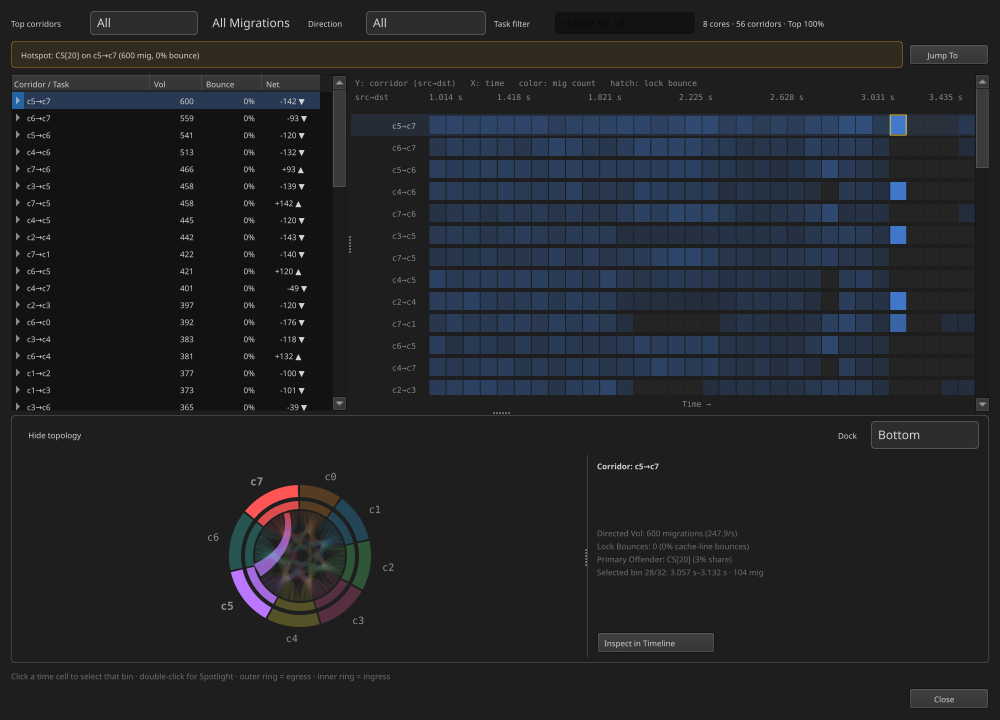

## BTFViewer {.btf-cover}

::: {.columns}
::: {.column width="62%"}

<div class="eyebrow">BEGINNER'S GUIDE</div>

<div class="cover-title">Understand an RTOS trace, step by step</div>

<p class="subtitle">Learn what to open, where to look, what the measurements mean, and how AI can help.</p>

<div class="cover-rule"></div>

<div class="cover-meta">35-SLIDE GUIDED TUTORIAL · Timeline · Statistics · Findings · AI Assistant</div>

:::
::: {.column width="38%"}


:::
:::

::: {.notes}
[Sources]
- README.md — product purpose and main features.
- WORKFLOWS.md — beginner investigation workflow.
:::

## What can BTFViewer help you answer?

<div class="question-list">
<div class="question"><div class="question-no">01</div><div><h3>What happened?</h3><p>See which task ran, on which core, and for how long.</p></div></div>
<div class="question"><div class="question-no">02</div><div><h3>Where is the problem?</h3><p>Find the affected task, core, event, and time range.</p></div></div>
<div class="question"><div class="question-no">03</div><div><h3>How large is the problem?</h3><p>Measure execution, waiting, latency, load, and migration.</p></div></div>
<div class="question"><div class="question-no">04</div><div><h3>Did the change help?</h3><p>Repeat the same measurement on a new trace.</p></div></div>
</div>

<p class="bottom-message"><strong>BTFViewer turns recorded events into measurable evidence.</strong> It does not inspect source code or simulate the RTOS scheduler.</p>

::: {.notes}
[Sources]
- README.md — Analysis and Statistics scope.
- STATISTICS.md — what BTFViewer measures.
:::

## What information is inside a trace?

```{mermaid}
%%| fig-width: 13
%%| fig-height: 4.2
%%| fig-align: center
flowchart LR
  A["BTF / STI EVENTS"] --> B["TASK EXECUTION<br/>start · stop · switch"]
  A --> C["CORE ACTIVITY<br/>active · idle · tick · gap"]
  A --> D["OPTIONAL STI DATA<br/>ready · mutex · queue · interval"]
  B --> E["TIMELINE + METRICS"]
  C --> E
  D --> E
  classDef input fill:#0d2b3c,stroke:#22d3ee,color:#e2e8f0,stroke-width:2px;
  classDef optional fill:#3b2a0b,stroke:#fbbf24,color:#fef3c7,stroke-width:2px;
  class A,B,C,E input;
  class D optional;
```

::: {.columns}
::: {.column width="50%"}
**Always available from context switches**

Task execution, core placement, CPU load, blocking intervals, and migrations.
:::
::: {.column width="50%"}
**Available only when recorded**

Dispatch latency, lifecycle, mutex, queue, intervals, and priority inheritance.
:::
:::

::: {.notes}
[Sources]
- STATISTICS.md — captured BTF/STI events and measurement limits.
- WORKFLOWS.md — required STI channels.
:::

## The interface has four working areas

<div class="viewer-map">
<div class="viewer-toolbar"><span>Open</span><span>Task / Core</span><span>Fit</span><span>Load</span><span>Analysis</span><span>AI</span></div>
<div class="viewer-main">
<div class="viewer-labels"><div>Task A</div><div>Task B</div><div>Idle</div></div>
<div class="viewer-trace"><div class="trace-row"><i style="--x:3%;--w:21%"></i><i style="--x:47%;--w:25%"></i></div><div class="trace-row"><i class="warm" style="--x:26%;--w:18%"></i><i class="warm" style="--x:75%;--w:16%"></i></div><div class="trace-row"><i class="dim" style="--x:10%;--w:11%"></i><i class="dim" style="--x:60%;--w:10%"></i></div></div>
<div class="viewer-side"><b>Statistics</b><small>measured values</small><b>Findings</b><small>possible issues</small><b>AI</b><small>guided explanation</small></div>
</div>
<div class="viewer-load"><span style="--h:28%"></span><span style="--h:52%"></span><span style="--h:44%"></span><span style="--h:78%"></span><span style="--h:61%"></span><span style="--h:88%"></span><span style="--h:48%"></span><span style="--h:70%"></span></div>
</div>

<p class="bottom-message">Use the timeline for events, the load chart for workload phases, and the right panel for measured evidence.</p>

::: {.notes}
[Sources]
- README.md — Viewer controls and panel behavior.
:::

## Each interface area answers a different question

| Area | Use it to... |
|---|---|
| **Toolbar** | Open a trace, change views, fit the trace, and open Analysis or AI |
| **Timeline** | See task execution and select exact events |
| **Load chart** | See CPU activity and workload phases |
| **Right panel** | Read Statistics, Findings, and AI results |

::: {.notes}
[Sources]
- README.md — Viewer controls and panel behavior.
:::

## Your first investigation follows eight steps

```{mermaid}
%%| fig-width: 13.5
%%| fig-height: 4.5
%%| fig-align: center
flowchart LR
  A["1 · OPEN"] --> B["2 · ORIENT"] --> C["3 · CHECK<br/>TRACE"] --> D["4 · REVIEW<br/>OVERVIEW"]
  D --> E["5 · FIND<br/>A LEAD"] --> F["6 · SCOPE"] --> G["7 · VERIFY"] --> H["8 · RECORD"]
  classDef normal fill:#0d2b3c,stroke:#22d3ee,color:#e2e8f0,stroke-width:2px;
  classDef finish fill:#153528,stroke:#34d399,color:#d1fae5,stroke-width:2px;
  class A,B,C,D,E,F,G normal;
  class H finish;
```

<p class="bottom-message">Do not begin with a cause. Begin with the full trace, then narrow the scope.</p>

::: {.notes}
[Sources]
- README.md — Basic analysis workflow.
- WORKFLOWS.md — 10-minute first pass.
:::

## Step 1 — Open the trace and select Fit

::: {.columns .action-result gap="large"}
::: {.column width="48%"}

### Do this

1. Select **Open**.
2. Choose a `.btf`, compressed trace, ZIP archive, or `.xtf` demo.
3. Select **Fit** or press `Ctrl+0`.
4. Confirm that the full capture is visible.

:::
::: {.column width="52%"}

### You should learn

- Total trace duration
- Number of tasks and CPU cores
- Startup, steady-state, burst, idle, and shutdown phases
- Whether the reported problem is inside the capture

:::
:::

<p class="tip"><strong>New user tip:</strong> Run the bundled 8-core demo before analysing an application trace.</p>

::: {.notes}
[Sources]
- README.md — Quick start, guided demo, Fit control.
- WORKFLOWS.md — Open and orient the trace.
:::

## Step 2 — Use Task View, Core View, and Load

::: {.columns gap="large"}
::: {.column width="50%"}

### Task View

<div class="timeline">
<div class="lane"><label>Sensor</label><i style="--x:4%;--w:25%"></i><i style="--x:49%;--w:20%"></i></div>
<div class="lane"><label>Control</label><i class="warm" style="--x:31%;--w:16%"></i><i class="warm" style="--x:72%;--w:22%"></i></div>
<div class="lane"><label>Logger</label><i class="dim" style="--x:12%;--w:13%"></i><i class="dim" style="--x:78%;--w:16%"></i></div>
</div>

Follow one task across cores.

:::
::: {.column width="50%"}

### Core View

<div class="timeline">
<div class="lane"><label>Core 0</label><i style="--x:3%;--w:23%"></i><i class="warm" style="--x:29%;--w:18%"></i><i style="--x:66%;--w:26%"></i></div>
<div class="lane"><label>Core 1</label><i class="dim" style="--x:8%;--w:17%"></i><i style="--x:48%;--w:17%"></i></div>
<div class="lane"><label>Core 2</label><i class="warm" style="--x:18%;--w:22%"></i><i class="dim" style="--x:73%;--w:19%"></i></div>
</div>

See which task occupied each core.

:::
:::

<p class="tip"><strong>Enable Load:</strong> use the chart below the timeline to find busy, idle, and unbalanced phases.</p>

::: {.notes}
[Sources]
- README.md — Task/Core views and CPU Load.
:::

## Step 3 — Check trace quality first

::: {.columns .action-result gap="large"}
::: {.column width="50%"}

### Open Summary

- Confirm the capture duration.
- Confirm the expected tasks and CPU cores.
- Check that the reported incident is inside the capture.

:::
::: {.column width="50%"}

### Open Trace Health (TICK)

- Look for missing or irregular ticks.
- Look for large gaps or a short capture.
- Confirm the required STI channels were recorded.
- Check a busy window if TICKLESS idle is expected.

:::
:::

<p class="bottom-message">Check the recording before investigating the application.</p>

::: {.notes}
[Sources]
- WORKFLOWS.md — Check trace quality first.
- STATISTICS.md — Trace Health limitations.
:::

## Decide whether the trace is usable

<div class="decision-path"><div class="decision-good"><b>Usable trace</b><span>The incident is captured and the required events are present. Continue to the full-trace overview.</span></div><div class="decision-bad"><b>Missing evidence</b><span>Fix instrumentation or capture settings, then record the workload again.</span></div></div>

<p class="tip"><strong>Remember:</strong> TICKLESS is not automatically an error. Missing evidence is a limitation, not proof of an application fault.</p>

::: {.notes}
[Sources]
- WORKFLOWS.md — Check trace quality first.
- STATISTICS.md — Trace Health limitations.
:::

## Step 4 — Review capacity and activity

| Open this Statistics section | Information you receive |
|---|---|
| **Summary / Core utilisation** | Duration, tasks, cores, total load, and load balance |
| **Top tasks by CPU** | Tasks that use the most CPU time |
| **Core Time Breakdown** | Active, Idle, Tick, and Gap time for each core |
| **Execution Time Per Slice** | Typical and worst on-CPU slice duration |

<p class="bottom-message"><strong>First question:</strong> Is the workload using CPU capacity as expected?</p>

::: {.notes}
[Sources]
- WORKFLOWS.md — Build a full-trace overview.
- STATISTICS.md — Statistics at a glance.
:::

## Step 4 — Review timing and anomalies

| Open this Statistics section | Information you receive |
|---|---|
| **Blocking Time** | Tasks with long off-CPU intervals |
| **Core Migrations** | Tasks that move frequently between cores |
| **Timeline Anomalies / Worst Events** | Candidate events and time ranges to inspect |

<p class="bottom-message"><strong>Goal:</strong> understand the workload before you focus on one problem.</p>

::: {.notes}
[Sources]
- WORKFLOWS.md — Build a full-trace overview.
- STATISTICS.md — Statistics at a glance.
:::

## Step 4 — Understand core migration

::: {.columns .migration-explainer gap="large"}
::: {.column width="44%"}

### What is a migration?

<div class="migration-definition"><span>SAME TASK</span><div><b>Core 5</b><i>→</i><b>Core 7</b></div><p>Consecutive execution slices of one task run on different CPU cores.</p></div>

:::
::: {.column width="56%"}

| Heatmap item | Simple meaning |
|---|---|
| **Corridor** | Directed path from one core to another |
| **Vol** | Migration count in the visible time range |
| **Bounce** | Migrations associated with cross-core mutex holding |
| **Time bin** | When that corridor becomes active |

:::
:::

<p class="tip"><strong>Migration is not automatically a fault.</strong> Investigate when it is frequent, bursty, or appears with latency, load imbalance, short dwell time, or synchronization activity.</p>

::: {.notes}
[Sources]
- STATISTICS.md — migration definition, Core-Pair Migration Summary, and Migration & Corridor Inspector.
:::

## Step 4 — Read the core migration heatmap

<div class="heatmap-frame"></div>

<p class="chart-caption">Actual BTFViewer export · top corridors at left · activity over time at right</p>

::: {.notes}
[Sources]
- migration.svg — BTFViewer Migration & Corridor Inspector export supplied for this presentation.
- STATISTICS.md — Core Migrations and migration-path analysis.
:::

## Step 4 — Investigate a migration hotspot

::: {.columns .migration-steps gap="large"}
::: {.column width="50%"}

1. Open **Core Migrations** and the heatmap.
2. Sort corridors by migration volume.
3. Select a repeated source-to-destination path.
4. Find the busiest time bins in the heatmap.

:::
::: {.column width="50%"}

5. Select **Inspect in Timeline**.
6. Place C1–C2 around one migration burst.
7. Check load, affinity, overhead, and synchronization activity.

:::
:::

<p class="bottom-message">The heatmap locates repeated corridors; the timeline and scoped metrics show whether they are harmful.</p>

::: {.notes}
[Sources]
- STATISTICS.md — Core Migrations, heatmap, and related evidence.
- WORKFLOWS.md — migration symptom path and timeline verification.
:::

## Statistics is organized around five questions

<div class="metric-domains">
<div class="metric-domain"><div class="step-number">01</div><div><h3>Is CPU capacity balanced?</h3><p>Utilisation · active cores · switch overhead · top CPU tasks</p></div></div>
<div class="metric-domain"><div class="step-number">02</div><div><h3>Where does each task run?</h3><p>Affinity · Task × Core · migration paths · load over time</p></div></div>
<div class="metric-domain"><div class="step-number">03</div><div><h3>How long does work or waiting take?</h3><p>Execution · blocking · dispatch latency · period · jitter</p></div></div>
<div class="metric-domain"><div class="step-number">04</div><div><h3>What delayed the task?</h3><p>Preemption · mutex · semaphore · queue · priority inheritance</p></div></div>
<div class="metric-domain wide"><div class="step-number">05</div><div><h3>Which events need attention?</h3><p>Anomalies · worst events · critical path · recurring patterns · intervals</p></div></div>
</div>

::: {.notes}
[Sources]
- STATISTICS.md — Statistics at a glance.
:::

## Know what each timing metric means

| Metric | Simple meaning | Typical question |
|---|---|---|
| **Execution Time** | Time running on a CPU | Did the task run too long? |
| **Blocking Time** | Time off-CPU between runs | Did the task wait too long? |
| **Dispatch Latency** | Ready event to first execution | Did a ready task start late? |
| **Period / Jitter** | Time between task activations | Is the task activation stable? |
| **Response Time** | Heuristic ready-to-completion delay | How long did the whole response take? |

<p class="small-note"><strong>Important:</strong> Dispatch latency and response time need suitable STI events. If the trace does not contain them, the result may be limited or heuristic.</p>

::: {.notes}
[Sources]
- STATISTICS.md — Task timing and health.
:::

## Percentiles reveal slow events

::: {.columns gap="large"}
::: {.column width="70%"}

<div class="percentile-plot">
<i class="bar" style="--x:3%;--h:22%"></i><i class="bar" style="--x:11%;--h:38%"></i><i class="bar" style="--x:19%;--h:68%"></i><i class="bar" style="--x:27%;--h:88%"></i><i class="bar" style="--x:35%;--h:63%"></i><i class="bar" style="--x:43%;--h:42%"></i><i class="bar" style="--x:51%;--h:29%"></i><i class="bar" style="--x:59%;--h:19%"></i><i class="bar" style="--x:67%;--h:12%"></i><i class="bar tail" style="--x:84%;--h:6%"></i>
<div class="mark" style="--x:31%"><div class="mark-label">Avg</div></div>
<div class="mark" style="--x:69%"><div class="mark-label">p95</div></div>
<div class="mark" style="--x:80%"><div class="mark-label">p99</div></div>
<div class="mark max" style="--x:92%"><div class="mark-label">Max</div></div>
</div>

<div class="chart-caption">Conceptual distribution — not measured data</div>

:::
::: {.column width="30%"}

### Avg
Typical overall behavior

### p95
The slower part of normal operation

### p99
Severe events that repeat

### Max
The worst observed event

:::
:::

::: {.notes}
[Sources]
- README.md — Reading Max, p95, and p99.
- STATISTICS.md — distributions and metric limits.
:::

## Step 5 — Choose one finding to investigate

```{mermaid}
%%| fig-width: 13
%%| fig-height: 3.5
%%| fig-align: center
flowchart LR
  A["ANALYSIS<br/>ranked findings"] --> B["SELECT<br/>one relevant finding"]
  B --> C["OPEN<br/>named Statistics section"]
  C --> D["REPEAT<br/>the reported value"]
  D --> E["JUMP<br/>to the event"]
  classDef normal fill:#0d2b3c,stroke:#22d3ee,color:#e2e8f0,stroke-width:2px;
  class A,B,C,D,E normal;
```

Each finding can provide:

- Severity: **Critical**, **Warning**, or **Info**
- Affected task, core, or metric
- A related Statistics section
- A useful time range, when available

<p class="bottom-message"><strong>A finding is a lead.</strong> It is not a confirmed root cause.</p>

::: {.notes}
[Sources]
- README.md — Analysis Findings.
- WORKFLOWS.md — deterministic triage.
:::

## Step 6 — Use C1–C2 to isolate the incident

<div class="scope-strip">
<div class="scope-phases">
<div class="phase phase-startup"><div class="phase-title">STARTUP</div><div class="phase-sub">initialisation</div></div>
<div class="phase phase-steady"><div class="phase-title">STEADY STATE</div><div class="phase-sub">normal workload</div></div>
<div class="phase phase-incident"><div class="phase-title">INCIDENT</div><div class="phase-sub">observable burst</div></div>
<div class="phase phase-recovery"><div class="phase-title">RECOVERY</div><div class="phase-sub">return to baseline</div></div>
</div>
<div class="cursor c1"><div class="cursor-label">C1</div></div>
<div class="cursor c2"><div class="cursor-label">C2</div></div>
<div class="scope-bracket"></div>
</div>

<p class="bottom-message">C1–C2 turns a long trace into one incident that can be measured and verified.</p>

::: {.notes}
[Sources]
- README.md — cursors and time ranges.
- WORKFLOWS.md — scope one incident.
:::

## Set the incident range in five actions

1. Jump to the outlier or finding.
2. Place **C1** before the possible cause and **C2** after the visible effect.
3. Select **Zoom to cursor range** (`Ctrl+R`).
4. Enable **Limit to C1–Cn** in Statistics.
5. Reopen **Analysis** for the same scope.

<p class="tip"><strong>Expected result:</strong> Statistics, Findings, and AI now describe the same incident window.</p>

::: {.notes}
[Sources]
- README.md — cursors and time ranges.
- WORKFLOWS.md — scope one incident.
:::

## Step 7 — Verify the event on the timeline

```{mermaid}
%%| fig-width: 13
%%| fig-height: 3.4
%%| fig-align: center
flowchart LR
  A["CLAIM"] --> B["METRIC<br/>repeats in scope"] --> C["TIME<br/>exact event found"] --> D["TIMELINE<br/>nearby activity matches"] --> E["RESULT"]
  classDef normal fill:#0d2b3c,stroke:#22d3ee,color:#e2e8f0,stroke-width:2px;
  classDef result fill:#3b2a0b,stroke:#fbbf24,color:#fef3c7,stroke-width:2px;
  class A,B,C,D normal;
  class E result;
```

<p class="bottom-message">A cause is supported only when the scoped metric, timestamp, and nearby timeline activity agree.</p>

::: {.notes}
[Sources]
- WORKFLOWS.md — verify the hypothesis on the timeline.
:::

## Ask four questions before accepting a cause

1. Does the value repeat inside C1–C2?
2. Do the task, core, time, and duration match?
3. What happened immediately before and after the event?
4. Is there another simple explanation?

<p class="tip"><strong>If one answer is unclear:</strong> keep the result as “not yet proven” and collect better evidence.</p>

::: {.notes}
[Sources]
- WORKFLOWS.md — verify the hypothesis on the timeline.
:::

## Step 8 — Record a repeatable result

::: {.columns .evidence-columns gap="large"}
::: {.column width="50%"}

### Record the measurement

- Trace name and capture conditions
- Full-trace and cursor time range
- Affected task and core
- Avg, p95, p99, and Max
- Exact evidence timestamp

:::
::: {.column width="50%"}

### Record the conclusion

- Supported cause
- Other causes checked
- Missing trace data
- Change to test
- Expected result
- Final confidence level

:::
:::

<p class="tip"><strong>Useful exports:</strong> HTML/CSV report, annotated PNG, selected BTF range, bookmarks, and Investigation Case.</p>

::: {.notes}
[Sources]
- WORKFLOWS.md — Close the investigation.
- README.md — Export options.
:::

## Use AI only after you select a scope

::: {.columns .ai-when gap="large"}
::: {.column width="50%"}

### Good starting context

- One selected finding
- One task or timeline segment
- A C1–C2 time range
- Two traces for comparison

:::
::: {.column width="50%"}

### Weak starting context

- “Find every problem” with no scope
- Empty or unrelated Statistics
- A time range that misses the incident
- A request for a fix before evidence exists

:::
:::

<p class="bottom-message"><strong>AI explains measured evidence.</strong> It does not replace Statistics or timeline verification.</p>

::: {.notes}
[Sources]
- AI.md — Where to start and scoping an event or region.
:::

## Choose an AI action for investigation

| Your question | Use this action | AI receives |
|---|---|---|
| What should I inspect first? | **Triage findings** | Ranked Findings and summary metrics |
| Why may this finding happen? | **Investigate** | Finding, task, scope, and requested evidence |
| Does the evidence support it? | **Verify with AI…** | Evidence that agrees and disagrees |
| What happened between C1 and C2? | **Explain this region with AI** | Cursor-scoped Statistics and events |

::: {.notes}
[Sources]
- AI.md — Getting started, entry points, and common use cases.
:::

## Choose an AI action for events and changes

| Your question | Use this action | AI receives |
|---|---|---|
| What happened in this segment? | **Ask AI about this event** | Selected task, core, time, and nearby events |
| Which change is worth testing? | **What-if / Optimize** | Measured slices and heuristic assumptions |
| Did the new build improve? | **Compare → Query with AI…** | Before/after comparison tables |

::: {.notes}
[Sources]
- AI.md — Getting started, entry points, and common use cases.
:::

## What can the AI Assistant produce?

<div class="ai-output">
<div><div class="step-number">01</div><h3>Explanation</h3><p>Plain-language meaning of a finding, metric, event, or region.</p></div>
<div><div class="step-number">02</div><h3>Investigation plan</h3><p>Possible causes, required checks, and the next evidence to collect.</p></div>
<div><div class="step-number">03</div><h3>Evidence links</h3><p>Named metrics plus clickable <code>jump:TIME</code> or time ranges.</p></div>
<div><div class="step-number">04</div><h3>Verification result</h3><p>Supported, not yet proven, or not supported—with reasons.</p></div>
<div><div class="step-number">05</div><h3>Experiment ideas</h3><p>Estimated changes to test on firmware or configuration.</p></div>
<div><div class="step-number">06</div><h3>Report</h3><p>Evidence, conclusion, confidence, alternatives, and next action.</p></div>
</div>

::: {.notes}
[Sources]
- AI.md — What the panel does, Evidence and Validation, report tools.
:::

## AI follows the same six-step workflow

<div class="stage-row">
<div class="stage"><div class="step-number">01</div><h3>Triage</h3><p>What looks wrong?</p></div>
<div class="stage"><div class="step-number">02</div><h3>Scope</h3><p>Where does it happen?</p></div>
<div class="stage"><div class="step-number">03</div><h3>Investigate</h3><p>What may cause it?</p></div>
<div class="stage"><div class="step-number">04</div><h3>Verify</h3><p>Does evidence agree?</p></div>
<div class="stage"><div class="step-number">05</div><h3>Experiment</h3><p>What should we test?</p></div>
<div class="stage"><div class="step-number">06</div><h3>Compare</h3><p>Did it improve?</p></div>
</div>

<p class="bottom-message"><strong>Do not skip from Triage to Experiment.</strong> A change is useful only after the possible cause matches the evidence.</p>

::: {.notes}
[Sources]
- AI.md — end-to-end flow and investigation workflow.
:::

## Check every AI answer before accepting it

::: {.columns .action-result gap="large"}
::: {.column width="52%"}

### Accept the answer only when

- Named metrics exist in Statistics
- Every cited time is inside the selected scope
- Task, core, duration, and events match
- Other possible causes were considered
- Confidence matches the available evidence

:::
::: {.column width="48%"}

### Reject or repeat the question when

- A `jump:TIME` is outside C1–C2
- The AI assumes an event that was not captured
- An estimate is presented as a measurement
- The conclusion appears before evidence is collected
- The scope is empty or incorrect

:::
:::

::: {.notes}
[Sources]
- AI.md — Evidence and validation.
- WORKFLOWS.md — AI validation rules.
:::

## Know what AI cannot do

<div class="boundary-list">
<div><b>It cannot read firmware source or ELF files.</b><span>BTFViewer provides trace evidence, not code analysis.</span></div>
<div><b>It cannot recover events that were not recorded.</b><span>Missing trace data must remain a stated limitation.</span></div>
<div><b>It cannot simulate the RTOS scheduler.</b><span>What-if and Optimize are heuristic estimates.</span></div>
<div><b>It cannot confirm a cause by wording alone.</b><span>The metric and timeline must support the conclusion.</span></div>
</div>

<p class="small-note"><strong>Privacy:</strong> local models keep requests local. Cloud models receive the selected evidence according to your endpoint and settings. Review anonymization and sensitive-trace options.</p>

::: {.notes}
[Sources]
- AI.md — responsibility, simulator limits, privacy, and what leaves the machine.
:::

## After a change, repeat the same measurement

<div class="measurement-loop">
<div class="state"><div class="step-number">BASELINE</div><h3>Trace A</h3><p>Record workload, scope, metric, evidence time, and limitations.</p></div>
<div class="arrow">→</div>
<div class="state"><div class="step-number">ONE CHANGE</div><h3>Test</h3><p>Change affinity, priority, mutex scope, period, or workload distribution.</p></div>
<div class="arrow">→</div>
<div class="state"><div class="step-number">RESULT</div><h3>Trace B</h3><p>Use the same workload phase, cursor scope, and Statistics metrics.</p></div>
</div>

<p class="bottom-message">Check the target metric and side effects. The result may be better, unchanged, worse, or still unclear.</p>

::: {.notes}
[Sources]
- WORKFLOWS.md — Test one measurable change.
- AI.md — Compare and experiment close-out.
:::

## Beginner checklist — find the incident

::: {.checklist-single}

- [ ] I selected **Fit** and reviewed the full trace.
- [ ] I compared Task View and Core View.
- [ ] I enabled **Load** and identified workload phases.
- [ ] I checked Summary and Trace Health first.
- [ ] I treated Findings as leads, not facts.

:::

<p class="tip"><strong>If you are unsure where to start:</strong> Analysis → select one relevant finding → open its Statistics section → jump to the event.</p>

::: {.notes}
[Sources]
- WORKFLOWS.md — Beginner checklist.
:::

## Beginner checklist — verify and close

::: {.checklist-single .finish}

- [ ] I used C1–C2 and **Limit to C1–Cn**.
- [ ] I checked p95, p99, and Max—not only Avg.
- [ ] I verified the exact event on the timeline.
- [ ] I checked every AI evidence link.
- [ ] I repeated the same measurement after a change.

:::

<p class="bottom-message"><strong>Close only when the evidence can be repeated.</strong> Record the scope, metric, timestamp, conclusion, and remaining limitations.</p>

::: {.notes}
[Sources]
- WORKFLOWS.md — Beginner checklist.
:::

## Start with evidence. Finish with a repeatable result. {.finale}

<div class="cover-rule"></div>

Open → Orient → Check → Measure → Scope → Verify → Improve

<div class="keywords">TIMELINE · STATISTICS · FINDINGS · AI ASSISTANCE · RECAPTURE</div>

::: {.notes}
[Sources]
- README.md, STATISTICS.md, AI.md, WORKFLOWS.md.
:::
