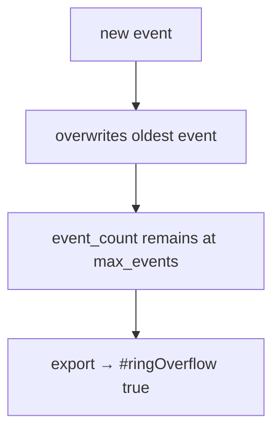
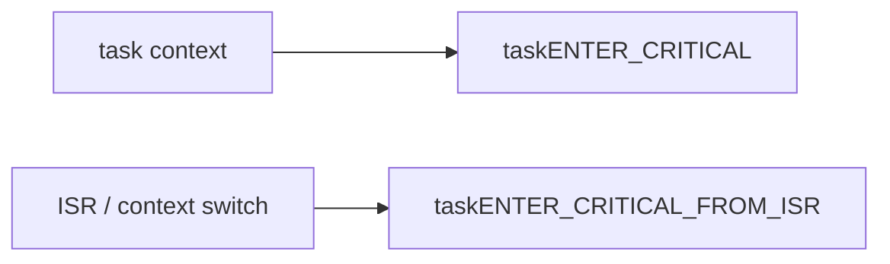
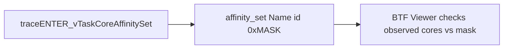
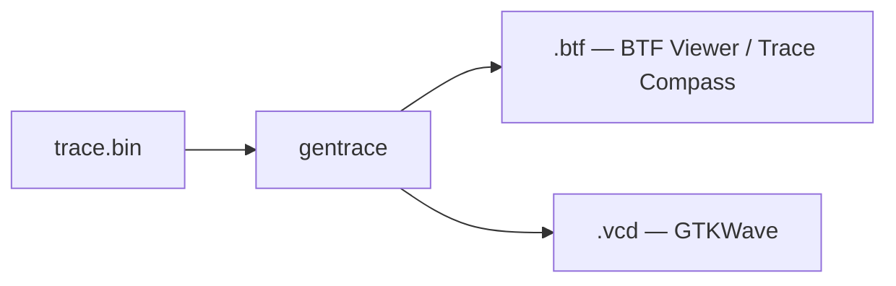

# FreeRTOS-BTF-Trace — Porting Guide

Notes for integrating the trace library into an existing FreeRTOS target.

| Document | Contents |
|---|---|
| [README.md](README.md) | Build, demo, and viewing |
| [TRACE_FORMAT.md](TRACE_FORMAT.md) | Binary layout and BTF event mapping |
| [BTFViewer/WORKFLOWS.md](BTFViewer/WORKFLOWS.md) | BTF Viewer analysis workflows |

## Checklist

- [ ] Enable the FreeRTOS trace facility
- [ ] Include `FreeRTOS-Trace.h`
- [ ] Compile `btf_trace.c`
- [ ] Implement `xGetCycles()`
- [ ] Set `configCPU_CLOCK_HZ` correctly
- [ ] Choose file, live, or buffer-only dump mode
- [ ] Call `traceSTART()` before the scheduler
- [ ] Call `traceEND()` when capture ends
- [ ] Size the task table and event ring
- [ ] Verify trace locking on SMP targets
- [ ] Convert `trace.bin` and check the quality flags

## 1. Add the trace library

In `FreeRTOSConfig.h`:

```c
#include "FreeRTOS-Trace/FreeRTOS-Trace.h"

#define configUSE_TRACE_FACILITY  1
#define configMAX_TRACE_EVENTS    4096   /* ring capacity; 16 bytes each */
#define configMAX_TRACE_TASKS     64
```

Add `FreeRTOS-Trace/` to the include path and compile:

```text
FreeRTOS-Trace/btf_trace.c
```

### Configuration options

| Macro | Default | Controls |
|---|---:|---|
| `configMAX_TRACE_TASK_NAME_LEN` | 8 | Stored task-name bytes plus NUL; slot is 4-byte aligned |
| `configINCLUDE_SCHEDULING` | 1 | Switch, create/delete, suspend/resume, priority, affinity |
| `configINCLUDE_TAGS` | 1 | Tags and interval start/stop |
| `configINCLUDE_QUEUE_EVENTS` | 1 | Queue, mutex, semaphore STI |
| `configINCLUDE_OSTICK_EVENTS` | 1 | TICK STI |

Defaults are defined in `FreeRTOS-Trace.h` / `btf_trace.h`.

## 2. Provide the time source

In `FreeRTOS-Trace/btf_port.h`, implement:

```c
uint32_t xGetCycles(void);
```

The counter must be free-running and 32-bit. DWT CYCCNT, GPT, `mtime`, or an equivalent source can be used. A 2³² wrap is expected, and `configCPU_CLOCK_HZ` / `core_clock` must match the counter frequency.

`gentrace` and `btf_dump()` extend wrapped timestamps offline.

### RISC-V demo

The demo maps `xGetCycles()` to the lower 32 bits of CLINT `mtime` through:

```c
portGET_RUN_TIME_COUNTER_VALUE()
```

Non-RISC-V builds intentionally hit `#error` until this port hook is implemented.

## 3. Choose a dump mode

Configure the mode in `btf_port.h`, or define it before including the trace header.

| Mode | Configuration | Result |
|---|---|---|
| **File dump** | `HAVE_FILE_DUMP` | `traceEND()` writes `TRACE_DUMP_FILENAME` (`trace.bin` by default) using stdio |
| **Live BTF** | `PRINT_BTF_DUMP` | `btf_dump()` prints BTF 2.2.0 CSV at `traceEND()` |
| **Buffer only** | Define neither | Trace remains in RAM; read `trace_data` with JTAG/debugger |

For live BTF:

| `TIMESCALE_US` | BTF time scale |
|---:|---|
| 1 | `#timeScale us` |
| 0 | `#timeScale ns` |

File dump requires a working C library `FILE` implementation. On bare metal without stdio, use buffer-only or live dump.

## 4. Start and stop capture

Call `traceSTART()` before the scheduler:

```c
int main(void)
{
#if configUSE_TRACE_FACILITY
    traceSTART();
#endif

    xTaskCreate(...);
    vTaskStartScheduler();
}
```

Call `traceEND()` when the run finishes:

```c
#if configUSE_TRACE_FACILITY
    traceEND();
#endif
```

### Ring sizing

`configMAX_TRACE_EVENTS` controls the number of 16-byte event records retained.

When the ring fills:



Choose a ring large enough for the capture interval you intend to analyze.

## 5. Add application instrumentation

With `configINCLUDE_TAGS=1`:

### Tags

```c
traceTAG(0, (int)allocated);
```

| API | Purpose |
|---|---|
| `traceTAG(t, v)` | Sample a 32-bit value; `t = 0…7` |
| BTF output | `tag0_event … tag7_event` |

### Intervals

```c
traceINTERVAL_START(1);
do_work();
traceINTERVAL_STOP(1);
```

| API | Stored data |
|---|---|
| `traceINTERVAL_START(id)` | `param1=id`, `param2=caller task id` |
| `traceINTERVAL_STOP(id)` | Same id/task pairing |
| BTF note | `{id} tid:{task_id}` |

Prefer `traceTAG()` and `traceINTERVAL_*()` in task code because they take the trace lock.

Use `btf_traceTAG()` / `btf_traceINTERVAL_*()` only when you already hold the lock or the wrappers are unsuitable.

The demo uses tag 0 for heap bytes and interval ids 0–11 for test regions.

## 6. SMP requirements

Trace hooks use:



The RISC-V SMP port implements both as **recursive spinlocks**. This allows `traceTASK_SWITCHED_OUT` / `traceTASK_SWITCHED_IN` to run inside `vTaskSwitchContext` while the ISR lock is already held.

> A non-recursive lock can deadlock in this path. Match the recursive behavior on another SMP port.

### Core-affinity tracing

Affinity STI requires:

```c
#define configUSE_CORE_AFFINITY      1
#define configINCLUDE_SCHEDULING     1
```

FreeRTOS V11 invokes `traceENTER_vTaskCoreAffinitySet`. The trace library records:



`configNUMBER_OF_CORES` must be **1–31**.

## 7. Convert the capture

For file-dump mode:

```bash
tools/gentrace trace.bin trace.btf
tools/gentrace -v trace.bin trace.vcd
```



## 8. Validate the port

Verify the capture before using it for performance analysis.

| Check | Expected |
|---|---|
| BTF opens successfully | Header and event layout accepted |
| Task names appear | Task table is sized correctly |
| Timeline is monotonic | Counter frequency / wrap handling correct |
| Core ids are valid | SMP encoding works |
| TICK events appear when enabled | `configINCLUDE_OSTICK_EVENTS` works |
| Tags / intervals pair correctly | Application instrumentation works |
| Affinity events appear when enabled | Scheduling hooks work |
| No unexpected quality flags | Capture was complete |

Quality flags:

| Flag | Meaning |
|---|---|
| `#ringOverflow true` | Ring wrapped; oldest events were lost |
| `#taskTableOverflow true` | A task id could not be represented in the name table |
| `#truncated true` | `traceEND()` was not called or the binary dump is incomplete |

For exact binary and BTF mappings, see **[TRACE_FORMAT.md](TRACE_FORMAT.md)**.
