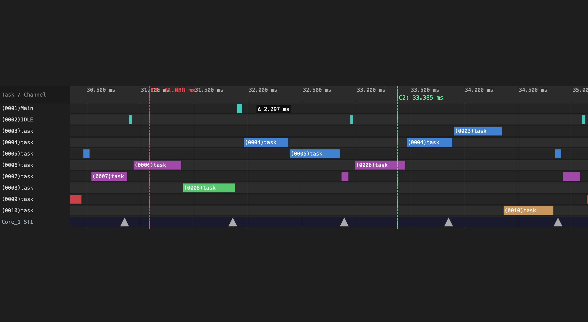

# FreeRTOS-BTF-Trace

[](https://www.codacy.com/gh/kuopinghsu/FreeRTOS-BTF-Trace/dashboard?utm_source=github.com&utm_medium=referral&utm_content=kuopinghsu/FreeRTOS-BTF-Trace&utm_campaign=Badge_Grade)

A lightweight, open-source framework for recording and visualising FreeRTOS task scheduling traces.
Trace output is produced in two industry-standard formats:

- **BTF (Best Trace Format)** — a CSV-based format designed for system-level timing and performance analysis of embedded real-time systems. Specification available [here](https://assets.vector.com/cms/content/products/TA_Tool_Suite/Docs/BTF_Specification.pdf).
- **VCD (Value Change Dump)** — an ASCII-based waveform format compatible with logic simulation tools such as [GTKWave](http://gtkwave.sourceforge.net).

---

## Overview

Identifying performance bottlenecks in real-time embedded systems often requires a full-featured commercial tool such as [Percepio Tracealyzer](https://percepio.com/tracealyzer/). This project provides a simple, extensible, and completely free alternative. It instruments FreeRTOS with trace hooks, captures context-switch events into a compact in-memory buffer, and converts that buffer to BTF or VCD for offline analysis.

A related approach using [BareCTF](https://barectf.org/) and [Eclipse Trace Compass](https://www.eclipse.org/tracecompass/) is available at [freertos-barectf](https://github.com/gpollo/freertos-barectf).

---

## Repository Structure

```
FreeRTOS-Trace/   # Trace instrumentation library (btf_trace.c, btf_trace.h, btf_port.h)
tools/            # gentrace: converts the binary dump to BTF or VCD
BTFViewer/        # Interactive BTF viewer (PyQt5 desktop application)
Demo/             # Example project targeting the srv32 RISC-V ISS
tracedata/        # Sample trace files (example.btf, example.vcd)
```

---

## Getting Started

### Prerequisites

The included demo targets [srv32](https://github.com/kuopinghsu/srv32), a RISC-V instruction set simulator.
Install the required RISC-V toolchain as described in the srv32 [Building toolchains](https://github.com/kuopinghsu/srv32#building-toolchains) section.

### Build and Run

```bash
make run
```

This compiles the demo, executes it on the srv32 ISS, and writes `tracedata/trace.btf` and `tracedata/trace.vcd`.

---

## Visualising the Trace

### BTF Viewer (built-in)

An interactive Gantt-style viewer is included in the `BTFViewer/` directory.

**Requirements:** Python 3.8+ and PyQt5 ≥ 5.15

```bash
pip install PyQt5
python BTFViewer/btf_viewer.py tracedata/example.btf
```

See [`BTFViewer/README.md`](BTFViewer/README.md) for the full feature reference (zoom, cursors, export, etc.).



### Eclipse Trace Compass

Convert the binary dump to BTF format using `gentrace`, then open the resulting file in [Trace Compass](https://www.eclipse.org/tracecompass/):

```bash
gentrace dump.bin trace.btf
```


### GTKWave / VCD Viewer

Convert the binary dump to VCD format:

```bash
gentrace -v dump.bin trace.vcd
```


---

## Porting Guide

Follow these steps to integrate the trace library into your own FreeRTOS project.

### 1. Include the trace header

Add the following line to your `FreeRTOSConfig.h`:

```c
#include "FreeRTOS-Trace/FreeRTOS-Trace.h"
```

### 2. Implement the time source

Edit `FreeRTOS-Trace/btf_port.h` and define the `xGetTime()` macro to return the current system time in **nanoseconds**:

```c
#define xGetTime()  /* your platform timer, returning ns */
```

### 3. Disable live dump (use buffer mode)

Ensure `HAVE_SYS_DUMP` is **not** defined in `btf_port.h` so that trace events are stored in RAM.

### 4. Add the source file to your build

Compile `FreeRTOS-Trace/btf_trace.c` as part of your project.

### 5. Start and stop tracing

Call `traceSTART()` before the code you want to observe and `traceEND()` when done:

```c
#if configUSE_TRACE_FACILITY
    traceSTART();
#endif

/* ... code under observation ... */

#if configUSE_TRACE_FACILITY
    traceEND();
#endif
```

### 6. Locate the trace buffer

After building, use `readelf` to find the address and size of the `trace_data` symbol:

```bash
$ readelf -a task.elf | grep trace_data
21: 00021d44 65572 OBJECT  LOCAL  DEFAULT    4 trace_data
```

Run the application and dump `65572` bytes from address `0x21d44` to a binary file.

### 7. Convert to BTF or VCD

```bash
# BTF format
$ tools/gentrace dump.bin trace.btf
814 events generated

# VCD format
$ tools/gentrace -v dump.bin trace.vcd
```

### 8. Open the trace

- **BTF:** open with `BTFViewer/btf_viewer.py` or Eclipse Trace Compass.
- **VCD:** open with GTKWave or any compatible VCD viewer.

---

## License

MIT License

