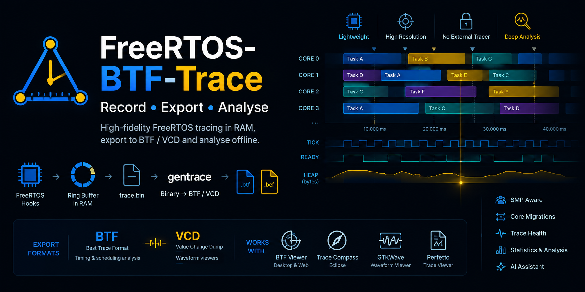

# FreeRTOS-BTF-Trace

Record FreeRTOS scheduling and synchronization events in RAM, export them as **BTF** or **VCD**, and analyze them offline without a commercial tracer.



## Documentation

| Document | Question it answers |
|---|---|
| **README.md** | What is FreeRTOS-BTF-Trace, and how do I run it? |
| **[PORTING.md](PORTING.md)** | How do I integrate the trace library on another FreeRTOS target? |
| **[TRACE_FORMAT.md](TRACE_FORMAT.md)** | What is stored in `trace.bin`, and how is it mapped to BTF? |
| **[BTFViewer/README.md](BTFViewer/README.md)** | How do I view and analyze a BTF trace? |
| **[BTFViewer/WORKFLOWS.md](BTFViewer/WORKFLOWS.md)** | How do I diagnose RTOS issues step by step? |
| **[BTFViewer/AI.md](BTFViewer/AI.md)** | How does the BTF Viewer AI Assistant work? |

## 1. Overview

The trace path is deliberately simple:

```text
FreeRTOS trace hooks
        ↓
compact ring buffer in RAM
        ↓
     trace.bin
        ↓
     gentrace
      ↙    ↘
    .btf   .vcd
     ↓       ↓
BTF Viewer  GTKWave
Trace Compass
```

| Format | Primary use |
|---|---|
| **BTF** (Best Trace Format) | Scheduling/timing analysis in BTF Viewer or Eclipse Trace Compass |
| **VCD** (Value Change Dump) | Waveform inspection in GTKWave |


[Live demo](https://apps.kuoping.com/btf_viewer.html?demo)

### Repository layout

```text
FreeRTOS-Trace/   Trace hooks, ring buffer, dump support
tools/            gentrace — trace.bin → BTF / VCD
sim/              RV64 SMP simulator (--cores N)
Demo/             FreeRTOS SMP demo running under sim/
BTFViewer/        Desktop + Web BTF analysis viewer
tracedata/        Sample BTF / VCD traces
```

## 2. Quick start

The bundled demo targets **RISC-V RV64** and runs in `sim/`.

### 2.1 Toolchain

Install xPack RISC-V GCC. The default build looks for:

```text
/opt/xpack-riscv-none-elf-gcc-15.2.0-1/bin/riscv-none-elf-gcc
```

Override it when needed:

```bash
make run RISCV_PREFIX=/path/to/riscv-none-elf-
```

### 2.2 Build and capture

```bash
make run            # single core
make CORES=2 run    # 2-core SMP
make CORES=8 run    # 8-core SMP
```

The first run clones **FreeRTOS-Kernel V11.3.0**. When the simulator exits, `gentrace` generates:

```text
tracedata/trace.btf
tracedata/trace.vcd
```

### 2.3 Open the BTF trace

```bash
pip install -r BTFViewer/requirements.txt
python BTFViewer/builds/btf_viewer.py tracedata/trace.btf
```

Sample captures include:

```text
example.btf.gz
example-2cores.btf.gz
example-4cores.btf.gz
example-8cores.btf.gz
example-16cores.btf.gz
```

BTF Viewer Desktop and Web accept `.btf`, `.gz`, `.bz2`, and `.zip`.

## 3. Demo workload

`Demo/examples/freertos_test/` contains **11 tests**. Tests 1–10 stay busy using yields; test 11 uses `vTaskDelay` so tickful and tickless idle can be compared.

```bash
make TICKLESS=1 run
```

| # | Test | Exercises |
|---:|---|---|
| 1 | Context-switch stress | Rapid voluntary yields across cores |
| 2 | Mutex contention | Priority-inheritance mutex under load |
| 3 | Counting semaphore + mutex | Mixed synchronization primitives |
| 4 | Task notifications | Direct-to-task notification API |
| 5 | Event groups | Multi-bit event synchronization |
| 6 | Queue stress | Producer / consumer queues |
| 7 | Task priority set | `vTaskPrioritySet` / `traceTASK_PRIORITY_SET` |
| 8 | Priority inversion | L / M / H on one core, 3 rounds (`T8_ROUNDS`) |
| 9 | Task suspend / resume | Suspend while blocked/running (`T9_SUBJECTS × T9_ROUNDS`) |
| 10 | Core affinity | Pin/migrate with `vTaskCoreAffinitySet` |
| 11 | Tickless idle | `vTaskDelay` windows for TICK vs TICKLESS |

Interval id **0** wraps each test from the runner. IDs **1–11** identify the corresponding test.

## 4. Viewing traces

### BTF Viewer

Use BTF Viewer for task/core timelines, cursors, Statistics, Analysis Findings, migration inspection, Trace Compare, AI-assisted investigation, and export.

```bash
python BTFViewer/builds/btf_viewer.py tracedata/example-8cores.btf.gz
# or open BTFViewer/builds/btf_viewer.html
```

Requirements: Python 3.8+ and PySide6 ≥ 6.4.

For analysis procedures, continue with **[BTFViewer/WORKFLOWS.md](BTFViewer/WORKFLOWS.md)**.

### Trace Compass

Open `tracedata/trace.btf` directly.


### GTKWave

```bash
gtkwave tracedata/trace.vcd
```


## 5. Custom instrumentation

The demo records heap bytes in use on every tick:

```c
btf_traceTAG(0, ...);
```

This becomes STI `tag0_event`. The demo also uses interval start/stop events to mark test regions.


On SMP traces, BTF Viewer can inspect task migrations and migration corridors.


## 6. Porting to another target

The minimum integration flow is:

```text
Include trace header
      ↓
Provide 32-bit cycle counter
      ↓
Choose dump mode
      ↓
Call traceSTART()
      ↓
Run workload
      ↓
Call traceEND()
      ↓
Convert / inspect trace
```

See **[PORTING.md](PORTING.md)** for configuration, time source, dump modes, tags/intervals, and SMP locking requirements.

See **[TRACE_FORMAT.md](TRACE_FORMAT.md)** for the binary layout, event encoding, BTF mapping, and trace quality flags.

## 7. Related project

A related BareCTF + Trace Compass approach is [freertos-barectf](https://github.com/gpollo/freertos-barectf).

## 8. License

MIT
