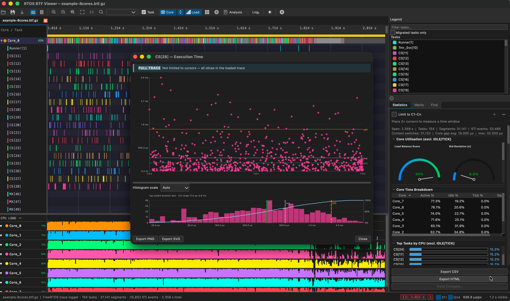

# FreeRTOS-BTF-Trace

A lightweight, open-source framework for recording and visualising FreeRTOS task scheduling traces.
Trace output is produced in two industry-standard formats:

- **BTF (Best Trace Format)** — a CSV-based format designed for system-level timing and performance analysis of embedded real-time systems. Specification available [here](https://assets.vector.com/cms/content/products/TA_Tool_Suite/Docs/BTF_Specification.pdf).
- **VCD (Value Change Dump)** — an ASCII-based waveform format compatible with logic simulation tools such as [GTKWave](http://gtkwave.sourceforge.net).

## Screenshot



[DEMO](https://apps.kuoping.com/btf-viewer.html)

---

## Overview

Identifying performance bottlenecks in real-time embedded systems often requires a full-featured commercial tool such as [Percepio Tracealyzer](https://percepio.com/tracealyzer/). This project provides a simple, extensible, and completely free alternative. It instruments FreeRTOS with trace hooks, captures context-switch events into a compact in-memory buffer, and converts that buffer to BTF or VCD for offline analysis.

A related approach using [BareCTF](https://barectf.org/) and [Eclipse Trace Compass](https://www.eclipse.org/tracecompass/) is available at [freertos-barectf](https://github.com/gpollo/freertos-barectf).

### Trace pipeline

```
FreeRTOS trace hooks
  → btf_trace_add_*() (ring buffer in RAM)
  → traceEND() writes trace.bin via fopen/fwrite/fclose
  → tools/gentrace
  → .btf / .vcd
  → BTFViewer (desktop or web) / Trace Compass / GTKWave
```

---

## Repository Structure

```
FreeRTOS-Trace/   Trace library (hooks, ring buffer, file dump via fopen)
tools/            gentrace — binary dump → BTF or VCD
sim/              RV64 SMP instruction-set simulator (C++, supports --cores N)
Demo/             FreeRTOS SMP demo built for RV64, run under sim/
BTFViewer/        Interactive BTF viewer (PyQt5 desktop + Vue 3 web app)
tracedata/        Sample outputs (example.btf, example.vcd)
images/           Documentation screenshots
```

---

## Getting Started

### Prerequisites

The demo targets **RISC-V RV64** and runs on the included **`sim/`** simulator (a custom C++ RV64 ISS that supports SMP via `--cores N`).

Install the [xPack RISC-V Embedded GCC](https://github.com/xpack-dev-tools/riscv-none-elf-gcc-xpack) toolchain.  The default path expected by the build system is:

```
/opt/xpack-riscv-none-elf-gcc-15.2.0-1/bin/riscv-none-elf-gcc
```

Override with `RISCV_PREFIX` if yours is installed elsewhere:

```bash
make run RISCV_PREFIX=/path/to/riscv-none-elf-
```

### Build and Run

```bash
# Single-core (default)
make run

# SMP — 2 cores
make CORES=2 run

# SMP — 8 cores
make CORES=8 run
```

On the first run, `FreeRTOS-Kernel` (V11.3.0) is cloned automatically.
The build produces:

- `build/demo/examples/cores<N>/freertos_test.elf` — the FreeRTOS test binary
- `build/sim/riscv64-sim` — the RV64 simulator
- `build/tools/gentrace` — the trace converter

After the simulator exits it writes `trace.bin`; `gentrace` converts it to `tracedata/trace.btf` and `tracedata/trace.vcd`.

---

## Demo

The demo (`Demo/examples/freertos_test/`) runs six SMP stress tests:

| # | Test | What it exercises |
|---|------|-------------------|
| 1 | Context-switch stress | Rapid voluntary yields across all cores |
| 2 | Mutex contention | Priority-inheritance mutex under load |
| 3 | Counting semaphore + mutex | Mixed synchronisation primitives |
| 4 | Task notifications | Direct-to-task notification API |
| 5 | Event groups | Multi-bit event synchronisation |
| 6 | Queue stress | Producer/consumer queues at speed |

Expected output (CORES=2 example):

```
freertos_test: starting
  cores=2   workers=6    sem_slots=2   iter_fast=50   iter_slow=20
test 1: context-switch stress       ... pass
test 2: mutex contention            ... pass
test 3: counting-sem + mutex        ... pass
test 4: task notifications          ... pass
test 5: event group                 ... pass
test 6: queue stress                ... pass
5034 events generated.
freertos_test: all tests passed
```

### Use case: monitor heap usage with the tick hook

The demo records **heap bytes in use** on every RTOS tick and plots them in BTFViewer as an analog waveform.

**Setup (already enabled in this repo):**

| Item | Where | Setting |
|------|-------|---------|
| Heap allocator | `Demo/examples/Makefile` | `heap_4.c` (coalescing heap; exposes `xPortGetFreeHeapSize()`) |
| Tick hook | `Demo/conf/FreeRTOSConfig.h` | `configUSE_TICK_HOOK` = `1` |
| Tag events | `FreeRTOS-Trace/FreeRTOS-Trace.h` | `configINCLUDE_TAGS` = `1` (default) |
| Sampling code | `Demo/examples/freertos_test/main.c` | `vApplicationTickHook()` |

**What the hook does:**

```c
void vApplicationTickHook( void )
{
#if configUSE_TRACE_FACILITY
    size_t allocated = configTOTAL_HEAP_SIZE - xPortGetFreeHeapSize();
    btf_traceTAG( 0, (int) allocated );   /* STI tag0_event in the trace */
#endif
}
```

Each call emits a BTF line like:

```
1234567,Core_0,0,STI,tag0_event,0,trigger,4096
```

The last field is **bytes allocated** from the heap_4 pool at that tick.

**Run and view:**

```bash
make run
python BTFViewer/btf_viewer.py tracedata/trace.btf
```

In BTFViewer, locate the **tag0_event** STI row in the label column and expand it to show the heap-usage waveform over time. Tags `1`–`7` (`btf_traceTAG( 1 … 7, value )`) are available for other periodic signals (stack high-water, custom counters, etc.).


---

## Visualising the Trace

### BTF Viewer (built-in)

An interactive Gantt-style viewer is included in the `BTFViewer/` directory (desktop PyQt5 app and browser-based web viewer).

**Desktop requirements:** Python 3.8+ and PyQt5 ≥ 5.15

```bash
pip install PyQt5
python BTFViewer/btf_viewer.py tracedata/trace.btf
```

See [`BTFViewer/README.md`](BTFViewer/README.md) for the full feature reference (zoom, cursors, trace compare, session restore, export, etc.).

### Eclipse Trace Compass

Open `tracedata/trace.btf` directly in [Trace Compass](https://www.eclipse.org/tracecompass/).

### GTKWave / VCD Viewer

```bash
gtkwave tracedata/trace.vcd
```

---

## Porting Guide

Follow these steps to integrate the trace library into your own FreeRTOS project.

### 1. Include the trace header

Add the following line to your `FreeRTOSConfig.h`:

```c
#include "FreeRTOS-Trace/FreeRTOS-Trace.h"
```

Enable tracing in config:

```c
#define configUSE_TRACE_FACILITY  1
#define configMAX_TRACE_EVENTS    4096   /* adjust for RAM budget */
#define configMAX_TRACE_TASKS     64
```

### 2. Implement the time source

Edit `FreeRTOS-Trace/btf_port.h` and define the `xGetCycles()` macro to return the current system cycle counter:

```c
#define xGetCycles()  /* your platform timer, e.g. DWT cycle counter */
```

The RISC-V port uses `portGET_RUN_TIME_COUNTER_VALUE()` which maps to `rdcycle`.

### 3. Choose dump mode

| Mode | Configuration |
|------|---------------|
| **File dump** (default) | `HAVE_FILE_DUMP` in `btf_port.h` — writes `trace.bin` via `fopen`/`fwrite`/`fclose` at `traceEND()` |
| **Live stdout BTF** | Uncomment `#define PRINT_BTF_DUMP` in `btf_port.h` |
| **Buffer only** | Define neither — keep events in RAM and dump the `trace_data` symbol after the run via debugger/JTAG |

### 4. Add the source file to your build

Compile `FreeRTOS-Trace/btf_trace.c` as part of your project.

### 5. Start and stop tracing

```c
int main(void)
{
#if configUSE_TRACE_FACILITY
    traceSTART();
#endif

    xTaskCreate( ... );
    vTaskStartScheduler();
}

/* Inside the task that finishes last: */
#if configUSE_TRACE_FACILITY
    traceEND();   /* writes trace.bin */
#endif
exit(0);
```

### 6. SMP considerations

All trace hooks in `FreeRTOS-Trace/FreeRTOS-Trace.h` are protected by either `taskENTER_CRITICAL()` (task context) or `taskENTER_CRITICAL_FROM_ISR()` (ISR / context-switch context).

The RISC-V SMP port (`Demo/port/RISC-V/port.c`) implements both the task lock and the ISR lock as **recursive** spinlocks (owner + count), mirroring the Xtensa `xt_mutex` design.  This allows `traceTASK_SWITCHED_OUT/IN` — which fire inside `vTaskSwitchContext` while the ISR lock is already held — to safely re-enter the same lock without deadlocking.

### 7. Convert to BTF or VCD

```bash
# BTF format
tools/gentrace trace.bin trace.btf

# VCD format
tools/gentrace -v trace.bin trace.vcd
```

### 8. Open the trace

- **BTF:** open with `BTFViewer/btf_viewer.py`, the web viewer, or Eclipse Trace Compass.
- **VCD:** open with GTKWave or any compatible VCD viewer.

---

## Memory & configuration

Default trace buffer size is controlled by `configMAX_TRACE_EVENTS` and `configMAX_TRACE_TASKS` in `FreeRTOSConfig.h`. Each event is 12 bytes; task names add `max_tasks × max_taskname_len` bytes. When the buffer fills, `btf_trace_add_event()` silently drops new events (no overwrite, no assert).

---

## Known limitations

| Area | Notes |
|------|-------|
| **Task table overflow** | `btf_trace_add_task()` disables tracing when the task name table is full |
| **Parser parity** | BTF is parsed independently in Python (`btf_viewer.py`) and JavaScript (`btfParser.js`); no shared automated test vectors yet |
| **CI / unit tests** | No automated test suite in this repository; validate with `make run` and manual viewer smoke tests |
| **Web viewer** | Trace files stay client-side; session state is stored in browser `localStorage` keyed by filename |

---

## License

MIT License
