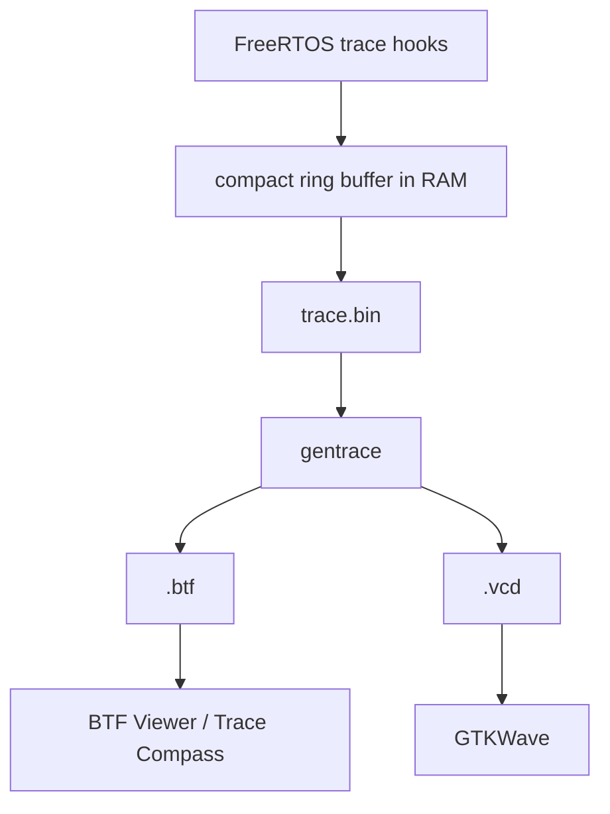
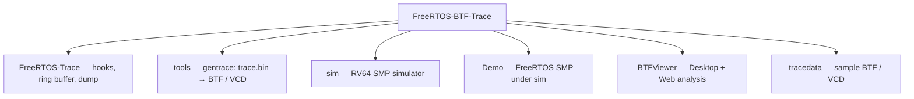

# FreeRTOS-BTF-Trace

FreeRTOS trace recorder for scheduling and synchronization events. Events are kept in a compact RAM ring buffer and can be exported as **BTF** for BTF Viewer / Trace Compass or **VCD** for GTKWave.


## Documentation


```mermaid
flowchart LR
  readme[README] --> porting[PORTING]
  porting --> format[TRACE_FORMAT]
  format --> viewer[BTFViewer]
```

| Document | Contents |
|---|---|
| **README.md** | Build the demo and open a trace |
| **[PORTING.md](PORTING.md)** | Integrate the trace library on another FreeRTOS target |
| **[TRACE_FORMAT.md](TRACE_FORMAT.md)** | `trace.bin` layout and BTF event mapping |
| **[BTFViewer/README.md](BTFViewer/README.md)** | BTF Viewer usage |
| **[BTFViewer/WORKFLOWS.md](BTFViewer/WORKFLOWS.md)** | RTOS analysis workflows |
| **[BTFViewer/AI.md](BTFViewer/AI.md)** | BTF Viewer AI Assistant |

## Overview


```mermaid
flowchart TD
  hooks[FreeRTOS trace hooks] --> ring[compact ring buffer in RAM]
  ring --> bin[trace.bin]
  bin --> gentrace[gentrace]
  gentrace --> btf[.btf]
  gentrace --> vcd[.vcd]
  btf --> viewer[BTF Viewer / Trace Compass]
  vcd --> gtkwave[GTKWave]
```

| Format | Use |
|---|---|
| **BTF** (Best Trace Format) | Scheduling and timing analysis in BTF Viewer or Eclipse Trace Compass |
| **VCD** (Value Change Dump) | Waveform inspection in GTKWave |


[Live demo](https://apps.kuoping.com/btf_viewer.html?demo)

### Repository layout


```mermaid
flowchart TD
  root[FreeRTOS-BTF-Trace]
  root --> traceLib[FreeRTOS-Trace — hooks, ring buffer, dump]
  root --> tools[tools — gentrace: trace.bin → BTF / VCD]
  root --> sim[sim — RV64 SMP simulator]
  root --> demo[Demo — FreeRTOS SMP under sim]
  root --> viewer[BTFViewer — Desktop + Web analysis]
  root --> data[tracedata — sample BTF / VCD]
```

## Quick start

The bundled demo runs on the RISC-V RV64 simulator in `sim/`.

### Toolchain

Install xPack RISC-V GCC. The default path is:

```text
/opt/xpack-riscv-none-elf-gcc-15.2.0-1/bin/riscv-none-elf-gcc
```

Use a different toolchain prefix with:

```bash
make run RISCV_PREFIX=/path/to/riscv-none-elf-
```

### Build and capture

```bash
make run            # single core
make CORES=2 run    # 2-core SMP
make CORES=8 run    # 8-core SMP
```

On the first run, the build clones **FreeRTOS-Kernel V11.3.0**. After the simulator exits, `gentrace` writes:

```text
tracedata/trace.btf
tracedata/trace.vcd
```

### Open the BTF trace

```bash
pip install -r BTFViewer/requirements.txt
python BTFViewer/builds/btf_viewer.py tracedata/trace.btf
```

Sample captures:

```text
example.btf.gz
example-2cores.btf.gz
example-4cores.btf.gz
example-8cores.btf.gz
example-16cores.btf.gz
```

BTF Viewer Desktop and Web accept `.btf`, `.gz`, `.bz2`, and `.zip`.

## Demo workload

`Demo/examples/freertos_test/` contains 11 tests. Tests 1–10 use yields to keep the workload active. Test 11 uses `vTaskDelay` for tickful/tickless-idle comparison.

```bash
make TICKLESS=1 run
```

| # | Test | Exercises |
|---:|---|---|
| 1 | Context-switch stress | Rapid voluntary yields across cores |
| 2 | Mutex contention | Priority-inheritance mutex under load |
| 3 | Counting semaphore + mutex | Mixed synchronization primitives |
| 4 | Task notifications | Direct-to-task notification API |
| 5 | Event groups | Multi-bit event synchronization |
| 6 | Queue stress | Producer / consumer queues |
| 7 | Task priority set | `vTaskPrioritySet` / `traceTASK_PRIORITY_SET` |
| 8 | Priority inversion | L / M / H on one core, 3 rounds (`T8_ROUNDS`) |
| 9 | Task suspend / resume | Suspend while blocked/running (`T9_SUBJECTS × T9_ROUNDS`) |
| 10 | Core affinity | Pin/migrate with `vTaskCoreAffinitySet` |
| 11 | Tickless idle | `vTaskDelay` windows for TICK vs TICKLESS |

Interval id **0** wraps each test from the runner. IDs **1–11** identify the individual tests.

## Viewing traces

### BTF Viewer

BTF Viewer provides task/core timelines, cursors, Statistics, Analysis Findings, migration inspection, Trace Compare, AI-assisted investigation, and export.

```bash
python BTFViewer/builds/btf_viewer.py tracedata/example-8cores.btf.gz
# or open BTFViewer/builds/btf_viewer.html
```

Requirements: Python 3.8+ and PySide6 ≥ 6.4.

See **[BTFViewer/WORKFLOWS.md](BTFViewer/WORKFLOWS.md)** for analysis procedures.

### Trace Compass

Open `tracedata/trace.btf` directly.


### GTKWave

```bash
gtkwave tracedata/trace.vcd
```


## Custom instrumentation

The demo records heap bytes in use on every tick:

```c
btf_traceTAG(0, ...);
```

The value appears in BTF as STI `tag0_event`. Interval start/stop events are used to mark test regions.


SMP traces can also be inspected for task migrations and migration corridors.


## Porting

A port needs a FreeRTOS trace-hook integration, a free-running 32-bit cycle counter, and one of the supported dump modes. Capture starts with `traceSTART()` and ends with `traceEND()`.

See **[PORTING.md](PORTING.md)** for configuration, the time source, dump modes, tags/intervals, and SMP locking.

See **[TRACE_FORMAT.md](TRACE_FORMAT.md)** for the binary layout, event encoding, BTF mapping, and trace-quality flags.

## Related project

A related BareCTF + Trace Compass implementation is [freertos-barectf](https://github.com/gpollo/freertos-barectf).

## License

MIT
