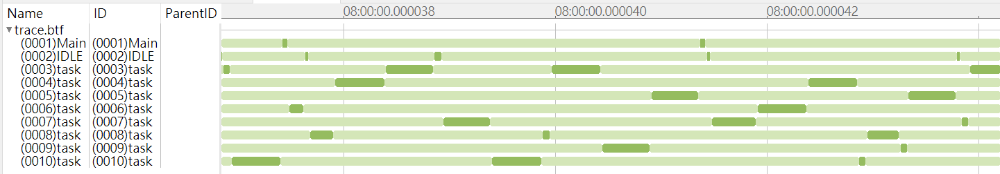
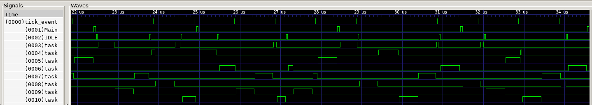

# FreeRTOS-BTF-Trace

[](https://www.codacy.com/gh/kuopinghsu/FreeRTOS-BTF-Trace/dashboard?utm_source=github.com&amp;utm_medium=referral&amp;utm_content=kuopinghsu/FreeRTOS-BTF-Trace&amp;utm_campaign=Badge_Grade)

Generate BTF trace file or VCD waveform for FreeRTOS.

BTF (Best Trace Format) is a CSV-based format used to record and trace at the system level to analyze the timing, performance, and reliability of embedded real-time systems. The spec can be found [here](https://assets.vector.com/cms/content/products/TA_Tool_Suite/Docs/BTF_Specification.pdf).

VCD (Value Change Dump) is an ASCII-based format for dumpfiles generated by EDA logic simulation tools, which can be opened by [GTKWave](http://gtkwave.sourceforge.net) tool.

Tracelyzer from [Percepio](https://percepio.com/tracealyzer/) is the best analysis tools to visualize the real-time execution of tasks and ISRs. However, sometimes we just need a simple solution to find the performance bottleneck. This project provides a simple and extensible framework for this, and most importantly, it is open source and free.

There're another related solutions are using [BareCTF](https://barectf.org/) and [Trace Compass](https://www.eclipse.org/tracecompass/) to trace FreeRTOS system in [freerots-barectf](https://github.com/gpollo/freertos-barectf), convert FreeRTOS Tracelyzer trace recorder traces to LTTng-shaped CTF in [trace-recorder-to-ctf](https://github.com/jonlamb-gh/trace-recorder-to-ctf).

## Build

This is an example to test [srv32](https://github.com/kuopinghsu/srv32) on FreeRTOS. The code can be run on the ISS (Instruction Set Simulator) of srv32 to generate trace data in BTF and VCD format. I use [srv32](https://github.com/kuopinghsu/srv32) to run the test, and this can be easily ported to another platform.

Requirement: Install the toolchains. See details in srv32 [Building toolchains](https://github.com/kuopinghsu/srv32#building-toolchains) section.

The file "trace.btf" and "trace.vcd" will be generated under tracedata folder. Open it by the Trace Compass (for trace.btf) or VCD viewer (for trace.vcd).

    $ make run

## Results

This is a screen shot of [Trace Compass](https://www.eclipse.org/tracecompass/) by reading the BTF trace file. Use the gentrace tool to convert the trace data into BTF format.

    $ gentrace dump.bin trace.btf



This is the VCD waveform showing task switching. Use gentrace tool to generate trace data into VCD format.

    $ gentrace -v dump.bin trace.vcd



## Porting guide

1.  Include FreeRTOS-Trace/FreeRTOS-Trace.h in your FreeRTOSConfig.h.
2.  Provide xGetTime() macro in FreeRTOS-Trace/btf_port.h to report the system time in nanoseconds.
3.  Keep HAVE_SYS_DUMP undefined in FreeRTOS-Trace/btf_port.h.
4.  Compile the code FreeRTOS-Trace/btf_trace.c with your project.
5.  Call traceSTART() in your application to enable trace log.
```c
#if configUSE_TRACE_FACILITY
    traceSTART();
#endif
```
6.  Call traceEND() in your application to disable trace log.
```c
#if configUSE_TRACE_FACILITY
    traceEND();
#endif
```
7.  After the application is built, use readelf to find the location of trace_data. Run the application and dump the memory to a binary file. In this example, you should dump 65572 bytes of data from address 0x21d44.
```c
$ readelf -a task.elf
...
21: 00021d44 65572 OBJECT  LOCAL  DEFAULT    4 trace_data
...
```
8.  Using gentrace tools to convert trace data to BTF file.
```
$ ../../tools/gentrace dump.bin trace.btf
814 events generated
```
9.  Open the BTF file with Trace Compass to view the trace file.

## License

MIT license
